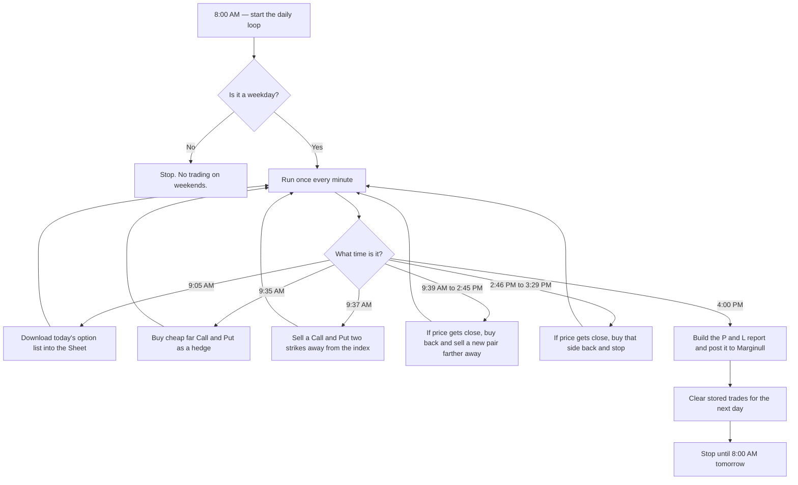
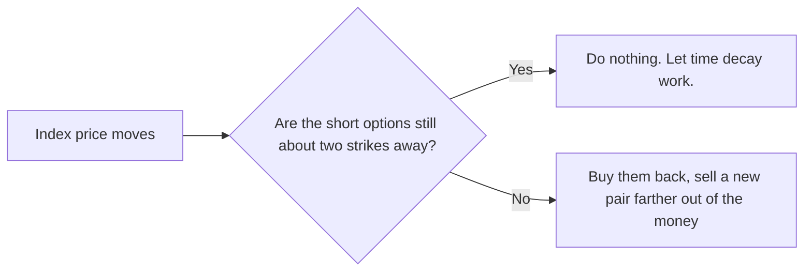

# ⚡ [QUANT-SOURCE-023] Consolidated Quant & Algo Trading Repositories
**Category**: `INDIAN_BROKERS_DHAN_KITE_FYERS` | **Repositories in this Source**: 3
**Generated**: QUANT_BUNDLE_023_INDIAN_BROKERS_DHAN_KITE_FYERS.md | **Target**: NotebookLM 290+ Quant Code Brain

---

## [1/3] Repository: dhan-api-tradingview-webhook-python (`PHASE4-QUANT-013`)
- **Full Name**: `PHASE4-QUANT-013_codetradesalgo-cmyk__dhan-api-tradingview-webhook-python`
- **Description**: Asynchronous ASGI webhook execution engine for Dhan v2 API. Sub-50ms TradingView signal routing for Nifty, BankNifty, and MCX algorithmic trading
- **GitHub Stars**: 4
- **Source Pool**: `phase4_quant_wheels_100`

### Documentation & Overview (README.md)
# Asynchronous Webhook Engine for Dhan API

An institutional-grade, sub-50ms execution engine designed to route TradingView webhooks directly to the Dhan API.

Standard retail architectures built on synchronous frameworks (Flask/Django) suffer from severe input/output blocking, resulting in multi-second slippage during high-volatility market opens. This repository bypasses the WSGI bottleneck entirely by utilizing a pure ASGI framework, enabling true concurrent execution for quantitative strategies.

## Architectural Advantages

* **Concurrent I/O (FastAPI + Uvicorn):** Processes simultaneous webhook payloads asynchronously. If 10 TradingView alerts fire at the exact same millisecond, 0 are queued.
* **Vectorized O(1) Token Caching:** Eliminates database latency. Contract master lists are loaded directly into server RAM as NumPy arrays, allowing instantaneous script-to-token lookups.
* **Deterministic State Recovery:** SQLite implementation prevents duplicate order execution and handles broker-side network timeouts cleanly.
* **Hardened Security:** API credentials are intentionally stripped from the application layer and called dynamically from isolated kernel environments.

## Prerequisite Infrastructure

To deploy this engine without network latency, you cannot run it locally on a Windows machine. You must provision an Ubuntu server located near the NSE exchange servers.

* **Brokerage API:** This engine is strictly mapped to Dhan's v2 API structure. You must have active production API credentials.
* **Linux VPS:** Provision a clean Ubuntu 22.04+ node.
* **TradingView Premium:** Unrestricted, high-frequency webhook transmission requires a paid TradingView tier.

## ⚠️ Deploying to Live F&O Markets?

The open-source engine below handles baseline asynchronous routing. However, to execute Nifty, BankNifty, or MCX options, you must inject dynamic exchange `securityId` tokens into your JSON payloads.

Parsing the 100MB+ Dhan daily master CSV during live market hours will introduce heavy CPU bottlenecks and cause severe execution slippage. Furthermore, hardcoding your expiry dates will break your execution engine when the exchange shifts expiry schedules (e.g., the recent Nifty shift to Tuesdays and BankNifty monthly limitations).

For quants moving to live capital, we have packaged the production-ready options routing layer:

### 📦 [Premium Module: Dynamic F&O Token Mapper & Strike Resolver](https://topmate.io/codetrades_algo/2170763)

* **O(1) Lookup Latency:** Achieves sub-microsecond token mapping via pure Python local memory caching. Bypasses Pandas bloat entirely.
* **Auto-Expiry Discovery:** Automatically parses the exchange master to find the nearest valid weekly expiries (maintenance-free rollovers).
* **Dynamic Strike Resolver:** Mathematically converts live spot prices into valid exchange ATM/OTM strikes instantly for multiple indices.

**[👉 Download the Production Module Here (₹5,999)](https://topmate.io/codetrades_algo/2170763)** — *Instant delivery of the complete Python source code and integration guide.*

## Core Deployment

Once your Ubuntu node is live, run the following commands to construct the environment and ignite the engine.

```bash
# Clone the repository
git clone [https://github.com/codetradesalgo-cmyk/dhan-api-tradingview-webhook-python.git](https://github.com/codetradesalgo-cmyk/dhan-api-tradingview-webhook-python.git) /opt/codetrades-engine
cd /opt/codetrades-engine

# Build the isolated environment
python3 -m venv venv
source venv/bin/activate
pip install -r requirements.txt

# Inject secure credentials
echo 'DHAN_ACCESS_TOKEN="your_production_token_here"' > .env

# Ignite the ASGI workers
uvicorn app:app --host 0.0.0.0 --port 80 --workers 3
```

## Payload Structure

Configure your TradingView webhook alerts to transmit strictly formatted JSON. 

**Endpoint:** `http://[YOUR_VPS_IP]/webhook`

## Disclaimer

This software is for educational and architectural demonstration purposes. Algorithmic trading carries significant financial risk.

### Core Implementation Code & Architecture
#### File: `app.py`
```python
import asyncio
import aiohttp
import sqlite3
import uuid
import numpy as np
import pandas as pd
from fastapi import FastAPI, Request, HTTPException
import logging
import os
from dotenv import load_dotenv

# Load real Dhan API keys from the secure environment file
load_dotenv("/opt/codetrades-engine/.env")

logging.basicConfig(level=logging.INFO, format="%(asctime)s - %(levelname)s - %(message)s")

app = FastAPI()

# --- 1. DETERMINISTIC STATE RECOVERY (The Ledger) ---
def init_db():
    conn = sqlite3.connect("/opt/codetrades-engine/trade_ledger.db")
    c = conn.cursor()
    c.execute("CREATE TABLE IF NOT EXISTS active_trades (transaction_id TEXT PRIMARY KEY, symbol TEXT, status TEXT)")
    conn.commit()
    conn.close()

init_db()

# --- 2. VECTORIZATION (The Memory Cache) ---
class TokenManager:
    def __init__(self):
        logging.info("Initializing NumPy Scrip Master Array...")
        # Simulating the daily CSV load for now
        df = pd.DataFrame({"Symbol": ["NIFTY24000CE", "NIFTY24000PE"], "Token": ["12345", "12346"]})
        self.symbols = df["Symbol"].to_numpy().astype(str)
        self.tokens = df["Token"].to_numpy().astype(str)
        logging.info("NumPy Arrays Loaded. Ready.")

    def get_token(self, symbol: str) -> str:
        idx = np.where(self.symbols == symbol)[0]
        if len(idx) > 0:
            return self.tokens[idx[0]]
        return None

token_manager = TokenManager()

# --- 3. ASYNCHRONOUS API HANDLING (The Execution) ---
async def fire_dhan_order(transaction_id: str, symbol: str, token: str, action: str):
    url = "https://api.dhan.co/orders"
    
    # Securely fetch the API token; avoids hardcoding sensitive data in GitHub
    access_token = os.environ.get("DHAN_ACCESS_TOKEN", "MISSING_TOKEN")
    
    headers = {
        "access-token": access_token,
        "Content-Type": "application/json"
    }
    payload = {
        "correlationId": transaction_id,
        "transactionType": action,
        "exchangeSegment": "NSE_FNO",
        "productType": "MARGIN",
        "orderType": "MARKET",
        "securityId": token,
        "quantity": 25 # 1 Nifty Lot
    }

    async with aiohttp.ClientSession() as session:
        try:
            async with session.post(url, json=payload, headers=headers) as response:
                if response.status == 200:
                    logging.info(f"\033[1;32mFilled {action} for {symbol}. ID: {transaction_id}\033[0m")
                    return "FILLED"
                else:
                    error_data = await response.text()
                    logging.error(f"API Rejected. Status: {response.status}. Reason: {error_data}")
                    return "REJECTED"
        except asyncio.TimeoutError:
            logging.error("Dhan API Timeout. Network dropped packet.")
            return "UNKNOWN"

@app.post("/webhook")
async def webhook_receiver(request: Request):
    try:
        data = await request.json()
    except Exception:
        raise HTTPException(status_code=400, detail="Malformed JSON")

    symbol = data.get("symbol")
    action = data.get("action")

    token = token_manager.get_token(symbol)
    if not token:
        raise HTTPException(status_code=404, detail="Strike token not found")

    transaction_id = str(uuid.uuid4())

    conn = sqlite3.connect("/opt/codetrades-engine/trade_ledger.db")
    conn.execute("INSERT INTO active_trades (transaction_id, symbol, status) VALUES (?, ?, ?)", 
                 (transaction_id, symbol, "PENDING"))
    conn.commit()

    final_status = await fire_dhan_order(transaction_id, symbol, token, action)

    conn.execute("UPDATE active_trades SET status = ? WHERE transaction_id = ?", 
                 (final_status, transaction_id))
    conn.commit()
    conn.close()

    return {"status": final_status, "correlation_id": transaction_id}
```


==================================================


## [2/3] Repository: dhan-appscript-trading (`WHEEL_dhan-appscript-trading`)
- **Full Name**: `dhan-appscript-trading`
- **Description**: 
- **GitHub Stars**: 0
- **Source Pool**: `cloned_trading_wheels`

### Documentation & Overview (README.md)
# dhan

This project is **outdated and no longer maintained**.

It is kept here for historical reference only. Do not run it against a live brokerage account.

## What this was

A Google Apps Script, attached to a Google Sheet, that traded index options automatically through the [Dhan](https://dhan.co) API.

After the market closed, it posted a daily profit-and-loss report to the Marginull community, which ran on [Flarum](https://flarum.org) (open-source forum software). **The Marginull forum no longer exists.**

The strategy was nicknamed **Moneyness Ninja**: sell options that are a bit out of the money, and try to keep them out of the money until expiry so the premium (time decay) is kept.

## How a trading day worked

Each weekday the script traded **that day's weekly expiry** on one index:

| Day | Index |
| --- | --- |
| Monday | MIDCPNIFTY |
| Tuesday | FINNIFTY |
| Wednesday | BANKNIFTY |
| Thursday | NIFTY |
| Friday | SENSEX |

Weekends were skipped.

Rough timeline:

1. **8:00 AM** — A daily trigger starts a loop that runs once every minute.
2. **9:05 AM** — Download Dhan's option list (which contracts exist today) into the Sheet. Also check whether the API key is about to expire.
3. **9:35 AM** — Buy cheap, far out-of-the-money Call and Put options. These were a hedge, not the main trade.
4. **9:37 AM** — Sell a Call and a Put that sit about **two strikes** away from the current index price. Those IDs are saved in the Sheet so later steps know what is open.
5. **9:39 AM – 2:45 PM** — Every minute, check the index. If price has moved too close to either short option, buy both back and sell a new pair two strikes away again.
6. **2:46 PM – 3:29 PM** — Last safety window. If price is getting close to a remaining short option, buy that side back and stop adjusting.
7. **4:00 PM** — Pull the day's positions and orders from Dhan, write a report, post it to Marginull as a new Flarum discussion, then clear the stored trade cells for tomorrow.



The main idea in one picture:



Orders went through Dhan (`https://api.dhan.co`). Activity was logged in a `Log` sheet. Errors could also send an email alert.

## Marginull and Flarum

**The Marginull forum no longer exists.** Links to `marginull.com` below are historical only.

Marginull was a trading community built on **Flarum**. Flarum exposes a REST API, so the script could create forum posts without opening a browser.

At 4:00 PM the script:

1. Fetched the day's **positions** and **orders** from Dhan.
2. Stored them in the `Positions` and `Orders` sheets.
3. Built a markdown report: P&L table, trade list, and a short note on how volatile the day felt.
4. `POST`ed that report to `https://marginull.com/api/discussions` as a new discussion.

The title looked like:

`Day 12: P&L and Trade Analysis Report for Moneyness Ninja Strategy`

Posts were tagged so they showed up with the other P&L reports on the forum. The report text also linked back to a Moneyness Ninja strategy thread on Marginull.

API keys in this repo are placeholders only. Real Dhan and Flarum credentials lived in the Google Apps Script editor, not in git.

## Google Sheet tabs

The script expected these sheets in the same spreadsheet:

| Sheet | Used for |
| --- | --- |
| `Scrip` | Today's option contracts downloaded from Dhan |
| `Data` | Open Call/Put IDs, symbols, strike values, day counter |
| `Positions` | End-of-day positions for the report |
| `Orders` | End-of-day trades for the report |
| `Log` | Timestamped messages from each step |

## Files

| File | Role |
| --- | --- |
| `master.gs` | Shared names, URLs, and lot size |
| `scheduler.gs` | Daily clock and which function runs when |
| `importMasterCSV.gs` | Load Dhan's option list |
| `getSecurityID.gs` | Look up a contract ID from the Sheet |
| `getRealtimePrice.gs` | Read live/index option prices from Dhan |
| `executeOrder.gs` | Place, check, or cancel an order |
| `buyDecayOrder.gs` | Morning hedge buys |
| `firstShortOrder.gs` | First short Call and Put |
| `bracketOrder.gs` | Intraday adjust / roll |
| `lastSquareOffOrder.gs` | Late-day safety exit |
| `postMarginull.gs` | Build the report and post it to Flarum |
| `logMessage.gs` | Logging, email alerts, end-of-day cleanup |
| `otherRepo.gs` | Old experiments. Not used by the live flow. |


==================================================


## [3/3] Repository: dhan-bot-research (`WHEEL_dhan-bot-research`)
- **Full Name**: `dhan-bot-research`
- **Description**: 
- **GitHub Stars**: 0
- **Source Pool**: `cloned_trading_wheels`

### Documentation & Overview (README.md)
# Dhan Trading Bot — India Research

Sourced decision memo on building a personal trading bot in India using
[Dhan](https://dhan.co) (DhanHQ API).

- **Live page (Vercel, no-store cache headers):** https://dhan-bot-research.vercel.app/
- `research_notes/report.md` — full research report with sources
- `research_notes/notes/` — per-source research notes

Covers the Dhan API surface, costs and rate limits, SEBI's 2026 retail
algo-trading framework (static-IP requirement, exchange algo registration),
market segments, sandbox/testing workflow, recommended AWS Mumbai
architecture, the top 5 gotchas, broker comparison (Dhan vs Zerodha Kite
Connect vs Upstox vs Angel One SmartAPI), and the open-source projects
worth studying.

> Unverified points are marked as open questions in the memo — confirm on
> Dhan's own charges/developer pages before sizing anything.


==================================================
