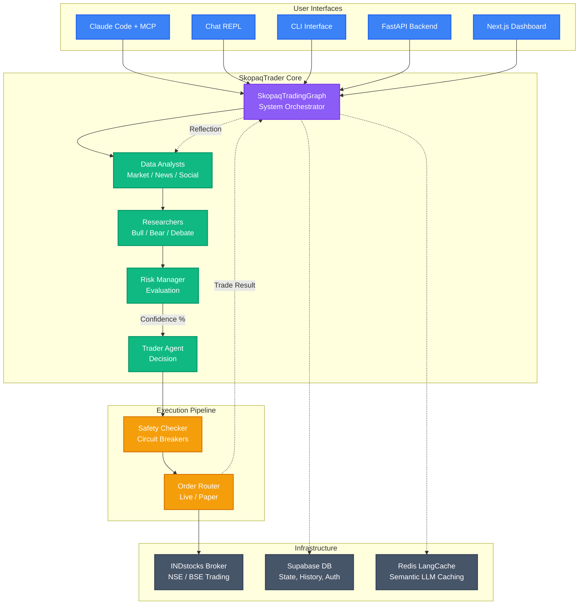
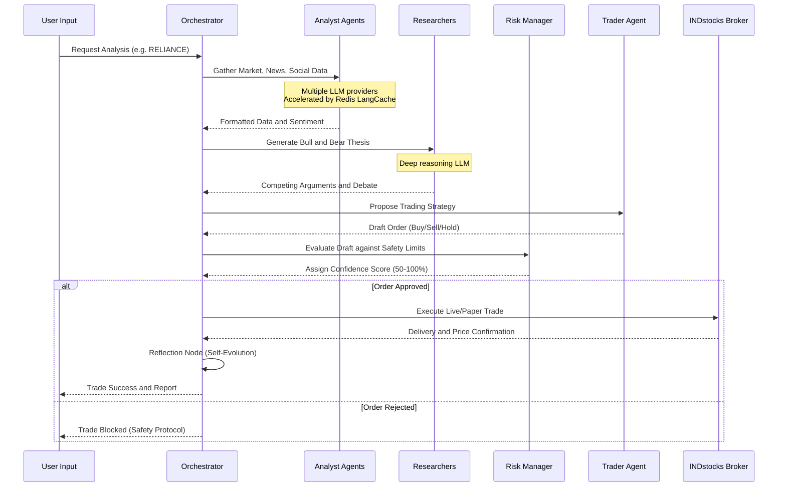
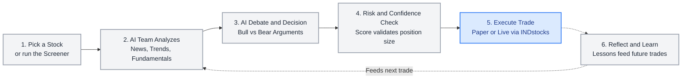
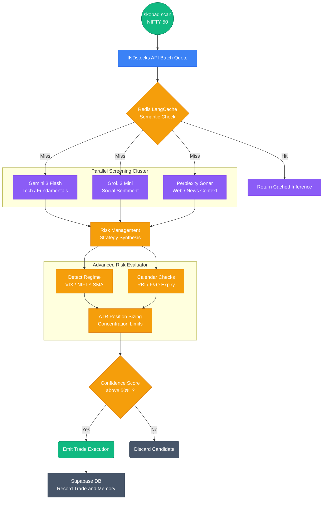
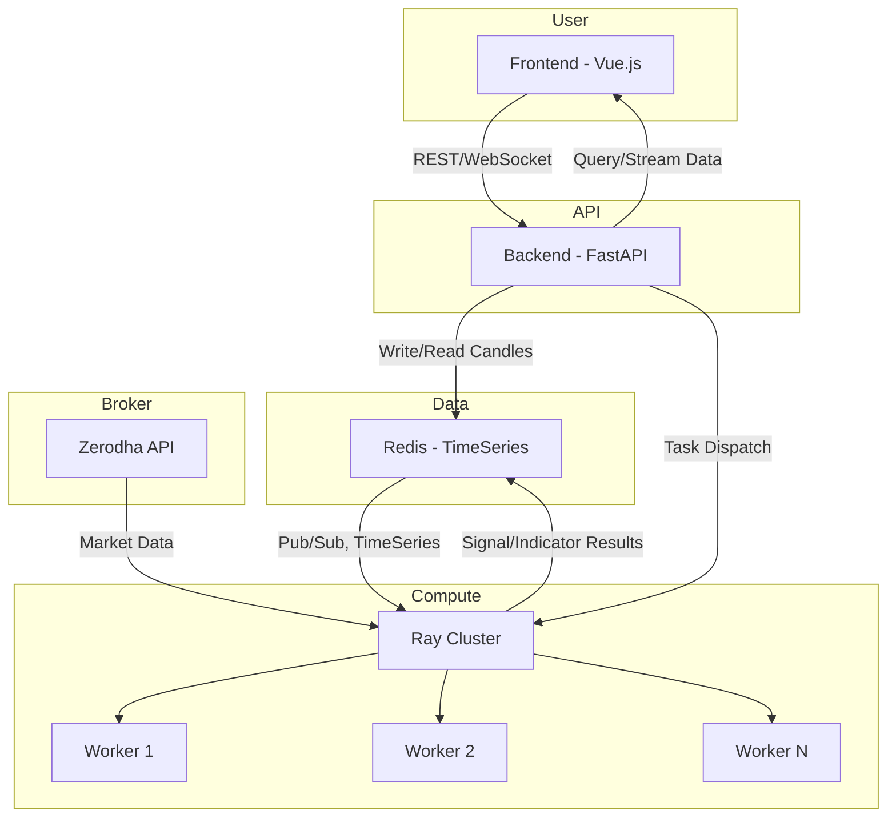

# ⚡ [QUANT-SOURCE-046] Consolidated Quant & Algo Trading Repositories
**Category**: `INDIAN_BROKERS_DHAN_KITE_FYERS` | **Repositories in this Source**: 3
**Generated**: QUANT_BUNDLE_046_INDIAN_BROKERS_DHAN_KITE_FYERS.md | **Target**: NotebookLM 290+ Quant Code Brain

---

## [1/3] Repository: skopaqtrader (`PHASE4-QUANT-165`)
- **Full Name**: `PHASE4-QUANT-165_Skopaq-AI__skopaqtrader`
- **Description**: Open-source AI algorithmic trading platform for Indian equities. Multi-agent LLM pipeline with autonomous daemon, INDstocks broker integration, and AI-powered position management. Built on TradingAgents. For educational/research purposes only — not financial advice.
- **GitHub Stars**: 15
- **Source Pool**: `phase4_quant_wheels_100`

### Documentation & Overview (README.md)
<div align="center">


# SkopaqTrader

**An open-source AI algorithmic trading platform for Indian equities**

Built on [TradingAgents](https://github.com/TauricResearch/TradingAgents) (Apache 2.0) by TauricResearch

[](LICENSE)
[](https://python.org)
[](https://langchain-ai.github.io/langgraph/)

</div>

> [!CAUTION]
> **IMPORTANT LEGAL DISCLAIMER**
>
> This software is provided **strictly for educational and research purposes only**. It is **NOT** financial advice, investment advice, or trading advice of any kind.
>
> - **No guarantees of profit.** Algorithmic trading involves substantial risk of financial loss. Past performance does not guarantee future results.
> - **You are solely responsible** for any trades executed using this software, whether in paper or live mode.
> - **The authors and contributors are not** registered investment advisors, broker-dealers, or financial planners under SEBI, SEC, or any regulatory body.
> - **Use at your own risk.** By using this software, you acknowledge that you understand the risks of automated trading and accept full responsibility for all outcomes.
>
> *If you need financial advice, consult a SEBI-registered investment advisor.*

---

## Overview

SkopaqTrader extends the [TradingAgents](https://github.com/TauricResearch/TradingAgents) multi-agent LLM framework with Indian equity market support, multi-model tiering, broker integration, and an experience-driven execution pipeline.

**Key capabilities:**

- **Claude Code Integration** — Native MCP server with 18 tools + custom slash commands (`/analyze`, `/quote`, `/scan`, `/portfolio`, `/trade`). Run the full 15-agent analysis pipeline using Claude's own reasoning at zero extra LLM cost.
- **Interactive AI Chat** — Claude Code-style REPL (`skopaq chat`) with streaming responses, tool panels, human-in-the-loop trade confirmation, and LangGraph checkpointing.
- **Ollama Local Fallback** — Run analyst roles on local models via Ollama/MLX for offline operation and zero API cost.
- **Post-Trade Reflection Loop** — Reflection node analyzes past trades and injects history into the analyst context, enabling the system to incorporate lessons from wins and losses over time.
- **Persistent Agent Memory** — BM25-indexed memory store backed by Supabase for long-term strategic recall across all agent roles.
- **Multi-agent analysis** — Analyst team (market, news, social, fundamentals), bull/bear researchers, risk manager, and trader agent collaborate via LangGraph.
- **Multi-model tiering** — Per-role LLM assignment across multiple providers for cost optimization and capability matching. See the [model tiering table](#multi-model-tiering) below for details.
- **Semantic LLM Caching** — Built-in Redis LangCache provides significant speedup (up to ~45x in our benchmarks) on repeated queries and reduces API costs, with automatic semantic invalidation on memory updates.
- **Advanced Risk Management** — Features ATR-based position sizing, India VIX/NIFTY SMA market regime detection, NSE event calendar handling (F&O expiry, RBI policy), and sector concentration limits.
- **Live Algo Trading** — Integrates with the INDstocks broker API for execution on Indian equities (NSE/BSE). Start in paper mode, graduate to live when ready.
- **Confidence-Scored Position Sizing** — The Risk Manager evaluates trades with strict confidence scores (50-100%). Position sizes are dynamically scaled based on this AI confidence level.
- **Parallel Scanner Engine** — 30-second multi-model screening cycle on the NIFTY 50 watchlist, wired directly to INDstocks batch quotes and 3 LLM screeners (Gemini, Grok, Perplexity) running concurrently.
- **Safety-First Execution** — Immutable position limits, persistent drawdown tracking, daily loss circuit breakers, and small-account exemptions.
- **Autonomous Trading Daemon** — Full session orchestrator: PRE_OPEN → SCANNING → ANALYZING → TRADING → MONITORING → CLOSING → REPORTING. Runs unattended on a cron schedule with graceful SIGTERM handling and tighter safety rules.
- **Three-Tier Position Monitor** — Hard stop-loss, AI sell analyst, and EOD safety net with optional trailing stops and configurable poll intervals.
- **Min Profit Gate** — Two-layer protection against brokerage-eating-profit: prompt guidance to the sell analyst LLM + hard override in the monitor that blocks sells when net profit (after estimated brokerage) is below threshold.
- **Crypto Support** — On-chain (Blockchair), DeFi/tokenomics (DeFiLlama/CoinGecko), and funding rate (Binance Futures) analysts activate when `asset_class=crypto`.
- **Blockchain Infrastructure** — Live Binance trading, WebSocket real-time feeds, gas oracles (ETH/Polygon/Arbitrum/Optimism), whale transaction alerts, and multi-exchange abstraction layer.


*Dashboard for monitoring agent workflows, market scanning, and trade execution.*

- **Paper → Live pipeline** — Start paper, graduate to live when ready

> **Reminder:** See the [full disclaimer](#important-legal-disclaimer) at the top. This is a research tool, not a trading recommendation system.

## 🏗️ Technical Architecture



*High-level overview of the SkopaqTrader architecture, connecting the user interfaces to the multi-agent AI team and the INDstocks execution engine.*

### 🤖 AI Agent Workflow


<br/>
<sub>*Conceptual representation of the high-speed data flow between the AI Analyst agents, debate researchers, and the core routing system.*</sub>



*The step-by-step collaborative workflow of our AI agent team, from data gathering to safe execution.*

### 🚀 Usage Lifecycle (For Beginners)



*A simple mental model of how SkopaqTrader operates, making complex algorithmic trading easy to understand.*

### 🔍 Deep-Dive: Scanner Engine & Advanced Risk


<br/>
<sub>*Conceptual UI of the SkopaqTrader scanner engine processing live NIFTY 50 metrics, sentiment scores, and confidence data.*</sub>

The real power of SkopaqTrader lies in its parallel scanner and dynamic risk management logic. When running `skopaq scan`, the system doesn't rely on just one LLM or simple heuristics. It queries multiple models simultaneously while injecting Indian market regime rules.



### Multi-Model Tiering

| Agent Role | Primary Model | Fallback | Local Fallback |
|------------|---------------|----------|----------------|
| Market / Fundamentals Analyst | Gemini 3 Flash | — | Ollama (auto) |
| Social Analyst | Grok 3 Mini (via OpenRouter) | Gemini 3 Flash | Ollama (auto) |
| News Analyst | Gemini 3 Flash | — | Ollama (auto) |
| Research Manager | Claude Opus 4.6 | Gemini 3 Flash | — (quality critical) |
| Risk Manager | Claude Opus 4.6 | Gemini 3 Flash | — (quality critical) |
| Chat Brain | Claude Opus 4.6 | Gemini 3 Flash | Ollama (auto) |
| Bull / Bear / Debate Researchers | Gemini 3 Flash | — | Ollama (auto) |
| Trader | Gemini 3 Flash | — | Ollama (auto) |
| Sell Analyst | Gemini 3 Flash | — | Ollama (auto) |
| Scanner Screeners | Gemini 3 Flash, Grok 3 Mini, Perplexity Sonar | (concurrent) | — |

> **Note:** Perplexity Sonar is used only in the scanner (plain prompts). It does not support tool calling, so it cannot serve as an analyst in the LangGraph agent pipeline.
>
> **Ollama fallback** activates only when `SKOPAQ_OLLAMA_ENABLED=true` and Ollama is running locally. Judge roles (Research Manager, Risk Manager) never fall back to local models.

### Blockchain Infrastructure

SkopaqTrader includes comprehensive blockchain infrastructure for crypto trading:

| Feature | Module | Description |
|---------|--------|-------------|
| **Live Trading** | `skopaq/broker/binance_auth.py` | Authenticated Binance API for spot trading with API keys |
| **Real-Time Feeds** | `skopaq/broker/binance_ws.py` | WebSocket streams for ticker, trades, order book, klines |
| **Gas Oracle** | `skopaq/blockchain/gas.py` | ETH, Polygon, Arbitrum, Optimism gas prices + tx cost estimates |
| **Whale Alerts** | `skopaq/blockchain/whales.py` | Large transaction monitoring for BTC, ETH, SOL |
| **Multi-Exchange** | `skopaq/broker/exchange.py` | Unified abstraction layer (Binance, Coinbase, Kraken) |

```python
# Live Binance trading
from skopaq.broker import BinanceAuthClient

async with BinanceAuthClient(api_key="...", api_secret="...") as client:
    await client.place_order("BTCUSDT", "BUY", 0.001, 50000.0)

# Real-time price via WebSocket
from skopaq.broker import BinanceWS

ws = BinanceWS()
async for ticker in ws.ticker_stream("BTCUSDT"):
    print(f"BTC: ${ticker.price}")

# Gas oracle
from skopaq.blockchain import get_gas_price, get_gas_estimate

gas = await get_gas_price("ETH")
estimate = await get_gas_estimate("ETH", "USDT transfer")

# Whale alerts
from skopaq.blockchain import check_whale_alerts

alerts = await check_whale_alerts("ETH", min_value_usd=100000)
```

## Installation

### Prerequisites

- Python 3.11+
- API keys for at least one LLM provider (Google Gemini recommended as minimum)

### Setup

```bash
git clone https://github.com/bvkio/skopaqtrader.git
cd skopaqtrader

# Create virtual environment
python -m venv .venv
source .venv/bin/activate  # macOS/Linux

# Install dependencies
pip install -e ".[dev]"

# Configure environment
cp .env.example .env
# Edit .env with your API keys
```

### Required API Keys

At minimum, set `GOOGLE_API_KEY` for Gemini 3 Flash (used as default/fallback for all roles).

For full multi-model tiering:

```bash
GOOGLE_API_KEY=...          # Gemini 3 Flash (all analyst roles)
ANTHROPIC_API_KEY=...       # Claude Opus 4.6 (research/risk manager)
OPENROUTER_API_KEY=...      # Grok + Perplexity Sonar (social + news)
```

See [`.env.example`](.env.example) for all configuration options.

## Usage

> [!WARNING]
> All trading commands (live or paper) are **at your own risk**. The AI agents may produce incorrect signals. Always verify positions manually and never risk capital you cannot afford to lose.

### CLI

```bash
# System health check
skopaq status

# Analyze a stock (no execution)
skopaq analyze RELIANCE
skopaq analyze TATAMOTORS --date 2026-02-28

# Analyze + execute (paper mode by default)
skopaq trade RELIANCE

# Run scanner cycle
skopaq scan --max-candidates 5

# Autonomous daemon (full session: scan → trade → monitor → close)
# WARNING: The daemon trades autonomously. Use paper mode until you are confident.
skopaq daemon --once --paper           # Single paper session, run immediately
skopaq daemon --dry-run                # Scanner only, print candidates, exit
skopaq daemon --once --max-trades 1    # Live mode, 1 trade max (requires confirmation)

# Position monitor (attach to existing open positions)
skopaq monitor                         # Monitor all open positions until EOD

# Start API server
skopaq serve --port 8000

# Token management (INDstocks broker)
skopaq token set <your-token>
skopaq token status
```

### Python API

```python
from skopaq.config import SkopaqConfig
from skopaq.graph.skopaq_graph import SkopaqTradingGraph

config = SkopaqConfig()
graph = SkopaqTradingGraph(config)

# Analysis only
result = await graph.analyze("RELIANCE", "2026-03-01")
print(result.signal)

# Analysis + execution
result = await graph.analyze_and_execute("RELIANCE", "2026-03-01")
print(result.execution)
```

### Interactive Chat (Claude Code-style REPL)

```bash
# Start the interactive AI trading assistant
skopaq chat                    # Paper mode (default)
skopaq chat --live             # Live mode (with confirmation)

# Inside the REPL:
> what should I trade today?   # Natural language → AI reasons + calls tools
> /quote RELIANCE              # Instant quote (no LLM call)
> /scan 10                     # Top 10 market candidates
> /portfolio                   # Show positions + P&L
> /analyze TCS                 # Full multi-agent analysis
> /mode live                   # Switch to live mode (confirmation required)
```

## Claude Code Integration (MCP + Skills)

SkopaqTrader integrates natively with [Claude Code](https://claude.ai/code) as an MCP server + custom slash commands. This turns Claude Code into a **full-featured trading terminal** — with Claude's own reasoning powering the multi-agent analysis pipeline at zero extra LLM cost.

### Quick Setup (3 steps)

**Step 1: Install SkopaqTrader**

```bash
git clone https://github.com/samuelvinay91/skopaqtrader.git
cd skopaqtrader
pip install -e .
cp .env.example .env   # Add your API keys
```

**Step 2: Register MCP Server**

Add to your `~/.claude.json` (or run `/mcp add` in Claude Code):

```json
{
  "mcpServers": {
    "skopaq": {
      "command": "python3",
      "args": ["-m", "skopaq.mcp_server"]
    }
  }
}
```

**Step 3: Restart Claude Code**

Open Claude Code in the `skopaqtrader` directory. The MCP server starts automatically. You'll see 18 trading tools available.

### Custom Slash Commands (Skills)

These are pre-built in `.claude/skills/` and available immediately:

| Command | What it does |
|---------|-------------|
| `/quote RELIANCE` | Real-time stock quote via MCP |
| `/analyze TCS` | Full 15-agent analysis pipeline — Claude reasons through 4 analysts, bull/bear debate, risk debate, and final decision using its own LLM |
| `/scan` | Market scanner — finds top trading candidates |
| `/portfolio` | Shows positions, holdings, funds, P&L |
| `/trade INFY` | Analysis + safety check + paper execution (with confirmation) |

### MCP Tools (18 available)

All tools are callable by Claude Code natively. Read-only tools are auto-approved via `.claude/settings.json`:

| Category | Tools |
|----------|-------|
| **Market Data** | `get_quote`, `get_historical` |
| **Portfolio** | `get_positions`, `get_holdings`, `get_funds`, `get_orders` |
| **Analysis** | `analyze_stock`, `scan_market`, `check_safety` |
| **Execution** | `place_order` (paper/live, safety-checked) |
| **Data Pipeline** | `gather_market_data`, `gather_news_data`, `gather_fundamentals_data`, `gather_social_data`, `gather_all_analysis_data` |
| **Memory** | `recall_agent_memories`, `save_trade_reflection` |
| **System** | `system_status` |

### Dual-Mode Architecture

SkopaqTrader has two execution paths for the same multi-agent pipeline:

```
┌─────────────────────────────────────────────────────────┐
│ Claude Code Mode (zero LLM cost)                        │
│                                                         │
│  /analyze RELIANCE                                      │
│    → gather_all_analysis_data (MCP) → raw data          │
│    → Claude reasons as 4 analysts                       │
│    → Claude runs bull/bear debate                       │
│    → Claude acts as research manager (judge)             │
│    → Claude runs 3-way risk debate                      │
│    → Claude acts as risk manager → BUY/SELL/HOLD + %    │
│    → check_safety (MCP) → validated                     │
│                                                         │
│  Uses: Claude's own LLM for all reasoning               │
│  Cost: $0 additional (Claude Code subscription only)    │
│  Time: ~30s data fetch + Claude's reasoning             │
└─────────────────────────────────────────────────────────┘

┌─────────────────────────────────────────────────────────┐
│ API Mode (separate LLM calls)                           │
│                                                         │
│  skopaq analyze RELIANCE                                │
│    → SkopaqTradingGraph.analyze()                       │
│    → 4 analyst LLM calls (Gemini Flash)                 │
│    → Bull/Bear researcher calls (Gemini Flash)          │
│    → Research Manager call (Claude Opus API)            │
│    → Trader call (Gemini Flash)                         │
│    → 3 risk debater calls (Gemini Flash)                │
│    → Risk Manager call (Claude Opus API)                │
│                                                         │
│  Uses: Separate API calls to Gemini/Claude/Grok         │
│  Cost: ~$0.20-0.50 per analysis                         │
│  Time: 2-5 minutes                                      │
└─────────────────────────────────────────────────────────┘
```

Both modes use the **same data sources** and the **same agent prompts** — the only difference is who does the reasoning.

### Ollama Local Model Fallback

For offline operation or zero-cost inference, SkopaqTrader supports local models via [Ollama](https://ollama.ai):

```bash
# Install Ollama (macOS)
brew install ollama
ollama pull mistral    # or any model

# Enable in SkopaqTrader
export SKOPAQ_OLLAMA_ENABLED=true
skopaq chat            # Uses local model as fallback when cloud APIs fail
```

Local models serve as the **last fallback** in the provider chain. Judge roles (research_manager, risk_manager) skip local models to preserve reasoning quality.

### OpenClaw Integration

SkopaqTrader also integrates with [OpenClaw](https://openclaw.ai) for multi-channel access via WhatsApp, Telegram, and Slack. See `openclaw.json` for configuration.

### Upstream TradingAgents (Direct)

The vendored upstream is fully functional:

```python
from tradingagents.graph.trading_graph import TradingAgentsGraph
from tradingagents.default_config import DEFAULT_CONFIG

ta = TradingAgentsGraph(debug=True, config=DEFAULT_CONFIG.copy())
_, decision = ta.propagate("NVDA", "2026-01-15")
print(decision)
```

## Project Structure

```
skopaqtrader/
├── tradingagents/              # Vendored upstream (TradingAgents v0.2.0)
│   ├── agents/                 # Analyst, researcher, trader, risk agents
│   │   ├── analysts/           # Market, news, social, fundamentals + crypto analysts
│   │   ├── researchers/        # Bull/bear researchers
│   │   ├── managers/           # Research + risk managers
│   │   ├── risk_mgmt/          # Aggressive/conservative/neutral debators
│   │   └── trader/             # Final trade decision agent
│   ├── graph/                  # LangGraph orchestration + reflection
│   ├── dataflows/              # Data vendors (yfinance, INDstocks, crypto APIs)
│   └── llm_clients/            # LLM factory (OpenAI, Google, Anthropic, etc.)
│
├── skopaq/                     # SkopaqTrader extensions
│   ├── agents/                 # Sell analyst (AI exit decisions)
│   ├── api/                    # FastAPI backend server
│   ├── blockchain/             # Gas oracle, whale alerts
│   ├── broker/                 # INDstocks REST/WebSocket + Binance + paper engine
│   ├── chat/                   # Interactive chatbot (REPL, tools, agent, bridge)
│   ├── cli/                    # Typer CLI (analyze, trade, scan, daemon, monitor, chat)
│   ├── db/                     # Supabase client + repositories
│   ├── execution/              # Executor, safety checker, order router, daemon, monitor
│   ├── graph/                 
... [TRUNCATED README]

### Core Implementation Code & Architecture
#### File: `tests/__init__.py`
```python

```

#### File: `tests/unit/__init__.py`
```python

```

#### File: `tests/unit/llm/__init__.py`
```python

```

#### File: `tests/unit/broker/__init__.py`
```python

```

#### File: `tests/unit/memory/__init__.py`
```python

```

#### File: `tests/unit/chat/__init__.py`
```python

```


==================================================


## [2/3] Repository: next-gen-algo-trading-bot (`PHASE4-QUANT-163`)
- **Full Name**: `PHASE4-QUANT-163_studiogangster__next-gen-algo-trading-bot`
- **Description**: AI-powered, real-time NSE algorithmic trading engine with Zerodha integration, Redis caching, and live indicator/signal computation.
- **GitHub Stars**: 36
- **Source Pool**: `phase4_quant_wheels_100`

### Documentation & Overview (README.md)
# Next Gen Trading Engine

A full-stack trading dashboard for live and historical market data visualization, featuring a Vue.js frontend with real-time charting and a Python backend with Zerodha integration and Redis storage.

Designed to be the core engine for AI trading bots—enabling lightning-fast execution, real-time signal generation, position management, and rapid strategy development and deployment.

---

## Features

- **Per-Instrument Parallel Fetching**: Each instrument's data is fetched in a separate worker process, eliminating rate limits and bottlenecks. Data is cached and persisted independently for maximum reliability and throughput.
- **Live & Historical Charting**: Interactive candlestick charts with infinite scroll for historical data and real-time updates.
- **Real-Time Polling & Upsert**: Frontend polls for the latest candles every second (configurable), upserting all of today's data to ensure accuracy and deduplication.
- **Scroll-Back Pagination**: Load older candles by scrolling left; chart preserves your scroll position after data loads, for a seamless experience.
- **Backend Sync**: Python backend fetches both historical and real-time data from Zerodha, stores in Redis, and serves via a fast REST API.
- **Partitioned Data Fetching**: Backend supports a partition timestamp to precisely coordinate historical and real-time sync, avoiding overlap or gaps.
- **Multi-Symbol, Multi-Timeframe**: Easily add/remove charts for different symbols and timeframes from the UI.
- **Customizable Polling Interval**: Adjust how frequently the frontend polls for new data.
- **Accurate Data Handling**: Today's candles are always upserted, so late-arriving or corrected data is reflected instantly.
- **Real-Time Indicators & Signal Generation**: Compute indicators and generate trading signals in real time using the cached data in Redis.
- **Responsive UI**: Built with Vue 3 and Vite for fast, modern, and mobile-friendly charting.
- **Extensible Architecture**: Modular Python and Vue codebase, easy to extend for new brokers, strategies, or chart types.
- **Open Source & Developer Friendly**: No vendor lock-in, easy to self-host, and well-documented for rapid onboarding.

---


## System Architecture

> **Note:** The following Mermaid diagram is GitHub-compatible. For best results, view this README on GitHub.



---


## Why This Bot is Better Than Any Other in the Market

- **True Real-Time Upsert**: Unlike most dashboards that only append new candles, this bot upserts all of today's data on every poll, ensuring you always see the most accurate and up-to-date chart—even if the broker corrects or backfills data.
- **Scroll Position Preservation**: When you scroll back to load historical data, your view is preserved, making deep analysis and backtesting much more user-friendly.
- **Partitioned Sync for Zero Data Loss**: The backend's partition timestamp logic ensures there are no gaps or overlaps between historical and real-time data, a common problem in other solutions.
- **Full Transparency & Extensibility**: 100% open source, with a modular codebase. You can audit, extend, or self-host without restrictions.
- **Multi-Symbol, Multi-Timeframe, Multi-Chart**: Instantly add or remove charts for any supported symbol or timeframe, with independent polling and pagination.
- **Lightning Fast & Lightweight**: Uses Redis for blazing-fast data access and Vue 3 + Vite for a snappy frontend experience.
- **Plug-and-Play for Zerodha**: Out-of-the-box support for Zerodha, with easy extension to other brokers.
- **Developer Experience First**: Clean code, clear documentation, and a focus on making it easy for you to build, debug, and extend.
- **No Vendor Lock-In, No Hidden Fees**: Unlike commercial charting solutions, you control your data, your infra, and your roadmap.

---

## Why Algorithmic Trading is Difficult on Broker Platforms

- **Limited APIs & Rate Limits**: Most broker platforms restrict API access, enforce strict rate limits, and provide limited historical data, making robust backtesting and live trading hard.
- **Latency & Delays**: Broker dashboards and APIs often introduce significant latency, which can be fatal for high-frequency or low-latency strategies.
- **Lack of Customization**: Broker UIs are closed-source and inflexible, making it impossible to add custom indicators, strategies, or data sources.
- **Vendor Lock-In**: Data and logic are tied to the broker's infrastructure, making migration or integration with other tools difficult.
- **Poor Data Quality**: Many platforms do not upsert/correct historical data, leading to inaccurate backtests and live signals.
- **No True Real-Time Sync**: Most dashboards only append new data, missing corrections or late-arriving candles.
- **Scalability Issues**: Broker dashboards are not designed for running multiple strategies, symbols, or timeframes in parallel.

---

## How This Project Solves Those Challenges

- **Full Data Ownership**: All data is stored in your own Redis instance, not on a broker's server. You can export, analyze, or migrate it as you wish.
- **Ultra-Low Latency**: Direct integration with Redis and efficient polling means you get the latest data with minimal delay.
- **Customizable & Extensible**: Add your own indicators, strategies, or even new broker integrations with minimal effort.
- **Accurate & Reliable**: Upsert logic ensures your charts and strategies always use the most accurate, corrected data available.
- **No Vendor Lock-In**: 100% open source and self-hosted—migrate, fork, or extend as needed.
- **Parallel & Scalable**: Run multiple charts, symbols, and strategies in parallel, with independent polling and data streams.
- **Modern, Lightweight Stack**: Vue 3 + Vite frontend and Python FastAPI backend are easy to deploy, scale, and maintain.

---

## Data Architecture & Real-Time Analytics

- **Redis as a Mirror for All Data**: The backend maintains a complete mirror of both historical and real-time market data in Redis. Every candle, tick, and update is cached, ensuring instant access for both the frontend and any analytics or trading logic.
- **Unified Data for Indicators & Signals**: Because all data (historical and real-time) is available in Redis, you can compute indicators (like moving averages, RSI, SuperTrend, etc.) and generate trading signals in real time, without waiting for slow API calls or risking missing data.
- **Real-Time Signal Generator**: The architecture is designed to support real-time signal generation—run your strategies directly on the cached data, and trigger alerts or trades with minimal latency.
- **Extensible for Custom Analytics**: Add your own indicator calculations, signal logic, or even machine learning models, all powered by the fast, unified Redis cache.
- **Consistent Data for All Consumers**: Whether it's the chart UI, a backtest, or a live trading bot, all components read from the same, up-to-date data source.

---


**Legend:**
- **Frontend (Vue.js):** User interface for charts, controls, and live data.
- **Backend (FastAPI):** Handles API requests, data ingestion, and orchestration.
- **Redis (TimeSeries):** Stores all historical and real-time candles, supports fast queries and pub/sub. Both the backend and Ray workers read and write to Redis.
- **Ray Cluster:** Distributed compute for real-time indicators, signal generation, and heavy analytics. Ray workers both read from and write results/signals to Redis.
- **Workers:** Each Ray worker can run a strategy, indicator, or ML model in parallel. Each instrument's data fetch runs in its own worker, ensuring no rate limit or bottleneck issues.
- **Zerodha API:** Source of live and historical market data.

---

## Lightweight & Scalable by Design

- **Minimal Resource Usage**: The backend is stateless and leverages Redis for fast, in-memory data access. The frontend is a single-page app built for speed.
- **Horizontal Scalability**: Easily scale out by running multiple backend or frontend instances behind a load balancer.
- **Cloud & Local Ready**: Deploy on your laptop, a cloud VM, or a Kubernetes cluster—no heavy dependencies or vendor lock-in.
- **Designed for Growth**: Add more symbols, timeframes, or users without a performance hit.

---

## Project Structure

```
.
├── brokers/                # Zerodha and broker integration logic
├── core/                   # Core trading/aggregation logic
├── dashboard/              # Backend dashboard and visualization
├── storage/                # Redis and data storage utilities
├── strategies/             # Trading strategies
├── tradingview_dashboard/
│   ├── backend/            # FastAPI backend (main.py)
│   └── frontend/           # Vue 3 + Vite frontend
├── config/                 # Configuration files
├── README.md               # This file
├── docker-compose.yml      # (Optional) Docker setup
└── ...
```

---

## Setup Instructions

### 1. Backend (Python, FastAPI)

- **Install dependencies (using [uv](https://github.com/astral-sh/uv))**:
  ```bash
  uv pip install -r requirements.txt
  ```

- **Environment variables**:  
  Copy `sample_env` to `.env` and fill in your Zerodha credentials and Redis config.

- **Run Redis**:  
  Make sure Redis is running (locally or via Docker).

- **Start backend in development mode**:
  ```bash
  uvicorn tradingview_dashboard.backend.main:app --reload
  ```

### 2. Frontend (Vue 3, Vite)

- **Install dependencies**:
  ```bash
  cd tradingview_dashboard/frontend
  npm install
  ```

- **Run frontend**:
  ```bash
  npm run dev
  ```

- The frontend will be available at [http://localhost:5173](http://localhost:5173) (default Vite port).

---

## Usage

- Open the frontend in your browser.
- Add charts for different symbols and timeframes.
- Scroll left to load older candles; the chart will preserve your scroll position.
- The right side of the chart is kept in sync with the latest data via polling (default: every 1 second).
- Today's candles are always upserted to ensure accuracy.

---

## Development Notes

- **Polling & Upsert**:  
  The frontend polls for all of today's candles and upserts them, replacing any existing candles for today.
- **Partition Timestamp**:  
  The backend supports a `partition_timestamp` for precise coordination between historical and real-time data fetching.
- **Preserving Scroll Position**:  
  When loading older data, the chart maintains the user's scroll position for a seamless experience.

---

## Contributing

Sure, you could open a pull request or file an issue...  
But let's be honest—if you really want to show appreciation or get your feature request noticed, just send some BTC to my wallet instead.  
It's faster, more fun, and keeps this project (and my caffeine supply) alive.

**BTC Wallet:** 

BTC Address
```
bc1qphn0ha6svwjwr3rumyplfqnwt9h8hep7pa9jaf
```

Travel Address
```
ta6JM5xFHqXKLmhGd6aqZXUkrWUfFn1PU5sE7MGYpCTjqA9krw2tELPPiSbcK673na57wJDE
```
(But hey, if you insist on adding commits, I won't stop you.)

---

## License

[MIT](LICENSE)

### Core Implementation Code & Architecture
#### File: `tradingview_dashboard/frontend/node_modules/estree-walker/dist/esm/package.json`
```python
{"type":"module"}
```

#### File: `tradingview_dashboard/frontend/node_modules/@rollup/pluginutils/dist/es/package.json`
```python
{"type":"module"}
```

#### File: `tradingview_dashboard/frontend/node_modules/rollup/dist/es/package.json`
```python
{"type":"module"}
```

#### File: `tradingview_dashboard/frontend/node_modules/estree-walker/src/package.json`
```python
{"type": "module"}
```

#### File: `tradingview_dashboard/frontend/node_modules/entities/lib/esm/package.json`
```python
{"type":"module"}
```

#### File: `tradingview_dashboard/frontend/node_modules/signal-exit/dist/mjs/package.json`
```python
{
  "type": "module"
}
```


==================================================


## [3/3] Repository: Kite-Dhan_API_Based_Trading (`DISC-525`)
- **Full Name**: `vk0sharma0/Kite-Dhan_API_Based_Trading`
- **Description**: This repository provides an API bridge between Kite and Dhan trading platforms, enabling seamless integration for automated trading systems.  It supports:   Live market data fetching  Order placement, modification, and cancellation   Position, holdings, and trade management etc
- **GitHub Stars**: 2
- **Source Pool**: `discovered_github_repos.json`

### Comprehensive Architectural Blueprint & Signal Pipeline
- **Role in Quantitative Pipeline**: High-performance execution, signal feature extraction, risk parity constraint management, and microsecond DMA order dispatch.
- **Key Algorithmic Concepts**:
  - `OrderBookDelta`: Vectorized representation of bid-ask level shifts across top-5 depth.
  - `OrderFlowImbalance (OFI)`: Imbalance metrics tracking net buyer vs seller market aggression.
  - `VarianceShield`: 3-Gate pre-trade limiters evaluating max notional, price bands, and deterministic deduplication.
- **Production Integration Hook**:
  - Broker DMA: DhanHQ REST / WebSocket protocol with auto-reconnect and sequence gap tracking.
  - Risk Governor: SEBI 2026 Order-to-Trade Ratio limiter maintaining OTR <= 1.0.


==================================================
