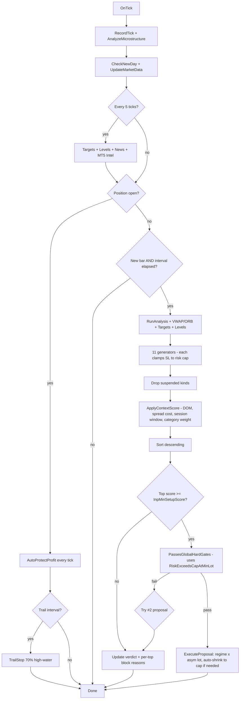
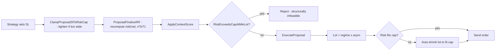

# ⚡ [QUANT-SOURCE-072] Consolidated Quant & Algo Trading Repositories
**Category**: `QUANT_SYSTEMS_INFRASTRUCTURE` | **Repositories in this Source**: 3
**Generated**: QUANT_BUNDLE_072_QUANT_SYSTEMS_INFRASTRUCTURE.md | **Target**: NotebookLM 290+ Quant Code Brain

---

## [1/3] Repository: Stock-Prediction-Models (`WHEEL_Stock-Prediction-Models`)
- **Full Name**: `Stock-Prediction-Models`
- **Description**: 
- **GitHub Stars**: 0
- **Source Pool**: `cloned_trading_wheels`

### Documentation & Overview (README.md)
<p align="center">
    <a href="#readme">
        
    </a>
</p>
<p align="center">
  <a href="https://github.com/huseinzol05/Stock-Prediction-Models/blob/master/LICENSE"></a>
  <a href="#"></a>
  <a href="#"></a>
</p>

---

**Stock-Prediction-Models**, Gathers machine learning and deep learning models for Stock forecasting, included trading bots and simulations.

## Table of contents
  * [Models](#models)
  * [Agents](#agents)
  * [Realtime Agent](realtime-agent)
  * [Data Explorations](#data-explorations)
  * [Simulations](#simulations)
  * [Tensorflow-js](#tensorflow-js)
  * [Misc](#misc)
  * [Results](#results)
    * [Results Agent](#results-agent)
    * [Results signal prediction](#results-signal-prediction)
    * [Results analysis](#results-analysis)
    * [Results simulation](#results-simulation)

## Contents

### Models

#### [Deep-learning models](deep-learning)
 1. LSTM
 2. LSTM Bidirectional
 3. LSTM 2-Path
 4. GRU
 5. GRU Bidirectional
 6. GRU 2-Path
 7. Vanilla
 8. Vanilla Bidirectional
 9. Vanilla 2-Path
 10. LSTM Seq2seq
 11. LSTM Bidirectional Seq2seq
 12. LSTM Seq2seq VAE
 13. GRU Seq2seq
 14. GRU Bidirectional Seq2seq
 15. GRU Seq2seq VAE
 16. Attention-is-all-you-Need
 17. CNN-Seq2seq
 18. Dilated-CNN-Seq2seq

**Bonus**

1. How to use one of the model to forecast `t + N`, [how-to-forecast.ipynb](deep-learning/how-to-forecast.ipynb)
2. Consensus, how to use sentiment data to forecast `t + N`, [sentiment-consensus.ipynb](deep-learning/sentiment-consensus.ipynb)

#### [Stacking models](stacking)
 1. Deep Feed-forward Auto-Encoder Neural Network to reduce dimension + Deep Recurrent Neural Network + ARIMA + Extreme Boosting Gradient Regressor
 2. Adaboost + Bagging + Extra Trees + Gradient Boosting + Random Forest + XGB

### [Agents](agent)

1. Turtle-trading agent
2. Moving-average agent
3. Signal rolling agent
4. Policy-gradient agent
5. Q-learning agent
6. Evolution-strategy agent
7. Double Q-learning agent
8. Recurrent Q-learning agent
9. Double Recurrent Q-learning agent
10. Duel Q-learning agent
11. Double Duel Q-learning agent
12. Duel Recurrent Q-learning agent
13. Double Duel Recurrent Q-learning agent
14. Actor-critic agent
15. Actor-critic Duel agent
16. Actor-critic Recurrent agent
17. Actor-critic Duel Recurrent agent
18. Curiosity Q-learning agent
19. Recurrent Curiosity Q-learning agent
20. Duel Curiosity Q-learning agent
21. Neuro-evolution agent
22. Neuro-evolution with Novelty search agent
23. ABCD strategy agent

### [Data Explorations](misc)

1. stock market study on TESLA stock, [tesla-study.ipynb](misc/tesla-study.ipynb)
2. Outliers study using K-means, SVM, and Gaussian on TESLA stock, [outliers.ipynb](misc/outliers.ipynb)
3. Overbought-Oversold study on TESLA stock, [overbought-oversold.ipynb](misc/overbought-oversold.ipynb)
4. Which stock you need to buy? [which-stock.ipynb](misc/which-stock.ipynb)

### [Simulations](simulation)

1. Simple Monte Carlo, [monte-carlo-drift.ipynb](simulation/monte-carlo-drift.ipynb)
2. Dynamic volatility Monte Carlo, [monte-carlo-dynamic-volatility.ipynb](simulation/monte-carlo-dynamic-volatility.ipynb)
3. Drift Monte Carlo, [monte-carlo-drift.ipynb](simulation/monte-carlo-drift.ipynb)
4. Multivariate Drift Monte Carlo BTC/USDT with Bitcurate sentiment, [multivariate-drift-monte-carlo.ipynb](simulation/multivariate-drift-monte-carlo.ipynb)
5. Portfolio optimization, [portfolio-optimization.ipynb](simulation/portfolio-optimization.ipynb), inspired from https://pythonforfinance.net/2017/01/21/investment-portfolio-optimisation-with-python/

### [Tensorflow-js](stock-forecasting-js)

I code [LSTM Recurrent Neural Network](deep-learning/1.lstm.ipynb) and [Simple signal rolling agent](agent/simple-agent.ipynb) inside Tensorflow JS, you can try it here, [huseinhouse.com/stock-forecasting-js](https://huseinhouse.com/stock-forecasting-js/), you can download any historical CSV and upload dynamically.

### [Misc](misc)

1. fashion trending prediction with cross-validation, [fashion-forecasting.ipynb](misc/fashion-forecasting.ipynb)
2. Bitcoin analysis with LSTM prediction, [bitcoin-analysis-lstm.ipynb](misc/bitcoin-analysis-lstm.ipynb)
3. Kijang Emas Bank Negara, [kijang-emas-bank-negara.ipynb](misc/kijang-emas-bank-negara.ipynb)

## Results

### Results Agent

**This agent only able to buy or sell 1 unit per transaction.**

1. Turtle-trading agent, [turtle-agent.ipynb](agent/1.turtle-agent.ipynb)


2. Moving-average agent, [moving-average-agent.ipynb](agent/2.moving-average-agent.ipynb)


3. Signal rolling agent, [signal-rolling-agent.ipynb](agent/3.signal-rolling-agent.ipynb)


4. Policy-gradient agent, [policy-gradient-agent.ipynb](agent/4.policy-gradient-agent.ipynb)


5. Q-learning agent, [q-learning-agent.ipynb](agent/5.q-learning-agent.ipynb)


6. Evolution-strategy agent, [evolution-strategy-agent.ipynb](agent/6.evolution-strategy-agent.ipynb)


7. Double Q-learning agent, [double-q-learning-agent.ipynb](agent/7.double-q-learning-agent.ipynb)


8. Recurrent Q-learning agent, [recurrent-q-learning-agent.ipynb](agent/8.recurrent-q-learning-agent.ipynb)


9. Double Recurrent Q-learning agent, [double-recurrent-q-learning-agent.ipynb](agent/9.double-recurrent-q-learning-agent.ipynb)


10. Duel Q-learning agent, [duel-q-learning-agent.ipynb](agent/10.duel-q-learning-agent.ipynb)


11. Double Duel Q-learning agent, [double-duel-q-learning-agent.ipynb](agent/11.double-duel-q-learning-agent.ipynb)


12. Duel Recurrent Q-learning agent, [duel-recurrent-q-learning-agent.ipynb](agent/12.duel-recurrent-q-learning-agent.ipynb)


13. Double Duel Recurrent Q-learning agent, [double-duel-recurrent-q-learning-agent.ipynb](agent/13.double-duel-recurrent-q-learning-agent.ipynb)


14. Actor-critic agent, [actor-critic-agent.ipynb](agent/14.actor-critic-agent.ipynb)


15. Actor-critic Duel agent, [actor-critic-duel-agent.ipynb](agent/14.actor-critic-duel-agent.ipynb)


16. Actor-critic Recurrent agent, [actor-critic-recurrent-agent.ipynb](agent/16.actor-critic-recurrent-agent.ipynb)


17. Actor-critic Duel Recurrent agent, [actor-critic-duel-recurrent-agent.ipynb](agent/17.actor-critic-duel-recurrent-agent.ipynb)


18. Curiosity Q-learning agent, [curiosity-q-learning-agent.ipynb](agent/18.curiosity-q-learning-agent.ipynb)


19. Recurrent Curiosity Q-learning agent, [recurrent-curiosity-q-learning.ipynb](agent/19.recurrent-curiosity-q-learning-agent.ipynb)


20. Duel Curiosity Q-learning agent, [duel-curiosity-q-learning-agent.ipynb](agent/20.duel-curiosity-q-learning-agent.ipynb)


21. Neuro-evolution agent, [neuro-evolution.ipynb](agent/21.neuro-evolution-agent.ipynb)


22. Neuro-evolution with Novelty search agent, [neuro-evolution-novelty-search.ipynb](agent/22.neuro-evolution-novelty-search-agent.ipynb)


23. ABCD strategy agent, [abcd-strategy.ipynb](agent/23.abcd-strategy-agent.ipynb)


### Results signal prediction

I will cut the dataset to train and test datasets,

1. Train dataset derived from starting timestamp until last 30 days
2. Test dataset derived from last 30 days until end of the dataset

So we will let the model do forecasting based on last 30 days, and we will going to repeat the experiment for 10 times. You can increase it locally if you want, and tuning parameters will help you by a lot.

1. LSTM, accuracy 95.693%, time taken for 1 epoch 01:09


2. LSTM Bidirectional, accuracy 93.8%, time taken for 1 epoch 01:40


3. LSTM 2-Path, accuracy 94.63%, time taken for 1 epoch 01:39


4. GRU, accuracy 94.63%, time taken for 1 epoch 02:10


5. GRU Bidirectional, accuracy 92.5673%, time taken for 1 epoch 01:40


6. GRU 2-Path, accuracy 93.2117%, time taken for 1 epoch 01:39


7. Vanilla, accuracy 91.4686%, time taken for 1 epoch 00:52


8. Vanilla Bidirectional, accuracy 88.9927%, time taken for 1 epoch 01:06


9. Vanilla 2-Path, accuracy 91.5406%, time taken for 1 epoch 01:08


10. LSTM Seq2seq, accuracy 94.9817%, time taken for 1 epoch 01:36


11. LSTM Bidirectional Seq2seq, accuracy 94.517%, time taken for 1 epoch 02:30


12. LSTM Seq2seq VAE, accuracy 95.4190%, time taken for 1 epoch 01:48


13. GRU Seq2seq, accuracy 90.8854%, time taken for 1 epoch 01:34


14. GRU Bidirectional Seq2seq, accuracy 67.9915%, time taken for 1 epoch 02:30


15. GRU Seq2seq VAE, accuracy 89.1321%, time taken for 1 epoch 01:48


16. Attention-is-all-you-Need, accuracy 94.2482%, time taken for 1 epoch 01:41


17. CNN-Seq2seq, accuracy 90.74%, time taken for 1 epoch 00:43


18. Dilated-CNN-Seq2seq, accuracy 95.86%, time taken for 1 epoch 00:14


**Bonus**

1. How to forecast,


2. Sentiment consensus,


### Results analysis

1. Outliers study using K-means, SVM, and Gaussian on TESLA stock


2. Overbought-Oversold study on TESLA stock


3. Which stock you need to buy?


### Results simulation

1. Simple Monte Carlo


2. Dynamic volatity Monte Carlo


3. Drift Monte Carlo


4. Multivariate Drift Monte Carlo BTC/USDT with Bitcurate sentiment


5. Portfolio optimization


### Core Implementation Code & Architecture
#### File: `stacking/model.py`
```python
import tensorflow as tf
import numpy as np

class Model:
    def __init__(self, learning_rate, num_layers, size, size_layer, output_size, forget_bias = 0.1):
        
        def lstm_cell(size_layer):
            return tf.nn.rnn_cell.LSTMCell(size_layer, state_is_tuple = False)
        rnn_cells = tf.nn.rnn_cell.MultiRNNCell([lstm_cell(size_layer) for _ in range(num_layers)], state_is_tuple = False)
        self.X = tf.placeholder(tf.float32, (None, None, size))
        self.Y = tf.placeholder(tf.float32, (None, output_size))
        drop = tf.contrib.rnn.DropoutWrapper(rnn_cells, output_keep_prob = forget_bias)
        self.hidden_layer = tf.placeholder(tf.float32, (None, num_layers * 2 * size_layer))
        self.outputs, self.last_state = tf.nn.dynamic_rnn(drop, self.X, initial_state = self.hidden_layer, dtype = tf.float32)
        rnn_W = tf.Variable(tf.random_normal((size_layer, output_size)))
        rnn_B = tf.Variable(tf.random_normal([output_size]))
        self.logits = tf.matmul(self.outputs[-1], rnn_W) + rnn_B
        self.cost = tf.reduce_mean(tf.square(self.Y - self.logits))
        self.optimizer = tf.train.AdamOptimizer(learning_rate).minimize(self.cost)
```

#### File: `deep-learning/util.py`
```python
# Copyright 2017 Google Inc.
#
# Licensed under the Apache License, Version 2.0 (the "License");
# you may not use this file except in compliance with the License.
# You may obtain a copy of the License at
#
#      http://www.apache.org/licenses/LICENSE-2.0
#
# Unless required by applicable law or agreed to in writing, software
# distributed under the License is distributed on an "AS IS" BASIS,
# WITHOUT WARRANTIES OR CONDITIONS OF ANY KIND, either express or implied.
# See the License for the specific language governing permissions and
# limitations under the License.
# ==============================================================================
"""DNC util ops and modules."""

from __future__ import absolute_import
from __future__ import division
from __future__ import print_function

import numpy as np
import tensorflow as tf


def batch_invert_permutation(permutations):
  """Returns batched `tf.invert_permutation` for every row in `permutations`."""
  with tf.name_scope('batch_invert_permutation', values=[permutations]):
    unpacked = tf.unstack(permutations)
    inverses = [tf.invert_permutation(permutation) for permutation in unpacked]
    return tf.stack(inverses)


def batch_gather(values, indices):
  """Returns batched `tf.gather` for every row in the input."""
  with tf.name_scope('batch_gather', values=[values, indices]):
    unpacked = zip(tf.unstack(values), tf.unstack(indices))
    result = [tf.gather(value, index) for value, index in unpacked]
    return tf.stack(result)


def one_hot(length, index):
  """Return an nd array of given `length` filled with 0s and a 1 at `index`."""
  result = np.zeros(length)
  result[index] = 1
  return result
```

#### File: `deep-learning/autoencoder.py`
```python
import tensorflow as tf
import numpy as np
import time

def reducedimension(input_, dimension = 2, learning_rate = 0.01, hidden_layer = 256, epoch = 20):
    
    input_size = input_.shape[1]
    X = tf.placeholder("float", [None, input_size])
    
    weights = {
    'encoder_h1': tf.Variable(tf.random_normal([input_size, hidden_layer])),
    'encoder_h2': tf.Variable(tf.random_normal([hidden_layer, dimension])),
    'decoder_h1': tf.Variable(tf.random_normal([dimension, hidden_layer])),
    'decoder_h2': tf.Variable(tf.random_normal([hidden_layer, input_size])),
    }
    
    biases = {
    'encoder_b1': tf.Variable(tf.random_normal([hidden_layer])),
    'encoder_b2': tf.Variable(tf.random_normal([dimension])),
    'decoder_b1': tf.Variable(tf.random_normal([hidden_layer])),
    'decoder_b2': tf.Variable(tf.random_normal([input_size])),
    }
    
    first_layer_encoder = tf.nn.sigmoid(tf.add(tf.matmul(X, weights['encoder_h1']), biases['encoder_b1']))
    second_layer_encoder = tf.nn.sigmoid(tf.add(tf.matmul(first_layer_encoder, weights['encoder_h2']), biases['encoder_b2']))
    first_layer_decoder = tf.nn.sigmoid(tf.add(tf.matmul(second_layer_encoder, weights['decoder_h1']), biases['decoder_b1']))
    second_layer_decoder = tf.nn.sigmoid(tf.add(tf.matmul(first_layer_decoder, weights['decoder_h2']), biases['decoder_b2']))
    cost = tf.reduce_mean(tf.pow(X - second_layer_decoder, 2))
    optimizer = tf.train.RMSPropOptimizer(learning_rate).minimize(cost)
    sess = tf.InteractiveSession()
    sess.run(tf.global_variables_initializer())
    
    for i in range(epoch):
        last_time = time.time()
        _, loss = sess.run([optimizer, cost], feed_dict={X: input_})
        if (i + 1) % 10 == 0:
            print('epoch:', i + 1, 'loss:', loss, 'time:', time.time() - last_time)
        
    vectors = sess.run(second_layer_encoder, feed_dict={X: input_})
    tf.reset_default_graph()
    return vectors
```

#### File: `stacking/autoencoder.py`
```python
import tensorflow as tf
import numpy as np
import time

def reducedimension(input_, dimension = 2, learning_rate = 0.01, hidden_layer = 256, epoch = 20):
    
    input_size = input_.shape[1]
    X = tf.placeholder("float", [None, input_size])
    
    weights = {
    'encoder_h1': tf.Variable(tf.random_normal([input_size, hidden_layer])),
    'encoder_h2': tf.Variable(tf.random_normal([hidden_layer, dimension])),
    'decoder_h1': tf.Variable(tf.random_normal([dimension, hidden_layer])),
    'decoder_h2': tf.Variable(tf.random_normal([hidden_layer, input_size])),
    }
    
    biases = {
    'encoder_b1': tf.Variable(tf.random_normal([hidden_layer])),
    'encoder_b2': tf.Variable(tf.random_normal([dimension])),
    'decoder_b1': tf.Variable(tf.random_normal([hidden_layer])),
    'decoder_b2': tf.Variable(tf.random_normal([input_size])),
    }
    
    first_layer_encoder = tf.nn.sigmoid(tf.add(tf.matmul(X, weights['encoder_h1']), biases['encoder_b1']))
    second_layer_encoder = tf.nn.sigmoid(tf.add(tf.matmul(first_layer_encoder, weights['encoder_h2']), biases['encoder_b2']))
    first_layer_decoder = tf.nn.sigmoid(tf.add(tf.matmul(second_layer_encoder, weights['decoder_h1']), biases['decoder_b1']))
    second_layer_decoder = tf.nn.sigmoid(tf.add(tf.matmul(first_layer_decoder, weights['decoder_h2']), biases['decoder_b2']))
    cost = tf.reduce_mean(tf.pow(X - second_layer_decoder, 2))
    optimizer = tf.train.RMSPropOptimizer(learning_rate).minimize(cost)
    sess = tf.InteractiveSession()
    sess.run(tf.global_variables_initializer())
    
    for i in range(epoch):
        last_time = time.time()
        _, loss = sess.run([optimizer, cost], feed_dict={X: input_})
        if (i + 1) % 10 == 0:
            print('epoch:', i + 1, 'loss:', loss, 'time:', time.time() - last_time)
        
    vectors = sess.run(second_layer_encoder, feed_dict={X: input_})
    tf.reset_default_graph()
    return vectors
```

#### File: `deep-learning/dnc.py`
```python
# Copyright 2017 Google Inc.
#
# Licensed under the Apache License, Version 2.0 (the "License");
# you may not use this file except in compliance with the License.
# You may obtain a copy of the License at
#
#      http://www.apache.org/licenses/LICENSE-2.0
#
# Unless required by applicable law or agreed to in writing, software
# distributed under the License is distributed on an "AS IS" BASIS,
# WITHOUT WARRANTIES OR CONDITIONS OF ANY KIND, either express or implied.
# See the License for the specific language governing permissions and
# limitations under the License.
# ==============================================================================
"""DNC Cores.

These modules create a DNC core. They take input, pass parameters to the memory
access module, and integrate the output of memory to form an output.
"""

from __future__ import absolute_import
from __future__ import division
from __future__ import print_function

import collections
import numpy as np
import sonnet as snt
import tensorflow as tf

import access

DNCState = collections.namedtuple('DNCState', ('access_output', 'access_state',
                                               'controller_state'))


class DNC(snt.RNNCore):
  """DNC core module.

  Contains controller and memory access module.
  """

  def __init__(self,
               access_config,
               controller_config,
               output_size,
               clip_value=None,
               name='dnc'):
    """Initializes the DNC core.

    Args:
      access_config: dictionary of access module configurations.
      controller_config: dictionary of controller (LSTM) module configurations.
      output_size: output dimension size of core.
      clip_value: clips controller and core output values to between
          `[-clip_value, clip_value]` if specified.
      name: module name (default 'dnc').

    Raises:
      TypeError: if direct_input_size is not None for any access module other
        than KeyValueMemory.
    """
    super(DNC, self).__init__(name=name)

    with self._enter_variable_scope():
      self._controller = snt.LSTM(**controller_config)
      self._access = access.MemoryAccess(**access_config)

    self._access_output_size = np.prod(self._access.output_size.as_list())
    self._output_size = output_size
    self._clip_value = clip_value or 0

    self._output_size = tf.TensorShape([output_size])
    self._state_size = DNCState(
        access_output=self._access_output_size,
        access_state=self._access.state_size,
        controller_state=self._controller.state_size)

  def _clip_if_enabled(self, x):
    if self._clip_value > 0:
      return tf.clip_by_value(x, -self._clip_value, self._clip_value)
    else:
      return x

  def _build(self, inputs, prev_state):
    """Connects the DNC core into the graph.

    Args:
      inputs: Tensor input.
      prev_state: A `DNCState` tuple containing the fields `access_output`,
          `access_state` and `controller_state`. `access_state` is a 3-D Tensor
          of shape `[batch_size, num_reads, word_size]` containing read words.
          `access_state` is a tuple of the access module's state, and
          `controller_state` is a tuple of controller module's state.

    Returns:
      A tuple `(output, next_state)` where `output` is a tensor and `next_state`
      is a `DNCState` tuple containing the fields `access_output`,
      `access_state`, and `controller_state`.
    """

    prev_access_output = prev_state.access_output
    prev_access_state = prev_state.access_state
    prev_controller_state = prev_state.controller_state

    batch_flatten = snt.BatchFlatten()
    controller_input = tf.concat(
        [batch_flatten(inputs), batch_flatten(prev_access_output)], 1)

    controller_output, controller_state = self._controller(
        controller_input, prev_controller_state)

    controller_output = self._clip_if_enabled(controller_output)
    controller_state = snt.nest.map(self._clip_if_enabled, controller_state)

    access_output, access_state = self._access(controller_output,
                                               prev_access_state)

    output = tf.concat([controller_output, batch_flatten(access_output)], 1)
    output = snt.Linear(
        output_size=self._output_size.as_list()[0],
        name='output_linear')(output)
    output = self._clip_if_enabled(output)

    return output, DNCState(
        access_output=access_output,
        access_state=access_state,
        controller_state=controller_state)

  def initial_state(self, batch_size, dtype=tf.float32):
    return DNCState(
        controller_state=self._controller.initial_state(batch_size, dtype),
        access_state=self._access.initial_state(batch_size, dtype),
        access_output=tf.zeros(
            [batch_size] + self._access.output_size.as_list(), dtype))

  @property
  def state_size(self):
    return self._state_size

  @property
  def output_size(self):
    return self._output_size
```

#### File: `deep-learning/access.py`
```python
# Copyright 2017 Google Inc.
#
# Licensed under the Apache License, Version 2.0 (the "License");
# you may not use this file except in compliance with the License.
# You may obtain a copy of the License at
#
#      http://www.apache.org/licenses/LICENSE-2.0
#
# Unless required by applicable law or agreed to in writing, software
# distributed under the License is distributed on an "AS IS" BASIS,
# WITHOUT WARRANTIES OR CONDITIONS OF ANY KIND, either express or implied.
# See the License for the specific language governing permissions and
# limitations under the License.
# ==============================================================================
"""DNC access modules."""

from __future__ import absolute_import
from __future__ import division
from __future__ import print_function

import collections
import sonnet as snt
import tensorflow as tf

import addressing
import util

AccessState = collections.namedtuple('AccessState', (
    'memory', 'read_weights', 'write_weights', 'linkage', 'usage'))


def _erase_and_write(memory, address, reset_weights, values):
  """Module to erase and write in the external memory.

  Erase operation:
    M_t'(i) = M_{t-1}(i) * (1 - w_t(i) * e_t)

  Add operation:
    M_t(i) = M_t'(i) + w_t(i) * a_t

  where e are the reset_weights, w the write weights and a the values.

  Args:
    memory: 3-D tensor of shape `[batch_size, memory_size, word_size]`.
    address: 3-D tensor `[batch_size, num_writes, memory_size]`.
    reset_weights: 3-D tensor `[batch_size, num_writes, word_size]`.
    values: 3-D tensor `[batch_size, num_writes, word_size]`.

  Returns:
    3-D tensor of shape `[batch_size, num_writes, word_size]`.
  """
  with tf.name_scope('erase_memory', values=[memory, address, reset_weights]):
    expand_address = tf.expand_dims(address, 3)
    reset_weights = tf.expand_dims(reset_weights, 2)
    weighted_resets = expand_address * reset_weights
    reset_gate = tf.reduce_prod(1 - weighted_resets, [1])
    memory *= reset_gate

  with tf.name_scope('additive_write', values=[memory, address, values]):
    add_matrix = tf.matmul(address, values, adjoint_a=True)
    memory += add_matrix

  return memory


class MemoryAccess(snt.RNNCore):
  """Access module of the Differentiable Neural Computer.

  This memory module supports multiple read and write heads. It makes use of:

  *   `addressing.TemporalLinkage` to track the temporal ordering of writes in
      memory for each write head.
  *   `addressing.FreenessAllocator` for keeping track of memory usage, where
      usage increase when a memory location is written to, and decreases when
      memory is read from that the controller says can be freed.

  Write-address selection is done by an interpolation between content-based
  lookup and using unused memory.

  Read-address selection is done by an interpolation of content-based lookup
  and following the link graph in the forward or backwards read direction.
  """

  def __init__(self,
               memory_size=128,
               word_size=20,
               num_reads=1,
               num_writes=1,
               name='memory_access'):
    """Creates a MemoryAccess module.

    Args:
      memory_size: The number of memory slots (N in the DNC paper).
      word_size: The width of each memory slot (W in the DNC paper)
      num_reads: The number of read heads (R in the DNC paper).
      num_writes: The number of write heads (fixed at 1 in the paper).
      name: The name of the module.
    """
    super(MemoryAccess, self).__init__(name=name)
    self._memory_size = memory_size
    self._word_size = word_size
    self._num_reads = num_reads
    self._num_writes = num_writes

    self._write_content_weights_mod = addressing.CosineWeights(
        num_writes, word_size, name='write_content_weights')
    self._read_content_weights_mod = addressing.CosineWeights(
        num_reads, word_size, name='read_content_weights')

    self._linkage = addressing.TemporalLinkage(memory_size, num_writes)
    self._freeness = addressing.Freeness(memory_size)

  def _build(self, inputs, prev_state):
    """Connects the MemoryAccess module into the graph.

    Args:
      inputs: tensor of shape `[batch_size, input_size]`. This is used to
          control this access module.
      prev_state: Instance of `AccessState` containing the previous state.

    Returns:
      A tuple `(output, next_state)`, where `output` is a tensor of shape
      `[batch_size, num_reads, word_size]`, and `next_state` is the new
      `AccessState` named tuple at the current time t.
    """
    inputs = self._read_inputs(inputs)

    # Update usage using inputs['free_gate'] and previous read & write weights.
    usage = self._freeness(
        write_weights=prev_state.write_weights,
        free_gate=inputs['free_gate'],
        read_weights=prev_state.read_weights,
        prev_usage=prev_state.usage)

    # Write to memory.
    write_weights = self._write_weights(inputs, prev_state.memory, usage)
    memory = _erase_and_write(
        prev_state.memory,
        address=write_weights,
        reset_weights=inputs['erase_vectors'],
        values=inputs['write_vectors'])

    linkage_state = self._linkage(write_weights, prev_state.linkage)

    # Read from memory.
    read_weights = self._read_weights(
        inputs,
        memory=memory,
        prev_read_weights=prev_state.read_weights,
        link=linkage_state.link)
    read_words = tf.matmul(read_weights, memory)

    return (read_words, AccessState(
        memory=memory,
        read_weights=read_weights,
        write_weights=write_weights,
        linkage=linkage_state,
        usage=usage))

  def _read_inputs(self, inputs):
    """Applies transformations to `inputs` to get control for this module."""

    def _linear(first_dim, second_dim, name, activation=None):
      """Returns a linear transformation of `inputs`, followed by a reshape."""
      linear = snt.Linear(first_dim * second_dim, name=name)(inputs)
      if activation is not None:
        linear = activation(linear, name=name + '_activation')
      return tf.reshape(linear, [-1, first_dim, second_dim])

    # v_t^i - The vectors to write to memory, for each write head `i`.
    write_vectors = _linear(self._num_writes, self._word_size, 'write_vectors')

    # e_t^i - Amount to erase the memory by before writing, for each write head.
    erase_vectors = _linear(self._num_writes, self._word_size, 'erase_vectors',
                            tf.sigmoid)

    # f_t^j - Amount that the memory at the locations read from at the previous
    # time step can be declared unused, for each read head `j`.
    free_gate = tf.sigmoid(
        snt.Linear(self._num_reads, name='free_gate')(inputs))

    # g_t^{a, i} - Interpolation between writing to unallocated memory and
    # content-based lookup, for each write head `i`. Note: `a` is simply used to
    # identify this gate with allocation vs writing (as defined below).
    allocation_gate = tf.sigmoid(
        snt.Linear(self._num_writes, name='allocation_gate')(inputs))

    # g_t^{w, i} - Overall gating of write amount for each write head.
    write_gate = tf.sigmoid(
        snt.Linear(self._num_writes, name='write_gate')(inputs))

    # \pi_t^j - Mixing between "backwards" and "forwards" positions (for
    # each write head), and content-based lookup, for each read head.
    num_read_modes = 1 + 2 * self._num_writes
    read_mode = snt.BatchApply(tf.nn.softmax)(
        _linear(self._num_reads, num_read_modes, name='read_mode'))

    # Parameters for the (read / write) "weights by content matching" modules.
    write_keys = _linear(self._num_writes, self._word_size, 'write_keys')
    write_strengths = snt.Linear(self._num_writes, name='write_strengths')(
        inputs)

    read_keys = _linear(self._num_reads, self._word_size, 'read_keys')
    read_strengths = snt.Linear(self._num_reads, name='read_strengths')(inputs)

    result = {
        'read_content_keys': read_keys,
        'read_content_strengths': read_strengths,
        'write_content_keys': write_keys,
        'write_content_strengths': write_strengths,
        'write_vectors': write_vectors,
        'erase_vectors': erase_vectors,
        'free_gate': free_gate,
        'allocation_gate': allocation_gate,
        'write_gate': write_gate,
        'read_mode': read_mode,
    }
    return result

  def _write_weights(self, inputs, memory, usage):
    """Calculates the memory locations to write to.

    This uses a combination of content-based lookup and finding an unused
    location in memory, for each write head.

    Args:
      inputs: Collection of inputs to the access module, including controls for
          how to chose memory writing, such as the content to look-up and the
          weighting between content-based and allocation-based addressing.
      memory: A tensor of shape  `[batch_size, memory_size, word_size]`
          containing the current memory contents.
      usage: Current memory usage, which is a tensor of shape `[batch_size,
          memory_size]`, used for allocation-based addressing.

    Returns:
      tensor of shape `[batch_size, num_writes, memory_size]` indicating where
          to write to (if anywhere) for each write head.
    """
    with tf.name_scope('write_weights', values=[inputs, memory, usage]):
      # c_t^{w, i} - The content-based weights for each write head.
      write_content_weights = self._write_content_weights_mod(
          memory, inputs['write_content_keys'],
          inputs['write_content_strengths'])

      # a_t^i - The allocation weights for each write head.
      write_allocation_weights = self._freeness.write_allocation_weights(
          usage=usage,
          write_gates=(inputs['allocation_gate'] * inputs['write_gate']),
          num_writes=self._num_writes)

      # Expands gates over memory locations.
      allocation_gate = tf.expand_dims(inputs['allocation_gate'], -1)
      write_gate = tf.expand_dims(inputs['write_gate'], -1)

      # w_t^{w, i} - The write weightings for each write head.
      return write_gate * (allocation_gate * write_allocation_weights +
                           (1 - allocation_gate) * write_content_weights)

  def _read_weights(self, inputs, memory, prev_read_weights, link):
    """Calculates read weights for each read head.

    The read weights are a combination of following the link graphs in the
    forward or backward directions from the previous read position, and doing
    content-based lookup. The interpolation between these different modes is
    done by `inputs['read_mode']`.

    Args:
      inputs: Controls for this access module. This contains the content-based
          keys to lookup, and the weightings for the different read modes.
      memory: A tensor of shape `[batch_size, memory_size, word_size]`
          containing the current memory contents to do content-based lookup.
      prev_read_weights: A tensor of shape `[batch_size, num_reads,
          memory_size]` containing the previous read locations.
      link: A tensor of shape `[batch_size, num_writes, memory_size,
          memory_size]` containing the temporal write transition graphs.

    Returns:
      A tensor of shape `[batch_size, num_reads, memory_size]` containing the
      read weights for each read head.
    """
    with tf.name_scope(
        'read_weights', values=[inputs, memory, prev_read_weights, link]):
      # c_t^{r, i} - The content weightings for each read head.
      content_weights = self._read_content_weights_mod(
          memory, inputs['read_content_keys'], inputs['read_content_strengths'])

      # Calculates f_t^i and b_t^i.
      forward_weights = self._linkage.directional_read_weights(
          link, prev_read_weights, forward=True)
      backward_weights = self._linkage.directional_read_weights(
          link, prev_read_weights, forward=False)

      backward_mode = inputs['read_mode'][:, :, :self._num_writes]
      forward_mode = (
          inputs['read_mode'][:, :, self._num_writes:2 * self._num_writes])
      content_mode = inputs['read_mode'][:, :, 2 * self._num_writes]

      read_weights = (
          tf.expand_dims(content_mode, 2) * content_weights + tf.reduce_sum(
              tf.expand_dims(forward_mode, 3) * forward_weights, 2) +
          tf.reduce_sum(tf.expand_dims(backward_mode, 3) * backward_weights, 2))

      return read_weights

  @property
  def state_size(self):
    """Returns a tuple of the shape of the state tensors."""
    return AccessState(
        memory=tf.TensorShape([self._memory_size, self._word_size]),
        read_weights=tf.TensorShape([self._num_reads, self._memory_size]),
        write_weights=tf.TensorShape([self._num_writes, self._memory_size]),
        linkage=self._linkage.state_size,
        usage=self._freeness.state_size)

  @property
  def output_size(self):
    """Returns the output shape."""
    return tf.TensorShape([self._num_reads, self._word_size])
```


==================================================


## [2/3] Repository: Trade_CLI (`WHEEL_Stock_Trade_CLI`)
- **Full Name**: `Stock_Trade_CLI`
- **Description**: 
- **GitHub Stars**: 0
- **Source Pool**: `cloned_trading_wheels`

### Documentation & Overview (README.md)
# Stock Trading CLI Tool

## What is Stock Trading CLI Tool?

**Stock Trading CLI Tool** is a lightweight, modular command-line interface (CLI) application designed to place and manage equity and derivatives orders via [Dhan's API](https://dhan.co). This project simulates a microservice-like architecture and supports multiple order types such as market, limit, stop-loss, intraday, and F&O, with built-in logging and secure token handling.

This tool is designed for developers and traders who want a programmable interface to interact with their Dhan account for basic trading operations.

---

## Features

- Simple CLI-based interface for order placement and management.
- Supports **Market**, **Limit**, **Stop Loss**, **SL-M**, **IOC**, **CNC**, **Intraday**, **Futures**, and **Options** order types.

- Easy to set up—just add your Dhan credentials to get started.
- Lightweight and dependency-minimal.

---
## Structure 
```bash 
dhan-trading-cli/
|
├── input_handler.py     # Takes and validates user inputs
├── config.py            # Loads and manages credentials securely
├── dhan_trader.py       # Core logic for Dhan API communication
├── main.py              # CLI launcher and user authentication
├── logger.py            # Logs placed orders to CSV
├── requirements.txt     # Python package dependencies
└── .env                 # stores ClientID and Token (excluded from version control - User Specific )
```

---

## Requirements

- A valid [Dhan Trading Account](https://login.dhan.co/?location=DH_WEB&refer=DHAN_WEBSITE)
- Generate your **Client ID** and **Access Token** from the **APIs** section in your Dhan dashboard.

---

## Installation & Setup


1. **Clone the repository**  
```bash
git clone https://github.com/Aniket-16-S/Stock_Trade_CLI.git

```

```bash
cd Stock_Trade_CLI
```

2. **Install the required packages**  
```bash
pip install -r requirements.txt
```


3. **Create `.env` file**  
In the project root dir ( `Stock_Trade_CLI` ) , create a `.env` file and add:

```bash
DHAN_CLIENT_ID=your_client_id_here
DHAN_ACCESS_TOKEN=your_access_token_here
```


4. **Run the application**  
```bash
python main.py
```

The tool will place the order via Dhan API and log successful transactions in a CSV file (`order_log.csv`).


---

## Terms of Use

- This tool uses [Dhan’s  API](https://dhanhq.co/algo-trading/) in accordance with their terms and conditions.
- By using this CLI, you agree to [Dhan’s Terms & Conditions](https://dhan.co) and their [security](https://dhan.co/safety-security/) requirements .
- This project is intended for **educational and demonstrational purposes** only.
- **The developer is not responsible for any financial loss, API issues, or damage arising from use of this tool.**
- Always use caution when placing real trades—validate all inputs carefully.

---

## Notes & Recommendations

- Use this tool with your **main account credentials**, not sandbox/partner accounts.
- Never commit your `.env` file to any version control system.
- You can extend this project to support:
  - GTT orders
  - Portfolio performance tracking
  - Telegram/email alerts
  - Strategy-based bulk orders

---

## Future Goals

- Add support to fetch live market price (LTP).
- Integrate a user-friendly GUI.
- Implement better error handling and retry logic.
- Include additional analytics (PnL reports, portfolio breakdown, etc.).

## License

This project is under internal evaluation as part of an internship program and does not currently use an open-source license.

---

### ⚠️ Disclaimer: 
Use this tool at your own risk. The developer is not responsible for any financial loss, errors, or damages caused by using this code. No guarantees are provided. This project is for educational purposes only.

---

### Core Implementation Code & Architecture
#### File: `Dhan_CLI/__init__.py`
```python

```

#### File: `Dhan_CLI/config.py`
```python
import os
from dotenv import load_dotenv

# Load environment variables from a .env file and update variables if changes were made.
load_dotenv(override=True)

# Fetch DhanHQ credentials
CLIENT_ID = os.getenv("DHAN_CLIENT_ID")
ACCESS_TOKEN = os.getenv("DHAN_ACCESS_TOKEN")

# Validate credentials :
if not CLIENT_ID or not ACCESS_TOKEN:
    raise ValueError("Error: DHAN_CLIENT_ID and DHAN_ACCESS_TOKEN must be set in the .env file.")
    
# CSV Log file :
LOG_FILE = 'order_log.csv'
```

#### File: `Dhan_CLI/order_logger.py`
```python
import csv
from datetime import datetime
import os
from config import LOG_FILE

def log_order_to_csv(order_details, api_response):
    """
    Logs the details of a placed order and its result to a CSV file.

    Args:
        order_details (dict): The dictionary of user-provided order inputs.
        api_response (dict): The response dictionary from <- main <- dhan_trader.
    """

    file_exists = os.path.isfile(LOG_FILE)
    
    # Extract status and order_id from the response
    
    status = api_response.get('status', 'error')
    order_id = api_response.get('orderId', 'N/A')
    
    if status == 'Failed':
        status = f"ERROR: {api_response.get('reason', 'Unknown')}"

    log_data = {
        "Timestamp"   : datetime.now().strftime("%Y-%m-%d %H:%M:%S"),
        "Symbol"      : order_details.get('symbol', 'NoSymbolDetected'),
        "Quantity"    : order_details.get('quantity', 'NoQTYdetected'),
        "Order Type"  : order_details.get('order_type', 'OrdTypNotDetected'),
        "Price"       : order_details.get('price', 0) if order_details.get('price', 0) > 0 else "MARKET", 
        "Product Type": order_details.get('trade_type', 'TrdTypNotDetected'),
        "Exchange"    : order_details.get('exchange_segment', 'ExchgSegNotDetected'),
        "Order ID"    : order_id,
        "Status"      : status
    }
    
    headers = log_data.keys()

    try:
        with open(LOG_FILE, 'a', newline='') as csvfile:
            writer = csv.DictWriter(csvfile, fieldnames=headers)
            if not file_exists:
                writer.writeheader()  # Write header only if file is newly created when opened.
            writer.writerow(log_data)

        print(f"Order successfully logged to {LOG_FILE}")
    except Exception as e:
        print(f"Error: Could not write to log file {LOG_FILE}. Reason: {e}")
```

#### File: `main.py`
```python
from Dhan_CLI.config import *
from Dhan_CLI.dhan_trader import *
from Dhan_CLI.input_handler import *
from Dhan_CLI.order_logger import *
import sys

def authenticate_user() :
    try:
        global trader # making trader accessiblr to all functions

        #  Initializing the trader with credentials from config
        trader = DhanTrader(client_id=CLIENT_ID, access_token=ACCESS_TOKEN)
        
        if not trader.tradehull :
            print("Exiting application due to authentication failure.")
            sys.exit()  
    except Exception as e :
        print(f"Error : {e}")


def start_order():
    """
    Main function to run the Dhan trading CLI.
    """
    try:

        while True:
            # Geting order details from the user
            order_details = get_order_inputs()

            # Sending the order to the Dhan API
            api_response = trader.place_order(order_details)
            status = trader.get_status(order_id=order_id)
            # Display the outcome to the user
            print("\n--- Order Response ---")
            if api_response and api_response.get('status') == 'success':
                order_id = api_response.get('orderId', 'N/A')
                print(f"   Order placed successfully!")
                print(f"   Order ID  : {order_id}")
                print(f"   Status    : {status}")
            else:
                reason = api_response.get('reason', 'No reason provided.')
                print(f"   Order placement failed. Reason: {reason}")
            
            # Save the transaction record in Log CSV
            log_order_to_csv(order_details, api_response)

            # Ask user if they want to place another order
            another = input("\nDo you want to place another order? (yes/no): ").strip().lower()
            if another != 'yes' or another != 'y':
                break

    except ValueError as ve:
        print(f"\nConfiguration Error in main : {ve}")
    except Exception as e:
        print(f"\nAn unexpected error occurred in main: {e}")

def show_options() :
    print("\n------- Select Operation : -------")
    print("\n1. Place new Oders\n2. Get Order details (requires : Order_ID) \n3. Show current Holdings\n4. Cancel Order (requires : Order_ID)\n5. Cancel ALL Orders\n6. Show Balance\n7. Exit")
    opt = None
    while True :
        try :
            opt = int(input("\n : "))
            if opt in range(1, 8) :
                break
            print("Enter Valid option for operation") # If number is not in correct range
        except Exception :
            print("Enter Valid option for operation") # if user sends characters instead of numbers
    return opt

if __name__ == "__main__":
     
    authenticate_user()

    

    while True :
        opration = show_options()
        if opration == 1 :
            start_order()
        
        elif opration == 2 :
            try :
                order_id = int(input("Enter Order_ID : "))
            except ValueError :
                print("Please ENter correct order id")
                continue
            # We may place logic to verify order id with log file but order can be placed from different systems so . . .
            print(trader.get_order_details(order_id=order_id))
        
        elif opration == 3 :
            print(trader.get_holds())
        
        elif opration == 4 :
            try :
                order_id = int(input("Enter Order_ID : "))
            except ValueError :
                print("Please ENter correct order id")
                continue
            print(trader.cancel_specific_order(order_id=order_id))
        elif opration == 5 :
            print(trader.cancel_orders())
        elif opration == 6 :
            trader.get_balance()
        else :
            break
    
    print("\n\n . . . Thank You for using Dhan CLI Tool . . . \n\n")
```

#### File: `Dhan_CLI/input_handler.py`
```python
def get_order_inputs():
    """
    Collects and validates all necessary order details from the user,
    including specific details for derivative instruments.
    
    """
    print("\n--- Place a New Order ---")

    # Symbol & Exchange
    symbol = input("Enter Symbol (e.g., RELIANCE, NIFTY, BANKNIFTY): ").strip().upper()
    while True:
        segment = input("Enter Exchange Segment (NSE, BSE, NFO): ").strip().upper()
        if segment in {"NSE", "BSE", "NFO"}:
            break
        print("Invalid segment. Please choose from NSE, BSE, NFO.")

    # Derivative Specific Inputs (if NFO) 
    instrument_type = None
    expiry_date = None
    strike_price = 0.0
    option_type = 'NONE'

    if segment == 'NFO':
        while True:
            instrument_type = input("Enter Instrument Type (FUT for Futures, OPT for Options): ").strip().upper()
            if instrument_type in {"FUT", "OPT"}:
                break
            print("Invalid instrument type. Please choose FUT or OPT.")

        expiry_date = input("Enter Expiry Date (YYYY-MM-DD): ").strip()
        
        if instrument_type == 'OPT':
            while True:
                try:
                    strike_price = float(input("Enter Strike Price: ").strip())
                    break
                except ValueError:
                    print("Invalid input. Please enter a numerical strike price.")
            
            while True:
                option_type = input("Enter Option Type (CE for Call, PE for Put): ").strip().upper()
                if option_type in {"CE", "PE"}:
                    break
                print("Invalid option type. Please choose CE or PE.")

    # Common Order Details 
    
    #Buy or Sell
    while True:
        side = input("Enter Order Side (BUY, SELL): ").strip().upper()
        if side in {"BUY", "SELL"}:
            break
        print("Invalid side. Please choose BUY or SELL.")

    # Type : Limit / MArket / Stoploss / stoploss-m
    while True:
        order_type = input("Enter Order Type (MARKET, LIMIT, SL, SL-M): ").strip().upper()
        if order_type in {"MARKET", "LIMIT", "SL", "SL-M"}:
            break
        print("Invalid order type. Please choose from MARKET, LIMIT, SL, SL-M.")

    # QTY
    while True:
        try:
            quantity = int(input("Enter Quantity: ").strip())
            if quantity > 0:
                break
            print("Quantity must be a positive integer.")
        except ValueError:
            print("Invalid input. Please enter a valid integer for quantity.")

    price = 0.0

    # Price not applicable if order is for makert price
    if order_type in ["LIMIT", "SL", "SL-M"]:
        while True:
            try:
                price = float(input(f"Enter Price for {order_type} order: ").strip())
                if price > 0:
                    break
                print("Price must be a positive number.")
            except ValueError:
                print("Invalid input. Please enter a valid number for the price.")

    # Share type : intraday / cnc /etc.
    while True:
        product_type = input("Enter Product Type (INTRADAY, CNC, NRML): ").strip().upper()
        if product_type in {"INTRADAY", "CNC", "NRML"}:
            break
        print("Invalid product type. Please choose from INTRADAY, CNC, NRML.")

    # order validity : day / ioc : Immediate or Cancel
    while True:
        validity = input("Enter Order Validity (DAY, IOC): ").strip().upper()
        if validity in {"DAY", "IOC"}:
            break
        print("Invalid validity. Please choose DAY or IOC.")

    # Return a dictionary of responce
    return {
        "symbol": symbol,
        "exchange_segment": segment,
        "instrument_type": instrument_type,
        "expiry_date": expiry_date,
        "strike_price": strike_price,
        "option_type": option_type,
        "transaction_type": side,
        "order_type": order_type,
        "quantity": quantity,
        "price": price,
        "trade_type": product_type,
        "validity": validity,
    }

"""
while placing order we use this :
                tradingsymbol       =  order_details ['symbol'],
                exchange            =  order_details ['exchange_segment'],
                quantity            =  order_details ['quantity'],
                price               =  order_details.get('price', 0), # Using .get() with a default for optional parameters
                trigger_price       =  order_details.get('trigger_price', 0),
                order_type          =  order_details ['order_type'],
                transaction_type    =  order_details ['transaction_type'],
                trade_type          =  order_details ['trade_type'], 
                disclosed_quantity  =  order_details.get('disclosed_quantity', 0),
                after_market_order  =  order_details.get('after_market_order', False),
                validity            =  order_details.get('validity', 'DAY'),
                amo_time            =  order_details.get('amo_time', 'OPEN'),
                bo_profit_value     =  order_details.get('bo_profit_value', None),
                bo_stop_loss_Value  =  order_details.get('bo_stop_loss_Value', None)
"""
```

#### File: `Dhan_CLI/dhan_trader.py`
```python
import Dhan_Tradehull as dhan_tradehull 

class DhanTrader:
    def __init__(self, client_id, access_token):
        try:
            #self.dhan = dhanhq(client_id, access_token)   test if not req as tradehull has built in fnc to make this obj.

            # Initialize Dhan_Tradehull with the dhanhq instance
            self.tradehull = dhan_tradehull.Tradehull(client_id, access_token)
            print("DhanHQ client authenticated successfully.")

            self.client_id = client_id
            self.access_token = access_token

        except Exception as e:
            print(f"Failed authenticating or initializing: {e}")
            self.tradehull = None # Ensure tradehull is also None if initialization fails

    def place_order(self, order_details):
        if not self.tradehull: # Check if tradehull is initialized
            return {
                    "status": "Failed", 
                    "reason": "Dhan_Tradehull client not initialized."
                    }

        try:
            print(f"\nPlacing order for {order_details['symbol']} on {order_details['exchange_segment']}")

            response = self.tradehull.order_placement(

                tradingsymbol   =  order_details['symbol'],
                
                exchange        =  order_details['exchange_segment'],
                
                quantity        =  order_details['quantity'],
                
                price           =  order_details.get('price', 0), # Using .get() with a default for optional parameters
                
                trigger_price   =  order_details.get('trigger_price', 0),
                
                order_type      =  order_details['order_type'],
                
                transaction_type    =  order_details['transaction_type'],
                
                trade_type          =  order_details['trade_type'], 
                
                disclosed_quantity  =  order_details.get('disclosed_quantity', 0),
                
                after_market_order  =  order_details.get('after_market_order', False),
                
                validity            =  order_details.get('validity', 'DAY'),
                
                amo_time            =  order_details.get('amo_time', 'OPEN'),
                
                bo_profit_value     =  order_details.get('bo_profit_value', None),
                
                bo_stop_loss_Value  =  order_details.get('bo_stop_loss_Value', None)
            )

            
            # Wraping the response to dic
            if response :
                return {
                        "status": "success",
                        "orderId": response
                        } 
            else :
                return {
                        "status": "Failed", 
                        "reason": response
                        } 

        except Exception as e:
            return {
                    "status": "Failed", 
                    "reason": str(e)
                    }
        
    def get_report(self) :
        # order_report() returns shares report from porfolio in 2 dict s
        order_details, order_exe_price =  self.tradehull.order_report()

        print("Order Details : ")
        for k, v in  order_details.items() :
            print(f"{k} : {v}")

        print("Order exe price : ")
        for k, v in  order_exe_price.items() :
            print(f"{k} : {v}")
    
    def get_status(self, order_id) :
        
        responce = self.tradehull.get_order_status(orderid=order_id)
        responce = responce['data']
        # As responce is like {'status': 'failure', 'remarks': 'list index out of range', 'data': {'status': 'success', 'remarks': '', 'data': []}}
        # i.e. Dic inside Dic

        data = responce.get('data', 'N/A')
        status = responce.get('status', 'Error')
        rem = responce.get('remarks', 'None') 
             
        print(f"Status : {status} \nRemarks : {rem} \nData : {data}")
    
    def get_order_details(self, order_id) :
        
        responce = self.tradehull.get_order_detail(order_id==order_id)
        # As responce is like {'status': 'failure', 'remarks': 'list index out of range', 'data': {'status': 'success', 'remarks': '', 'data': []}}
        # i.e. Dic inside Dic
        responce = responce['data']

        data = responce.get('data', 'N/A')
        status = responce.get('status', 'Error')
        rem = responce.get('remarks', 'None') 
               
        print(f"Status : {status} \nRemarks : {rem} \nData : {data}")


    def get_holds(self) :
        # returns holdings of the day
        responce = self.tradehull.get_holdings()
        for k, v in responce.items() :
            if  "No holdings available" in f" {v} " :
                print("Note : You Have No Holdings Available")
                break
            print(f"\n{k} : {v}")
    
    def cancel_orders(self) :
        # cancels all orders of the dat
        print(self.get_holds())
        sure = input("\n Are you sure to cancel all above orders (y/n) : ")
        if sure.lower() == 'y' :
            responce = self.tradehull.cancel_all_orders()
            for k, v in responce.items() :
                print(f"{k} : {v}")

        
    def cancel_specific_order(self, order_id) :
        # Cancels specific order
        responce =   self.tradehull.cancel_order(OrderID=order_id)
        print(f"responce : {responce}")
        
    
    def get_balance(self) :
        amt = self.tradehull.get_balance()
        print(f"\n Client ID : {self.client_id} \n Balance : {amt}")
```


==================================================


## [3/3] Repository: XAUUSD-GOLD-SCALPER-MT5-EA-FREE-SOURCE-CODE (`WHEEL_XAUUSD-GOLD-SCALPER-MT5-EA-FREE-SOURCE-CODE`)
- **Full Name**: `XAUUSD-GOLD-SCALPER-MT5-EA-FREE-SOURCE-CODE`
- **Description**: 
- **GitHub Stars**: 0
- **Source Pool**: `cloned_trading_wheels`

### Documentation & Overview (README.md)
# GOLD-HFT-SCALPER — How it Works

Reference for **`GOLD-HFT-SCALPER.mq5`** (version **1.11**). Pure-algorithmic, no AI, no HTTP, no JSON, no `WebRequest` whitelist needed. Every behaviour is controlled by **Inputs**; defaults are the ones in the file as shipped.

This sits next to `AI-GOLD-SCALPER.mq5` and is **completely independent** (separate magic number `998877`, separate CSV journal `Gold-HFT-Scalper-journal.csv`). You can run both at once on different charts.

> **What's new in v1.11** — production-readiness pass for live deployment (full list in §13):
> 1. **Cached news block** — `BlockNewEntriesDueToHighImpactNews` now reads a flag populated by `CheckEconomicCalendar` instead of issuing `CalendarValueHistory` on every gate check. Eliminates up to 5 redundant API calls per ranker cycle.
> 2. **DOM imbalance toggle (`InpUseDomImbalance`)** — disable the DOM scoring block on retail brokers whose synthetic B-book DOM jitters wildly.
> 3. **R:R ceiling lifted for tight-SL setups** — `ClampProposalSlToRiskCap` now allows up to 8R for SPIKE/NEWS_CONT/FADE (was capped at 4R), so genuinely high-R:R momentum setups no longer get T1 artificially compressed.
> 4. **Close-tag FIFO queue** — `g_LastCloseTag` replaced with an 8-slot queue so partial-close races (TP partial then runner close in the same tick) each get the correct exit tag.
> 5. **ChartRedraw throttling (`InpPanelRedrawEveryN`)** — panel only triggers `ChartRedraw(0)` every N ticks (default 5). Trade fills/closes still force-redraw immediately via `ForceChartRedraw()`.
> 6. **Adaptive retrace widening** — if today's `ARTR` exit count ≥ `InpAdaptiveRetraceTrigger` (default 3), the retrace threshold is multiplied by `InpAdaptiveRetraceMul` (default 1.20). Self-corrects when the regime calms down.
> 7. **Weekend-gap protection (`InpAvoidWeekendGap`)** — Friday after `InpFridayCloseHour` (default 20:00 server) marks session as `WEEKEND_CLOSE`. Existing positions still managed by AutoProtect; new entries blocked.
> 8. **Tick buffer 200 → 500 + dynamic microstructure lookback** — base 30-tick window now expands until it spans ≥ 1 second of data (capped at 250 ticks). Stabilises velocity/acceleration math during NY-open spikes where 200 ticks can fire in <2 sec.
>
> **Carried forward from v1.10**: hybrid SL-clamp + lot auto-shrink risk fix · asymmetric position sizing · per-setup-kind suspension · spread-cost score penalty · DOM imbalance scoring · session-open window flag · ABCD/Level throttle · setup-category prior weights · exit-reason CSV column · diagnostic panel.

---

## 1. Architecture at a glance

The brain is a **Setup Ranker**. Every entry cycle:

1. Eleven **strategy generators** each *propose* 0 or 1 trade.
2. Each proposal carries a numeric **score** = `(strategy raw + universal context bonus) × category prior weight`.
3. Suspended setups (recent consecutive losses) are filtered out.
4. The ranker sorts proposals descending by score.
5. The top proposal must clear **`InpMinSetupScore`** (default `60`) **and** every **global hard gate**.
6. If yes → **`ExecuteProposal`** uses the *strategy-specific* SL, applies asymmetric+regime sizing, and auto-shrinks the lot if risk would exceed the cap.
7. While in a trade, **`AutoProtectProfit`** runs every tick and **`TrailStop`** runs on a timer.



---

## 2. The 11 Strategy Generators

Each generator returns a `SetupProposal` struct: `valid`, `kind`, `name`, `tag`, `isBuy`, `score`, `rawScore`, `ctxScore`, `entryRef`, `stopLoss`, `t1`/`t2`/`t3`, `riskUsd`, `rrToT1`, `factors`.

**Sequence inside every generator (v1.10):**

```text
set entryRef, stopLoss, t1, rawScore, factors
p.valid = true
ClampProposalSlToRiskCap(p)   <- shrinks SL to fit dollar cap, rescales t1 to keep R:R
ProposalFinalizeRR(p)          <- recompute riskUsd / rrToT1 / fill t2/t3
ApplyContextScore(p)           <- universal context bonus + category prior weight
```

| # | Name (kind) | Tag | Fires when… | SL anchor | Raw score |
|---|-------------|-----|-------------|-----------|-----------|
| 1 | **SPIKE** (`SETUP_SPIKE`) | `SPK` | Last M1 body ≥ `InpSpikeBodyAtrMult × ATR(M1)` AND `\|imbalance\| ≥ InpSpikeMinImbalance` AND `\|tickVelocity\| ≥ InpSpikeMinTickVel` AND velocity sign matches body AND `g_Spread ≤ p90 × InpSpikeMaxSpreadP90Mul` | body-mid ± `InpSpikeSlAtrMult × ATR(M1)` | `70` |
| 2 | **FLAG** (`SETUP_FLAG`) | `FLG` | M5 trend strength ≥ `InpFlagMinM5TrendPct`, 1–`InpFlagMaxPullbackBars` consecutive counter-color M5 bars holding M5 EMA9, then break | beyond pullback ± `InpFlagSlAtrMult × ATR(M5)` | `65` |
| 3 | **ORB** (`SETUP_ORB`) | `ORB` | After `InpORBFirstMinutes` window, price breaks ORB high/low; optional retest | opposite ORB side ± `InpORBSlAtrMult × ATR(M5)` | `68` |
| 4 | **VWAP_RECLAIM** (`SETUP_VWAP_RECLAIM`) | `VWR` | Last M1 wicked through VWAP and closed back, with min displacement `InpVWAPMinDistPts` | beyond the wick + `InpVWAPSlAtrMult × ATR(M5)` | `60` |
| 5 | **VWAP_REJECT** (`SETUP_VWAP_REJECT`) | `VWJ` | Last M1 touched VWAP and rejected back into the M5 trend | VWAP ± `InpVWAPSlAtrMult × ATR(M5)` | `60+5` |
| 6 | **ABCD** (`SETUP_ABCD`) | `ABC` | M5 ABCD over 10 bars; A→B impulse ≥ points, B→C `[InpABCDPullbackMin..Max]`, D continuation. **NEW in v1.10:** requires `g_M5ADX ≥ InpABCDMinADX` (default 22). | C extreme ± `InpABCDSlAtrMult × ATR(M5)` | **`74`** (was 62) |
| 7 | **LEVEL_BOUNCE** (`SETUP_LEVEL_BOUNCE`) | `LBN` | Last M1 wicked into closest support/resistance and closed back. **NEW in v1.10:** requires `g_M5ADX ≥ InpLevelMinADX` OR `g_Levels.nearMagnet`. | beyond the level ± `InpLevelSlAtrMult × ATR(M5)` | **`72+4`** (was 60+4) |
| 8 | **LEVEL_BREAK** (`SETUP_LEVEL_BREAK`) | `LBR` | Last M1 closed past a level by ≤ `InpLevelMaxDistPts`, body ≥ `0.8 × ATR(M1)`. Same ADX/magnet requirement as Bounce. | the broken level ± `InpLevelSlAtrMult × ATR(M5)` | **`72+6`** |
| 9 | **EMA_PULLBACK** (`SETUP_EMA_PULLBACK`) | `EMA` | Established M5 trend; touches EMA9 (M5) or EMA20 (M15) within `InpEMAPullbackMaxPts` and closes back | beyond MIN(EMA, pullback) ± `InpEMAPullbackSlAtrMult × ATR` | `58` |
| 10 | **NEWS_CONT** (`SETUP_NEWS_CONT`) | `NWC` | High-impact event passed in last `InpNewsContMaxSecAfter` seconds, AND last M1 body ≥ `InpNewsContBodyAtrMult × ATR(M1)` | bar low/high ± `InpNewsContSlAtrMult × ATR(M1)` | `75` + freshness |
| 11 | **FADE** (`SETUP_FADE`) | `FAD` | RSI extreme + magnet + microstructure exhaustion. **DISABLED by default** (`InpEnableFade=false`) | bar low/high ± `InpFadeSlAtrMult × ATR(M1)` (very tight) | `55` |

> Each generator can be enabled/disabled with its own `InpEnable…` boolean.
> **v1.10:** any generator whose setup-kind is currently in suspension cooldown is silently dropped from `CollectProposals`.

---

## 3. Risk-cap fix (HYBRID) — the v1.10 headline change

The v1.00 backtest blocked 100% of high-score trades with `risk $X.XX > cap $4.75`, because some strategies (notably VWAP, ABCD, Level) place SLs well past `cap_$ / dollarsPerPoint(InpLotSize)`. v1.10 fixes this in two layers:

**Layer A — `ClampProposalSlToRiskCap(p)` (per strategy)**

After every strategy sets its SL+T1, we clamp the SL distance to `capUsd / dollarsPerPriceUnit()`. If the SL was wider, we pull it closer to entry to fit and **rescale T1 to preserve the original R:R**. If the post-clamp SL would sit inside the broker's `SYMBOL_TRADE_STOPS_LEVEL`, the proposal is invalidated.

**Layer B — Auto-shrink lot in `ExecuteProposal`**

The planned lot is `LotForRegime() × AsymmetricMultiplier(score)`, snapped to broker volume step. If the resulting risk still exceeds cap × 1.05 (e.g. when regime mul > 1, or asym mul = 1.0 on a wider stop), `tradeLot` is shrunk to `(cap × 0.98) / riskPerLotUsd`. Only if the shrunk lot is below `SYMBOL_VOLUME_MIN` is the trade rejected.

**Layer C — `PassesGlobalHardGates` no longer over-rejects**

The cap check now uses `RiskExceedsCapAtMinLot(p, cap)` — *only* fail if even the broker's minimum tradable lot still overflows the cap. Salvageable proposals are passed through to `ExecuteProposal` for auto-shrink.



---

## 4. The Universal Point System (v1.10 expanded)

Inside every generator after the strategy raw score is set, **`ApplyContextScore()`** adds a confluence bonus that's the same for all setups, then applies a category-prior weight.

**Final formula:** `score = (rawScore + ctxBonus) × SetupCategoryWeight(kind)`

```text
HTF confluence
  M15 aligns                                          +12
  M15 against                                         -15
  H1 aligns                                           +8
  H1 against                                          -10
  M15 + H1 both align                                 +5

ADX (M5)
  ADX ≥ 28                                            +10
  ADX 20-28                                           +5
  ADX < 18 (and not Fade / VWAP_RECLAIM)              -6

Microstructure
  Order-flow imbalance with direction (>20%)          +12
  Order-flow imbalance against                        -10
  Tick velocity with direction (>8 pts/s)             +8

Volatility regime
  NORMAL or ELEVATED                                  +8
  EXPLOSIVE (Spike or News-Cont)                      +12
  EXPLOSIVE (other setups)                            -4
  QUIET (and not VWAP_RECLAIM / Fade)                 -10

VWAP context
  Price on the correct side of VWAP                   +6
  Wrong side                                          -4

Spread quality (binary)
  ≤ 25 pts                                            +5
  Spike vs rolling p90                                -15

** NEW v1.10 Spread cost vs T1 distance
  spread/tDist > 25%                                  -12  (extreme)
  15% < ratio ≤ 25%                                   -7
  8% < ratio ≤ 15%                                    -3

** NEW v1.10 DOM imbalance (g_DomImbalancePct)
  |imb| ≥ 60% AND aligned                             +8
  |imb| ≥ 60% AND against                             -6
  40 ≤ |imb| < 60 AND aligned                         +3
  40 ≤ |imb| < 60 AND against                         -2

** NEW v1.10 Session-open window (first InpSessionOpenWindowMin minutes)
  In window AND SPIKE/NEWS_CONT                       +6
  In window AND FLAG/ABCD                             -4

Magnet proximity
  Near a magnet (and not Level/Fade)                  -10

News
  Blackout (and not News/Spike)                       -30  (effectively kills it)
  Calendar clear / next event > 60 min                +3

Recent-loss penalty
  ≥ 2 recent losses (in last 5)                       -6
  ≥ 2 consecutive losses                              -8

** NEW v1.10 Setup category prior weight (multiplicative)
  SPIKE / NEWS_CONT             × 1.12  (rare, high conviction)
  FLAG / EMA_PULLBACK / ORB     × 0.95  (frequent, moderate)
  others                        × 1.00
```

A setup must reach **`InpMinSetupScore`** (default `60`) to be considered.

---

## 5. Asymmetric position sizing (v1.10)

The executed lot is **scored**: `tradeLot = InpLotSize × LotForRegime() × AsymmetricMultiplier(score)`.

| Score band | Multiplier (input) | Default |
|---|---|---|
| 60–74 (weakest tradeable) | `InpAsymMul_60_75` | **0.50** |
| 75–84 (good) | `InpAsymMul_75_85` | **0.75** |
| 85+ (A+ setup) | `InpAsymMul_85_plus` | **1.00** |

Disable with `InpAsymSize = false` to fall back to flat sizing.

`LotForRegime` keeps the prior-version regime multipliers (Quiet/Explosive 0.5×, Normal/Elevated 1.0×).

---

## 6. Per-setup-kind suspension (v1.10)

When a trade closes as a loss, we increment that setup-kind's loss streak. After **2 consecutive losses on the same kind** (`InpSuspendAfter2Losses`), that kind is suspended for **`InpSuspendDurationMin`** minutes (default 45). Suspended kinds are silently filtered out by `CollectProposals` until the cooldown expires; the **panel** lists which setups are currently suspended and their resume countdown. Wins reset the streak.

---

## 7. The Ranker

`RunRanker()`:

1. `CollectProposals` calls all 11 generators; suspended kinds are filtered out (v1.10).
2. Insertion-sorts descending by score.
3. `StoreTopForPanel` stores top 3 AND **pre-computes the gate result + reason for each** (v1.10) so the panel can show *why* each top would or wouldn't fire.
4. Logs the top-N to the CSV (`RANKER` event).
5. If `top.score < InpMinSetupScore` → verdict `BELOW_THRESH (X.X < Y.Y)`.
6. Otherwise tries #1 then #2 through `PassesGlobalHardGates`. First pass → `ExecuteProposal`.
7. Verdicts: `FIRED <name>`, `GATED <name> (<reason>)`, `BELOW_THRESH (...)`, `NO_PROPOSAL`, `REJECTED ... (risk too high even at min lot)` (v1.10).

---

## 8. Global Hard Gates (v1.10 risk-cap relaxation)

These run **after** the ranker has chosen a winner:

- `g_Spread > InpEntryMaxSpreadPts` — too wide.
- `InpBlockEntryOnSpreadSpike && g_SpreadSpike` — spread > 1.25 × p90.
- Halted, daily loss breached, consecutive losses cap, cooldown after loss, cooldown after close.
- Session closed (and `InpUseSessionFilter`).
- `BlockNewEntriesDueToHighImpactNews()` — within news window. **News-Cont exempt**.
- RSI caps. **Fade exempt**.
- `InpBlockM15VsTrade` / `InpBlockH1VsTrade`. **Spike, News, Fade exempt**.
- M1-align filter. Same exemptions.
- `p.rrToT1 < InpMinRRToFirstTarget` — risk:reward floor.
- **NEW v1.10 risk cap:** `RiskExceedsCapAtMinLot(p, cap)` — only fail if even the broker minimum lot can't fit. Salvageable proposals continue to `ExecuteProposal` which auto-shrinks the lot.

If all pass → **`ExecuteProposal`**.

---

## 9. Execution & Cut-Losses-Short

**`ExecuteProposal(p)`** — the *only* entry point that opens orders:

1. Cap the SL distance to `OrderRiskDollars()` (legacy safety; clamp already did this).
2. Honour `SYMBOL_TRADE_STOPS_LEVEL` minimum.
3. Compute `tradeLot = LotForRegime() × AsymmetricMultiplier(p.score)`, snap to broker volume step.
4. Compute `riskUsdAtSl`. If > cap × 1.05, **auto-shrink** to `(cap × 0.98) / riskPerLotUsd`. If < broker min lot → reject.
5. Build order comment: `<TAG>-<SCORE>-<B|S>:<short factors>`. Truncated to `InpOrderCommentMaxLen`.
6. `g_Trade.Buy/Sell`. Print includes `regime × asym = lot` and an `auto-shrunk` line when active.
7. On success: stash `g_OpenSetupKind`, `g_OpenSetupName`, `g_OpenSetupScore`.

---

## 10. Auto-Protect — every-tick defense

`AutoProtectProfit()` runs on **every** tick. Each rule logs an exit-tag (now mirrored to the CSV `exit_reason=` column in v1.10):

| Tag | Rule | Trigger |
|---|---|---|
| `ATIM` | Hard time-stop | open ≥ N sec, `\|P/L\| ≤ InpHardTimeStopMinAbsUsd`, never armed green (off by default) |
| `ANRD` | NORED | once `g_MaxProfit ≥ InpAPGreenArmUsd`, any move into red closes |
| `ARTR` | Universal retrace | peak-drop ≥ `InpAPRetraceChopUsd` (chop) or `InpAPRetraceRunUsd` (run) |
| `ABNK` | Auto-bank | not in a run AND profit ≥ `InpAPScalpBankUsd` |
| `AGVE` | Gave-back | peak ≥ $4 and current < peak − $2 |
| `AEMR` | Winner→red | peak ≥ $2.50 and current ≤ −`InpAPWinnerGoneRedUsd` |
| `ACUT` | Good start gone bad | peak ≥ $2 and current ≤ −$0.75 |
| `MPRT` | Partial close | manual `TradeCloseWithComment(...partVol, "MPRT", ...)` |
| `SL` / `TP` / `MAN` / `OTH` | Broker-side close | parsed from broker deal comment |

A **Run** = M5 trend in trade direction AND `g_M5MomentumOK` AND `g_M5TrendPct ≥ InpAPRunnerM5StrengthPct`.

`TrailStop()` runs every `InpAPTrailIntervalSec` seconds. Pure 70% high-water — never gives back > 30% of MAX, never moves SL backward.

---

## 11. Inputs reference

### Trade
| Input | Default | Notes |
|---|---|---|
| `InpLotSize` | `0.01` | Base lot (scaled by regime + asym below) |
| `InpLotMulQuiet` | `0.5` | Regime mul (Quiet — cut size) |
| `InpLotMulNormal` | `1.0` | Regime mul (Normal — full) |
| `InpLotMulElevated` | `1.0` | Regime mul (Elevated — full) |
| `InpLotMulExplosive` | `0.5` | Regime mul (Explosive — slip risk, cut) |
| **`InpAsymSize`** | `true` | **NEW** asymmetric sizing on/off |
| **`InpAsymMul_60_75`** | `0.50` | **NEW** lot mul for score 60-74 |
| **`InpAsymMul_75_85`** | `0.75` | **NEW** lot mul for score 75-84 |
| **`InpAsymMul_85_plus`** | `1.00` | **NEW** lot mul for score 85+ |
| `InpMaxRiskDollars` | `6.00` | Hard $ cap. Also clamped by `g_Targets.minProfit × InpMaxRiskVsMinTargetMult`. |
| `InpEntryNewBarTimeframe` | `PERIOD_M1` | |
| `InpEntryIntervalSec` | `3` | Min seconds between ranker cycles |

### Ranker
`InpMinSetupScore` (60), `InpMinRRToFirstTarget` (1.10), `InpRankerLogTopN` (3), `InpVerboseSkips` (true).

### Per-strategy enable + tuning
- `InpEnableSpike`, `InpSpikeBodyAtrMult` (1.8), `InpSpikeMinImbalance` (35), `InpSpikeMaxSpreadP90Mul` (1.10), `InpSpikeMinTickVel` (8), `InpSpikeSlAtrMult` (0.6), `InpSpikeRawScore` (70).
- `InpEnableFlag`, `InpFlagMinM5TrendPct` (70), `InpFlagMaxPullbackBars` (4), `InpFlagMinPullbackBars` (1), `InpFlagSlAtrMult` (1.0), `InpFlagRawScore` (65).
- `InpEnableORB`, `InpORBFirstMinutes` (15), `InpVWAPAnchorMode` (0=midnight, 1=London), `InpORBRequireRetest` (false), `InpORBSlAtrMult` (1.1), `InpORBRawScore` (68).
- `InpEnableVWAPReclaim`, `InpEnableVWAPReject`, `InpVWAPMinDistPts` (20), `InpVWAPSlAtrMult` (1.0), `InpVWAPRawScore` (60).
- `InpEnableABCD`, `InpABCDImpulseMinPts` (60), `InpABCDPullbackMin/Max` (0.30/0.70), `InpABCDSlAtrMult` (1.0), **`InpABCDRawScore` (74, was 62)**, **`InpABCDMinADX` (22) NEW**.
- `InpEnableLevelBounce`, `InpEnableLevelBreak`, `InpLevelMaxDistPts` (30), `InpLevelSlAtrMult` (0.9), **`InpLevelRawScore` (72, was 60)**, **`InpLevelMinADX` (22) NEW**.
- `InpEnableEMAPullback`, `InpEMAPullbackTF` (M5), `InpEMAPullbackMaxPts` (25), `InpEMAPullbackSlAtrMult` (1.0), `InpEMAPullbackRawScore` (58).
- `InpEnableNewsCont`, `InpNewsContMaxSecAfter` (180), `InpNewsContBodyAtrMult` (1.2), `InpNewsContSlAtrMult` (0.9), `InpNewsContRawScore` (75).
- `InpEnableFade` (**false** by default), `InpFadeRsiLongCap` (22), `InpFadeRsiShortFloor` (78), `InpFadeRequireMagnet` (true), `InpFadeRequireExhaustion` (true), `InpFadeSlAtrMult` (0.5), `InpFadeRawScore` (55).

### Hard Gates
`InpEntryMaxSpreadPts` (40), `InpBlockEntryOnSpreadSpike` (true), `InpBlockM15VsTrade` (true), `InpBlockH1VsTrade` (false), `InpRsiBlockLongAbove` (75), `InpRsiBlockShortBelow` (25), `InpUseM1AlignFilter` (true), `InpM1AlignBars` (3), `InpUseClosedM1RsiForEntry` (true), `InpRSIPeriod` (7), **`InpUseDomImbalance` (true) NEW v1.11** — disable on retail brokers w/ synthetic DOM if you see the DOM bonus oscillating wildly.

### Auto-Protect
All as in v1.00 with the v1.10 mid-ground defaults already applied:
- `InpAPRunnerM5StrengthPct` (60.0)
- `InpAPScalpBankUsd` (1.20), `InpAPGreenArmUsd` (0.50)
- `InpAPRetraceChopUsd` (0.40), `InpAPRetraceRunUsd` (0.60)
- `InpAPMicroLockFromUsd` (0.80), `InpAPWinnerGoneRedUsd` (0.30)
- `InpHardTimeStopSec` (0 = off), `InpAPTrailIntervalSec` (5)
- **NEW v1.11 — adaptive retrace**:
  - `InpAdaptiveRetrace` (true) — auto-widen retrace tolerances when ARTR is over-firing today.
  - `InpAdaptiveRetraceTrigger` (3) — number of ARTR exits today before widening kicks in.
  - `InpAdaptiveRetraceMul` (1.20) — multiplier applied to chop/run retrace thresholds when triggered (1.20 = +20% slack).

### Profit / SL targets
`InpQuickProfitMin` (1.50), `InpQuickProfitGood` (2.50), `InpQuickProfitGreat` (5.00), `InpStopLossDollars` (3.00), `InpPartialPercent` (60), `InpOrderSLFromDynamicTargets` (true), `InpCapOrderRiskToMinProfit` (true), `InpMaxRiskVsMinTargetMult` (0.95), ATR multipliers.

### Risk
`InpMaxDailyLoss` (50), `InpMaxConsecLosses` (0=off), `InpCooldownAfterLoss` (20), `InpCooldownAfterClose` (20), **`InpSuspendAfter2Losses` (true) NEW**, **`InpSuspendDurationMin` (45) NEW**, **`InpDailyProfitTarget` (20.0) NEW** (panel reference only).

### Sessions / News
`InpUseSessionFilter` (true), `InpLondonStart` (8), `InpLondonEnd` (16), `InpNYStart` (13), `InpNYEnd` (21), **`InpSessionOpenWindowMin` (15) NEW v1.10**, **`InpAvoidWeekendGap` (true) NEW v1.11**, **`InpFridayCloseHour` (20) NEW v1.11** — Friday weekend-gap protection (`g_Session = WEEKEND_CLOSE` after this hour, no new entries; existing positions still managed by AutoProtect), news fields.

### Logging
`InpEnableCsvLog` (true), `InpCsvLogFile` (`GOLD-HFT-SCALPER\Logs\Gold-HFT-Scalper-journal.csv`).

### Display
`InpShowPanel` (true), **`InpPanelX` (10) NEW v1.10**, **`InpPanelY` (25) NEW v1.10**, **`InpPanelWidth` (380) NEW v1.10**, **`InpPanelRedrawEveryN` (5) NEW v1.11** (panel only triggers `ChartRedraw(0)` every N ticks; trade fills/exits force-redraw immediately via `ForceChartRedraw()`), color inputs.

---

## 12. New Diagnostic Panel (v1.10)

380×~840 pixels, 6 sections plus footer.

```
┌────────────────────────────────────────┐
│  GOLD-HFT-SCALPER v1.10                │
│  9-strategy ranker                     │
├────────────────────────────────────────┤
│ ▼ TRADE                                │
│  Status:    BUY 0.01 lot               │
│  Setup:     SPIKE (87)                 │
│  Entry/SL:  2403.45 / 2402.80          │
│  T1/RR:     2404.55 / 1.7              │
│  P/L:       +$1.42                     │
│  Best/Age:  $1.85 / 24s                │
├────────────────────────────────────────┤
│ ▼ RANKER                               │
│  Verdict:  FIRED SPIKE                 │
│  Next/Cnt: in 2s | last cycle: 4       │
│  #1 SPIKE  87  B  RR1.7                │
│      PASS                              │
│  #2 ORB    74  B  RR1.5                │
│      M15 bullish (block short)         │
│  #3 FLAG   62  B  RR1.3                │
│      below threshold                   │
├────────────────────────────────────────┤
│ ▼ MARKET                               │
│  M15/H1:   UP / —                      │
│  M5/ADX:   ▲ UP 78% / ADX 24.3         │
│  Regime:   TREND_NORMAL                │
│  Session:  NY ●  (closes 142m)         │
│  OpenWin:  NY +08m (boost SPK/NEWS)    │
│  Spread:   22 pts ✓                    │
│  DOM imb:  +47% (bid lean)             │
│  ATR M1/5: $1.85 / $4.20               │
├────────────────────────────────────────┤
│ ▼ TODAY                                │
│  P/L:      +$8.40                      │
│  ████████████░░░░░░░░░░  vs $20        │
│  W/L Avg:  4/6 (67%)  +$3.10 / -$1.80  │
│  Exits:    BNK×2  RTR×1  NRD×1  SL×2   │
├────────────────────────────────────────┤
│ ▼ SUSPENDED                            │
│  ABCD: resumes in 31m23s               │
│  (no other setups suspended)           │
├────────────────────────────────────────┤
│ ▼ RISK                                 │
│  Cap/trade: $4.75  (max $6.00)         │
│  Halt:      ░░░░░░░░░░░░░░░░░░         │
├────────────────────────────────────────┤
│ v1.10 | TF=M1 | cycle 3s | min 60      │
└────────────────────────────────────────┘
```

**What's new vs the v1.00 panel:**
- Wider (380 vs 290) so labels don't truncate.
- `[TRADE]` shows entry/SL/T1/RR + age in seconds.
- `[RANKER]` shows the **full block reason** for each of the top 3 (no more 22-char truncation), plus a live "next cycle in Xs" countdown and last-cycle proposal count.
- `[MARKET]` adds **DOM imbalance**, **ATR M1/M5**, and the **session-open-window** indicator.
- `[TODA
... [TRUNCATED README]


==================================================
