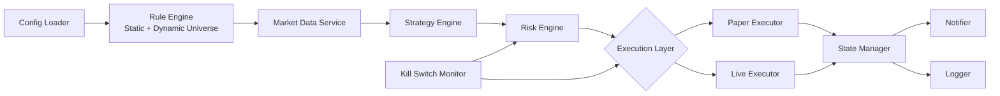

# ⚡ [QUANT-SOURCE-129] Consolidated Quant & Algo Trading Repositories
**Category**: `MACHINE_LEARNING_RL_ALPHA` | **Repositories in this Source**: 3
**Generated**: QUANT_BUNDLE_129_MACHINE_LEARNING_RL_ALPHA.md | **Target**: NotebookLM 290+ Quant Code Brain

---

## [1/3] Repository: qlib (`WHEEL_qlib`)
- **Full Name**: `qlib`
- **Description**: Qlib is an AI-oriented Quant investment platform that aims to use AI tech to empower Quant Research, from exploring ideas to implementing productions. Qlib supports diverse ML modeling paradigms, including supervised learning, market dynamics modeling, and RL, and is now equipped with https://github.com/microsoft/RD-Agent to automate R&D process.
- **GitHub Stars**: 48602
- **Source Pool**: `cloned_trading_wheels`

### Documentation & Overview (README.md)
[](https://pypi.org/project/pyqlib/#files)
[](https://pypi.org/project/pyqlib/#files)
[](https://pypi.org/project/pyqlib/#history)
[](https://pypi.org/project/pyqlib/)
[](https://github.com/microsoft/qlib/actions)
[](https://qlib.readthedocs.io/en/latest/?badge=latest)
[](LICENSE)
[](https://gitter.im/Microsoft/qlib?utm_source=badge&utm_medium=badge&utm_campaign=pr-badge&utm_content=badge)

## :newspaper: **What's NEW!** &nbsp;   :sparkling_heart: 

Recent released features

### Introducing <a href="https://github.com/microsoft/RD-Agent"></a>: LLM-Based Autonomous Evolving Agents for Industrial Data-Driven R&D

We are excited to announce the release of **RD-Agent**📢, a powerful tool that supports automated factor mining and model optimization in quant investment R&D.

RD-Agent is now available on [GitHub](https://github.com/microsoft/RD-Agent), and we welcome your star🌟!

To learn more, please visit the [RD-Agent repository](https://github.com/microsoft/RD-Agent). We have prepared several public demo videos for you:

| Scenario | Demo video (English) | Demo video (中文) |
| --                      | ------    | ------    |
| Quant Factor Mining | [YouTube](https://www.youtube.com/watch?v=X4DK2QZKaKY&t=6s) | [YouTube](https://www.youtube.com/watch?v=X4DK2QZKaKY&t=6s) |
| Quant Factor Mining from reports | [YouTube](https://www.youtube.com/watch?v=ECLTXVcSx-c) | [YouTube](https://www.youtube.com/watch?v=ECLTXVcSx-c) |
| Quant Model Optimization | [YouTube](https://www.youtube.com/watch?v=dm0dWL49Bc0&t=104s) | [YouTube](https://www.youtube.com/watch?v=dm0dWL49Bc0&t=104s) |

- 📃**Paper**: [R&D-Agent-Quant: A Multi-Agent Framework for Data-Centric Factors and Model Joint Optimization](https://arxiv.org/abs/2505.15155)
- 👾**Code**: https://github.com/microsoft/RD-Agent/
```BibTeX
@misc{li2025rdagentquant,
    title={R\&D-Agent-Quant: A Multi-Agent Framework for Data-Centric Factors and Model Joint Optimization},
    author={Yuante Li and Xu Yang and Xiao Yang and Minrui Xu and Xisen Wang and Weiqing Liu and Jiang Bian},
    year={2025},
    eprint={2505.15155},
    archivePrefix={arXiv},
    primaryClass={cs.AI}
}
```


***

| Feature | Status |
| --                      | ------    |
| [R&D-Agent-Quant](https://arxiv.org/abs/2505.15155) Published | Apply R&D-Agent to Qlib for quant trading | 
| BPQP for End-to-end learning | 📈Coming soon!([Under review](https://github.com/microsoft/qlib/pull/1863)) |
| 🔥LLM-driven Auto Quant Factory🔥 | 🚀 Released in [♾️RD-Agent](https://github.com/microsoft/RD-Agent) on Aug 8, 2024 |
| KRNN and Sandwich models | :chart_with_upwards_trend: [Released](https://github.com/microsoft/qlib/pull/1414/) on May 26, 2023 |
| Release Qlib v0.9.0 | :octocat: [Released](https://github.com/microsoft/qlib/releases/tag/v0.9.0) on Dec 9, 2022 |
| RL Learning Framework | :hammer: :chart_with_upwards_trend: Released on Nov 10, 2022. [#1332](https://github.com/microsoft/qlib/pull/1332), [#1322](https://github.com/microsoft/qlib/pull/1322), [#1316](https://github.com/microsoft/qlib/pull/1316),[#1299](https://github.com/microsoft/qlib/pull/1299),[#1263](https://github.com/microsoft/qlib/pull/1263), [#1244](https://github.com/microsoft/qlib/pull/1244), [#1169](https://github.com/microsoft/qlib/pull/1169), [#1125](https://github.com/microsoft/qlib/pull/1125), [#1076](https://github.com/microsoft/qlib/pull/1076)|
| HIST and IGMTF models | :chart_with_upwards_trend: [Released](https://github.com/microsoft/qlib/pull/1040) on Apr 10, 2022 |
| Qlib [notebook tutorial](https://github.com/microsoft/qlib/tree/main/examples/tutorial) | 📖 [Released](https://github.com/microsoft/qlib/pull/1037) on Apr 7, 2022 | 
| Ibovespa index data | :rice: [Released](https://github.com/microsoft/qlib/pull/990) on Apr 6, 2022 |
| Point-in-Time database | :hammer: [Released](https://github.com/microsoft/qlib/pull/343) on Mar 10, 2022 |
| Arctic Provider Backend & Orderbook data example | :hammer: [Released](https://github.com/microsoft/qlib/pull/744) on Jan 17, 2022 |
| Meta-Learning-based framework & DDG-DA  | :chart_with_upwards_trend:  :hammer: [Released](https://github.com/microsoft/qlib/pull/743) on Jan 10, 2022 | 
| Planning-based portfolio optimization | :hammer: [Released](https://github.com/microsoft/qlib/pull/754) on Dec 28, 2021 | 
| Release Qlib v0.8.0 | :octocat: [Released](https://github.com/microsoft/qlib/releases/tag/v0.8.0) on Dec 8, 2021 |
| ADD model | :chart_with_upwards_trend: [Released](https://github.com/microsoft/qlib/pull/704) on Nov 22, 2021 |
| ADARNN  model | :chart_with_upwards_trend: [Released](https://github.com/microsoft/qlib/pull/689) on Nov 14, 2021 |
| TCN  model | :chart_with_upwards_trend: [Released](https://github.com/microsoft/qlib/pull/668) on Nov 4, 2021 |
| Nested Decision Framework | :hammer: [Released](https://github.com/microsoft/qlib/pull/438) on Oct 1, 2021. [Example](https://github.com/microsoft/qlib/blob/main/examples/nested_decision_execution/workflow.py) and [Doc](https://qlib.readthedocs.io/en/latest/component/highfreq.html) |
| Temporal Routing Adaptor (TRA) | :chart_with_upwards_trend: [Released](https://github.com/microsoft/qlib/pull/531) on July 30, 2021 |
| Transformer & Localformer | :chart_with_upwards_trend: [Released](https://github.com/microsoft/qlib/pull/508) on July 22, 2021 |
| Release Qlib v0.7.0 | :octocat: [Released](https://github.com/microsoft/qlib/releases/tag/v0.7.0) on July 12, 2021 |
| TCTS Model | :chart_with_upwards_trend: [Released](https://github.com/microsoft/qlib/pull/491) on July 1, 2021 |
| Online serving and automatic model rolling | :hammer:  [Released](https://github.com/microsoft/qlib/pull/290) on May 17, 2021 | 
| DoubleEnsemble Model | :chart_with_upwards_trend: [Released](https://github.com/microsoft/qlib/pull/286) on Mar 2, 2021 | 
| High-frequency data processing example | :hammer: [Released](https://github.com/microsoft/qlib/pull/257) on Feb 5, 2021  |
| High-frequency trading example | :chart_with_upwards_trend: [Part of code released](https://github.com/microsoft/qlib/pull/227) on Jan 28, 2021  | 
| High-frequency data(1min) | :rice: [Released](https://github.com/microsoft/qlib/pull/221) on Jan 27, 2021 |
| Tabnet Model | :chart_with_upwards_trend: [Released](https://github.com/microsoft/qlib/pull/205) on Jan 22, 2021 |

Features released before 2021 are not listed here.

<p align="center">
  
</p>

Qlib is an open-source, AI-oriented quantitative investment platform that aims to realize the potential, empower research, and create value using AI technologies in quantitative investment, from exploring ideas to implementing productions. Qlib supports diverse machine learning modeling paradigms, including supervised learning, market dynamics modeling, and reinforcement learning.

An increasing number of SOTA Quant research works/papers in diverse paradigms are being released in Qlib to collaboratively solve key challenges in quantitative investment. For example, 1) using supervised learning to mine the market's complex non-linear patterns from rich and heterogeneous financial data, 2) modeling the dynamic nature of the financial market using adaptive concept drift technology, and 3) using reinforcement learning to model continuous investment decisions and assist investors in optimizing their trading strategies.

It contains the full ML pipeline of data processing, model training, back-testing; and covers the entire chain of quantitative investment: alpha seeking, risk modeling, portfolio optimization, and order execution. 
For more details, please refer to our paper ["Qlib: An AI-oriented Quantitative Investment Platform"](https://arxiv.org/abs/2009.11189).


<table>
  <tbody>
    <tr>
      <th>Frameworks, Tutorial, Data & DevOps</th>
      <th>Main Challenges & Solutions in Quant Research</th>
    </tr>
    <tr>
      <td>
        <li><a href="#plans"><strong>Plans</strong></a></li>
        <li><a href="#framework-of-qlib">Framework of Qlib</a></li>
        <li><a href="#quick-start">Quick Start</a></li>
          <ul dir="auto">
            <li type="circle"><a href="#installation">Installation</a> </li>
            <li type="circle"><a href="#data-preparation">Data Preparation</a></li>
            <li type="circle"><a href="#auto-quant-research-workflow">Auto Quant Research Workflow</a></li>
            <li type="circle"><a href="#building-customized-quant-research-workflow-by-code">Building Customized Quant Research Workflow by Code</a></li></ul>
        <li><a href="#quant-dataset-zoo"><strong>Quant Dataset Zoo</strong></a></li>
        <li><a href="#learning-framework">Learning Framework</a></li>
        <li><a href="#more-about-qlib">More About Qlib</a></li>
        <li><a href="#offline-mode-and-online-mode">Offline Mode and Online Mode</a>
        <ul>
          <li type="circle"><a href="#performance-of-qlib-data-server">Performance of Qlib Data Server</a></li></ul>
        <li><a href="#related-reports">Related Reports</a></li>
        <li><a href="#contact-us">Contact Us</a></li>
        <li><a href="#contributing">Contributing</a></li>
      </td>
      <td valign="baseline">
        <li><a href="#main-challenges--solutions-in-quant-research">Main Challenges &amp; Solutions in Quant Research</a>
          <ul>
            <li type="circle"><a href="#forecasting-finding-valuable-signalspatterns">Forecasting: Finding Valuable Signals/Patterns</a>
              <ul>
                <li type="disc"><a href="#quant-model-paper-zoo"><strong>Quant Model (Paper) Zoo</strong></a>
                  <ul>
                    <li type="circle"><a href="#run-a-single-model">Run a Single Model</a></li>
                    <li type="circle"><a href="#run-multiple-models">Run Multiple Models</a></li>
                  </ul>
                </li>
              </ul>
            </li>
          <li type="circle"><a href="#adapting-to-market-dynamics">Adapting to Market Dynamics</a></li>
          <li type="circle"><a href="#reinforcement-learning-modeling-continuous-decisions">Reinforcement Learning: modeling continuous decisions</a></li>
          </ul>
        </li>
      </td>
    </tr>
  </tbody>
</table>

# Plans
New features under development(order by estimated release time).
Your feedbacks about the features are very important.
<!-- | Feature                        | Status      | -->
<!-- | --                      | ------    | -->

# Framework of Qlib

<div style="align: center">

</div>

The high-level framework of Qlib can be found above(users can find the [detailed framework](https://qlib.readthedocs.io/en/latest/introduction/introduction.html#framework) of Qlib's design when getting into nitty gritty).
The components are designed as loose-coupled modules, and each component could be used stand-alone.

Qlib provides a strong infrastructure to support Quant research. [Data](https://qlib.readthedocs.io/en/latest/component/data.html) is always an important part.
A strong learning framework is designed to support diverse learning paradigms (e.g. [reinforcement learning](https://qlib.readthedocs.io/en/latest/component/rl.html), [supervised learning](https://qlib.readthedocs.io/en/latest/component/workflow.html#model-section)) and patterns at different levels(e.g. [market dynamic modeling](https://qlib.readthedocs.io/en/latest/component/meta.html)).
By modeling the market, [trading strategies](https://qlib.readthedocs.io/en/latest/component/strategy.html) will generate trade decisions that will be executed. Multiple trading strategies and executors in different levels or granularities can be [nested to be optimized and run together](https://qlib.readthedocs.io/en/latest/component/highfreq.html).
At last, a comprehensive [analysis](https://qlib.readthedocs.io/en/latest/component/report.html) will be provided and the model can be [served online](https://qlib.readthedocs.io/en/latest/component/online.html) in a low cost.


# Quick Start

This quick start guide tries to demonstrate
1. It's very easy to build a complete Quant research workflow and try your ideas with _Qlib_.
2. Though with *public data* and *simple models*, machine learning technologies **work very well** in practical Quant investment.

Here is a quick **[demo](https://terminalizer.com/view/3f24561a4470)** shows how to install ``Qlib``, and run LightGBM with ``qrun``. **But**, please make sure you have already prepared the data following the [instruction](#data-preparation).


## Installation

This table demonstrates the supported Python version of `Qlib`:
|               | install with pip      | install from source  |        plot        |
| ------------- |:---------------------:|:--------------------:|:------------------:|
| Python 3.8    | :heavy_check_mark:    | :heavy_check_mark:   | :heavy_check_mark: |
| Python 3.9    | :heavy_check_mark:    | :heavy_check_mark:   | :heavy_check_mark: |
| Python 3.10   | :heavy_check_mark:    | :heavy_check_mark:   | :heavy_check_mark: |
| Python 3.11   | :heavy_check_mark:    | :heavy_check_mark:   | :heavy_check_mark: |
| Python 3.12   | :heavy_check_mark:    | :heavy_check_mark:   | :heavy_check_mark: |

**Note**: 
1. **Conda** is suggested for managing your Python environment. In some cases, using Python outside of a `conda` environment may result in missing header files, causing the installation failure of certain packages.
2. Please pay attention that installing cython in Python 3.6 will raise some error when installing ``Qlib`` from source. If users use Python 3.6 on their machines, it is recommended to *upgrade* Python to version 3.8 or higher, or use `conda`'s Python to install ``Qlib`` from source.

### Install with pip
Users can easily install ``Qlib`` by pip according to the following command.

```bash
  pip install pyqlib
```

**Note**: pip will install the latest stable qlib. However, the main branch of qlib is in active development. If you want to test the latest scripts or functions in the main branch. Please install qlib with the methods below.

### Install from source
Also, users can install the latest dev version ``Qlib`` by the source code according to the following steps:

* Before installing ``Qlib`` from source, users need to install some dependencies:

  ```bash
  pip install numpy
  pip install --upgrade cython
  ```

* Clone the repository and install ``Qlib`` as follows.
    ```bash
    git clone https://github.com/microsoft/qlib.git && cd qlib
    pip install .  # `pip install -e .[dev]` is recommended for development. check details in docs/developer/code_standard_and_dev_guide.rst
    ```

**Tips**: If you fail to install `Qlib` or run the examples in your environment,  comparing your steps and the [CI workflow](.github/workflows/test_qlib_from_source.yml) may help you find the problem.

**Tips for Mac**: If you are using Mac with M1, you might encounter issues in building the wheel for LightGBM, which is due to missing dependencies from OpenMP. To solve the problem, install openmp first with ``brew install libomp`` and then run ``pip install .`` to build it successfully. 

## Data Preparation
❗ Due to more restrict data security policy. The official dataset is disabled temporarily. You can try [this data source](https://github.com/chenditc/investment_data/releases) contributed by the community.
Here is an example to download the latest data.
```bash
wget https://github.com/chenditc/investment_data/releases/latest/download/qlib_bin.tar.gz
mkdir -p ~/.qlib/qlib_data/cn_data
tar -zxvf qlib_bin.tar.gz -C ~/.qlib/qlib_data/cn_data --strip-components=1
rm -f qlib_bin.tar.gz
```

The official dataset below will resume in short future.


----

Load and prepare data by running the following code:

### Get with module
  ```bash
  # get 1d data
  python -m qlib.cli.data qlib_data --target_dir ~/.qlib/qlib_data/cn_data --region cn

  # get 1min data
  python -m qlib.cli.data qlib_data --target_dir ~/.qlib/qlib_data/cn_data_1min --region cn --interval 1min

  ```

### Get from source

  ```bash
  # get 1d data
  python scripts/get_data.py qlib_data --target_dir ~/.qlib/qlib_data/cn_data --region cn

  # get 1min data
  python scripts/get_data.py qlib_data --target_dir ~/.qlib/qlib_data/cn_data_1min --region cn --interval 1min

  ```

This dataset is created by public data collected by [crawler scripts](scripts/data_collector/), which have been released in
the same repository.
Users could create the same dataset with it. [Description of dataset](https://github.com/microsoft/qlib/tree/main/scripts/data_collector#description-of-dataset)

*Please pay **ATTENTION** that the data is collected from [Yahoo Finance](https://finance.yahoo.com/lookup), and the data might not be perfect.
We recommend users to prepare their own data if they have a high-quality dataset. For more information, users can refer to the [related document](https://qlib.readthedocs.io/en/latest/component/data.html#converting-csv-format-into-qlib-format)*.

### Automatic update of daily frequency data (from yahoo finance)
  > This step is *Optional* if users only want to try their models and strategies on history data.
  > 
  > It is recommended that users update the data manually once (--trading_date 2021-05-25) and then set it to update automatically.
  >
  > **NOTE**: Users can't incrementally  update data based on the offline data provided by Qlib(some fields are removed to reduce the data size). Users should use [yahoo collector](https://github.com/microsoft/qlib/tree/main/scripts/data_collector/yahoo#automatic-update-of-daily-frequency-datafrom-yahoo-finance) to download Yahoo data from scratch and then incrementally update it.
  > 
  > For more information, please refer to: [yahoo collector](https://github.com/microsoft/qlib/tree/main/scripts/data_collector/yahoo#automatic-update-of-daily-frequency-datafrom-yahoo-finance)

  * Automatic update of data to the "qlib" directory each trading day(Linux)
      * use *crontab*: `crontab -e`
      * set up timed tasks:

        ```
        * * * * 1-5 python <script path> update_data_to_bin --qlib_data_1d_dir <user data dir>
        ```
        * **script path**: *scripts/data_collector/yahoo/collector.py*

  * Manual update of data
      ```
      python scripts/data_collector/yahoo/collector.py update_data_to_bin --qlib_data_1d_dir <user data dir> --trading_date <start date> --end_date <end date>
      ```
      * *trading_date*: start of trading day
      * *end_date*: end of trading day(not included)

### Checking the health of the data
  * We provide a script to check the health of the data, you can run the following commands to check whether the data is healthy or not.
    ```
    python scripts/check_data_health.py check_data --qlib_dir ~/.qlib/qlib_data/cn_data
    ```
  * Of course, you can also add some parameters to adjust the test results, such as this.
    ```
    python scripts/check_data_health.py check_data --qlib_dir ~/.qlib/qlib_data/cn_data --missing_data_num 30055 --large_step_threshold_volume 94485 --large_step_threshold_price 20
    ```
  * If you want more information about `check_data_health`, please refer to the [documentation](https://qlib.readthedocs.io/en/latest/component/data.html#checking-the-health-of-the-data).

<!-- 
- Run the initialization code and get stock data:

  ```python
  import qlib
  from qlib.data import D
  from qlib.constant import REG_CN

  # Initialization
  mount_path = "~/.qlib/qlib_data/cn_data"  # target_dir
  qlib.init(mount_path=mount_path, region=REG_CN)

  # Get stock data by Qlib
  # Load trading calendar with the given time range and frequency
  print(D.calendar(start_time='2010-01-01', end_time='2017-12-31', freq='day')[:2])

  # Parse a given market name into a stockpool config
  instruments = D.instruments('csi500')
  print(D.list_instruments(instruments=instruments, start_time='2010-01-01', end_time='2017-12-31', as_list=True)[:6])

  # Load features of certain instruments in given time range
  instruments = ['SH600000']
  fields = ['$close', '$volume', 'Ref($close, 1)', 'Mean($close, 3)', '$high-$low']
  print(D.features(instruments, fields, start_time='2010-01-01', end_time='2017-12-31', freq='day').head())
  ```
 -->

## Docker images
1. Pulling a docker image from a docker hub repository
    ```bash
    docker pull pyqlib/qlib_image_stable:stable
    ```
2. Start a new Docker container
    ```bash
    docker run -it --name <container name> -v <Mounted local directory>:/app pyqlib/qlib_image_stable:stable
    ```
3. At this point you are in the docker environment and can run the qlib scripts. An example:
    ```bash
    >>> python scripts/get_data.py qlib_data --name qlib_data_simple --target_dir ~/.qlib/qlib_data/cn_data --interval 1d --region cn
    >>> python qlib/cli/run.py examples/benchmarks/LightGBM/workflow_config_lightgbm_Alpha158.yaml
    ```
4. Exit the container
    ```bash
    >>> exit
    ```
5. Restart the container
    ```bash
    docker start -i -a <container name>
    ```
6. Stop the container
    ```bash
    docker stop <container name>
    ```
7. Delete the container
    ```bash
    docker rm <container name>
    ```
8. If you want to know more information, please refer to the [documentation](https://qlib.readthedocs.io/en/latest/developer/how_to_build_image.html).

## Auto Quant Research Workflow
Qlib provides a tool named `qrun` to run the whole workflow automatically (including building dataset, training models, backtest and evaluation). You can start an auto quant research workflow and have a graphical reports analysis according to the following steps: 

1. Quant Research Workflow: Run  `qrun` with lightgbm workflow config ([workflow_config_lightgbm_Alpha158.yaml](examples/benchmarks/LightGBM/workflow_config_lightgbm_Alpha158.yaml) as following.
    ```bash
      cd examples  # Avoid running program under the directory contains `qlib`
      qrun benchmarks/LightGBM/workflow_config_lightgbm_Alpha158.yaml
    ```
    If users want to use `qrun` under debug mode, please use the following command:
    ```bash
    python -m pdb qlib/cli/run.py examples/benchmarks/LightGBM/workflow_config_lightgbm_Alpha158.yaml
    ```
    The result of `qrun` is as follows, please refer to [docs](https://qlib.readthedocs.io/en/latest/component/strategy.html#result) for more explanations about the result. 

    ```bash

    'The following are analysis results of the excess return without cost.'
                           risk
    mean               0.000708
    std                0.005626
    annualized_return  0.178316
    information_ratio  1.996555
    max_drawdown      -0.081806
    'The following are analysis results of the excess return with cost.'
                           risk
    mean               0.000512
    std                0.005626
    annualized_return  0.128982
    information_ratio  1.444287
    max_drawdown      -0.091078
    ```
    Here are detailed documents for `qrun` and [workflow](https://qlib.readthedocs.io/en/latest/component/workflow.html).

2. Graphical Reports Analysis: First, run `python -m pip install .[analysis]` to install the required dependencies. Then run `examples/workflow_by_code.ipynb` with `jupyter notebook` to get graphical reports. 
    - Forecasting signal (model prediction) analysis
      - Cumulative Return of groups
      
      - Return distribution
      
      - Information Coefficient (IC)
      
      
      
      - Auto Correlation of forecasting signal (model prediction)
      
- **Full Name**: `rqalpha`
- **Description**: 
- **GitHub Stars**: 0
- **Source Pool**: `cloned_trading_wheels`

### Documentation & Overview (README.md)
=======
RQAlpha
=======

..  image:: https://raw.githubusercontent.com/ricequant/rq-resource/master/rqalpha/logo.jpg

..  image:: https://github.com/ricequant/rqalpha/workflows/Test/badge.svg
    :target: https://github.com/ricequant/rqalpha/actions?query=workflow%3ATest
    :alt: GitHub Actions status for master branch

..  image:: https://coveralls.io/repos/github/ricequant/rqalpha/badge.svg?branch=master
    :target: https://coveralls.io/github/ricequant/rqalpha?branch=master

..  image:: https://readthedocs.org/projects/rqalpha/badge/?version=latest
    :target: http://rqalpha.readthedocs.io/zh_CN/latest/?badge=latest
    :alt: Documentation Status

..  image:: https://img.shields.io/pypi/v/rqalpha.svg
    :target: https://pypi.python.org/pypi/rqalpha
    :alt: PyPI Version

..  image:: https://img.shields.io/pypi/pyversions/rqalpha.svg
    :target: https://pypi.python.org/pypi/rqalpha
    :alt: Python Version Support


..  image:: https://img.shields.io/pypi/dm/rqalpha?label=pypi%20downloads
    :target: https://pypi.python.org/pypi/rqalpha
    :alt: PyPI - Downloads


RQAlpha 从数据获取、算法交易、回测引擎，实盘模拟，实盘交易到数据分析，为程序化交易者提供了全套解决方案。

**仅限非商业使用。如需商业使用，请联系我们：public@ricequant.com**

RQAlpha 具有灵活的配置方式，强大的扩展性，用户可以非常容易地定制专属于自己的程序化交易系统。

RQAlpha 所有的策略都可以直接在 `Ricequant`_ 上进行回测和实盘模拟，并且可以通过微信和邮件实时推送您的交易信号。

`Ricequant`_ 是一个开放的量化算法交易社区，为程序化交易者提供免费的回测和实盘模拟环境，并且会不间断举行实盘资金投入的量化比赛。

特点
============================

======================    =================================================================================
易于使用                    让您集中于策略的开发，一行简单的命令就可以执行您的策略。
完善的文档                   您可以直接访问 `RQAlpha 文档`_ 或者 `Ricequant 文档`_ 来获取您需要的信息。
活跃的社区                   您可以通过访问 `Ricequant 社区`_ 获取和询问有关 RQAlpha 的一切问题，有很多优秀的童鞋会解答您的问题。
稳定的环境                   每天都有会大量的算法交易在 Ricequant 上运行，无论是 RQAlpha，还是数据，我们能会做到问题秒处理，秒解决。
灵活的配置                   您可以使用多种方式来配置和运行策略，只需简单的配置就可以构建适合自己的交易系统。
强大的扩展性                 开发者可以基于我们提供的 Mod Hook 接口来进行扩展。
======================    =================================================================================

快速指引
============================

*   `RQAlpha 介绍`_
*   `安装指南`_
*   `10分钟学会 RQAlpha`_
*   `策略示例`_

API 手册
============================

*   `API`_ : RQAlpha API 手册

更新记录
============================

*   `CHANGELOG`_ RQALPHA 更新记录

Mod
============================

RQAlpha 提供了极具拓展性的 Mod Hook 接口，这意味着开发者可以非常容易的对接第三方库。

您可以通过如下方式使用 安装和使用Mod:

..  code-block:: bash

    # 查看当前安装的 Mod 列表及状态
    $ rqalpha mod list
    # 启用 Mod
    $ rqalpha mod enable xxx
    # 禁用 Mod
    $ rqalpha mod disable xxx

以下是目前已经集成的 Mod 列表:

=======================    ==================================================================================
Mod名                       说明
=======================    ==================================================================================
`sys_accounts`_            提供了股票、期货的下单 API 实现及持仓模型的实现
`sys_analyser`_            记录每天的下单、成交、投资组合、持仓等信息，并计算风险度指标，并以csv、plot图标等形式输出分析结果
`sys_progress`_            在控制台输出当前策略的回测进度。
`sys_risk`_                对订单进行事前风控校验
`sys_scheduler`_           提供了定时器，即按照特定周期执行指定逻辑的功能
`sys_simulation`_          提供了模拟撮合引擎及回测事件源等模块，为回测和模拟交易提供支持
`sys_transaction_cost`_    实现了股票、期货的交易税费计算逻辑
=======================    ==================================================================================

如果您基于 RQAlpha 进行了 Mod 扩展，欢迎告知我们，在审核通过后，会在 Mod 列表中添加您的 Mod 信息和链接。


RQData数据本地化服务
====================

为专业投资者提供便利易用的金融数据方案，免除数据整理、清洗及运维的困扰，使投研人员及策略开发者可以更专注于投研及模型开发等关键环节。米筐RQData金融数据API可无缝对接RQAlpha，您只需在策略中import rqdatac，即可通过API本地调用以下数据：

=============================       ==================================================================================
**合约信息**                              中国A股、指数、场内场外基金、期货、场内债券的基本合约信息
**A股基础信息**                           交易日、股票拆分和分红、停牌、ST股判断等数据
**行情数据**                              A股2005年至今及实时行情数据（含连续竞价时间段）；指数快照行情、历史权重、指数估值指标等
**基金数据**                              基础数据、净值数据、报告披露、持仓数据等
**期货、期权和现货数据**                   全市场期权数据；期货历史及快照行情数据等；期货主力连续合约；期货会员持仓排名及仓单
**可转债数据**                            可转债基础合约；可转债股价、转债导致规模变化、现金等数据
**A股上市以来的所有财务数据**               基础财务数据、营运、盈利能力、估值等；财务快报及业绩预告、TTM滚动财务数据等；支持财务数据Point in Time API
**行业、板块、概念分类**                   股票资金现金流入流出、换手率
**风格因子数据**                          风格因子暴露度、收益率、协方差和特异风险。（每个交易日8:30开始更新增量数据）
**宏观经济数据**                          存款准备金率、货币供应量、大量宏观因子等数据
**电商数据**                              天猫、淘宝、京东三大平台（日更新）。注：与超对称科技合作提供
**舆情数据**                              雪球与东方财富股吧。注：与数据合作方合作提供
=============================       ==================================================================================

目前RQData已正式上线，支持Python API、Matlab API及Excel插件等多种调取方式，欢迎 `免费试用 <https://www.ricequant.com/welcome/rqdata>`_ 和 `咨询私有化部署 <https://www.ricequant.com/welcome/pricing>`_ 。

加入开发
============================

*   `如何贡献代码`_
*   `基本概念`_
*   `RQAlpha 基于 Mod 进行扩展`_

获取帮助
============================

关于RQAlpha的任何问题可以通过以下途径来获取帮助

*  可以通过 `索引`_ 或者使用搜索功能来查找特定问题
*  在 `Github Issues`_ 中提交issue
*  RQAlpha 交流群「487188429」


.. _Github Issues: https://github.com/ricequant/rqalpha/issues
.. _Ricequant: https://www.ricequant.com/algorithms
.. _RQAlpha 文档: http://rqalpha.readthedocs.io/zh_CN/latest/
.. _Ricequant 文档: https://www.ricequant.com/api/python/chn
.. _Ricequant 社区: https://www.ricequant.com/community/category/all/
.. _FAQ: http://rqalpha.readthedocs.io/zh_CN/latest/faq.html
.. _索引: http://rqalpha.readthedocs.io/zh_CN/latest/genindex.html
.. _RQPro: https://www.ricequant.com/rqpro_propaganda/?utm_source=github
.. _专业级本地终端RQPro: https://www.ricequant.com/rqpro_propaganda/?utm_source=github

.. _RQAlpha 介绍: http://rqalpha.readthedocs.io/zh_CN/latest/intro/overview.html
.. _安装指南: http://rqalpha.readthedocs.io/zh_CN/latest/intro/install.html
.. _10分钟学会 RQAlpha: http://rqalpha.readthedocs.io/zh_CN/latest/intro/tutorial.html
.. _策略示例: http://rqalpha.readthedocs.io/zh_CN/latest/intro/examples.html

.. _API: http://rqalpha.readthedocs.io/zh_CN/latest/api/base_api.html

.. _如何贡献代码: http://rqalpha.readthedocs.io/zh_CN/latest/development/make_contribute.html
.. _基本概念: http://rqalpha.readthedocs.io/zh_CN/latest/development/basic_concept.html
.. _RQAlpha 基于 Mod 进行扩展: http://rqalpha.readthedocs.io/zh_CN/latest/development/mod.html
.. _History: http://rqalpha.readthedocs.io/zh_CN/latest/history.html
.. _TODO: https://github.com/ricequant/rqalpha/blob/master/TODO.md
.. _develop 分支: https://github.com/ricequant/rqalpha/tree/develop
.. _master 分支: https://github.com/ricequant/rqalpha
.. _rqalpha_mod_tushare: https://github.com/ricequant/rqalpha-mod-tushare
.. _通过 Mod 扩展 RQAlpha: http://rqalpha.readthedocs.io/zh_CN/latest/development/mod.html
.. _sys_analyser: https://github.com/ricequant/rqalpha/blob/master/rqalpha/mod/rqalpha_mod_sys_analyser/README.rst
.. _sys_scheduler: https://github.com/ricequant/rqalpha/blob/master/rqalpha/mod/rqalpha_mod_sys_scheduler/README.rst
.. _sys_progress: https://github.com/ricequant/rqalpha/blob/master/rqalpha/mod/rqalpha_mod_sys_progress/README.rst
.. _sys_risk: https://github.com/ricequant/rqalpha/blob/master/rqalpha/mod/rqalpha_mod_sys_risk/README.rst
.. _sys_simulation: https://github.com/ricequant/rqalpha/blob/master/rqalpha/mod/rqalpha_mod_sys_simulation/README.rst
.. _sys_accounts: https://github.com/ricequant/rqalpha/blob/master/rqalpha/mod/rqalpha_mod_sys_accounts/README.rst
.. _sys_transaction_cost: https://github.com/ricequant/rqalpha/blob/master/rqalpha/mod/rqalpha_mod_sys_transaction_cost/README.rst
.. _RQData数据本地化服务: https://www.ricequant.com/doc/rqdata-institutional
.. _点击链接免费开通: https://ricequant.mikecrm.com/h7ZFJnT
.. _RQData: https://www.ricequant.com/welcome/rqdata
.. _CHANGELOG: https://rqalpha.readthedocs.io/zh_CN/latest/history.html

### Core Implementation Code & Architecture
#### File: `rqalpha/mod/rqalpha_mod_sys_analyser/report/__init__.py`
```python
from .report import generate_report
```

#### File: `rqalpha/mod/rqalpha_mod_sys_analyser/utils.py`
```python
import re
import pandas as pd


EQUITIES_OID_RE = re.compile(r"^(?:\d{6}\.(?:XSHE|XSHG|BJSE)|\d{5}\.XHKG)$")


def all_trades_are_equities(trades: pd.DataFrame) -> bool:
    if trades.empty or "order_book_id" not in trades.columns:
        return False
    return trades["order_book_id"].map(lambda oid: isinstance(oid, str) and EQUITIES_OID_RE.match(oid) is not None).all()
```

#### File: `rqalpha/examples/run_file_demo.py`
```python
# -*- coding: utf-8 -*-

from rqalpha import run_file

config = {
  "base": {
    "start_date": "2016-06-01",
    "end_date": "2016-12-01",
    "benchmark": "000300.XSHG",
    "accounts": {
      "stock": 100000
    }
  },
  "extra": {
    "log_level": "verbose",
  },
  "mod": {
    "sys_analyser": {
      "enabled": True,
      "plot": True
    }
  }
}

strategy_file_path = "./buy_and_hold.py"

run_file(strategy_file_path, config)
```

#### File: `rqalpha/utils/testing/mocking.py`
```python
def mock_instrument(order_book_id="000001", _type="CS", exchange="XSHE", **kwargs):
    from rqalpha.model.instrument import Instrument

    ins_dict = {
        "order_book_id": order_book_id,
        "type": _type,
        "exchange": exchange,
    }
    ins_dict.update(kwargs)

    return Instrument(ins_dict)


def mock_bar(instrument, **kwargs):
    from rqalpha.model.bar import BarObject
    return BarObject(instrument, kwargs)


def mock_tick(instrumnet, **kwargs):
    from rqalpha.model.tick import TickObject
    return TickObject(instrumnet, kwargs)
```

#### File: `tests/integration_tests/conftest.py`
```python
import pytest
import os


@pytest.fixture
def testcase_name(request):
    if isinstance(request.node.parent, pytest.Class):
        casename = f"{request.node.parent.name}#{request.node.name}"
    else:
        casename = request.node.name

    return f"{os.path.split(request.path)[-1][:-3]}#{casename}"  # type: ignore


@pytest.fixture
def assert_order():
    def _assert_order(order, **kwargs):
        for field, value in kwargs.items():
            assert getattr(order, field) == value, "order.{} is wrong, {} != {}".format(field, getattr(order, field), value)
    return _assert_order
```

#### File: `tests/unittest/test_const.py`
```python
import pytest

from rqalpha.const import MARKET


@pytest.mark.parametrize(
    "value, expected",
    [
        ("CN", MARKET.CN),
        ("cn", MARKET.CN),
        ("Cn", MARKET.CN),
        ("HK", MARKET.HK),
        ("hk", MARKET.HK),
        ("Hk", MARKET.HK),
    ],
)
def test_market_accepts_case_insensitive_values(value, expected):
    assert MARKET(value) is expected


@pytest.mark.parametrize(
    "key, expected",
    [
        ("CN", MARKET.CN),
        ("cn", MARKET.CN),
        ("HK", MARKET.HK),
        ("hk", MARKET.HK),
    ],
)
def test_market_accepts_case_insensitive_keys(key, expected):
    assert MARKET[key] is expected
```


==================================================


## [3/3] Repository: stocks-ai-trader (`WHEEL_stocks-ai-trader`)
- **Full Name**: `stocks-ai-trader`
- **Description**: 
- **GitHub Stars**: 0
- **Source Pool**: `cloned_trading_wheels`

### Documentation & Overview (README.md)
# Stocks AI Trader

AI-assisted automated equity trading system for Indian markets (NSE/BSE) using Dhan APIs, with paper trading first and strict risk controls before live deployment.

## Project Status

This repository is currently **design and specification first**.

- Detailed requirements, architecture, FMEA, and module-level LLDs are available under `docs/`.
- Core implementation (`src/`, tests, runtime config) is planned based on these documents.
- Paper mode is intended to be the default until explicit live-mode enablement.

## Goals

- Automate trade entry, stop-loss placement, and exits.
- Enforce hard limits: per-trade SL, daily loss cap, cumulative drawdown cap.
- Run paper trading and live trading with the same decision logic.
- Provide an auditable log of signals, decisions, orders, and outcomes.

## Scope (Phase 1)

- Equity trading only via Dhan (NSE/BSE).
- Single-broker integration (Dhan).
- Local-machine runtime.

Out of scope in phase 1: F&O/derivatives, multi-broker support, cloud deployment, web dashboard.

## Architecture Summary



## Trading and Risk Model

Designed around an initial live capital of `INR 5,000` with conservative defaults:

- Max position size: `INR 1,000`
- Max open positions: `3`
- Per-trade stop-loss: `5%`
- Daily loss cap: `INR 250`
- Total drawdown limit: `INR 500`
- Weekly loss warning: `INR 350`
- Consecutive loss pause: `3` losses -> `60` minute pause

The risk engine is the hard gate before every entry. No order should be sent unless risk checks pass.

## Strategy (Phase 1 Default)

EMA crossover with filters:

- Entry:
	- EMA(9) crosses above EMA(21) on 5-minute candles
	- RSI(14) > 50
	- Price above 20-day SMA
- Exit:
	- EMA(9) crosses below EMA(21)
	- or stop-loss/trailing stop triggers

Signals are tagged with `universe_id` (`static` / `dynamic`) to compare paper performance by universe.

## Paper vs Live Modes

### Paper Mode

- Uses the same strategy and risk paths as live mode.
- Simulates slippage, brokerage, and STT.
- Keeps `static` and `dynamic` universes isolated for fair comparison.

### Live Mode

- Uses Dhan APIs via the official Python SDK.
- Enforces buy + SL atomicity:
	1. Place buy.
	2. Wait for fill.
	3. Place protective SL.
	4. If SL placement fails, force immediate market exit and alert.

## Safety Controls

- Manual kill switch via `KILL_SWITCH=1`.
- Optional kill flag file `kill_switch.flag`.
- Market data freshness checks (stale quote protection).
- Restart recovery with broker reconciliation and SL re-check.
- Structured rotating logs with secret redaction.

## Dhan API Notes

- Trading API: free for individual users.
- Data API: optional paid tier (real-time + historical data).
- Live trading requires static IP whitelisting with Dhan.
- Access tokens are short-lived and must be handled as secrets.

See `docs/dhan_api_guide.md` for full details.

## Repository Structure

Current structure is documentation-centric:

```text
.
├── README.md
├── docs/
│   ├── requirements.md
│   ├── design.md
│   ├── fmea.md
│   ├── dhan_api_guide.md
│   └── lld/
│       ├── config-loader.md
│       ├── dynamic-universe-store.md
│       ├── kill-switch.md
│       ├── live-executor.md
│       ├── logger.md
│       ├── market-data-service.md
│       ├── notifier.md
│       ├── paper-comparison-reporter.md
│       ├── paper-executor.md
│       ├── risk-engine.md
│       ├── rule-engine.md
│       ├── state-manager.md
│       └── strategy-engine.md
└── LICENSE
```

Target implementation structure is described in `docs/design.md`.

## Implementation Roadmap

1. Scaffold project (`src/`, `tests/`, `config/`, `.env.example`, `.gitignore`).
2. Implement config loader and validation.
3. Implement risk engine + persistent risk state.
4. Implement market data service + stale-data guard.
5. Implement strategy engine (EMA crossover).
6. Implement paper executor and comparison reporter.
7. Complete 7-day paper run and produce weekly report.
8. Enable controlled live pilot after checklist sign-off.

## Acceptance Targets (Phase 1)

- 7 consecutive paper-trading days without runtime crashes.
- At least 20 paper trades with full audit logs.
- Verified enforcement of daily loss cap and drawdown limits.
- Kill switch activation handled within 5 seconds.
- Explicit and safe transition path from paper to live.

## Documentation Index

- Product requirements: `docs/requirements.md`
- System design: `docs/design.md`
- Risk analysis (FMEA): `docs/fmea.md`
- Dhan integration guide: `docs/dhan_api_guide.md`
- Module LLDs: `docs/lld/`

## Disclaimer

This project is for educational and engineering purposes. Trading involves risk. Use paper mode first, validate controls thoroughly, and only move to live trading with capital you can afford to lose.

### Core Implementation Code & Architecture
#### File: `.vscode/settings.json`
```python
{
    "airun.settings": {
        "workspaceId": "108da7be-f40e-4cce-a4e7-e1f5a8ce9c0c"
    },
    "mcp": {
        "servers": {
            "dhan": {
                "type": "http",
                "url": "https://mcp.dhan.co/mcp"
            }
        }
    },
    "github.copilot.chat.codeGeneration.useInstructionFiles": true
}
```


==================================================
