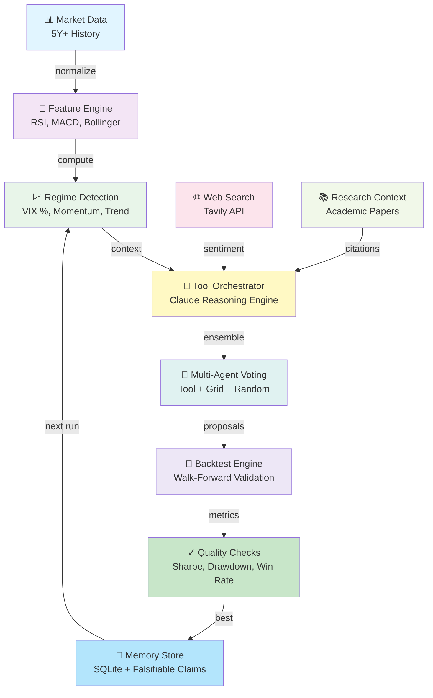

# ⚡ [QUANT-SOURCE-133] Consolidated Quant & Algo Trading Repositories
**Category**: `MACHINE_LEARNING_RL_ALPHA` | **Repositories in this Source**: 3
**Generated**: QUANT_BUNDLE_133_MACHINE_LEARNING_RL_ALPHA.md | **Target**: NotebookLM 290+ Quant Code Brain

---

## [1/3] Repository: tickdb-unified-realtime-marketdata-api (`PHASE4-QUANT-058`)
- **Full Name**: `PHASE4-QUANT-058_TickDB__tickdb-unified-realtime-marketdata-api`
- **Description**: TickDB: AI-native real time stock API and market data API for US stocks, HK stocks, A-shares, forex, crypto, indices and commodities. Skill, CLI, MCP, REST API and WebSocket. AI 原生实时股票 API 与金融行情数据 API，支持美股、港股、A 股、外汇、加密货币、指数和大宗商品。
- **GitHub Stars**: 794
- **Source Pool**: `phase4_quant_wheels_100`

### Documentation & Overview (README.md)
<div align="center">


# TickDB — Unified Real-time Market Data API for Forex, Stocks, Crypto

*One connection for Forex, Precious Metals, Indices, US Stocks, HK Stocks, A-Shares, and Crypto*

*开源工具集 · 完整 API 文档 + AI Skill + MCP 服务端实现*

[](https://tickdb.ai)
[](#ai-access)
[](https://github.com/TickDB/tickdb-unified-realtime-marketdata-api/actions/workflows/mcp-ci.yml)
[](https://github.com/TickDB/tickdb-unified-realtime-marketdata-api/actions/workflows/docs-quality.yml)
[](https://tickdb.ai)
[](#)
[](https://docs.tickdb.ai)
[](LICENSE)

**语言版本:** [🇨🇳 简体中文](README.md) • [🇹🇼 繁體中文](README_tw.md) • [🇺🇸 English](README_en.md)

[📚 在线文档](https://docs.tickdb.ai) • [🌐 官网](https://tickdb.ai) • [🤖 AI 接入 ↓](#ai-access)

</div>

---

## 🎯 什么是 TickDB？

TickDB 是面向开发者、AI 代理和多市场金融应用的 **AI 原生实时行情数据 API**(AI-native real-time market data API)。

通过 **一次接入（one connection）**，无缝访问外汇（Forex）、贵金属（Precious Metals）、指数（Indices）、美股（US Stocks / NASDAQ / NYSE）、港股（HK Stocks）、A 股（A-Shares）、加密货币（Cryptocurrency）等多个金融市场的实时与历史行情数据。

TickDB 专为需要**可靠、低延迟、可长期依赖**行情数据的开发者构建，帮助你**避免管理多个数据源、协议和供应商的复杂性**，专注于业务和策略本身。

> 支持 tick 级成交（trades）、盘口深度（order book / depth）、K 线（candlestick）等多种行情形式，
> 通过 REST API 与 WebSocket 接入，覆盖量化交易、AI Agent、实时行情系统、交易平台与数据分析场景。

---

## 🚀 快速接入

📦 **本仓库提供完整源码**：[`SKILL/`](SKILL/)（AI Skill 配置）· [`mcp/`](mcp/)（Python MCP 服务端，13 工具 · Dockerfile · 46 单元测试 · CI · MIT）。托管端点 `mcp.tickdb.ai` 即基于 [`mcp/`](mcp/) 代码运行 — 你看到的、你部署的、官方在跑的，是同一套代码。

选一种适合你的接入方式：

| 方式 | 适合 | 说明 |
|------|------|------|
| 💬 **[Skill](#skill)** | AI 对话即用，零配置 | npx 一键安装，AI 自动获取试用 Key |
| 🔌 **[MCP](#mcp)** | AI 编码客户端 / 自部署开源 | 托管端点 + JSON 配置，或基于 [`mcp/`](mcp/) 自部署 |
| 💻 **[CLI](#cli)** | 终端 / 脚本 / AI Agent | npm 全局安装，命令行直查行情 |
| 🔧 **[REST API](#rest-api)** | 应用集成 | HTTP API + 6 个端点示例 |
| 🌐 **[WebSocket](#websocket)** | 实时流式数据 | 低延迟订阅 ticker / depth / trade |

---

## ✨ 核心特性

- **🔌 统一接入** - 一套 API 覆盖外汇、贵金属、指数、美股、港股、A 股、加密货币
- **⚡ 实时数据** - 基于 WebSocket 的流式推送，端到端延迟约 10-50ms
- **🤖 AI 原生** - 官方提供 Skill / MCP / CLI 三档 AI 接入，AI Agent 与编码助手开箱即用
- **🛠️ 开发者友好** - RESTful API + WebSocket，结构化 JSON 响应，完整文档与多语言示例
- **🌍 全球覆盖** - 37,527+ 品种，6 大市场（US/HK/CN + Forex/Crypto/Indices）
- **🆓 免费开始** - 无需信用卡，立即获取 API 密钥

---

## 🏗️ 典型使用场景

- **量化交易（Quantitative Trading）** - 算法与策略系统的实时行情数据源
- **AI Agent / 编码助手** - 通过 Skill / MCP 让 AI 助手直接调用行情数据，自然语言驱动查询
- **行情看板** - 实时价格展示、资产与投资组合监控
- **交易应用** - 构建类似 TradingView 的行情界面与图表系统
- **数据分析与回测（Backtesting）** - 历史行情分析、策略回测与研究
- **金融服务集成** - 集成到现有交易平台或金融基础设施中
- **自部署 / 私有化** - 不想用托管端点？基于本仓库 [`mcp/`](mcp/) 代码自部署，完全控制数据流

---

<a id="rest-api"></a>
## 🚀 快速开始 — REST API

### 1. 注册并获取 API 密钥

访问 [TickDB.ai](https://tickdb.ai) 注册账户，即可获取 API 密钥。

#### 🔑 身份认证

所有 HTTP API 请求都需要在请求头中包含 API 密钥：

```http
X-API-Key: YOUR_API_KEY
```

#### 🌐 基础 URL

```
https://api.tickdb.ai
```

#### 📋 HTTP API 核心接口

| 接口 | 方法 | 描述 |
|------|------|------|
| `/v1/market/kline` | GET | 历史 K 线 / 蜡烛图（Candlestick）数据 |
| `/v1/market/ticker` | GET | 实时行情（Ticker）数据 |
| `/v1/market/depth` | GET | 订单簿深度（Order Book）数据 |
| `/v1/market/trades` | GET | 最近成交（Recent Trades）历史 |

#### 🏪 支持的市场

| 市场类型 | Symbol 格式示例 | 说明 |
|---------|----------------|------|
| 外汇（Forex / FX） | `GBPUSD` | 主要货币对（Base/Quote） |
| 贵金属（Precious Metals） | `XAUUSD` | 贵金属对美元（Commodity / USD） |
| 美股（US Stocks） | `AAPL.US` | NYSE / NASDAQ 上市股票 |
| 指数（Indices） | `SPX` | 股票指数（如标准普尔 500） |
| 港股（HK Stocks） | `700.HK` | 港交所上市证券 |
| A 股（A-Shares） | `600519.SH` | 上海 / 深圳交易所股票 |
| 加密货币（Cryptocurrency） | `BTCUSDT` | 加密资产交易对 |

### 2. 获取 K 线（K-line）数据

```bash
curl -H "X-API-Key: YOUR_API_KEY" \
     "https://api.tickdb.ai/v1/market/kline?symbol=700.HK&interval=1h&limit=24"
```

### 3. 获取实时行情（Ticker）数据

```bash
curl -H "X-API-Key: YOUR_API_KEY" \
     "https://api.tickdb.ai/v1/market/ticker?symbols=AAPL.US,700.HK,BTCUSDT"
```

### 4. 获取盘口深度（Depth）数据

```bash
curl -H "X-API-Key: YOUR_API_KEY" \
     "https://api.tickdb.ai/v1/market/depth?symbol=AAPL.US&limit=10"
```

### 5. 获取成交记录（Trades）数据

```bash
curl -H "X-API-Key: YOUR_API_KEY" \
     "https://api.tickdb.ai/v1/market/trades?symbols=AAPL.US&limit=20"
```

### 6. 查询可用交易品种

```bash
curl -H "X-API-Key: YOUR_API_KEY" \
     "https://api.tickdb.ai/v1/symbols/available?market=HK&limit=10"
```

---

<a id="websocket"></a>
## 🌐 实时订阅 — WebSocket

低延迟（10-50ms）的流式数据推送，适合实时行情看板、量化策略与 Agent 自动化场景。

### 支持的频道

- `ticker` - 实时价格更新
- `depth` - 订单簿（Order Book）变化
- `trade` - 实时成交执行

```javascript
const ws = new WebSocket('wss://api.tickdb.ai/v1/realtime?api_key=YOUR_API_KEY');

ws.onopen = () => {
    // 订阅实时价格
    ws.send(JSON.stringify({
        cmd: 'subscribe',
        data: { channel: 'ticker', symbols: ['BTCUSDT'] }
    }));

    // 订阅订单簿变化
    ws.send(JSON.stringify({
        cmd: 'subscribe',
        data: { channel: 'depth', symbols: ['BTCUSDT'] }
    }));

    // 订阅实时成交数据
    ws.send(JSON.stringify({
        cmd: 'subscribe',
        data: { channel: 'trade', symbols: ['BTCUSDT'] }
    }));
};
```

---

<a id="ai-access"></a>
## 🤖 AI 接入

TickDB 是 **AI-native** 行情数据 API，提供三档原生接入方式，覆盖从零配置对话到生产级深度集成的全场景需求。

<a id="skill"></a>
### 💬 Skill — 对话即用

安装后 AI 自动获取试用 Key，无需注册即可查询 72 个热门品种：

```bash
npx clawhub@latest install tickdb-market-data
```

或直接使用本仓库 [SKILL 文件](SKILL/SKILL.md)。

<a id="mcp"></a>
### 🔌 MCP — 永久集成

一次配置，让 Claude、Cursor、Kiro 等 AI 编码客户端永久获得 13 个行情工具。

**托管端点（推荐，无需自部署）：**

```json
{
  "mcpServers": {
    "tickdb": {
      "type": "http",
      "url": "https://mcp.tickdb.ai/",
      "headers": {
        "X-TickDB-Key": "YOUR_API_KEY"
      }
    }
  }
}
```

支持客户端：Claude Code · Claude Desktop · Cursor · Kiro · Codex · Zed · Cherry Studio

**MCP 服务端已开源**，代码位于本仓库 [`mcp/`](mcp/) 目录。

📊 **mcp/ 概览**：13 个 MCP 工具 · Python 3.11+ · Docker 就绪 · 46 单元测试 · MIT 许可证 · CI 持续验证

| 文档 | 链接 |
|------|------|
| 客户端接入配置 | [mcp/MCP_CLIENT_SETUP.md](mcp/MCP_CLIENT_SETUP.md) |
| 部署说明（自部署） | [mcp/DEPLOYMENT.md](mcp/DEPLOYMENT.md) |
| MCP 完整文档 | [mcp/README.md](mcp/README.md) |

<a id="cli"></a>
### 💻 CLI — 终端 & Agent

```bash
npm install -g tickdb
tickdb config set-key YOUR_API_KEY
tickdb ticker BTCUSDT,XAUUSD
```

详见 [官网 AI 接入页面](https://tickdb.ai/ai-tools)。

---

## 📚 在线文档

完整的 API 参考、参数说明、以及可直接运行的示例请求：

- **Docs**: https://docs.tickdb.ai
- **官网**: https://tickdb.ai
- **AI 接入页面**: https://tickdb.ai/ai-tools

---

## 🤝 社区和支持

- **GitHub Issues** - [报告错误或请求功能](https://github.com/TickDB/tickdb-unified-realtime-marketdata-api/issues)
- **技术支持** - [Telegram](https://t.me/TickDB_Support)
- **邮箱** - [support@tickdb.ai](mailto:support@tickdb.ai)
- **文档** - [docs.tickdb.ai](https://docs.tickdb.ai)

---

## 📄 许可证

本文档采用 [MIT 许可证](LICENSE)。

### Core Implementation Code & Architecture
#### File: `mcp/tests/__init__.py`
```python
# tests package
```

#### File: `mcp/tickdb_mcp/__init__.py`
```python
__version__ = "0.1.3"
```

#### File: `SKILL/_meta.json`
```python
{
  "ownerId": "kn7dcywvt7kepem7sd31eg42dd83e5qm",
  "slug": "tickdb-market-data",
  "version": "1.0.8",
  "publishedAt": 1776433556734
}
```

#### File: `mcp/tickdb_mcp/tools/__init__.py`
```python
from mcp.server.fastmcp import FastMCP

from tickdb_mcp.tools import market, stock


def register_all(mcp: FastMCP) -> None:
    market.register(mcp)
    stock.register(mcp)
```

#### File: `.github/markdown-link-check-config.json`
```python
{
  "ignorePatterns": [
    {
      "pattern": "^http://localhost"
    },
    {
      "pattern": "^https://localhost"
    }
  ],
  "replacementPatterns": [
    {
      "pattern": "^/",
      "replacement": "https://tickdb.ai/"
    }
  ],
  "httpHeaders": [
    {
      "urls": ["https://api.tickdb.ai"],
      "headers": {
        "User-Agent": "Mozilla/5.0 (compatible; GitHub Actions Link Checker)"
      }
    }
  ],
  "timeout": "10s",
  "retryOn429": true,
  "retryCount": 3,
  "fallbackHttpStatus": [400, 401, 403, 404, 500, 502, 503]
}
```

#### File: `mcp/pyproject.toml`
```python
[project]
name = "tickdb-mcp"
version = "0.1.3"
description = "TickDB real-time market data MCP server"
requires-python = ">=3.11"
dependencies = [
    "mcp[cli]>=1.9.0",
    "httpx>=0.27.0",
    "uvicorn>=0.31.0",
    "starlette>=0.27.0",
    "pydantic-settings>=2.5.0",
]

[project.optional-dependencies]
dev = [
    "pytest>=8.0.0",
    "pytest-asyncio>=0.24.0",
    "respx>=0.21.0",
    "ruff>=0.4.0",
]

[project.scripts]
tickdb-mcp = "main:main"

[build-system]
requires = ["hatchling"]
build-backend = "hatchling.build"

[tool.hatch.build.targets.wheel]
packages = ["tickdb_mcp"]

[tool.pytest.ini_options]
asyncio_mode = "auto"
testpaths = ["tests"]

[tool.ruff]
line-length = 100

[tool.ruff.lint]
select = ["E", "F", "I", "UP"]
ignore = ["E501"]
```


==================================================


## [2/3] Repository: kalshi-ai-trading-bot (`PHASE4-QUANT-089`)
- **Full Name**: `PHASE4-QUANT-089_ryanfrigo__kalshi-ai-trading-bot`
- **Description**: A toolkit for building AI-automated trading strategies on Kalshi prediction markets.
- **GitHub Stars**: 588
- **Source Pool**: `phase4_quant_wheels_100`

### Documentation & Overview (README.md)
# Kalshi AI Trading Bot

<div align="center">

[](https://github.com/ryanfrigo/kalshi-ai-trading-bot/actions/workflows/ci.yml)
[](https://www.python.org/downloads/)
[](LICENSE)
[](https://github.com/ryanfrigo/kalshi-ai-trading-bot/stargazers)
[](https://github.com/ryanfrigo/kalshi-ai-trading-bot/network)
[](https://github.com/ryanfrigo/kalshi-ai-trading-bot/issues)

**A toolkit for building automated trading strategies on [Kalshi](https://kalshi.com) prediction markets.**

Signed Kalshi API client, market-data ingestion, position tracking, SQLite telemetry, a Streamlit dashboard, and a pluggable LLM client (any model on OpenRouter). Three example strategies ship with the repo as starting points — fork them, replace them, or write your own from scratch.

[Quick Start](#quick-start) · [What's Included](#whats-included) · [Example Strategies](#example-strategies) · [Configuration](#configuration) · [Contributing](CONTRIBUTING.md) · [Kalshi API Docs](https://trading-api.readme.io/reference/getting-started)

</div>

---

> **Read this before running with real money.** No strategy in this repo is guaranteed to make money. The examples lose money on certain markets. Trading prediction markets is hard, the edges are small, and what worked last quarter may not work this quarter. This is a toolkit, not a turnkey bot. Read the code, understand what it does, and tune it for the markets you care about. The authors are not responsible for losses you incur using this software.

---

## Quick Start

```bash
# 1. Clone and set up
git clone https://github.com/ryanfrigo/kalshi-ai-trading-bot.git
cd kalshi-ai-trading-bot
python setup_env.py    # creates .venv, installs deps

# 2. Add your API keys
cp env.template .env
# then open .env and fill in KALSHI_API_KEY and OPENROUTER_API_KEY

# 3. Verify connectivity
python cli.py health

# 4. Run an example strategy in paper mode
python cli.py run --paper                  # AI directional (LLM-driven)
python cli.py run --safe-compounder        # Edge-based NO-side, no LLM
```

Open the dashboard in another terminal:

```bash
python cli.py dashboard
```

> **Need API keys?**
> - Kalshi key + private key → [kalshi.com/account/settings](https://kalshi.com/account/settings)
> - OpenRouter key → [openrouter.ai](https://openrouter.ai/)

---

## What's Included

This repo gives you the building blocks. The example strategies use them — your own strategies can too.

| Component | What it does | Where it lives |
|---|---|---|
| **Kalshi client** | Authenticated REST + WebSocket client (RSA signing, retries, rate-limit handling) | `src/clients/kalshi_client.py` |
| **Market ingestion** | Pulls the full tradeable universe via the Events API, persists to SQLite | `src/jobs/ingest.py` |
| **Position tracking** | Stop-loss, take-profit, time-based, and resolution-based exits with real Kalshi sell orders | `src/jobs/track.py` |
| **LLM client** | Single OpenRouter API key, swap models with one config line, fallback chain on errors, persistent daily-cost tracker | `src/clients/openrouter_client.py`, `src/clients/xai_client.py` |
| **SQLite telemetry** | Every trade, AI decision, and cost metric logged locally | `src/utils/database.py` |
| **Streamlit dashboard** | Real-time portfolio, positions, P&L, decision logs | `beast_mode_dashboard.py` |
| **Paper trading** | Log signals against settled markets without sending orders | `paper_trader.py` |
| **CLI** | `run`, `dashboard`, `status`, `health`, `scores`, `history`, `close-all` | `cli.py` |
| **Risk helpers** | Kelly sizing, stop-loss math, drawdown circuit breaker | `src/utils/`, `src/strategies/` |

The repo also ships scaffolding for things that aren't fully wired — multi-agent debate runners in `src/agents/`, sentiment analyzer in `src/data/`, etc. Treat them as starting points if you want to extend them.

---

## Example Strategies

Three strategies ship with the repo. **None of them is "the right answer."** They exist so you can run something end-to-end and see how the pieces connect, then fork the one closest to what you want to build.

### 1. AI Directional — `python cli.py run`

The default. For each candidate market, it calls a single LLM via OpenRouter (with a fallback chain on errors) to score directional confidence, then sizes positions with fractional Kelly and applies category/sector guardrails.

> **It is not a "5-model ensemble"** despite earlier README claims. One model is called per decision. The fallback chain only triggers on errors. The agents/ directory contains scaffolding for real parallel multi-model voting, but it's not wired into the live trading path. If you want a real ensemble, fork `src/jobs/decide.py` and build it.

```bash
python cli.py run --paper          # paper trading
python cli.py run --live           # live trading (real money)
```

Defaults: 15% max drawdown, 45% min confidence, 3% max position size, 30% max sector concentration, quarter-Kelly. All configurable in `src/config/settings.py`.

### 2. Safe Compounder — `python cli.py run --safe-compounder`

Pure edge-based math, no LLM required. Scans every active Kalshi market for NO-side asks above a price threshold with a positive expected-value edge, then places resting maker orders one cent below the ask.

```bash
python cli.py run --safe-compounder              # dry-run preview
python cli.py run --safe-compounder --live       # live execution

# Run continuously instead of one cycle and exit:
python cli.py run --safe-compounder --live --loop --interval 300
```

Rules: NO side only, YES last ≤ 20¢, NO ask > 80¢, edge > 5¢, max 10%/position, skips sports/entertainment/"mention" markets.

### 3. Beast Mode — `python cli.py run --beast`

Aggressive settings with no category guardrails. Available for comparison and experimentation — **not recommended for live trading**. Running this with real money historically led to significant losses on this repo.

---

## Stopping Cleanly

Ctrl-C sends SIGINT and triggers graceful shutdown — the bot finishes the in-flight cycle, logs, and exits. Open positions remain on Kalshi until they resolve.

If you want to **liquidate everything** before stepping away:

```bash
# 1. Stop the bot
Ctrl-C

# 2. Place limit sells at the current best bid for every open position
python cli.py close-all              # dry-run preview
python cli.py close-all --live       # actually send orders

# 3. Verify
python cli.py status
```

`close-all` queries Kalshi directly (not the local DB), so it works even when local state is stale. Sells are limit-priced, so they may rest unfilled on thin books — check Kalshi or `cli.py status` after a minute.

---

## Installation

### Prerequisites

- Python 3.12 or later
- A [Kalshi](https://kalshi.com) account with API access ([API docs](https://trading-api.readme.io/reference/getting-started))
- An [OpenRouter](https://openrouter.ai/) API key (only needed for the AI directional strategy)

### Automated Setup

```bash
git clone https://github.com/ryanfrigo/kalshi-ai-trading-bot.git
cd kalshi-ai-trading-bot
python setup_env.py
```

Creates a virtual env, installs dependencies, and prints next steps.

### Manual Setup

```bash
git clone https://github.com/ryanfrigo/kalshi-ai-trading-bot.git
cd kalshi-ai-trading-bot

python -m venv .venv
source .venv/bin/activate        # macOS / Linux
# .venv\Scripts\activate          # Windows

pip install -e .
```

### Configuration

```bash
cp env.template .env
# then edit .env with your keys
```

| Variable | Description |
|---|---|
| `KALSHI_API_KEY` | Your Kalshi API key ID |
| `OPENROUTER_API_KEY` | OpenRouter key (only for AI directional strategy) |

Place your Kalshi private key as `kalshi_private_key` (no extension) in the project root. Download it from [Kalshi Settings → API](https://kalshi.com/account/settings). It's git-ignored.

Verify everything is wired:

```bash
python cli.py health
```

---

## Configuration

All trading parameters live in `src/config/settings.py`. The most useful knobs:

```python
# Position sizing
max_position_size_pct  = 3.0     # Max 3% of balance per position
max_positions          = 10      # Max concurrent positions
kelly_fraction         = 0.25    # Quarter-Kelly (conservative)

# Market filtering
min_volume             = 500     # Minimum contract volume
max_time_to_expiry_days = 14     # How far out to trade
min_confidence_to_trade = 0.45   # Minimum AI confidence to enter

# LLM (OpenRouter)
primary_model          = "anthropic/claude-sonnet-4.5"
ai_temperature         = 0       # Deterministic
ai_max_tokens          = 8000

# Risk management
max_daily_loss_pct     = 10.0    # Daily loss circuit breaker
max_drawdown           = 0.15    # Portfolio drawdown halt
daily_ai_cost_limit    = 10.0    # Max daily LLM spend in USD
```

**Swapping models:** change `primary_model` to any slug from [openrouter.ai/models](https://openrouter.ai/models). The fallback chain in `src/clients/openrouter_client.py` controls what happens when the primary errors.

**Controlling LLM spend:** the bot checks the daily limit before every API call and skips trading until the next calendar day once exhausted. Set `DAILY_AI_COST_LIMIT` in `.env` to override.

---

## Project Structure

```
kalshi-ai-trading-bot/
├── beast_mode_bot.py          # Example AI directional bot — main loop orchestration
├── cli.py                     # Unified CLI: run, dashboard, status, health, close-all, scores, history
├── paper_trader.py            # Paper-trading signal logger + static dashboard
├── setup_env.py               # Bootstrap script (interactive env setup — not a setuptools file)
├── env.template               # Environment variable template
│
├── src/
│   ├── agents/                # UNWIRED scaffolding for multi-agent debate (fork to use)
│   ├── clients/               # Kalshi, OpenRouter, WebSocket clients
│   ├── config/                # Settings and trading parameters
│   ├── data/                  # News + sentiment helpers (optional)
│   ├── events/                # Async event bus
│   ├── jobs/                  # ingest, decide, execute, track, evaluate
│   ├── strategies/            # Safe compounder, category scorer, portfolio enforcer
│   └── utils/                 # Database, logging, prompts, risk helpers
│
├── scripts/                   # Diagnostic and utility scripts
├── docs/                      # Additional docs + paper-trading dashboard HTML
└── tests/                     # Pytest suite
```

---

## Paper Trading

Simulate trades without sending real orders. Every signal is logged to SQLite and a static HTML dashboard renders cumulative P&L after markets settle.

```bash
python paper_trader.py                            # one scan
python paper_trader.py --loop --interval 900      # continuous, every 15m
python paper_trader.py --settle                   # update outcomes for resolved markets
python paper_trader.py --dashboard                # regenerate HTML
python paper_trader.py --stats                    # print stats
```

Output goes to `docs/paper_dashboard.html`.

---

## Category Scoring (used by AI Directional)

The category scorer evaluates each Kalshi market category on a 0-100 scale based on historical ROI, win rate, recent trend, and sample size. Allocation per category is gated by score.

| Score | Max Position | Status |
|---|---|---|
| 80–100 | 20% | STRONG |
| 60–79 | 10% | GOOD |
| 40–59 | 5% | WEAK |
| 20–39 | 2% | POOR |
| 0–19 | 0 | BLOCKED |

```bash
python cli.py scores
```

This is one heuristic for category-level risk control. If it doesn't fit your strategy, ignore it — it's only used by the AI directional path.

---

## Performance Tracking

Every trade, AI decision, and cost metric is recorded to `trading_system.db` (local SQLite). Inspect via the dashboard or:

```bash
python cli.py history                # Last 50 trades
python cli.py history --limit 100    # Last 100
python cli.py status                 # Live balance + open positions from Kalshi
```

---

## Development

### Running Tests

```bash
pytest                 # safe suite (no credentials needed; never touches the live API)
pytest -v              # verbose
pytest --cov=src       # with coverage
```

Tests marked `live` hit the real Kalshi API — some **place real orders** — and
are skipped by default. To run them (against an account whose losses you accept):

```bash
RUN_LIVE_TESTS=1 pytest -m live
```

### Code Quality

```bash
black src/ tests/ cli.py beast_mode_bot.py
isort src/ tests/ cli.py beast_mode_bot.py
mypy src/
```

### Adding a New Strategy

1. Create a module under `src/strategies/`
2. Wire it into a CLI flag in `cli.py` (or invoke it directly)
3. Use the `KalshiClient` for orders/positions and `DatabaseManager` for state
4. Add tests under `tests/`

---

## Troubleshooting

<details>
<summary><strong>Health check fails with HTTP 401</strong></summary>

A 401 from Kalshi almost always means one of three things:

1. `KALSHI_API_KEY` in `.env` doesn't match the API key ID shown in Kalshi
2. The private key file (`kalshi_private_key`) is the wrong key for that API key, or its path is wrong
3. The key was created on Kalshi's demo environment but you're pointing at production (or vice versa)

Re-download the key pair from Kalshi and verify both values point to the matching pair. The health check will print this hint when it detects a 401.

</details>

<details>
<summary><strong>"Shutdown signal received" without pressing Ctrl-C</strong></summary>

The bot now logs which signal arrived (SIGINT, SIGTERM, or SIGHUP). If you see SIGTERM or SIGHUP without sending it yourself, common causes:

- Parent shell closed (run inside `tmux`, `screen`, or with `nohup`)
- A cloud platform / systemd / launchd timeout
- Another shell sent `kill <pid>`
- An OOM killer warning before SIGKILL

The bot did not kill itself — something external ended the process.

</details>

<details>
<summary><strong>Bot ran for weeks but placed no positions</strong></summary>

This is expected behavior, not a bug. The example strategies are conservative by design:

- **AI Directional** requires confidence ≥ 45%, category score ≥ 30, and is gated by drawdown / sector caps. On many days, no markets clear all four filters.
- **Safe Compounder** requires NO ask > 80¢ AND edge > 5¢. Most NO-side markets don't meet both.

If you want more activity, lower the thresholds in `src/config/settings.py` (or the relevant strategy file) — but that means taking lower-edge bets. Or write your own strategy that targets the markets you actually have an edge on. This repo is a toolkit; the example thresholds are starting points.

</details>

<details>
<summary><strong>"no such table: positions" error on fresh install</strong></summary>

The DB file isn't committed; it's created at runtime. The bot auto-initializes on startup, but you can do it manually:

```bash
python -m src.utils.database
```

Use `-m` — running `python src/utils/database.py` directly fails with an import error.

</details>

<details>
<summary><strong>AdGuard (macOS) blocks dependency downloads</strong></summary>

If AdGuard is running as a system-level proxy, `pip install` may time out during setup. Disable AdGuard at the system level for the install, then re-enable it. AdGuard as a browser extension is fine.

</details>

<details>
<summary><strong>Bot not placing live trades despite --live</strong></summary>

```bash
grep -i "live trading\|paper trading\|LIVE ORDER" logs/trading_system.log | tail -20
```

If you see "Paper trading mode" the flag isn't taking effect. Verify the API key has trading permissions in [Kalshi Settings](https://kalshi.com/account/settings).

</details>

<details>
<summary><strong>Model not found / OpenRouter API errors</strong></summary>

Model names on OpenRouter change. Update `primary_model` in `src/config/settings.py` with a current slug from [openrouter.ai/models](https://openrouter.ai/models), or set `PRIMARY_MODEL` in `.env`.

</details>

<details>
<summary><strong>Bot only seeing "KXMVE" tickers</strong></summary>

The Kalshi `/markets` endpoint returns parlay tickers; real markets live under the Events API. The ingestion pipeline already uses Events with nested markets. If you see only `KXMVE*`, check API permissions and run `python cli.py health`.

</details>

<details>
<summary><strong>Python 3.14 PyO3 compatibility error</strong></summary>

```bash
export PYO3_USE_ABI3_FORWARD_COMPATIBILITY=1
pip install -e .
```

Or use Python 3.13:

```bash
pyenv install 3.13.1 && pyenv local 3.13.1
python -m venv .venv && source .venv/bin/activate
pip install -e .
```

</details>

---

## Lessons From Live Trading

These are observations from running the example strategies with real money on Kalshi. They informed the defaults shipped here. They are **not** universal trading wisdom — they're notes from one set of experiments.

**1. Category discipline mattered more than AI confidence.** The LLM could be 80% confident on a CPI trade and still be wrong. Market-implied probabilities on highly-watched economic releases are already efficient.

**2. Kelly fraction matters enormously.** Three-quarter Kelly compounds losses catastrophically on a 45% win-rate strategy. Quarter-Kelly is what the example strategies use.

**3. A 50% drawdown limit isn't a limit.** The default is 15% with the circuit breaker actually halting trades, not just logging.

**4. Sector concentration creates correlated losses.** When 90% of capital is in economic categories on a Fed day, everything moves together. The default cap is 30% per category.

**5. More trades without edge is faster path to zero.** The default scan interval is 60 seconds, not 30, and trades are gated by both confidence and category score.

Your edge is probably somewhere else. Use the toolkit to find it.

---

## Contributing

Contributions welcome. See [CONTRIBUTING.md](CONTRIBUTING.md) for full guidelines.

```bash
# 1. Fork
# 2. Create a feature branch
git checkout -b feature/your-feature
# 3. Make changes, add tests, run pytest and black
# 4. Commit using conventional commits (feat:, fix:, refactor:)
# 5. Open a PR
```

---

## Resources

- [Kalshi Trading API](https://trading-api.readme.io/reference/getting-started)
- [Kalshi API Authentication](https://trading-api.readme.io/reference/authentication)
- [Kalshi Markets](https://kalshi.com/markets)
- [OpenRouter Model Catalog](https://openrouter.ai/models)

---

## License

MIT. See [LICENSE](LICENSE).

---

<div align="center">

**Found this useful?** ⭐ [Star the repo](https://github.com/ryanfrigo/kalshi-ai-trading-bot) so others can find it · 💬 [Ask or share in Discussions](https://github.com/ryanfrigo/kalshi-ai-trading-bot/discussions) · ❤️ [Sponsor the work](https://github.com/sponsors/ryanfrigo)

</div>

### Core Implementation Code & Architecture
#### File: `src/utils/__init__.py`
```python
# Utilities module
```

#### File: `src/clients/__init__.py`
```python
# API clients module
```

#### File: `src/config/__init__.py`
```python
# Configuration module
```

#### File: `src/__init__.py`
```python
# Kalshi Trading System
__version__ = "1.0.0"
```

#### File: `src/paper/__init__.py`
```python
"""Paper trading / signal tracking system."""
```

#### File: `src/data/__init__.py`
```python
# Data module - news aggregation and sentiment analysis pipeline
```


==================================================


## [3/3] Repository: AgentQuant (`PHASE4-QUANT-096`)
- **Full Name**: `PHASE4-QUANT-096_OnePunchMonk__AgentQuant`
- **Description**: Autonomous quantitative trading research platform with self-improving AI agents using adaptive harness evolution, transforms stock lists into fully backtested strategies without coding
- **GitHub Stars**: 201
- **Source Pool**: `phase4_quant_wheels_100`

### Documentation & Overview (README.md)
# AgentQuant: An Agent That Evolves How It Searches

[](https://github.com/OnePunchMonk/AgentQuant/actions)


> **AgentQuant does not just search for trading strategies; it evolves how it searches for them.**

Trading is the domain. Self-improving search is the point: the agent proposes,
tests, reflects, remembers failures, and evolves its research harness under
explicit evaluation gates.

## Reproduce the zero-key demo

From a clean checkout, install the package and development dependencies. No API
keys are required for the local demo. It uses deterministic synthetic market
data and the grid/random fallback path, then writes a JSON report and an
equity-curve artifact to `results/`:

```bash
python -m venv .venv
source .venv/bin/activate       # Windows: .venv\\Scripts\\activate
python -m pip install --upgrade pip
python -m pip install -e ".[dev]"
python run_app.py
```

The demo validates installation, the core search loop, metric calculation, and
artifact generation; it does not establish live-trading performance.

To launch the interactive Streamlit app instead:

```bash
python run_app.py --app
```

Add `ANTHROPIC_API_KEY` and `TAVILY_API_KEY` later to unlock optional
LLM-guided proposals and web research; the core loop remains runnable without
them.

For the complete human explanation of the project’s evolution, see
[LEARNINGS.md](LEARNINGS.md). For a full worked narrative of one run, see
[docs/SELF_IMPROVING_SEARCH.md](docs/SELF_IMPROVING_SEARCH.md).

## Read, run, and extend

| Start here | Link |
|---|---|
| Human learnings from the full project history | [LEARNINGS.md](LEARNINGS.md) |
| Worked explanation of the self-improving search loop | [SELF_IMPROVING_SEARCH.md](docs/SELF_IMPROVING_SEARCH.md) |
| Technical architecture | [DESIGN.md](DESIGN.md) |
| Feature and release history | [CHANGELOG.md](CHANGELOG.md) |
| Zero-key local demo | [`run_app.py`](run_app.py) |
| Reproducible search benchmark | [`scripts/reproducible_benchmark.py`](scripts/reproducible_benchmark.py) |
| Harnesskit replay contract | [`harnesskit_spec/`](harnesskit_spec/) |
| Peek leakage audit | [`scripts/peek_audit_benchmark.py`](scripts/peek_audit_benchmark.py) |
| Agent harness evaluation toolkit | [OnePunchMonk/harnesskit](https://github.com/OnePunchMonk/harnesskit) |
| Time-series leakage auditor | [OnePunchMonk/peek](https://github.com/OnePunchMonk/peek) |

## Harnesskit integration

AgentQuant can export its execution trace to
[harnesskit](https://github.com/OnePunchMonk/harnesskit), which supplies a
framework-neutral trajectory schema and offline replay/evaluation contracts.
This keeps market-specific research in AgentQuant while moving harness
diagnostics and regression checks into a reusable evaluation layer.

```bash
pip install -e ../harnesskit
python scripts/export_harnesskit_trace.py
harness replay harnesskit_spec --baseline results/demo_run.trajectory.json
```

The bridge is optional; AgentQuant still runs without harnesskit. The exported
trajectory records proposal-generation steps, agent-loop stages, termination,
and payloads in a format that can be replayed without another model call.

Before interpreting benchmark results, audit the deterministic fixture with
[Peek](https://github.com/OnePunchMonk/peek):

```bash
git clone https://github.com/OnePunchMonk/peek ../peek
PYTHONPATH=../peek .venv/bin/python scripts/peek_audit_benchmark.py
```

The command writes `results/peek_audit.json` and exits non-zero if Peek finds a
leak. Leakage detection is therefore a prerequisite for interpreting harness
comparisons.

## What Makes This Different

Most trading agent frameworks are static parameter-tuning tools. **AgentQuant is different:**

- ✅ **Runs a real ReAct loop** — analyze → hypothesize → backtest → reflect → store → improve
- ✅ **Remembers across runs** — Cross-session SQLite memory lets the agent learn what worked
- ✅ **Measures generalization** — Tracks overfitting risk with explicit train/validation/test splits
- 🧪 **Includes experimental optimizers** — Genetic algorithms and differential evolution can search harness parameters; their benchmark currently uses a mock fitness function
- ✅ **Records falsifiable claims** — Proposals can include confidence and written outcome claims for later analysis; no calibrated Sharpe-prediction-accuracy metric is reported
- ✅ **Integrates web search** — Uses Tavily to find market sentiment and strategy research in real-time
- ✅ **Research-grade engineering**: automated tests, CI checks, security checks, and look-ahead bias guards

---

## Evidence Table

Numbers in this repo come from three tiers of evidence that must not be conflated.
Regenerate this table with `scripts/harness_evolution_6_epochs.py` (fixture/measured
historical rows) and `scripts/reproducible_benchmark.py` (fixture/demo rows); each
run writes a manifest under `experiments/run_manifests/` and a results JSON that
this table should link back to.

| Tier | What it means | Example | Source (command / file) |
|------|---------------|---------|--------------------------|
| **Fixture / demo** | Deterministic synthetic price paths, offline, no API keys. Useful for testing wiring (config threading, holdout mechanics), not for judging strategy quality. | `reproducible_benchmark.py` 1-vs-3-iteration holdout Sharpe comparison | `python3 scripts/reproducible_benchmark.py --output results/reproducible_benchmark.json` |
| **Measured historical experiment** | Real OHLCV history (yfinance), an actual `run_agent`/epoch execution, with in-sample search Sharpe reported separately from held-out Sharpe. Still a single historical window, not a claim about future/live performance. | 6-epoch harness evolution runs, each producing a `HarnessConfig` hash + run manifest | `python3 scripts/harness_evolution_6_epochs.py --strategy momentum --output results.json` |
| **Unverified legacy** | Numbers that appeared in earlier revisions of this README/results docs without an attached command, manifest, or seed. Treat as anecdotal until reproduced; do not cite as validation. | Prior "Live Results" table (removed) | none — this is exactly the gap this section replaces |

**What the code actually measures today, and what it doesn't:**
- ✅ Search-set Sharpe and holdout-set Sharpe are reported separately (`agent_graph.holdout_eval_node`); the generalization gap is `search_sharpe - holdout_sharpe` on the *same* winning proposal, and is reported as `unavailable` (not 0.0) when no holdout evaluation ran.
- ✅ Run outcome is one of `passed_quality_gate`, `budget_exhausted`, `no_valid_candidate`, or `execution_failed` — "we ran out of iterations and kept the best guess" is never reported as having passed the quality gate.
- ✅ GA/DE optimizer comparisons (see `docs/EVOLUTIONARY_HARNESS_OPTIMIZATION.md`) use a **mock fitness function**, not real backtests — treat any GA/DE numbers as algorithm-search behavior, not trading performance.
- ❌ There is no calibrated numerical Sharpe-forecast-accuracy metric yet; falsifiable claims are recorded as text, not scored against realized outcomes.
- ❌ "Tool calls per epoch" is a raw count, not an efficiency ratio; a change in tool-call count alone is not evidence of an efficiency improvement and should not be reported as one (the previous "8x efficiency" framing has been removed for this reason).

### UI & Dashboards


*Live backtest dashboard with strategy performance metrics*


*Research workspace tracking experiments and prior learnings*


*Cross-session memory of tested strategies and results*

---

## Harness Architecture (v6_research)



**Implemented Features:**
- ✅ **Tool Orchestration** — Claude reasons over market context, web search, and research; a resolved, versioned harness config gates tool admission (disabling tools yields zero tool-orchestrator calls) and prompt content
- 🧪 **Multi-Agent Ensemble** — Planned (epochs 5-6 in the harness sequence); the runtime currently rejects a harness config that requests ensemble voting (`use_ensemble=True`) with an explicit `UnsupportedHarnessKnobError` rather than silently ignoring it, since it is not wired through yet
- ✅ **Walk-Forward Validation** — A trailing holdout window is carved out before the search loop runs and is scored exactly once (`holdout_eval_node`), separate from in-sample search Sharpe
- ✅ **Memory Persistence** — Learns which strategies work in which market regimes
- ✅ **Falsifiable Claims** — Proposals record a written, falsifiable claim and confidence score; numerical Sharpe-forecast accuracy against realized outcomes is not yet computed or reported (no accuracy percentage should be cited until that scoring exists)

---

## How It Works

### The ReAct Loop

```
1. ANALYZE
   • Load price data + compute features
   • Detect market regime (VIX percentile, momentum, trend)
   • Build RegimeContext with signals, volatility, regime label

2. HYPOTHESIZE (New: With Tool Orchestration)
   • Call Claude with tool schemas (regime context, web search, parameter grid)
   • Tools gather market data, search strategy research
   • Claude reasons over tool results, proposes parameter sets
   • Proposals validated against canonical parameter grid
   • If tools unavailable, fall back to grid search

3. BACKTEST
   • Tournament: test all proposals on historical data
   • Compute Sharpe, Calmar, Sortino, max drawdown, win rate
   • Enforce look-ahead bias guards (warmup periods enforced)
   • Apply realistic costs (slippage, commission, market impact)

4. REFLECT
   • Score results: is Sharpe ≥ threshold?
   • Record falsifiable claims for later analysis (numerical forecast accuracy is not yet calibrated)
   • If below threshold, retry up to max_iterations
   • Score proposals for generalization risk

5. STORE
   • Persist best result to SQLite memory
   • Save strategy run with metrics, parameters, regime
   • Next run retrieves similar-regime history for context
```

### What's New: Self-Improving Harness

The system itself evolves across epochs:

```
Epoch 1: Grid search only                  (use_tools=False)               -- implemented
Epoch 2: Enable tools + Claude reasoning    (use_tools=True)                -- implemented
Epoch 3: Tune prompt based on v2 learnings  (prompt_template changed)       -- implemented
Epoch 4: Adapt grid to high-performers      (grid_adaptation_strategy)      -- NOT wired: runtime raises
Epoch 5: Add multi-agent voting             (use_ensemble=True)             -- NOT wired: runtime raises
Epoch 6: Deploy research agent              (prompt_template + ensemble)    -- prompt change only
```

Epochs 1-3 change agent behavior through the resolved harness config (tool admission and
prompt content). Epochs 4-6 as originally specified also requested grid adaptation and
ensemble voting; those knobs are not implemented in the runtime yet, so
`resolve_effective_config` raises `UnsupportedHarnessKnobError` for them rather than
silently no-opping. Run `scripts/harness_evolution_6_epochs.py` to see this: it catches
the error, records it in the epoch checkpoint's `config_error` field, and re-runs that
epoch with only the supported knobs so the comparison table still has a number for every
epoch -- but the epoch-over-epoch Sharpe delta for epochs 4-6 should not be read as
evidence that grid adaptation or ensemble voting help, since neither actually ran.

Each epoch's config (requested and effective, with a content hash) is saved in the
run's output JSON and in `experiments/run_manifests/<run_id>.json`.

---

## Installation

### Requirements
- Python 3.10+
- ~5 years of market data (auto-fetched from yfinance)

### Setup

```bash
# Clone repo
git clone https://github.com/OnePunchMonk/AgentQuant.git
cd AgentQuant

# Install with all extras (adds LLM providers, tool-use search, and web research)
pip install -e ".[dev,llm]"

# Add the interactive Streamlit dashboard (only needed for `python run_app.py --app`)
pip install -e ".[ui]"

# Set API keys (optional; agent degrades gracefully without them)
cp .env.example .env
export ANTHROPIC_API_KEY=sk-...      # For Claude tool-use
export TAVILY_API_KEY=tvly-...       # For web search
export GOOGLE_API_KEY=...            # Fallback LLM
```

### Verify Setup

```bash
python scripts/verify_tools.py
```

---

## Quick Start

### Run 6-Epoch Harness Evolution

```bash
python scripts/harness_evolution_6_epochs.py \
  --strategy momentum \
  --asset SPY \
  --epochs 6

# Output: evolution results with metrics progression
# Saves: evolved harness configs to .harness/
```

### Benchmark Algorithms

```bash
python scripts/benchmark_harness_evolution.py \
  --strategy momentum

# Compares: Manual vs experimental GA vs experimental DE vs Random
# Output: JSON report based on a mock fitness function (not backtests)
```

### Research Experiment Suite (fair benchmark, self-improvement, research memo)

These three scripts form one pipeline: compare search strategies fairly →
let the agent try to improve its own policy under that fair comparison →
export the story of one such attempt as a reviewable memo. All three run
offline on deterministic synthetic OHLCV data by default (no API keys
needed) and are development benchmarks, not claims about live or
historical trading performance.

```bash
# 1. Fair search benchmark: compare arms (fixed / random_search /
#    grid_search / frozen_agent / frozen_agent_memory) on identical
#    chronological dev/holdout episode splits, >=3 seeds per arm.
python scripts/fair_search_benchmark.py --episodes 3 --seeds 7 11 19 \
  --output results/fair_search_benchmark.json

# 2. Bounded self-improvement: an outer loop mutates the agent's own
#    prompt/policy, selects on a validation episode, promotes only if it
#    clears a fixed threshold without regressing a protected episode,
#    then grades once on sealed final-holdout episodes. Also runs a
#    random-mutation baseline and memory ablations under the same budget.
python scripts/bounded_self_improvement.py --episodes 6 --seeds 7 11 19 \
  --n-mutations 3 --output results/bounded_self_improvement.json

# 3. Research memo: runs one self-improvement episode and exports its
#    full story (hypothesis -> evidence -> experiment -> decision ->
#    policy change -> result) as a reviewable Markdown + JSON memo.
python scripts/export_research_memo.py --episodes 6 --seeds 7 11 19 \
  --n-mutations 3 --output results/research_memo
```

**Fair search benchmark** (`src/agent/search_arms.py`,
`src/agent/episode_splits.py`) — `fixed` is buy-and-hold; `random_search`
and `grid_search` are non-agent baselines over the momentum parameter
grid; `frozen_agent` runs the existing propose→backtest→reflect loop
(`src/agent/agent_graph.py`) once per episode with a fresh, empty memory
snapshot; `frozen_agent_memory` gives that loop read access to memory
from strictly earlier episodes only, never future ones
(`filter_visible_memory`). Episode splits are chronological
(dev-window, sealed-holdout-window) pairs generated once and persisted to
JSON so every arm is graded on identical windows, with a uniform
bps-per-trade transaction cost. Each arm reports held-out net return
after costs, max drawdown, turnover, search efficiency (return per
attempted candidate), cross-seed mean/std, and full candidate logs
(failed attempts included, and counted in the denominator of the success
rate). Missing/failed outcomes are reported as `"missing"`, never
coerced to 0.

**Bounded self-improvement** (`src/agent/policy_mutation.py`) — a
candidate policy is only promoted over the incumbent if its mean
validation-episode holdout Sharpe beats the incumbent's by more than
`PROMOTION_EPSILON` (0.10) *and* it doesn't regress by more than
`MAX_PROTECTED_REGRESSION` (0.25) on a reserved protected episode. Ties,
losses, and inconclusive deltas keep the incumbent — persisting a new
config is never itself treated as improvement. Final-holdout episodes
allow only one frozen grading pass per run (`FinalHoldoutGuard` errors
loudly on reuse).

**Research memo** (`src/agent/research_memo.py`, built on
`src/agent/episode_report.py`) — tells one episode's story in order:
hypothesis (mutation, diagnosis, expected benefit) → evidence available
at the time (memory visible at decision time, reusing
`filter_visible_memory` to prove no future-dated leakage) → experiment
(dev/validation/protected-episode scores, linked to a `RunManifest` and
config hash so it's rerunnable) → rejection/acceptance (the actual
`evaluate_promotion` epsilon/delta numbers, not just a verdict) → policy
change (old → new policy hash, or an explicit "incumbent retained") →
fresh result, labeled by evidentiary tier using the same vocabulary as
the Evidence Table above, and explicit about whether final-holdout
grading happened. Any field the generator can't find is rendered as an
explicit "unavailable" note, never invented. Unsuccessful candidates are
never discarded — `list_candidates`/`candidates_report` list every
attempted mutation with a one-line rejection reason, and
`compare_policies` diffs any two `HarnessConfig`s (changed fields plus a
metrics diff where available). The script currently supports **"run
fresh"** only; "replay from an existing run manifest" is deferred until
episode results are persisted as their own artifact (see the module
docstring).

Prospective/live paper-trading research is intentionally out of scope
until this experiment contract is stable, per issue #28's own ordering.

### Run Agent (Streamlit UI)

```bash
python run_app.py --app
```

Interactively run the agent on chosen date ranges and assets. Requires the
`ui` extra (`pip install -e ".[ui]"`); running `streamlit run
src/app/streamlit_app.py` directly also works once that extra is installed.

---

## Architecture

### Core Agent (`src/agent/`)
- `agent_graph.py` — ReAct loop orchestration (5 typed nodes)
- `proposal_generator.py` — LLM → Grid → Random fallback
- `harness_config.py` — Editable harness parameters (v1-v6)
- `harness_evolution_algo.py` — Genetic Algorithm + Differential Evolution
- `tools/registry.py` — 5 composable tools for orchestration
- `tools/orchestrator.py` — Claude tool-use loop
- `tools/evals.py` — Quality assessment benchmark

### Memory (`src/research/`)
- `alpha_store.py` — Persist alpha candidates with citations
- `nla_memory.py` — Explicit NLA-style research narratives
- `workspace.py` — Experiment registry + research memos

### Backtesting (`src/backtest/`)
- `runner.py` — Unified backtest engine with look-ahead guards
- `metrics.py` — Single source of truth for all performance metrics

### Strategies (`src/strategies/`)
- 6 registered strategies: momentum, mean_reversion, volatility, trend_following, breakout, multi_strategy
- Canonical parameter grids per strategy

### Features (`src/features/`)
- `regime.py` — VIX percentile-based regime detection
- `engine.py` — Technical indicators (RSI, MACD, Bollinger, ATR)
- `lookback_guard.py` — Prevents look-ahead bias

---

## What's in the Box

### Results (Latest Run)
- `results/harness_evolution_6epochs_results.json` — Epoch-by-epoch metrics
- `results/benchmark_report.json` — Algorithm comparison
- `HARNESS_EVOLUTION_RESULTS.md` — Full analysis + findings

### Evolved Harnesses
Sharpe figures for saved harness configs are tied to a specific historical run and
seed; see the Evidence Table above and the run manifest referenced by each result
file before citing a number from here.
- `.harness/v6_research.json` — Latest research harness config (requested + effective settings)
- `.harness/v_ga_optimal.json` — GA-optimized on the mock fitness function (not a backtest result)
- `.harness/v_de_optimal.json` — DE-optimized on the mock fitness function (not a backtest result)

### Documentation
- `docs/TOOL_INTEGRATION_GUIDE.md` — Tool orchestration system
- `docs/EVOLUTIONARY_HARNESS_OPTIMIZATION.md` — Algorithm details + theory
- `docs/RESEARCH_AGENT_DESIGN.md` — Research agent roadmap (in progress)
- `DESIGN.md` — Architecture & design rationale
- `CHANGELOG.md` — Version history

### Tests
```bash
pytest tests/
# 111 tests covering (count as of this branch; re-run `pytest tests/ -q` to reconfirm):
# - Agent loop correctness
# - Backtest metrics (hand-verified against numpy)
# - Regime detection
# - Memory persistence
# - Proposal generation
# - Config validation
```

---

## Limitations & Honesty

### What This Does
✅ Discovers regime-aware trading parameters  
🧪 Includes experimental iterative harness optimization
✅ Remembers across runs (SQLite memory)  
✅ Backtests with realistic costs  
✅ Integrates web search for context  
✅ Validates generalization (train/test split)  

### What This Doesn't Do
❌ Predict future prices (impossible)  
❌ Guarantee profit (backtest ≠ live trading)  
❌ Report calibrated numerical Sharpe forecasts or use GA/DE benchmark output as backtest evidence
❌ Beat the market (we haven't shipped live yet)  
❌ Work without data (needs 5y+ history minimum)  
❌ Replace a professional researcher (it's a tool)  

### Key Caveats
- **Backtesting bias is real.** We measure generalization gap and validate on held-out windows, but 5 years of data is small. Use walk-forward validation before deploying.
- **Sharpe ratio can overfit.** We track max drawdown, win rate, and Calmar ratio too.
- **LLM proposals are not guaranteed.** Claude sometimes outputs invalid JSON; we validate and fall back gracefully.
- **Market regimes change.** Today's optimal parameters may not work tomorrow; the agent re-learns each run.
- **This is research-grade, not production-grade trading.** Paper trading first; live only with careful risk management.

---

## Contributing

Interested in improving AgentQuant? Check out [CONTRIBUTING.md](CONTRIBUTING.md) for:
- Setup instructions
- Testing & code standards
- High-priority areas for contribution (Research Agent is next!)
- Ideas for future work

---

## Research & References

### Harness Evolution Papers
- Weng et al. (2026) — [Harness Engineering for Self-Improvement](https://lilianweng.github.io/posts/2026-07-04-harness/)
- arXiv:2607.07663 — Recursive Self-Improvement in AI
- arXiv:2607.12227 — Rethinking Harness Evolution Evaluation

### Quantitative Research
- Walk-forward validation methodology
- Look-ahead bias prevention techniques
- Regime detection (VIX percentile vs. absolute)

---

## Citation

If you use AgentQuant in research, cite:

```bibtex
@software{agentquant_2026,
  title={AgentQuant: Self-Improving Agent for Quantitative Research},
  author={OnePunchMonk},
  year={2026},
  url={https://github.com/OnePunchMonk/AgentQuant}
}
```

---

## License

MIT — Use freely, modify as needed, mention if you find bugs.

---

## Status

✅ **Alpha 0.2.0** — Core agent + harness evolution complete  
🔄 **Beta roadmap** — Research agent, multi-objective optimization  
⚠️ **Not yet production** — Backtest results don't guarantee live returns  

**Latest:** Harness config threading, run-status separation (`passed_quality_gate` / `budget_exhausted` /
`no_valid_candidate` / `execution_failed`), and a real search-vs-holdout generalization gap are implemented
and covered by tests (see Evidence Table above). Epoch-over-epoch Sharpe deltas from a specific historical
run are reported in that run's manifest/results JSON, not as a standing README claim.

---

**Questions? Open an issue or read `docs/` for deeper dives.**

### Core Implementation Code & Architecture
#### File: `tests/__init__.py`
```python

```

#### File: `src/strategies/__init__.py`
```python

```

#### File: `src/features/__init__.py`
```python

```

#### File: `src/utils/__init__.py`
```python

```

#### File: `src/backtest/__init__.py`
```python

```

#### File: `src/data/__init__.py`
```python

```


==================================================
