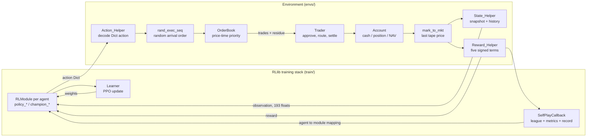
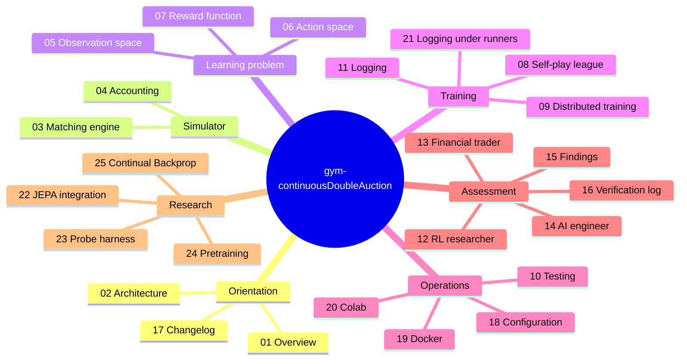

# ⚡ [QUANT-SOURCE-135] Consolidated Quant & Algo Trading Repositories
**Category**: `MACHINE_LEARNING_RL_ALPHA` | **Repositories in this Source**: 3
**Generated**: QUANT_BUNDLE_135_MACHINE_LEARNING_RL_ALPHA.md | **Target**: NotebookLM 290+ Quant Code Brain

---

## [1/3] Repository: gym-continuousDoubleAuction (`PHASE4-QUANT-123`)
- **Full Name**: `PHASE4-QUANT-123_ChuaCheowHuan__gym-continuousDoubleAuction`
- **Description**: A custom MARL (multi-agent reinforcement learning) environment where multiple agents trade against one another (self-play) in a zero-sum continuous double auction. Ray [RLlib] is used for training.
- **GitHub Stars**: 154
- **Source Pool**: `phase4_quant_wheels_100`

### Documentation & Overview (README.md)
# Changes from original_v1 to Current Version 2 (update 20251224)

This repository has undergone significant modernization since the `original_v1` branch (the original release from 2020, [README_v1.md](doc/README_v1.md)).

For a detailed breakdown of codebase modernizations, please refer to the [17_changelog.md](doc/17_changelog.md) document.

---

# Version 2 README:

## The system at a glance

One environment step, end to end. Every box is a real function; the labels on the
arrows are what actually crosses between them.



Full detail: [02_architecture.md](doc/02_architecture.md) §2.5 for the step lifecycle,
§2.9 for the same picture with the distributed boundaries drawn in.

## Documentation map



### Start here

| # | Document | What it answers |
|---|---|---|
| 1 | [01_overview.md](doc/01_overview.md) | What this project is, the market it models, the research question, what an episode looks like |
| 2 | [02_architecture.md](doc/02_architecture.md) | Layer map, package tree, the mixin/MRO chain, the step lifecycle, config keys, data flow, tech stack |

### Core mechanisms (reference)

| # | Document | What it answers |
|---|---|---|
| 3 | [03_matching_engine.md](doc/03_matching_engine.md) | Book data structures, limit/market processing, modify-order semantics and the six accounting scenarios, invariants |
| 4 | [04_accounting.md](doc/04_accounting.md) | Cash escrow, order approval, position transitions including atomic flips, mark-to-market, NAV conservation |
| 5 | [05_observation_space.md](doc/05_observation_space.md) | The 46-float snapshot: midpoint normalization, `√(V/limit_max_size)` sizing, the six market scalars, temporal stacking, the raw/normalized split, measured feature scales |
| 6 | [06_action_space.md](doc/06_action_space.md) | The `Dict` action space, ghost-level price anchoring, the two degenerate size dimensions, the legacy `Tuple` design it replaced |
| 7 | [07_reward_function.md](doc/07_reward_function.md) | The five-term formula, its account plumbing, the measured decomposition, a coefficient tuning guide |

### Training

| # | Document | What it answers |
|---|---|---|
| 8 | [08_self_play_league.md](doc/08_self_play_league.md) | League play: champion snapshotting and its four load-bearing ordering constraints, weighted matchmaking, configuration, monitoring, troubleshooting |
| 9 | [09_distributed_training.md](doc/09_distributed_training.md) | `num_env_runners` and `num_learners`: what each distributes, worked examples, and three now-fixed bugs that existed only at non-default values |
| 10 | [10_testing.md](doc/10_testing.md) | Every test file, what each case pins down, CI, and the gaps |
| 11 | [11_logging_and_observability.md](doc/11_logging_and_observability.md) | What training records, where it goes, and the gap between what is computed and what is surfaced |
| 21 | [21_logging_review.md](doc/21_logging_review.md) | The same audit re-run with `num_env_runners > 0`: what breaks when the hooks stop running on the driver |

### Analysis

| # | Document | Audience |
|---|---|---|
| 12 | [12_perspective_rl_researcher.md](doc/12_perspective_rl_researcher.md) | Algorithm, reward design, exploration, sample efficiency, training stability |
| 13 | [13_perspective_financial_trader.md](doc/13_perspective_financial_trader.md) | Microstructure realism, risk, execution, P&L, desk metrics |
| 14 | [14_perspective_ai_engineer.md](doc/14_perspective_ai_engineer.md) | Code quality, packaging, scalability, observability, production readiness |
| 15 | [15_findings_and_recommendations.md](doc/15_findings_and_recommendations.md) | Consolidated, severity-ranked findings with fixes and a suggested sequence |
| 16 | [16_verification_log.md](doc/16_verification_log.md) | Every executed probe and its raw output |
| 17 | [17_changelog.md](doc/17_changelog.md) | What changed since `original_v1` (2020) and why |
| 22 | [22_jepa_integration.md](doc/22_jepa_integration.md) | What JEPA is, why this observation suits it and this reward does not, and four ways it could be used |
| 23 | [23_probe_harness.md](doc/23_probe_harness.md) | Scoring an encoder on microstructure targets without the reward: how to run it, how to read it, why the probe is linear |
| 24 | [24_pretraining.md](doc/24_pretraining.md) | Training a JEPA encoder on observations alone before any PPO run, the fingerprint that guards its weights, and why to watch `latent_std` rather than the loss |
| 25 | [25_continual_backprop.md](doc/25_continual_backprop.md) | What Continual Backprop is, why league self-play is the non-stationary regime it targets, why it belongs on the Learner rather than the encoder registry, and why the papers' hyperparameters cannot be copied at this repo's update cadence |

### Configuration and deployment

| # | Document | What it answers |
|---|---|---|
| 18 | [18_configuration.md](doc/18_configuration.md) | The five `config/` files and what each owns, the loader's rules, precedence between file and flags, the runtime profiles that pick a hardware set, how to add a knob |
| 19 | [19_docker.md](doc/19_docker.md) | The GPU training image: build and run, what each flag is for, GPU prerequisites, where artefacts land in an ephemeral container, troubleshooting |
| 20 | [20_colab.md](doc/20_colab.md) | Running the notebook on a free Colab VM: setup, the forced restart, what the free tier gives you, where output goes, resuming after a disconnect |

---

## Reading paths

**New to the codebase**
[01](doc/01_overview.md) → [02](doc/02_architecture.md) → [03](doc/03_matching_engine.md) →
[04](doc/04_accounting.md) → [05](doc/05_observation_space.md) → [06](doc/06_action_space.md)

**Deciding whether to build on this**
[01](doc/01_overview.md) → [15](doc/15_findings_and_recommendations.md) → [16](doc/16_verification_log.md)

**Planning changes to the RL layer**
[15](doc/15_findings_and_recommendations.md) (severity order) → [12](doc/12_perspective_rl_researcher.md) →
[05](doc/05_observation_space.md) → [07](doc/07_reward_function.md)

**Weighing a representation-learning change (JEPA)**
[22](doc/22_jepa_integration.md) → [05](doc/05_observation_space.md) →
[18](doc/18_configuration.md) §5.4–5.5 → [12](doc/12_perspective_rl_researcher.md) §4, §7

**Comparing encoders**
[23](doc/23_probe_harness.md) (a metric that does not go through the reward) →
[18](doc/18_configuration.md) §5.5 (seeds, separate runs, parameter counts)

**Pretraining an encoder before training a policy**
[22](doc/22_jepa_integration.md) §4.2 (the objective) → [24](doc/24_pretraining.md) (running it) →
[23](doc/23_probe_harness.md) (measuring what it taught)

**Weighing a plasticity change for long runs (Continual Backprop)**
[25](doc/25_continual_backprop.md) → [18](doc/18_configuration.md) §5.6 (the two config groups, and
the cadence caveat that decides whether a result means anything) →
[11](doc/11_logging_and_observability.md) (the three correlates) →
[23](doc/23_probe_harness.md) (the reward-free metric it must be scored on) →
[15](doc/15_findings_and_recommendations.md) (S1-1, S1-3, which gate the returns comparison)

**Setting up training**
[18](doc/18_configuration.md) (where every value lives) → [08](doc/08_self_play_league.md) →
[09](doc/09_distributed_training.md) (if raising `num_env_runners` or `num_learners` above their
`0` defaults) → [11](doc/11_logging_and_observability.md)

**Running it on Colab**
[20](doc/20_colab.md) → [18](doc/18_configuration.md) §8 (the `gpu` / `cpu` parameter sets
`CDA_train.ipynb` selects between)

**Running it on a local GPU box**
[19](doc/19_docker.md) (the training image) → [18](doc/18_configuration.md) §8 →
[09](doc/09_distributed_training.md) §5

**Modifying the engine or accounts**
[03](doc/03_matching_engine.md) §4 (invariants) → [04](doc/04_accounting.md) → [10](doc/10_testing.md) §1–2

**Trading / microstructure review**
[13](doc/13_perspective_financial_trader.md) → [03](doc/03_matching_engine.md) → [04](doc/04_accounting.md)

---

## Summary

This repository implements a multi-agent continuous double auction system, structured as a price- and time-priority limit order book exchange. It is provided as a Gymnasium / RLlib `MultiAgentEnv` and includes a league-based self-play PPO training pipeline built on Ray RLlib 2.56.1’s new API stack. 

In this environment, agents act as traders who can submit market, limit, modify, and cancel orders to a shared order book. They are marked to market based on the trade tape, and receive rewards derived from a multi-term NAV-based function. The codebase also includes a matching engine, supports `Decimal`-based accounting, includes the necessary RLlib league wiring, and comes with CI unit tests.

**Main problems:** The weak points were concentrated in the learning problem formulation rather than in the simulator — agents observed no private state, the reward was strictly negative-sum with a dominant do-nothing strategy, and the reward scale silently disabled PPO's critic entirely. All three are now fixed ([17_changelog.md](doc/17_changelog.md) §29-30). The observation pipeline's own defects — the per-frame normalizer, the missing trade-flow features, and a size block two orders of magnitude off the price block — are fixed too (§37.4). What remains there: the agent's own resting orders are still invisible to it, and the price level index is still a non-stationary coordinate ([05](doc/05_observation_space.md) §7.2, §7.4, §7.7).

---

## Acknowledgements:
The orderbook matching engine is adapted from
https://github.com/dyn4mik3/OrderBook

---

## Disclaimer:
This repository is only meant for research purposes & is **never** meant to be used in any form of trading. Past performance is no guarantee of future results. If you suffer losses from using this repository, you are the sole person responsible for the losses. The author will **NOT** be held responsible in any way.

---

## 📌 How to Cite

If you use this software in your research, please cite the appropriate version:

> Chua Cheow Huan. (2025). *gym-continuousDoubleAuction* (Version 2.0.0) [Computer software].

You can also view and export citations in various formats using the **"Cite this repository"** button on the top-right of this page.

For version 1.0.0 (original version released in 2020), see: https://github.com/ChuaCheowHuan/gym-continuousDoubleAuction/tree/original_v1

### Core Implementation Code & Architecture
#### File: `gym_continuousDoubleAuction/train/__init__.py`
```python

```

#### File: `gym_continuousDoubleAuction/train/callbk/__init__.py`
```python

```

#### File: `gym_continuousDoubleAuction/train/model/__init__.py`
```python

```

#### File: `gym_continuousDoubleAuction/train/helper/__init__.py`
```python

```

#### File: `gym_continuousDoubleAuction/train/policy/__init__.py`
```python

```

#### File: `gym_continuousDoubleAuction/envs/agent/__init__.py`
```python

```


==================================================


## [2/3] Repository: polymarket-microstructure (`PHASE4-QUANT-126`)
- **Full Name**: `PHASE4-QUANT-126_philippdubach__polymarket-microstructure`
- **Description**: Replication package for 'The Anatomy of a Decentralized Prediction Market: Microstructure Evidence from the Polymarket Order Book.' Eight stylized facts on a pre-registered 600-market panel plus a methodological result: feed-inferred trade direction agrees with on-chain ground truth on ~59% of buckets vs ~80% Lee-Ready on equities.
- **GitHub Stars**: 19
- **Source Pool**: `phase4_quant_wheels_100`

### Documentation & Overview (README.md)
# polymarket-microstructure

[](https://arxiv.org/abs/2604.24366)
[](https://ssrn.com/abstract=6658364)
[](https://doi.org/10.5281/zenodo.19811426)

Replication package for *The Anatomy of a Decentralized Prediction Market: Microstructure Evidence from the Polymarket Order Book.*

The paper documents eight cross-sectional stylized facts on a pre-registered 600-market panel of Polymarket markets, plus a methodological contribution: trade-direction inference from Polymarket's public WebSocket order-book feed agrees with the on-chain ground truth on only ~59% of comparable buckets, with downstream sign-flip rates of 67% on the effective half-spread and 60% on Kyle's λ between feed-inferred and on-chain estimates.

The compiled paper is at `paper/build/anatomy.pdf`.

---

## What's in this repository

| Path | Contents |
|---|---|
| `paper/` | LaTeX manuscript, figures, tables, bibliography, compiled PDF |
| `polydata/` | Python package: order-book replay, on-chain trade joiner, microstructure measures, panel construction, stylized-fact computations |
| `scripts/` | End-to-end pipeline scripts (panel construction, measure compute, comparison panels, sensitivity tests) |
| `tests/` | pytest suite |
| `data/panel.parquet` | The 600-market pre-registered panel (top-100 by on-chain volume + random-500 from the long tail) |
| `data/panel_metadata.parquet` | CLOB REST metadata (`question`, `end_date_iso`, etc.) for the panel |
| `data/panel_trade_measures.parquet` | Six trade-based measures × 600 markets |
| `data/panel_quote/*.parquet` | Quote-based measures (spread, depth, intensity, latency, clock) × 600 markets |
| `data/clob_token_map.parquet` | 934k-row `(condition_id, yes_token_id, no_token_id)` mapping (regenerate via `scripts/pull_token_ids_clob.py`; not redistributed because the file exceeds GitHub's 100 MB limit) |
| `artifacts/sf*.{parquet,png}` | Per-stylized-fact tables and figures (SF1–SF8) |
| `artifacts/measures_compare*.parquet` | STRICT-vs-on-chain measure comparison panels |
| `artifacts/spread_decomposition*.{parquet,png}` | Glosten-Harris decomposition |
| `artifacts/sign_agreement_robustness.parquet` | Per-(window, market) sign-agreement panel for §7 |
| `artifacts/sample_step_sensitivity.parquet` | Sample-step sensitivity grid |
| `docs/preregistration_plan3c.md` | Pre-registration document (locked rules + panel SHA-256) |

What is **not** in this repository:

- The 30-billion-event raw WebSocket archive (623.8 GB across 1,262 hourly Parquet files). Acquisition is described in §3.1 of the paper; the collector configuration is sufficient to reproduce.
- The 14 GB on-chain `OrderFilled` scrape (242 slice Parquets). Acquisition is described in §3.2 and `scripts/scrape_onchain_fills.py`.

Both can be regenerated by anyone with WebSocket subscription access to Polymarket and a Polygon archive RPC provider.

### Regeneration cost notes

- **CLOB token map (`data/clob_token_map.parquet`, ~99 MB):** ~6 minutes against the public CLOB REST endpoint. Free.
- **On-chain scrape (~14 GB across 242 slice parquets, 28-day window):** the public `polygon-rpc.com` endpoint is rate-limited to the point of being impractical for this scrape. On Alchemy's free tier the author measured ~15 minutes per 5{,}000-block slice (chunk size 10) due to per-second-limit throttling, which extrapolates to ~50 hours of wall time for the full 28-day window — workable but slow. A paid Alchemy or QuickNode tier with archive access typically runs $50–$200/month and finishes the same scrape in a small number of hours; the exact figure depends on the provider's per-request and per-second pricing. Re-running with `scripts/scrape_onchain_fills.py` writes one parquet per slice and is fully resumable.
- **WebSocket archive (~624 GB):** acquisition is described in §3.1 of the paper. The author's collector ran continuously for 52 days against a single VPS and a Polymarket WebSocket subscription; the marginal cost is the VPS plus the subscription, not a per-event RPC fee.

---

## Reproducing the paper

### Build the PDF

```bash
make pdf
```

Requires TeX Live with `pdflatex`, `bibtex`, `natbib`, `booktabs`, `graphicx`. The Makefile runs `pdflatex → bibtex → pdflatex → pdflatex` from the `paper/` directory and writes `paper/build/anatomy.pdf`.

### Re-run the analyses

The full pipeline assumes Python 3.11 with [`uv`](https://docs.astral.sh/uv/) for environment management.

```bash
uv sync                                # installs dependencies from uv.lock
uv run pytest                          # runs the test suite
uv run python scripts/run_sf.py        # regenerates SF1–SF8 + Glosten-Harris artifacts
                                       # using the panel parquets shipped here
```

The end-to-end pipeline that builds `data/panel.parquet` and `data/panel_*.parquet` from raw inputs is documented in the paper (Section 3) and the corresponding scripts:

- `scripts/scrape_onchain_fills.py` — Polygon `OrderFilled` scraper
- `scripts/pull_token_ids_clob.py` — CLOB REST market token-pair pull
- `scripts/build_panel.py` — pre-registered panel construction
- `scripts/compute_panel_trade_measures.py` — trade-based measures
- `scripts/compute_panel_quote_measures.py` — quote-based measures
- `scripts/compare_strict_vs_onchain_top100.py` — §7 STRICT-vs-on-chain panel
- `scripts/diagnose_inference_recall_panel.py` — §7 sign-agreement robustness

Re-running the full pipeline from raw data takes several hours of compute and assumes both the WebSocket archive and the on-chain scrape are present locally. With the panel parquets already in `data/`, the SF runners and the §7 / Glosten-Harris computations finish in minutes.

---

## Citation

```
Dubach, Philipp D. (2026). The Anatomy of a Decentralized Prediction Market:
Microstructure Evidence from the Polymarket Order Book. arXiv preprint
arXiv:2604.24366. https://arxiv.org/abs/2604.24366
SSRN: https://ssrn.com/abstract=6658364
Replication package: https://github.com/philippdubach/polymarket-microstructure
Replication DOI: 10.5281/zenodo.19811426
```

```bibtex
@misc{dubach-2026-anatomy,
  author        = {Dubach, Philipp D.},
  title         = {The Anatomy of a Decentralized Prediction Market:
                   Microstructure Evidence from the Polymarket Order Book},
  year          = {2026},
  eprint        = {2604.24366},
  archivePrefix = {arXiv},
  primaryClass  = {q-fin.TR},
  url           = {https://arxiv.org/abs/2604.24366},
  note          = {SSRN: \url{https://ssrn.com/abstract=6658364}},
}

@misc{dubach-2026-replication,
  author    = {Dubach, Philipp D.},
  title     = {Replication package: The Anatomy of a Decentralized
               Prediction Market},
  year      = {2026},
  publisher = {Zenodo},
  version   = {v1.0},
  doi       = {10.5281/zenodo.19811426},
  url       = {https://doi.org/10.5281/zenodo.19811426},
}
```

---

## License

MIT (see `LICENSE`). The data artifacts are derived from public Polymarket order-book broadcasts and on-chain Polygon transaction logs and are released under the same terms.

### Core Implementation Code & Architecture
#### File: `tests/onchain/__init__.py`
```python

```

#### File: `tests/integration/__init__.py`
```python
"""Integration tests for the poly-data pipeline."""
```

#### File: `polydata/__init__.py`
```python
"""Polymarket CLOB data infrastructure."""
__version__ = "0.1.0"
```

#### File: `polydata/panel/__init__.py`
```python
"""Panel construction for Plan 3c stratified 600-market sample."""
```

#### File: `polydata/sf/__init__.py`
```python
"""Plan 3c stylized-fact computations (SF1-SF8 + spread decomposition)."""
```

#### File: `pyrightconfig.json`
```python
{
  "venvPath": ".",
  "venv": ".venv",
  "pythonVersion": "3.11",
  "include": ["polydata", "tests", "scripts"],
  "exclude": ["**/__pycache__", ".venv"]
}
```


==================================================


## [3/3] Repository: botvana (`PHASE4-QUANT-136`)
- **Full Name**: `PHASE4-QUANT-136_featherenvy__botvana`
- **Description**: Botvana is high-performance and event-driven trading system built using Rust (in early development).
- **GitHub Stars**: 252
- **Source Pool**: `phase4_quant_wheels_100`

### Documentation & Overview (README.md)
# Botvana: high-performance trading platform

Botvana is an open-source, event-driven, and distributed trading platform targeting
crypto markets. It aims to be high-performance, low-latency, reliable, and
fault-tolerant. Built in Rust, it allows you to develop and operate market-making
and arbitrage strategies.


⚠️ The project is still in very early development ⚠️

## Principles:

-   **High-performance:** Designed and architected to be high-performance from the
    ground up. It utilizes staged event-driven architecture combined with
    thread-per-core architecture.
-   **Low-latency**: Currently utilizing `io_uring` for network connectivity, with
    goals to use `AF_XDP` or kernel by-pass in the future.
-   **Reliable**: Being built in Rust provides Botvana with memory safety guarantees
    compared to other systems programming languages.
-   **Fault-tolerant:** Crypto exchanges are known for unreliability, so Botvana
    provides explicit fault-tolerant features.

## Overview

Botvana is split into these components:

-   `botnode`: high-performance trading bot
-   `botvana-server`: coordination server
-   `botvana`: shared platform definitions
-   `station-egui`: control application

### Supported Exchanges

Currently, in the early phase of the project, the supported exchanges are FTX and
Binance.

### Deployment architecture


### botnode architecture


Botnode uses thread-per-core architecture where each thread is pinned to exactly
one logical CPU core. Each CPU core runs a different engine with a custom event loop.
Data is sent between engines using SPSC channels, and no global state is shared
between the threads.

Botnode has these engines:

- **Control engine:** Connects to `botvana-server` and spawns all other engines
  based on configuration.
- **Market data engine:** Connects to the exchange and transforms market data to
  Botvana's internal types.
- **Indicator engine:** Provides indicators built from market data.
- **Trading engine:** Makes trading decisions.
- **Exchange engine:** Acts as order router and gateway to the exchange.
- **Audit engine:** Audits trading activity.

### botvana-server

Each `botnode` needs to connect to a central `botvana-server` which provides
configuration and acts as the central coordinator.

Botvana server expects configuration in `cfg/default.toml`.

### station-egui

Control station application written using egui framework.

## Development Prerequisites

In order to work with Botvana you need to have:

-   Linux kernel version >5.13
-   Rust 1.58 or higher
-   Terraform

## Getting started

1.  Clone the repo
    ```sh
    git clone https://github.com/featherenvy/botvana.git
    ```
2.  Install dependencies required to compile `egui`
    ```sh
    sudo apt-get install libxcb-render0-dev libxcb-shape0-dev libxcb-xfixes0-dev libspeechd-dev libxkbcommon-dev libssl-dev
    ```
3.  Build all components
    ```sh
    cargo build
    ```
4.  Run dependencies using `docker-compose`:
    ```sh
    docker-compose up -d
    ```
5.  Run `botvana-server`
    ```sh
    cargo r --bin botvana-server
    ```
6.  Run `botnode`
    ```sh
    SERVER_ADDR=127.0.0.1:7978 BOT_ID=0 cargo r --bin botnode
    ```
7.  Run `station-egui`
    ```sh
    cargo r --bin station-egui
    ```

### Core Implementation Code & Architecture
#### File: `botvana/src/metrics.rs`
```python

```

#### File: `botnode/src/util.rs`
```python

```

#### File: `botnode/src/audit.rs`
```python
//! Audit engine

pub mod engine;
```

#### File: `botnode/src/exchange/ftx.rs`
```python
#[derive(Debug, Clone)]
struct Ftx;
```

#### File: `research/async-runtime-bench/src/main.rs`
```python
fn main() {
    println!("Hello, world!");
}
```

#### File: `botvana-server/src/lib.rs`
```python
pub mod bot_server;
pub mod config;
pub mod ws;
```


==================================================
