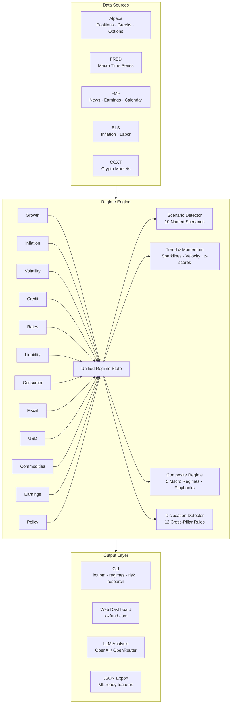

# ⚡ [QUANT-SOURCE-158] Consolidated Quant & Algo Trading Repositories
**Category**: `OPTIONS_GREEKS_VOLATILITY` | **Repositories in this Source**: 3
**Generated**: QUANT_BUNDLE_158_OPTIONS_GREEKS_VOLATILITY.md | **Target**: NotebookLM 290+ Quant Code Brain

---

## [1/3] Repository: deribit-options-collector (`PHASE4-QUANT-182`)
- **Full Name**: `PHASE4-QUANT-182_Kirill-Miroshnichenko__deribit-options-collector`
- **Description**: Real-time cryptocurrency options data collector with Greeks, IV tracking, and market data analysis
- **GitHub Stars**: 4
- **Source Pool**: `phase4_quant_wheels_100`

### Documentation & Overview (README.md)
# 📊 Deribit Options Data Collector

Real-time cryptocurrency options data collector for Deribit exchange for quantitative analysis and algorithmic trading.

[](https://www.python.org/downloads/)
[](https://opensource.org/licenses/MIT)

## 🎯 Features

- **Real-time Data Collection**: Capture live options data at configurable intervals
- **Complete Market Data**: 
  - Option prices (mark, bid, ask, last, mid)
  - Greeks (delta, gamma, vega, theta, rho)
  - Implied Volatility (mark IV, bid IV, ask IV)
  - Open Interest & 24h Volume
  - Underlying price tracking
- **Efficient Storage**: Compressed Parquet format for optimal performance
- **Multiple Currencies**: Support for BTC, ETH and other cryptocurrencies
- **Data Accumulation**: Automatic appending to current day files

## 📈 Use Cases

- **Algorithmic Trading**: Build and backtest options strategies (wheel, iron condor, straddles)
- **Volatility Analysis**: Track IV/HV relationships and build volatility surfaces
- **Market Research**: Analyze option flow, Greeks evolution and market microstructure
- **Risk Management**: Monitor portfolio Greeks and volatility exposure

## 🚀 Quick Start

### Installation

```bash
# Clone the repository
git clone https://github.com/yourusername/deribit-options-collector.git
cd deribit-options-collector

# Install dependencies
pip install -r requirements.txt
```

### Single Data Collection

```python
from collector import DeribitDataCollector

# Initialize collector
collector = DeribitDataCollector(currency='ETH', data_dir='deribit_data')

# Collect data
df = collector.collect_options_data()

# Save to Parquet
collector.save_to_parquet(df)
```

### Periodic Collection

```python
from collector import periodic_collection

# Collect every 2 minutes, 30 iterations (1 hour)
periodic_collection(
    currency='ETH',
    interval_minutes=2,
    iterations=30
)
```

### Load Saved Data

```python
# Load all data
all_data = collector.load_data()

# Load data for specific period
from datetime import datetime, timedelta

start = datetime.now() - timedelta(days=7)
end = datetime.now()
weekly_data = collector.load_data(start_date=start, end_date=end)
```

## 📊 Data Structure

| Column | Type | Description |
|---------|-----|----------|
| `timestamp` | datetime | UTC timestamp of collection |
| `instrument_name` | string | Option identifier (e.g., ETH-28JAN26-3000-P) |
| `strike` | float | Strike price |
| `option_type` | string | 'call' or 'put' |
| `mark_price` | float | Mark price in underlying currency |
| `bid_price` | float | Best bid price |
| `ask_price` | float | Best ask price |
| `mid_price` | float | Mid price (bid + ask) / 2 |
| `delta` | float | Delta (∂V/∂S) |
| `gamma` | float | Gamma (∂²V/∂S²) |
| `vega` | float | Vega (∂V/∂σ) |
| `theta` | float | Theta (∂V/∂t) |
| `rho` | float | Rho (∂V/∂r) |
| `mark_iv` | float | Mark implied volatility |
| `bid_iv` | float | Bid implied volatility |
| `ask_iv` | float | Ask implied volatility |
| `open_interest` | float | Open interest |
| `volume_24h` | float | 24-hour trading volume |
| `underlying_price` | float | Spot price of underlying asset |

## 📁 Project Structure

```
deribit-options-collector/
├── README.md                 # Documentation
├── collector.py              # Main data collector
├── requirements.txt          # Python dependencies
├── LICENSE                   # MIT License
├── .gitignore               # Git ignore rules
├── examples/                # Usage examples
│   ├── basic_usage.py       # Basic example
│   └── analysis.py          # Data analysis
└── deribit_data/            # Data directory (gitignored)
```

## 📊 Analysis Examples

### Filter Liquid Options

```python
# Only options with non-zero OI and spread
df_liquid = df[
    (df['bid_price'].notna()) & 
    (df['ask_price'].notna()) &
    (df['open_interest'] > 0)
]

print(f"Liquid options: {len(df_liquid)}")
```

### Analysis by Option Type

```python
print(f"Calls: {len(df[df['option_type'] == 'call'])}")
print(f"Puts: {len(df[df['option_type'] == 'put'])}")
print(f"Unique expirations: {df['expiration_timestamp'].nunique()}")
print(f"Unique strikes: {df['strike'].nunique()}")
```

### Build Volatility Smile

```python
import matplotlib.pyplot as plt

# Filter data for specific expiration
expiration = df['expiration_timestamp'].min()
exp_data = df[df['expiration_timestamp'] == expiration]

# Separate calls and puts
calls = exp_data[exp_data['option_type'] == 'call']
puts = exp_data[exp_data['option_type'] == 'put']

# Plot
plt.scatter(calls['strike'], calls['mark_iv']*100, label='Calls', alpha=0.6)
plt.scatter(puts['strike'], puts['mark_iv']*100, label='Puts', alpha=0.6)
plt.xlabel('Strike')
plt.ylabel('Implied Volatility (%)')
plt.title('Volatility Smile')
plt.legend()
plt.show()
```

## 🎓 Technical Details

### Data Collection Architecture

```
Deribit API → Collector → Processing → Parquet Storage
     ↓            ↓            ↓            ↓
  REST API    Python       pandas      Compressed
  Public      Class                     Files
  Endpoint
```

### Performance

- **Collection speed**: ~0.5 second delay per 10 instruments
- **Storage efficiency**: ~50MB per day (compressed format)
- **Memory usage**: <200MB during collection
- **API calls**: Configurable frequency with rate limiting

## 📚 Requirements

```
pandas>=2.0.0
pyarrow>=12.0.0
requests>=2.31.0
```

## 🔄 Data Quality

- **Completeness**: All available fields captured
- **Accuracy**: Data directly from exchange API
- **Validation**: Automatic checking for missing fields
- **Deduplication**: Correct appending to existing files

## 📈 Dataset Statistics

**Real dataset** (example usage):
- **5.3M+ records** collected over 20 days
- **1,866 unique options** tracked
- **Zero gaps** - complete tick-by-tick coverage
- **22 data fields** per record including full Greeks

## 🤝 Contributing

Pull requests are welcome! Please feel free to submit a PR.

### Development Setup

```bash
# Install dev dependencies
pip install -r requirements-dev.txt

# Run tests
pytest tests/

# Check code
flake8 collector.py
```

## 📝 License

This project is licensed under the MIT License - see the [LICENSE](LICENSE) file for details.

## ⚠️ Disclaimer

This software is for educational and research purposes only. Options trading carries significant risk. Always do your own research and consult with financial professionals before trading.

## 📧 Contact

- GitHub: [@Kirill-Miroshnichenko](https://github.com/Kirill-Miroshnichenko)
- Email: mkv1986@gmail.com

## 🌟 Acknowledgments

- Deribit API for providing comprehensive market data
- Quantitative finance community for inspiration and feedback

---

**Star ⭐ this repository if you find it useful!**

## 🔧 Collection Setup

### Basic Configuration

```python
# Change currency
collector = DeribitDataCollector(currency='BTC')  # or 'ETH'

# Change data directory
collector = DeribitDataCollector(data_dir='my_data')
```

### Periodic Collection 24/7

```python
# Collect every 2 minutes indefinitely
periodic_collection(
    currency='ETH',
    interval_minutes=2,
    iterations=999999  # Essentially infinite
)
```

### Run in Background (Linux/Mac)

```bash
# Run in background
nohup python -c "from collector import periodic_collection; periodic_collection('ETH', 2, 999999)" &

# Check process
ps aux | grep python

# Stop
kill <PID>
```

## 📊 Data Size

Approximate estimates:
- **1 snapshot**: ~50KB (100 options)
- **1 hour** (30 collections): ~1.5MB
- **1 day**: ~36MB
- **1 month**: ~1GB (compressed)

Parquet format provides:
- ~80% compression vs CSV
- Fast loading
- Pandas support

### Core Implementation Code & Architecture
#### File: `examples/basic_usage.py`
```python
"""
Basic Usage Example

Demonstrates simple usage of the Deribit options data collector
"""

import sys
sys.path.append('..')

from collector import DeribitDataCollector
import pandas as pd

def main():
    print("="*60)
    print("Deribit Options Collector - Basic Example")
    print("="*60)
    
    # Initialize collector
    collector = DeribitDataCollector(
        currency='ETH',
        data_dir='../deribit_data'
    )
    
    # Collect data
    print("\nCollecting current market data...")
    df = collector.collect_options_data()
    
    if not df.empty:
        # Save
        filepath = collector.save_to_parquet(df)
        
        # Display statistics
        print(f"\n{'='*60}")
        print("COLLECTION STATISTICS")
        print(f"{'='*60}")
        print(f"Total records:         {len(df)}")
        print(f"Unique instruments:    {df['instrument_name'].nunique()}")
        print(f"Data completeness:     {(1 - df.isnull().sum().sum() / df.size) * 100:.1f}%")
        
        # Top 10 by volume
        print(f"\nTop 10 options by 24h volume:")
        top_volume = df.nlargest(10, 'volume_24h')[
            ['instrument_name', 'mark_price', 'delta', 'mark_iv', 'volume_24h']
        ]
        print(top_volume.to_string(index=False))
        
        # ATM options
        print(f"\nATM (At-The-Money) options:")
        underlying = df['underlying_price'].iloc[0]
        atm_options = df[
            (df['strike'] >= underlying * 0.95) & 
            (df['strike'] <= underlying * 1.05)
        ].sort_values('strike')[
            ['instrument_name', 'strike', 'mark_price', 'delta', 'mark_iv']
        ]
        print(atm_options.head(10).to_string(index=False))
        
        # Liquidity analysis
        df_liquid = df[
            (df['bid_price'].notna()) & 
            (df['ask_price'].notna()) &
            (df['open_interest'] > 0)
        ]
        print(f"\nLiquid options: {len(df_liquid)} ({len(df_liquid)/len(df)*100:.1f}%)")
        
        print(f"\n✓ Data saved: {filepath}")
        
    else:
        print("✗ Data collection failed")


if __name__ == "__main__":
    main()
```

#### File: `examples/analysis.py`
```python
"""
Data Analysis Example

Shows how to analyze and visualize collected options data
"""

import sys
sys.path.append('..')

from collector import DeribitDataCollector
import pandas as pd
import matplotlib.pyplot as plt

def analyze_volatility_smile(df):
    """Build volatility smile"""
    
    # Convert expiration timestamp
    df['expiration_date'] = pd.to_datetime(df['expiration_timestamp'], unit='ms')
    
    # Take nearest expiration
    nearest_exp = df['expiration_date'].min()
    exp_data = df[df['expiration_date'] == nearest_exp].copy()
    
    if len(exp_data) == 0:
        print("No data for analysis")
        return
    
    # Get underlying price
    underlying = exp_data['underlying_price'].iloc[0]
    
    # Calculate moneyness
    exp_data['moneyness'] = exp_data['strike'] / underlying
    
    # Separate calls and puts
    calls = exp_data[exp_data['option_type'] == 'call']
    puts = exp_data[exp_data['option_type'] == 'put']
    
    # Plot
    plt.figure(figsize=(12, 6))
    
    plt.scatter(calls['moneyness'], calls['mark_iv'] * 100, 
               alpha=0.6, label='Calls', color='green', s=50)
    plt.scatter(puts['moneyness'], puts['mark_iv'] * 100, 
               alpha=0.6, label='Puts', color='red', s=50)
    
    plt.axvline(x=1.0, color='gray', linestyle='--', alpha=0.5, label='ATM')
    
    plt.xlabel('Moneyness (Strike / Spot)', fontsize=12)
    plt.ylabel('Implied Volatility (%)', fontsize=12)
    plt.title(f'Volatility Smile - {nearest_exp.date()}', fontsize=14, fontweight='bold')
    plt.legend()
    plt.grid(True, alpha=0.3)
    
    plt.tight_layout()
    plt.savefig('volatility_smile.png', dpi=300)
    print(f"✓ Plot saved: volatility_smile.png")
    plt.show()


def analyze_greeks_distribution(df):
    """Analyze Greeks distribution"""
    
    fig, axes = plt.subplots(2, 2, figsize=(14, 10))
    
    # Delta
    axes[0, 0].hist(df['delta'].dropna(), bins=50, alpha=0.7, color='blue', edgecolor='black')
    axes[0, 0].set_xlabel('Delta')
    axes[0, 0].set_ylabel('Frequency')
    axes[0, 0].set_title('Delta Distribution')
    axes[0, 0].grid(True, alpha=0.3)
    
    # Gamma
    axes[0, 1].hist(df['gamma'].dropna(), bins=50, alpha=0.7, color='green', edgecolor='black')
    axes[0, 1].set_xlabel('Gamma')
    axes[0, 1].set_ylabel('Frequency')
    axes[0, 1].set_title('Gamma Distribution')
    axes[0, 1].grid(True, alpha=0.3)
    
    # Vega
    axes[1, 0].hist(df['vega'].dropna(), bins=50, alpha=0.7, color='orange', edgecolor='black')
    axes[1, 0].set_xlabel('Vega')
    axes[1, 0].set_ylabel('Frequency')
    axes[1, 0].set_title('Vega Distribution')
    axes[1, 0].grid(True, alpha=0.3)
    
    # Theta
    axes[1, 1].hist(df['theta'].dropna(), bins=50, alpha=0.7, color='red', edgecolor='black')
    axes[1, 1].set_xlabel('Theta')
    axes[1, 1].set_ylabel('Frequency')
    axes[1, 1].set_title('Theta Distribution')
    axes[1, 1].grid(True, alpha=0.3)
    
    plt.tight_layout()
    plt.savefig('greeks_distribution.png', dpi=300)
    print(f"✓ Plot saved: greeks_distribution.png")
    plt.show()


def print_summary_stats(df):
    """Print summary statistics"""
    
    print(f"\n{'='*60}")
    print("SUMMARY STATISTICS")
    print(f"{'='*60}")
    
    print(f"\nGeneral data:")
    print(f"  Total options:      {len(df)}")
    print(f"  Calls:              {len(df[df['option_type'] == 'call'])}")
    print(f"  Puts:               {len(df[df['option_type'] == 'put'])}")
    
    print(f"\nImplied Volatility:")
    print(f"  Mean:      {df['mark_iv'].mean()*100:.2f}%")
    print(f"  Median:    {df['mark_iv'].median()*100:.2f}%")
    print(f"  Min:       {df['mark_iv'].min()*100:.2f}%")
    print(f"  Max:       {df['mark_iv'].max()*100:.2f}%")
    
    print(f"\nOpen Interest:")
    print(f"  Total:     {df['open_interest'].sum():,.0f}")
    print(f"  Mean:      {df['open_interest'].mean():.2f}")
    
    print(f"\n24h Volume:")
    print(f"  Total:     {df['volume_24h'].sum():,.0f}")
    print(f"  Mean:      {df['volume_24h'].mean():.2f}")
    
    # Top strikes by OI
    print(f"\nTop 5 strikes by Open Interest:")
    top_oi = df.groupby('strike')['open_interest'].sum().nlargest(5)
    for strike, oi in top_oi.items():
        print(f"  ${strike:.0f}: {oi:,.0f}")


def main():
    print("="*60)
    print("Deribit Options Data Analysis")
    print("="*60)
    
    # Load data
    import glob
    files = glob.glob('../deribit_data/*.parquet')
    
    if not files:
        print("\nNo data to analyze!")
        print("Run basic_usage.py to collect data first")
        return
    
    # Take latest file
    latest_file = max(files, key=lambda x: x)
    print(f"\nLoading: {latest_file}")
    
    df = pd.read_parquet(latest_file)
    
    print(f"Records: {len(df):,}")
    print(f"Instruments: {df['instrument_name'].nunique()}")
    print(f"Timestamp: {df['timestamp'].iloc[0]}")
    
    # Analyses
    print(f"\n{'='*60}")
    print("1. Summary Statistics")
    print(f"{'='*60}")
    print_summary_stats(df)
    
    print(f"\n{'='*60}")
    print("2. Volatility Smile")
    print(f"{'='*60}")
    analyze_volatility_smile(df)
    
    print(f"\n{'='*60}")
    print("3. Greeks Distribution")
    print(f"{'='*60}")
    analyze_greeks_distribution(df)


if __name__ == "__main__":
    main()
```

#### File: `collector.py`
```python
"""
Deribit Options Data Collector

Real-time cryptocurrency options data collector for Deribit exchange.
Collects prices, Greeks, implied volatility, and market data.

Author: Kirill-Miroshnichenko
License: MIT
"""

import requests
import pandas as pd
import time
from datetime import datetime
from pathlib import Path
import pyarrow.parquet as pq
import pyarrow as pa


class DeribitDataCollector:
    """Class for collecting options data from Deribit"""
    
    def __init__(self, currency='BTC', data_dir='deribit_data'):
        """
        Initialize the collector
        
        Args:
            currency (str): 'BTC' or 'ETH'
            data_dir (str): directory for storing data
        """
        self.base_url = 'https://www.deribit.com/api/v2/public'
        self.currency = currency
        self.data_dir = Path(data_dir)
        self.data_dir.mkdir(exist_ok=True)
        
        print(f"Initialized collector for {currency}")
        print(f"Data directory: {self.data_dir.absolute()}")
    
    def get_instruments(self, kind='option', expired=False):
        """
        Get list of all instruments
        
        Args:
            kind (str): instrument type ('option', 'future')
            expired (bool): include expired instruments
            
        Returns:
            list: list of instruments
        """
        url = f'{self.base_url}/get_instruments'
        params = {
            'currency': self.currency,
            'kind': kind,
            'expired': 'false' if not expired else 'true'
        }
        
        try:
            response = requests.get(url, params=params)
            response.raise_for_status()
            return response.json()['result']
        except Exception as e:
            print(f"Error fetching instruments: {e}")
            return []
    
    def get_orderbook(self, instrument_name):
        """
        Get orderbook for instrument
        
        Args:
            instrument_name (str): instrument name
            
        Returns:
            dict: orderbook data or None
        """
        url = f'{self.base_url}/get_order_book'
        params = {'instrument_name': instrument_name}
        
        try:
            response = requests.get(url, params=params)
            response.raise_for_status()
            return response.json()['result']
        except Exception as e:
            print(f"Error for {instrument_name}: {e}")
            return None
    
    def collect_options_data(self):
        """
        Collect data for all options
        
        Returns:
            pd.DataFrame: DataFrame with collected data
        """
        print(f"Starting data collection for {self.currency}...")
        
        # Get list of all options
        instruments = self.get_instruments()
        print(f"Found instruments: {len(instruments)}")
        
        data = []
        
        for idx, instrument in enumerate(instruments):
            instrument_name = instrument['instrument_name']
            
            # Get orderbook data (contains greeks and prices)
            orderbook = self.get_orderbook(instrument_name)
            
            if orderbook:
                record = {
                    'timestamp': datetime.now(),
                    'instrument_name': instrument_name,
                    'expiration_timestamp': instrument['expiration_timestamp'],
                    'strike': instrument['strike'],
                    'option_type': instrument['option_type'],
                    
                    # Prices
                    'mark_price': orderbook.get('mark_price'),
                    'last_price': orderbook.get('last_price'),
                    'bid_price': orderbook['best_bid_price'] if orderbook.get('best_bid_price') else None,
                    'ask_price': orderbook['best_ask_price'] if orderbook.get('best_ask_price') else None,
                    'mid_price': (orderbook.get('best_bid_price', 0) + orderbook.get('best_ask_price', 0)) / 2 if orderbook.get('best_bid_price') and orderbook.get('best_ask_price') else None,
                    
                    # Greeks
                    'delta': orderbook.get('greeks', {}).get('delta'),
                    'gamma': orderbook.get('greeks', {}).get('gamma'),
                    'vega': orderbook.get('greeks', {}).get('vega'),
                    'theta': orderbook.get('greeks', {}).get('theta'),
                    'rho': orderbook.get('greeks', {}).get('rho'),
                    
                    # Volatility
                    'mark_iv': orderbook.get('mark_iv'),
                    'bid_iv': orderbook.get('bid_iv'),
                    'ask_iv': orderbook.get('ask_iv'),
                    
                    # Volume
                    'open_interest': orderbook.get('open_interest'),
                    'volume_24h': orderbook.get('stats', {}).get('volume'),
                    
                    # Underlying
                    'underlying_price': orderbook.get('underlying_price'),
                    'underlying_index': orderbook.get('underlying_index')
                }
                
                data.append(record)
            
            # Small delay to avoid rate limit
            if (idx + 1) % 10 == 0:
                print(f"Processed: {idx + 1}/{len(instruments)}")
                time.sleep(0.5)
        
        df = pd.DataFrame(data)
        print(f"\nDone! Collected records: {len(df)}")
        
        return df
    
    def get_daily_filename(self, date=None):
        """
        Get filename for specific date
        
        Args:
            date (datetime): date (default today)
            
        Returns:
            Path: file path
        """
        if date is None:
            date = datetime.now()
        
        date_str = date.strftime('%Y%m%d')
        return self.data_dir / f'{self.currency}_options_{date_str}.parquet'
    
    def save_to_parquet(self, df):
        """
        Save data to Parquet (append to current day file)
        
        Args:
            df (pd.DataFrame): data to save
            
        Returns:
            Path: path to saved file
        """
        if df.empty:
            print("No data to save")
            return None
        
        filename = self.get_daily_filename()
        
        # If file for today exists - append
        if filename.exists():
            existing_df = pd.read_parquet(filename)
            df = pd.concat([existing_df, df], ignore_index=True)
            print(f"Appended to existing file: {filename}")
        else:
            print(f"Created new file: {filename}")
        
        # Save with compression
        df.to_parquet(filename, compression='snappy', index=False)
        print(f"Total records in file: {len(df)}")
        
        return filename
    
    def load_data(self, start_date=None, end_date=None):
        """
        Load data for period
        
        Args:
            start_date (datetime): start of period (None = all files)
            end_date (datetime): end of period (None = all files)
            
        Returns:
            pd.DataFrame: combined data
        """
        files = sorted(self.data_dir.glob(f'{self.currency}_options_*.parquet'))
        
        if not files:
            print("No saved data found")
            return pd.DataFrame()
        
        dfs = []
        
        for file in files:
            # Filter by dates if needed
            if start_date or end_date:
                file_date = datetime.strptime(file.stem.split('_')[-1], '%Y%m%d')
                
                if start_date and file_date < start_date:
                    continue
                if end_date and file_date > end_date:
                    continue
            
            df = pd.read_parquet(file)
            dfs.append(df)
            print(f"Loaded: {file.name} ({len(df)} records)")
        
        if dfs:
            result = pd.concat(dfs, ignore_index=True)
            print(f"\nTotal loaded records: {len(result)}")
            return result
        else:
            return pd.DataFrame()


def periodic_collection(currency='BTC', interval_minutes=5, iterations=12):
    """
    Collect data every N minutes and save to Parquet
    
    Args:
        currency (str): currency ('BTC', 'ETH')
        interval_minutes (int): collection interval in minutes
        iterations (int): number of iterations
    """
    collector = DeribitDataCollector(currency=currency)
    
    for i in range(iterations):
        print(f"\n{'='*50}")
        print(f"Iteration {i+1}/{iterations} - {datetime.now().strftime('%Y-%m-%d %H:%M:%S')}")
        print(f"{'='*50}")
        
        df = collector.collect_options_data()
        collector.save_to_parquet(df)
        
        if i < iterations - 1:
            print(f"\nWaiting {interval_minutes} minutes...")
            time.sleep(interval_minutes * 60)


# =============================================================================
# USAGE EXAMPLE
# =============================================================================

if __name__ == "__main__":
    # 1. Simple data collection for ETH options
    collector = DeribitDataCollector(currency='ETH', data_dir='deribit_data')
    df = collector.collect_options_data()
    
    # Save to Parquet
    collector.save_to_parquet(df)
    
    # 2. View data
    print("\nFirst rows:")
    print(df.head())
    
    print("\nData info:")
    print(df.info())
    
    # 3. Analyze collected data
    if not df.empty:
        print("\n=== Quick Statistics ===")
        print(f"Total options: {len(df)}")
        print(f"Calls: {len(df[df['option_type'] == 'call'])}")
        print(f"Puts: {len(df[df['option_type'] == 'put'])}")
        print(f"\nUnique expirations: {df['expiration_timestamp'].nunique()}")
        print(f"Unique strikes: {df['strike'].nunique()}")
        
        # Filter data - for example, only liquid options
        df_liquid = df[
            (df['bid_price'].notna()) & 
            (df['ask_price'].notna()) &
            (df['open_interest'] > 0)
        ]
        print(f"\nLiquid options (with non-zero OI and spread): {len(df_liquid)}")
    
    # 4. To run periodic collection uncomment:
    # periodic_collection(currency='ETH', interval_minutes=2, iterations=10)
```


==================================================


## [2/3] Repository: adaptive-volatility-arbitrage (`PHASE4-QUANT-144`)
- **Full Name**: `PHASE4-QUANT-144_willhammondhimself__adaptive-volatility-arbitrage`
- **Description**: Volatility arbitrage trading system with delta-neutral options, backtesting, live trading, and comprehensive Greeks management.
- **GitHub Stars**: 6
- **Source Pool**: `phase4_quant_wheels_100`

### Documentation & Overview (README.md)
# Adaptive Volatility Arbitrage Trading System

**Quantitative finance platform** for options pricing, volatility arbitrage, and interactive market analysis.

[](https://www.python.org/)
[](https://fastapi.tiangolo.com/)
[](https://reactjs.org/)
[]()

---

## Overview

Volatility arbitrage system that exploits mispricing between implied and realized volatility.

**Core components**:
- Heston FFT pricer (0.00-0.03% error after fixing Carr-Madan implementation bugs)
- Event-driven backtester with portfolio Greeks
- Interactive dashboard for parameter exploration

---

## Getting Started

### Backend API
```bash
PYTHONPATH=./src:. python3 backend/main.py
# Backend at http://localhost:8000
# API docs at http://localhost:8000/docs
```

### Dashboard
```bash
cd frontend
npm install  # First time only
npm run dev
# Dashboard at http://localhost:5173
```

### Tests
```bash
PYTHONPATH=./src:. python3 -m pytest tests/ -v
```

---

## Background: Volatility Arbitrage

Volatility arbitrage trades the *magnitude* of price movement rather than direction. The edge comes from forecasting realized volatility more accurately than the market's implied volatility.

**Basic mechanics**:
- Buy straddles when your forecast > implied vol
- Delta hedge daily to stay directionally neutral
- Profit via gamma scalping as the underlying moves

**P&L driver**: `realized_vol > implied_vol + theta_cost`

---

## Architecture

### Heston FFT Pricer

Heston (1993) stochastic volatility model with Carr-Madan (1999) FFT pricing. Implementation at [research/lib/heston_fft.py](research/lib/heston_fft.py).

**Accuracy** (after fixing Carr-Madan bugs, see below):
- ATM: 0.0000% error
- ITM/OTM: 0.0002-0.03% error
- Speed: 10-100x faster than numerical integration

```python
from research.lib.heston_fft import HestonFFT

heston = HestonFFT(
    v0=0.04, theta=0.05, kappa=2.0,
    sigma_v=0.3, rho=-0.7, r=0.05, q=0.02
)
call = heston.price(S=100, K=110, T=1.0, option_type="call")
```

### Dashboard

FastAPI backend + React 18 + Plotly.js frontend with dark mode. Real-time parameter exploration with LRU caching (80% hit rate, <5ms cache hits).

**Pages**:
| Route | Page |
|-------|------|
| `/` | Surface Explorer (3D vol surface, parameter sliders) |
| `/options` | Heston Explorer (price surface + live IV solver) |
| `/options/bs` | Black-Scholes Playground (Greeks visualization, P&L heatmaps) |
| `/trading` | Backtest Dashboard (equity / drawdown, Greeks evolution, trade log) |
| `/trading/paper` | Paper Trading (mock-gateway order entry + position tracking) |
| `/delta-hedged` | Delta-Hedged Backtest (event-driven replay with portfolio Greeks) |

**API** (24+ endpoints across 8 routers — full schema at `/docs`):
| Router | Purpose |
|--------|---------|
| `heston` | Price surface, cache stats, IV solve |
| `options` | Black-Scholes pricing, P&L heatmaps, IV surfaces |
| `backtest` | Run backtest, Monte Carlo, delta-hedged variant |
| `market` | Live quote, option chain, VIX, market status |
| `paper_trading` | Start/stop session, trade list, P&L stats |
| `snapshots` | Capture / list / fetch market snapshots |
| `forecast` | GARCH + Bayesian-LSTM volatility forecasts |
| `costs` | Slippage and commission estimation |

### Backtester

Event-driven multi-asset engine at [src/volatility_arbitrage/backtest/multi_asset_engine.py](src/volatility_arbitrage/backtest/multi_asset_engine.py).

- Portfolio Greeks (delta, gamma, vega, theta)
- Option expiration handling
- Commission and slippage modeling

```python
from volatility_arbitrage.backtest.multi_asset_engine import MultiAssetEngine

engine = MultiAssetEngine(initial_capital=100000, commission=0.50, slippage=0.01)
engine.execute_trade(symbol="SPY", asset_type="option", quantity=10, price=12.50, ...)
greeks = engine.portfolio_greeks(spot=450, vol=0.20, r=0.05, q=0.02)
```

### Strategy

`VolatilityArbitrageStrategy` ([src/volatility_arbitrage/strategy/volatility_arbitrage.py](src/volatility_arbitrage/strategy/volatility_arbitrage.py)) supports two modes selected via `use_qv_strategy`:

- **Classic IV-vs-RV** — forecasts realized vol with GARCH(1,1) or a Bayesian LSTM, sells straddles when implied exceeds the forecast by a regime-aware threshold, holds delta-neutral via daily rebalancing, exits on convergence or stop-loss.
- **QV 6-signal consensus** — weighted score over IV skew, put/call ratio, IV-premium percentile, term-structure slope, volume ratio, and near-term sentiment. Trades on z-score extremes of the smoothed (EMA) consensus.

Risk controls (apply to both modes): tiered profit-taking (25/50/75% of P&L → 33/33/34% close), stop-loss on option-leg P&L only, delta rebalancing with 100x option multiplier and per-leg strike lookup, holding-period gate for discretionary exits (stop-loss bypasses), regime-adaptive sizing (HMM-classified vol regime), uncertainty-scaled sizing from Bayesian-LSTM epistemic variance.

---

## Repository Structure

```
backend/                 FastAPI REST API
frontend/                React + Plotly.js dashboard
src/volatility_arbitrage/
  ├── backtest/          Event-driven backtesting
  ├── strategy/          Trading strategies
  ├── models/            Heston, Black-Scholes
  └── core/              Types, config
research/lib/            Pricing implementations (heston_fft.py)
tests/                   274 tests across 10 subdirectories
config/                  YAML configurations
```

---

## Installation

```bash
# Backend
pip install fastapi uvicorn numpy pandas scipy pydantic pyyaml
# or: poetry install

# Frontend
cd frontend && npm install
```

---

## Performance

| Component | Latency |
|-----------|---------|
| FFT pricing (cache miss) | 150-300ms |
| FFT pricing (cache hit) | <5ms |
| Greeks calculation | <1ms/position |
| Backtest (1 year daily) | 2-5s |

---

## Testing

```bash
PYTHONPATH=./src:. python3 -m pytest tests/ -v
```

274 tests across pricing models (Heston, Black-Scholes, Bayesian LSTM), the multi-asset backtest engine, strategy logic (entries, exits, profit-taking, delta rebalancing, EMA smoothing), the real options data loader cache, and execution / risk modules.

---

## Up-Next

**Pricing model**:
- Discrete dividend handling (currently assumes continuous yield)
- American-option early-exercise premium

**Backtester**:
- Bid-ask spread modeling for options (currently fills at mid)
- Square-root market impact for size-aware fills
- Continuous Greeks tracking between trades (currently at trade time + daily MTM)

**Data**:
- Extend SPY options coverage to 2022-2023 and to additional underlyings
- Tick-level IV reconstruction (currently EOD snapshots)

## Data

Historical options data from public sources (OptionMetrics, CBOE). Raw files excluded from version control.

---

## References

- Heston (1993), "A Closed-Form Solution for Options with Stochastic Volatility"
- Carr & Madan (1999), "Option Valuation using the Fast Fourier Transform"
- Lord & Kahl (2006), "Optimal Fourier Inversion in Semi-Analytical Option Pricing"

---

## License

MIT

### Core Implementation Code & Architecture
#### File: `tests/test_data/__init__.py`
```python

```

#### File: `tests/test_strategy/__init__.py`
```python

```

#### File: `backend/__init__.py`
```python

```

#### File: `backend/core/__init__.py`
```python

```

#### File: `backend/tests/__init__.py`
```python

```

#### File: `backend/schemas/__init__.py`
```python

```


==================================================


## [3/3] Repository: lox (`PHASE4-QUANT-183`)
- **Full Name**: `PHASE4-QUANT-183_pythonjeff__lox`
- **Description**: Macro regime research platform — 10-pillar scoring engine, live web dashboard, portfolio Greeks, Monte Carlo scenarios. CLI + Flask. Built for a PM morning risk meeting.
- **GitHub Stars**: 4
- **Source Pool**: `phase4_quant_wheels_100`

### Documentation & Overview (README.md)
# Lox

**Macro regime research platform for discretionary portfolio management.**
CLI + live web dashboard — built for a PM morning risk meeting workflow.

[](https://www.python.org/downloads/)
[](LICENSE)
[](https://loxfund.com)

---

## What is Lox?

Lox is a systematic macro research platform that scores 12 economic regime pillars (0–100), classifies the market into one of 5 composite macro regimes, and translates regime state into portfolio-level risk signals with canonical playbooks. It combines a full-featured CLI for daily research workflows with a live web dashboard for real-time fund monitoring — designed to feel like a PM morning risk meeting, not a generic research report.

---

## Live Dashboard — [loxfund.com](https://loxfund.com)

The web dashboard is a Flask application deployed on Heroku with live data refresh, providing real-time fund analytics without touching the terminal.

**Fund Performance & Positions**
- Real-time NAV, unrealized P&L, and cash metrics
- Open positions with AI-generated thesis for each trade
- Closed trade history with full performance attribution

**Regime Deep-Dives**
- 12 macro regime pillars scored 0–100 with color-coded stress bands
- AI-powered contextual analysis refreshing every 30 minutes
- Interactive metric breakdowns with weighting toggles

**Trade Performance Analytics**
- Performance grade (A–F) with quant metrics: Sharpe ratio, profit factor, expectancy, max drawdown
- Payoff analysis, R-multiple, Kelly %, win/loss streaks
- Distribution stats: standard deviation, skewness, average hold time

**Lived Inflation Index**
- Bespoke inflation metric reweighted by purchase frequency
- Purchasing power erosion since Jan 2020 vs. official CPI
- Category breakdown: housing, food, utilities, discretionary
- Consumer profile scenarios and wage gap analysis

**Investor Portal**
- Authenticated login with per-investor capital tracking
- Personal NAV per unit, holdings, and performance history

**Stack:** Flask, Chart.js, PostgreSQL (Heroku), live data from Alpaca + FRED + FMP + BLS

---

## CLI — PM Morning Report

Your daily hedge fund briefing in one command. Combines macro regime state, active scenarios, portfolio Greeks, and a streaming LLM CIO brief.

```
$ lox pm

╭─ LOX CAPITAL — PM MORNING REPORT  Mar 10 2026 ───────────────────────╮
│ Risk: 60/100 (CAUTIOUS)    Quadrant: MIXED                           │
│ Regime: STAGFLATION (45% confidence) → RISK-OFF rising (26%)         │
│ NAV: $12,356    P&L: +$1,956 (+18.8%)    [LIVE]                      │
╰───────────────────────────────────────────────────────────────────────╯

[1] MACRO REGIME
  Pillar      Bar                Score  Arrow  Δ7d   Regime
  Growth      █████░░░░░░░░░░░░    54     ▼▼    -2   STABLE GROWTH
  Inflation   ██████░░░░░░░░░░░    56      —     0   ELEVATED
  Volatility  █████████░░░░░░░░    67     ↑↑   +16   ELEVATED VOL
  Credit      ████████░░░░░░░░░    62      ↑    +4   WIDENING
  Rates       ██████░░░░░░░░░░░    58      ↑    +2   RESTRICTIVE
  Liquidity   █████░░░░░░░░░░░░    48     ▼▼    -6   ADEQUATE
  Consumer    ██████░░░░░░░░░░░    55      —     0   CAUTIOUS
  Fiscal      ███████░░░░░░░░░░    61      ↑    +3   DEFICIT STRESS
  USD         █████░░░░░░░░░░░░    44      ▼    -1   NEUTRAL
  Commodities █████████░░░░░░░░    65      ↑    +5   SUPPLY STRESS

[2] ACTIVE SCENARIOS
  HIGH    TRADE WAR ESCALATION (4/4 triggers) → LONG GLD, SHORT HYG
  MEDIUM  Oil Supply Shock (2/3 triggers)     → SHORT XLE puts
  MEDIUM  Credit Stress (3/5 triggers)        → LONG TLT

[3] PORTFOLIO
  Delta: -201    Gamma: +53.93    Theta: $-52/day    Vega: +506
  ⚠ Net short delta — exposed to rally
  ✓ Long gamma — convexity in your favor
  ⚠ Theta burn $52/day vs $13,306 NAV = 39bp/day

[4] PM BRIEFING (streaming)
  Vol spiked +16 to 67 — VIX at 23.8 with term structure inverting.
  Trade War scenario at HIGH conviction — tariff headlines driving
  credit wider and equities lower. Book is positioned correctly:
  short delta benefits from sell-off, long gamma gives convexity...
```

```bash
lox pm                # Full report with LLM briefing
lox pm --no-llm       # Data sections only
lox pm --json         # Machine-readable JSON
```

---

## Regime Engine

12-pillar macro regime system scoring 0–100 (higher = more stress). Each pillar uses a 3-layer classifier with weighted sub-scores, cross-signal confirmation, and sector/factor decomposition.

```bash
lox research regimes              # Overview with trend arrows + 7d deltas
lox research regimes --trend      # Full trend dashboard (sparklines, momentum z, velocity)
lox research regimes --detail credit   # Deep dive on one pillar + trend panel
lox research regimes --scenarios  # Active macro scenarios (conviction-ranked)
```

**Pillars:** Growth, Inflation, Volatility, Credit, Rates, Liquidity, Consumer, Fiscal, USD, Commodities, Earnings, Policy

**Enrichments per pillar:**
- `--llm` — LLM chat with regime context injected
- `--book` — Map regime to your open positions (tailwind/headwind signals)
- `--trades` — Instrument-level trade ideas
- `--features` — ML-ready JSON feature vectors
- `--alert` — Silent unless regime is extreme (for cron monitoring)
- `--calendar` — Upcoming catalysts

**Scenarios:** 10 named macro scenarios (Stagflation Squeeze, Credit Crunch, Goldilocks Unwind, Trade War Escalation, Risk-Off Cascade, etc.) auto-evaluated against live regime state with HIGH/MEDIUM conviction scoring.

---

## Composite Regime

Hedge-fund-style macro regime classification. Compresses 12 pillar scores into 5 named regimes using distance-based prototype matching — the way a PM at Citadel or Bridgewater would frame the market environment.

```bash
lox regime composite              # Full dashboard with transition outlook + playbook
lox regime composite --json       # Machine-readable output
```

**5 Composite Regimes:** RISK-ON / GOLDILOCKS, REFLATION, STAGFLATION, RISK-OFF / DEFLATIONARY, TRANSITION / MIXED

**What it shows:**
- **Regime ID + confidence** — single headline for the morning meeting
- **Regime probabilities** — softmax distribution across all 5 regimes
- **Transition outlook** — where we're heading next month (velocity-projected)
- **Swing factors** — which pillars are closest to flipping the regime, with ETAs
- **Canonical playbook** — positioning guidance (equity, duration, credit, commodity, vol stances + key trade expressions)

---

## USD Regime

Dedicated USD strength analysis with trade-weighted dollar regime, FX momentum, and cross-regime implications.

```bash
lox regime usd                    # Full dashboard
lox regime usd --llm              # With LLM analysis
lox regime usd --trades           # Trade ideas for current regime
lox regime usd --alert            # Silent unless extreme (for cron)
```

**What it shows:** Broad index level, 200d MA distance, z-score, 20d/60d/YoY momentum, FX volatility, tail risks, cross-regime signals (growth-USD, commodity-USD divergences).

---

## Risk Dashboard

Portfolio-level Greeks with theta breakeven analysis and exposure decomposition.

```bash
lox risk              # Full Greeks dashboard + theta breakeven
lox risk --json       # Machine-readable export
```

**What it covers:**
1. Account snapshot — equity, buying power, options BP
2. Portfolio Greeks — consolidated delta, gamma, theta, vega
3. Exposure by underlying — per-name delta decomposition
4. Position detail — every position with Greeks, IV, and P/L
5. Risk signals — auto-generated warnings (exposure, gamma, theta, vol, leverage)
6. Theta breakeven — delta breakeven and gamma scalp breakeven per name
7. Theta burn — daily/weekly/monthly/annual projections vs. NAV

---

## Research Suite

```bash
lox research ticker NVDA          # Hedge-fund-style research report
lox research portfolio            # Outlook on all open positions
lox research scenario SPY \
  --oil 80 --cpi 3.1 --vix 30    # Monte Carlo macro shock simulation
lox research chat                 # Interactive research chat
lox scan -t NVDA --want put       # Options chain scanner with Greek filters
```

---

## Crypto Perps

Real-time crypto perpetual futures data, LLM-powered analysis, and manual trading via Aster DEX.

```bash
lox crypto data                   # BTC, ETH, SOL overview + technicals
lox crypto research               # Data + macro regime LLM analysis
lox crypto trade BTC BUY 0.001 --leverage 5
lox crypto positions              # Open positions with PnL
```

---

## Architecture



---

## Quick Start

```bash
git clone https://github.com/pythonjeff/lox.git
cd lox
pip install -e ".[dashboard]"
cp .env.example .env
# Edit .env with your API keys (see below)
lox pm                # Run your first morning report
```

---

## API Keys

| Service | Purpose | Required? |
|---------|---------|-----------|
| [Alpaca](https://app.alpaca.markets/) | Brokerage, positions, options data, Greeks | Yes |
| [OpenAI](https://platform.openai.com/api-keys) or [OpenRouter](https://openrouter.ai/keys) | LLM analysis | For `--llm` / `lox pm` |
| [FRED](https://fred.stlouisfed.org/docs/api/api_key.html) | Macro/economic time series | Yes |
| [FMP](https://financialmodelingprep.com/developer/docs/) | News, calendar, earnings, quotes | Yes |
| [Trading Economics](https://tradingeconomics.com/api/) | Consumer/macro indicators | Optional (falls back to FRED) |
| [Aster DEX](https://app.asterdex.com/) | Crypto perps trading | For `crypto trade` only |

---

## Documentation

| Document | Description |
|----------|-------------|
| [CLI Reference](docs/CLI_REFERENCE.md) | Full command reference and daily workflows |
| [Architecture](docs/ARCHITECTURE.md) | System design and module layout |
| [Methodology](docs/METHODOLOGY.md) | Palmer, Monte Carlo, regime detection algorithms |
| [Technical Spec](docs/TECHNICAL_SPEC.md) | Data lineage, error handling, deployment |
| [Changelog](docs/CHANGELOG.md) | Version history and recent upgrades |

---

## License

[MIT](LICENSE)

### Core Implementation Code & Architecture
#### File: `lox/agriculture/__init__.py`
```python

```

#### File: `lox/credit/__init__.py`
```python

```

#### File: `lox/positioning/__init__.py`
```python

```

#### File: `lox/growth/__init__.py`
```python

```

#### File: `lox/earnings/__init__.py`
```python

```

#### File: `lox/inflation/__init__.py`
```python

```


==================================================
