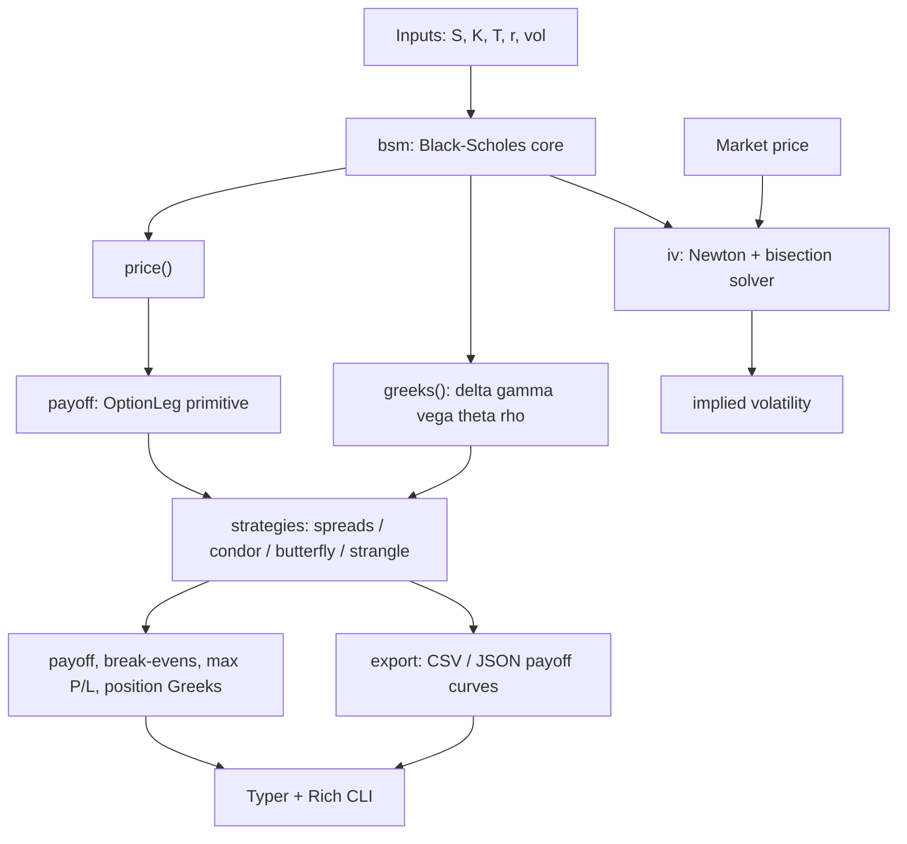

# ⚡ [QUANT-SOURCE-161] Consolidated Quant & Algo Trading Repositories
**Category**: `OPTIONS_GREEKS_VOLATILITY` | **Repositories in this Source**: 3
**Generated**: QUANT_BUNDLE_161_OPTIONS_GREEKS_VOLATILITY.md | **Target**: NotebookLM 290+ Quant Code Brain

---

## [1/3] Repository: options-trading-bot (`PHASE4-QUANT-191`)
- **Full Name**: `PHASE4-QUANT-191_Viprasol-Tech__options-trading-bot`
- **Description**: Options trading bot — Black-Scholes pricing, Greeks & strategy payoffs in Python. By Viprasol Tech.
- **GitHub Stars**: 1
- **Source Pool**: `phase4_quant_wheels_100`

### Documentation & Overview (README.md)
<p align="center">
  
</p>

<h1 align="center">Options Trading Bot</h1>

<p align="center">
  <strong>Black-Scholes pricing, full Greeks, an implied-volatility solver, and battle-tested multi-leg strategies — pure-Python, zero heavy deps.</strong><br>
  Price options, recover implied vol from market quotes, build spreads / condors / butterflies, and export plot-ready payoff curves.
</p>

<p align="center">
  <em>Built and maintained by <a href="https://viprasol.com">Viprasol Tech</a> — Fintech Experts. Full-Stack Builders.</em>
</p>

<p align="center">
  <a href="https://github.com/Viprasol-Tech/options-trading-bot/actions/workflows/ci.yml"></a>
  <a href="LICENSE"></a>
  
  
  
  
  
  <a href="https://t.me/viprasol_help"></a>
  <a href="https://github.com/Viprasol-Tech/options-trading-bot/stargazers"></a>
</p>

---

> ## ⚠️ Disclaimer
> This software is for **educational purposes only** and is **not financial advice**. Options trading involves substantial risk, including the **total loss of capital** and, for some strategies (e.g. short/naked legs), **theoretically unlimited loss**. Model prices are theoretical Black-Scholes values that ignore real-world frictions — slippage, early exercise, dividends, liquidity, and assignment risk. Always test thoroughly with your own data and consult a licensed advisor before trading. **Use at your own risk** — Viprasol Tech assumes no responsibility for your trading results.

---

## ✨ Features

- 🧮 **Black-Scholes pricing** — European calls and puts using only `math` from the standard library (no scipy/numpy required for the core).
- 📐 **Full Greeks** — delta, gamma, vega, theta, and rho in one call.
- 🔎 **Implied-volatility solver** — Newton-Raphson driven by closed-form vega, with a guaranteed **bisection fallback** for deep ITM/OTM options and bad initial guesses. Raises a clear `IVError` on arbitrage-violating inputs.
- 🪜 **Multi-leg strategy engine** — a composable `OptionLeg` primitive and a `Strategy` class with payoff, **net debit/credit**, break-evens, max profit/loss, and quantity-weighted **position Greeks**.
- 🎯 **Ready-made strategies** — bull call / bear put (debit) & bull put / bear call (credit) verticals, **iron condor**, **long call butterfly**, and **long strangle**.
- 📊 **Payoff exporter** — write any strategy's payoff curve to **CSV or JSON** for matplotlib, Excel, or a web chart — no plotting dependency baked in.
- 🖥️ **Rich CLI** — `price`, `iv`, `strategy`, `export`, and `covered-call` subcommands with formatted tables.
- ✅ **Verifiable** — 47 tests asserting put-call parity, IV round-trips, payoff shapes, and exporter output.
- ⚙️ **Modern tooling** — ruff, mypy (strict), pytest, GitHub Actions CI.

## 🚀 Quickstart

```bash
git clone https://github.com/Viprasol-Tech/options-trading-bot.git
cd options-trading-bot
python -m pip install -e ".[dev]"

# Price an ATM 30-day call and show its Greeks
options-trading-bot price --spot 100 --strike 100 --days 30 --vol 0.2

# Recover implied volatility from a market price
options-trading-bot iv 2.50 --spot 100 --strike 100 --days 30

# Analyse an iron condor: payoff, break-evens, risk, position Greeks
options-trading-bot strategy iron-condor

# Export a butterfly payoff curve to JSON for plotting
options-trading-bot export butterfly --out payoff.json
```

## 🧩 Usage in code

```python
from options_trading_bot import (
    OptionType, price, greeks, implied_volatility, iron_condor,
)
from options_trading_bot.export import export_payoff

# 1) Price + Greeks
p = price(spot=100, strike=105, t=0.25, r=0.05, vol=0.2, option=OptionType.CALL)
g = greeks(spot=100, strike=105, t=0.25, r=0.05, vol=0.2, option=OptionType.CALL)
print(f"price={p:.4f}  delta={g.delta:.4f}  vega={g.vega:.4f}")

# 2) Recover implied volatility from a market quote (round-trips to ~0.20)
iv = implied_volatility(p, spot=100, strike=105, t=0.25, r=0.05, option=OptionType.CALL)
print(f"implied vol = {iv:.4%}")

# 3) Build and analyse an iron condor
condor = iron_condor(90, 95, 105, 110, premiums=(1.0, 2.5, 2.5, 1.0))
print(condor.net_premium())            # +3.0 -> net credit
print(condor.break_evens(70, 130))     # [92.0, 108.0]
print(condor.max_profit(70, 130), condor.max_loss(70, 130))  # 3.0, -2.0
print(condor.position_greeks(spot=100, t=0.08, r=0.05, vol=0.2).delta)

# 4) Export the payoff curve for plotting
export_payoff(condor, "condor.csv", low=80, high=120, steps=41)
```

A full walkthrough lives in [`examples/quickstart.py`](examples/quickstart.py).

## 🏗️ Architecture



## 📚 API & CLI at a glance

| Area        | Function / Command                                   | What it does                                              |
|-------------|------------------------------------------------------|----------------------------------------------------------|
| Pricing     | `price(S, K, t, r, vol, option)`                     | Black-Scholes price of a European call/put               |
| Greeks      | `greeks(...) -> Greeks`                               | delta, gamma, vega, theta, rho                            |
| Implied vol | `implied_volatility(mkt, S, K, t, r, option)`        | Newton-Raphson + bisection IV solver                     |
| Strategy    | `bull_call_spread`, `iron_condor`, `long_call_butterfly`, … | Build named multi-leg `Strategy` objects           |
| Analytics   | `Strategy.break_evens / max_profit / position_greeks`| Risk/reward and aggregate Greeks                         |
| Export      | `export_payoff(strategy, path, low, high, steps)`    | Write payoff curve to CSV/JSON                            |
| CLI         | `price`, `iv`, `strategy`, `export`, `covered-call`  | Same capabilities from the terminal                      |

## 🗺️ Roadmap

- [x] Black-Scholes pricing + full Greeks
- [x] Implied-volatility solver (Newton + bisection)
- [x] Vertical spreads, iron condor, butterfly, strangle with payoff + Greeks
- [x] Payoff-curve exporter (CSV / JSON)
- [x] CLI subcommands (`price`, `iv`, `strategy`, `export`)
- [ ] American-option pricing (binomial / trinomial trees)
- [ ] Dividend yield (`q`) and forward pricing
- [ ] Live options-chain data adapters
- [ ] Volatility-surface fitting

## ❓ FAQ

**Does this place real trades?** No. It is a pricing, analytics, and strategy-modelling library — there is no broker connectivity. It is built for research and education.

**Why no scipy/numpy in the core?** The pricing, Greeks, and IV solver use only the standard library so the core is tiny and dependency-light. `pydantic`, `typer`, and `rich` power config and the CLI.

**How does the IV solver stay robust?** It starts with Newton-Raphson (using closed-form vega) and falls back to bisection whenever vega is too small or a step leaves the bounds — guaranteeing convergence because price is monotone in volatility.

**Are these European or American options?** European. American-style pricing is on the roadmap.

## 🤝 Contributing

PRs welcome — see [CONTRIBUTING.md](CONTRIBUTING.md) and our [Code of Conduct](CODE_OF_CONDUCT.md). Before opening a PR, run `ruff check . && ruff format . && mypy src && pytest`.

## Contact — Viprasol Tech Private Limited

- Website: [viprasol.com](https://viprasol.com)
- Email: [support@viprasol.com](mailto:support@viprasol.com)
- Telegram: [t.me/viprasol_help](https://t.me/viprasol_help) | WhatsApp: +91 96336 52112
- GitHub: [@Viprasol-Tech](https://github.com/Viprasol-Tech) | [LinkedIn](https://www.linkedin.com/in/viprasol/) | X [@viprasol](https://twitter.com/viprasol)

## License

[MIT](LICENSE) (c) 2025 Viprasol Tech Private Limited

### Core Implementation Code & Architecture
#### File: `tests/__init__.py`
```python
from __future__ import annotations
```

#### File: `tests/unit/__init__.py`
```python
from __future__ import annotations
```

#### File: `src/options_trading_bot/__main__.py`
```python
from __future__ import annotations

from options_trading_bot.cli import app

if __name__ == "__main__":
    app()
```

#### File: `src/options_trading_bot/__init__.py`
```python
"""Options Trading Bot - Black-Scholes pricing, Greeks, IV & strategies by Viprasol Tech."""

from __future__ import annotations

from options_trading_bot.bsm import Greeks, OptionType, greeks, price
from options_trading_bot.iv import IVError, implied_volatility
from options_trading_bot.payoff import OptionLeg, legs_payoff, option_payoff, price_grid
from options_trading_bot.strategies import (
    Strategy,
    bear_call_spread,
    bear_put_spread,
    bull_call_spread,
    bull_put_spread,
    iron_condor,
    long_call_butterfly,
    long_strangle,
)

__version__ = "0.2.0"
__author__ = "Viprasol Tech Private Limited"
__all__ = [
    "Greeks",
    "IVError",
    "OptionLeg",
    "OptionType",
    "Strategy",
    "__version__",
    "bear_call_spread",
    "bear_put_spread",
    "bull_call_spread",
    "bull_put_spread",
    "greeks",
    "implied_volatility",
    "iron_condor",
    "legs_payoff",
    "long_call_butterfly",
    "long_strangle",
    "option_payoff",
    "price",
    "price_grid",
]
```

#### File: `tests/unit/test_bsm.py`
```python
"""Tests for Black-Scholes pricing, Greeks, and payoffs.

These check against known properties: put-call parity, delta bounds, and a
reference ATM price, which together pin down a correct implementation.
"""

from __future__ import annotations

import math

from options_trading_bot.bsm import OptionType, greeks, price
from options_trading_bot.payoff import covered_call, long_straddle, option_payoff


def test_atm_call_reference_value() -> None:
    # S=K=100, T=1y, r=0, vol=20% -> known BSM call ≈ 7.9656.
    p = price(100, 100, 1.0, 0.0, 0.20, OptionType.CALL)
    assert math.isclose(p, 7.9656, abs_tol=1e-3)


def test_put_call_parity() -> None:
    s, k, t, r, vol = 100.0, 95.0, 0.5, 0.03, 0.25
    call = price(s, k, t, r, vol, OptionType.CALL)
    put = price(s, k, t, r, vol, OptionType.PUT)
    # C - P == S - K*e^{-rT}
    assert math.isclose(call - put, s - k * math.exp(-r * t), abs_tol=1e-6)


def test_call_delta_between_0_and_1() -> None:
    g = greeks(100, 100, 0.5, 0.02, 0.3, OptionType.CALL)
    assert 0.0 <= g.delta <= 1.0
    assert g.gamma > 0
    assert g.vega > 0


def test_put_delta_negative() -> None:
    g = greeks(100, 100, 0.5, 0.02, 0.3, OptionType.PUT)
    assert -1.0 <= g.delta <= 0.0


def test_expiry_is_intrinsic() -> None:
    assert price(110, 100, 0.0, 0.05, 0.2, OptionType.CALL) == 10.0
    assert price(90, 100, 0.0, 0.05, 0.2, OptionType.PUT) == 10.0


def test_payoffs() -> None:
    assert option_payoff(110, 100, OptionType.CALL, premium=4) == 6.0
    # Covered call caps upside at strike + premium - entry.
    assert math.isclose(covered_call(120, 100, 110, 3), 13.0)
    # Straddle profits on a big move.
    assert long_straddle(130, 100, 5, 5) > 0
```

#### File: `pyproject.toml`
```python
[build-system]
requires = ["hatchling"]
build-backend = "hatchling.build"

[project]
name = "options-trading-bot"
version = "0.2.0"
description = "Options trading bot — Black-Scholes pricing, Greeks, implied volatility and multi-leg strategies. By Viprasol Tech."
readme = "README.md"
requires-python = ">=3.11"
license = { text = "MIT" }
authors = [{ name = "Viprasol Tech Private Limited", email = "support@viprasol.com" }]
keywords = [
  "options-trading-bot",
  "options",
  "black-scholes",
  "greeks",
  "derivatives",
  "trading-bot",
  "quant",
]
classifiers = [
  "Development Status :: 4 - Beta",
  "Intended Audience :: Financial and Insurance Industry",
  "License :: OSI Approved :: MIT License",
  "Programming Language :: Python :: 3.11",
  "Programming Language :: Python :: 3.12",
  "Programming Language :: Python :: 3.13",
  "Topic :: Office/Business :: Financial :: Investment",
]
dependencies = ["pydantic>=2.6", "typer>=0.12", "rich>=13.7"]

[project.optional-dependencies]
dev = ["ruff>=0.4", "mypy>=1.10", "pytest>=8.0", "pytest-cov>=5.0"]

[project.scripts]
options-trading-bot = "options_trading_bot.cli:app"

[project.urls]
Homepage = "https://viprasol.com"
Repository = "https://github.com/Viprasol-Tech/options-trading-bot"
Issues = "https://github.com/Viprasol-Tech/options-trading-bot/issues"

[tool.hatch.build.targets.wheel]
packages = ["src/options_trading_bot"]

[tool.ruff]
line-length = 100
target-version = "py311"
src = ["src", "tests"]

[tool.ruff.lint]
select = ["E", "F", "I", "UP", "B", "SIM", "RUF", "C4"]
ignore = ["B008", "B027", "UP042"]

[tool.mypy]
python_version = "3.11"
strict = true
plugins = ["pydantic.mypy"]

[tool.pytest.ini_options]
addopts = "-q"
testpaths = ["tests"]
```


==================================================


## [2/3] Repository: options-trading (`PHASE4-QUANT-192`)
- **Full Name**: `PHASE4-QUANT-192_samirhrl__options-trading`
- **Description**: Interactive Python/Dash dashboard for European options pricing, portfolio P&L, and Greeks visualization.
- **GitHub Stars**: 1
- **Source Pool**: `phase4_quant_wheels_100`

### Documentation & Overview (README.md)
# 🏦 Options Trading Dashboard

[](https://www.python.org/)
[](LICENSE)

A **Python/Dash application** for managing a portfolio of European options.  
Compute **Black-Scholes prices**, Greeks, and visualize portfolio risk **in real-time**.

---

## 🚀 Features

- **Option Pricing & Greeks**
  - Price, Delta (Δ), Gamma (Γ), Vega (V), Theta (Θ), Rho (Ρ)
- **Portfolio Management**
  - Add / remove option positions
  - Track P&L and portfolio Greeks
- **Interactive Dashboard**
  - Trade inputs: Spot, Strike, Type, Side, Qty, Volatility, Rate, Maturity, Premium
  - Real-time **risk strip** and dynamic graphs
  - Book table with **conditional formatting**
- **Tabbed Interface**: Equity, Bonds, Credit (Equity fully implemented)

---

## 🖼️ Live Preview

Even if you haven’t cloned the repo, you can **visualize the dashboard**:

### Dashboard Overview


### Risk Strip & PnL Graphs


### Book Table Example


### Optional GIF Preview


> 💡 Tip: Replace the placeholders above with your actual screenshots or GIFs in `docs/screenshots/`.

---

## 🛠️ Installation

1. **Clone the repository:**

```bash
git clone https://github.com/samirhrl/options-trading
cd options-trading
```

2. **Create and activate a virtual environment**

- **macOS / Linux:**
```bash
python -m venv venv
source venv/bin/activate
```

- **Windows (cmd.exe):**
```cmd
python -m venv venv
venv\Scripts\activate
```

- **Windows (PowerShell):**
```powershell
python -m venv venv
.\venv\Scripts\Activate.ps1
```

3. **Install dependencies:**

```bash
pip install -r requirements.txt
```

---

## ⚡ Usage

Run the dashboard:

```bash
python app.py
```

- **Left panel**: enter trades (Spot, Strike, Call/Put, BUY/SELL, Qty, Vol, Rate, Maturity, Premium)
- **Right panel**: PnL and Greeks graphs, Book Table
- **Buttons**: `EXECUTE TRADE` to add an option, `FLATTEN PORTFOLIO` to clear all positions

---

## 📂 Project Structure

```
├── app.py               # Entry point
├── models/
│   ├── black_scholes.py  # Black-Scholes pricing & Greeks
│   ├── option.py         # Option class
│   └── portfolio.py      # Portfolio aggregation
├── controllers/
│   └── trade_controller.py  # Dash callbacks
├── views/
│   ├── dash_app.py       # Dash layout
│   ├── book_table.py     # Portfolio book DataTable
│   └── graph_panel.py    # Graph panel for PnL & Greeks
├── docs/
│   └── screenshots/      # Project screenshots / GIFs for preview
├── requirements.txt
└── README.md
```

---

## 🔍 Classes Overview

| Class | Responsibility |
|-------|----------------|
| `BlackScholes` | Compute European option price & Greeks |
| `Option` | Represents a single option trade with PnL |
| `Portfolio` | Aggregates options, computes portfolio PnL & Greeks |
| `GraphPanel` | Creates Plotly figures for portfolio metrics |
| `BookTable` | Dash DataTable showing portfolio positions |
| `DashApp` | Sets up Dash layout and components |
| `TradeController` | Registers Dash callbacks for trades & updates |

---

## 🛠 Future Improvements

- Implement **Bonds** and **Credit** tabs
- Add **volatility surface support**
- Enable **multi-asset portfolios**
- Integrate **real market data**
- Export portfolio reports as CSV/Excel

---

### Core Implementation Code & Architecture
#### File: `app.py`
```python
"""
Main entry point for the Options Trading Dashboard.

This script initializes the portfolio, sets up the Dash application view,
registers the trade controller, and runs the Dash server.
"""

from models.portfolio import Portfolio
from views.dash_app import DashApp
from controllers.trade_controller import TradeController

if __name__ == "__main__":
    # Initialize an empty portfolio
    portfolio = Portfolio()

    # Initialize the Dash application view with the portfolio
    app_view = DashApp(portfolio)

    # Attach the trade controller to manage trades and callbacks
    TradeController(portfolio, app_view)

    # Run the Dash app
    app_view.run()
```

#### File: `views/book_table.py`
```python
from dash import dash_table, html

class BookTable:
    """
    Generates a Dash DataTable for displaying the portfolio book.

    The table highlights key fields like 'pnl' and 'prime' using color coding:
        - Red for negative values
        - Lime for positive values
    """

    def make_table(self, book_data):
        """
        Creates a Dash DataTable from the provided book data.

        Parameters:
            book_data : list of dict
                Each dict represents an option in the portfolio with keys:
                ["type","side","strike","qty","vol","rate","maturity","price_entry","prime","pnl"]

        @Returns:
            dash_table.DataTable : Dash component ready to render
        """
        return dash_table.DataTable(
            # Table styling
            style_table={"height": "calc(100% - 28px)", "overflowY": "auto"},
            style_cell={
                "backgroundColor": "#111",
                "color": "white",
                "border": "1px solid #333",
                "fontSize": "12px",
                "textAlign": "center"
            },
            style_header={"backgroundColor": "#1e1e1e"},
            # Conditional formatting for PnL and Prime
            style_data_conditional=[
                {"if": {"filter_query": "{pnl} < 0", "column_id": "pnl"}, "color": "red"},
                {"if": {"filter_query": "{pnl} > 0", "column_id": "pnl"}, "color": "lime"},
                {"if": {"filter_query": "{prime} < 0", "column_id": "prime"}, "color": "red"},
                {"if": {"filter_query": "{prime} > 0", "column_id": "prime"}, "color": "lime"}
            ],
            # Define columns in table
            columns=[{"name": c, "id": c} for c in [
                "type", "side", "strike", "qty", "vol", "rate", "maturity", "price_entry", "prime", "pnl"
            ]],
            # Populate table with book data
            data=book_data
        )
```

#### File: `views/graph_panel.py`
```python
import plotly.graph_objects as go
from models.portfolio import Portfolio

class GraphPanel:
    """
    Represents a panel for plotting portfolio metrics (PnL or Greeks) using Plotly.

    Attributes:
        title : str
            Title of the graph panel (e.g., "Portfolio P&L", "Portfolio Delta")
    """

    def __init__(self, title: str):
        """
        Initializes the GraphPanel with a title.

        Parameters:
            title : str
                The title to display on the graph
        """
        self.title = title

    def make_fig(self, y, spot: float, strikes: list):
        """
        Creates a Plotly Figure displaying a portfolio metric across spot prices.

        Features:
            - Line plot of metric vs underlying spot price
            - Vertical dashed line at current spot
            - Vertical dash-dot lines at option strikes
            - Dark theme layout with minimal margins

        Parameters:
            y : np.ndarray or list
                Array of metric values (e.g., PnL, Delta, Gamma)
            spot : float
                Current spot price of the underlying asset
            strikes : list of floats
                List of option strike prices to highlight on the graph

        @Returns:
            plotly.graph_objects.Figure : Plotly figure ready to render in Dash
        """
        fig = go.Figure(go.Scatter(
            x=Portfolio.spot_grid,
            y=y,
            mode="lines",
            line=dict(width=2)
        ))

        # Highlight current spot price
        fig.add_vline(x=spot, line_dash="dash", line_color="orange",
                      line_width=2.5, opacity=0.9)

        # Highlight option strikes
        for k in strikes:
            fig.add_vline(x=k, line_dash="dashdot", line_color="cyan",
                          line_width=2, opacity=0.85)

        # Update layout
        fig.update_layout(
            template="plotly_dark",
            title=self.title,
            margin=dict(l=10, r=10, t=30, b=10),
            height=180
        )

        return fig
```

#### File: `models/option.py`
```python
from models.black_scholes import BlackScholes

class Option:
    """
    Represents a European option position.

    Attributes:
        type : str
            Option type: "Call" or "Put"
        side : str
            Position side: "BUY" or "SELL"
        strike : float
            Strike price of the option
        qty : int
            Quantity of options held
        vol : float
            Volatility used for pricing
        rate : float
            Risk-free interest rate
        maturity : float
            Time to maturity in years
        price_entry : float
            Entry price of the option (rounded to 2 decimals)
        prime : float
            Total initial cash outflow/inflow for the position
            (negative for BUY, positive for SELL)
    """

    def __init__(self, type_, side, strike, qty, vol, rate, maturity, price_entry):
        """
        Initializes an Option instance.

        Parameters:
            type_ : str
                Option type ("Call" or "Put")
            side : str
                "BUY" or "SELL"
            strike : float
                Strike price of the option
            qty : int
                Number of option contracts
            vol : float
                Volatility used for pricing
            rate : float
                Risk-free interest rate
            maturity : float
                Time to maturity in years
            price_entry : float
                Price at which the option was entered
        """
        self.type = type_
        self.side = side
        self.strike = strike
        self.qty = qty
        self.vol = vol
        self.rate = rate
        self.maturity = maturity
        self.price_entry = round(price_entry, 2)
        # Initial cash flow: negative for BUY, positive for SELL
        self.prime = round(qty * price_entry * (-1 if side == "BUY" else 1), 2)

    def pnl(self, spot):
        """
        Calculates the profit and loss (PnL) of the option at a given spot price.

        Parameters:
            spot : float
                Current price of the underlying asset

        @Returns:
            float : PnL of the option position (rounded to 2 decimals)
        """
        # Determine position sign: +1 for BUY, -1 for SELL
        sign = 1 if self.side == "BUY" else -1
        # Calculate PnL using Black-Scholes pricing
        current_price = BlackScholes.price(
            spot, self.strike, self.maturity, self.rate, self.vol, self.type
        )
        return round(sign * self.qty * (current_price - self.price_entry), 2)
```

#### File: `models/portfolio.py`
```python
import numpy as np
from models.option import Option
from models.black_scholes import BlackScholes

class Portfolio:
    """
    Represents a portfolio of European option positions and computes
    portfolio-level PnL and Greeks across a range of spot prices.

    Attributes:
        spot_grid : np.ndarray
            Array of underlying prices used to evaluate portfolio curves
        book : list
            List of Option objects currently in the portfolio
    """

    # Define a fixed spot price grid for portfolio evaluation
    spot_grid = np.linspace(50, 150, 200)

    def __init__(self):
        """
        Initializes an empty portfolio.
        """
        self.book = []

    def add_option(self, opt: Option):
        """
        Adds an Option to the portfolio.

        Parameters:
            opt : Option
                An instance of the Option class to add to the portfolio
        """
        self.book.append(opt)

    def flatten(self):
        """
        Removes all options from the portfolio.
        """
        self.book.clear()

    def portfolio_curves(self):
        """
        Computes portfolio-level PnL and Greeks over the spot price grid.

        @Returns:
            tuple of np.ndarray:
                - pnl : array of portfolio PnL across spot_grid
                - delta : array of portfolio Delta across spot_grid
                - gamma : array of portfolio Gamma across spot_grid
                - vega : array of portfolio Vega across spot_grid
                - theta : array of portfolio Theta across spot_grid
                - rho : array of portfolio Rho across spot_grid
        """
        # Initialize arrays for portfolio metrics
        pnl = np.zeros_like(Portfolio.spot_grid)
        delta = np.zeros_like(Portfolio.spot_grid)
        gamma = np.zeros_like(Portfolio.spot_grid)
        vega = np.zeros_like(Portfolio.spot_grid)
        theta = np.zeros_like(Portfolio.spot_grid)
        rho = np.zeros_like(Portfolio.spot_grid)

        # Sum contributions from each option in the portfolio
        for opt in self.book:
            sign = 1 if opt.side == "BUY" else -1
            pnl += sign * opt.qty * (
                BlackScholes.price(
                    Portfolio.spot_grid, opt.strike, opt.maturity, opt.rate, opt.vol, opt.type
                )
                - opt.price_entry
            )
            delta += sign * opt.qty * BlackScholes.delta(
                Portfolio.spot_grid, opt.strike, opt.maturity, opt.rate, opt.vol, opt.type
            )
            gamma += sign * opt.qty * BlackScholes.gamma(
                Portfolio.spot_grid, opt.strike, opt.maturity, opt.rate, opt.vol
            )
            vega += sign * opt.qty * BlackScholes.vega(
                Portfolio.spot_grid, opt.strike, opt.maturity, opt.rate, opt.vol
            )
            theta += sign * opt.qty * BlackScholes.theta(
                Portfolio.spot_grid, opt.strike, opt.maturity, opt.rate, opt.vol, opt.type
            )
            rho += sign * opt.qty * BlackScholes.rho(
                Portfolio.spot_grid, opt.strike, opt.maturity, opt.rate, opt.vol, opt.type
            )

        return pnl, delta, gamma, vega, theta, rho
```

#### File: `models/black_scholes.py`
```python
import numpy as np
from scipy.stats import norm

class BlackScholes:
    """
    Implementation of the Black-Scholes model for pricing European options
    and calculating their Greeks (sensitivities).

    All methods are static and use standard Black-Scholes formulas.

    Method parameters:
        S : float
            Current price of the underlying asset
        K : float
            Strike price of the option
        T : float
            Time to maturity in years
        r : float
            Annual risk-free interest rate (continuously compounded)
        sigma : float
            Annual volatility of the underlying asset
        opt : str
            Option type, either "Call" or "Put"
    """

    @staticmethod
    def d1(S, K, T, r, sigma):
        """
        Calculates the d1 parameter in the Black-Scholes model.

        Formula: d1 = (ln(S/K) + (r + 0.5*sigma^2)*T) / (sigma * sqrt(T))

        @Returns:
            float : d1 value
        """
        return (np.log(S / K) + (r + 0.5 * sigma ** 2) * T) / (sigma * np.sqrt(T))

    @staticmethod
    def d2(S, K, T, r, sigma):
        """
        Calculates the d2 parameter in the Black-Scholes model.

        Formula: d2 = d1 - sigma * sqrt(T)

        @Returns:
            float : d2 value
        """
        return BlackScholes.d1(S, K, T, r, sigma) - sigma * np.sqrt(T)

    @staticmethod
    def price(S, K, T, r, sigma, opt):
        """
        Calculates the price of a European Call or Put option.

        Formulas:
            Call : C = S*N(d1) - K*exp(-r*T)*N(d2)
            Put  : P  = K*exp(-r*T)*N(-d2) - S*N(-d1)

        @Returns:
            float : option price
        """
        D1 = BlackScholes.d1(S, K, T, r, sigma)
        D2 = BlackScholes.d2(S, K, T, r, sigma)
        if opt == "Call":
            return S * norm.cdf(D1) - K * np.exp(-r * T) * norm.cdf(D2)
        else:
            return K * np.exp(-r * T) * norm.cdf(-D2) - S * norm.cdf(-D1)

    @staticmethod
    def delta(S, K, T, r, sigma, opt):
        """
        Calculates the Delta of a European option.

        Delta measures sensitivity of the option price to changes in the underlying asset price.

        Formulas:
            Call : Δ = N(d1)
            Put  : Δ = N(d1) - 1

        @Returns:
            float : option Delta
        """
        D1 = BlackScholes.d1(S, K, T, r, sigma)
        return norm.cdf(D1) if opt == "Call" else norm.cdf(D1) - 1

    @staticmethod
    def gamma(S, K, T, r, sigma):
        """
        Calculates the Gamma of a European option.

        Gamma measures sensitivity of Delta to changes in the underlying asset price.

        Formula:
            Γ = N'(d1) / (S * sigma * sqrt(T))

        @Returns:
            float : option Gamma
        """
        D1 = BlackScholes.d1(S, K, T, r, sigma)
        return norm.pdf(D1) / (S * sigma * np.sqrt(T))

    @staticmethod
    def vega(S, K, T, r, sigma):
        """
        Calculates the Vega of a European option.

        Vega measures sensitivity of the option price to changes in volatility.

        Formula:
            ν = S * N'(d1) * sqrt(T)

        @Returns:
            float : option Vega
        """
        D1 = BlackScholes.d1(S, K, T, r, sigma)
        return S * norm.pdf(D1) * np.sqrt(T)

    @staticmethod
    def theta(S, K, T, r, sigma, opt):
        """
        Calculates the Theta of a European option.

        Theta measures sensitivity of the option price to time decay.

        Formulas:
            Call : θ = -S*N'(d1)*sigma/(2*sqrt(T)) - r*K*exp(-r*T)*N(d2)
            Put  : θ = -S*N'(d1)*sigma/(2*sqrt(T)) + r*K*exp(-r*T)*N(-d2)

        @Returns:
            float : option Theta
        """
        D1 = BlackScholes.d1(S, K, T, r, sigma)
        D2 = BlackScholes.d2(S, K, T, r, sigma)
        if opt == "Call":
            return -S * norm.pdf(D1) * sigma / (2 * np.sqrt(T)) - r * K * np.exp(-r * T) * norm.cdf(D2)
        else:
            return -S * norm.pdf(D1) * sigma / (2 * np.sqrt(T)) + r * K * np.exp(-r * T) * norm.cdf(-D2)

    @staticmethod
    def rho(S, K, T, r, sigma, opt):
        """
        Calculates the Rho of a European option.

        Rho measures sensitivity of the option price to changes in the interest rate.

        Formulas:
            Call : ρ = K*T*exp(-r*T)*N(d2)
            Put  : ρ = -K*T*exp(-r*T)*N(-d2)

        @Returns:
            float : option Rho
        """
        D2 = BlackScholes.d2(S, K, T, r, sigma)
        if opt == "Call":
            return K * T * np.exp(-r * T) * norm.cdf(D2)
        else:
            return -K * T * np.exp(-r * T) * norm.cdf(-D2)
```


==================================================


## [3/3] Repository: Black-Scholes-Options-Trading (`PHASE4-QUANT-193`)
- **Full Name**: `PHASE4-QUANT-193_Skipflap__Black-Scholes-Options-Trading`
- **Description**: An interactive Python model for European option pricing with Greeks and implied volatility. Features a GUI and real-time API integration for live market data.
- **GitHub Stars**: 1
- **Source Pool**: `phase4_quant_wheels_100`

### Documentation & Overview (README.md)
# Black-Scholes Option Pricing Model

This project is an implementation of the Black-Scholes model for pricing European options along with a calculation of the associated Greeks and an implied volatility solver. The project is designed as a robust tool for understanding option pricing, risk management, and market calibration, and it showcases modern Python programming practices and object-oriented design.

## Table of Contents

- [Overview](#overview)
- [Features](#features)
- [Technologies Used](#technologies-used)
- [Project Structure](#project-structure)
- [Installation](#installation)
- [Usage](#usage)
- [Learning Outcomes](#learning-outcomes)
- [Future Enhancements](#future-enhancements)

## Overview

The Black-Scholes model is a fundamental tool in financial engineering used to determine the theoretical price of European call and put options. It is built upon the assumption that underlying asset prices follow a **geometric Brownian motion** and has become the basis for many trading strategies and risk management systems.

In this project, I have:
- Implemented the Black-Scholes formulas for both call and put options.
- Developed a comprehensive class structure to encapsulate pricing (`BlackScholesModel`) and sensitivity analysis (`Greeks`).
- Integrated support for continuous dividends.
- Added second order Greeks such as **Vomma** and **Vanna**.
- Built a Newton-Raphson implied volatility solver to calibrate the model to market prices.
- Provided an interactive command-line interface for user inputs, making the tool flexible and practical.

## Features

- **Option Pricing**: Calculates theoretical European call and put option prices.
- **Greeks Calculation**: Computes first-order Greeks (Delta, Gamma, Theta, Vega, Rho) and second-order Greeks (Vomma, Vanna) to analyze risk.
- **Dividend Support**: Includes continuous dividend yield in pricing.
- **Implied Volatility Solver**: Uses the Newton-Raphson method to determine the volatility implied by current market prices.
- **User-Friendly CLI**: Interactive inputs allow for easy parameter adjustments.

## Technologies Used

- **Python 3**: Primary programming language.
- **NumPy**: For numerical operations and mathematical functions.
- **SciPy**: For statistical calculations (specifically the normal distribution functions).

## Project Structure

### Core Implementation Code & Architecture
#### File: `config.py`
```python
from dotenv import load_dotenv
import os

load_dotenv()

API_KEY = os.getenv("ALPHA_VANTAGE_API_KEY")
```

#### File: `data_provider.py`
```python
# data_provider.py
from alpha_vantage.timeseries import TimeSeries     # :contentReference[oaicite:7]{index=7}
from config import API_KEY
import pandas as pd

# instantiate once
_ts = TimeSeries(key=API_KEY, output_format='pandas')

def get_latest_intraday_price(symbol: str, interval: str = '1min') -> float:
    """
    Fetch the latest close price for the given symbol at the specified intraday interval.
    Uses outputsize='compact' (latest 100 bars) by default.
    """
    data, meta = _ts.get_intraday(symbol=symbol,
                                  interval=interval,
                                  outputsize='compact')      # 
    # '4. close' column holds close prices; last row is the newest bar
    latest_close = data['4. close'].iloc[-1]
    return float(latest_close)
```

#### File: `live_pricer.py`
```python
# live_pricer.py
import time
from config import API_KEY
from data_provider import get_latest_intraday_price
from models.BlackScholesModel import BlackScholesModel, Greeks, implied_volatility_call

# Option parameters (could also be CLI args)
SYMBOL = "AAPL"
STRIKE = 170.0
DAYS_TO_EXPIRY = 30
T = DAYS_TO_EXPIRY / 252                          # Trading days fraction :contentReference[oaicite:9]{index=9}
R = 0.01                                         # 1% risk-free
Q = 0.0                                          # No dividend

def main():
    print(f"Starting live pricer for {SYMBOL}, strike={STRIKE}, T={T:.4f}")
    try:
        while True:
            S = get_latest_intraday_price(SYMBOL, interval='1min')
            model = BlackScholesModel(S, STRIKE, T, R, sigma=0.2, q=Q)
            theo_call = model.call_price()
            greeks = Greeks(model)
            iv = implied_volatility_call(S, STRIKE, T, R, Q, market_call_price=theo_call)

            print(f"S={S:.2f} | TheoCall={theo_call:.2f} | IV={iv:.2%}")
            print(f"  Δ_call={greeks.delta()['call']:.4f}, Γ={greeks.gamma():.4f}, ν={greeks.vega():.4f}")
            print("—" * 60)

            time.sleep(60)  # pause 1 minute to respect rate limits :contentReference[oaicite:10]{index=10}

    except KeyboardInterrupt:
        print("Live pricer stopped.")

if __name__ == "__main__":
    main()
```

#### File: `blackScholes.py`
```python
from models.BlackScholesModel import BlackScholesModel, Greeks, implied_volatility_call


def main():
    try:
        # Input parameters for the option
        S = float(input("Enter the current stock price (S): "))
        X = float(input("Enter the strike price (X): "))
        T = float(input("Enter the time to expiration in months (T): "))
        T = T / 12  # convert months to years
        r = float(input("Enter the risk-free interest rate (r) in decimal form: "))
        sigma = float(input("Enter the volatility (sigma) in decimal form: "))

        # Make dividend yield optional
        q_input = input(
            "Enter the continuous dividend yield (q) in decimal form (default is 0): "
        )
        q = float(q_input) if q_input else 0.0

        # Create the Black-Scholes model instance and compute prices/Greeks
        model = BlackScholesModel(S, X, T, r, sigma, q)
        greeks = Greeks(model)

        print(f"\nTheoretical Prices:")
        print(f"  Call Price: {model.call_price():.2f}")
        print(f"  Put Price:  {model.put_price():.2f}\n")

        print("Greeks:")
        delta = greeks.delta()
        theta = greeks.theta()
        rho = greeks.rho()

        print(f"  Delta (Call): {delta['call']:.4f}")
        print(f"  Delta (Put):  {delta['put']:.4f}")
        print(f"  Gamma:        {greeks.gamma():.4f}")
        print(f"  Theta (Call): {theta['call']:.4f}")
        print(f"  Theta (Put):  {theta['put']:.4f}")
        print(f"  Vega:         {greeks.vega():.4f}")
        print(f"  Vomma:        {greeks.vomma():.4f}")
        print(f"  Vanna:        {greeks.vanna():.4f}")
        print(f"  Rho (Call):   {rho['call']:.4f}")
        print(f"  Rho (Put):    {rho['put']:.4f}")

        # Real Market vs. Theoretical Price Comparison:
        market_call_price = float(input("\nEnter the observed market call price: "))
        theoretical_call_price = model.call_price()
        price_diff = market_call_price - theoretical_call_price

        print(f"\nComparison:")
        print(f"  Theoretical Call Price: {theoretical_call_price:.2f}")
        print(f"  Market Call Price:      {market_call_price:.2f}")

        if price_diff > 0:
            print(
                "  The option appears OVERVALUED (market price is higher than theoretical)."
            )
        elif price_diff < 0:
            print(
                "  The option appears UNDERVALUED (market price is lower than theoretical)."
            )
        else:
            print("  The market price is in line with the theoretical price.")

        # Solve for implied volatility
        implied_vol = implied_volatility_call(S, X, T, r, q, market_call_price)
        print(f"\nImplied Volatility: {implied_vol:.4f}")

        # Optionally, you could compare this IV to your input sigma or historical values.
        print(f"Input Volatility:   {sigma:.4f}")

    except ValueError:
        print("Invalid input. Please enter numeric values.")


if __name__ == "__main__":
    main()
```

#### File: `models/BlackScholesModel.py`
```python
from numpy import log, sqrt, exp
from scipy.stats import norm


class BlackScholesModel:
    def __init__(self, S, X, T, r, sigma, q=0.0):
        self.S = S
        self.X = X
        self.T = T
        self.r = r
        self.sigma = sigma
        self.q = q

        # Use dividend yield q in the drift term:
        self.d1 = (log(S / X) + (r - q + 0.5 * sigma**2) * T) / (sigma * sqrt(T))
        self.d2 = self.d1 - sigma * sqrt(T)

    def call_price(self):
        return self.S * exp(-self.q * self.T) * norm.cdf(self.d1) - self.X * exp(
            -self.r * self.T
        ) * norm.cdf(self.d2)

    def put_price(self):
        return self.X * exp(-self.r * self.T) * norm.cdf(-self.d2) - self.S * exp(
            -self.q * self.T
        ) * norm.cdf(-self.d1)


class Greeks:
    def __init__(self, model: BlackScholesModel):
        self.model = model
        self.pdf_d1 = norm.pdf(model.d1)

    def delta(self):
        return {"call": norm.cdf(self.model.d1), "put": norm.cdf(self.model.d1) - 1}

    def gamma(self):
        return self.pdf_d1 / (self.model.S * self.model.sigma * sqrt(self.model.T))

    def theta(self):
        S, X, T, r, sigma, q = (
            self.model.S,
            self.model.X,
            self.model.T,
            self.model.r,
            self.model.sigma,
            self.model.q,
        )
        d1, d2 = self.model.d1, self.model.d2
        theta_call = (
            -S * exp(-q * T) * self.pdf_d1 * sigma / (2 * sqrt(T))
            - r * X * exp(-r * T) * norm.cdf(d2)
            + q * S * exp(-q * T) * norm.cdf(d1)
        )
        theta_put = (
            -S * exp(-q * T) * self.pdf_d1 * sigma / (2 * sqrt(T))
            + r * X * exp(-r * T) * norm.cdf(-d2)
            - q * S * exp(-q * T) * norm.cdf(-d1)
        )
        return {"call": theta_call, "put": theta_put}

    def vega(self):
        return (
            self.model.S
            * exp(-self.model.q * self.model.T)
            * self.pdf_d1
            * sqrt(self.model.T)
        )

    def vomma(self):
        # Vomma measures the sensitivity of Vega to changes in volatility.
        return self.vega() * ((self.model.d1 * self.model.d2) - 1) / self.model.sigma

    def vanna(self):
        # Vanna measures the sensitivity of Delta to changes in volatility.
        return (
            -self.model.S
            * exp(-self.model.q * self.model.T)
            * self.pdf_d1
            * self.model.d2
            / self.model.sigma
        )

    def rho(self):
        X, T, r = self.model.X, self.model.T, self.model.r
        d2 = self.model.d2
        rho_call = X * T * exp(-r * T) * norm.cdf(d2)
        rho_put = -X * T * exp(-r * T) * norm.cdf(-d2)
        return {"call": rho_call, "put": rho_put}


def implied_volatility_call(
    S, X, T, r, q, market_call_price, initial_guess=0.2, tol=1e-6, max_iter=100
):
    """
    Computes the implied volatility for a European call option using the Newton-Raphson method.

    Parameters:
      - S: Current stock price
      - X: Strike price
      - T: Time to expiration (in years)
      - r: Risk-free interest rate (in decimal form)
      - q: Continuous dividend yield (in decimal form)
      - market_call_price: Observed market price of the call option
      - initial_guess: Initial volatility guess (default 0.2 for 20%)
      - tol: Tolerance for convergence (default 1e-6)
      - max_iter: Maximum number of iterations (default 100)

    Returns:
      - The implied volatility (sigma) that makes the theoretical call price match the market_call_price.
    """
    sigma = initial_guess
    for i in range(max_iter):
        # Create a temporary model instance with the current volatility guess
        model = BlackScholesModel(S, X, T, r, sigma, q)
        price = model.call_price()
        diff = price - market_call_price

        if abs(diff) < tol:
            return sigma

        greeks = Greeks(model)
        vega_val = greeks.vega()
        if vega_val == 0:
            break

        sigma = sigma - diff / vega_val

    return sigma

def implied_volatility_put(
    S, X, T, r, q, market_put_price, initial_guess=0.2, tol=1e-6, max_iter=100
):
    """
    Computes the implied volatility for a European put option using the Newton-Raphson method.

    Parameters:
      - S: Current stock price
      - X: Strike price
      - T: Time to expiration (in years)
      - r: Risk-free interest rate (in decimal form)
      - q: Continuous dividend yield (in decimal form)
      - market_put_price: Observed market price of the put option
      - initial_guess: Initial volatility guess (default 0.2 for 20%)
      - tol: Tolerance for convergence (default 1e-6)
      - max_iter: Maximum number of iterations (default 100)

    Returns:
      - The implied volatility (sigma) that makes the theoretical put price match the market_put_price.
    """
    sigma = initial_guess
    for i in range(max_iter):
        model = BlackScholesModel(S, X, T, r, sigma, q)
        price = model.put_price()
        diff = price - market_put_price

        if abs(diff) < tol:
            return sigma

        greeks = Greeks(model)
        vega_val = greeks.vega()
        if vega_val == 0:
            break

        sigma = sigma - diff / vega_val

    return sigma
```


==================================================
