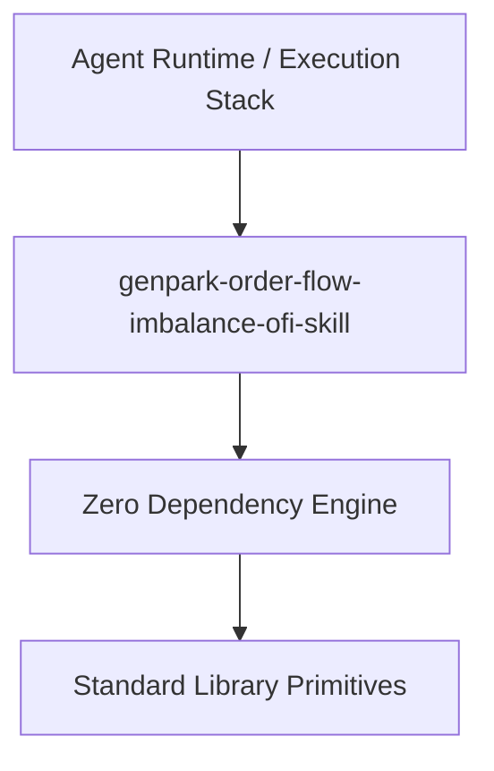

# ⚡ [QUANT-SOURCE-183] Consolidated Quant & Algo Trading Repositories
**Category**: `MARKET_MAKING_ORDER_FLOW` | **Repositories in this Source**: 3
**Generated**: QUANT_BUNDLE_183_MARKET_MAKING_ORDER_FLOW.md | **Target**: NotebookLM 290+ Quant Code Brain

---

## [1/3] Repository: genpark-order-flow-imbalance-ofi-skill (`WHEEL_genpark-order-flow-imbalance-ofi-skill`)
- **Full Name**: `genpark-order-flow-imbalance-ofi-skill`
- **Description**: Cont-Kukanov-Stoikov Order Flow Imbalance (OFI) predictor forecasting short-term price movements via quote level depth dynamics.
- **GitHub Stars**: 7
- **Source Pool**: `cloned_trading_wheels`

### Documentation & Overview (README.md)
# genpark-order-flow-imbalance-ofi-skill

[](https://github.com/Alpha-Park/genpark-order-flow-imbalance-ofi-skill)
[](https://github.com/Alpha-Park/genpark-order-flow-imbalance-ofi-skill)
[](https://www.python.org/)

Cont-Kukanov-Stoikov Order Flow Imbalance (OFI) predictor forecasting short-term price movements via quote level depth dynamics.



## Features
- **Strict 0 Pip Dependencies**: Built completely using the Python Standard Library.
- **Fast Execution & Verification**: Includes client wrapper, MCP server, and verified test suites.
- **Agentic AI Ready**: Exposes standard MCP tools for continuous LLM integration.

## Installation & Quickstart
```bash
git clone https://github.com/Alpha-Park/genpark-order-flow-imbalance-ofi-skill.git
cd genpark-order-flow-imbalance-ofi-skill
python example_usage.py
```

### Core Implementation Code & Architecture
#### File: `skill.json`
```python
{
  "name": "genpark-order-flow-imbalance-ofi-skill",
  "version": "1.0.0",
  "description": "Cont-Kukanov-Stoikov Order Flow Imbalance (OFI) predictor forecasting short-term price movements via quote level depth dynamics.",
  "tags": [
    "genpark-skill",
    "agentic-ai",
    "ofi",
    "order-flow",
    "market-microstructure",
    "predictive-alpha"
  ],
  "entrypoint": "client.py",
  "dependencies": []
}
```

#### File: `example_usage.py`
```python
from client import OrderFlowImbalance

def main():
    print("=== Testing Order Flow Imbalance (OFI) Predictor ===")
    ofi = OrderFlowImbalance()

    q_t0 = (100.0, 50, 101.0, 50)
    q_t1 = (100.0, 80, 101.0, 30) # +30 bids, -20 asks -> aggressive buying

    signal = ofi.compute_ofi(q_t0, q_t1)
    print("Calculated OFI net buying flow:", signal)
    assert signal == 50
    print("=== All tests passed successfully! ===")

if __name__ == "__main__":
    main()
```

#### File: `client.py`
```python
class OrderFlowImbalance:
    """
    Cont et al. Order Flow Imbalance (OFI).
    Measures net volume changes at best bid and ask quotes between timestamps:
    e_n = I(P_b >= P_b_prev)*q_b - I(P_b <= P_b_prev)*q_b_prev - (I(P_a <= P_a_prev)*q_a - I(P_a >= P_a_prev)*q_a_prev)
    """
    def compute_ofi(self, prev_quote, curr_quote):
        p_b0, q_b0, p_a0, q_a0 = prev_quote
        p_b1, q_b1, p_a1, q_a1 = curr_quote

        if p_b1 > p_b0:
            delta_bid = q_b1
        elif p_b1 == p_b0:
            delta_bid = q_b1 - q_b0
        else:
            delta_bid = -q_b0

        if p_a1 < p_a0:
            delta_ask = q_a1
        elif p_a1 == p_a0:
            delta_ask = q_a1 - q_a0
        else:
            delta_ask = -q_a0

        return delta_bid - delta_ask
```

#### File: `mcp_server.py`
```python
import sys
import json
from client import OrderFlowImbalance

ofi = OrderFlowImbalance()

def handle_call(name, arguments):
    if name == "compute_ofi":
        q0 = tuple(arguments["prev_quote"])
        q1 = tuple(arguments["curr_quote"])
        return {"ofi": ofi.compute_ofi(q0, q1)}
    return {"error": f"Unknown tool: {name}"}

def main():
    for line in sys.stdin:
        if not line.strip():
            continue
        try:
            req = json.loads(line)
            res = handle_call(req.get("name"), req.get("arguments", {}))
            print(json.dumps({"id": req.get("id"), "result": res}))
            sys.stdout.flush()
        except Exception as e:
            print(json.dumps({"error": str(e)}))
            sys.stdout.flush()

if __name__ == "__main__":
    main()
```


==================================================


## [2/3] Repository: hawkes-ofi-market-microstructure (`WHEEL_hawkes-ofi-market-microstructure`)
- **Full Name**: `hawkes-ofi-market-microstructure`
- **Description**: 
- **GitHub Stars**: 0
- **Source Pool**: `cloned_trading_wheels`

### Documentation & Overview (README.md)
# Hawkes–OFI Market Microstructure

<p align="center">
  <strong>BTCUSDT market-microstructure research using Hawkes processes, order-flow imbalance, and strict cross-capture out-of-sample validation.</strong>
</p>

<p align="center">
  <a href="#overview">Overview</a> ·
  <a href="#research-question">Research Question</a> ·
  <a href="#data">Data</a> ·
  <a href="#methodology">Methodology</a> ·
  <a href="#results">Results</a> ·
  <a href="#reproducibility">Reproducibility</a>
</p>

<p align="center">
  
  
  
  
  
  
  
</p>

---

## Overview

This project investigates whether the **temporal clustering of buy- and sell-side trade arrivals** contains predictive information about short-horizon BTCUSDT mid-price returns beyond a conventional **Order-Flow Imbalance (OFI)** benchmark.

The central signal is a signed Hawkes-pressure measure:

`Hawkes pressure = conditional buy intensity − conditional sell intensity`

Positive pressure indicates relatively stronger conditional buy activity; negative pressure indicates relatively stronger conditional sell activity.

The project is intentionally evidence-driven. The pipeline moves from raw market capture to validated order-book reconstruction, event-time modeling, strict out-of-sample testing, bootstrap analysis, temporal-resolution sensitivity, and an independent MATLAB replication.

---

## Research Question

> Does explicitly modeling the temporal clustering of trades with a Hawkes process provide predictive information about short-horizon BTCUSDT returns beyond a simple L1 OFI benchmark?

Supporting questions:

- Are trade arrivals adequately described by a Poisson process?
- How strong is buy- and sell-side self-excitation?
- Does Hawkes pressure map into future returns?
- Does the signal generalize to an entirely held-out market capture?
- Does adding OFI materially improve the Hawkes signal?
- How sensitive are the results to temporal resolution?
- Can the core estimator be independently reproduced?

---

## Research Status

| Component | Status |
|---|---|
| Live market capture | ✅ Complete |
| Snapshot and depth synchronization | ✅ Complete |
| Trade validation | ✅ Complete |
| Order-book reconstruction | ✅ Complete |
| L1 / multi-level OFI | ✅ Complete |
| Poisson benchmark | ✅ Complete |
| Bivariate Hawkes estimation | ✅ Complete |
| Walk-forward validation | ✅ Complete |
| Cross-capture validation | ✅ Complete |
| Leave-one-capture-out validation | ✅ Complete |
| Block-bootstrap analysis | ✅ Complete |
| State-conditioned analysis | ✅ Complete |
| Temporal-resolution sensitivity | ✅ Complete |
| Python implementation | ✅ Complete |
| MATLAB replication | ✅ Complete |
| Exact-grid Python/MATLAB check | ✅ Complete |
| Final figures | ✅ Complete locally |
| Final result tables | ✅ Complete locally |
| Expanded independent-capture study | ⏳ Future work |
| Execution / transaction-cost study | ⏳ Future work |

---

# Data

The current dataset contains three independently captured BTCUSDT episodes of approximately ten minutes each.

| Capture | Duration | Trades | Buys | Sells | Book states |
|---|---:|---:|---:|---:|---:|
| `capture_02` | ~600 s | 13,117 | 8,182 | 4,935 | 6,000 |
| `capture_03` | ~600 s | 18,595 | 8,925 | 9,670 | 6,002 |
| `capture_04` | ~600 s | 7,730 | 4,845 | 2,885 | 6,000 |
| **Total** | **~1,800 s** | **39,442** | **21,952** | **17,490** | **18,002** |

### Trade activity

| Capture | Trades / second | Buy fraction | Sell fraction |
|---|---:|---:|---:|
| `capture_02` | 21.89 | 62.38% | 37.62% |
| `capture_03` | 31.01 | 47.99% | 52.00% |
| `capture_04` | 12.89 | 62.68% | 37.32% |

The captures are intentionally heterogeneous. The primary validation treats each capture as a separate market episode rather than randomly splitting adjacent high-frequency observations.

---

# Research Pipeline

```text
Binance trade stream ─────────────┐
                                  │
Binance depth stream ─────────────┤
                                  ▼
                    Snapshot + sequence validation
                                  │
                                  ▼
                    Deterministic book reconstruction
                                  │
                    ┌─────────────┴─────────────┐
                    ▼                           ▼
                 OFI features             Trade-side events
                                                │
                                                ▼
                                     100-ms aligned event grid
                                                │
                          ┌─────────────────────┼────────────────────┐
                          ▼                     ▼                    ▼
                     OFI benchmark       Poisson benchmark      Hawkes model
                                                                    │
                                                                    ▼
                                                           Hawkes pressure
                                                                    │
                                                                    ▼
                                                         1 s / 5 s returns
                                                                    │
                               ┌────────────────────────────────────┼─────────────────┐
                               ▼                                    ▼                 ▼
                         Walk-forward                     Leave-one-capture-out   Resolution
                               │                                    │                 │
                               └────────────────────────────────────┼─────────────────┘
                                                                    ▼
                                                        Bootstrap + comparison
                                                                    │
                                                                    ▼
                                                        Python ↔ MATLAB check
```

---

# Methodology

## Order-book reconstruction

Each capture begins with an exchange-provided snapshot followed by sequential depth updates.

The reconstruction pipeline validates:

- snapshot integrity;
- depth-update sequence continuity;
- update identifiers;
- trade records;
- reception timestamps.

The resulting states are aligned to the same 100-ms research grid used for trade-event modeling.

## Trade-side classification

Trade events are separated into buy- and sell-side arrivals using the exchange trade-stream maker indicator under the convention used throughout the project.

## Order-flow imbalance

L1 OFI is the primary benchmark.

Additional development specifications include:

- L10 OFI;
- normalized OFI;
- depth-weighted OFI;
- OFI + Hawkes combinations.

The main comparison is deliberately simple:

`L1 OFI` vs `Hawkes pressure`

## Bivariate Hawkes model

The primary model uses same-side exponential self-excitation.

In plain notation:

```text
buy intensity  = buy baseline  + history-dependent buy excitation
sell intensity = sell baseline + history-dependent sell excitation
```

The branching ratios are:

```text
buy branching ratio  = alpha_buy  / beta
sell branching ratio = alpha_sell / beta
```

For this diagonal excitation specification, the spectral radius is the larger of the two branching ratios.

All three fitted captures are below the stationarity threshold of 1.

## Hawkes pressure

The research signal is:

```text
H_t = lambda_buy(t) - lambda_sell(t)
```

This converts the two conditional event intensities into one signed pressure statistic.

## Forecast target

For a forecast horizon `h`, the target is the future log mid-price return:

```text
return(t, t+h) = log(mid_price(t+h)) - log(mid_price(t))
```

Primary horizons:

- 1 second
- 5 seconds

---

# Validation Design

The strongest validation experiment is **leave-one-capture-out**.

```text
Train: capture_02 + capture_03
Test:  capture_04

Train: capture_02 + capture_04
Test:  capture_03

Train: capture_03 + capture_04
Test:  capture_02
```

The held-out capture is excluded from model fitting.

This is deliberately stricter than randomly splitting adjacent observations because high-frequency market observations exhibit strong serial dependence.

---

# Results

## Trade-arrival clustering

For a Poisson process, the variance equals the mean.

The pooled one-second trade counts in this study have:

```text
Mean:     21.91 trades / second
Variance: 4049.85
Fano:     184.82
```

The Poisson benchmark has a Fano factor of `1`.

### Capture-level Fano factors

| Capture | Fano factor |
|---|---:|
| `capture_02` | 227.87 |
| `capture_03` | 176.38 |
| `capture_04` | 120.37 |
| **Pooled** | **184.82** |

All three episodes therefore exhibit very strong trade-arrival overdispersion.

> Overdispersion motivates a history-dependent point-process model, but it does not by itself prove that Hawkes is the unique or optimal model.

---

## Hawkes parameter estimates

| Capture | Buy baseline | Sell baseline | Decay | Buy branching | Sell branching | Spectral radius |
|---|---:|---:|---:|---:|---:|---:|
| `capture_02` | 7.538 | 7.074 | 5.175 | 0.447 | 0.140 | 0.447 |
| `capture_03` | 6.138 | 10.575 | 3.057 | 0.587 | 0.344 | 0.587 |
| `capture_04` | 3.374 | 2.820 | 1.032 | 0.582 | 0.417 | 0.582 |

The estimates vary materially across captures, while all three fitted processes remain stationary.

---

## Primary OOS model comparison

### Mean leave-one-capture-out R²

| Horizon | L1 OFI | Hawkes pressure | OFI + Hawkes |
|---|---:|---:|---:|
| **1 s** | -0.19% | **1.12%** | 1.03% |
| **5 s** | 0.01% | **1.62%** | 1.54% |

### Mean prediction / return correlation

| Horizon | L1 OFI | Hawkes pressure | OFI + Hawkes |
|---|---:|---:|---:|
| **1 s** | 0.060 | **0.122** | 0.121 |
| **5 s** | 0.060 | **0.161** | 0.159 |

Hawkes pressure is positive in every held-out capture at both forecast horizons.

The improvement is modest in absolute magnitude, but the direction is consistent across the three held-out episodes.

---

## Hawkes pressure and future returns

Observations are ranked into within-capture Hawkes-pressure deciles.

| Pressure region | Mean future 5-second return |
|---|---:|
| Lowest decile | **-0.31 bps** |
| Highest decile | **+0.37 bps** |

Low-to-high difference:

```text
≈ 0.68 bps
```

The response is directionally consistent with the interpretation of Hawkes pressure as signed conditional order-flow pressure.

---

## Temporal-resolution sensitivity

### 1-second horizon

| Resolution | OOS R² | Correlation |
|---|---:|---:|
| 50 ms | **4.71%** | **0.226** |
| 100 ms | 3.38% | 0.143 |
| 250 ms | 2.45% | 0.101 |
| 500 ms | 1.79% | 0.074 |

### 5-second horizon

| Resolution | OOS R² | Correlation |
|---|---:|---:|
| 50 ms | 2.24% | 0.125 |
| 100 ms | 6.49% | 0.160 |
| 250 ms | **6.54%** | 0.138 |
| 500 ms | 6.25% | 0.128 |

Temporal resolution matters more strongly at the shortest forecast horizon.

---

# Statistical Comparison

The paired analysis evaluates Hawkes pressure and L1 OFI on the same held-out observations.

Average OOS R² improvement:

```text
1-second horizon: ≈ 1.31 percentage points
5-second horizon: ≈ 1.61 percentage points
```

The block-bootstrap analysis used:

```text
2,000 bootstrap repetitions
5-second blocks
```

Because the primary study contains only three independent captures, bootstrap probabilities are treated as supportive uncertainty analysis rather than definitive population-level significance tests.

---

# Python / MATLAB Replication

The core Hawkes estimator was implemented independently in Python and MATLAB.

Both implementations use:

- the same captures;
- the same reconstructed book timeline;
- the same exact 100-ms grid;
- the same same-side exponential specification;
- the same binned likelihood;
- the same stationarity constraint.

For Capture 04, Python reports:

```text
mu_buy          3.3742947465
mu_sell         2.8201315938
beta            1.0316796766
branching_buy   0.5820871370
branching_sell  0.4165226456
negative_loglik 28784.4782933165
```

MATLAB reproduces these values to approximately 1e-7 or better and matches the likelihood to numerical precision.

This provides an independent implementation check on the core estimator.

---

# Visual Results

Final figures are generated locally under `figures/`.

```text
figures/
├── figure_01_event_clustering.png
├── figure_01_event_clustering.pdf
├── figure_01b_fano_by_capture.png
├── figure_01b_fano_by_capture.pdf
├── figure_02_hawkes_pressure_response.png
├── figure_02_hawkes_pressure_response.pdf
├── figure_02b_hawkes_pressure_by_capture.png
├── figure_02b_hawkes_pressure_by_capture.pdf
├── figure_03_oos_r2_comparison.png
├── figure_03_oos_r2_comparison.pdf
├── figure_03b_oos_correlation.png
├── figure_03b_oos_correlation.pdf
├── figure_03c_hawkes_by_capture.png
├── figure_03c_hawkes_by_capture.pdf
├── figure_04_resolution_r2.png
├── figure_04_resolution_r2.pdf
├── figure_04b_resolution_correlation.png
├── figure_04b_resolution_correlation.pdf
├── figure_04c_resolution_rmse.png
└── figure_04c_resolution_rmse.pdf
```

Once the `figures/` directory is committed to GitHub, the images can be embedded directly in this section using relative repository paths.

---

# Repository Structure

```text
hawkes-ofi-market-microstructure/
│
├── data/
│   ├── live/
│   │   ├── capture_02.jsonl
│   │   ├── capture_03.jsonl
│   │   └── capture_04.jsonl
│   │
│   └── processed/
│       ├── all_capture_book_states.parquet
│       ├── all_capture_trade_events.parquet
│       ├── leave_one_capture_out.csv
│       ├── final_statistical_test.csv
│       ├── hawkes_resolution_prediction.csv
│       └── ...
│
├── src/
│   ├── data/
│   └── models/
│
├── experiments/
│   ├── build_multi_capture_trades.py
│   ├── leave_one_capture_out.py
│   ├── final_statistical_test.py
│   ├── build_final_results_tables.py
│   ├── figure_event_clustering.py
│   ├── figure_hawkes_pressure_response.py
│   ├── figure_oos_model_comparison.py
│   ├── figure_resolution_robustness.py
│   ├── finalize_figures.py
│   └── ...
│
├── matlab/
│   └── fit_hawkes_bivariate.m
│
├── figures/
│   └── publication figures
│
├── results/
│   ├── table_01_hawkes_parameters.*
│   ├── table_02_leave_one_capture_out.*
│   ├── table_03_statistical_comparison.*
│   ├── table_04_resolution_sensitivity.*
│   └── final_results_summary.txt
│
├── requirements.txt
├── .gitignore
└── README.md
```

---

# Reproducibility

## Python environment

Use the project virtual environment:

```powershell
.\.venv\Scripts\python.exe
```

## Build multi-capture trade events

```powershell
.\.venv\Scripts\python.exe experiments\build_multi_capture_trades.py
```

## Leave-one-capture-out evaluation

```powershell
.\.venv\Scripts\python.exe experiments\leave_one_capture_out.py
```

## Statistical comparison

```powershell
.\.venv\Scripts\python.exe experiments\final_statistical_test.py
```

## Generate model-comparison figures

```powershell
.\.venv\Scripts\python.exe experiments\figure_oos_model_comparison.py
```

## Generate resolution figures

```powershell
.\.venv\Scripts\python.exe experiments\figure_resolution_robustness.py
```

## Regenerate the final figure set

```powershell
.\.venv\Scripts\python.exe experiments\finalize_figures.py
```

## MATLAB replication

```powershell
matlab -batch "cd('C:\Users\annoy\hawkes-ofi-market-microstructure'); addpath('matlab'); results=fit_hawkes_bivariate();"
```

---

# Scientific Interpretation

The current evidence supports a narrow conclusion:

> **Temporal clustering in BTCUSDT trade arrivals contains short-horizon predictive information that is not fully captured by a simple contemporaneous L1 OFI measure in the observed independent capture episodes.**

The result should not be interpreted as proof of a universally profitable trading strategy.

The current study does not model:

- transaction fees;
- spread crossing;
- queue position;
- latency;
- market impact;
- inventory constraints;
- execution costs;
- long-run regime stability.

The primary dataset also contains only three independent ten-minute captures.

Accordingly, this repository should be viewed as a **controlled market-microstructure research experiment and reproducibility project**, not a production trading system.

---

# Limitations

### Independent sample size

The dataset contains many event observations but only three independent market episodes. Effective statistical power is therefore much smaller than the raw observation count.

### Observation horizon

The captures are approximately ten minutes each and do not yet span full trading sessions, multiple days, or a broad set of market regimes.

### Hawkes specification

The primary model uses same-side excitation with a common exponential decay parameter. Cross-excitation and richer event-type systems remain future extensions.

### Economic evaluation

Positive out-of-sample R² does not imply trading profitability. A separate execution model is required to assess fees, spread, slippage, latency, and market impact.

---

# Future Work

The next research phase should increase the number of **independent market episodes**.

Priority extensions:

1. Collect substantially more BTCUSDT captures.
2. Cover multiple days and volatility regimes.
3. Test cross-exciting Hawkes specifications.
4. Incorporate cancellations and richer order-book events.
5. Jointly model event-time and book-state information.
6. Strengthen inference using many independent episodes.
7. Evaluate transaction-cost-aware economic performance.
8. Test robustness across liquidity and volatility states.

---

# Research Stack

| Layer | Technology |
|---|---|
| Market data | Binance BTCUSDT |
| Streaming / capture | Python |
| Order-book reconstruction | Python |
| OFI | Python |
| Point-process model | Bivariate Hawkes |
| Optimization | SciPy |
| Validation | Walk-forward + leave-one-capture-out |
| Uncertainty | Block bootstrap |
| Independent replication | MATLAB R2026a |
| Visualization | Matplotlib |
| Storage | JSONL / Parquet / CSV |

---

# Key Numbers

```text
39,442     total trade events
18,002     reconstructed book states
3          independent captures
~1,800 s   total captured market time

184.82     pooled one-second Fano factor

1.12%      mean Hawkes OOS R² at 1 s
1.62%      mean Hawkes OOS R² at 5 s

-0.19%     mean L1 OFI OOS R² at 1 s
0.01%      mean L1 OFI OOS R² at 5 s

0.122      mean Hawkes prediction correlation at 1 s
0.161      mean Hawkes prediction correlation at 5 s

0.68 bps   low-to-high pressure-response difference

Python ≈ MATLAB
```

---

# Project Philosophy

```text
Capture the market
        ↓
Validate the data
        ↓
Reconstruct the book
        ↓
Model event-time dynamics
        ↓
Test on unseen captures
        ↓
Quantify uncertainty
        ↓
Replicate independently
        ↓
Only then interpret the result
```

The goal is not to maximize a backtest number.

The goal is to determine whether an observed microstructure relationship survives **strict validation and independent implementation**.

---

# Status

**Empirical pipeline:** complete for the current three-capture dataset.

**Primary Hawkes specification:** frozen.

**Primary OOS validation:** complete.

**Python/MATLAB replication:** complete.

**Figures and results tables:** generated.

**Next milestone:** expand the independent capture set and test whether the observed Hawkes-pressure effect survives across broader market regimes.

---

# References

- Cont, R., Kukanov, A., & Stoikov, S. (2014). *The Price Impact of Order Book Events*. Journal of Financial Econometrics, 12(1), 47–88.
- Bacry, E., Delattre, S., Hoffmann, M., & Muzy, J.-F. (2013). *Modelling microstructure noise with mutually exciting point processes*. Quantitative Finance, 13(1), 65–77.
- Bacry, E., & Muzy, J.-F. (2014). *Hawkes model for price and trades high-frequency dynamics*. Quantitative Finance, 14(7), 1147–1166.
- Bacry, E., Mastromatteo, I., & Muzy, J.-F. (2015). *Hawkes Processes in Finance*. Market Microstructure and Liquidity, 1(1), 1550005.
- Anantha, A. N., & Jain, S. (2026). *Forecasting High Frequency Order Flow Imbalance using Hawkes Processes*. Computational Economics, 67(1), 279–312.
- Raffaelli, D., Cestari, R. G., Marazzina, D., & Formentin, S. (2026). *Forecasting Bitcoin price movements using multivariate Hawkes processes and limit order book data*. Decisions in Economics and Finance.

---

## Disclaimer

This repository is for research and educational purposes.

The reported relationships are not investment advice and do not imply guaranteed trading profitability.

### Core Implementation Code & Architecture
#### File: `src/__init__.py`
```python

```

#### File: `src/visualization/__init__.py`
```python

```

#### File: `src/simulation/__init__.py`
```python

```

#### File: `src/models/__init__.py`
```python

```

#### File: `src/estimation/__init__.py`
```python

```

#### File: `src/diagnostics/__init__.py`
```python

```


==================================================


## [3/3] Repository: ofi-cross-impact (`WHEEL_ofi-cross-impact`)
- **Full Name**: `ofi-cross-impact`
- **Description**: 
- **GitHub Stars**: 0
- **Source Pool**: `cloned_trading_wheels`

### Documentation & Overview (README.md)
# OFI Cross-Impact

This repository contains the implementation of several Order Flow Imbalance (OFI) features—Best-Level, Multi-Level, Integrated, and Cross-Asset OFI—based on high-frequency limit order book data.

## Files
- [ofi_feature.py](ofi/ofi_feature.py): Core feature construction functions for Best-Level, Multi-Level, Integrated, and Cross-Asset OFI.
- [main.ipynb](main.ipynb): Demonstration of the full OFI construction pipeline, data simulation, Lasso regression, and visualizations.
- [requirements.txt](requirements.txt): Python package dependencies

## Setup Instructions

1. **Clone the repository**
```
git clone https://github.com/johnfeng2023/ofi-cross-impact.git
cd ofi-cross-impact
```

2. **(Optional but recommended) Create a virtual environment**
```
python -m venv .venv
source .venv/bin/activate
# On Windows: .venv\Scripts\activate
```
3. **Install dependencies**
```
pip install -r requirements.txt
```
4. **Run main.ipynb notebook**

### Core Implementation Code & Architecture
#### File: `ofi/__init__.py`
```python

```

#### File: `ofi/ofi_feature.py`
```python
import pandas as pd
import numpy as np
from sklearn.decomposition import PCA
from sklearn.linear_model import LassoCV
from sklearn.preprocessing import StandardScaler

### -----------------------------
### 1. Best-Level OFI
### -----------------------------
def compute_best_level_ofi(df):
    df = df.copy()
    df['bid_px_00_prev'] = df['bid_px_00'].shift(1)
    df['bid_sz_00_prev'] = df['bid_sz_00'].shift(1)
    df['ask_px_00_prev'] = df['ask_px_00'].shift(1)
    df['ask_sz_00_prev'] = df['ask_sz_00'].shift(1)

    def calc_bid(row):
        if row['bid_px_00'] > row['bid_px_00_prev']:
            return row['bid_sz_00']
        elif row['bid_px_00'] == row['bid_px_00_prev']:
            return row['bid_sz_00'] - row['bid_sz_00_prev']
        else:
            return -row['bid_sz_00']

    def calc_ask(row):
        if row['ask_px_00'] > row['ask_px_00_prev']:
            return -row['ask_sz_00']
        elif row['ask_px_00'] == row['ask_px_00_prev']:
            return row['ask_sz_00_prev'] - row['ask_sz_00']
        else:
            return row['ask_sz_00']

    df['Best_level_OFI'] = df.apply(calc_bid, axis=1) - df.apply(calc_ask, axis=1)
    df['minute'] = df['ts_event'].dt.floor('min')
    return df.groupby(['symbol', 'minute'])['Best_level_OFI'].sum().reset_index()


### -----------------------------
### 2. Multi-Level OFI
### -----------------------------
def compute_multi_level_ofi(df):
    df = df.copy()
    for level in range(10):
        for side in ['bid', 'ask']:
            for typ in ['px', 'sz']:
                col = f"{side}_{typ}_0{level}"
                df[f"{col}_prev"] = df[col].shift(1)

    def ofi_component(df, level, side):
        px, sz = f'{side}_px_0{level}', f'{side}_sz_0{level}'
        px_prev, sz_prev = f'{px}_prev', f'{sz}_prev'
        if side == 'bid':
            return np.where(df[px] > df[px_prev], df[sz],
                            np.where(df[px] == df[px_prev], df[sz] - df[sz_prev], -df[sz]))
        else:
            return np.where(df[px] > df[px_prev], -df[sz],
                            np.where(df[px] == df[px_prev], df[sz_prev] - df[sz], df[sz]))

    df['Multi_level_OFI'] = 0
    for level in range(10):
        bid_ofi = ofi_component(df, level, 'bid')
        ask_ofi = ofi_component(df, level, 'ask')
        df[f'ofi_level_{level}'] = bid_ofi - ask_ofi
        df['Multi_level_OFI'] += df[f'ofi_level_{level}']

    df['minute'] = df['ts_event'].dt.floor('min')
    return df, df.groupby(['symbol', 'minute'])['Multi_level_OFI'].sum().reset_index()


### -----------------------------
### 3. Integrated OFI (PCA-based)
### -----------------------------
def compute_integrated_ofi(df):
    df = df.copy()
    ofi_levels = [f'ofi_level_{i}' for i in range(10)]
    ofi_matrix = df.groupby(['symbol', df['ts_event'].dt.floor('min')])[ofi_levels].sum()

    # Compute average depth (Q)
    depth_cols = [f'bid_sz_0{i}' for i in range(10)] + [f'ask_sz_0{i}' for i in range(10)]
    df['minute'] = df['ts_event'].dt.floor('min')
    avg_depth = df.groupby(['symbol', 'minute'])[depth_cols].mean()
    avg_depth['Q'] = avg_depth.sum(axis=1) / 10

    ofi_matrix['Q'] = avg_depth['Q']
    for i in range(10):
        ofi_matrix[f'norm_ofi_{i}'] = ofi_matrix[f'ofi_level_{i}'] / ofi_matrix['Q']

    X = ofi_matrix[[f'norm_ofi_{i}' for i in range(10)]].dropna().values
    pca = PCA(n_components=1)
    integrated = pca.fit_transform(X).flatten()
    weights = pca.components_[0]
    norm_integrated = integrated / np.sum(np.abs(weights))

    integrated_df = ofi_matrix.dropna().reset_index()
    integrated_df['Integrated_OFI'] = norm_integrated
    return integrated_df[['symbol', 'ts_event', 'Integrated_OFI']]


### -----------------------------
### 4. Cross-Asset OFI (Lasso Regression)
### -----------------------------

def simulate_cross_asset_ofi(integrated_df, num_assets=2, noise_levels=(0.5, 0.7), base_col='Integrated_OFI'):
    """
    Simulate synthetic OFI signals based on a base signal (e.g., AAPL Integrated_OFI),
    adding Gaussian noise to generate synthetic stocks.

    Args:
        integrated_df: DataFrame with Integrated_OFI.
        num_assets: Number of synthetic assets to generate.
        noise_levels: Tuple/list of std devs or single value.
        base_col: Name of the base signal column.

    Returns:
        DataFrame with synthetic stocks and return of base as target.
    """
    df = integrated_df.rename(columns={base_col: 'AAPL'}).copy()
    np.random.seed(42)

    if isinstance(noise_levels, (float, int)):
        noise_levels = [noise_levels] * num_assets
    elif len(noise_levels) < num_assets:
        noise_levels = list(noise_levels) + [noise_levels[-1]] * (num_assets - len(noise_levels))

    
    synthetic_cols = {}
    for i in range(num_assets):
        name = f'STOCK_{i:03d}'
        synthetic_cols[name] = df['AAPL'] + np.random.normal(0, noise_levels[i], size=len(df))

    # Add all columns at once to avoid fragmentation
    df = pd.concat([df, pd.DataFrame(synthetic_cols)], axis=1)


    df['return_AAPL'] = df['AAPL'].shift(-1) - df['AAPL']
    return df.dropna()


def cross_asset_lasso(df, target_col='return_AAPL'):
    """
    Runs Lasso regression to predict return using synthetic cross-asset OFIs.
    """
    # Keep only numeric features and exclude the target column
    feature_cols = [col for col in df.select_dtypes(include=[np.number]).columns if col != target_col]
    X = df[feature_cols].values
    y = df[target_col].values

    X_scaled = StandardScaler().fit_transform(X)
    lasso = LassoCV(cv=5, random_state=0).fit(X_scaled, y)

    coefs = dict(zip(feature_cols, lasso.coef_))
    r2 = lasso.score(X_scaled, y)
    return coefs, r2
```


==================================================
