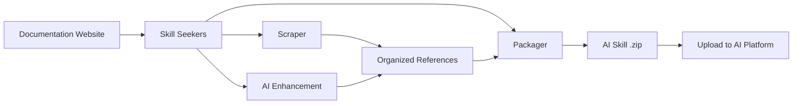

# ⚡ [QUANT-SOURCE-194] Consolidated Quant & Algo Trading Repositories
**Category**: `EVENT_DRIVEN_BACKTESTERS` | **Repositories in this Source**: 3
**Generated**: QUANT_BUNDLE_194_EVENT_DRIVEN_BACKTESTERS.md | **Target**: NotebookLM 290+ Quant Code Brain

---

## [1/3] Repository: financial-engineering-vault (`WHEEL_financial-engineering-vault`)
- **Full Name**: `financial-engineering-vault`
- **Description**: 
- **GitHub Stars**: 0
- **Source Pool**: `cloned_trading_wheels`

### Documentation & Overview (README.md)
<p align="center">
  
</p>

# Skill Seekers

English | [简体中文](README.zh-CN.md) | [日本語](README.ja.md) | [한국어](README.ko.md) | [Español](README.es.md) | [Français](README.fr.md) | [Deutsch](README.de.md) | [Português](README.pt-BR.md) | [Türkçe](README.tr.md) | [العربية](README.ar.md) | [हिन्दी](README.hi.md) | [Русский](README.ru.md)

[](https://github.com/yusufkaraaslan/Skill_Seekers/releases)
[](https://opensource.org/licenses/MIT)
[](https://www.python.org/downloads/)
[](https://modelcontextprotocol.io)
[](tests/)
[](https://pypi.org/project/skill-seekers/)
[](https://pypi.org/project/skill-seekers/)
[](https://skillseekersweb.com/)
[](https://github.com/yusufkaraaslan/Skill_Seekers)
[](https://pepy.tech/projects/skill-seekers)

<a href="https://trendshift.io/repositories/18329" target="_blank"></a>

**🧠 The data layer for AI systems.** Skill Seekers turns documentation sites, GitHub repos, PDFs, videos, notebooks, wikis, and more — **18 source types** — into structured knowledge assets, ready to power AI Skills (Claude, Gemini, OpenAI), RAG pipelines (LangChain, LlamaIndex, Pinecone), and AI coding assistants (Cursor, Windsurf, Cline). Prepare once, export to **22 targets**.

## 💛 Sponsors

<!-- SPONSORS:START -->
### Launch Partner

<p align="center">
  <a href="https://www.atlascloud.ai/"></a><br/><sub><b>Launch Partner</b></sub>
</p>

[Atlas Cloud](https://www.atlascloud.ai/) — A full-modal, OpenAI-compatible AI inference platform. Skill Seekers supports it as a packaging/enhancement target via `--target atlas` with `ATLAS_API_KEY`.

### Silver Sponsors

<p align="center">
  <a href="https://www.rapidproxy.io/?utm_source=skillseekers&utm_medium=sponsor"></a><br/><sub><b>Sponsor — Silver</b></sub>
</p>
<!-- SPONSORS:END -->

**[Become a sponsor](SPONSORSHIP.md)** · [GitHub Sponsors](https://github.com/sponsors/yusufkaraaslan)

---

## 🚀 Quick Start

```bash
# 1. Install
pip install skill-seekers

# 2. Create a skill from any source
skill-seekers create https://docs.djangoproject.com/

# 3. Package it for your AI platform
skill-seekers package output/django --target claude
```

You now have `output/django-claude.zip`, ready to use.

```bash
# Pick a different AI agent for enhancement (default: claude)
skill-seekers create https://docs.djangoproject.com/ --agent kimi
skill-seekers create https://docs.djangoproject.com/ --agent-cmd "my-custom-agent run"
```

### 🛰️ AI-driven project scan

Point `scan` at a project and an AI agent reads its manifests, README, Dockerfile/CI and sampled source imports — then emits one config per detected framework, plus a `<project>-codebase.json` for your own code:

```bash
skill-seekers scan ./my-react-app --out ./configs/scanned/
# → react.json, vite.json, tailwind.json, jest.json, my-react-app-codebase.json

skill-seekers create ./configs/scanned/react.json
```

If a detection has no existing preset, the AI generates a fresh config; on exit you can optionally publish it back to the [community registry](https://github.com/yusufkaraaslan/skill-seekers-configs).

### All 18 source types

```bash
skill-seekers create facebook/react            # GitHub repository
skill-seekers create ./my-project              # Local codebase
skill-seekers create manual.pdf                # PDF
skill-seekers create report.docx               # Word
skill-seekers create book.epub                 # EPUB
skill-seekers create notebook.ipynb            # Jupyter
skill-seekers create openapi.yaml              # OpenAPI/Swagger
skill-seekers create presentation.pptx         # PowerPoint
skill-seekers create guide.adoc                # AsciiDoc
skill-seekers create page.html                 # Local HTML (or a whole dir)
skill-seekers create feed.rss                  # RSS/Atom
skill-seekers create curl.1                    # Man page

# Video (YouTube, Vimeo, or local — needs skill-seekers[video])
skill-seekers create --video-url https://www.youtube.com/watch?v=... --name mytutorial
skill-seekers create --setup                   # auto-install GPU-aware visual deps

skill-seekers create --space-key TEAM --name wiki               # Confluence
skill-seekers create --database-id ... --name docs              # Notion
skill-seekers create --chat-export-path ./slack-export --name team-chat  # Slack/Discord
```

See the [Scraping Guide](docs/user-guide/02-scraping.md) for every source type and its options.

---

## 📦 Installation

```bash
pip install skill-seekers              # Core: scraping, GitHub, PDF, packaging
pip install skill-seekers[all-llms]    # + every LLM platform
pip install skill-seekers[mcp]         # + MCP server
pip install skill-seekers[all]         # Everything
```

**Not sure what you need?** Run the wizard: `skill-seekers-setup`

<details>
<summary><b>All installation extras</b></summary>

| Install | Adds |
|---------|------|
| `skill-seekers[gemini]` | Google Gemini support |
| `skill-seekers[openai]` | OpenAI ChatGPT support |
| `skill-seekers[all-llms]` | All LLM platforms |
| `skill-seekers[mcp]` | MCP server for Claude Code, Cursor, etc. |
| `skill-seekers[video]` | YouTube/Vimeo transcript & metadata extraction |
| `skill-seekers[video-full]` | + Whisper transcription & visual frame extraction |
| `skill-seekers[jupyter]` | Jupyter Notebook support |
| `skill-seekers[pptx]` | PowerPoint support |
| `skill-seekers[confluence]` | Confluence wiki support |
| `skill-seekers[notion]` | Notion pages support |
| `skill-seekers[rss]` | RSS/Atom feed support |
| `skill-seekers[chat]` | Slack/Discord chat export support |
| `skill-seekers[asciidoc]` | AsciiDoc support |
| `skill-seekers[all]` | Everything |

> **Video visual deps (GPU-aware):** after installing `skill-seekers[video-full]`, run `skill-seekers create --setup` to auto-detect your GPU and install the matching PyTorch variant + easyocr.

</details>

**Prerequisites:** Python 3.10+, Git. New here? → **[Bulletproof Quick Start](docs/getting-started/BULLETPROOF_QUICKSTART.md)** 🎯

---

## 📚 Documentation

| I want to... | Read this |
|--------------|-----------|
| **Get started quickly** | [Quick Start](docs/getting-started/02-quick-start.md) — 3 commands to your first skill |
| **Understand the concepts** | [Core Concepts](docs/user-guide/01-core-concepts.md) |
| **Scrape sources** | [Scraping Guide](docs/user-guide/02-scraping.md) — all 18 source types |
| **Enhance skills with AI** | [Enhancement Guide](docs/user-guide/03-enhancement.md) · [Enhancement Modes](docs/features/ENHANCEMENT_MODES.md) |
| **Export skills** | [Packaging Guide](docs/user-guide/04-packaging.md) |
| **Build workflows** | [Workflows](docs/user-guide/05-workflows.md) |
| **Look up a command** | [CLI Reference](docs/reference/CLI_REFERENCE.md) — all 19 commands |
| **Configure** | [Config Format](docs/reference/CONFIG_FORMAT.md) · [Environment Variables](docs/reference/ENVIRONMENT_VARIABLES.md) |
| **Set up MCP** | [MCP Setup](docs/guides/MCP_SETUP.md) · [MCP Reference](docs/reference/MCP_REFERENCE.md) |
| **Integrate with RAG / IDEs** | [LangChain](docs/integrations/LANGCHAIN.md) · [RAG Pipelines](docs/integrations/RAG_PIPELINES.md) · [Cursor](docs/integrations/CURSOR.md) · [Windsurf](docs/integrations/WINDSURF.md) · [Cline](docs/integrations/CLINE.md) |
| **Handle huge doc sets** | [Large Documentation](docs/reference/LARGE_DOCUMENTATION.md) — 10K–40K+ pages |
| **Understand the architecture** | [UML Architecture](docs/UML_ARCHITECTURE.md) — 14 diagrams |
| **Fix a problem** | [Troubleshooting](docs/user-guide/06-troubleshooting.md) |

**Complete documentation index:** [docs/README.md](docs/README.md)

---

## 🎯 What you get

| Use case | Output | Powers |
|----------|--------|--------|
| **AI Skills** | Comprehensive `SKILL.md` + reference files | Claude Code, Gemini, GPT |
| **RAG pipelines** | Chunked documents with rich metadata | LangChain, LlamaIndex, Haystack |
| **Vector databases** | Pre-formatted data ready for upsert | Pinecone, Chroma, Weaviate, FAISS, Qdrant |
| **AI coding assistants** | Context files your IDE AI reads automatically | Cursor, Windsurf, Cline, Continue.dev |

### Export targets (22)

```bash
skill-seekers package output/react --target claude      # → Claude Skill (ZIP + YAML)
skill-seekers package output/react --target langchain   # → LangChain Documents
skill-seekers package output/react --target llama-index # → LlamaIndex TextNodes
skill-seekers package output/react --target ibm-bob     # → IBM Bob skill directory
```

**LLM platforms (12):** `claude` · `gemini` · `openai` · `minimax` · `opencode` · `kimi` · `deepseek` · `qwen` · `openrouter` · `together` · `fireworks` · `markdown`
**RAG & vector (8):** `langchain` · `llama-index` · `haystack` · `chroma` · `faiss` · `weaviate` · `qdrant` · `pinecone`
**Other (2):** `atlas` · `ibm-bob`

See the [Feature Matrix](docs/reference/FEATURE_MATRIX.md) for per-platform support details.

### Why it matters

- ⚡ **99% faster** — days of manual data prep → 15–45 minutes
- 🎯 **Real skill quality** — 500+ line `SKILL.md` files with examples, patterns, and guides
- 📊 **RAG-ready chunks** — smart chunking preserves code blocks and context
- 🔄 **Multi-source** — combine docs + GitHub + PDFs + videos into one knowledge asset
- 🌐 **One prep, every target** — export to 22 targets without re-scraping
- ✅ **Battle-tested** — 3,900+ tests, 68 workflow presets, production-ready

---

## ✨ Key capabilities

<details>
<summary><b>Documentation scraping</b> — SPA discovery, llms.txt, smart categorization</summary>

Three-layer discovery for JavaScript SPA sites (`sitemap.xml` → `llms.txt` → headless browser rendering), automatic `llms.txt` detection (10× faster when present), smart topic categorization, and a lenient HTML parser fallback so broken markup still scrapes.

→ [Scraping Guide](docs/user-guide/02-scraping.md) · [llms.txt Support](docs/reference/LLMS_TXT_SUPPORT.md)
</details>

<details>
<summary><b>GitHub & codebase analysis (C3.x)</b> — AST parsing, pattern detection, how-to guides</summary>

Three-stream architecture: code analysis (AST, design patterns, tests), documentation (README, `docs/`, wiki), and community (issues, PRs, metadata). The C3.x pipeline adds 10 GoF pattern detectors across 9 languages, usage examples extracted from tests, AI-written how-to guides, config extraction, and architecture overviews.

```bash
skill-seekers create ./my-project --preset quick          # 1–2 min, surface level
skill-seekers create ./my-project --preset standard       # balanced (default)
skill-seekers create ./my-project --preset comprehensive  # deep, exhaustive
```

→ [Pattern Detection](docs/features/PATTERN_DETECTION.md) · [How-To Guides](docs/features/HOW_TO_GUIDES.md) · [Test Example Extraction](docs/features/TEST_EXAMPLE_EXTRACTION.md)
</details>

<details>
<summary><b>AI enhancement</b> — API or local agents, 68 workflow presets</summary>

Every AI call runs through one transport, in **API mode** (Anthropic, Google Gemini, OpenAI, Moonshot/Kimi, MiniMax) or **LOCAL mode** (Claude Code, Kimi Code, Codex, Copilot, OpenCode, custom agents — no API costs). Control depth with `--enhance-level 0-3` and pick an agent with `--agent`.

→ [Enhancement Guide](docs/user-guide/03-enhancement.md) · [Enhancement Modes](docs/features/ENHANCEMENT_MODES.md) · [Multi-Agent Setup](docs/guides/MULTI_AGENT_SETUP.md)
</details>

<details>
<summary><b>Unified multi-source scraping</b> — combine many sources into one skill</summary>

One config can pull documentation, GitHub, PDFs, videos, and more into a single knowledge asset, with conflict detection and pairwise synthesis across sources.

→ [Unified Scraping](docs/features/UNIFIED_SCRAPING.md)
</details>

<details>
<summary><b>Video extraction</b> — transcripts, frames, on-screen code</summary>

YouTube, Vimeo, and local files. Three-tier transcript fallback (subtitles → YouTube transcript API → local Whisper), plus optional visual extraction that OCRs on-screen code from sampled frames.

→ [Video Guide](docs/VIDEO_GUIDE.md)
</details>

<details>
<summary><b>Quality, sync & scale</b></summary>

Quality scoring with a gate (`skill-seekers quality output/react/ --threshold 7`), provisional English readability metrics (informational — they never affect the score), doc-change detection with scheduled re-scrapes and notifications, streaming ingestion for very large doc sets, and incremental updates.

→ [Large Documentation](docs/reference/LARGE_DOCUMENTATION.md) · [Code Quality](docs/reference/CODE_QUALITY.md)
</details>

---

## 🔌 MCP Integration (40 tools)

Skill Seekers ships an MCP server for Claude Code, Cursor, Windsurf, VS Code + Cline, and IntelliJ IDEA.

```bash
# stdio mode (Claude Code, VS Code + Cline)
python -m skill_seekers.mcp.server_fastmcp

# HTTP mode (Cursor, Windsurf, IntelliJ)
python -m skill_seekers.mcp.server_fastmcp --transport http --port 8765
```

Then just ask your assistant: *"Package and upload the React skill."*

→ [MCP Setup](docs/guides/MCP_SETUP.md) · [MCP Reference](docs/reference/MCP_REFERENCE.md) · [HTTP Transport](docs/guides/HTTP_TRANSPORT.md)

---

## 🤖 Installing to AI agents

Skills install automatically into **19 AI coding agents**:

```bash
skill-seekers install-agent output/react/ --agent cursor
skill-seekers install-agent output/react/ --agent all      # every detected agent
skill-seekers install-agent output/react/ --agent cursor --dry-run
```

| Agent | Path | Scope |
|-------|------|-------|
| Claude Code | `~/.claude/skills/` | Global |
| Cursor | `.cursor/skills/` | Project |
| VS Code / Copilot | `.github/skills/` | Project |
| Amp | `~/.amp/skills/` | Global |
| Goose | `~/.config/goose/skills/` | Global |
| OpenCode | `~/.opencode/skills/` | Global |
| Letta | `~/.letta/skills/` | Global |
| Aide | `~/.aide/skills/` | Global |
| Windsurf | `~/.windsurf/skills/` | Global |
| Neovate | `~/.neovate/skills/` | Global |
| Roo Code | `.roo/skills/` | Project |
| Cline | `.cline/skills/` | Project |
| Aider | `~/.aider/skills/` | Global |
| Bolt | `.bolt/skills/` | Project |
| Kilo Code | `.kilo/skills/` | Project |
| Continue | `~/.continue/skills/` | Global |
| Kimi Code | `~/.kimi/skills/` | Global |
| IBM Bob | `.bob/skills/` | Project |

### Uploading to Claude

```bash
export ANTHROPIC_API_KEY=sk-ant-...
skill-seekers package output/react/ --upload   # package + upload
skill-seekers upload output/react.zip          # upload an existing zip
```

No API key? Package it and upload `output/react.zip` manually at [claude.ai/skills](https://claude.ai/skills).

→ [Upload Guide](docs/guides/UPLOAD_GUIDE.md)

---

## ⚙️ How it works



1. **Scrape** — extract every page (checking `llms.txt` first)
2. **Categorize** — organize content into topics (API, guides, tutorials, …)
3. **Enhance** — AI writes a comprehensive `SKILL.md` with examples
4. **Package** — bundle into a platform-ready artifact
5. **Upload** — ship it to your AI platform (optional)

### Architecture

**8 core modules + 5 utility modules** (~200 classes):

| Module | Purpose |
|--------|---------|
| **CLICore** | Git-style command dispatcher, source auto-detection |
| **Scrapers** | 18 source-type extractors on a shared build layer |
| **Adaptors** | 22 output platform formats behind one `SkillAdaptor` ABC |
| **Analysis** | C3.x codebase pipeline, 10 GoF pattern detectors |
| **Enhancement** | AI improvement via a single `AgentClient` transport |
| **Packaging** | Package, upload, and install skills |
| **MCP** | FastMCP server (40 tools, 10 tool modules) |
| **Sync** | Doc change detection and notification |

→ [UML Architecture](docs/UML_ARCHITECTURE.md) · [API Reference](docs/reference/API_REFERENCE.md) · [Skill Architecture](docs/reference/SKILL_ARCHITECTURE.md)

---

## 🆕 New in v3.9.0

- **HTML parser fallback for broken markup** (#96) — severely malformed pages no longer scrape as empty; well-formed pages are byte-identical.
- **Transient-failure retries** — the doc scraper (#97) and MCP `fetch_config` (#92) now retry connection blips and 5xx with backoff; 4xx still fails fast.
- **Whisper transcription fallback** (#420) — local videos without subtitles finally get a real transcript.
- **MiniMax image OCR + registry-driven multimodal providers** (#423) — providers declare their wire protocol and image capability; China-issued keys work against the right endpoint.
- **Token-lean GitHub issue defaults** (#169) — GitHub skills no longer bundle full closed-issue history by default.
- **Env-driven CORS across all three servers** (#422, #424) — no more wildcard origins with credentials.

Full history: **[CHANGELOG.md](CHANGELOG.md)**

---

## 📈 Performance

| Documentation size | Time | Output |
|---|---|---|
| Small (< 100 pages) | 5–10 min | ~2 MB |
| Medium (100–500 pages) | 15–30 min | ~10 MB |
| Large (500–2,000 pages) | 30–60 min | ~40 MB |
| Huge (10K–40K+ pages) | Use `stream` | See [Large Documentation](docs/reference/LARGE_DOCUMENTATION.md) |

---

## 🐛 Troubleshooting

```bash
skill-seekers doctor          # diagnose installation & environment
skill-seekers sync-config     # detect config drift
```

Common issues and fixes: **[Troubleshooting Guide](docs/user-guide/06-troubleshooting.md)** · [TROUBLESHOOTING.md](docs/TROUBLESHOOTING.md)

---

## 🤝 Contributing

Contributions are welcome — see **[CONTRIBUTING.md](CONTRIBUTING.md)**.

- 📋 **[Development Roadmap & Tasks](https://github.com/users/yusufkaraaslan/projects/2)** — pick any task
- 💬 **[Discussions](https://github.com/yusufkaraaslan/Skill_Seekers/discussions)** — questions and ideas
- 🐛 **[Issues](https://github.com/yusufkaraaslan/Skill_Seekers/issues)** — bugs and feature requests

---

## 📝 License

MIT — see [LICENSE](LICENSE).

## 🔒 Security

[](https://mseep.ai/app/yusufkaraaslan-skill-seekers)

---

## 🌐 Ecosystem

Skill Seekers is a multi-repo project:

| Repository | Description | Links |
|-----------|-------------|-------|
| **[Skill_Seekers](https://github.com/yusufkaraaslan/Skill_Seekers)** | Core CLI & MCP server (this repo) | [PyPI](https://pypi.org/project/skill-seekers/) |
| **[skillseekersweb](https://github.com/yusufkaraaslan/skillseekersweb)** | Website & documentation | [Live](https://skillseekersweb.com/) |
| **[skill-seekers-configs](https://github.com/yusufkaraaslan/skill-seekers-configs)** | Community config repository | |
| **[skill-seekers-action](https://github.com/yusufkaraaslan/skill-seekers-action)** | GitHub Action for CI/CD | |
| **[skill-seekers-plugin](https://github.com/yusufkaraaslan/skill-seekers-plugin)** | Claude Code plugin | |
| **[homebrew-skill-seekers](https://github.com/yusufkaraaslan/homebrew-skill-seekers)** | Homebrew tap for macOS | |

> **Want to contribute?** The website and configs repos are great starting points for new contributors!

### Core Implementation Code & Architecture
#### File: `tests/test_adaptors/__init__.py`
```python
# Adaptor tests package
```

#### File: `tests/__init__.py`
```python
# Test package for Skill Seeker
```

#### File: `src/skill_seekers/workflows/__init__.py`
```python
"""Bundled default enhancement workflow presets."""
```

#### File: `.vscode/settings.json`
```python
{
    "python-envs.defaultEnvManager": "ms-python.python:system",
    "python-envs.pythonProjects": []
}
```

#### File: `api/__init__.py`
```python
"""
Skill Seekers Config API
FastAPI backend for discovering and downloading config files
"""

__version__ = "1.0.0"
```

#### File: `example-mcp-config.json`
```python
{
  "mcpServers": {
    "skill-seeker": {
      "type": "stdio",
      "command": "/path/to/your/Skill_Seekers/.venv/bin/python3",
      "args": [
        "-m",
        "skill_seekers.mcp.server_fastmcp"
      ],
      "cwd": "/path/to/your/Skill_Seekers",
      "env": {}
    }
  }
}
```


==================================================


## [2/3] Repository: trader (`WHEEL_nautilus_trader`)
- **Full Name**: `nautilus_trader`
- **Description**: 
- **GitHub Stars**: 0
- **Source Pool**: `cloned_trading_wheels`

### Documentation & Overview (README.md)
# 

[](https://crates.io/crates/nautilus-core)
[](https://crates.io/crates/nautilus-core)
[](https://codspeed.io/nautechsystems/nautilus_trader)


[](https://pepy.tech/projects/nautilus-trader)
[](https://discord.gg/NautilusTrader)

| Branch    | Version                                                                                                                                                                                                                     | Status                                                                                                                                                                                            |
| :-------- | :-------------------------------------------------------------------------------------------------------------------------------------------------------------------------------------------------------------------------- | :------------------------------------------------------------------------------------------------------------------------------------------------------------------------------------------------ |
| `master`  | [](https://packages.nautechsystems.io/simple/nautilus-trader/index.html)  | [](https://github.com/nautechsystems/nautilus_trader/actions/workflows/build.yml)  |
| `nightly` | [](https://packages.nautechsystems.io/simple/nautilus-trader/index.html) | [](https://github.com/nautechsystems/nautilus_trader/actions/workflows/build.yml) |
| `develop` | [](https://packages.nautechsystems.io/simple/nautilus-trader/index.html) | [](https://github.com/nautechsystems/nautilus_trader/actions/workflows/build.yml) |

| Platform           | Rust   | Python    |
| :----------------- | :----- | :-------- |
| `Linux (x86_64)`   | 1.98.1 | 3.12-3.14 |
| `Linux (ARM64)`    | 1.98.1 | 3.12-3.14 |
| `macOS (ARM64)`    | 1.98.1 | 3.12-3.14 |
| `Windows (x86_64)` | 1.98.1 | 3.12-3.14 |

- **Docs**: <https://nautilustrader.io/docs/>
- **Website**: <https://nautilustrader.io>
- **Support**: [support@nautilustrader.io](mailto:support@nautilustrader.io)

## Introduction

NautilusTrader is an open-source, production-grade, Rust-native engine for multi-asset,
multi-venue trading systems.

The system spans research, deterministic simulation, and live execution within a single
event-driven architecture, with Python serving as the control plane for strategy logic,
configuration, and orchestration.

This separation provides the performance and safety of a compiled trading engine with
the flexibility of Python for system composition and strategy development.
Trading systems can also be written entirely in Rust for mission-critical workloads.

The same strategy and execution-algorithm code can run across backtest and live systems, reducing
deployment divergence. Live execution still introduces venue, transport, timing, persistence,
external-activity, and reconciliation behavior that a simulation may not reproduce. See
[Backtest and live differences](docs/concepts/live.md#backtest-and-live-differences).

NautilusTrader is asset-class-agnostic. Any venue with a REST API or WebSocket feed can be
integrated through modular adapters. Current integrations span crypto exchanges (CEX and
DEX), traditional markets (FX, equities, futures, options), and betting exchanges.


## Features

- **Fast**: Rust core with the [mimalloc](https://crates.io/crates/mimalloc) allocator and asynchronous networking using [tokio](https://crates.io/crates/tokio).
- **Reliable**: Type- and thread-safety backed by Rust, with optional Redis-backed state persistence.
- **Portable**: Runs on Linux, macOS, and Windows. Deploy using Docker.
- **Flexible**: Modular adapters integrate any REST API or WebSocket feed.
- **Advanced**: Time in force `IOC`, `FOK`, `GTC`, `GTD`, `DAY`, `AT_THE_OPEN`, `AT_THE_CLOSE`, advanced order types and conditional triggers. Execution instructions `post-only`, `reduce-only`, and icebergs. Contingency orders including `OCO`, `OUO`, `OTO`.
- **Customizable**: User-defined components, or assemble entire systems from scratch using the [cache](https://nautilustrader.io/docs/latest/concepts/cache) and [message bus](https://nautilustrader.io/docs/latest/concepts/message_bus).
- **Backtesting**: Multiple venues, instruments, and strategies simultaneously using historical quote tick, trade tick, bar, order book, and custom data with nanosecond resolution.
- **Live**: Identical strategy implementations between research and live deployment.
- **Multi-venue**: Run market-making and cross-venue strategies across multiple venues simultaneously.
- **AI Training**: Engine fast enough to train AI trading agents (RL/ES).


> *nautilus - from ancient Greek 'sailor' and naus 'ship'.*
>
> *The nautilus shell consists of modular chambers with a growth factor which approximates a logarithmic spiral.
> The idea is that this can be translated to the aesthetics of design and architecture.*

## Why NautilusTrader?

Trading strategy research is often conducted in Python using vectorized approaches, while
production trading systems are implemented separately using event-driven architectures in
compiled languages.

NautilusTrader removes this separation.

A Rust-native core provides a deterministic event-driven runtime for both research and live
execution, while Python serves as the control plane. The same architecture, execution
semantics, and time model operate across both environments, allowing strategies to move
from research to production without reimplementation.

Python bindings are provided via [PyO3](https://pyo3.rs) for the Rust-native v2 runtime.
During the v2 transition, v1 receives only critical security backports on the `develop_v1` branch.
See the [v2 migration guide](https://github.com/nautechsystems/nautilus_trader/blob/develop/MIGRATION_V2.md) for migration steps and compatibility details.
No Rust toolchain is required to install prebuilt wheels.

This project makes the [Soundness Pledge](https://raphlinus.github.io/rust/2020/01/18/soundness-pledge.html):

> "The intent of this project is to be free of soundness bugs.
> The developers will do their best to avoid them, and welcome help in analyzing and fixing them."

> [!NOTE]
>
> **MSRV:** NautilusTrader relies heavily on improvements in the Rust language and compiler.
> As a result, the Minimum Supported Rust Version (MSRV) is generally equal to the latest stable release of Rust.

## Integrations

NautilusTrader is modularly designed to work with *adapters*, enabling connectivity to trading venues
and data providers by translating their raw APIs into a unified interface and normalized domain model.

The following integrations are currently supported; see [docs/integrations/](https://nautilustrader.io/docs/latest/integrations/) for details:

| Name                                                       | ID                    | Type                    | Status                                               | Docs                                              |
| :--------------------------------------------------------- | :-------------------- | :---------------------- | :--------------------------------------------------- | :------------------------------------------------ |
| [AX Exchange](https://architect.exchange)                  | `AX`                  | Perpetuals Exchange     |  | [Guide](docs/integrations/architect_ax.md)        |
| [Betfair](https://betfair.com)                             | `BETFAIR`             | Sports Betting Exchange |  | [Guide](docs/integrations/betfair.md)             |
| [Binance](https://binance.com)                             | `BINANCE`             | Crypto Exchange (CEX)   |  | [Guide](docs/integrations/binance.md)             |
| [BitMEX](https://www.bitmex.com)                           | `BITMEX`              | Crypto Exchange (CEX)   |  | [Guide](docs/integrations/bitmex.md)              |
| [Bybit](https://www.bybit.com)                             | `BYBIT`               | Crypto Exchange (CEX)   |  | [Guide](docs/integrations/bybit.md)               |
| [Coinbase](https://coinbase.com)                           | `COINBASE`            | Crypto Exchange (CEX)   |  | [Guide](docs/integrations/coinbase.md)            |
| [Databento](https://databento.com)                         | `DATABENTO`           | Data Provider           |  | [Guide](docs/integrations/databento.md)           |
| [Deribit](https://www.deribit.com)                         | `DERIBIT`             | Crypto Exchange (CEX)   |  | [Guide](docs/integrations/deribit.md)             |
| [Derive](https://www.derive.xyz)                           | `DERIVE`              | Crypto Exchange (DEX)   |  | [Guide](docs/integrations/derive.md)              |
| [dYdX](https://dydx.trade)                                 | `DYDX`                | Crypto Exchange (DEX)   |  | [Guide](docs/integrations/dydx.md)                |
| [Hyperliquid](https://hyperliquid.xyz)                     | `HYPERLIQUID`         | Crypto Exchange (DEX)   |  | [Guide](docs/integrations/hyperliquid.md)         |
| [Interactive Brokers](https://www.interactivebrokers.com)  | `INTERACTIVE_BROKERS` | Brokerage (multi-venue) |  | [Guide](docs/integrations/interactive_brokers.md) |
| [Kraken](https://kraken.com)                               | `KRAKEN`              | Crypto Exchange (CEX)   |  | [Guide](docs/integrations/kraken.md)              |
| [Lighter](https://lighter.xyz)                             | `LIGHTER`             | Crypto Exchange (DEX)   |  | [Guide](docs/integrations/lighter.md)             |
| [Lighter on Robinhood](https://robinhoodchain.lighter.xyz) | `LIGHTER_ROBINHOOD`   | Crypto Exchange (DEX)   |  | [Guide](docs/integrations/lighter.md)             |
| [OKX](https://okx.com)                                     | `OKX`                 | Crypto Exchange (CEX)   |  | [Guide](docs/integrations/okx.md)                 |
| [Polymarket](https://polymarket.com)                       | `POLYMARKET`          | Prediction Market (DEX) |  | [Guide](docs/integrations/polymarket.md)          |
| [Tardis](https://tardis.dev)                               | `TARDIS`              | Crypto Data Provider    |  | [Guide](docs/integrations/tardis.md)              |

- **ID**: The default client ID for the integrations adapter clients.
- **Type**: The type of integration (often the venue type).

For Lighter on Robinhood, `LIGHTER_ROBINHOOD` is the venue and explicit client ID to register. The
shared Lighter factory keeps `LIGHTER` as its compatibility default.

### Status

- `planned`: Planned for future development.
- `building`: Under construction and likely not in a usable state.
- `beta`: Completed to a minimally working state and in a beta testing phase.
- `stable`: Stabilized feature set and API, the integration has been tested by both developers and users to a reasonable level (some bugs may still remain).

See the [Integrations](https://nautilustrader.io/docs/latest/integrations/) documentation for further details.

## Roadmap

The [Roadmap](https://github.com/nautechsystems/nautilus_trader/blob/develop/ROADMAP.md) outlines NautilusTrader's strategic direction.
Current priorities include stabilizing the Rust-native core, improving documentation, and enhancing code ergonomics.

The open-source project focuses on single-node backtesting and live trading for individual and small-team quantitative traders.
UI dashboards, distributed orchestration, and built-in AI/ML tooling are out of scope to maintain focus on the core engine and ecosystem sustainability.

New integration proposals should start with an RFC issue to discuss suitability before submitting a PR.
See [Community-contributed integrations](https://github.com/nautechsystems/nautilus_trader/blob/develop/ROADMAP.md#community-contributed-integrations) for guidelines.

## Security

[](https://scorecard.dev/viewer/?uri=github.com/nautechsystems/nautilus_trader)

Security is a priority for the NautilusTrader project, and we value the work of those who help
identify and resolve vulnerabilities. We apply layered controls across the development and release
lifecycle, with signed releases, continuous vulnerability management, and transparent development
practices:

- **Source and review controls**: CODEOWNERS gate critical infrastructure, dependency manifests, and
  lock files; protected branches require signed commits and passing CI; release tags are immutable;
  and Rust dependencies are sourced only from crates.io.
- **Dependency intake**: lock files pin every dependency with cryptographic checksums, third-party
  Python packages install from wheels only, new dependency and tooling versions observe a
  publication cooldown before adoption, cargo-vet audits Rust provenance, and cargo-deny checks Rust
  dependencies against an allow list of licenses compatible with NautilusTrader's `LGPL-3.0-only`
  license.
- **Scanning and fuzzing**: Gitleaks secret screening and Zizmor Actions auditing run pre-commit;
  CodeQL runs on PRs to `master` and pushes to `nightly`; cargo-audit, cargo-deny, cargo-vet,
  OSV Scanner, and pip-audit run on audit-relevant PRs and daily schedules; cargo-fuzz targets cover
  selected adapter and signing surfaces.
- **Build and release integrity**: GitHub Actions are pinned to commit SHAs, CI runners are hardened
  with egress allow-listing, Python artifacts carry SLSA build provenance, container images are
  Sigstore-signed with attested SPDX SBOMs, and PyPI and crates.io publishing uses OIDC Trusted
  Publishing gated to a protected `release` environment that never runs pull request or fork code.
- **Runtime cryptography**: TLS and most runtime cryptography use
  [aws-lc-rs](https://github.com/aws/aws-lc-rs), the Rust binding for AWS-LC, with Ed25519 signing
  via [ed25519-dalek](https://github.com/dalek-cryptography/curve25519-dalek).

The OpenSSF Scorecard badge above is one automated repository-health signal; it complements manual
review, CI hardening, and security audits rather than replacing them.

### Reporting a vulnerability

Report privately through
[GitHub Security Advisories](https://github.com/nautechsystems/nautilus_trader/security/advisories/new),
or email <security@nautechsystems.io> (PGP key available on request). We acknowledge reports within
48 hours and patch critical vulnerabilities within 30 days.

A careful vulnerability report takes real time and effort. We appreciate that, and unless you prefer
to remain anonymous, we credit reporters in the relevant security advisory and release notes.

The [Security Policy](SECURITY.md) details scope, coordinated disclosure, and step-by-step release
verification. The [Security Architecture](docs/developer_guide/security.md)
describes the release supply chain end-to-end. For the full policies, see the
[Responsible Disclosure](https://nautilustrader.io/security/responsible-disclosure/) and
[Supply Chain Security](https://nautilustrader.io/security/supply-chain/) policies; CI/CD security is
documented in [.github/OVERVIEW.md](.github/OVERVIEW.md#security).

## Versioning and releases

> [!WARNING]
>
> **NautilusTrader is still under active development**. Some features may be incomplete, and while
> the API is becoming more stable, breaking changes can occur between releases.
> We strive to document these changes in the release notes on a **best-effort basis**.

We aim to follow a **bi-weekly release schedule**, though experimental or larger features may cause delays.

### Branches

We aim to maintain a stable, passing build across all branches.

- `master`: Reflects the source code for the latest released version; recommended for production use.
- `nightly`: Daily snapshots of the `develop` branch for early testing; merged at **14:00 UTC** and as required.
- `develop`: Active development branch for contributors and feature work.

> [!NOTE]
>
> The v2 release-candidate line is the transition toward a **stable API for version 2.x**.
> Once this milestone is reached, we plan to implement a formal deprecation process for any API changes.
> This approach allows us to maintain a rapid development pace for now.

## Precision mode

NautilusTrader supports two precision modes for its core value types (`Price`, `Quantity`, `Money`),
which differ in their internal bit-width and maximum decimal precision.

- **High-precision**: 128-bit integers with up to 16 decimals of precision, and a larger value range.
- **Standard-precision**: 64-bit integers with up to 9 decimals of precision, and a smaller value range.

> [!NOTE]
>
> By default, the official Python wheels ship in high-precision (128-bit) mode on all supported platforms.
>
> For pure Rust crates, high-precision works on all platforms (including Windows) since Rust handles
> `i128`/`u128` via software emulation. The default is standard-precision unless you explicitly enable
> the `high-precision` feature flag.

See the [Installation Guide](https://nautilustrader.io/docs/latest/getting_started/installation) for further details.

**Rust feature flag**: To enable high-precision mode in Rust, add the `high-precision` feature to your Cargo.toml:

```toml
[dependencies]
nautilus_model = { version = "*", features = ["high-precision"] }
```

## Installation

We recommend using the latest supported version of Python and installing [nautilus_trader](https://pypi.org/project/nautilus_trader/) inside a virtual environment to isolate dependencies.

**There are two supported ways to install**:

1. Pre-built binary wheel from PyPI *or* the Nautech Systems package index.
2. Build from source.

> [!TIP]
>
> We highly recommend installing using the [uv](https://docs.astral.sh/uv) package manager with a "vanilla" CPython.
>
> Conda and other Python distributions *may* work but aren't officially supported.

### From PyPI

This repository and the [documentation](https://nautilustrader.io/docs/latest) cover v2. To install
the v2 release-candidate wheels from PyPI using Python's pip package manager:

```bash
pip install -U nautilus_trader --pre
```

The v2 release-candidate wheels use `2.0.0rcN` versions and are intended for community testing
before the final `2.0.0` release. We do not recommend using release candidates in production
environments, such as live trading controlling real capital.

The `--pre` flag is required until `2.0.0` is released. Without it, pip installs the latest stable
v1 wheel, whose Python API differs from the v2 documentation:

```bash
# Installs the latest stable v1 wheel, which cannot run the v2 documentation
pip install -U nautilus_trader
```

Install optional dependencies for interactive tearsheets and charts with the `visualization` extra:

```bash
pip install -U "nautilus_trader[visualization]" --pre
```

See the [Installation Guide](https://nautilustrader.io/docs/latest/getting_started/installation#extras) for details.

### From the Nautech Systems package index

The Nautech Systems package index (`packages.nautechsystems.io`) complies with [PEP-503](https://peps.python.org/pep-0503/) and hosts both stable and development binary wheels for `nautilus_trader`.
This enables users to install either the latest stable release or pre-release versions for testing.

#### Stable wheels

Stable wheels correspond to official releases of `nautilus_trader` on PyPI, and use standard versioning.

To install the latest stable release:

```bash
pip install -U nautilus_trader --index-url=https://packages.nautechsystems.io/simple
```

> [!TIP]
>
> Use `--extra-index-url` instead of `--index-url` if you want pip to fall back to PyPI automatically.

#### Development wheels

The main package index publishes v2 development wheels from both the `nightly` and `develop`
branches, allowing users to test features and fixes ahead of stable releases.

This process also helps preserve compute resources and provides easy access to the exact binaries tested in CI pipelines,
while adhering to [PEP-440](https://peps.python.org/pep-0440/) versioning standards:

- `develop` wheels use the version suffix `.devYYYYMMDD+run`.
- `nightly` wheels use `.devYYYYMMDD` when the base version is already a pre-release, and
  `aYYYYMMDD` otherwise.

| Platform           | Develop | Nightly |
| :----------------- | :------ | :------ |
| `Linux (x86_64)`   | ✓       | ✓       |
| `Linux (ARM64)`    | -       | ✓       |
| `macOS (ARM64)`    | -       | ✓       |
| `Windows (x86_64)` | -       | ✓       |

> [!WARNING]
>
> We do not recommend using development wheels in production environments, such as live trading controlling real capital.

#### Installation commands

By default, pip will install the latest stable release. Adding the `--pre` flag ensures that pre-release versions, including development wheels, are considered.

To install the latest available pre-release (including development wheels):

```bash
pip install -U nautilus_trader --pre --index-url=https://packages.nautechsystems.io/simple
```

#### Available versions

You can view all available versions of `nautilus_trader` on the [package index](https://packages.nautechsystems.io/simple/nautilus-trader/index.html).

To programmatically fetch and list available versions:

```bash
curl -s https://packages.nautechsystems.io/simple/nautilus-trader/index.html | sed -n 's/.*<a href="\([^"]*\)".*/\1/p' | awk -F'#' '{print $1}' | sort
```

> [!IMPORTANT]
>
> On Linux, confirm your glibc version with `ldd --version` and ensure it reports **2.35** or newer before installing binary wheels.

#### Branch updates

- `develop` branch wheels (`.devYYYYMMDD+run`): Build and publish continuously with every merged commit.
- `nightly` branch wheels (`.devYYYYMMDD` or `aYYYYMMDD`): Build and publish daily when we
  automatically merge the `develop` branch at **14:00 UTC** (if there are changes).

#### Retention policies

- `develop` branch wheels: We retain only the most recent wheel build.
- `nightly` branch wheels: We retain only the 30 most recent publication dates per platform.

#### Verifying build provenance

All release artifacts published by the project carry cryptographic attestations
generated by the CI/CD pipeline:

- Python wheels and source distribution (PyPI, GitHub Releases, Nautech Systems package index): [SLSA](https://slsa.dev/) build provenance.
- Docker images (`ghcr.io/nautechsystems/nautilus_t
... [TRUNCATED README]

### Core Implementation Code & Architecture
#### File: `crates/adapters/architect_ax/test_data/http_cancel_all_orders.json`
```python
{}
```

#### File: `crates/adapters/binance/test_data/spot/http_json/ping_response.json`
```python
{}
```

#### File: `crates/adapters/polymarket/test_data/http_version_response.json`
```python
{
  "version": 2
}
```

#### File: `crates/adapters/architect_ax/test_data/http_cancel_order.json`
```python
{
  "cxl_rx": true
}
```

#### File: `crates/adapters/architect_ax/test_data/http_initial_margin_requirement.json`
```python
{
  "im": "1250.50"
}
```

#### File: `crates/adapters/polymarket/test_data/clob_fee_rate_response_zero.json`
```python
{
    "base_fee": "0"
}
```


==================================================


## [3/3] Repository: zipline (`WHEEL_zipline`)
- **Full Name**: `zipline`
- **Description**: Zipline, a Pythonic Algorithmic Trading Library
- **GitHub Stars**: 20099
- **Source Pool**: `cloned_trading_wheels`

### Documentation & Overview (README.md)
.. image:: https://media.quantopian.com/logos/open_source/zipline-logo-03_.png
    :target: https://www.zipline.io
    :width: 212px
    :align: center
    :alt: Zipline

=============

|Gitter|
|pypi version status|
|pypi pyversion status|
|travis status|
|appveyor status|
|Coverage Status|

Zipline is a Pythonic algorithmic trading library. It is an event-driven
system for backtesting. Zipline is currently used in production as the backtesting and live-trading
engine powering `Quantopian <https://www.quantopian.com>`_ -- a free,
community-centered, hosted platform for building and executing trading
strategies. Quantopian also offers a `fully managed service for professionals <https://factset.quantopian.com>`_
that includes Zipline, Alphalens, Pyfolio, FactSet data, and more.

- `Join our Community! <https://groups.google.com/forum/#!forum/zipline>`_
- `Documentation <https://www.zipline.io>`_
- Want to Contribute? See our `Development Guidelines <https://www.zipline.io/development-guidelines>`_

Features
========

- **Ease of Use:** Zipline tries to get out of your way so that you can
  focus on algorithm development. See below for a code example.
- **"Batteries Included":** many common statistics like
  moving average and linear regression can be readily accessed from
  within a user-written algorithm.
- **PyData Integration:** Input of historical data and output of performance statistics are
  based on Pandas DataFrames to integrate nicely into the existing
  PyData ecosystem.
- **Statistics and Machine Learning Libraries:** You can use libraries like matplotlib, scipy,
  statsmodels, and sklearn to support development, analysis, and
  visualization of state-of-the-art trading systems.

Installation
============

Zipline currently supports Python 2.7, 3.5, and 3.6, and may be installed via
either pip or conda.

**Note:** Installing Zipline is slightly more involved than the average Python
package. See the full `Zipline Install Documentation`_ for detailed
instructions.

For a development installation (used to develop Zipline itself), create and
activate a virtualenv, then run the ``etc/dev-install`` script.

Quickstart
==========

See our `getting started tutorial <https://www.zipline.io/beginner-tutorial>`_.

The following code implements a simple dual moving average algorithm.

.. code:: python

    from zipline.api import order_target, record, symbol

    def initialize(context):
        context.i = 0
        context.asset = symbol('AAPL')


    def handle_data(context, data):
        # Skip first 300 days to get full windows
        context.i += 1
        if context.i < 300:
            return

        # Compute averages
        # data.history() has to be called with the same params
        # from above and returns a pandas dataframe.
        short_mavg = data.history(context.asset, 'price', bar_count=100, frequency="1d").mean()
        long_mavg = data.history(context.asset, 'price', bar_count=300, frequency="1d").mean()

        # Trading logic
        if short_mavg > long_mavg:
            # order_target orders as many shares as needed to
            # achieve the desired number of shares.
            order_target(context.asset, 100)
        elif short_mavg < long_mavg:
            order_target(context.asset, 0)

        # Save values for later inspection
        record(AAPL=data.current(context.asset, 'price'),
               short_mavg=short_mavg,
               long_mavg=long_mavg)


You can then run this algorithm using the Zipline CLI.
First, you must download some sample pricing and asset data:

.. code:: bash

    $ zipline ingest
    $ zipline run -f dual_moving_average.py --start 2014-1-1 --end 2018-1-1 -o dma.pickle --no-benchmark

This will download asset pricing data data sourced from Quandl, and stream it through the algorithm over the specified time range.
Then, the resulting performance DataFrame is saved in ``dma.pickle``, which you can load and analyze from within Python.

You can find other examples in the ``zipline/examples`` directory.

Questions?
==========

If you find a bug, feel free to `open an issue <https://github.com/quantopian/zipline/issues/new>`_ and fill out the issue template.

Contributing
============

All contributions, bug reports, bug fixes, documentation improvements, enhancements, and ideas are welcome. Details on how to set up a development environment can be found in our `development guidelines <https://www.zipline.io/development-guidelines>`_.

If you are looking to start working with the Zipline codebase, navigate to the GitHub `issues` tab and start looking through interesting issues. Sometimes there are issues labeled as `Beginner Friendly <https://github.com/quantopian/zipline/issues?q=is%3Aissue+is%3Aopen+label%3A%22Beginner+Friendly%22>`_ or `Help Wanted <https://github.com/quantopian/zipline/issues?q=is%3Aissue+is%3Aopen+label%3A%22Help+Wanted%22>`_.

Feel free to ask questions on the `mailing list <https://groups.google.com/forum/#!forum/zipline>`_ or on `Gitter <https://gitter.im/quantopian/zipline>`_.

.. note::

   Please note that Zipline is not a community-led project. Zipline is
   maintained by the Quantopian engineering team, and we are quite small and
   often busy.

   Because of this, we want to warn you that we may not attend to your pull
   request, issue, or direct mention in months, or even years. We hope you
   understand, and we hope that this note might help reduce any frustration or
   wasted time.


.. |Gitter| image:: https://badges.gitter.im/Join%20Chat.svg
   :target: https://gitter.im/quantopian/zipline?utm_source=badge&utm_medium=badge&utm_campaign=pr-badge&utm_content=badge
.. |pypi version status| image:: https://img.shields.io/pypi/v/zipline.svg
   :target: https://pypi.python.org/pypi/zipline
.. |pypi pyversion status| image:: https://img.shields.io/pypi/pyversions/zipline.svg
   :target: https://pypi.python.org/pypi/zipline
.. |travis status| image:: https://travis-ci.org/quantopian/zipline.svg?branch=master
   :target: https://travis-ci.org/quantopian/zipline
.. |appveyor status| image:: https://ci.appveyor.com/api/projects/status/3dg18e6227dvstw6/branch/master?svg=true
   :target: https://ci.appveyor.com/project/quantopian/zipline/branch/master
.. |Coverage Status| image:: https://coveralls.io/repos/quantopian/zipline/badge.svg
   :target: https://coveralls.io/r/quantopian/zipline

.. _`Zipline Install Documentation` : https://www.zipline.io/install

### Core Implementation Code & Architecture
#### File: `tests/metrics/__init__.py`
```python

```

#### File: `tests/pipeline/__init__.py`
```python

```

#### File: `tests/resources/__init__.py`
```python

```

#### File: `tests/resources/fetcher_inputs/__init__.py`
```python

```

#### File: `tests/utils/__init__.py`
```python

```

#### File: `tests/finance/__init__.py`
```python

```


==================================================
