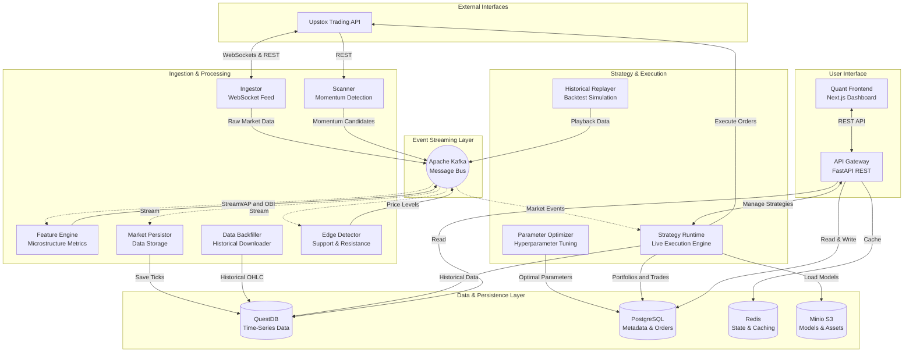

# ⚡ [QUANT-SOURCE-209] Consolidated Quant & Algo Trading Repositories
**Category**: `HFT_MICROSTRUCTURE_LOB` | **Repositories in this Source**: 3
**Generated**: QUANT_BUNDLE_209_HFT_MICROSTRUCTURE_LOB.md | **Target**: NotebookLM 290+ Quant Code Brain

---

## [1/3] Repository: alice-blue-futures (`PHASE4-QUANT-073`)
- **Full Name**: `PHASE4-QUANT-073_RajeshSivadasan__alice-blue-futures`
- **Description**: Fully automated Algorithmic Trading Bot created with Python for Alice Blue broker. Works on exchanges NSE and MCX for Nifty / Crude / Banknifty futures and options , absolutely FREE
- **GitHub Stars**: 83
- **Source Pool**: `phase4_quant_wheels_100`

### Documentation & Overview (README.md)
(Please note that the Alice Blue API may not work as the code is not maintained/upgraded for the latest Alice Blue API version. Still new developers can refer the code for logic and functionality implementation in the live market) 
# Fully automated Alice Blue Algo Trading with Python on NSE and MCX for Nifty / Crude / Banknifty futures and options (option buying only) , absolutely FREE !
This algo trading bot is my first attempt to try, learn and implement my python programming skills. Please use this only for reference and at your own risk.  
This repository contains python code to perform algo trading on India, NSE through AliceBlue broker. 
You need to have a valid AliceBlue client ID, password, 2FA authentication password set and API enabled (ask aliceblue support) to get this working.
Initially, I had developed this for windows then later moved to linux (ubuntu) platform on AWS.

There are 2 programs. You can run either one of them on a single linux (It should run on windows as well, I have not yet tested though) machine.  
1. For Options trading (Requires 10-15k capital) - ab_options.py which uses ab_options.ini as configuration/parameter file.
   <br>Usage : > python ab_options.py 
   This program is for option buying only.
   
2. For Futures trading (Requires 2.5-4 lakhs capital) - ab.py which uses ab.ini as configuration/parameter file.
   <br>Usage : > python ab_options.py
   This program is focused on Nifty and Crude futures with a simple Supertrend with RSI strategy.
   
These programs basically uses 3min (low) , 6min (medium) time frame supertrend and RSI indicators (adjusted through parameters) to generate signals. For any other strategy you need to modify the main program. My wish list includes parameterisation of this strategy peice as well. 

There is also a background program (ab_bg.py) which when triggered runs at the background and helps us to control our algo bot from anywhere using telegram. 
We can send commands through telegram chats to do various activities in realtime like start/stop trading, set MTM levels, manage SL, get detailed logs etc. 
basically all the realtime config parameters can be managed/modified through telegram chats.    

The main program ab.py/ab_options.py which needs to be scheduled at 8:59:30 AM / 9:14:00 AM daily through linux crontab. 
Crude(MCX) opens at 9:00 AM and Nifty at 9:15 AM.
You can setup AWS instance to start at 8:45 AM and stop at 11:45 PM (After MCX Close) through AWS Lambda. 
I typically set both of the programs on seperate AWS instances and configure two seperate IDs. 
You can read through the comments in the ab.py/ab_options.py for detailed understanding. 
# There is an ab.ini/ab_options.ini file which is the key configuration file through which you can control all the parameters of this program, even at realtime using Telegram chats. 

As a onetime setup, please create log and data folder in the same path where the program files are copied.

Although this is still work in progress, kindly suggest your feedback. It will help me improve.

Feel free to use/distribute this code freely so that new algo developers can get started easily.  

For folks who are interested in learning Algo Programming for Indian Stock exchanges can join this informative, valuable and highly active Telegram Group
https://t.me/AlgoTradeAnalysis
(Please note this is not my Telegram Group)

### Core Implementation Code & Architecture
#### File: `ab_auto_login_totp.py`
```python
import requests
import json
from Crypto import Random
from Crypto.Cipher import AES
import hashlib
import base64
import pyotp
import configparser

class CryptoJsAES:
  @staticmethod
  def __pad(data):
    BLOCK_SIZE = 16
    length = BLOCK_SIZE - (len(data) % BLOCK_SIZE)
    return data + (chr(length) * length).encode()

  @staticmethod
  def __unpad(data):
    return data[:-(data[-1] if type(data[-1]) == int else ord(data[-1]))]

  def __bytes_to_key(data, salt, output=48):
    assert len(salt) == 8, len(salt)
    data += salt
    key = hashlib.md5(data).digest()
    final_key = key
    while len(final_key) < output:
      key = hashlib.md5(key + data).digest()
      final_key += key
    return final_key[:output]

  @staticmethod
  def encrypt(message, passphrase):
    salt = Random.new().read(8)
    key_iv = CryptoJsAES.__bytes_to_key(passphrase, salt, 32 + 16)
    key = key_iv[:32]
    iv = key_iv[32:]
    aes = AES.new(key, AES.MODE_CBC, iv)
    return base64.b64encode(b"Salted__" + salt + aes.encrypt(CryptoJsAES.__pad(message)))

  @staticmethod
  def decrypt(encrypted, passphrase):
    encrypted = base64.b64decode(encrypted)
    assert encrypted[0:8] == b"Salted__"
    salt = encrypted[8:16]
    key_iv = CryptoJsAES.__bytes_to_key(passphrase, salt, 32 + 16)
    key = key_iv[:32]
    iv = key_iv[32:]
    aes = AES.new(key, AES.MODE_CBC, iv)
    return CryptoJsAES.__unpad(aes.decrypt(encrypted[16:]))


BASE_URL="https://ant.aliceblueonline.com/rest/AliceBlueAPIService"


INI_FILE = "ab_options_sell.ini"              # Set .ini file name used for storing config info.
# Load parameters from the config file
cfg = configparser.ConfigParser()
cfg.read(INI_FILE)


userId = cfg.get("tokens", "uid")
password = cfg.get("tokens", "pwd")
twofa = cfg.get("tokens", "twofa")
totp_encrypt_key = cfg.get("tokens", "totp_key")


totp = pyotp.TOTP(totp_encrypt_key)
url = BASE_URL+"/customer/getEncryptionKey"

payload = json.dumps({
  "userId": userId
})
headers = {
  'Content-Type': 'application/json'
}

response = requests.request("POST", url, headers=headers, data=payload,verify=True)

encKey = response.json()["encKey"]

checksum = CryptoJsAES.encrypt(password.encode(), encKey.encode()).decode('UTF-8')


url = BASE_URL+"/customer/webLogin"

payload = json.dumps({
  "userId": userId,
  "userData": checksum
})
headers = {
  'Content-Type': 'application/json'
}

response = requests.request("POST", url, headers=headers, data=payload,verify=True)

response_data = response.json()


url = BASE_URL+"/sso/2fa"

payload = json.dumps({
  "answer1": twofa,
  "userId": userId,
  "sCount": str(response_data['sCount']),
  "sIndex": response_data['sIndex']
})
headers = {
  'Content-Type': 'application/json'
}

response = requests.request("POST", url, headers=headers, data=payload,verify=True)


if response.json()["loPreference"] == "TOTP" and response.json()["totpAvailable"]:
  url = BASE_URL+"/sso/verifyTotp"

  payload = json.dumps({
      "tOtp": totp.now(),
      "userId": userId
  })

  headers = {
    'Authorization': 'Bearer '+userId+' '+response.json()['us'],
    'Content-Type': 'application/json'
  }

  response = requests.request("POST", url, headers=headers, data=payload,verify=True)

if response.json()["userSessionID"]:
  print("Login Successfully")
else:
  print("User is not TOTP enabled! Please enable TOTP through mobile or web")
```

#### File: `ab_bg.py`
```python
# pylint: disable=unused-wildcard-import
# Backgroung process to update ab.ini through external interface resulting in passing commands to the main trade program ab.py
# v1.0 created 
# v1.1 updated help section
# v1.2 included get and set config parameter implementation. Not fully tested though.
# v1.3 get log file contents, other corrections, get files
# v1.4 exception= name 'text' is not defined issue fixed
# v1.5 Get log no of lines defaulted to 10
# v1.6 removed import telegram
# v1.7 Added back telegram, needed for sending file :). Used subprocess module for running linux command 
# v1.8 added support for get/set of token section as well  
# v1.9 Parameterisation of INI file, logfilename prefix updated (can be parameterised)
# v2.0 Removed hardcoding of the chat id in the parse command and used chat id parameter from the .ini file

# Info
# Once Telegram menubuilder is used, webhook gets created and it does not go away with the deletion of menubuilder bot
# you need to call deleteWebhook method like below to get the getUpdates method working
# https://api.telegram.org/bot596058150:AAG936V9rpqmOOcAH_OxaHik_8ZGJZM4m_A/deleteWebhook
# currently all messages will only go to the chat id configured in ab.ini tokens section. Any other user(s) will not receive any messages although they can send messages
# This was not enabled mainly to restrict others from setting the ab.ini values which can tamper with the system.
# Readonly mode can be planned for other users. 

import ab_lib
from ab_lib import *
import sys
import time
import telegram
import subprocess

# Enable logging to file 
sys.stdout = sys.stderr = open(r"./log/ab_bg_" + datetime.datetime.now().strftime("%Y%m%d") +".log" , "a")


######################################
#       Initialise variables
######################################

# Load parameters from the config file
INI_FILE = "ab_options.ini"              # Set .ini file name used for storing config info.
cfg = configparser.ConfigParser()
cfg.read(INI_FILE)

# Exit if the background process is disabled 
if int(cfg.get("tokens", "enable_bg_process")) == 0:
    strMsg = "Background process not enabled. Exiting program."
    iLog(strMsg,sendTeleMsg=True)
    sys.exit()

# Set user profile; Access token and other user specific info from .ini will be pulled from this section
ab_lib.strChatID = cfg.get("tokens", "chat_id")
ab_lib.strBotToken = cfg.get("tokens", "bot_token")    #Bot include bot prefix in the token
strMsg = "Initialising " + __file__ + " for " + cfg.get("tokens", "uid")
iLog(strMsg,sendTeleMsg=True)

#############################
####    FUNCTIONS   #########
#############################

def save_configfile():
    try:
        with open(INI_FILE, 'w') as configfile:
            cfg.write(configfile)
            configfile.close()
    except Exception as ex:
        iLog("Exception in resetting export data flag." + str(ex),2)

def sendTeleFile(attachFile):
    # iLog(ab_lib.strBotTokenWObot)
    iLog("Sending File " + attachFile, sendTeleMsg=True )
    try:
        bot = telegram.Bot(ab_lib.strBotTokenWObot)
        bot.sendDocument(chat_id=ab_lib.strChatID, document=open(attachFile, 'rb'))
    except Exception as ex:
        print("ex=",ex,flush=True)

def parseCommand(text,chat_id):
    '''Parses the text for commands and updates the INI_FILE file for actions.
    Does not directly do any actions on the trading account or linux instance.
     '''
    # More validations can be done based on the enable_nfo and enable_mcx params
    global cfg

    flg_start = 0
    flg_stop = 0
    flg_nfo = 0
    flg_bank = 0
    flg_update_config = 0
    strMsg = ""

    strStart = ['START','ENABLE']
    strStop = ['STOP','DISABLE']
    strTrade = ['TRADE','TRADING']
    strExportData = ['EXPORT','SAVE']
    strNFO = ['NFO','NIFTY']
    strBank = ['BANK','BN']
    strHelp = ['HELP']
    strGetParam = ['GET PARAM']
    strSetParam = ['SET PARAM']
    strGetLog = ['GET LOG']
    strGetFile = ['GET FILE']
    strCMD = ['CMD']

    # Read and print config file parameter values
    if any(x in text.upper() for x in strGetParam):
        if len(text.upper().split(' ')) > 2 :
            if text.upper().split(' ')[2] =='SEC':
                sec = text.upper().split(' ')[3]
                if sec.upper() == 'ALL':
                    strMsg = "Section [realtime]:\n" + str(cfg.items('realtime'))
                    iLog(strMsg,sendTeleMsg=True)
                    strMsg = "Section [info]:\n" + str(cfg.items('info'))
                    iLog(strMsg,sendTeleMsg=True)
                elif sec.upper() == 'REALTIME':
                    strMsg = "Section [realtime]:\n" + str(cfg.items('realtime'))
                    iLog(strMsg,sendTeleMsg=True)
                elif sec.upper() == 'INFO':
                    strMsg = "Section [info]:\n" + str(cfg.items('info'))
                    iLog(strMsg,sendTeleMsg=True)
                elif sec.upper() == 'TOKENS':
                    strMsg = "Section [tokens]:\n" + str(cfg.items('tokens'))
                    iLog(strMsg,sendTeleMsg=True)                
                else:
                    strMsg = "Section " + sec + " not found or no read permission." 
                    iLog(strMsg,sendTeleMsg=True)
            else:
                strMsg = "Invalid GET command.\nUsage: GET PARAM SEC <section name(info/realtime/All)>" 
                iLog(strMsg,sendTeleMsg=True)
        else:
            strMsg = "Invalid GET command.\nUsage: GET PARAM SEC <section name(info/realtime/All)>" 
            iLog(strMsg,sendTeleMsg=True)
        
        return

    # Set config file parameter values
    if any(x in text.upper() for x in strSetParam):
        # Set commands can be only executed by the chat id mentioned in the parameter 
        if chat_id == ab_lib.strChatID :
            if len(text.split(' ')) > 2 :
                if text.upper().split(' ')[2] == 'SEC':
                    sec = text.lower().split(' ')[3]
                    if sec in ['realtime','info','tokens']:
                        param = text.split(' ')[4]
                        param_val = text.split( param )[1].strip()
                        cfg.set(sec.lower(), param, param_val)
                        save_configfile()    
                        strMsg = "Section " + sec + " parameter " + param + " updated with value " + param_val
                    else:
                        strMsg = "Section or parameter not found."

                    iLog(strMsg,sendTeleMsg=True)
               
                else:
                    strMsg = "Invalid SET command.\nUsage: SET PARAM SEC <section name(tokens/info/realtime> <key> <value>" 
                    iLog(strMsg,sendTeleMsg=True)
            
            else:
                strMsg = "Should not come here. Invalid SET command.\nUsage: SET PARAM SEC <section name(tokens/info/realtime> <key> <value>" 
                iLog(strMsg,sendTeleMsg=True)


        else:
            strMsg = "Invalid SET command.\nUsage: SET PARAM SEC <section name(info/realtime> <key> <value>" 
            iLog(strMsg,sendTeleMsg=True)
        
        return
    
    # Get Log file contents 
    if any(x in text.upper() for x in strGetLog):
        # print(len(text.split(' ')),flush=True)
        if len(text.split(' ')) > 2 :
            no_of_lines =  text.split(' ')[2]
            # print("no_of_lines=",no_of_lines,flush=True)
            if no_of_lines.isnumeric() :
                # Send the last n lines, set to default 10
                if no_of_lines == "" : no_of_lines = 10
                strMsg = ""
                fname = "./log/ab_bg_" + datetime.datetime.now().strftime("%Y%m%d") +".log"
                iLog("Sending last " + no_of_lines + " lines from file " + fname,sendTeleMsg=True)
                with open(fname) as file: 
                    for line in (file.readlines() [ -1*int(no_of_lines) :]): 
                        strMsg = strMsg + line.replace("#","Cnt")
                
            iLog(strMsg,sendTeleMsg=True)
 
        elif text.strip().upper()=="GET LOG":
            # Send the log file
            fname = "./log/ab_bg_" + datetime.datetime.now().strftime("%Y%m%d") +".log"
            sendTeleFile(fname)

        return

    if any(x in text.upper() for x in strGetFile):
        fname = text.split(' ')[2]
        iLog("fname=" + fname)
        sendTeleFile(fname)
        return

    if any(x in text.upper() for x in strCMD):
        # Send output of the linux command
        strCMD = text.split(' ',1)[1]
        lstCMD = strCMD.strip().split(' ') 
        print("lstCMD=",lstCMD)
        result = subprocess.run(lstCMD, stdout=subprocess.PIPE,stderr=subprocess.STDOUT).stdout.decode('utf-8')
        iLog(result,sendTeleMsg=True)
        return

    # Start/Stop Nifty/Crude
    if any(x in text.upper() for x in strStart):
        flg_start = 1
    
    elif any(x in text.upper() for x in strStop ):
        flg_stop = 1        

    
    if any(x in text.upper() for x in strNFO):
        flg_nfo = 1
    elif any(x in text.upper() for x in strBank ):
        flg_bank = 1        
    

    if flg_nfo:
        if flg_stop:
            cfg.set("realtime","trade_nfo","0")
            flg_update_config = 1
        elif flg_start:
            cfg.set("realtime","trade_nfo","1")
            flg_update_config = 1

    if flg_bank:
        if flg_stop:
            cfg.set("realtime","trade_bank","0")
            flg_update_config = 1
        elif flg_start:
            cfg.set("realtime","trade_bank","1")
            flg_update_config = 1


    # Save/Export data
    if any(x in text.upper() for x in strExportData):
        cfg.set("realtime","export_data","1")
        flg_update_config = 1


    # Action and response of the parsed text
    if flg_update_config and chat_id == '670221062':     # RajeshSivadasan:
        save_configfile()
        iLog( text  + " triggered by updating the config file.",sendTeleMsg=True)
        return
    
    if any(x in text.upper() for x in strHelp):
        strMsg="You can ask me following:\n" + \
        "To START NIFTY trading if its disabled: START NIFTY\n" + \
        "To STOP NIFTY trading if its enabled: STOP NIFTY\n" + \
        "Similarly do for CRUDE.\n" + \
        "To export or save current ohlc data: EXPORT/SAVE\n"+ \
        "To get config parameter values: GET PARAM SEC <section name(tokens/info/realtime/All)>\n"+ \
        "To set config parameter values: SET PARAM SEC <section name(tokens/info/realtime> <key> <value>\n"+ \
        "To get Log file rows: GET LOG <No Of Rows> \n"+ \
        "To get File: GET FILE <Filename with path e.g ./log/ab_20200801.log>\n"+ \
        "To run linux command and get output: CMD <linux command>"
        iLog(strMsg,sendTeleMsg=True)

def get_last_update_id(updates):
    update_ids = []
    for update in updates["result"]:
        update_ids.append(int(update["update_id"]))
    return max(update_ids)


baseURL = "https://api.telegram.org/" + ab_lib.strBotToken +  "/getUpdates?timeout=100"
url =  baseURL
offset = None
text = ""
iLog("url = " + url)

# Loop through the telegram message to commands
while True:
    if offset:
        url = baseURL + "&offset={}".format(offset)
    
    try:
        resp = requests.get(url)
        updates = resp.json()
        
        iLog("updates=" + str(updates)) 
        chat_id = ""

        if len(updates["result"]) > 0:
            offset = get_last_update_id(updates) + 1

        for update in updates["result"]:
            if update["message"]["from"]["is_bot"]:
                text = ""
            else:
                text = update["message"]["text"]
                chat_id = update["message"]["chat"]["id"]  # username not commming for all user types 

        if len(text)>0:
            iLog("chat_id=" + str(chat_id)  +" text="+text)
            parseCommand(text,str(chat_id))
            text=""
    
    except Exception as e:
        print("exception="+str(e)+";"+str(updates),flush=True)

    time.sleep(10)
```

#### File: `ab_lib.py`
```python
# pylint: disable=unused-wildcard-import
# v1.0 - Baseline
# v1.1 - BotToken Parameterization, enabled import requests
# v1.2.1 - documented iLog function
# v1.3 - getAccessToken(): Implemented hour based generation and change in tokenurltime format to include hour and minute
# v1.4 - Merged Tele() function into iLog() to send telegram messages 
# v1.5 - update_contract_symbol() implemented to update nifty and crude active contract symbol parameter update
# v1.6 - strBotTokenWObot for Telegram bot object 
# v1.7 - Logging of nifty contract symbol update message 
# v1.8 - access token retry functionality added. need testing
# v1.9 - #18-Jun-2021 Disabled Nifty Fut symbol update. Plan to use Nifty 50 index and option trading
# v2.0 - 28-Jun-2021 Enabled Nifty Fut symbol update. Plan to use Nifty fut with option hedging 
# v2.1 - 01-Ju1-2021 getAccessToken() updating wrong .ini file, hence added .ini file parameter  
#       Also updated update_contract_symbol() with the above changes 
#       More exception haldling in getAccessToken()

from alice_blue import *
import configparser
import datetime
import requests
import pandas as pd
import numpy as np
from dateutil.relativedelta import relativedelta, FR
import time

strChatID = <strChatID>
strBotToken = '<strBotToken>'  
strBotTokenWObot = '<strBotTokenWObot>'  # For Telegram bot object. need to revisit this.
supertrend_period = 7 #5 #7 #30 NOte: This changes the ATR period also
supertrend_multiplier = 2.5 #1.5 #3


# Custom logging: Default Info=1, data =0
def iLog(strLogText,LogType=1,sendTeleMsg=False):
    '''0=data, 1=Info, 2-Warning, 3-Error, 4-Abort, 5-Signal(Buy/Sell) ,6-Activity/Task done

        sendTelegramMsg=True - Send Telegram message as well. 
        Do not use special characters like #,& etc  
    '''
    #0- Data format TBD; symbol, price, qty, SL, Tgt, TSL
    
    print("{}|{}|{}".format(datetime.datetime.now(),LogType,strLogText),flush=True)
    
    if sendTeleMsg :
        try:
            requests.get("https://api.telegram.org/"+strBotToken+"/sendMessage?chat_id="+strChatID+"&text="+strLogText)
        except:
            iLog("Telegram message failed."+strLogText)

def getAccessToken(strToken="tokens", INI_FILE="ab.ini"):
    '''Generates and returns new access token in case last generated token is earlier than 6 hours.
    strToken: Section to be used for getting the user details. Default value is tokens '''

    retval = "-1"
    
    iLog("getAccessToken().Reading Config file.")
    # print(str(datetime.datetime.now())+"getAccessToken().Reading Config file.",flush=True)
    #Load parameters from the config file
    cfg = configparser.ConfigParser()
    cfg.read(INI_FILE)

    susername = cfg.get(strToken, "uid")
    spassword = cfg.get(strToken, "pwd")
    sapi_secret = cfg.get(strToken, "api_secret")
    stwoFA = cfg.get(strToken, "twoFA")
    tokenUrlTime = cfg.get(strToken, "tokenUrlTime")
    # today = datetime.datetime.now().strftime("%Y%m%d%H%M")
    
    today = datetime.datetime.now()
    last_token_time = datetime.datetime.strptime(tokenUrlTime,"%Y%m%d%H%M")
    
    # today = datetime.datetime.strptime("202006120200","%Y%m%d%H%M")
    # last_token_time = datetime.datetime.strptime("202006120100","%Y%m%d%H%M")
    
    diff =  today - last_token_time
    
    #if today == tokenUrlTime :
    # Generate new access token only if last generated time is > 6 hours else use existing one
    if (diff.total_seconds() / 3600) < 6:
        #do nothing
        access_token = cfg.get(strToken, "access_token")
        strMsg="Current access token used as last token generated is within last 6 hours"
        # print(strMsg,flush=True)
        iLog(strMsg)
        retval = access_token
    else:
        #Generate access_token
        try:
            # print("spassword=",spassword)
            access_token = AliceBlue.login_and_get_access_token(username=susername, password=spassword, twoFA=stwoFA,  api_secret=sapi_secret)
            # print("access_token try 1=",access_token,flush=True)
            if access_token==None:
                raise Exception("Access token not generated!") 
            else:
                iLog("Access token generated successfully after 1st try.")

        except Exception as ex:
            # print("Exception occured fetching access_token:",ex,flush=True)
            iLog("Exception occured fetching access_token 1st try:"+str(ex),3)
            time.sleep(30)  #wait for 30 seconds and retry
            try:
                access_token = AliceBlue.login_and_get_access_token(username=susername, password=spassword, twoFA=stwoFA,  api_secret=sapi_secret)
                # print("access_token try 2=",access_token,flush=True)
                if access_token==None:
                    raise Exception("Access token not generated!")
                else:
                    iLog("Access token generated successfully after 2nd try.")

            except Exception as ex:
                iLog("Exception occured fetching access_token 2nd try:"+str(ex),3)
                return retval

        # Whatever access token is generated put in the ini file 
        cfg.set(strToken,"access_token",access_token)
        cfg.set(strToken,"tokenUrlTime",datetime.datetime.now().strftime("%Y%m%d%H%M")) 

        with open(INI_FILE, 'w') as configfile:
            cfg.write(configfile)
            configfile.close()
    
        retval = access_token


    return retval

def update_contract_symbol(INI_FILE="ab.ini"):
    '''Updates nifty_symbol(on expiry date which is one day earlier) and crude_symbol in the ab.ini file
        To be called daily before start of market
     '''
    dt_today = datetime.date.today().isoformat()
    # dt_today = datetime.date(2020,7,31).isoformat()

    cfg = configparser.ConfigParser()
    cfg.read(INI_FILE)
    crude_expiry_dates = cfg.get("info", "crude_expiry_dates").split(",")
    update_flag = False

    # For CRUDE
    if dt_today in crude_expiry_dates:
        strMonth = (datetime.datetime.strptime(dt_today,"%Y-%m-%d") + relativedelta(months=1)).strftime("%b").upper()
        iLog("Setting CRUDEOIL contract value in ab.ini to " + "CRUDEOIL " + strMonth + " FUT",6)
        cfg.set("info","crude_symbol","CRUDEOIL " + strMonth + " FUT")
        update_flag = True

    # This will not run if last friday is holiday. Like 25 dec 2020. Need to handle this.
    # For NIFTY
    dt_last_friday =  datetime.datetime.strptime(dt_today,"%Y-%m-%d") + relativedelta(day=31, weekday=FR(-1))
    if datetime.datetime.strptime(dt_today,"%Y-%m-%d") == dt_last_friday:
        strMonth =  (dt_last_friday + relativedelta(days=10)).strftime("%b").upper()
        iLog("Setting NIFTY contract value in ab.ini to " + "NIFTY " + strMonth + " FUT",6)
        cfg.set("info","nifty_symbol","NIFTY " + strMonth + " FUT")
        update_flag = True
    
    #18-Jun-2021 Disabled Nifty Fut symbol update. Plan to use Nifty 50 index and option trading
    #28-Jun-2021 Enabled Nifty Fut symbol update. Plan to use Nifty fut with option hedging 
    if update_flag :
        with open(INI_FILE, 'w') as configfile:
            cfg.write(configfile)
            configfile.close()
        iLog("Updated CRUDEOIL/NIFTY contract month in ab.ini",6)

#################################
##     INDICATORS
#################################
# Source for tech indicator : https://github.com/arkochhar/Technical-Indicators/blob/master/indicator/indicators.py
def EMA(df, base, target, period, alpha=False):
    """
    Function to compute Exponential Moving Average (EMA)
    Args :
        df : Pandas DataFrame which contains ['date', 'open', 'high', 'low', 'close', 'volume'] columns
        base : String indicating the column name from which the EMA needs to be computed from
        target : String indicates the column name to which the computed data needs to be stored
        period : Integer indicates the period of computation in terms of number of candles
        alpha : Boolean if True indicates to use the formula for computing EMA using alpha (default is False)
    Returns :
        df : Pandas DataFrame with new column added with name 'target'
    """

    con = pd.concat([df[:period][base].rolling(window=period).mean(), df[period:][base]])

    if (alpha == True):
        # (1 - alpha) * previous_val + alpha * current_val where alpha = 1 / period
        df[target] = round(con.ewm(alpha=1 / period, adjust=False).mean(),1) #Rajesh - added round function
    else:
        # ((current_val - previous_val) * coeff) + previous_val where coeff = 2 / (period + 1)
        df[target] = round(con.ewm(span=period, adjust=False).mean(),1) #Rajesh - added round function

    df[target].fillna(0, inplace=True)
    return df

def ATR(df, period, ohlc=['open', 'high', 'low', 'close']):
    """
    Function to compute Average True Range (ATR)
    Args :
        df : Pandas DataFrame which contains ['date', 'open', 'high', 'low', 'close', 'volume'] columns
        period : Integer indicates the period of computation in terms of number of candles
        ohlc: List defining OHLC Column names (default ['Open', 'High', 'Low', 'Close'])
    Returns :
        df : Pandas DataFrame with new columns added for
            True Range (TR)
            ATR (ATR_$period)
    """
    #atr = 'ATR_' + str(period)
    atr = 'ATR'
    # Compute true range only if it is not computed and stored earlier in the df
    #if not 'TR' in df.columns:
    df['h-l'] = df[ohlc[1]] - df[ohlc[2]]
    df['h-yc'] = abs(df[ohlc[1]] - df[ohlc[3]].shift())
    df['l-yc'] = abs(df[ohlc[2]] - df[ohlc[3]].shift())

    #Rajesh - Updated round function below
    df['TR'] = round(df[['h-l', 'h-yc', 'l-yc']].max(axis=1),1)

    df.drop(['h-l', 'h-yc', 'l-yc'], inplace=True, axis=1)

    # Compute EMA of true range using ATR formula after ignoring first row
    EMA(df, 'TR', atr, period, alpha=True)

    return df

def SuperTrend(df, period = supertrend_period, multiplier=supertrend_multiplier, ohlc=['open', 'high', 'low', 'close']):
    """
    Function to compute SuperTrend
    Args :
        df : Pandas DataFrame which contains ['date', 'open', 'high', 'low', 'close', 'volume'] columns
        period : Integer indicates the period of computation in terms of number of candles
        multiplier : Integer indicates value to multiply the ATR
        ohlc: List defining OHLC Column names (default ['Open', 'High', 'Low', 'Close'])
    Returns :
        df : Pandas DataFrame with new columns added for
            True Range (TR), ATR (ATR_$period)
            SuperTrend (ST_$period_$multiplier)
            SuperTrend Direction (STX_$period_$multiplier)
    """

    ATR(df, period, ohlc=ohlc)
    atr = 'ATR' #+ str(period)
    st = 'ST' #+ str(period) + '_' + str(multiplier)
    stx = 'STX' #  + str(period) + '_' + str(multiplier)

    """
    SuperTrend Algorithm :
        BASIC UPPERBAND = (HIGH + LOW) / 2 + Multiplier * ATR
        BASIC LOWERBAND = (HIGH + LOW) / 2 - Multiplier * ATR
        FINAL UPPERBAND = IF( (Current BASICUPPERBAND < Previous FINAL UPPERBAND) or (Previous Close > Previous FINAL UPPERBAND))
                            THEN (Current BASIC UPPERBAND) ELSE Previous FINALUPPERBAND)
        FINAL LOWERBAND = IF( (Current BASIC LOWERBAND > Previous FINAL LOWERBAND) or (Previous Close < Previous FINAL LOWERBAND)) 
                            THEN (Current BASIC LOWERBAND) ELSE Previous FINAL LOWERBAND)
        SUPERTREND = IF((Previous SUPERTREND = Previous FINAL UPPERBAND) and (Current Close <= Current FINAL UPPERBAND)) THEN
                        Current FINAL UPPERBAND
                    ELSE
                        IF((Previous SUPERTREND = Previous FINAL UPPERBAND) and (Current Close > Current FINAL UPPERBAND)) THEN
                            Current FINAL LOWERBAND
                        ELSE
                            IF((Previous SUPERTREND = Previous FINAL LOWERBAND) and (Current Close >= Current FINAL LOWERBAND)) THEN
                                Current FINAL LOWERBAND
                            ELSE
                                IF((Previous SUPERTREND = Previous FINAL LOWERBAND) and (Current Close < Current FINAL LOWERBAND)) THEN
                                    Current FINAL UPPERBAND
    """

    # Compute basic upper and lower bands
    df['basic_ub'] = (df[ohlc[1]] + df[ohlc[2]]) / 2 + multiplier * df[atr]
    df['basic_lb'] = (df[ohlc[1]] + df[ohlc[2]]) / 2 - multiplier * df[atr]

    # Compute final upper and lower bands
    df['final_ub'] = 0.00
    df['final_lb'] = 0.00
    for i in range(period, len(df)):
        df['final_ub'].iat[i] = df['basic_ub'].iat[i] if df['basic_ub'].iat[i] < df['final_ub'].iat[i - 1] or \
                                                         df[ohlc[3]].iat[i - 1] > df['final_ub'].iat[i - 1] else \
        df['final_ub'].iat[i - 1]
        df['final_lb'].iat[i] = df['basic_lb'].iat[i] if df['basic_lb'].iat[i] > df['final_lb'].iat[i - 1] or \
                                                         df[ohlc[3]].iat[i - 1] < df['final_lb'].iat[i - 1] else \
        df['final_lb'].iat[i - 1]

    # Set the Supertrend value
    df[st] = 0.00
    for i in range(period, len(df)):
        df[st].iat[i] = df['final_ub'].iat[i] if df[st].iat[i - 1] == df['final_ub'].iat[i - 1] and df[ohlc[3]].iat[
            i] <= df['final_ub'].iat[i] else \
            df['final_lb'].iat[i] if df[st].iat[i - 1] == df['final_ub'].iat[i - 1] and df[ohlc[3]].iat[i] > \
                                     df['final_ub'].iat[i] else \
                df['final_lb'].iat[i] if df[st].iat[i - 1] == df['final_lb'].iat[i - 1] and df[ohlc[3]].iat[i] >= \
                                         df['final_lb'].iat[i] else \
                    df['final_ub'].iat[i] if df[st].iat[i - 1] == df['final_lb'].iat[i - 1] and df[ohlc[3]].iat[i] < \
                                             df['final_lb'].iat[i] else 0.00

        # Mark the trend direction up/down
    df[stx] = np.where((df[st] > 0.00), np.where((df[ohlc[3]] < df[st]), 'down', 'up'), np.NaN)

    # Remove basic and final bands from the columns
    df.drop(['basic_ub', 'basic_lb', 'final_ub', 'final_lb'], inplace=True, axis=1)

    df.fillna(0, inplace=True)
    return df

def RSI(df, base="close", period=7):
    """
    Function to compute Relative Strength Index (RSI)
    
    Args :
        df : Pandas DataFrame which contains ['date', 'open', 'high', 'low', 'close', 'volume'] columns
        base : String indicating the column name from which the MACD needs to be computed from (Default Close)
        period : Integer indicates the period of computation in terms of number of candles
        
    Returns :
        df : Pandas DataFrame with new columns added for 
            Relative Strength Index (RSI_$period)
    """
 
    delta = df[base].diff()
    up, down = delta.copy(), delta.copy()

    up[up < 0] = 0
    down[down > 0] = 0
    
    rUp = up.ewm(com=period - 1,  adjust=False).mean()
    rDown = down.e
# ... [TRUNCATED FILE CONTENT]
```

#### File: `ab_options.py`
```python
# pylint: disable=unused-wildcard-import
# Refer to ab.py verison comments for previous changes
#============= ab_options.py created from here ============= 
# Used v6.9.2 as the base to start the options 
# v6.9.2 Implemented try block in subscribe_ins()
# v7.0  Revamp of the program for Options Trading (Nifty/BankNifty)
#   Replace Nifty futures with Nifty 50 Index. Use it for option trading
#   First phase we will implement NIfty then Banknifty
#v7.0.1 Fixed expiry date holiday issue
#v7.0.2 Fixed place_order_BO():Optional parameter price not of type float
#v7.0.3 Removed RSI range and momentum check, print change 
#v7.0.4 fixed ins_nifty_opt incorrect token assignment
#v7.0.5 fixed issue with strMsg assignment in buy_nifty_options()
#v7.0.6 fixed indentation of program exit code at 3.30 pm
#v7.0.7 reworked for MIS support. Removed unwanted code 
#v7.1.0 Added banknifty support 
#v7.1.4 Banknifty support updates, order management, threading
#v7.1.5 check_orders() for order management. can implement trailing SL concept as well.
#v7.1.6-7 buy_nifty_options() MIS SL order
#v7.1.8-9 Fixed place_sl_order() main_order_id bug, added debug comments
#v7.2.0 Fixed place_sl_order() bug - Trading Symbol Doesn't exist for the exchange
#v7.2.1 check_orders() - TSL update and comments, logging
#v7.2.2 Workaround for modify_order() missing 1 required positional argument: 'quantity'. Need to update the code if the original package is fixed by the author 
#v7.2.3 TSL logic updates in check_orders() and place_sl_order()
#v7.2.4 Removed unwanted comments, updated 
#v7.2.5 TSL logic updated in check_orders() and minor changes in place_sl_order()
#v7.2.6 fixed UnboundLocalError: local variable 'bank_bo1_qty' referenced before assignment
#v7.2.7 check_orders(). Passed trigger price in the modify_order as it was getting triggered immediately
#v7.2.8 Limit price constraint parameterised, updated nifty_buy_opitons. Now nifty options with BO can be enabled
#v7.2.9 Minor logging in procedures, updated TSL logic to include SL
#v7.3.0 Major changes done: ST Medium removed from strategy, purely based on ST low (3min). Signal was comming too late.
#v7.3.1 Bugs, ST_Med related fields removed
#v7.3.2 Implemented nifty_limit_price_offset and bank_limit_price_offset; Removed bo_level parameters as they are not applicable for options 
#v7.3.3 check_orders(): Bug->Changed limit order to SL limit for TSL updation. TSL based on banknifty/nifty
#v7.3.4 place_sl_order(): Order didn't go through as the price moved quickly, but it came back. 
# But the order got rejected due to less funds. Handled reject orders and increased sl_wait_timeout in .ini to 100 i.e 200 seconds
#v7.3.5 BUG:trade_bank parameter was not getting updated at eod due to incorrect passing of section/parameter
# Reversed the logic of buy and sell. i.e when buy signal is recevied sell is done and vice a versa
#v7.3.6 Added symbol in the logging, moved trade_nfo condition after logging
# Although positive trades were getting executed but it was not rewarding. need analysis. Missing out on trending trades.
#Need to check on short duration candles i.e 1 min
#v7.3.7 Reinstated back the reversed buy/sell logic
#v7.3.8 new login process implemented
#v7.4.0 New API V2 implemented

# get_opt_ltp_wait_seconds

###### STRATEGY / TRADE PLAN #####
# Trading Style : Intraday
# Trade Timing : Morning 9:15 to 10:40 AM , After noon 1.30 PM to 3.30 PM 
# Trading Capital : Rs 20,000
# Trading Qty : 1 Lot for short goal, 1 lot long goal
# Premarket Routine : TBD
# Trading Goals : Nifty(Short Goal = 20 Points, Long Goal = 200 pts with TSL)
# Time Frame : 3 min
# Entry Criteria : Nifty50 Supertrend buy(CE)/Sell(PE)
# Exit Criteria : BO Set for Target/SL, Exit CE position on Supertrend Sell/PE trigger, exit PE position the other way  
# Risk Capacity : Taken care by BO
# Order Management : BO orders else MIS/Normal(may need additional exit criteria)

# Supertrend Buy signal will trigger ATM CE buy
# Supertrend Sell signal will trigger ATM PE buy 
# Existing positions to be closed before order trigger
# For option price, ATM ltp CE and ATM ltp PE to be subscribed dynamically and stored in global variables
# Nifty option order trigger to be based on Nifty50 Index movement hence nifty50 dataframe required 
# BankNifty option order trigger to be based on BankNifty Index movement hence banknifty dataframe required to be maintained seperately

# bg process
# 2020-09-01 09:59:18.152555|1|chat_id=670221062 text=Cmd ls
# exception= list index out of range
# 2020-09-01 10:00:18.565516|1|chat_id= text=Cmd ls
# exception= list index out of range

# Open issues/tasks:
# Check use of float in place_order_BO() as it is working in ab.py without it
# Instead of check_trade_time_zone() plan for no_trade_zone() 
# Update Contract Symbol ab.update_contract_symbol(). If last friday is holiday this code dosent run and the symbol is not updated and the program fails
# Consider seperate sl_buffer for nifty and bank in get_trade_price()
# Check if order parameters like order type and others can be paramterised
# Look at close pending orders, my not be efficient, exception handling and all
# WebSocket disconnection and subscription/tick loss issue. Upgraded the package  
# Option of MIS orders for bank to be added, maybe for nifty as well. Can test with nifty 
# check_MTM_Limit() limitation : if other nifty or bank scrips are traded this will messup the position
# trade_limit_reached() moved before check_pending_orders(). Need to check if this is the correct approach
# get_trade_price bo_level to be parameterised from .ini 0 , 1 (half of atr), 2 (~atr)
# If ATR > 10 or something activate BO3
# In ST up/down if ST_MEDIUM is down/Up - If high momentum (check rate of change) chances are it will break medium SL 
# Look at 3 min to 6 min crossover points , compare ST values of low and medium for possible override
# Retun/Exit function after Postion check in buy/sell function fails 
# Look at df_nifty.STX.values; Can we use tail to get last n values in the list
# Can have few tasks to be taken care/check each min like MTM/Tradefalg check/set. This is apart from interval
# Delay of 146 secs, 57 secs, 15 secs etc seen. Check and Need to handle 
# Look at 5/10 mins trend, dont take positions against the trend
# Keep limit price at 10% from ST and Sl beyond 10% from ST
# Relook at supertrend multiplier=2.5 option instead of current 3
# NSE Premarket method values may not be current as bank open time is considered . Need to fetch this realtime around 915 
# May need try/catch in reading previous day datafile due to copy of ini file or failed runs
# Can look at frequency of data export through parameter, say 60,120,240 etc.. 

# Guidelines:
# TSL to be double of SL (Otherwise mostly SLs are hit as they tend to )
# SL will be hit in high volatility. SL may be set to ATR*3 or medium df Supertrend Value
# Always buy market, in case SL reverse and get out cost to cost. Market has to come up, but mind expiry :)  
# SLs are usually hit in volatile market, so see if you can use less qty and no SLs, especially bank.
# Dont go against the trend in any case. 
# Avoid manual trades

# To Manually run program use following command
# python3 ab.py &


# Release notes for ab_options.py


# from pandas.core.indexing import is_label_like
# import ab_lib
# from ab_lib import *
import numpy as np
import sys
# from datetime import date
# import datetime
from datetime import datetime, date, timedelta
import threading
import configparser
from pya3 import *

# Reduce position to cut loss if price is going against the trade, can close BO1

# Manual Activities
# Frequency - Monthly , Change Symbol of nifty/bank in .ini

# If log folder is not present create it
if not os.path.exists("./log") : os.makedirs("./log")

# Enable logging to file 
# sys.stdout = sys.stderr = open(r"./log/ab_options_" + datetime.now().strftime("%Y%m%d") +".log" , "a")


###################################
#      Logging method
###################################
# Custom logging: Default Info=1, data =0
def iLog(strLogText,LogType=1,sendTeleMsg=False):
    '''0=data, 1=Info, 2-Warning, 3-Error, 4-Abort, 5-Signal(Buy/Sell) ,6-Activity/Task done

        sendTelegramMsg=True - Send Telegram message as well. 
        Do not use special characters like #,& etc  
    '''
    #0- Data format TBD; symbol, price, qty, SL, Tgt, TSL
    
    print("{}|{}|{}".format(datetime.now(),LogType,strLogText),flush=True)
    
    if sendTeleMsg :
        try:
            requests.get("https://api.telegram.org/"+strBotToken+"/sendMessage?chat_id="+strChatID+"&text="+strLogText)
        except:
            iLog("Telegram message failed."+strLogText)


######################################
#       Initialise variables
######################################
supertrend_period = 7 #5 #7 #30 NOte: This changes the ATR period also
supertrend_multiplier = 2.5 #1.5 #3

INI_FILE = "ab_options.ini"              # Set .ini file name used for storing config info.
# Load parameters from the config file
cfg = configparser.ConfigParser()
cfg.read(INI_FILE)

# Set user profile; Access token and other user specific info from .ini will be pulled from this section
# ab_lib.strChatID = cfg.get("tokens", "chat_id")
strChatID = cfg.get("tokens", "chat_id")
# ab_lib.strBotToken = cfg.get("tokens", "options_bot_token")    #Bot include "bot" prefix in the token
strBotToken = cfg.get("tokens", "options_bot_token")    #Bot include "bot" prefix in the token
strMsg = "Initialising " + __file__
iLog(strMsg,sendTeleMsg=True)


# crontabed this at 9.00 am instead of 8.59 
# Set initial sleep time to match the bank market opening time of 9:00 AM to avoid previous junk values
init_sleep_seconds = int(cfg.get("info", "init_sleep_seconds"))
strMsg = "Setting up initial sleep time of " + str(init_sleep_seconds) + " seconds."
iLog(strMsg,sendTeleMsg=True)
# time.sleep(init_sleep_seconds)
sleep(init_sleep_seconds)

susername = cfg.get("tokens", "uid")
spassword = cfg.get("tokens", "pwd")
api_key = cfg.get("tokens", "api_key")

# Realtime variables also loaded in get_realtime_config()
enableBO2_nifty = int(cfg.get("realtime", "enableBO2_nifty"))   # True = 1 (or non zero) False=0 
enableBO3_nifty = int(cfg.get("realtime", "enableBO3_nifty"))   # True = 1 (or non zero) False=0 
enableBO2_bank = int(cfg.get("realtime", "enableBO2_bank"))         # BankNifty ;True = 1 (or non zero) False=0 
enableBO3_bank = int(cfg.get("realtime", "enableBO3_bank"))         # BankNifty ;True = 1 (or non zero) False=0 
trade_nfo = int(cfg.get("realtime", "trade_nfo"))                 # Trade Nifty options. True = 1 (or non zero) False=0
trade_bank = int(cfg.get("realtime", "trade_bank"))                 # Trade Bank Nifty options. True = 1 (or non zero) False=0
nifty_sl = float(cfg.get("realtime", "nifty_sl"))               #15.0 ?
bank_sl = float(cfg.get("realtime", "bank_sl"))                     #30.0 ?
mtm_sl = int(cfg.get("realtime", "mtm_sl"))                     #amount below which program exit all positions 
mtm_target = int(cfg.get("realtime", "mtm_target"))             #amount above which program exit all positions and not take new positions
nifty_bo1_qty = int(cfg.get("realtime", "nifty_bo1_qty"))
nifty_bo2_qty = int(cfg.get("realtime", "nifty_bo2_qty"))
nifty_bo3_qty = int(cfg.get("realtime", "nifty_bo3_qty"))
bank_bo1_qty = int(cfg.get("realtime", "bank_bo1_qty"))
bank_bo2_qty = int(cfg.get("realtime", "bank_bo2_qty"))
bank_bo3_qty = int(cfg.get("realtime", "bank_bo3_qty"))
sl_buffer = int(cfg.get("realtime", "sl_buffer"))
nifty_ord_type = cfg.get("realtime", "nifty_ord_type")      # BO / MIS
bank_ord_type = cfg.get("realtime", "bank_ord_type")      # MIS / BO

nifty_limit_price_offset = float(cfg.get("realtime", "nifty_limit_price_offset"))
bank_limit_price_offset = float(cfg.get("realtime", "bank_limit_price_offset"))

nifty_strike_ce_offset = float(cfg.get("realtime", "nifty_strike_ce_offset"))
nifty_strike_pe_offset = float(cfg.get("realtime", "nifty_strike_pe_offset"))
bank_strike_ce_offset = float(cfg.get("realtime", "bank_strike_ce_offset"))
bank_strike_pe_offset = float(cfg.get("realtime", "bank_strike_pe_offset"))

#List of thurshdays when its NSE holiday, hence reduce 1 day to get expiry date 
weekly_expiry_holiday_dates = cfg.get("info", "weekly_expiry_holiday_dates").split(",")


nifty_tgt1 = float(cfg.get("info", "nifty_tgt1"))   #30.0
nifty_tgt2 = float(cfg.get("info", "nifty_tgt2"))   #60.0 medium target
nifty_tgt3 = float(cfg.get("info", "nifty_tgt3"))   #150.0 high target
bank_tgt1 = float(cfg.get("info", "bank_tgt1"))     #30.0
bank_tgt2 = float(cfg.get("info", "bank_tgt2"))     #90.0
bank_tgt3 = float(cfg.get("info", "bank_tgt2"))     #200.0

olhc_duration = int(cfg.get("info", "olhc_duration"))   #3
nifty_sqoff_time = int(cfg.get("info", "nifty_sqoff_time")) #1512 time after which orders not to be processed and open orders to be cancelled
# bank_sqoff_time = int(cfg.get("info", "bank_sqoff_time")) #2310 time after which orders not to be processed and open orders to be cancelled

nifty_tsl = int(cfg.get("info", "nifty_tsl"))   #Trailing Stop Loss for Nifty
bank_tsl = int(cfg.get("info", "bank_tsl"))     #Trailing Stop Loss for BankNifty
rsi_buy_param = int(cfg.get("info", "rsi_buy_param"))   #may need exchange/indicator specific; ML on this?
rsi_sell_param = int(cfg.get("info", "rsi_sell_param"))
premarket_advance = int(cfg.get("info", "premarket_advance"))
premarket_decline = int(cfg.get("info", "premarket_decline"))
premarket_flag = int(cfg.get("info", "premarket_flag"))          # whether premarket trade enabled  or not 1=yes
nifty_last_close = float(cfg.get("info", "nifty_last_close"))
# file_bank = cfg.get("info", "file_bank")

# Below 2 Are Base Flag For nifty /bank nifty trading_which is used to reset daily(realtime) flags(trade_nfo,trade_bank) as 
# they might have been changed during the day in realtime 
enable_bank = int(cfg.get("info", "enable_bank"))                         # 1=Original flag for BANKNIFTY trading. Daily(realtime) flag to be reset eod based on this.  
enable_NFO = int(cfg.get("info", "enable_NFO"))                         # 1=Original flag for Nifty trading. Daily(realtime) flag to be reset eod based on this.
enable_bank_data = int(cfg.get("info", "enable_bank_data"))               # 1=CRUDE data subscribed, processed and saved/exported 
enable_NFO_data = int(cfg.get("info", "enable_NFO_data"))               # 1=NIFTY data subscribed, processed and saved/exported
file_nifty = cfg.get("info", "file_nifty")
file_nifty_med = cfg.get("info", "file_nifty_med")
file_bank = cfg.get("info", "file_bank")
file_bank_med = cfg.get("info", "file_bank_med")
no_of_trades_limit = int(cfg.get("info", "no_of_trades_limit"))         # 2 BOs trades per order; 6 trades for 3 orders
pending_ord_limit_mins = int(cfg.get("info", "pending_ord_limit_mins")) # Close any open orders not executed beyond the set limit

# curde_trade_start_ti
# ... [TRUNCATED FILE CONTENT]
```


==================================================


## [2/3] Repository: Algorithmic-Trading-Engine (`PHASE4-QUANT-077`)
- **Full Name**: `PHASE4-QUANT-077_KhushJ-17__Algorithmic-Trading-Engine`
- **Description**: A comprehensive algorithmic trading dashboard built with Streamlit that integrates with Zerodha's KiteConnect API. This platform provides real-time portfolio management, automated arbitrage detection between NSE and BSE exchanges, cash-futures spread analysis for theta capture strategies, and historical analytics with database-driven insights.
- **GitHub Stars**: 2
- **Source Pool**: `phase4_quant_wheels_100`

### Documentation & Overview (README.md)
# 📈 Stock Market Dashboard - Zerodha Trading Platform

A comprehensive, modular Streamlit-based dashboard for Zerodha KiteConnect API integration, providing real-time portfolio management, arbitrage opportunities, cash-futures strategies, and historical analytics.


## 🎯 Project Overview

This project is a full-featured algorithmic trading dashboard that connects to Zerodha's KiteConnect API to provide:

- **Real-time Portfolio Management**: View holdings, positions, orders, and account details
- **Arbitrage Opportunities**: NSE vs BSE price difference analysis and automated trading
- **Theta Capture Strategy**: Cash-futures spread analysis for time value decay strategies
- **Historical Analytics**: Database-driven insights and trend analysis
- **Live Market Data**: Real-time prices, gainers/losers, and sector-wise filtering
- **Advanced Analytics**: Technical indicators, risk metrics, and correlation analysis

## ✨ Key Features

### 📊 Dashboard Features
- **Portfolio Overview**: Total P&L, holdings count, active positions, pending orders
- **Risk Analysis**: Portfolio return, volatility, Sharpe ratio, diversification metrics
- **Market Insights**: Automated recommendations based on portfolio and market data
- **Live Prices**: Real-time market data with sector filtering

### ⚖️ Arbitrage Trading
- **NSE vs BSE Analysis**: Automatic detection of price differences between exchanges
- **Profitability Scoring**: Advanced scoring algorithm considering spread, volume, and liquidity
- **One-Click Trading**: Execute buy/sell orders simultaneously on both exchanges
- **Margin Calculation**: Real-time margin requirements and availability checks
- **Bulk Order Execution**: Place orders for all profitable opportunities at once

### 📅 Theta Capture Strategy
- **Cash-Futures Spread Analysis**: Identify premium opportunities
- **Annualized Return Calculation**: Time-adjusted return metrics
- **Expiry Tracking**: Days to expiry and convergence analysis
- **Pair Trading**: Automated cash and futures order placement

### 📊 Historical Analytics
- **Spread History**: Track arbitrage and cash-futures spreads over time
- **Trend Analysis**: Visual charts showing spread trends and profitability
- **Top Performers**: Identify best symbols by average spread/premium
- **Order History**: Complete execution history with success rates
- **Database Storage**: SQLite database for persistent historical data

### 🔐 Security & Authentication
- **Secure Credential Storage**: Encrypted local storage of API keys
- **Token Management**: Automatic token validation and regeneration
- **Session Management**: Persistent login across sessions

## 🏗️ Project Structure

```
LY Project/
├── main.py                 # Main Streamlit application entry point
├── config.py              # Configuration constants (lot sizes, credentials path)
├── utils.py               # Utility functions (time, currency, credentials)
├── api_client.py          # KiteConnect API wrapper functions
├── data_fetcher.py        # Portfolio and market data fetching
├── calculations.py        # Business logic (arbitrage, risk, indicators)
├── order_manager.py       # Order placement and execution
├── database.py            # SQLite database operations
├── ui_auth.py             # Authentication UI components
├── ui_sidebar.py          # Sidebar UI components
├── ui_dashboard.py        # Main dashboard overview UI
├── requirements.txt       # Python dependencies
└── README.md             # This file
```

## 📦 Installation

### Prerequisites
- Python 3.8 or higher
- Zerodha KiteConnect API credentials (API Key & Secret)
- Active Zerodha trading account

### Setup Steps

1. **Clone or download the project**
   ```bash
   cd "LY Project"
   ```

2. **Create a virtual environment (recommended)**
   ```bash
   python3 -m venv venv
   source venv/bin/activate  # On Windows: venv\Scripts\activate
   ```

3. **Install dependencies**
   ```bash
   pip install -r requirements.txt
   ```

4. **Get Zerodha API Credentials**
   - Visit https://kite.trade/apps/
   - Create a new app or use existing one
   - Note down your API Key and API Secret

## 🚀 Running the Application

1. **Start the Streamlit app**
   ```bash
   python3 -m streamlit run main.py --server.port 8530
   ```

2. **Access the dashboard**
   - Open your browser and navigate to: `http://localhost:8530`

3. **First-time Setup**
   - Enter your Zerodha API Key and API Secret
   - Generate login URL and authenticate
   - Enter request token to get access token
   - Start using the dashboard!

## 📚 Module Documentation

### `main.py`
Main application file that orchestrates all components. Handles:
- Authentication flow
- Data fetching and processing
- Tab navigation and UI rendering
- Auto-refresh functionality

### `config.py`
Configuration constants:
- `CREDENTIALS_FILE`: Path to stored credentials
- `LOT_SIZE_MAP`: Mapping of symbols to their lot sizes

### `utils.py`
Utility functions:
- `get_indian_time()`: Get current IST time
- `format_currency()`: Format numbers as currency
- `get_credentials()`: Retrieve stored credentials
- `persist_credentials()`: Save credentials securely
- `clear_credentials()`: Remove stored credentials

### `api_client.py`
KiteConnect API wrapper:
- `validate_access_token()`: Check if token is valid
- `generate_login_url()`: Create Zerodha login URL
- `generate_access_token()`: Exchange request token for access token
- `is_authenticated()`: Check authentication status

### `data_fetcher.py`
Data fetching functions:
- `get_portfolio_data()`: Fetch holdings, positions, orders, margins
- `format_live_price_data()`: Format live market prices

### `calculations.py`
Business logic and calculations:
- `calculate_arbitrage_opportunities()`: Find NSE-BSE arbitrage opportunities
- `calculate_cash_futures_opportunities()`: Find cash-futures spread opportunities
- `calculate_risk_metrics()`: Portfolio risk analysis
- `calculate_technical_indicators()`: SMA, RSI, MACD calculations
- `calculate_margin_required()`: Margin calculation for orders
- `get_available_margin()`: Get available margin from account

### `order_manager.py`
Order execution:
- `place_order()`: Place single order
- `place_arbitrage_orders()`: Place buy/sell pair for arbitrage
- `place_cash_futures_orders()`: Place cash and futures pair
- `execute_order_sequence()`: Execute multiple orders sequentially

### `database.py`
SQLite database operations:
- `init_database()`: Initialize database and create tables
- `store_arbitrage_spread()`: Store arbitrage spread data
- `store_cash_futures_spread()`: Store cash-futures spread data
- `store_order_history()`: Store order execution details
- `get_arbitrage_spread_history()`: Retrieve historical arbitrage data
- `get_cash_futures_spread_history()`: Retrieve historical cash-futures data
- `get_order_history()`: Retrieve order execution history
- `get_arbitrage_insights_from_db()`: Generate insights from arbitrage data
- `get_cash_futures_insights_from_db()`: Generate insights from cash-futures data
- `cleanup_old_data()`: Remove old data (default: >90 days)

### `ui_auth.py`
Authentication UI components:
- `render_auth_ui()`: Complete authentication flow UI

### `ui_sidebar.py`
Sidebar UI components:
- `render_sidebar()`: Sidebar with user info, refresh controls, market status

### `ui_dashboard.py`
Main dashboard UI:
- `render_dashboard_overview()`: Portfolio overview, metrics, market insights

## 🎨 Dashboard Tabs

1. **💼 Holdings**: Portfolio holdings with P&L, charts, and performance metrics
2. **📈 Positions**: Active trading positions and net positions
3. **📋 Orders**: Order management, status tracking, and execution history
4. **💰 Account**: Account information, profile details, and margin data
5. **📊 Analytics**: Advanced analytics including correlation matrices and sector analysis
6. **🔍 Market Analysis**: Technical analysis with candlestick charts and indicators
7. **📊 Live Prices**: Real-time market prices with sector filtering
8. **🔥 Market Data**: Detailed market data with top movers
9. **⚖️ Arbitrage**: NSE vs BSE arbitrage opportunities and trading
10. **📅 Theta Capture**: Cash-futures spread analysis and theta decay strategies
11. **📊 Historical Insights**: Historical data analytics and trend visualization

## ⚙️ Configuration

### Credentials Storage
Credentials are stored in: `~/.ly_dashboard_credentials.json`

### Database
SQLite database file: `trading_data.db` (created automatically)

### Auto-Refresh
Configure auto-refresh interval from sidebar:
- Options: 30s, 60s, 120s, 300s
- Toggle auto-refresh on/off

## 🔒 Security Notes

- **API Credentials**: Stored locally in encrypted format
- **Access Tokens**: Expire daily - regenerate when needed
- **No Cloud Storage**: All data stored locally on your machine
- **Database**: SQLite file stored in project directory

## 📊 Database Schema

### `arbitrage_spreads`
Stores historical arbitrage spread data:
- Symbol, NSE/BSE prices, price difference
- Profit per share, arbitrage score
- Volume data, profitability flags

### `cash_futures_spreads`
Stores historical cash-futures spread data:
- Symbol, cash/futures prices, premium
- Annualized premium, days to expiry
- Opportunity scores

### `order_history`
Stores order execution history:
- Symbol, order type, transaction type
- Exchange, quantity, price
- Order ID, status, expected profit

## 🛠️ Dependencies

- **streamlit**: Web application framework
- **pandas**: Data manipulation and analysis
- **plotly**: Interactive charts and visualizations
- **pytz**: Timezone handling
- **kiteconnect**: Zerodha KiteConnect API client
- **numpy**: Numerical computations

## 📝 Usage Examples

### Viewing Arbitrage Opportunities
1. Navigate to **⚖️ Arbitrage** tab
2. View top opportunities sorted by price difference
3. Click on an opportunity to see details
4. Set quantity and order type
5. Click "Execute Orders" to place buy/sell pair

### Theta Capture Strategy
1. Navigate to **📅 Theta Capture** tab
2. Set minimum premium % and days to expiry filters
3. Click "Find Theta Capture Opportunities"
4. Review opportunities with annualized returns
5. Execute cash-futures pair orders

### Historical Analysis
1. Navigate to **📊 Historical Insights** tab
2. Select analysis period (7, 14, 30, 60, or 90 days)
3. View spread trends, top performers, and insights
4. Analyze order execution history

## ⚠️ Important Notes

- **Market Hours**: Orders can only be placed during market hours (9:15 AM - 3:30 PM IST)
- **Margin Requirements**: Ensure sufficient margin before placing orders
- **Risk Warning**: Trading involves risk. Use at your own discretion
- **Token Expiry**: Access tokens expire daily. Regenerate when needed
- **Data Collection**: Historical data is collected automatically as you use the dashboard

## 🐛 Troubleshooting

### Token Expired Error
- Navigate to sidebar
- Click "Regenerate Token"
- Follow authentication flow again

### No Data Available
- Ensure market is open (9:15 AM - 3:30 PM IST)
- Check internet connection
- Verify API credentials are correct

### Database Errors
- Database is created automatically on first run
- If issues persist, delete `trading_data.db` and restart

## 📈 Future Enhancements

- [ ] Real-time notifications for arbitrage opportunities
- [ ] Backtesting framework for strategies
- [ ] Multi-account support
- [ ] Advanced order types (bracket orders, cover orders)
- [ ] Portfolio optimization algorithms
- [ ] Export reports (PDF, Excel)
- [ ] Mobile-responsive design

## 📄 License

This project is for educational and personal use. Ensure compliance with Zerodha's terms of service.

## 👥 Contributors

- Developed as part of Algorithmic Trading Engine project

## 📞 Support

For issues or questions:
- Check Zerodha KiteConnect documentation: https://kite.trade/docs/
- Review Streamlit documentation: https://docs.streamlit.io/

---

**⚠️ Disclaimer**: This software is provided "as is" without warranty. Trading involves financial risk. Use at your own discretion and ensure you understand the risks involved.

### Core Implementation Code & Architecture
#### File: `api_client.py`
```python
"""
KiteConnect API client wrapper functions
"""
from kiteconnect import KiteConnect
import logging

logger = logging.getLogger(__name__)


def validate_access_token(api_key, access_token):
    """Validate if access token is still valid"""
    if not api_key or not access_token:
        return False
    
    try:
        kite = KiteConnect(api_key=api_key)
        kite.set_access_token(access_token)
        kite.profile()  # Test if token works
        return True
    except Exception as e:
        return False


def generate_login_url(api_key):
    """Generate login URL for Zerodha"""
    try:
        kite = KiteConnect(api_key=api_key)
        login_url = kite.login_url()
        return login_url
    except Exception as e:
        return None


def generate_access_token(api_key, api_secret, request_token):
    """Generate access token from request token"""
    try:
        kite = KiteConnect(api_key=api_key)
        data = kite.generate_session(request_token, api_secret=api_secret)
        access_token = data["access_token"]
        return access_token, None
    except Exception as e:
        return None, str(e)


def is_authenticated():
    """Check if user is authenticated and token is valid"""
    import streamlit as st
    
    api_key = st.session_state.get('api_key', '')
    api_secret = st.session_state.get('api_secret', '')
    access_token = st.session_state.get('access_token', '')
    
    if not api_key or not api_secret or not access_token:
        return False
    
    # Validate access token
    return validate_access_token(api_key, access_token)
```

#### File: `utils.py`
```python
"""
Utility functions for formatting, time, and credentials management
"""
import streamlit as st
import pandas as pd
import pytz
import json
import os
import logging

from datetime import datetime
from config import CREDENTIALS_FILE

logger = logging.getLogger(__name__)

# Indian timezone
IST = pytz.timezone('Asia/Kolkata')


def get_indian_time():
    """Get current Indian time"""
    return datetime.now(IST)


def format_currency(value):
    """Format currency value with appropriate units"""
    if pd.isna(value) or value is None:
        return "₹0"
    if abs(value) >= 10000000:
        return f"₹{value/10000000:.2f}Cr"
    elif abs(value) >= 100000:
        return f"₹{value/100000:.2f}L"
    else:
        return f"₹{value:,.2f}"


def get_credentials():
    """Get credentials from session state"""
    api_key = st.session_state.get('api_key', '')
    api_secret = st.session_state.get('api_secret', '')
    access_token = st.session_state.get('access_token', '')
    
    return api_key, api_secret, access_token


def load_persisted_credentials():
    """Load credentials from persistent storage into session state."""
    if st.session_state.get('_credentials_loaded', False):
        return
    
    try:
        with open(CREDENTIALS_FILE, 'r') as file:
            data = json.load(file)
    except FileNotFoundError:
        st.session_state['_credentials_loaded'] = True
        return
    except json.JSONDecodeError:
        logger.warning("Credentials file is corrupted. Ignoring stored credentials.")
        st.session_state['_credentials_loaded'] = True
        return
    
    for key in ['api_key', 'api_secret', 'access_token']:
        if key not in st.session_state and data.get(key):
            st.session_state[key] = data.get(key)
    
    st.session_state['_credentials_loaded'] = True


def persist_credentials():
    """Persist current credentials to disk."""
    data = {
        'api_key': st.session_state.get('api_key', ''),
        'api_secret': st.session_state.get('api_secret', ''),
        'access_token': st.session_state.get('access_token', '')
    }
    
    # Avoid writing empty files if everything is blank
    if not any(data.values()):
        if os.path.exists(CREDENTIALS_FILE):
            try:
                os.remove(CREDENTIALS_FILE)
            except OSError as exc:
                logger.warning(f"Unable to remove credentials file: {exc}")
        return
    
    try:
        with open(CREDENTIALS_FILE, 'w') as file:
            json.dump(data, file)
    except OSError as exc:
        logger.error(f"Failed to persist credentials: {exc}")


def clear_credentials():
    """Clear stored credentials"""
    if 'api_key' in st.session_state:
        del st.session_state['api_key']
    if 'api_secret' in st.session_state:
        del st.session_state['api_secret']
    if 'access_token' in st.session_state:
        del st.session_state['access_token']
    if 'login_url' in st.session_state:
        del st.session_state['login_url']
    if os.path.exists(CREDENTIALS_FILE):
        try:
            os.remove(CREDENTIALS_FILE)
        except OSError as exc:
            logger.warning(f"Unable to delete credentials file: {exc}")


def skip_next_auto_refresh():
    """Flag to skip the auto refresh sleep/rerun for the current interaction."""
    st.session_state['skip_auto_refresh'] = True
```

#### File: `config.py`
```python
"""
Configuration constants and settings for the dashboard
"""
import os

# Credentials file path
CREDENTIALS_FILE = os.path.join(os.path.expanduser("~"), ".ly_dashboard_credentials.json")

# Lot size mapping for various instruments
LOT_SIZE_MAP = {
    "BANKNIFTY": 35,
    "FINNIFTY": 65,
    "MIDCPNIFTY": 140,
    "NIFTY": 75,
    "NIFTYNXT50": 25,
    "360ONE": 500,
    "ABB": 125,
    "ABCAPITAL": 3100,
    "ADANIENSOL": 675,
    "ADANIENT": 300,
    "ADANIGREEN": 600,
    "ADANIPORTS": 475,
    "ALKEM": 125,
    "AMBER": 100,
    "AMBUJACEM": 1050,
    "ANGELONE": 250,
    "APLAPOLLO": 350,
    "APOLLOHOSP": 125,
    "ASHOKLEY": 5000,
    "ASIANPAINT": 250,
    "ASTRAL": 425,
    "AUBANK": 1000,
    "AUROPHARMA": 550,
    "AXISBANK": 625,
    "BAJAJ-AUTO": 75,
    "BAJAJFINSV": 250,
    "BAJFINANCE": 750,
    "BANDHANBNK": 3600,
    "BANKBARODA": 2925,
    "BANKINDIA": 5200,
    "BDL": 325,
    "BEL": 1425,
    "BHARATFORG": 500,
    "BHARTIARTL": 475,
    "BHEL": 2625,
    "BIOCON": 2500,
    "BLUESTARCO": 325,
    "BOSCHLTD": 25,
    "BPCL": 1975,
    "BRITANNIA": 125,
    "BSE": 375,
    "CAMS": 150,
    "CANBK": 6750,
    "CDSL": 475,
    "CGPOWER": 850,
    "CHOLAFIN": 625,
    "CIPLA": 375,
    "COALINDIA": 1350,
    "COFORGE": 375,
    "COLPAL": 225,
    "CONCOR": 1250,
    "CROMPTON": 1800,
    "CUMMINSIND": 200,
    "CYIENT": 425,
    "DABUR": 1250,
    "DALBHARAT": 325,
    "DELHIVERY": 2075,
    "DIVISLAB": 100,
    "DIXON": 50,
    "DLF": 825,
    "DMART": 150,
    "DRREDDY": 625,
    "EICHERMOT": 175,
    "ETERNAL": 2425,
    "EXIDEIND": 1800,
    "FEDERALBNK": 5000,
    "FORTIS": 775,
    "GAIL": 3150,
    "GLENMARK": 375,
    "GMRAIRPORT": 6975,
    "GODREJCP": 500,
    "GODREJPROP": 275,
    "GRASIM": 250,
    "HAL": 150,
    "HAVELLS": 500,
    "HCLTECH": 350,
    "HDFCAMC": 150,
    "HDFCBANK": 550,
    "HDFCLIFE": 1100,
    "HEROMOTOCO": 150,
    "HFCL": 6450,
    "HINDALCO": 700,
    "HINDPETRO": 2025,
    "HINDUNILVR": 300,
    "HINDZINC": 1225,
    "HUDCO": 2775,
    "ICICIBANK": 700,
    "ICICIGI": 325,
    "ICICIPRULI": 925,
    "IDEA": 71475,
    "IDFCFIRSTB": 9275,
    "IEX": 3750,
    "IGL": 2750,
    "IIFL": 1650,
    "INDHOTEL": 1000,
    "INDIANB": 1000,
    "INDIGO": 150,
    "INDUSINDBK": 700,
    "INDUSTOWER": 1700,
    "INFY": 400,
    "INOXWIND": 3272,
    "IOC": 4875,
    "IRCTC": 875,
    "IREDA": 3450,
    "IRFC": 4250,
    "ITC": 1600,
    "JINDALSTEL": 625,
    "JIOFIN": 2350,
    "JSWENERGY": 1000,
    "JSWSTEEL": 675,
    "JUBLFOOD": 1250,
    "KALYANKJIL": 1175,
    "KAYNES": 100,
    "KEI": 175,
    "KFINTECH": 450,
    "KOTAKBANK": 400,
    "KPITTECH": 400,
    "LAURUSLABS": 850,
    "LICHSGFIN": 1000,
    "LICI": 700,
    "LODHA": 450,
    "LT": 175,
    "LTF": 4462,
    "LTIM": 150,
    "LUPIN": 425,
    "M&M": 200,
    "MANAPPURAM": 3000,
    "MANKIND": 225,
    "MARICO": 1200,
    "MARUTI": 50,
    "MAXHEALTH": 525,
    "MAZDOCK": 175,
    "MCX": 125,
    "MFSL": 400,
    "MOTHERSON": 6150,
    "MPHASIS": 275,
    "MUTHOOTFIN": 275,
    "NATIONALUM": 3750,
    "NAUKRI": 375,
    "NBCC": 6500,
    "NCC": 2700,
    "NESTLEIND": 500,
    "NHPC": 6400,
    "NMDC": 6750,
    "NTPC": 1500,
    "NUVAMA": 75,
    "NYKAA": 3125,
    "OBEROIRLTY": 350,
    "OFSS": 75,
    "OIL": 1400,
    "ONGC": 2250,
    "PAGEIND": 15,
    "PATANJALI": 900,
    "PAYTM": 725,
    "PERSISTENT": 100,
    "PETRONET": 1800,
    "PFC": 1300,
    "PGEL": 700,
    "PHOENIXLTD": 350,
    "PIDILITIND": 500,
    "PIIND": 175,
    "PNB": 8000,
    "PNBHOUSING": 650,
    "POLICYBZR": 350,
    "POLYCAB": 125,
    "POWERGRID": 1900,
    "POWERINDIA": 50,
    "PPLPHARMA": 2500,
    "PRESTIGE": 450,
    "RBLBANK": 3175,
    "RECLTD": 1275,
    "RELIANCE": 500,
    "RVNL": 1375,
    "SAIL": 4700,
    "SAMMAANCAP": 4300,
    "SBICARD": 800,
    "SBILIFE": 375,
    "SBIN": 750,
    "SHREECEM": 25,
    "SHRIRAMFIN": 825,
    "SIEMENS": 125,
    "SOLARINDS": 75,
    "SONACOMS": 1050,
    "SRF": 200,
    "SUNPHARMA": 350,
    "SUPREMEIND": 175,
    "SUZLON": 8000,
    "SYNGENE": 1000,
    "TATACONSUM": 550,
    "TATAELXSI": 100,
    "TATAPOWER": 1450,
    "TATASTEEL": 5500,
    "TATATECH": 800,
    "TCS": 175,
    "TECHM": 600,
    "TIINDIA": 200,
    "TITAGARH": 725,
    "TITAN": 175,
    "TMPV": 800,
    "TORNTPHARM": 250,
    "TORNTPOWER": 375,
    "TRENT": 100,
    "TVSMOTOR": 175,
    "ULTRACEMCO": 50,
    "UNIONBANK": 4425,
    "UNITDSPR": 400,
    "UNOMINDA": 550,
    "UPL": 1355,
    "VBL": 1025,
    "VEDL": 1150,
    "VOLTAS": 375,
    "WIPRO": 3000,
    "YESBANK": 31100,
    "ZYDUSLIFE": 900
}
```

#### File: `ui_sidebar.py`
```python
"""
Sidebar UI components
"""
import streamlit as st
from utils import get_indian_time, clear_credentials, persist_credentials
from api_client import validate_access_token


def render_sidebar(auto_refresh, refresh_interval):
    """Render sidebar with controls and user info"""
    with st.sidebar:
        st.header("⚙️ Dashboard Controls")
        
        # Authentication status
        st.markdown("---")
        st.markdown("**🔐 Authentication**")
        api_key_display = st.session_state.get('api_key', '')
        access_token = st.session_state.get('access_token', '')
        user_profile = st.session_state.get('user_profile', {})
        
        if api_key_display:
            # Show masked API key
            masked_key = api_key_display[:8] + "..." + api_key_display[-4:] if len(api_key_display) > 12 else "***"
            
            # Check token validity
            if access_token:
                is_valid = validate_access_token(api_key_display, access_token)
                if is_valid:
                    st.success(f"✅ Token Valid: {masked_key}")
                    
                    # Display user profile details
                    if user_profile:
                        st.markdown("**👤 User Details:**")
                        user_name = user_profile.get('user_name', 'N/A')
                        user_id = user_profile.get('user_id', 'N/A')
                        email = user_profile.get('email', 'N/A')
                        broker = user_profile.get('broker', 'N/A')
                        user_shortname = user_profile.get('user_shortname', 'N/A')
                        
                        st.markdown(f"**Name:** {user_name}")
                        if user_shortname and user_shortname != user_name:
                            st.markdown(f"**Short Name:** {user_shortname}")
                        st.markdown(f"**User ID:** {user_id}")
                        if email and email != 'N/A':
                            st.markdown(f"**Email:** {email}")
                        st.markdown(f"**Broker:** {broker}")
                        
                        # Show member since if available
                        member_since = user_profile.get('member_since', '')
                        if member_since:
                            st.markdown(f"**Member Since:** {member_since}")
                else:
                    st.error(f"❌ Token Expired: {masked_key}")
                    st.warning("⚠️ Your access token has expired. Please regenerate it.")
                    if st.button("🔄 Regenerate Token", use_container_width=True, type="primary"):
                        # Clear access token to trigger regeneration
                        if 'access_token' in st.session_state:
                            del st.session_state['access_token']
                            persist_credentials()
                        if 'login_url' in st.session_state:
                            del st.session_state['login_url']
                        if 'user_profile' in st.session_state:
                            del st.session_state['user_profile']
                        st.rerun()
            else:
                st.info(f"🔑 API Key: {masked_key}")
        
        if st.button("🚪 Logout", use_container_width=True):
            clear_credentials()
            if 'user_profile' in st.session_state:
                del st.session_state['user_profile']
            st.success("✅ Logged out successfully!")
            st.rerun()
        
        st.markdown("---")
        
        # Auto-refresh settings
        auto_refresh = st.checkbox("🔄 Auto Refresh", value=auto_refresh)
        refresh_interval = st.selectbox(
            "Refresh Interval",
            [30, 60, 120, 300],
            index=[30, 60, 120, 300].index(refresh_interval) if refresh_interval in [30, 60, 120, 300] else 0,
            format_func=lambda x: f"{x} seconds"
        )
        
        # Manual refresh
        if st.button("🔄 Refresh Now", type="primary"):
            st.rerun()
        
        st.markdown("---")
        st.markdown("**Last Updated:**")
        st.info(get_indian_time().strftime('%H:%M:%S IST'))
        
        # Market status
        current_time = get_indian_time()
        market_open = current_time.hour >= 9 and current_time.hour < 17
        market_status = "🟢 Market Open" if market_open else "🔴 Market Closed"
        st.success(market_status)
        
        # Market timings
        st.markdown("**Market Timings:**")
        st.info("9:15 AM - 3:30 PM IST")
        
        return auto_refresh, refresh_interval, market_open
```

#### File: `ui_dashboard.py`
```python
"""
Main dashboard overview UI components
"""
import streamlit as st
import pandas as pd
from utils import format_currency, get_indian_time
from calculations import calculate_risk_metrics, get_market_insights
from data_fetcher import format_live_price_data


def render_dashboard_overview(holdings_df, net_positions_df, orders_df, data):
    """Render main dashboard overview section"""
    # Main metrics
    st.subheader("📊 Portfolio Overview")
    
    col1, col2, col3, col4 = st.columns(4)
    
    with col1:
        total_pnl = holdings_df['pnl'].sum() if not holdings_df.empty else 0
        pnl_class = "positive" if total_pnl >= 0 else "negative"
        pnl_emoji = "📈" if total_pnl >= 0 else "📉"
        st.markdown(f"""
        <div class="metric-card">
            <h3>{pnl_emoji} Total P&L</h3>
            <div class="{pnl_class}">{format_currency(total_pnl)}</div>
            <small>All Holdings</small>
        </div>
        """, unsafe_allow_html=True)
    
    with col2:
        total_holdings = len(holdings_df) if not holdings_df.empty else 0
        st.markdown(f"""
        <div class="metric-card">
            <h3>💼 Holdings</h3>
            <div style="font-size: 2rem;">{total_holdings}</div>
            <small>Stocks Owned</small>
        </div>
        """, unsafe_allow_html=True)
    
    with col3:
        total_positions = len(net_positions_df) if not net_positions_df.empty else 0
        st.markdown(f"""
        <div class="metric-card">
            <h3>📈 Positions</h3>
            <div style="font-size: 2rem;">{total_positions}</div>
            <small>Active Trades</small>
        </div>
        """, unsafe_allow_html=True)
    
    with col4:
        pending_orders = len(orders_df[orders_df['status'] == 'OPEN']) if not orders_df.empty else 0
        st.markdown(f"""
        <div class="metric-card">
            <h3>📋 Pending</h3>
            <div style="font-size: 2rem;">{pending_orders}</div>
            <small>Open Orders</small>
        </div>
        """, unsafe_allow_html=True)
    
    # Additional metrics row
    if not holdings_df.empty or not net_positions_df.empty:
        st.subheader("📈 Detailed Metrics")
        
        col1, col2, col3, col4 = st.columns(4)
        
        with col1:
            if not holdings_df.empty:
                total_investment = (holdings_df['quantity'] * holdings_df['average_price']).sum()
                st.metric("Total Investment", format_currency(total_investment))
            else:
                st.metric("Total Investment", "₹0")
        
        with col2:
            if not holdings_df.empty:
                total_market_value = (holdings_df['quantity'] * holdings_df['last_price']).sum()
                st.metric("Current Value", format_currency(total_market_value))
            else:
                st.metric("Current Value", "₹0")
        
        with col3:
            if not orders_df.empty:
                total_orders = len(orders_df)
                st.metric("Total Orders", total_orders)
            else:
                st.metric("Total Orders", "0")
        
        with col4:
            if not orders_df.empty:
                success_rate = (len(orders_df[orders_df['status'] == 'COMPLETE']) / len(orders_df)) * 100
                st.metric("Success Rate", f"{success_rate:.1f}%")
            else:
                st.metric("Success Rate", "0%")
    
    # Quick Market Overview (Compact)
    st.subheader("📊 Quick Market Overview")
    
    live_prices_data = format_live_price_data(data.get('live_prices', {}))
    
    if live_prices_data:
        # Show only top 5 gainers and losers in compact format
        gainers = [s for s in live_prices_data if s['change'] > 0][:3]
        losers = [s for s in live_prices_data if s['change'] < 0][:3]
        
        col1, col2 = st.columns(2)
        
        with col1:
            st.markdown("**📈 Top Gainers**")
            for stock in gainers:
                st.write(f"**{stock['symbol']}**: ₹{stock['last_price']:,.2f} (+{stock['change_pct']:.2f}%)")
        
        with col2:
            st.markdown("**📉 Top Losers**")
            for stock in losers:
                st.write(f"**{stock['symbol']}**: ₹{stock['last_price']:,.2f} ({stock['change_pct']:.2f}%)")
    
    else:
        st.info("Market data will appear here when market is open")
    
    # Market insights
    st.subheader("🎯 Market Insights & Recommendations")
    insights = get_market_insights(holdings_df, data.get('market_data', {}))
    
    # Display insights in columns
    if insights:
        cols = st.columns(min(len(insights), 3))
        for i, insight in enumerate(insights):
            with cols[i % 3]:
                st.info(insight)
    
    # Risk metrics
    if not holdings_df.empty:
        st.subheader("📊 Risk Analysis")
        risk_metrics = calculate_risk_metrics(holdings_df)
        
        col1, col2, col3, col4 = st.columns(4)
        
        with col1:
            st.metric("Portfolio Return", f"{risk_metrics.get('portfolio_return', 0):.2f}%")
        with col2:
            st.metric("Volatility", f"{risk_metrics.get('portfolio_volatility', 0):.2f}%")
        with col3:
            st.metric("Sharpe Ratio", f"{risk_metrics.get('sharpe_ratio', 0):.2f}")
        with col4:
            st.metric("Diversification", f"{risk_metrics.get('diversification_ratio', 0):.1f}")
```

#### File: `ui_auth.py`
```python
"""
Authentication UI components
"""
import streamlit as st
import time
from utils import persist_credentials, clear_credentials
from api_client import generate_login_url, generate_access_token, validate_access_token


def render_auth_ui():
    """Render authentication UI - handles login flow"""
    # Get stored credentials
    stored_api_key = st.session_state.get('api_key', '')
    stored_api_secret = st.session_state.get('api_secret', '')
    stored_access_token = st.session_state.get('access_token', '')
    login_url = st.session_state.get('login_url', '')
    
    # Step 1: Get API Key and Secret
    if not stored_api_key or not stored_api_secret:
        col_left, col_right = st.columns([1, 2])
        
        with col_left:
            st.markdown("### 🔐 Step 1: API Credentials")
        
        with col_right:
            with st.form("api_credentials_form", clear_on_submit=False):
                api_key = st.text_input("API Key", value=stored_api_key, help="Enter your Zerodha API Key", label_visibility="visible")
                api_secret = st.text_input("API Secret", type="password", value=stored_api_secret, help="Enter your Zerodha API Secret", label_visibility="visible")
                
                col1, col2 = st.columns(2)
                with col1:
                    submit_button = st.form_submit_button("➡️ Continue", type="primary", use_container_width=True)
                with col2:
                    clear_button = st.form_submit_button("🗑️ Clear", use_container_width=True)
                
                if submit_button:
                    if api_key and api_secret:
                        st.session_state['api_key'] = api_key
                        st.session_state['api_secret'] = api_secret
                        persist_credentials()
                        st.success("✅ API credentials saved!")
                        st.rerun()
                    else:
                        st.error("❌ Please fill in both fields")
                
                if clear_button:
                    clear_credentials()
                    st.info("🗑️ Credentials cleared")
                    st.rerun()
    
    # Step 2: Generate Login URL and get Request Token
    elif not login_url:
        col_left, col_right = st.columns([1, 2])
        
        with col_left:
            st.markdown("### 🔐 Step 2: Generate Login URL")
        
        with col_right:
            if st.button("🔗 Generate Login URL", type="primary", use_container_width=True):
                api_key = st.session_state.get('api_key', '')
                login_url = generate_login_url(api_key)
                
                if login_url:
                    st.session_state['login_url'] = login_url
                    st.success("✅ Login URL generated!")
                    st.rerun()
                else:
                    st.error("❌ Failed to generate login URL. Please check your API Key.")
            
            st.caption("💡 After generating, click the URL to log in to Zerodha.")
    
    # Step 3: Enter Request Token and Generate Access Token
    elif not stored_access_token or not validate_access_token(stored_api_key, stored_access_token):
        col_left, col_right = st.columns([1, 2])
        
        with col_left:
            st.markdown("### 🔐 Step 3: Generate Access Token")
        
        with col_right:
            login_url = st.session_state.get('login_url', '')
            if login_url:
                st.markdown(f'**🔗 Login URL:** <a href="{login_url}" target="_blank" style="font-size: 12px;">Click here to login</a>', unsafe_allow_html=True)
            
            with st.form("request_token_form", clear_on_submit=False):
                request_token = st.text_input(
                    "Request Token", 
                    help="Copy the 'request_token' from the URL after logging in",
                    label_visibility="visible"
                )
                
                col1, col2 = st.columns(2)
                with col1:
                    generate_button = st.form_submit_button("🔑 Generate Token", type="primary", use_container_width=True)
                with col2:
                    reset_button = st.form_submit_button("🔄 Reset", use_container_width=True)
                
                if generate_button:
                    if request_token:
                        api_key = st.session_state.get('api_key', '')
                        api_secret = st.session_state.get('api_secret', '')
                        
                        with st.spinner("Generating..."):
                            access_token, error = generate_access_token(api_key, api_secret, request_token)
                            
                            if access_token:
                                st.session_state['access_token'] = access_token
                                persist_credentials()
                                st.success("✅ Token generated! Redirecting...")
                                time.sleep(1)
                                st.rerun()
                            else:
                                st.error(f"❌ Failed: {error}")
                    else:
                        st.error("❌ Please enter the request token")
                
                if reset_button:
                    if 'access_token' in st.session_state:
                        del st.session_state['access_token']
                        persist_credentials()
                    if 'login_url' in st.session_state:
                        del st.session_state['login_url']
                    st.info("🔄 Reset")
                    st.rerun()
            
            with st.expander("📝 How to get Request Token"):
                st.markdown("""
                1. Click the login URL above
                2. Log in to Zerodha
                3. After login, copy the `request_token` from the redirected URL
                4. Paste it above and click "Generate Token"
                """)
    
    # If we have all credentials but token is invalid, show error
    else:
        st.error("❌ Access token expired. Please regenerate.")
        if st.button("🔄 Generate New Token", type="primary"):
            if 'access_token' in st.session_state:
                del st.session_state['access_token']
                persist_credentials()
            if 'login_url' in st.session_state:
                del st.session_state['login_url']
            st.rerun()
    
    st.markdown("---")
    with st.expander("ℹ️ Help & Instructions"):
        st.caption("💡 Access tokens expire daily. Regenerate when needed.")
        st.caption("📝 Get API Key/Secret from: https://kite.trade/apps/")
    st.stop()
```


==================================================


## [3/3] Repository: KIRA (`PHASE4-QUANT-086`)
- **Full Name**: `PHASE4-QUANT-086_Suprath__KIRA`
- **Description**: A high-frequency, event-driven algorithmic trading platform designed for NSE/BSE (India) using the Upstox V3 API.  Built with a microservices architecture, it handles real-time ingestion, market microstructure analysis (VWAP, Order Book Imbalance), and automated execution — all while staying within Upstox free-tier API limits.
- **GitHub Stars**: 2
- **Source Pool**: `phase4_quant_wheels_100`

### Documentation & Overview (README.md)
# KIRA - Quantitative Trading Platform

A high-frequency, event-driven algorithmic trading platform designed for the Indian equity markets using the Upstox API.

Built with a sophisticated microservices architecture, KIRA handles real-time data ingestion, market microstructure analysis (such as Volume Weighted Average Price and Order Book Imbalance), dynamic support and resistance detection, and automated execution. It is designed to be highly scalable while remaining compliant with standard brokerage API rate limits.

---

## Quick Start

You can deploy the entire production-ready platform with a single command.

Requirements: **Docker Desktop** with at least 8 GB of RAM allocated, and your **Upstox Developer API credentials** ready.

```bash
# 1. Clone the repository
git clone https://github.com/Suprath/KIRA.git kira
cd kira

# 2. Create your environment file from the template
cp .env.example .env
```

Open the `.env` file in your editor and fill in three required fields:

```bash
UPSTOX_API_KEY=your_api_key_here
UPSTOX_API_SECRET=your_api_secret_here
UPSTOX_ACCESS_TOKEN=your_daily_access_token_here
```

> **Important:** Also set `GITHUB_REPOSITORY_LOWER=suprath/kira` in `.env` — this tells Docker where to pull the pre-built images from GitHub Container Registry (GHCR).

```bash
# 3. Start the platform (pulls all pre-built images from GHCR)
docker compose -f docker-compose.prod.yml up -d
```

Once the containers have initialized (30-60 seconds), open your browser and navigate to:

- **Trading Dashboard:** `http://localhost:3001`
- **API Gateway:** `http://localhost:8080`
- **QuestDB Console:** `http://localhost:9000`

---

## Architecture Overview

The system strictly adheres to a reactive, event-driven design built around an Apache Kafka message bus. This allows individual components to scale independently and prevents network bottlenecks during highly volatile market sessions.



---

## Core Microservices

The platform is divided into specialized, isolated microservices that communicate predominantly over Kafka to ensure deep decoupling and minimum latency.

### 1. Ingestor
Connects directly to the Upstox V3 WebSocket feed. It subscribes to a dynamic list of instruments, including the top 100 highly liquid NSE equities globally recognized in the NIFTY index, and publishes raw tick data (Last Traded Price, Volume, Open Interest, and Level 2 Market Depth) directly to Kafka.

### 2. Market Scanner
Operates on a scheduled interval to scan the broader market for high-momentum breakout candidates. It calculates momentum scores based on price action and trading volume, alerting the Ingestor to dynamically subscribe to new, highly-active symbols.

### 3. Feature Engine
Consumes the raw market ticks from Kafka and calculates enriched technical indicators in real-time. This includes Volume-Weighted Average Price, Order Book Imbalance, and short-term Simple Moving Averages. The enriched data stream is then republished back to the event bus for downstream execution elements.

### 4. Edge Detector
A real-time analytics module that listens to the market feed and mathematically computes dynamic local support and resistance levels. It constantly maps out the structural boundaries of the market, helping algorithmic strategies identify optimal entry and exit edges based on recent price consolidation zones.

### 5. Market Persistor
Listens to all enriched market data passing through Kafka and heavily batches it for insertion into QuestDB, an ultra-fast time-series database. This ensures every single tick, quote, and calculated metric is safely and efficiently stored for long-term historical analysis.

### 6. Strategy Runtime (Algorithm Engine)
The core execution environment. This service loads trading strategies built using the native Quant SDK. It handles everything from evaluating live market signals and managing the portfolio, to strictly sizing positions and tracking daily risk compliance. It interfaces securely with the Upstox API to submit live market orders, or routes them through an internal virtual paper exchange simulator.

### 7. Parameter Optimizer
A background service responsible for continuous hyperparameter tuning. It performs grid searches across historical datasets to find the most mathematically optimal parameters (such as trailing stop-loss percentages or momentum thresholds) for active strategies, adjusting them as market regimes change.

### 8. Historical Replayer & Data Backfiller
The Data Backfiller strictly downloads historical OHLCV data from the Upstox API while elegantly managing rigorous rate limits. The Historical Replayer is then able to stream this stored historical data back into the main Kafka bus at expedited speeds, mimicking a live market and allowing for extremely accurate, event-driven time-series backtesting.

### 9. API Gateway
A robust FastAPI REST interface that acts as the secure bridge between the internal cluster and external applications. It handles routing and caching (via Redis) for real-time portfolio metrics, historical chart data, strategy management, and live performer leaderboards.

### 10. Quant Frontend
A sleek Next.js resilient dashboard providing a graphical interface for the platform. It visualizes scanner results, active portfolio positions, live equity curves, and allows users to manually backtest custom strategies or transition them cleanly into live execution.

### 11. System Doctor
A comprehensive diagnostics utility that continuously monitors the health of the Kafka broker, the databases, and broker API connectivity, ensuring the platform remains completely stable throughout the volatile trading day.

---

## Database Infrastructure

The persistence layer is intentionally fragmented based on distinct optimization requirements:

- **QuestDB**: Optimized for millions of rows of high-frequency time-series data. Stores all raw ticks, historical OHLC candles, option greeks, and microstructure metrics.
- **PostgreSQL**: Acts as the relational state store. Manages user authentication, instrument metadata mappings, strategy definitions, portfolio balances, active positions, and the comprehensive audit trail of all executed orders.
- **Redis**: Provides fast, ephemeral caching for the API Gateway and connection limit management.
- **Minio S3**: Object storage designated to save trained machine learning models, persistent strategy state files, and routine system backups.

---

## Writing a Strategy

The platform provides a flexible SDK for implementing quantitative logic inside the Strategy Runtime. 

```python
from quant_sdk import QCAlgorithm, Resolution

class MomentumStrategy(QCAlgorithm):
    def Initialize(self):
        self.SetCash(20000)
        self.symbol = "NSE_EQ|INE002A01018"
        self.AddEquity(self.symbol, Resolution.Minute)
        self.sma = self.SMA(self.symbol, 20, Resolution.Minute)

    def OnData(self, data):
        bar = data[self.symbol]
        
        # Determine trend and allocate portfolio sizing
        if not self.Portfolio[self.symbol].Invested:
            if bar.Close > self.sma.Value:
                self.SetHoldings(self.symbol, 1.0) 
        elif bar.Close < self.sma.Value:
            self.Liquidate(self.symbol)
```

---

## Upstox Access Token

KIRA uses the **Upstox V3 API** for real-time market data, historical backfill, and live order execution. Upstox access tokens expire every 24 hours, so you need to regenerate one each trading day before the market opens.

### How to Get Your Token

1. Log in to the [Upstox Developer Console](https://developer.upstox.com/).
2. Create a new application (or open your existing one).
3. Set the **Redirect URL** to `http://localhost` in your app settings.
4. Generate your authorization URL in this format and open it in your browser:
   ```
   https://api.upstox.com/v2/login/authorization/dialog?response_type=code&client_id=YOUR_API_KEY&redirect_uri=http://localhost
   ```
5. After logging in, Upstox will redirect you to `http://localhost?code=AUTHORIZATION_CODE`. Copy the `code` value from the URL.
6. Exchange the code for an access token by running:
   ```bash
   curl -X POST https://api.upstox.com/v2/login/authorization/token \
     -H 'Content-Type: application/x-www-form-urlencoded' \
     -d 'code=YOUR_CODE&client_id=YOUR_API_KEY&client_secret=YOUR_API_SECRET&redirect_uri=http://localhost&grant_type=authorization_code'
   ```
7. Copy the `access_token` value from the JSON response.

### Updating the Token Daily

Once you have the new token, update your `.env` file before starting (or restarting) the platform:

```bash
# Open the .env file and update the UPSTOX_ACCESS_TOKEN value
UPSTOX_ACCESS_TOKEN=your_new_token_here

# Then restart the ingestion and strategy services to pick up the new token
docker compose -f infra/docker-compose.yml restart ingestion strategy_runtime
```

For a smoother daily experience, you can automate the token fetch using a simple Python script that calls the Upstox OAuth flow and updates the `.env` file automatically before market open (9:00 AM IST).

---

## Recent Platform Upgrades

The platform has recently undergone a major performance and developer-experience overhaul:

### 1. Hybrid C++ / Python Backtesting Engine
The core execution engine has been transitioned to a hybrid architecture using **PyBind11**. The computationally heavy tick-processing loop, real-time indicators (SMA, EMA with O(1) circular buffers), and transaction cost math are now written in highly optimized C++. This bypasses Python's Global Interpreter Lock (GIL) and runtime overhead, achieving ultra-low latency while allowing users to still write simple Python strategies.

### 2. Full Python Traceback Error Modals
Errors originating inside user strategy code (like missing imports, syntax errors, or runtime exceptions during `OnData`) are now captured in full by the backend log scanner. A sleek, terminal-like Error Modal now pops up in the UI showing exactly which file, line number, and operation failed, identically to a local console output. This eliminates blind debugging.

### 3. Native QuantConnect Scheduling API
The `QCAlgorithm` SDK now natively supports scheduled events for precise daily control, seamlessly integrating into the turbo event loop:
```python
# Liquidate all positions at exactly 3:15 PM every day
self.Schedule.On(
    self.DateRules.EveryDay(), 
    self.TimeRules.At(15, 15), 
    self.LiquidateAllPositions
)
```

---

## A Note on Sharpe Ratio Stability

The Sharpe Ratio reported in your backtest results can be **highly unreliable for short testing periods**.

When you backtest over a period shorter than 6 months, the result from the formula is computed using very few daily return data points. Statistically, a small number of outlier days (a single massive gain or loss) can swing the Sharpe Ratio dramatically, making a mediocre strategy look exceptional or a solid strategy look terrible.

As a guide:

| Backtest Period | Sharpe Reliability |
|---|---|
| 1 - 4 weeks | Very unreliable. Ignore the value. |
| 1 - 3 months | Rough estimate. Use with caution. |
| 6 months - 1 year | Reasonably meaningful. |
| 1 year+ | Statistically robust. |

Always pair the Sharpe Ratio with the **Win Rate**, **Max Drawdown**, and **total number of trades** to get a complete picture. A strategy with 3 trades and a Sharpe Ratio of 4.5 tells you almost nothing.

---

## Disclaimer
This software is for educational, quantitative research, and informational purposes only. Do not risk money which you are afraid to lose. USE THE SOFTWARE AT YOUR OWN RISK. THE AUTHORS AND ALL AFFILIATES ASSUME NO RESPONSIBILITY FOR YOUR TRADING RESULTS.
## Core Backtest Fast Path

To scale out simulation effectively using in-memory Python calculations:
 - Our platform supports a simulated event loop using unlinked local data.
 - Ticks load datetime objects (`_dt`, `_hour`, `_minute`) internally. No per-trick datetime variables dynamically compute via loop.
 - Avoid explicit class declarations within iterations using Python `__slots__` memory assignments (`FastSlice`). Time complexity dramatically goes down!

---

### Core Implementation Code & Architecture
#### File: `kira-shared/src/kira_shared/__init__.py`
```python

```

#### File: `kira-shared/src/kira_shared/config/__init__.py`
```python

```

#### File: `kira-shared/src/kira_shared/redis/__init__.py`
```python

```

#### File: `kira-shared/src/kira_shared/models/__init__.py`
```python

```

#### File: `kira-shared/src/kira_shared/kafka/__init__.py`
```python

```

#### File: `kira-shared/src/kira_shared/db/__init__.py`
```python

```


==================================================
