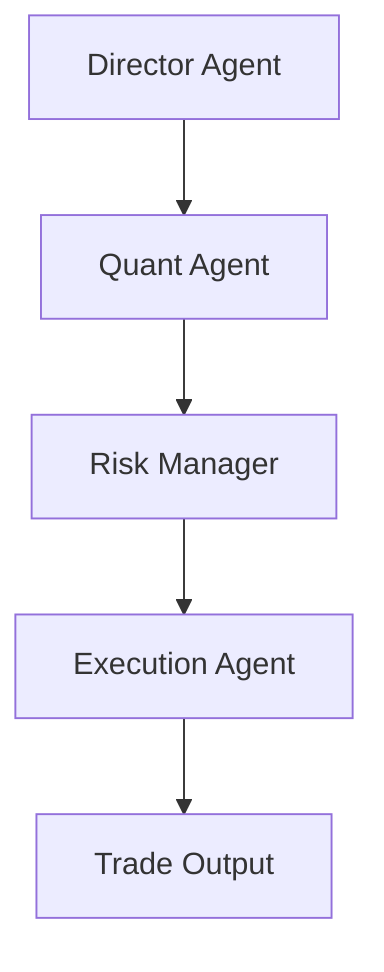

# ⚡ [QUANT-SOURCE-233] Consolidated Quant & Algo Trading Repositories
**Category**: `PORTFOLIO_OPTIMIZATION_RISK` | **Repositories in this Source**: 3
**Generated**: QUANT_BUNDLE_233_PORTFOLIO_OPTIMIZATION_RISK.md | **Target**: NotebookLM 290+ Quant Code Brain

---

## [1/3] Repository: quantstats (`WHEEL_quantstats`)
- **Full Name**: `quantstats`
- **Description**: Portfolio analytics for quants, written in Python
- **GitHub Stars**: 7640
- **Source Pool**: `cloned_trading_wheels`

### Documentation & Overview (README.md)
[](https://pypi.python.org/pypi/quantstats)
[](https://pypi.python.org/pypi/quantstats)
[](https://pypi.python.org/pypi/quantstats)
[](https://pypi.python.org/pypi/quantstats)
[](https://deepwiki.com/ranaroussi/quantstats)
[](https://github.com/ranaroussi/quantstats)
[](https://twitter.com/aroussi)

# QuantStats: Portfolio analytics for quants

**QuantStats** Python library that performs portfolio profiling, allowing quants and portfolio managers to understand their performance better by providing them with in-depth analytics and risk metrics.

[Changelog »](./CHANGELOG.md)

### QuantStats is comprised of 3 main modules:

1. `quantstats.stats` - for calculating various performance metrics, like Sharpe ratio, Win rate, Volatility, etc.
2. `quantstats.plots` - for visualizing performance, drawdowns, rolling statistics, monthly returns, etc.
3. `quantstats.reports` - for generating metrics reports, batch plotting, and creating tear sheets that can be saved as an HTML file.

---

### **NEW! Monte Carlo Simulations**


Run probabilistic risk analysis with built-in Monte Carlo simulations:

```python
mc = qs.stats.montecarlo(returns, sims=1000, bust=-0.20, goal=0.50)
print(f"Bust probability: {mc.bust_probability:.1%}")
print(f"Goal probability: {mc.goal_probability:.1%}")
mc.plot()
```

[Full Monte Carlo documentation »](./docs/montecarlo.md)

---

## Quick Start

```python
%matplotlib inline
import quantstats as qs

# extend pandas functionality with metrics, etc.
qs.extend_pandas()

# fetch the daily returns for a stock
stock = qs.utils.download_returns('META')

# show sharpe ratio
qs.stats.sharpe(stock)

# or using extend_pandas() :)
stock.sharpe()
```

Output:

```
0.7604779884378278
```

### Visualize stock performance

```python
qs.plots.snapshot(stock, title='Facebook Performance', show=True)

# can also be called via:
# stock.plot_snapshot(title='Facebook Performance', show=True)
```

Output:


### Creating a report

You can create 7 different report tearsheets:

1. `qs.reports.metrics(mode='basic|full", ...)` - shows basic/full metrics
2. `qs.reports.plots(mode='basic|full", ...)` - shows basic/full plots
3. `qs.reports.basic(...)` - shows basic metrics and plots
4. `qs.reports.full(...)` - shows full metrics and plots
5. `qs.reports.html(...)` - generates a complete report as html

Let's create an html tearsheet:

```python
# benchmark can be a pandas Series or ticker
qs.reports.html(stock, "SPY")
```

Output will generate something like this:


[View original html file](https://rawcdn.githack.com/ranaroussi/quantstats/main/docs/tearsheet.html)

### Available methods

To view a complete list of available methods, run:

```python
[f for f in dir(qs.stats) if f[0] != '_']
```

```python
['avg_loss',
 'avg_return',
 'avg_win',
 'best',
 'cagr',
 'calmar',
 'common_sense_ratio',
 'comp',
 'compare',
 'compsum',
 'conditional_value_at_risk',
 'consecutive_losses',
 'consecutive_wins',
 'cpc_index',
 'cvar',
 'drawdown_details',
 'expected_return',
 'expected_shortfall',
 'exposure',
 'gain_to_pain_ratio',
 'geometric_mean',
 'ghpr',
 'greeks',
 'implied_volatility',
 'information_ratio',
 'kelly_criterion',
 'kurtosis',
 'max_drawdown',
 'monthly_returns',
 'montecarlo',
 'montecarlo_cagr',
 'montecarlo_drawdown',
 'montecarlo_sharpe',
 'outlier_loss_ratio',
 'outlier_win_ratio',
 'outliers',
 'payoff_ratio',
 'profit_factor',
 'profit_ratio',
 'r2',
 'r_squared',
 'rar',
 'recovery_factor',
 'remove_outliers',
 'risk_of_ruin',
 'risk_return_ratio',
 'rolling_greeks',
 'ror',
 'sharpe',
 'skew',
 'sortino',
 'adjusted_sortino',
 'tail_ratio',
 'to_drawdown_series',
 'ulcer_index',
 'ulcer_performance_index',
 'upi',
 'value_at_risk',
 'var',
 'volatility',
 'win_loss_ratio',
 'win_rate',
 'worst']
```

```python
[f for f in dir(qs.plots) if f[0] != '_']
```

```python
['daily_returns',
 'distribution',
 'drawdown',
 'drawdowns_periods',
 'earnings',
 'histogram',
 'log_returns',
 'monthly_heatmap',
 'montecarlo',
 'montecarlo_distribution',
 'returns',
 'rolling_beta',
 'rolling_sharpe',
 'rolling_sortino',
 'rolling_volatility',
 'snapshot',
 'yearly_returns']
```

**\*\*\* Full documentation coming soon \*\*\***

### Important: Period-Based vs Trade-Based Metrics

QuantStats analyzes **return series** (daily, weekly, monthly returns), not discrete trade data. This means:

- **Win Rate** = percentage of periods with positive returns
- **Consecutive Wins/Losses** = consecutive positive/negative return periods
- **Payoff Ratio** = average winning period return / average losing period return
- **Profit Factor** = sum of positive returns / sum of negative returns

These metrics are **valid and useful** for:
- Systematic/algorithmic strategies with regular rebalancing
- Analyzing return-series behavior over time
- Comparing strategies on a period-by-period basis

For **discretionary traders** with multi-day trades, these period-based metrics may differ from trade-level statistics. A single 5-day trade might span 3 positive days and 2 negative days - QuantStats would count these as 3 "wins" and 2 "losses" at the daily level.

This is consistent with how all return-based analytics work (Sharpe ratio, Sortino ratio, drawdown analysis, etc.) - they operate on return periods, not discrete trade entries/exits.

---

In the meantime, you can get insights as to optional parameters for each method, by using Python's `help` method:

```python
help(qs.stats.conditional_value_at_risk)
```

```
Help on function conditional_value_at_risk in module quantstats.stats:

conditional_value_at_risk(returns, sigma=1, confidence=0.99)
    calculates the conditional daily value-at-risk (aka expected shortfall)
    quantifies the amount of tail risk an investment
```

## Installation

Install using `pip`:

```bash
$ pip install quantstats --upgrade --no-cache-dir
```

Install using `conda`:

```bash
$ conda install -c ranaroussi quantstats
```

## Requirements

* [Python](https://www.python.org) >= 3.10
* [pandas](https://github.com/pydata/pandas) >= 1.5.0
* [numpy](http://www.numpy.org) >= 1.24.0
* [scipy](https://www.scipy.org) >= 1.11.0
* [matplotlib](https://matplotlib.org) >= 3.7.0
* [seaborn](https://seaborn.pydata.org) >= 0.13.0
* [tabulate](https://bitbucket.org/astanin/python-tabulate) >= 0.9.0
* [yfinance](https://github.com/ranaroussi/yfinance) >= 0.2.40
* [plotly](https://plot.ly/) >= 5.0.0 (optional, for using `plots.to_plotly()`)

## Questions?

This is a new library... If you find a bug, please
[open an issue](https://github.com/ranaroussi/quantstats/issues).

If you'd like to contribute, a great place to look is the
[issues marked with help-wanted](https://github.com/ranaroussi/quantstats/issues?q=is%3Aopen+is%3Aissue+label%3A%22help+wanted%22).

## Known Issues

For some reason, I couldn't find a way to tell seaborn not to return the
monthly returns heatmap when instructed to save - so even if you save the plot (by passing `savefig={...}`) it will still show the plot.

## Legal Stuff

**QuantStats** is distributed under the **Apache Software License**. See the [LICENSE.txt](./LICENSE.txt) file in the release for details.

## P.S.

Please drop me a note with any feedback you have.

**Ran Aroussi**

### Core Implementation Code & Architecture
#### File: `quantstats/_plotting/__init__.py`
```python

```

#### File: `quantstats/version.py`
```python
version = "0.0.81"
```

#### File: `tests/__init__.py`
```python
# QuantStats test suite
```

#### File: `quantstats/plots.py`
```python
#!/usr/bin/env python
#
# QuantStats: Portfolio analytics for quants
# https://github.com/ranaroussi/quantstats
#
# Copyright 2019-2025 Ran Aroussi
#
# Licensed under the Apache License, Version 2.0 (the "License");
# you may not use this file except in compliance with the License.
# You may obtain a copy of the License at
#
#     http://www.apache.org/licenses/LICENSE-2.0
#
# Unless required by applicable law or agreed to in writing, software
# distributed under the License is distributed on an "AS IS" BASIS,
# WITHOUT WARRANTIES OR CONDITIONS OF ANY KIND, either express or implied.
# See the License for the specific language governing permissions and
# limitations under the License.

try:
    from pandas.plotting import register_matplotlib_converters as _rmc

    _rmc()
except ImportError:
    pass

from quantstats._plotting.wrappers import *
```

#### File: `tests/test_extend_pandas.py`
```python
"""
Tests for quantstats.extend_pandas functionality
"""

import pytest
import pandas as pd
import numpy as np

import quantstats as qs


@pytest.fixture
def sample_returns():
    """Generate sample returns as a pandas Series."""
    np.random.seed(42)
    dates = pd.date_range("2020-01-01", periods=252, freq="D")
    returns = pd.Series(np.random.randn(252) * 0.02, index=dates, name="Strategy")
    return returns


class TestExtendPandas:
    """Test extend_pandas functionality."""

    def test_extend_pandas_adds_methods(self, sample_returns):
        """Test that extend_pandas adds methods to Series."""
        qs.extend_pandas()

        # Check that quantstats methods are now available on Series
        assert hasattr(sample_returns, "sharpe")
        assert hasattr(sample_returns, "sortino")
        assert hasattr(sample_returns, "max_drawdown")
        assert hasattr(sample_returns, "cagr")

    def test_sharpe_via_pandas(self, sample_returns):
        """Test Sharpe ratio via pandas extension."""
        qs.extend_pandas()
        result = sample_returns.sharpe()
        assert np.isfinite(result)

    def test_sortino_via_pandas(self, sample_returns):
        """Test Sortino ratio via pandas extension."""
        qs.extend_pandas()
        result = sample_returns.sortino()
        assert np.isfinite(result)

    def test_max_drawdown_via_pandas(self, sample_returns):
        """Test max drawdown via pandas extension."""
        qs.extend_pandas()
        result = sample_returns.max_drawdown()
        assert result <= 0

    def test_cagr_via_pandas(self, sample_returns):
        """Test CAGR via pandas extension."""
        qs.extend_pandas()
        result = sample_returns.cagr()
        assert np.isfinite(result)

    def test_volatility_via_pandas(self, sample_returns):
        """Test volatility via pandas extension."""
        qs.extend_pandas()
        result = sample_returns.volatility()
        assert result > 0

    def test_calmar_via_pandas(self, sample_returns):
        """Test Calmar ratio via pandas extension."""
        qs.extend_pandas()
        result = sample_returns.calmar()
        assert np.isfinite(result)


class TestExtendPandasWithParams:
    """Test extend_pandas with parameters."""

    def test_sharpe_with_rf(self, sample_returns):
        """Test Sharpe with risk-free rate via pandas."""
        qs.extend_pandas()
        result_no_rf = sample_returns.sharpe(rf=0)
        result_with_rf = sample_returns.sharpe(rf=0.02)
        # Should be different
        assert result_no_rf != result_with_rf

    def test_cagr_compounded(self, sample_returns):
        """Test CAGR with compounded option via pandas."""
        qs.extend_pandas()
        result_comp = sample_returns.cagr(compounded=True)
        result_simple = sample_returns.cagr(compounded=False)
        # May or may not be different depending on returns
        assert np.isfinite(result_comp)
        assert np.isfinite(result_simple)
```

#### File: `pyproject.toml`
```python
[build-system]
requires = ["hatchling"]
build-backend = "hatchling.build"

[project]
name = "quantstats"
dynamic = ["version"]
description = "Portfolio analytics for quants"
readme = "README.md"
license = "Apache-2.0"
requires-python = ">=3.10"
authors = [
    { name = "Ran Aroussi", email = "ran@aroussi.com" },
]
keywords = [
    "quant",
    "algotrading",
    "algorithmic-trading",
    "quantitative-trading",
    "quantitative-analysis",
    "algo-trading",
    "visualization",
    "plotting",
    "portfolio",
    "finance",
]
classifiers = [
    "License :: OSI Approved :: Apache Software License",
    "Development Status :: 5 - Production/Stable",
    "Operating System :: OS Independent",
    "Intended Audience :: Developers",
    "Intended Audience :: Financial and Insurance Industry",
    "Intended Audience :: Science/Research",
    "Topic :: Office/Business :: Financial",
    "Topic :: Office/Business :: Financial :: Investment",
    "Topic :: Software Development :: Libraries",
    "Topic :: Software Development :: Libraries :: Python Modules",
    "Topic :: Scientific/Engineering",
    "Topic :: Scientific/Engineering :: Information Analysis",
    "Topic :: Scientific/Engineering :: Mathematics",
    "Programming Language :: Python :: 3",
    "Programming Language :: Python :: 3.10",
    "Programming Language :: Python :: 3.11",
    "Programming Language :: Python :: 3.12",
    "Programming Language :: Python :: 3.13",
]
dependencies = [
    "pandas>=1.5.0",
    "numpy>=1.24.0",
    "scipy>=1.11.0",
    "matplotlib>=3.7.0",
    "seaborn>=0.13.0",
    "tabulate>=0.9.0",
    "yfinance>=0.2.40",
    "python-dateutil>=2.8.0",
]

[project.optional-dependencies]
dev = [
    "pytest>=7.0.0",
    "pytest-cov>=4.0.0",
    "pyright>=1.1.0",
    "ruff>=0.1.0",
]
plotly = [
    "plotly>=5.0.0",
]

[project.urls]
Homepage = "https://github.com/ranaroussi/quantstats"
Documentation = "https://github.com/ranaroussi/quantstats"
Repository = "https://github.com/ranaroussi/quantstats"
Changelog = "https://github.com/ranaroussi/quantstats/blob/main/CHANGELOG.md"

[tool.hatch.version]
path = "quantstats/version.py"
pattern = 'version = "(?P<version>[^"]+)"'

[tool.hatch.build.targets.sdist]
include = [
    "/quantstats",
    "/README.md",
    "/CHANGELOG.md",
    "/LICENSE.txt",
]

[tool.hatch.build.targets.wheel]
packages = ["quantstats"]

[tool.pytest.ini_options]
testpaths = ["tests"]
python_files = ["test_*.py"]
python_classes = ["Test*"]
python_functions = ["test_*"]
addopts = "-v --tb=short"

[tool.pyright]
include = ["quantstats"]
exclude = ["tests"]
pythonVersion = "3.10"
typeCheckingMode = "basic"

[tool.ruff]
target-version = "py310"
line-length = 88

[tool.ruff.lint]
select = [
    "E",      # pycodestyle errors
    "W",      # pycodestyle warnings
    "F",      # pyflakes
    "I",      # isort
    "UP",     # pyupgrade
    "B",      # flake8-bugbear
    "SIM",    # flake8-simplify
]
ignore = [
    "E501",   # line too long (handled by formatter)
    "B008",   # function call in default argument
    "SIM108", # ternary operator
]

[tool.ruff.lint.isort]
known-first-party = ["quantstats"]
```


==================================================


## [2/3] Repository: AutoHedge (`WHEEL_AutoHedge`)
- **Full Name**: `AutoHedge`
- **Description**: Build your autonomous hedge fund in minutes. AutoHedge harnesses the power of swarm intelligence and AI agents to automate market analysis, risk management, and trade execution.
- **GitHub Stars**: 6127
- **Source Pool**: `cloned_trading_wheels`

### Documentation & Overview (README.md)
# AutoHedge

[](https://discord.gg/VapjxpSyHC3) [](https://www.youtube.com/@kyegomez3242) [](https://www.linkedin.com/in/kye-g-38759a207/) [](https://x.com/swarms_corp)


AutoHedge is an enterprise-grade autonomous agent hedge fund that trades on your behalf. It combines swarm intelligence and specialized AI agents to perform end-to-end market analysis, risk management, and execution with minimal human intervention.

**Current support:** Full autonomous trading on Solana. **Coming soon:** Coinbase and additional exchanges.

---

## Overview

AutoHedge is built to be the world's most powerful autonomous agent hedge fund. It runs continuous analysis, generates and validates trading theses, sizes risk, and executes orders across supported venues. The system is designed for institutional reliability: structured outputs, comprehensive logging, and a risk-first architecture that scales from single strategies to multi-venue, multi-asset deployment.

---

## Features

- **Multi-Agent Architecture**: Specialized agents for each stage of the trading pipeline
  - Director Agent: strategy and thesis generation
  - Quant Agent: technical and statistical analysis
  - Risk Management Agent: position sizing and risk assessment
  - Execution Agent: order generation and execution

- **Real-Time Market Analysis**: Integration with live market data for analysis and execution
- **Risk-First Design**: Built-in risk management and position sizing before any execution
- **Structured Output**: JSON-formatted recommendations and analysis for downstream systems
- **Enterprise Logging**: Detailed, configurable logging for audit and debugging
- **Extensible Framework**: Modular design for custom strategies and new venues

---

## Supported Venues

| Venue      | Status        | Notes                    |
|-----------|----------------|--------------------------|
| Solana    | Supported      | Full autonomous trading  |
| Coinbase  | Coming soon    | In development           |
| Other CEX | Roadmap        | Planned expansion        |

---

## Quick Start

### Installation

```bash
pip install -U autohedge
```

### Environment Variables

```bash
# Jupiter API (token price & search tools)
# Get a key at https://portal.jup.ag
JUPITER_API_KEY=

# OpenAI (experimental agents)
OPENAI_API_KEY=
ANTHROPIC_API_KEY=
WORKSPACE_DIR="agent_workspace"

# Trading
WALLET_PRIVATE_KEY=""
```

See `.env.example` for a full reference.

### Basic Usage

```python
autohedge 
```

---

## Architecture

AutoHedge uses a multi-agent pipeline where each agent has a defined responsibility:



---

## Contributing

Contributions are welcome. See [Contributing Guidelines](CONTRIBUTING.md) for details.

1. Fork the repository
2. Create a feature branch (`git checkout -b feature/AmazingFeature`)
3. Commit changes (`git commit -m 'Add some AmazingFeature'`)
4. Push to the branch (`git push origin feature/AmazingFeature`)
5. Open a Pull Request

---

## License

MIT License. See [LICENSE](LICENSE) for details.

---

## Acknowledgments

- [Swarms](https://swarms.ai) for the AI agent framework

---

## Support

- Issue Tracker: [GitHub Issues](https://github.com/The-Swarm-Corporation/AutoHedge/issues)
- Community: [Discord](https://swarms.ai)

---

AutoHedge by [The Swarm Corporation](https://github.com/The-Swarm-Corporation)

### Core Implementation Code & Architecture
#### File: `autohedge/__init__.py`
```python
from autohedge.env_loader import load_env

load_env()

from autohedge.main import AutoHedge

__all__ = ["AutoHedge"]
```

#### File: `autohedge/__main__.py`
```python
"""Run AutoHedge CLI with: python -m autohedge"""

from autohedge.cli import main

if __name__ == "__main__":
    main()
```

#### File: `autohedge/tools/tools_registry.py`
```python
from autohedge.tools.jupiter_search import search_tokens
from autohedge.tools.jupiter_price import get_token_price
from autohedge.tools.ultra_tools import execute_trade, get_holdings
from autohedge.tools.ultra_tools import get_order


def get_tools():
    return [
        search_tokens,
        get_token_price,
        execute_trade,
        get_holdings,
        get_order,
    ]
```

#### File: `example.py`
```python
from autohedge import AutoHedge  # loads .env from project root

# Initialize the trading system (tickers are derived from the task by the director)
trading_system = AutoHedge(
    name="swarms-fund",
    description="Private Hedge Fund for Swarms Corp",
)

task = "Analyze the sentiment of oil market and provide a thesis on the overall market position and expected trends."
print(trading_system.run(task=task))
```

#### File: `autohedge/tools/__init__.py`
```python
from autohedge.tools.polygon_api import (
    get_ticker_overview,
    get_balance_sheets,
    get_daily_ticker_summary,
)
from autohedge.tools.jupiter_search import search_tokens
from autohedge.tools.jupiter_price import get_token_price
from autohedge.tools.ultra_tools import (
    execute_trade,
    get_order,
    get_holdings,
)

__all__ = [
    "get_ticker_overview",
    "get_balance_sheets",
    "get_daily_ticker_summary",
    "search_tokens",
    "get_token_price",
    "execute_trade",
    "get_order",
    "get_holdings",
]
```

#### File: `autohedge/env_loader.py`
```python
"""
Load .env from project root so API keys work when running from any directory.
"""

import os
from pathlib import Path

from dotenv import load_dotenv


def find_project_env() -> Path | None:
    """Find .env by walking up from cwd (so CLI/scripts work from any subdir)."""
    cwd = Path(os.getcwd()).resolve()
    for parent in [cwd, *cwd.parents]:
        env_file = parent / ".env"
        if env_file.is_file():
            return env_file
    return None


def load_env() -> None:
    """Load .env from project root; fall back to cwd. Does not override existing env."""
    env_path = find_project_env()
    if env_path:
        load_dotenv(env_path, override=False)
    else:
        load_dotenv()


def require_openai_key() -> bool:
    """Return True if OPENAI_API_KEY is set (required for swarms gpt-4.x)."""
    return bool(os.getenv("OPENAI_API_KEY"))
```


==================================================


## [3/3] Repository: PyPortfolioOpt (`WHEEL_PyPortfolioOpt`)
- **Full Name**: `PyPortfolioOpt`
- **Description**: Financial portfolio optimization in python, including classical efficient frontier, Black-Litterman, Hierarchical Risk Parity
- **GitHub Stars**: 6030
- **Source Pool**: `cloned_trading_wheels`

### Documentation & Overview (README.md)
## Welcome to PyPortfolioOpt

<a href="https://pyportfolioopt.readthedocs.io/en/latest/"></a>

PyPortfolioOpt is a library implementing portfolio optimization methods, including
classical mean-variance optimization, Black-Litterman allocation, or shrinkage and Hierarchical Risk Parity.
PyPortfolioOpt is inspired by scikit-learn; it is **extensive** yet easily **extensible**, for casual investors, or professionals looking for an easy prototyping tool. Whether you are a fundamentals-oriented investor who has identified a
handful of undervalued picks, or an algorithmic trader who has a basket of
strategies, PyPortfolioOpt can help you combine your alpha sources in a risk-efficient way.


<!-- buttons -->

|  | **[Documentation](https://pyportfolioopt.readthedocs.io/en/latest/)** · **[Tutorials](https://github.com/pyportfolio/pyportfolioopt/tree/main/cookbook)** · **[Release Notes](https://github.com/PyPortfolio/PyPortfolioOpt/releases)** |
|---|---|
| **Open&#160;Source** | [](https://github.com/pyportfolio/pyportfolioopt/blob/main/LICENSE) [](https://gc-os-ai.github.io/) | |
| **Community** | [](https://discord.gg/7uKdHfdcJG) [](https://www.linkedin.com/company/pyportfolioopt/)  |
| **CI/CD** | [](https://github.com/pyportfolio/pyportfolioopt/actions/workflows/main.yml) [](https://pyportfolioopt.readthedocs.io/en/latest/?badge=latest) |
| **Code** |  [](https://pypi.org/project/pyportfolioopt/) [](https://www.python.org/) [](https://github.com/psf/black)  |
| **Downloads** |   [](https://pepy.tech/project/pyportfolioopt) |
| **Citation** | [JOSS article](https://joss.theoj.org/papers/10.21105/joss.03066) |


<!-- content -->

Head over to the **[documentation on ReadTheDocs](https://pyportfolioopt.readthedocs.io/en/latest/)** to get an in-depth look at the project, or check out the [cookbook](https://github.com/pyportfolio/pyportfolioopt/tree/main/cookbook) to see some examples showing the full process from downloading data to building a portfolio.

<center>

</center>

## Table of contents

- [Table of contents](#table-of-contents)
- [Getting started](#getting-started)
  - [For development](#for-development)
- [A quick example](#a-quick-example)
- [An overview of classical portfolio optimization methods](#an-overview-of-classical-portfolio-optimization-methods)
- [Features](#features)
  - [Expected returns](#expected-returns)
  - [Risk models (covariance)](#risk-models-covariance)
  - [Objective functions](#objective-functions)
  - [Adding constraints or different objectives](#adding-constraints-or-different-objectives)
  - [Black-Litterman allocation](#black-litterman-allocation)
  - [Other optimizers](#other-optimizers)
- [Advantages over existing implementations](#advantages-over-existing-implementations)
- [Project principles and design decisions](#project-principles-and-design-decisions)
- [Testing](#testing)
- [Citing PyPortfolioOpt](#citing-pyportfolioopt)
- [Contributing](#contributing)
- [Getting in touch](#getting-in-touch)

## 🚀 Installation

### Using pip

```bash
pip install pyportfolioopt
```

### From source

Clone the repository, navigate to the folder, and install using pip:

```bash
git clone https://github.com/PyPortfolio/PyPortfolioOpt.git
cd PyPortfolioOpt
pip install .
```

## Getting started

Here is an example on real life stock data,
demonstrating how easy it is to find the long-only portfolio
that maximises the Sharpe ratio (a measure of risk-adjusted returns).

```python
import pandas as pd
from pypfopt import EfficientFrontier
from pypfopt import risk_models
from pypfopt import expected_returns

# Read in price data
df = pd.read_csv("tests/resources/stock_prices.csv", parse_dates=True, index_col="date")

# Calculate expected returns and sample covariance
mu = expected_returns.mean_historical_return(df)
S = risk_models.sample_cov(df)

# Optimize for maximal Sharpe ratio
ef = EfficientFrontier(mu, S)
raw_weights = ef.max_sharpe()
cleaned_weights = ef.clean_weights()
ef.save_weights_to_file("weights.csv")  # saves to file

for name, value in cleaned_weights.items():
    print(f"{name}: {value:.4f}")
```

```result
GOOG: 0.0458
AAPL: 0.0674
FB: 0.2008
BABA: 0.0849
AMZN: 0.0352
GE: 0.0000
AMD: 0.0000
WMT: 0.0000
BAC: 0.0000
GM: 0.0000
T: 0.0000
UAA: 0.0000
SHLD: 0.0000
XOM: 0.0000
RRC: 0.0000
BBY: 0.0159
MA: 0.3287
PFE: 0.2039
JPM: 0.0000
SBUX: 0.0173
```

```python
exp_return, volatility, sharpe=ef.portfolio_performance(verbose=True)

round(exp_return, 4), round(volatility, 4), round(sharpe, 4)
```

```result
Expected annual return: 29.9%
Annual volatility: 21.8%
Sharpe Ratio: 1.38
```

This is interesting but not useful in itself.
However, PyPortfolioOpt provides a method which allows you to
convert the above continuous weights to an actual allocation
that you could buy. Just enter the most recent prices, and the desired portfolio size ($10,000 in this example):

```python
from pypfopt.discrete_allocation import DiscreteAllocation, get_latest_prices

latest_prices = get_latest_prices(df)

da = DiscreteAllocation(cleaned_weights, latest_prices, total_portfolio_value=10000)
allocation, leftover = da.greedy_portfolio()
for name, value in allocation.items():
    print(f"{name}: {value}")

print("Funds remaining: ${:.2f}".format(leftover))
```

```result
MA: 19
PFE: 57
FB: 12
BABA: 4
AAPL: 4
GOOG: 1
SBUX: 2
BBY: 2
Funds remaining: $17.46
```

_Disclaimer: nothing about this project constitues investment advice,
and the author bears no responsibiltiy for your subsequent investment decisions.
Please refer to the [license](https://github.com/PyPortfolio/PyPortfolioOpt/blob/main/LICENSE.txt) for more information._

## An overview of classical portfolio optimization methods

Harry Markowitz's 1952 paper is the undeniable classic,
which turned portfolio optimization from an art into a science.
The key insight is that by combining assets with different expected returns and volatilities,
one can decide on a mathematically optimal allocation which minimises
the risk for a target return – the set of all such optimal portfolios is referred to as the **efficient frontier**.

<center>

</center>

Although much development has been made in the subject, more than half a century later,
Markowitz's core ideas are still fundamentally important and see daily use in many portfolio management firms.
The main drawback of mean-variance optimization is that the theoretical
treatment requires knowledge of the expected returns and the future risk-characteristics (covariance) of the assets. Obviously, if we knew the expected returns of a stock life would be much easier, but the whole game is that stock returns are notoriously hard to forecast. As a substitute, we can derive estimates of the expected return and covariance based on historical data – though we do lose the theoretical guarantees provided by Markowitz, the closer our estimates are to the real values, the better our portfolio will be.

Thus this project provides four major sets of functionality (though of course they are intimately related)

- Estimates of expected returns
- Estimates of risk (i.e covariance of asset returns)
- Objective functions to be optimized
- Optimizers.

A key design goal of PyPortfolioOpt is **modularity** – the user should be able to swap in their
components while still making use of the framework that PyPortfolioOpt provides.

## Features

In this section, we detail some of PyPortfolioOpt's available functionality. More examples are offered in the Jupyter notebooks [here](https://github.com/pyportfolio/pyportfolioopt/tree/main/cookbook). Another good resource is the [tests](https://github.com/pyportfolio/pyportfolioopt/tree/main/tests).

A far more comprehensive version of this can be found on [ReadTheDocs](https://pyportfolioopt.readthedocs.io/en/latest/), as well as possible extensions for more advanced users.

### Expected returns

- Mean historical returns:
  - the simplest and most common approach, which states that the expected return of each asset is equal to the mean of its historical returns.
  - easily interpretable and very intuitive
- Exponentially weighted mean historical returns:
  - similar to mean historical returns, except it gives exponentially more weight to recent prices
  - it is likely the case that an asset's most recent returns hold more weight than returns from 10 years ago when it comes to estimating future returns.
- Capital Asset Pricing Model (CAPM):
  - a simple model to predict returns based on the beta to the market
  - this is used all over finance!

### Risk models (covariance)

The covariance matrix encodes not just the volatility of an asset, but also how it correlated to other assets. This is important because in order to reap the benefits of diversification (and thus increase return per unit risk), the assets in the portfolio should be as uncorrelated as possible.

- Sample covariance matrix:
  - an unbiased estimate of the covariance matrix
  - relatively easy to compute
  - the de facto standard for many years
  - however, it has a high estimation error, which is particularly dangerous in mean-variance optimization because the optimizer is likely to give excess weight to these erroneous estimates.
- Semicovariance: a measure of risk that focuses on downside variation.
- Exponential covariance: an improvement over sample covariance that gives more weight to recent data
- Covariance shrinkage: techniques that involve combining the sample covariance matrix with a structured estimator, to reduce the effect of erroneous weights. PyPortfolioOpt provides wrappers around the efficient vectorised implementations provided by `sklearn.covariance`.
  - manual shrinkage
  - Ledoit Wolf shrinkage, which chooses an optimal shrinkage parameter. We offer three shrinkage targets: `constant_variance`, `single_factor`, and `constant_correlation`.
  - Oracle Approximating Shrinkage
- Minimum Covariance Determinant:
  - a robust estimate of the covariance
  - implemented in `sklearn.covariance`

<p align="center">
    
</p>

(This plot was generated using `plotting.plot_covariance`)

### Objective functions

- Maximum Sharpe ratio: this results in a _tangency portfolio_ because on a graph of returns vs risk, this portfolio corresponds to the tangent of the efficient frontier that has a y-intercept equal to the risk-free rate. This is the default option because it finds the optimal return per unit risk.
- Minimum volatility. This may be useful if you're trying to get an idea of how low the volatility _could_ be, but in practice it makes a lot more sense to me to use the portfolio that maximises the Sharpe ratio.
- Efficient return, a.k.a. the Markowitz portfolio, which minimises risk for a given target return – this was the main focus of Markowitz 1952
- Efficient risk: the Sharpe-maximising portfolio for a given target risk.
- Maximum quadratic utility. You can provide your own risk-aversion level and compute the appropriate portfolio.

### Adding constraints or different objectives

- Long/short: by default all of the mean-variance optimization methods in PyPortfolioOpt are long-only, but they can be initialised to allow for short positions by changing the weight bounds:

```python
ef = EfficientFrontier(mu, S, weight_bounds=(-1, 1))
```

- Market neutrality: for the `efficient_risk` and `efficient_return` methods, PyPortfolioOpt provides an option to form a market-neutral portfolio (i.e weights sum to zero). This is not possible for the max Sharpe portfolio and the min volatility portfolio because in those cases because they are not invariant with respect to leverage. Market neutrality requires negative weights:

```python
ef = EfficientFrontier(mu, S, weight_bounds=(-1, 1))
for name, value in ef.efficient_return(target_return=0.2, market_neutral=True).items():
    print(f"{name}: {value:.4f}")
```

```result
GOOG: 0.0747
AAPL: 0.0532
FB: 0.0664
BABA: 0.0116
AMZN: 0.0518
GE: -0.0595
AMD: -0.0679
WMT: -0.0817
BAC: -0.1413
GM: -0.1402
T: -0.1371
UAA: 0.0003
SHLD: -0.0706
XOM: -0.0775
RRC: -0.0510
BBY: 0.0349
MA: 0.3758
PFE: 0.1112
JPM: 0.0141
SBUX: 0.0330
```

- Minimum/maximum position size: it may be the case that you want no security to form more than 10% of your portfolio. This is easy to encode:

```python
ef = EfficientFrontier(mu, S, weight_bounds=(0, 0.1))
```

One issue with mean-variance optimization is that it leads to many zero-weights. While these are
"optimal" in-sample, there is a large body of research showing that this characteristic leads
mean-variance portfolios to underperform out-of-sample. To that end, I have introduced an
objective function that can reduce the number of negligible weights for any of the objective functions. Essentially, it adds a penalty (parameterised by `gamma`) on small weights, with a term that looks just like L2 regularisation in machine learning. It may be necessary to try several `gamma` values to achieve the desired number of non-negligible weights. For the test portfolio of 20 securities, `gamma ~ 1` is sufficient

```python
from pypfopt import objective_functions
ef = EfficientFrontier(mu, S)
ef.add_objective(objective_functions.L2_reg, gamma=1)
for name, value in ef.max_sharpe().items():
    print(f"{name}: {value:.4f}")
```

```result
GOOG: 0.0820
AAPL: 0.0919
FB: 0.1074
BABA: 0.0680
AMZN: 0.1011
GE: 0.0309
AMD: 0.0000
WMT: 0.0353
BAC: 0.0002
GM: 0.0000
T: 0.0274
UAA: 0.0183
SHLD: 0.0000
XOM: 0.0466
RRC: 0.0024
BBY: 0.0645
MA: 0.1426
PFE: 0.0841
JPM: 0.0279
SBUX: 0.0695
```

### Black-Litterman allocation

Pyportfolioopt supports Black-Litterman asset allocation, which allows you to combine
a prior estimate of returns (e.g the market-implied returns) with your own views to form a
posterior estimate. This results in much better estimates of expected returns than just using
the mean historical return. Check out the [docs](https://pyportfolioopt.readthedocs.io/en/latest/BlackLitterman.html) for a discussion of the theory, as well as advice
on formatting inputs.

```python
from pypfopt import risk_models, BlackLittermanModel

S = risk_models.sample_cov(df)
viewdict = {"AAPL": 0.20, "BBY": -0.30, "BAC": 0, "SBUX": -0.2, "T": 0.131321}
bl = BlackLittermanModel(S, pi="equal", absolute_views=viewdict, omega="default")
rets = bl.bl_returns()

ef = EfficientFrontier(rets, S)
for name, value in ef.max_sharpe().items():
    print(f"{name}: {value:.4f}")
```

```result
GOOG: 0.0000
AAPL: 0.1749
FB: 0.0503
BABA: 0.0951
AMZN: 0.0000
GE: 0.0000
AMD: 0.0000
WMT: 0.0000
BAC: 0.0000
GM: 0.0000
T: 0.5235
UAA: 0.0000
SHLD: 0.0000
XOM: 0.1298
RRC: 0.0000
BBY: 0.0000
MA: 0.0000
PFE: 0.0264
JPM: 0.0000
SBUX: 0.0000
```

### Other optimizers

The features above mostly pertain to solving mean-variance optimization problems via quadratic programming (though this is taken care of by `cvxpy`). However, we offer different optimizers as well:

- Mean-semivariance optimization
- Mean-CVaR optimization
- Hierarchical Risk Parity, using clustering algorithms to choose uncorrelated assets
- Markowitz's critical line algorithm (CLA)

Please refer to the [documentation](https://pyportfolioopt.readthedocs.io/en/latest/OtherOptimizers.html) for more.

## Advantages over existing implementations

- Includes both classical methods (Markowitz 1952 and Black-Litterman), suggested best practices
  (e.g covariance shrinkage), along with many recent developments and novel
  features, like L2 regularisation, shrunk covariance, hierarchical risk parity.
- Native support for pandas dataframes: easily input your daily prices data.
- Extensive practical tests, which use real-life data.
- Easy to combine with your proprietary strategies and models.
- Robust to missing data, and price-series of different lengths (e.g FB data
  only goes back to 2012 whereas AAPL data goes back to 1980).

## Project principles and design decisions

- It should be easy to swap out individual components of the optimization process
  with the user's proprietary improvements.
- Usability is everything: it is better to be self-explanatory than consistent.
- There is no point in portfolio optimization unless it can be practically
  applied to real asset prices.
- Everything that has been implemented should be tested.
- Inline documentation is good: dedicated (separate) documentation is better.
  The two are not mutually exclusive.
- Formatting should never get in the way of coding: because of this,
  I have deferred **all** formatting decisions to [Black](https://github.com/psf/black).

## Testing

Tests are written in pytest (much more intuitive than `unittest` and the variants in my opinion), and I have tried to ensure close to 100% coverage. Run the tests by navigating to the package directory and simply running `pytest` on the command line.

PyPortfolioOpt provides a test dataset of daily returns for 20 tickers:

```python
['GOOG', 'AAPL', 'FB', 'BABA', 'AMZN', 'GE', 'AMD', 'WMT', 'BAC', 'GM', 'T', 'UAA', 'SHLD', 'XOM', 'RRC', 'BBY', 'MA', 'PFE', 'JPM', 'SBUX']
```

These tickers have been informally selected to meet several criteria:

- reasonably liquid
- different performances and volatilities
- different amounts of data to test robustness

Currently, the tests have not explored all of the edge cases and combinations
of objective functions and parameters. However, each method and parameter has
been tested to work as intended.

## Citing PyPortfolioOpt

If you use PyPortfolioOpt for published work, please cite the [JOSS paper](https://joss.theoj.org/papers/10.21105/joss.03066).

Citation string:

```text
Martin, R. A., (2021). PyPortfolioOpt: portfolio optimization in Python. Journal of Open Source Software, 6(61), 3066, https://doi.org/10.21105/joss.03066
```

BibTex::

```bibtex
@article{Martin2021,
  doi = {10.21105/joss.03066},
  url = {https://doi.org/10.21105/joss.03066},
  year = {2021},
  publisher = {The Open Journal},
  volume = {6},
  number = {61},
  pages = {3066},
  author = {Robert Andrew Martin},
  title = {PyPortfolioOpt: portfolio optimization in Python},
  journal = {Journal of Open Source Software}
}
```

## Contributing

Contributions are _most welcome_. Have a look at the [Contribution Guide](https://github.com/PyPortfolio/PyPortfolioOpt/blob/main/CONTRIBUTING.md) for more.

We'd like to thank all of the people who have contributed to PyPortfolioOpt since its release in 2018.
Special shout-outs to:

- Tuan Tran
- Philipp Schiele
- Carl Peasnell
- Felipe Schneider
- Dingyuan Wang
- Pat Newell
- Aditya Bhutra
- Thomas Schmelzer
- Rich Caputo
- Franz Kiraly
- Nicolas Knudde

### Core Implementation Code & Architecture
#### File: `tests/__init__.py`
```python

```

#### File: `pypfopt/base/__init__.py`
```python
"""Base classes."""

from pypfopt.base._base_optimizer import (
    BaseConvexOptimizer,
    BaseOptimizer,
    portfolio_performance,
)

__all__ = ["BaseOptimizer", "BaseConvexOptimizer", "portfolio_performance"]
```

#### File: `pypfopt/base_optimizer.py`
```python
"""Exports for _base_optimizer.py, for downwards compatibility."""

from pypfopt.base._base_optimizer import (
    BaseConvexOptimizer,
    BaseOptimizer,
    portfolio_performance,
)

__all__ = ["BaseOptimizer", "BaseConvexOptimizer", "portfolio_performance"]
```

#### File: `pypfopt/efficient_frontier/__init__.py`
```python
"""
The ``efficient_frontier`` module houses the EfficientFrontier class and its descendants,
which generate optimal portfolios for various possible objective functions and parameters.
"""

from .efficient_cdar import EfficientCDaR
from .efficient_cvar import EfficientCVaR
from .efficient_frontier import EfficientFrontier
from .efficient_semivariance import EfficientSemivariance

__all__ = [
    "EfficientFrontier",
    "EfficientCVaR",
    "EfficientSemivariance",
    "EfficientCDaR",
]
```

#### File: `pypfopt/exceptions.py`
```python
"""
The ``exceptions`` module houses custom exceptions. Currently implemented:

- OptimizationError
"""


class OptimizationError(Exception):
    """
    When an optimization routine fails – usually, this means
    that cvxpy has not returned the "optimal" flag.
    """

    def __init__(self, *args, **kwargs):
        default_message = (
            "Please check your objectives/constraints or use a different solver."
        )
        super().__init__(default_message, *args, **kwargs)


class InstantiationError(Exception):
    """
    Errors related to the instantiation of pypfopt objects, e.g adding constraints to an
    already-solved problem
    """

    pass
```

#### File: `pypfopt/__init__.py`
```python
from .black_litterman import (
    BlackLittermanModel,
    market_implied_prior_returns,
    market_implied_risk_aversion,
)
from .cla import CLA
from .discrete_allocation import DiscreteAllocation, get_latest_prices
from .efficient_frontier import (
    EfficientCDaR,
    EfficientCVaR,
    EfficientFrontier,
    EfficientSemivariance,
)
from .hierarchical_portfolio import HRPOpt
from .risk_models import CovarianceShrinkage

__version__ = "1.6.0"

__all__ = [
    "market_implied_prior_returns",
    "market_implied_risk_aversion",
    "BlackLittermanModel",
    "CLA",
    "get_latest_prices",
    "DiscreteAllocation",
    "EfficientFrontier",
    "EfficientSemivariance",
    "EfficientCVaR",
    "EfficientCDaR",
    "HRPOpt",
    "CovarianceShrinkage",
]
```


==================================================
