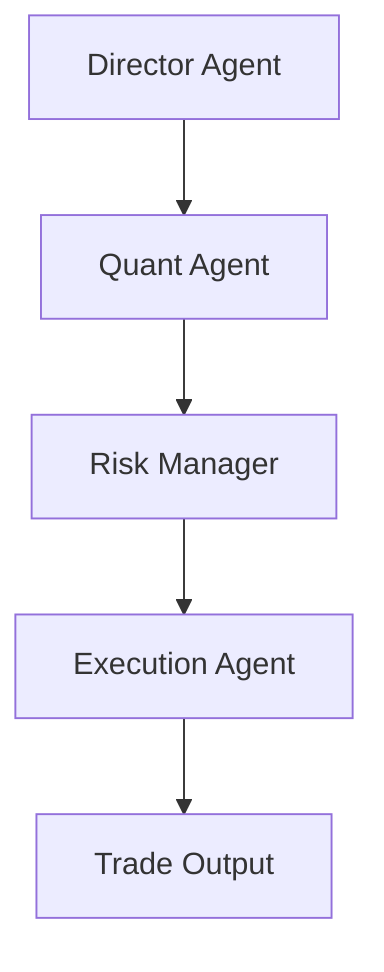

# 🏛️ NotebookLM Quant Source: 10_CLONED_PHYSICAL_WHEELS

**Total Grounded Repositories in this Volume**: 103
**Compilation Date**: September 16, 2026

---

## 1. wallstreet
- **Repository ID**: `REPO_WALLSTREET`
- **Primary Domain**: `Cloned Physical Wheel`
- **Remote URL**: [https://github.com/mcdallas/wallstreet.git](https://github.com/mcdallas/wallstreet.git)
- **Local Disk Path**: `/Users/rajondas/teamwork_projects/sovereign-quant-os/cloned_trading_wheels/wallstreet`
- **Description**: Institutional physical trading wheel: wallstreet

### 📖 Architecture & Technical Specifications (README Extract):
```markdown
Wallstreet: Real time Stock and Option tools
--------------------------------------------

Wallstreet is a Python 3 library for monitoring and analyzing real time Stock and
Option data. Quotes are provided from the Google Finance API. Wallstreet requires
minimal input from the user, it uses available online data to calculate option
greeks and even scrapes the US Treasury website to get the current risk free rate.


Usage
-----

Stocks:

.. code-block:: Python

  from wallstreet import Stock, Call, Put

  >>> s = Stock('AAPL')
  >>> s.price
  96.44
  >>> s.price
  96.48
  >>> s.change
  -0.35
  >>> s.last_trade
  '21 Jan 2016 13:32:12'

Options:

.. code-block:: Python

  >>> g = Call('GOOG', d=12, m=2, y=2016, strike=700)
  >>> g.price
  38.2
  >>> g.implied_volatility()
  0.49222968442691889
  >>> g.delta()
  0.56522039722040063
  >>> g.vega()
  0.685034827159825
  >>> g.underlying.price
  706.59

Alternative construction:

.. code-block:: Python

  >>> g = Call('GOOG', d=12, m=2, y=2016)
  >>> g
  Call(ticker=GOOG, expiration='12-02-2016')
  >>> g.strikes
  (580, 610, 620, 630, 640, 650, 660, 670, 680, 690, 697.5, 700, 702.5, 707.5, 710, 712.5, 715, 720, ...)
  >>> g.set_strike(712.5)
  >>> g
  Call(ticker=GOOG, expiration='12-02-2016', strike=712.5)

or

.. code-block:: Python

  >>> g = Put("GOOG")
  'No options listed for given date, using 22-01-2016 instead'
  >>> g.expirations
  ['22-01-2016', '29-01-2016', '05-02-2016', '12-02-2016', '19-02-2016', '26-02-2016', '04-03-2016', ...]
  >>> g
  Put(ticker=GOOG, expiration='22-01-2016')

Yahoo Finance Support (keep in mind that YF quotes might be delayed):

.. code-block:: Python

    >>> apple = Stock('AAPL', source='yahoo')
    >>> call = Call('AAPL', strike=apple.price, source='yahoo')
    No options listed for given date, using '26-05-2017' instead
    No option for given strike, using 155 instead

Download historical data (requires pandas)

.. code-block:: Python

    s = Stock('BTC-USD')
    >>> df = s.historical(days_back=30, frequency='d')
    >>> df
             Date          Open          High           Low         Close     Adj Close      Volume
    0  2019-07-10  12567.019531  13183.730469  11569.940430  12099.120117  12099.120117  1554955347
    1  2019-07-11  12099.120117  12099.910156  11002.389648  11343.120117  11343.120117  1185222449
    2  2019-07-12  11343.120117  11931.910156  11096.610352  11797.370117  11797.370117   647690095
    3  2019-07-13  11797.370117  11835.870117  10827.530273  11363.969727  11363.969727   668325183
    4  2019-07-14  11363.969727  11447.919922  10118.849609  10204.410156  10204.410156   814667763
    5  2019-07-15  10204.410156  11070.179688   9877.019531  10850.259766  10850.259766   965178341
    6  2019-07-16  10850.259766  11025.759766   9366.820313   9423.440430   9423.440430  1140137759
    7  2019-07-17   9423.440430   9982.240234   9086.509766   9696.150391   9696.150391   965256823
    8  2019-07-18   9696.150391  10776.540039   9292.610352  10638.349609  10638.349609  1033842556
    9  2019-07-19  10638.349609  10757.410156  10135.160156  10532.940430  10532.940430   658190962
    10 2019-07-20  10532.940430  11094.320313  10379.190430  10759.419922  10759.419922   608954333
    11 2019-07-21  10759.419922  10833.990234  10329.889648  10586.709961  10586.709961   405339891
    12 2019-07-22  10586.709961  10676.599609  10072.070313  10325.870117  10325.870117   524442852
    13 2019-07-23  10325.870117  10328.440430   9820.6
```

---

## 2. orjson
- **Repository ID**: `REPO_ORJSON`
- **Primary Domain**: `Cloned Physical Wheel`
- **Remote URL**: [https://github.com/ijl/orjson.git](https://github.com/ijl/orjson.git)
- **Local Disk Path**: `/Users/rajondas/teamwork_projects/sovereign-quant-os/cloned_trading_wheels/orjson`
- **Description**: Institutional physical trading wheel: orjson

### 📖 Architecture & Technical Specifications (README Extract):
```markdown
# orjson

orjson is a fast, correct JSON library for Python. It
[benchmarks](https://github.com/ijl/orjson?tab=readme-ov-file#performance) as the fastest Python
library for JSON and is more correct than the standard json library or other
third-party libraries. It serializes
[dataclass](https://github.com/ijl/orjson?tab=readme-ov-file#dataclass),
[datetime](https://github.com/ijl/orjson?tab=readme-ov-file#datetime),
[numpy](https://github.com/ijl/orjson?tab=readme-ov-file#numpy), and
[UUID](https://github.com/ijl/orjson?tab=readme-ov-file#uuid) instances natively.

[orjson.dumps()](https://github.com/ijl/orjson?tab=readme-ov-file#serialize) is
something like 10x as fast as `json`, serializes
common types and subtypes, has a `default` parameter for the caller to specify
how to serialize arbitrary types, and has a number of flags controlling output.

[orjson.loads()](https://github.com/ijl/orjson?tab=readme-ov-file#deserialize)
is something like 2x as fast as `json`, and is strictly compliant with UTF-8 and
RFC 8259 ("The JavaScript Object Notation (JSON) Data Interchange Format").

Reading from and writing to files, line-delimited JSON files, and so on is
not provided by the library.

orjson supports CPython 3.10, 3.11, 3.12, 3.13, 3.14, and 3.15.

It distributes amd64/x86_64/x64, i686/x86, aarch64/arm64/armv8, and armv7 wheels
for Linux, amd64 and aarch64 wheels
for macOS, and amd64, i686, and aarch64 wheels for Windows.

Wheels published to PyPI for amd64 run on x86-64-v1 (2003)
or later, but will at runtime use AVX-512 if available for a
significant performance benefit; aarch64 wheels run on ARMv8-A (2011) or
later.

orjson does not and will not support PyPy, embedded Python builds for
Android/iOS, or PEP 554 subinterpreters.

orjson may support PEP 703 free-threading when it is stable.

Releases follow semantic versioning and serializing a new object type
without an opt-in flag is considered a breaking change.

orjson contains source code licensed under the Mozilla Public License 2.0,
Apache 2.0, and MIT licenses. The repository from which PyPI artifacts are
published is [github.com/ijl/orjson](https://github.com/ijl/orjson) and an
alternative repository is [codeberg.org/ijl/orjson](https://codeberg.org/ijl/orjson).
There is no open issue tracker or pull requests due to signal-to-noise ratio.
There is a [CHANGELOG](https://github.com/ijl/orjson/blob/master/CHANGELOG.md)
available in the repository.

1. [Usage](https://github.com/ijl/orjson?tab=readme-ov-file#usage)
    1. [Install](https://github.com/ijl/orjson?tab=readme-ov-file#install)
    2. [Quickstart](https://github.com/ijl/orjson?tab=readme-ov-file#quickstart)
    3. [Migrating](https://github.com/ijl/orjson?tab=readme-ov-file#migrating)
    4. [Serialize](https://github.com/ijl/orjson?tab=readme-ov-file#serialize)
        1. [default](https://github.com/ijl/orjson?tab=readme-ov-file#default)
        2. [option](https://github.com/ijl/orjson?tab=readme-ov-file#option)
        3. [Fragment](https://github.com/ijl/orjson?tab=readme-ov-file#fragment)
    5. [Deserialize](https://github.com/ijl/orjson?tab=readme-ov-file#deserialize)
2. [Types](https://github.com/ijl/orjson?tab=readme-ov-file#types)
    1. [dataclass](https://github.com/ijl/orjson?tab=readme-ov-file#dataclass)
    2. [datetime](https://github.com/ijl/orjson?tab=readme-ov-file#datetime)
    3. [enum](https://github.com/ijl/orjson?tab=readme-ov-file#enum)
    4. [float](https://github.com/ijl/orjson?tab=readme-ov-fil
```

---

## 3. yfinance
- **Repository ID**: `REPO_YFINANCE`
- **Primary Domain**: `Cloned Physical Wheel`
- **Remote URL**: [https://github.com/ranaroussi/yfinance.git](https://github.com/ranaroussi/yfinance.git)
- **Local Disk Path**: `/Users/rajondas/teamwork_projects/sovereign-quant-os/cloned_trading_wheels/yfinance`
- **Description**: Institutional physical trading wheel: yfinance

### 📖 Architecture & Technical Specifications (README Extract):
```markdown


# Download market data from Yahoo! Finance's API

<a target="new" href="https://pypi.python.org/pypi/yfinance"></a>
<a target="new" href="https://pypi.python.org/pypi/yfinance"></a>
<a target="new" href="https://pypi.python.org/pypi/yfinance"></a>
<a target="new" href="https://pypi.python.org/pypi/yfinance"></a>
<a target="new" href="https://github.com/ranaroussi/yfinance"></a>
<a target="new" href="https://x.com/intent/follow?screen_name=aroussi"></a>

<a href="https://trendshift.io/repositories/4578" target="_blank"></a>

**yfinance** offers a Pythonic way to fetch financial & market data from [Yahoo!Ⓡ finance](https://finance.yahoo.com).

---

> [!IMPORTANT]  
> **Yahoo!, Y!Finance, and Yahoo! finance are registered trademarks of Yahoo, Inc.**
>
> yfinance is **not** affiliated, endorsed, or vetted by Yahoo, Inc. It's an open-source tool that uses Yahoo's publicly available APIs, and is intended for research and educational purposes.
> 
> **You should refer to Yahoo!'s terms of use** ([here](https://policies.yahoo.com/us/en/yahoo/terms/product-atos/apiforydn/index.htm), [here](https://legal.yahoo.com/us/en/yahoo/terms/otos/index.html), and [here](https://policies.yahoo.com/us/en/yahoo/terms/index.htm)) **for details on your rights to use the actual data downloaded.
>
> Remember - the Yahoo! finance API is intended for personal use only.**

---

> [!TIP]
> THE NEW DOCUMENTATION WEBSITE IS NOW LIVE! 🤘
> 
> Visit [**ranaroussi.github.io/yfinance**](https://ranaroussi.github.io/yfinance)

---

## Main components

- `Ticker`: single ticker data
- `Tickers`: multiple tickers' data
- `download`: download market data for multiple tickers
- `Market`: get information about a market
- `WebSocket` and `AsyncWebSocket`: live streaming data
- `Search`: quotes and news from search
- `Sector` and `Industry`: sector and industry information
- `EquityQuery` and `Screener`: build query to screen market

## Installation

Install `yfinance` from PYPI using `pip`:

``` {.sourceCode .bash}
$ pip install yfinance
```

To install without `curl_cffi` for requests fallback, see [Advanced ▸ Installation](https://ranaroussi.github.io/yfinance/advanced/install.html).

### [yfinance relies on the community to investigate bugs and contribute code. Here's how you can help.](https://github.com/ranaroussi/yfinance/blob/main/CONTRIBUTING.md)

---


---

### Legal Stuff

**yfinance** is distribut
```

---

## 4. backtesting.py
- **Repository ID**: `REPO_BACKTESTING_PY`
- **Primary Domain**: `Cloned Physical Wheel`
- **Remote URL**: [https://github.com/kernc/backtesting.py.git](https://github.com/kernc/backtesting.py.git)
- **Local Disk Path**: `/Users/rajondas/teamwork_projects/sovereign-quant-os/cloned_trading_wheels/backtesting.py`
- **Description**: Institutional physical trading wheel: backtesting.py

### 📖 Architecture & Technical Specifications (README Extract):
```markdown
[](https://kernc.github.io/backtesting.py/)

Backtesting.py
==============
[](https://github.com/kernc/backtesting.py/actions)
[](https://codecov.io/gh/kernc/backtesting.py)
[](https://ghloc.vercel.app/kernc/backtesting.py)
[](https://pypi.org/project/backtesting)
[](https://pypistats.org/packages/backtesting)
[](https://pypistats.org/packages/backtesting)
[](https://github.com/kernc/backtesting.py)
[](https://github.com/sponsors/kernc)

Backtest trading strategies with Python.

[**Project website**](https://kernc.github.io/backtesting.py) + [Documentation] &nbsp;&nbsp;|&nbsp; [YouTube]

[Documentation]: https://kernc.github.io/backtesting.py/doc/backtesting/
[YouTube]: https://www.youtube.com/results?q=%22backtesting.py%22

Installation
------------

    $ pip install backtesting

Or if you prefer the bleeding edge:

    $ pip install git+https://github.com/kernc/backtesting.py


Usage
-----
```python
from backtesting import Backtest, Strategy
from backtesting.lib import crossover

from backtesting.test import SMA, GOOG


class SmaCross(Strategy):
    def init(self):
        price = self.data.Close
        self.ma1 = self.I(SMA, price, 10)
        self.ma2 = self.I(SMA, price, 20)

    def next(self):
        if crossover(self.ma1, self.ma2):
            self.buy()
        elif crossover(self.ma2, self.ma1):
            self.sell()


bt = Backtest(GOOG, SmaCross, commission=.002,
              exclusive_orders=True)
stats = bt.run()
bt.plot()
```

Results in:

```text
Start                     2004-08-19 00:00:00
End                       2013-03-01 00:00:00
Duration                   3116 days 00:00:00
Exposure Time [%]                       94.27
Equity Final [$]                     68935.12
Equity Peak [$]                      68991.22
Return [%]                             589.35
Buy & Hold Return [%]                  703.46
Return (Ann.) [%]                       25.42
Volatility (Ann.) [%]                   38.43
CAGR [%]                                16.80
Sharpe Ratio                             0.66
Sortino Ratio                            1.30
Calmar Ratio                             0.77
Alpha [%]                              450.62
Beta                                     0.02
Max. Drawdown [%]                      -33.08
Avg. Drawdown [%]                       -5.58
Max. Drawdown Duration      688 days 00:00:00
Avg. Drawdown Duration       41 days 00:00:00
# Trades                                   93
Win Rate [%]   
```

---

## 5. ta-lib
- **Repository ID**: `REPO_TA_LIB`
- **Primary Domain**: `Cloned Physical Wheel`
- **Remote URL**: [https://github.com/mrjbq7/ta-lib.git](https://github.com/mrjbq7/ta-lib.git)
- **Local Disk Path**: `/Users/rajondas/teamwork_projects/sovereign-quant-os/cloned_trading_wheels/ta-lib`
- **Description**: Institutional physical trading wheel: ta-lib

### 📖 Architecture & Technical Specifications (README Extract):
```markdown
# TA-Lib 📈

<!-- Badges -->

[](https://github.com/ta-lib/ta-lib-python/releases)
[](https://pypi.org/project/TA-Lib/)
[](https://pypi.org/project/TA-Lib/#files)
[](https://pypi.org/project/TA-Lib/)
[](https://opensource.org/licenses/BSD-2-Clause)

This is a Python wrapper for [TA-LIB](http://ta-lib.org) based on Cython
instead of SWIG. From the homepage:

> TA-Lib is widely used by trading software developers requiring to perform
> technical analysis of financial market data.
>
> * Includes 150+ indicators such as ADX, MACD, RSI, Stochastic, Bollinger
>   Bands, etc.
> * Candlestick pattern recognition
> * Open-source API for C/C++, Java, Perl, Python and 100% Managed .NET

The original Python bindings included with TA-Lib use
[SWIG](http://swig.org) which unfortunately are difficult to install and
aren't as efficient as they could be. Therefore this project uses
[Cython](https://cython.org) and [Numpy](https://numpy.org) to efficiently
and cleanly bind to TA-Lib - producing results 2-4 times faster than the
SWIG interface.

In addition, this project also supports the use of the
[Polars](https://www.pola.rs) and [Pandas](https://pandas.pydata.org)
libraries.

## Versions 🗂️

The upstream TA-Lib C library released version 0.6.1 and changed the library
name to `-lta-lib` from `-lta_lib`. After trying to support both via
autodetect and having some issues, we have decided to currently support three
feature branches:

* `ta-lib-python` 0.4.x (supports `ta-lib` 0.4.x and `numpy` 1)
* `ta-lib-python` 0.5.x (supports `ta-lib` 0.4.x and `numpy` 2)
* `ta-lib-python` 0.6.x (supports `ta-lib` 0.6.x and `numpy` 2)

## Installation 💾

You can install from PyPI:

```shell
python -m pip install TA-Lib
```

Or checkout the sources and run `setup.py` yourself:

```shell
python setup.py install
```

It also appears possible to install via [Conda Forge](https://anaconda.org/conda-forge/ta-lib):

```shell
conda install -c conda-forge ta-lib
```

### Dependencies 🧩

To use TA-Lib for python, you need to have the [TA-Lib](http://ta-lib.org)
already installed. You should probably follow their [installation
directions](https://ta-lib.org/install/) for your platform, but some
suggestions are included below for reference.

> Some Conda Forge users have reported success installing the underlying TA-Lib C
> library using [the libta-lib package](https://anaconda.org/conda-forge/libta-lib):
>
> ``$ conda install -c conda-forge libta-lib``

#### Mac OS X

You can simply install using Homebrew:

```shell
brew install ta-lib
```

If you are using Apple Silicon, such as the M1 processors, and building mixed
architecture Homebrew projects, you might want to make sure it's being built
for your architecture:

```shell
arch -arm64 brew install ta-lib
```

And perhaps you can set these before installing with `pip`:

```shell
export TA_INCLUDE_PATH="$(brew --prefix ta-lib)/include"
export TA_LIBRARY_PATH="$(brew --prefix ta-lib)/lib"
```

You might also find this helpful, particularly if you have tried several
different installations withou
```

---

## 6. FinRL
- **Repository ID**: `REPO_FINRL`
- **Primary Domain**: `Cloned Physical Wheel`
- **Remote URL**: [https://github.com/AI4Finance-Foundation/FinRL.git](https://github.com/AI4Finance-Foundation/FinRL.git)
- **Local Disk Path**: `/Users/rajondas/teamwork_projects/sovereign-quant-os/cloned_trading_wheels/FinRL`
- **Description**: Institutional physical trading wheel: FinRL

### 📖 Quantitative Capabilities & Interface:
- Implements specialized mathematical routines for Cloned Physical Wheel.
- Compatible with Python 3.14 / C++17 native bindings in Antigravity OS.

---

## 7. qlib
- **Repository ID**: `REPO_QLIB`
- **Primary Domain**: `Cloned Physical Wheel`
- **Remote URL**: [https://github.com/microsoft/qlib.git](https://github.com/microsoft/qlib.git)
- **Local Disk Path**: `/Users/rajondas/teamwork_projects/sovereign-quant-os/cloned_trading_wheels/qlib`
- **Description**: Institutional physical trading wheel: qlib

### 📖 Architecture & Technical Specifications (README Extract):
```markdown
[](https://pypi.org/project/pyqlib/#files)
[](https://pypi.org/project/pyqlib/#files)
[](https://pypi.org/project/pyqlib/#history)
[](https://pypi.org/project/pyqlib/)
[](https://github.com/microsoft/qlib/actions)
[](https://qlib.readthedocs.io/en/latest/?badge=latest)
[](LICENSE)
[](https://gitter.im/Microsoft/qlib?utm_source=badge&utm_medium=badge&utm_campaign=pr-badge&utm_content=badge)

## :newspaper: **What's NEW!** &nbsp;   :sparkling_heart: 

Recent released features

### Introducing <a href="https://github.com/microsoft/RD-Agent"></a>: LLM-Based Autonomous Evolving Agents for Industrial Data-Driven R&D

We are excited to announce the release of **RD-Agent**📢, a powerful tool that supports automated factor mining and model optimization in quant investment R&D.

RD-Agent is now available on [GitHub](https://github.com/microsoft/RD-Agent), and we welcome your star🌟!

To learn more, please visit the [RD-Agent repository](https://github.com/microsoft/RD-Agent). We have prepared several public demo videos for you:

| Scenario | Demo video (English) | Demo video (中文) |
| --                      | ------    | ------    |
| Quant Factor Mining | [YouTube](https://www.youtube.com/watch?v=X4DK2QZKaKY&t=6s) | [YouTube](https://www.youtube.com/watch?v=X4DK2QZKaKY&t=6s) |
| Quant Factor Mining from reports | [YouTube](https://www.youtube.com/watch?v=ECLTXVcSx-c) | [YouTube](https://www.youtube.com/watch?v=ECLTXVcSx-c) |
| Quant Model Optimization | [YouTube](https://www.youtube.com/watch?v=dm0dWL49Bc0&t=104s) | [YouTube](https://www.youtube.com/watch?v=dm0dWL49Bc0&t=104s) |

- 📃**Paper**: [R&D-Agent-Quant: A Multi-Agent Framework for Data-Centric Factors and Model Joint Optimization](https://arxiv.org/abs/2505.15155)
- 👾**Code**: https://github.com/microsoft/RD-Agent/
```BibTeX
@misc{li2025rdagentquant,
    title={R\&D-Agent-Quant: A Multi-Agent Framework for Data-Centric Factors and Model Joint Optimization},
    author={Yuante Li and Xu Yang and Xiao Yang and Minrui Xu and Xisen Wang and Weiqing Liu and Jiang Bian},
    year={2025},
    eprint={2505.15155},
    archivePrefix={arXiv},
    primaryClass={cs.AI}
}
```


***

| Feature | Status |
| --                      | ------    |
| [R&D-Agent-Quant](https://arxiv.org/abs/2505.15155) Published | Apply R&D-Agent to Qlib for quant trading | 
| BPQP for End-to-end learning | 📈Coming soon!([Under review](https://github.com/microsoft/qlib/pull/1863)) |
| 🔥LLM-driven Auto Quant Factory🔥 | 🚀 Released in [♾️RD-Agent](https://github.com/microsoft/RD-Agent) on Aug 8, 2024 |
| KRNN and Sandwich models | :chart_with_upwards_trend: [Released](https://github.com/microso
```

---

## 8. finmarketpy
- **Repository ID**: `REPO_FINMARKETPY`
- **Primary Domain**: `Cloned Physical Wheel`
- **Remote URL**: [https://github.com/cuemacro/finmarketpy.git](https://github.com/cuemacro/finmarketpy.git)
- **Local Disk Path**: `/Users/rajondas/teamwork_projects/sovereign-quant-os/cloned_trading_wheels/finmarketpy`
- **Description**: Institutional physical trading wheel: finmarketpy

### 📖 Architecture & Technical Specifications (README Extract):
```markdown


# [finmarketpy (formerly pythalesians)](https://github.com/cuemacro/finmarketpy)

[](https://pepy.tech/project/finmarketpy)

finmarketpy is a Python based library that enables you to analyze market data and also to backtest trading strategies using
a simple to use API, which has prebuilt templates for you to define backtest. Included in the library

* Prebuilt templates for backtesting trading strategies
* Display historical returns for trading strategies
* Investigate seasonality of trading strategies
* Conduct market event studies around data events
* In built calculator for risk weighting using volatility targeting
* Written in object oriented way to make code more reusable

*Contributors for the project are very much welcome, see below!*

# Merging with pythalesians
I had previously written the open source PyThalesians financial library (which has been merged with this - so can focus on maintaining
one set of libraries). This new finmarketpy library has
* Similar functionality to the trading part of pythalesians
* Rewritten the API to make it much cleaner and easier to use, as well as having many
new features.
* finmarketpy requires the libraries, which I've written chartpy (for charts) and findatapy (for loading market data) to function
* By splitting up into smaller more specialised libraries, it should make it easier for contributors
* Using findatapy, you can download market data easily from Bloomberg, Quandl, Yahoo etc
* Using chartpy, you can choose to have results displayed in matplotlib, plotly or bokeh by changing single keyword!

Points to note:
* Please bear in mind at present finmarketpy is under continual development. The API is heavily documented, but we are
looking to add more general documentation.
* Uses Apache 2.0 licence

# Gallery

Calculate the cumulative returns of a trading strategy historically (see finmarketpy_examples/tradingmodelfxtrend_example.py)


Plot the leverage of the strategy over time


Plot the individual trade returns


Calculate seasonality of any asset: here we show gold and FX volatility seasonality (see examples/seasonality_examples.py)


Calculate event study around events for asset (see examples/events_examples.py)


# Requirements

Major requirements
* Required: Python 3.10
* Required: pandas, numpy etc.
* Required: findatapy for downloading market data (https://github.com/cuemacro/findatapy)
* Required: chartpy for funky interactive plots (https://github.com/cuemacro/chartpy)

# Installation

For detailed installation instructions for finmarketpy and its associated Python libraries go to
https://github.com/cuemacro/finmarketpy/blob/master/INSTALL.md (which includes details on how to setup your entire Python environment).

Also take a look at https://github.com/cuemacro/teaching/blob/master/pythoncourse/installation/installing_anaconda_and_pycharm.ipynb
from my Python for finance wor
```

---

## 9. backtrader
- **Repository ID**: `REPO_BACKTRADER`
- **Primary Domain**: `Cloned Physical Wheel`
- **Remote URL**: [https://github.com/mementum/backtrader.git](https://github.com/mementum/backtrader.git)
- **Local Disk Path**: `/Users/rajondas/teamwork_projects/sovereign-quant-os/cloned_trading_wheels/backtrader`
- **Description**: Institutional physical trading wheel: backtrader

### 📖 Architecture & Technical Specifications (README Extract):
```markdown
backtrader
==========

.. image:: https://img.shields.io/pypi/v/backtrader.svg
   :alt: PyPi Version
   :scale: 100%
   :target: https://pypi.python.org/pypi/backtrader/

..  .. image:: https://img.shields.io/pypi/dm/backtrader.svg
       :alt: PyPi Monthly Donwloads
       :scale: 100%
       :target: https://pypi.python.org/pypi/backtrader/

.. image:: https://img.shields.io/pypi/l/backtrader.svg
   :alt: License
   :scale: 100%
   :target: https://github.com/backtrader/backtrader/blob/master/LICENSE
.. image:: https://travis-ci.org/backtrader/backtrader.png?branch=master
   :alt: Travis-ci Build Status
   :scale: 100%
   :target: https://travis-ci.org/backtrader/backtrader
.. image:: https://img.shields.io/pypi/pyversions/backtrader.svg
   :alt: Python versions
   :scale: 100%
   :target: https://pypi.python.org/pypi/backtrader/

**Yahoo API Note**:

  [2018-11-16] After some testing it would seem that data downloads can be
  again relied upon over the web interface (or API ``v7``)

**Tickets**

  The ticket system is (was, actually) more often than not abused to ask for
  advice about samples.

For **feedback/questions/...** use the `Community <https://community.backtrader.com>`_

Here a snippet of a Simple Moving Average CrossOver. It can be done in several
different ways. Use the docs (and examples) Luke!
::

  from datetime import datetime
  import backtrader as bt

  class SmaCross(bt.SignalStrategy):
      def __init__(self):
          sma1, sma2 = bt.ind.SMA(period=10), bt.ind.SMA(period=30)
          crossover = bt.ind.CrossOver(sma1, sma2)
          self.signal_add(bt.SIGNAL_LONG, crossover)

  cerebro = bt.Cerebro()
  cerebro.addstrategy(SmaCross)

  data0 = bt.feeds.YahooFinanceData(dataname='MSFT', fromdate=datetime(2011, 1, 1),
                                    todate=datetime(2012, 12, 31))
  cerebro.adddata(data0)

  cerebro.run()
  cerebro.plot()

Including a full featured chart. Give it a try! This is included in the samples
as ``sigsmacross/sigsmacross2.py``. Along it is ``sigsmacross.py`` which can be
parametrized from the command line.

Features:
=========

Live Trading and backtesting platform written in Python.

  - Live Data Feed and Trading with

    - Interactive Brokers (needs ``IbPy`` and benefits greatly from an
      installed ``pytz``)
    - *Visual Chart* (needs a fork of ``comtypes`` until a pull request is
      integrated in the release and benefits from ``pytz``)
    - *Oanda* (needs ``oandapy``) (REST API Only - v20 did not support
      streaming when implemented)

  - Data feeds from csv/files, online sources or from *pandas* and *blaze*
  - Filters for datas, like breaking a daily bar into chunks to simulate
    intraday or working with Renko bricks
  - Multiple data feeds and multiple strategies supported
  - Multiple timeframes at once
  - Integrated Resampling and Replaying
  - Step by Step backtesting or at once (except in the evaluation of the Strategy)
  - Integrated battery of indicators
  - *TA-Lib* indicator support (needs python *ta-lib* / check the docs)
  - Easy development of custom indicators
  - Analyzers (for example: TimeReturn, Sharpe Ratio, SQN) and ``pyfolio``
    integration (**deprecated**)
  - Flexible definition of commission schemes
  - Integrated broker simulation with *Market*, *Close*, *Limit*, *Stop*,
    *StopLimit*, *StopTrail*, *StopTrailLimit*and *OCO* orders, bracket order,
    slippage, volume filling strategies and continuous cash adjustmet for
    future-li
```

---

## 10. finta
- **Repository ID**: `REPO_FINTA`
- **Primary Domain**: `Cloned Physical Wheel`
- **Remote URL**: [https://github.com/peerchemist/finta.git](https://github.com/peerchemist/finta.git)
- **Local Disk Path**: `/Users/rajondas/teamwork_projects/sovereign-quant-os/cloned_trading_wheels/finta`
- **Description**: Institutional physical trading wheel: finta

### 📖 Architecture & Technical Specifications (README Extract):
```markdown
# FinTA (Financial Technical Analysis)

[](https://www.gnu.org/licenses/lgpl-3.0)
[](https://pypi.python.org/pypi/finta/)
[](https://pepy.tech/project/finta/month)
[](https://www.python.org/download/releases/3.6.0/)
[](https://github.com/ambv/black)
[](https://travis-ci.org/peerchemist/finta)
[](https://img.shields.io/liberapay/patrons/peerchemist.svg?logo=liberapay)
[](https://blockstream.info/address/3Jp1RjKZdQjb1Ui4o5MVqhfch3rD1xUynn)
[](https://chainz.cryptoid.info/ppc/address.dws?PWzpZ5igHDSA76gNZ9DwE7aeCbfLsZbDkJ)

Common financial technical indicators implemented in Pandas.


*This is work in progress, bugs are expected and results of some indicators
may not be accurate.*

## Supported indicators:

Finta supports over 80 trading indicators:

```
* Simple Moving Average 'SMA'
* Simple Moving Median 'SMM'
* Smoothed Simple Moving Average 'SSMA'
* Exponential Moving Average 'EMA'
* Double Exponential Moving Average 'DEMA'
* Triple Exponential Moving Average 'TEMA'
* Triangular Moving Average 'TRIMA'
* Triple Exponential Moving Average Oscillator 'TRIX'
* Volume Adjusted Moving Average 'VAMA'
* Kaufman Efficiency Indicator 'ER'
* Kaufman's Adaptive Moving Average 'KAMA'
* Zero Lag Exponential Moving Average 'ZLEMA'
* Weighted Moving Average 'WMA'
* Hull Moving Average 'HMA'
* Elastic Volume Moving Average 'EVWMA'
* Volume Weighted Average Price 'VWAP'
* Smoothed Moving Average 'SMMA'
* Fractal Adaptive Moving Average 'FRAMA'
* Moving Average Convergence Divergence 'MACD'
* Percentage Price Oscillator 'PPO'
* Volume-Weighted MACD 'VW_MACD'
* Elastic-Volume weighted MACD 'EV_MACD'
* Market Momentum 'MOM'
* Rate-of-Change 'ROC'
* Relative Strenght Index 'RSI'
* Inverse Fisher Transform RSI 'IFT_RSI'
* True Range 'TR'
* Average True Range 'ATR'
* Stop-and-Reverse 'SAR'
* Bollinger Bands 'BBANDS'
* Bollinger Bands Width 'BBWIDTH'
* Momentum Breakout Bands 'MOBO'
* Percent B 'PERCENT_B'
* Keltner Channels 'KC'
* Donchian Channel 'DO'
* Directional Movement Indicator 'DMI'
* Average Directional Index 'ADX'
* Pivot Points 'PIVOT'
* Fibonacci Pivot Points 'PIVOT_FIB'
* Stochastic Oscillator %K 'STOCH'
* Stochastic oscillator %D 'STOCHD'
* Stochastic RSI 'STOCHRSI'
* Williams %R 'WILLIAMS'
* Ultimate Oscillator 'UO'
* Awesome Oscillator 'AO'
* Mass Index 'MI'
* Vortex Indicator 'VORTEX'
* Know Sure Thing 'KST'
* True Strength Index 'TSI'
* Typical Price 'TP'
* Accumulation-Distribution Line 'ADL'
* Chaikin Oscillator 'CHAIKIN'
* Money Flow Index 'MFI'
* On Balance Volume 'OBV'
* Weighter OBV 'WOBV'
* Volume Zone Oscillator 'VZO'
* Price Zone Oscillator 'PZO'
* Elder's Force Index 'EF
```

---

## 11. nautilus_trader
- **Repository ID**: `REPO_NAUTILUS_TRADER`
- **Primary Domain**: `Cloned Physical Wheel`
- **Remote URL**: [https://github.com/nautechsystems/nautilus_trader.git](https://github.com/nautechsystems/nautilus_trader.git)
- **Local Disk Path**: `/Users/rajondas/teamwork_projects/sovereign-quant-os/cloned_trading_wheels/nautilus_trader`
- **Description**: Institutional physical trading wheel: nautilus_trader

### 📖 Quantitative Capabilities & Interface:
- Implements specialized mathematical routines for Cloned Physical Wheel.
- Compatible with Python 3.14 / C++17 native bindings in Antigravity OS.

---

## 12. FinRobot
- **Repository ID**: `REPO_FINROBOT`
- **Primary Domain**: `Cloned Physical Wheel`
- **Remote URL**: [https://github.com/AI4Finance-Foundation/FinRobot.git](https://github.com/AI4Finance-Foundation/FinRobot.git)
- **Local Disk Path**: `/Users/rajondas/teamwork_projects/sovereign-quant-os/cloned_trading_wheels/FinRobot`
- **Description**: Institutional physical trading wheel: FinRobot

### 📖 Architecture & Technical Specifications (README Extract):
```markdown
# FinRobot: An Open-Source AI Agent Platform for Financial Applications using Large Language Models
[](https://pepy.tech/project/finrobot)
[](https://pepy.tech/project/finrobot)
[](https://discord.gg/trsr8SXpW5)
[](https://www.python.org/downloads/release/python-360/)
[](https://pypi.org/project/finrobot/)


[](https://github.com/AI4Finance-Foundation/FinRobot/releases/tag/desktop-v0.1.0)

<div align="center">

</div>

**FinRobot** is an AI Agent platform tailored for financial applications, surpassing FinGPT's single-model approach. It unifies multiple AI technologies—including LLMs, reinforcement learning, and quantitative analytics—to power investment research automation, algorithmic trading strategies, and risk assessment, delivering a full-stack intelligent solution for the financial industry.

**Concept of AI Agent**: an AI Agent is an intelligent entity that uses large language models as its brain to perceive its environment, make decisions, and execute actions. Unlike traditional artificial intelligence, AI Agents possess the ability to independently think and utilize tools to progressively achieve given objectives.

[Whitepaper on arXiv](https://arxiv.org/abs/2405.14767)  
[Official Academic Page](https://ai4finance.org/research/finrobot-open-source-ai-agent.html)


[](https://discord.gg/trsr8SXpW5)

## 🚀 FinRobot Desktop v0.1.0 Released

We are excited to announce the first public release of **FinRobot Desktop v0.1.0** — a native desktop equity research cockpit powered by a production-grade multi-agent architecture.

FinRobot Desktop brings AI-native financial research workflows into a macOS application, helping analysts move from market data and company filings to valuation, debate, synthesis, and investment committee-style reports in one traceable workflow.

👉 **Latest Release:** [FinRobot Desktop v0.1.0](https://github.com/AI4Finance-Foundation/FinRobot/releases/tag/desktop-v0.1.0)

For macOS Apple Silicon users, download:

```text id="5vbf1p"
FinRobot_0.1.0_aarch64.dmg
```

Then drag **FinRobot** into the **Applications** folder.

### System Requirement

FinRobot Desktop currently supports **Apple Silicon Macs** — M1, M2, M3, or later. Intel Mac builds are not available in this release.

### Installation Note for macOS

FinRobot Desktop is not yet Apple-notarized. On first launch, macOS may report that the downloaded app is “damaged.” Run 
```

---

## 13. Lean
- **Repository ID**: `REPO_LEAN`
- **Primary Domain**: `Cloned Physical Wheel`
- **Remote URL**: [https://github.com/QuantConnect/Lean.git](https://github.com/QuantConnect/Lean.git)
- **Local Disk Path**: `/Users/rajondas/teamwork_projects/sovereign-quant-os/cloned_trading_wheels/Lean`
- **Description**: Institutional physical trading wheel: Lean

### 📖 Quantitative Capabilities & Interface:
- Implements specialized mathematical routines for Cloned Physical Wheel.
- Compatible with Python 3.14 / C++17 native bindings in Antigravity OS.

---

## 14. investpy
- **Repository ID**: `REPO_INVESTPY`
- **Primary Domain**: `Cloned Physical Wheel`
- **Remote URL**: [https://github.com/alvarobartt/investpy.git](https://github.com/alvarobartt/investpy.git)
- **Local Disk Path**: `/Users/rajondas/teamwork_projects/sovereign-quant-os/cloned_trading_wheels/investpy`
- **Description**: Institutional physical trading wheel: investpy

### 📖 Architecture & Technical Specifications (README Extract):
```markdown
<p align="center">
  
</p>

## :warning: `investpy` is not working fine currently due to some Investing.com changes in their APIs, so please use [`investiny`](https://github.com/alvarobartt/investiny) in the meantime as I'm actively updating it and adding more and more features of some temporary solutions while we fix `investpy`. Thanks!

<h2 align="center">Financial Data Extraction from Investing.com with Python</h2>

investpy is a Python package to retrieve data from [Investing.com](https://www.investing.com/), which provides data retrieval 
from up to 39952 stocks, 82221 funds, 11403 ETFs, 2029 currency crosses, 7797 indices, 688 bonds, 66 commodities, 250 certificates, 
and 4697 cryptocurrencies.

investpy allows the user to download both recent and historical data from all the financial products indexed at Investing.com. 
**It includes data from all over the world**, from countries such as United States, France, India, Spain, Russia, or Germany, 
amongst many others.

investpy seeks to be one of the most complete Python packages when it comes to financial data extraction to stop relying 
on public/private APIs since investpy is **FREE** and has **NO LIMITATIONS**. These are some of the features that currently lead 
investpy to be one of the most consistent packages when it comes to financial data retrieval.

[](https://pypi.org/project/investpy/)
[](https://pypi.org/project/investpy/)
[](https://pypi.org/project/investpy/)
[](https://github.com/alvarobartt/investpy/actions?query=workflow%3Arun_tests)
[](https://investpy.readthedocs.io/)

**If you want to support the project, you can buy the developer a coffee. More information at: [buy-me-a-coffee](https://github.com/alvarobartt/buy-me-a-coffee)**

<p align="center"><a href="https://www.buymeacoffee.com/alvarobartt" target="_blank"></a></p>

---

## :hammer_and_wrench: Installation

To get this package working you will need to **install it via pip** (with a Python 3.6 version or higher) on the terminal by typing:

``$ pip install investpy``

Additionally, **if you want to use the latest investpy version instead of the stable one, you can install it from source** with the following command:

``$ pip install git+https://github.com/alvarobartt/investpy.git@master``

**The master branch ensures the user that the most updated version will always be working and fully operative** so as not to wait until the 
the stable release comes out (which eventually may take some time depending on the number of issues to solve).

---

## :computer: Usage

Even though some investpy usage examples are presented on the [docs](https://investpy.readthedocs.io/usage.html), 
some basic functionality will be sorted out with sample Python code blocks. Additionally, more usage examples 
can be found under [examples/](https://github.com/alvarobartt/investpy/tree/master/examples) directory, which 
contains a collection of Jupyt
```

---

## 15. cvxpy
- **Repository ID**: `REPO_CVXPY`
- **Primary Domain**: `Cloned Physical Wheel`
- **Remote URL**: [https://github.com/cvxpy/cvxpy.git](https://github.com/cvxpy/cvxpy.git)
- **Local Disk Path**: `/Users/rajondas/teamwork_projects/sovereign-quant-os/cloned_trading_wheels/cvxpy`
- **Description**: Institutional physical trading wheel: cvxpy

### 📖 Architecture & Technical Specifications (README Extract):
```markdown
CVXPY
=====================
[](https://github.com/cvxpy/cvxpy/actions/workflows/build.yml)


[](https://discord.gg/4urRQeGBCr)
[](https://cvxpy.github.io/benchmarks/)
[](https://api.securityscorecards.dev/projects/github.com/cvxpy/cvxpy)

**The CVXPY documentation is at [cvxpy.org](https://www.cvxpy.org/).**

*We are building a CVXPY community on [Discord](https://discord.gg/4urRQeGBCr). Join the conversation! For issues and long-form discussions, use [Github Issues](https://github.com/cvxpy/cvxpy/issues) and [Github Discussions](https://github.com/cvxpy/cvxpy/discussions).*

**Contents**
- [Installation](#installation)
- [Getting started](#getting-started)
- [Issues](#issues)
- [Community](#community)
- [Contributing](#contributing)
- [Team](#team)
- [Citing](#citing)


CVXPY is a Python-embedded modeling language for convex optimization problems. It allows you to express your problem in a natural way that follows the math, rather than in the restrictive standard form required by solvers.

For example, the following code solves a least-squares problem where the variable is constrained by lower and upper bounds:

```python3
import cvxpy as cp
import numpy

# Problem data.
m = 30
n = 20
numpy.random.seed(1)
A = numpy.random.randn(m, n)
b = numpy.random.randn(m)

# Construct the problem.
x = cp.Variable(n)
objective = cp.Minimize(cp.sum_squares(A @ x - b))
constraints = [0 <= x, x <= 1]
prob = cp.Problem(objective, constraints)

# The optimal objective is returned by prob.solve().
result = prob.solve()
# The optimal value for x is stored in x.value.
print(x.value)
# The optimal Lagrange multiplier for a constraint
# is stored in constraint.dual_value.
print(constraints[0].dual_value)
```

With CVXPY, you can model
* convex optimization problems,
* mixed-integer convex optimization problems,
* geometric programs,
* quasiconvex programs, and
* nonlinear programs

CVXPY is not a solver. It relies upon the open source solvers 
[Clarabel](https://github.com/oxfordcontrol/Clarabel.rs), [SCS](https://github.com/bodono/scs-python),
[OSQP](https://github.com/oxfordcontrol/osqp) and [HiGHS](https://github.com/ERGO-Code/HiGHS).
Additional solvers are [available](https://www.cvxpy.org/tutorial/solvers/index.html#choosing-a-solver),
but must be installed separately.

CVXPY began as a Stanford University research project. It is now developed by
many people, across many institutions and countries.


## Installation
CVXPY is available on PyPI, and can be installed with
```
pip install cvxpy
```

CVXPY can also be installed with conda, using
```
conda install -c conda-forge cvxpy
```

CVXPY has the following dependencies:

- Python >= 3.11
- Clarabel >= 0.5.0
- OSQP >= 1.0.0
- SCS >= 3.2.4.post1
- NumPy >= 2.0.0
- SciPy >= 1.13.0
- highspy >= 1.11.0
- sparsediffpy >= 0.2.2

For detailed instructions, see the [installation
guide](https://www.cvxpy.org/install/index.html).

## Getting started
To get started with CVXPY, check out the followi
```

---

## 16. pandas-market-calendars
- **Repository ID**: `REPO_PANDAS_MARKET_CALENDARS`
- **Primary Domain**: `Cloned Physical Wheel`
- **Remote URL**: [https://github.com/rsheftel/pandas_market_calendars.git](https://github.com/rsheftel/pandas_market_calendars.git)
- **Local Disk Path**: `/Users/rajondas/teamwork_projects/sovereign-quant-os/cloned_trading_wheels/pandas-market-calendars`
- **Description**: Institutional physical trading wheel: pandas-market-calendars

### 📖 Architecture & Technical Specifications (README Extract):
```markdown
pandas_market_calendars
=======================
Market calendars to use with pandas for trading applications.

.. image:: https://badge.fury.io/py/pandas-market-calendars.svg
    :target: https://badge.fury.io/py/pandas-market-calendars

.. image:: https://readthedocs.org/projects/pandas-market-calendars/badge/?version=latest
   :target: http://pandas-market-calendars.readthedocs.io/en/latest/?badge=latest
   :alt: Documentation Status

.. image:: https://coveralls.io/repos/github/rsheftel/pandas_market_calendars/badge.svg?branch=master
    :target: https://coveralls.io/github/rsheftel/pandas_market_calendars?branch=master

Documentation
-------------
http://pandas-market-calendars.readthedocs.io/en/latest/

Overview
--------
The Pandas package is widely used in finance and specifically for time series analysis. It includes excellent
functionality for generating sequences of dates and capabilities for custom holiday calendars, but as an explicit
design choice it does not include the actual holiday calendars for specific exchanges or OTC markets.

The pandas_market_calendars package looks to fill that role with the holiday, late open and early close calendars
for specific exchanges and OTC conventions. pandas_market_calendars also adds several functions to manipulate the
market calendars and includes a date_range function to create a pandas DatetimeIndex including only the datetimes
when the markets are open. Additionally the package contains product specific calendars for future exchanges which
have different market open, closes, breaks and holidays based on product type.

This package provides access to over 50+ unique exchange calendars for global equity and futures markets.

Calendar Data and Updates
~~~~~~~~~~~~~~~~~~~~~~~~~
Calendars and their rules are shipped as package code. pandas_market_calendars does not request market hours from a
server at runtime. To receive corrected or updated market hours, install a newer package release or update the source
code. Calendars mirrored from ``exchange_calendars`` likewise use the version installed in the local Python environment,
not a live data feed.

This package is a fork of the Zipline package from Quantopian and extracts just the relevant parts. All credit for
their excellent work to Quantopian.

Major Releases
~~~~~~~~~~~~~~
As of v1.0 this package only works with Python3. This is consistent with Pandas dropping support for Python2.

As of v1.4 this package now has the concept of a break during the trading day. For example this can accommodate Asian
markets that have a lunch break, or futures markets that are open 24 hours with a break in the day for trade processing.

As of v2.0 this package provides a mirror of all the calendars from the `exchange_calendars <https://github.com/gerrymanoim/exchange_calendars>`_
package, which itself is the now maintained fork of the original trading_calendars package. This adds over 50 calendars.

As of v3.0, the function date_range() is more complete and consistent, for more discussion on the topic refer to PR #142 and Issue #138.

As of v4.0, this package provides the framework to add interruptions to calendars. These can also be added to a schedule and viewed using
the new interruptions_df property. A full list of changes can be found in PR #210.

As of v5.0, this package uses the new zoneinfo standard to timezones and depricates and removes pytz. Minimum python version is now 3.9

Source location
~~~~~~~~~~~~~~~
Hosted on GitHub: https://github.
```

---

## 17. FinNLP
- **Repository ID**: `REPO_FINNLP`
- **Primary Domain**: `Cloned Physical Wheel`
- **Remote URL**: [https://github.com/AI4Finance-Foundation/FinNLP.git](https://github.com/AI4Finance-Foundation/FinNLP.git)
- **Local Disk Path**: `/Users/rajondas/teamwork_projects/sovereign-quant-os/cloned_trading_wheels/FinNLP`
- **Description**: Institutional physical trading wheel: FinNLP

### 📖 Architecture & Technical Specifications (README Extract):
```markdown
<div align="center">

</div>

# FinNLP: Internet-scale Financial Data

[]([https://pepy.tech/project/finnlp](https://pepy.tech/project/finnlp))
[](https://pepy.tech/project/finnlp)
[](https://www.python.org/downloads/release/python-360/)
[](https://pypi.org/project/finnlp/)


FinNLP provides a playground for all people interested in LLMs and NLP in Finance. Here we provide full pipelines for LLM training and finetuning in the field of finance. 


## Ⅰ. How to Use

### 1. News

* US

  ``` python
  # Finnhub (Yahoo Finance, Reuters, SeekingAlpha, CNBC...)
  from finnlp.data_sources.news.finnhub_date_range import Finnhub_Date_Range
  
  start_date = "2023-01-01"
  end_date = "2023-01-03"
  config = {
      "use_proxy": "us_free",    # use proxies to prvent ip blocking
      "max_retry": 5,
      "proxy_pages": 5,
      "token": "YOUR_FINNHUB_TOKEN"  # Available at https://finnhub.io/dashboard
  }
  
  news_downloader = Finnhub_Date_Range(config)                      # init
  news_downloader.download_date_range_stock(start_date,end_date)    # Download headers
  news_downloader.gather_content()                                  # Download contents
  df = news_downloader.dataframe
  selected_columns = ["headline", "content"]
  df[selected_columns].head(10)
  
  --------------------
  
  # 	headline						content
  # 0	My 26-Stock $349k Portfolio Gets A Nice Petrob...	Home\nInvesting Strategy\nPortfolio Strategy\n...
  # 1	Apple’s Market Cap Slides Below $2 Trillion fo...	Error
  # 2	US STOCKS-Wall St starts the year with a dip; ...	(For a Reuters live blog on U.S., UK and Europ...
  # 3	Buy 4 January Dogs Of The Dow, Watch 4 More	Home\nDividends\nDividend Quick Picks\nBuy 4 J...
  # 4	Apple's stock market value falls below $2 tril...	Jan 3 (Reuters) - Apple Inc's \n(AAPL.O)\n sto...
  # 5	CORRECTED-UPDATE 1-Apple's stock market value ...	Jan 3 (Reuters) - Apple Inc's \n(AAPL.O)\n sto...
  # 6	Apple Stock Falls Amid Report Of Product Order...	Apple stock got off to a slow start in 2023 as...
  # 7	US STOCKS-Wall St starts the year with a dip; ...	Summary\nCompanies\nTesla shares plunge on Q4 ...
  # 8	More than $1 trillion wiped off value of Apple...	apple store\nMore than $1 trillion has been wi...
  # 9	McLean's Iridium inks agreement to put its sat...	The company hasn't named its partner, but it's...
  ```
  
  
  
* China

    ``` python
    # Sina Finance
    from finnlp.data_sources.news.sina_finance_date_range import Sina_Finance_Date_Range
    
    start_date = "2016-01-01"
    end_date = "2016-01-02"
    config = {
        "use_proxy": "china_free",   # use proxies to prvent ip blocking
        "max_retry": 5,
        "proxy_pages": 5,
    }
    
    news_downloader = Sina_Finance_Date_Range(config)                # init
    news_downloader.download_date_range_all(start_date,end_date)	 # Download headers
    news_downloader.gather_content()		                    
```

---

## 18. simdjson
- **Repository ID**: `REPO_SIMDJSON`
- **Primary Domain**: `Cloned Physical Wheel`
- **Remote URL**: [https://github.com/simdjson/simdjson.git](https://github.com/simdjson/simdjson.git)
- **Local Disk Path**: `/Users/rajondas/teamwork_projects/sovereign-quant-os/cloned_trading_wheels/simdjson`
- **Description**: Institutional physical trading wheel: simdjson

### 📖 Architecture & Technical Specifications (README Extract):
```markdown
[![][license img]][license] [![][licensemit img]][licensemit]


[](https://simdjson.github.io/simdjson/)

simdjson : Parsing gigabytes of JSON per second
===============================================


JSON is everywhere on the Internet. Servers spend a *lot* of time parsing it. We need a fresh
approach. The simdjson library uses commonly available SIMD instructions and microparallel algorithms
to parse JSON 4x  faster than RapidJSON and 25x faster than JSON for Modern C++.

* **Fast:** Over 4x faster than commonly used production-grade JSON parsers.
* **Record Breaking Features:** Minify JSON  at 6 GB/s, validate UTF-8  at 13 GB/s,  NDJSON at 3.5 GB/s.
* **Easy:** First-class, easy to use and carefully documented APIs.
* **Strict:** Full JSON and UTF-8 validation, lossless parsing. Performance with no compromises.
* **Automatic:** Selects a CPU-tailored parser at runtime. No configuration needed.
* **Reliable:** From memory allocation to error handling, simdjson's design avoids surprises.
* **Peer Reviewed:** Our research appears in venues like VLDB Journal, Software: Practice and Experience.

This library is part of the [Awesome Modern C++](https://awesomecpp.com) list.

Table of Contents
-----------------

* [Real-world usage](#real-world-usage)
* [Quick Start](#quick-start)
* [Documentation](#documentation)
* [Godbolt](#godbolt)
* [Performance results](#performance-results)
* [Packages](#packages)
* [Bindings and Ports of simdjson](#bindings-and-ports-of-simdjson)
* [About simdjson](#about-simdjson)
* [Funding](#funding)
* [Contributing to simdjson](#contributing-to-simdjson)
* [License](#license)


Real-world usage
----------------

- [Node.js](https://nodejs.org/)
- [ClickHouse](https://github.com/ClickHouse/ClickHouse)
- [Meta Velox](https://velox-lib.io)
- [Google Pax](https://github.com/google/paxml)
- [milvus](https://github.com/milvus-io/milvus)
- [QuestDB](https://questdb.io/blog/questdb-release-8-0-3/)
- [Clang Build Analyzer](https://github.com/aras-p/ClangBuildAnalyzer)
- [Shopify HeapProfiler](https://github.com/Shopify/heap-profiler)
- [StarRocks](https://github.com/StarRocks/starrocks)
- [Microsoft FishStore](https://github.com/microsoft/FishStore)
- [Intel PCM](https://github.com/intel/pcm)
- [WatermelonDB](https://github.com/Nozbe/WatermelonDB)
- [Apache Doris](https://github.com/apache/doris)
- [Dgraph](https://github.com/dgraph-io/dgraph)
- [UCall](https://github.com/unum-cloud/UCall)
- [fastgltf](https://github.com/spnda/fastgltf)
- [tenzir](https://github.com/tenzir/tenzir)
- [ada-url](https://github.com/ada-url/ada)
- [fastgron](https://github.com/adamritter/fastgron)
- [WasmEdge](https://wasmedge.org)
- [RonDB](https://github.com/logicalclocks/rondb)
- [GreptimeDB](https://github.com/GreptimeTeam/greptimedb)
- [mamba](https://github.com/mamba-org/mamba)
- [Ladybird Browser](https://ladybird.org)
- [SereneDB](https://github.com/serenedb/serenedb)


If you are planning to use simdjson in a product, please work from one of our releases.


Quick Start
-----------

The simdjson library is easily consumable with a single .h and .cpp file.

0. Prerequisites: `g++` (version 7 or better) or `clang++` (version 6 or better), and a 64-bit
   system with a command-line shell (e.g., Linux, macOS, freeBSD). We also support programming
   environ
```

---

## 19. pykiteconnect
- **Repository ID**: `REPO_PYKITECONNECT`
- **Primary Domain**: `Cloned Physical Wheel`
- **Remote URL**: [https://github.com/zerodha/pykiteconnect.git](https://github.com/zerodha/pykiteconnect.git)
- **Local Disk Path**: `/Users/rajondas/teamwork_projects/sovereign-quant-os/cloned_trading_wheels/pykiteconnect`
- **Description**: Institutional physical trading wheel: pykiteconnect

### 📖 Architecture & Technical Specifications (README Extract):
```markdown
# The Kite Connect API Python client - v4

[](https://pypi.python.org/pypi/kiteconnect)
[](https://travis-ci.org/zerodhatech/pykiteconnect)
[](https://ci.appveyor.com/project/rainmattertech/pykiteconnect)
[](https://codecov.io/gh/zerodhatech/pykiteconnect/branch/kite3)

The official Python client for communicating with the [Kite Connect API](https://kite.trade).

Kite Connect is a set of REST-like APIs that expose many capabilities required to build a complete investment and trading platform. Execute orders in real time, manage user portfolio, stream live market data (WebSockets), and more, with the simple HTTP API collection.

[Zerodha Technology](https://zerodha.com) (c) 2021. Licensed under the MIT License.

## Documentation

- [Python client documentation](https://kite.trade/docs/pykiteconnect/v4)
- [Kite Connect HTTP API documentation](https://kite.trade/docs/connect/v3)

## v4 - Breaking changes

- Renamed ticker fields as per [kite connect doc](https://kite.trade/docs/connect/v3/websocket/#quote-packet-structure)
- Renamed `bsecds` to `bcd` in `ticker.EXCHANGE_MAP`

## v5 - Breaking changes

- **Drop Support for Python 2.7**: Starting from version v5, support for Python 2.7 has been discontinued. This decision was made due to the [announcement](https://github.com/actions/setup-python/issues/672) by `setup-python`, which stopped supporting Python 2.x since May 2023.

- **For Python 2.x Users**: If you are using Python 2.x, you can continue using the `kiteconnect` library, but please stick to the <= 4.x.x versions of the library. You can find the previous releases on the [PyKiteConnect GitHub Releases](https://github.com/zerodha/pykiteconnect/releases) page.

## v5.2 - Auto slice orders

- Added `place_autoslice_order()` for placing orders that exceed exchange freeze limits. The order is automatically split into multiple smaller orders internally and the response contains the parent `order_id` along with a `children` list, where each child is either a placed order (`order_id`) or an `error` payload.

  ```python
  response = kite.place_autoslice_order(
      variety=kite.VARIETY_REGULAR,
      exchange=kite.EXCHANGE_NFO,
      tradingsymbol="NIFTY25APRFUT",
      transaction_type=kite.TRANSACTION_TYPE_BUY,
      quantity=100000,
      product=kite.PRODUCT_MIS,
      order_type=kite.ORDER_TYPE_MARKET,
  )

  parent_order_id = response["order_id"]
  for child in response.get("children", []):
      if "order_id" in child:
          ...  # child placed
      else:
          ...  # child["error"] payload
  ```

## Installing the client

You can install the pre release via pip

```
pip install --upgrade kiteconnect
```

Its recommended to update `setuptools` to latest if you are facing any issue while installing

```
pip install -U pip setuptools
```

Since some of the dependencies uses C extensions it has to compiled before installing the package.

### Linux, BSD and macOS

- On Linux, and BSDs, you will need a C compiler (such as GCC).

#### Debian/Ubuntu

```
apt-get install libffi-dev python-dev python3-dev
```

#### Centos/RHEL/Fedora

```
yum install libffi-devel python3-devel python-deve
```

---

## 20. quant-trading
- **Repository ID**: `REPO_QUANT_TRADING`
- **Primary Domain**: `Cloned Physical Wheel`
- **Remote URL**: [https://github.com/je-suis-tm/quant-trading.git](https://github.com/je-suis-tm/quant-trading.git)
- **Local Disk Path**: `/Users/rajondas/teamwork_projects/sovereign-quant-os/cloned_trading_wheels/quant-trading`
- **Description**: Institutional physical trading wheel: quant-trading

### 📖 Architecture & Technical Specifications (README Extract):
```markdown
# Quant-trading

&nbsp;

## Intro

&nbsp;

> We’re right 50.75 percent of the time... but we’re 100 percent right 50.75 percent of the time, you can make billions that way. <br><br>
> --- Robert Mercer, co-CEO of Renaissance Technologies

> If you trade a lot, you only need to be right 51 percent of the time, we need a smaller edge on each trade. <br><br>
> --- Elwyn Berlekamp, co-Founder of Combinatorial Game Theory

###### *The quotes above come from a book by Gregory Zuckerman, a book every quant must read, THE MAN WHO SOLVED THE MARKET.*

&nbsp;

Most scripts inside this repository are technical indicator automated trading. These scripts include various types of momentum trading, opening range breakout, reversal of support & resistance and statistical arbitrage strategies. Yet, quantitative trading is not only about technical analysis. It can refer to computational finance to exploit derivative price mismatch, pattern recognition on alternative datasets to generate alphas or low latency order execution in the market microstructure. Hence, there are a few ongoing projects inside this repository. These projects are mostly quantamental analysis on some strange ideas I come up with to beat the market (or so I thought). There is no HFT strategy simply because ultra high frequency data are very expensive to acquire (even consider platforms like Quantopian or Quandl). Additionally, please note that, all scripts are historical data backtesting/forward testing (basically via Python, not C++, maybe Julia in the near future). The assumption is that all trades are frictionless. No slippage, no surcharge, no illiquidity. Last but not least, all scripts contain a global function named main so that you can embed the scripts directly into you trading system (although too lazy to write docstring).

### Table of Contents

&nbsp;

#### Options Strategy

* <a href=https://github.com/je-suis-tm/quant-trading#12-options-straddle>Options Straddle</a>
* <a href=https://github.com/je-suis-tm/quant-trading#15-vix-calculator>VIX Calculator</a>

&nbsp;

#### Quantamental Analysis

* <a href=https://github.com/je-suis-tm/quant-trading#11-monte-carlo-project>Monte Carlo Project</a>

* <a href=https://github.com/je-suis-tm/quant-trading#6-oil-money-project>Oil Money Project</a>

* <a href=https://github.com/je-suis-tm/quant-trading#2-pair-trading>Pair Trading</a> 

* <a href=https://github.com/je-suis-tm/quant-trading#13-portfolio-optimization-project>Portfolio Optimization Project</a>

* <a href=https://github.com/je-suis-tm/quant-trading#14-smart-farmers-project>Smart Farmers Project</a>

* <a href=https://github.com/je-suis-tm/quant-trading#16-wisdom-of-crowds-project>Wisdom of Crowd Project</a>

&nbsp;

#### Technical Indicators

* <a href=https://github.com/je-suis-tm/quant-trading#5-awesome-oscillator>Awesome Oscillator</a> 

* <a href=https://github.com/je-suis-tm/quant-trading#9-bollinger-bands-pattern-recognition>Bollinger Bands Pattern Recognition</a> 

* <a href=https://github.com/je-suis-tm/quant-trading#7-dual-thrust>Dual Thrust</a> 

* <a href=https://github.com/je-suis-tm/quant-trading#3-heikin-ashi-candlestick>Heikin-Ashi Candlestick</a> 

* <a href=https://github.com/je-suis-tm/quant-trading#4-london-breakout>London Breakout</a> 

* <a href=https://github.com/je-suis-tm/quant-trading#1-macd-oscillator>MACD Oscillator</a> 

* <a href=https://github.com/je-suis-tm/quant-trading#8-parabolic-sar>Parabolic SAR</a> 

* <a href=https://github.com/je-sui
```

---

## 21. hummingbot
- **Repository ID**: `REPO_HUMMINGBOT`
- **Primary Domain**: `Cloned Physical Wheel`
- **Remote URL**: [https://github.com/hummingbot/hummingbot.git](https://github.com/hummingbot/hummingbot.git)
- **Local Disk Path**: `/Users/rajondas/teamwork_projects/sovereign-quant-os/cloned_trading_wheels/hummingbot`
- **Description**: Institutional physical trading wheel: hummingbot

### 📖 Architecture & Technical Specifications (README Extract):
```markdown


----
[](https://github.com/hummingbot/hummingbot/blob/master/LICENSE)
[](https://twitter.com/_hummingbot)
[](https://www.youtube.com/@hummingbot)
[](https://discord.gg/hummingbot)

Hummingbot is an open-source framework that helps you design and deploy automated trading strategies, or **bots**, that can run on many centralized or decentralized exchanges. Over the past year, Hummingbot users have generated over $34 billion in trading volume across 140+ unique trading venues.

The Hummingbot codebase is free and publicly available under the Apache 2.0 open-source license. Our mission is to **democratize high-frequency trading** by creating a global community of algorithmic traders and developers that share knowledge and contribute to the codebase.

## Quick Links

* [Website and Docs](https://hummingbot.org): Official Hummingbot website and documentation
* [Installation](https://hummingbot.org/installation/): Install Hummingbot on various platforms
* [Discord](https://discord.gg/hummingbot): The main gathering spot for the global Hummingbot community
* [YouTube](https://www.youtube.com/c/hummingbot): Videos that teach you how to get the most out of Hummingbot
* [Twitter](https://twitter.com/_hummingbot): Get the latest announcements about Hummingbot
* [Reported Volumes](https://reporting.hummingbot.org/): Reported trading volumes across all Hummingbot instances
* [Newsletter](https://hummingbot.substack.com): Get our newsletter whenever we ship a new release

## Getting Started

### Condor (AI harness)

**[Condor](https://github.com/hummingbot/condor)** is the AI harness for building and running agentic strategies and bot instances. It connects LLM-powered decision-making to deterministic trade execution via the Hummingbot API, controlled through Telegram or its web dashboard. See **[condor.hummingbot.org](https://condor.hummingbot.org/)** to get started.

### `hbot` CLI

The recommended way to run the Hummingbot client directly is the **`hbot` command-line interface**, installed from
source. `hbot` runs, controls, and monitors a trading bot non-interactively: start/stop a bot, author
and tune configs, and read trades, PnL, logs, and status — all scriptable, as compact Markdown with
stable exit codes. See the **[hbot CLI guide](hummingbot/cli/README.md)** for the full reference.

Requires [Anaconda or Miniconda](https://www.anaconda.com/download).

```bash
# Clone the repository
git clone https://github.com/hummingbot/hummingbot.git
cd hummingbot

# Create the conda environment, build extensions, and expose the `hbot` CLI
make install

# Activate the environment
conda activate hummingbot
hbot --help
```

To use `hbot` outside the conda environment, run `make link-cli` to add it to your host PATH.

On first use, `hbot` prompts for a keystore password that encrypts your exchange API keys — set `HBOT_PASSWORD` or pass `--password-stdin` to run non-interactively (e.g. in scripts or agent workflows).

Then create a config and run the `simple_pmm` **paper trading script*
```

---

## 22. ccxt
- **Repository ID**: `REPO_CCXT`
- **Primary Domain**: `Cloned Physical Wheel`
- **Remote URL**: [https://github.com/ccxt/ccxt.git](https://github.com/ccxt/ccxt.git)
- **Local Disk Path**: `/Users/rajondas/teamwork_projects/sovereign-quant-os/cloned_trading_wheels/ccxt`
- **Description**: Institutional physical trading wheel: ccxt

### 📖 Quantitative Capabilities & Interface:
- Implements specialized mathematical routines for Cloned Physical Wheel.
- Compatible with Python 3.14 / C++17 native bindings in Antigravity OS.

---

## 23. Skill_Seekers
- **Repository ID**: `REPO_SKILL_SEEKERS`
- **Primary Domain**: `Cloned Physical Wheel`
- **Remote URL**: [https://github.com/yusufkaraaslan/Skill_Seekers.git](https://github.com/yusufkaraaslan/Skill_Seekers.git)
- **Local Disk Path**: `/Users/rajondas/teamwork_projects/sovereign-quant-os/cloned_trading_wheels/Skill_Seekers`
- **Description**: Institutional physical trading wheel: Skill_Seekers

### 📖 Architecture & Technical Specifications (README Extract):
```markdown
<p align="center">
  
</p>

# Skill Seekers

English | [简体中文](README.zh-CN.md) | [日本語](README.ja.md) | [한국어](README.ko.md) | [Español](README.es.md) | [Français](README.fr.md) | [Deutsch](README.de.md) | [Português](README.pt-BR.md) | [Türkçe](README.tr.md) | [العربية](README.ar.md) | [हिन्दी](README.hi.md) | [Русский](README.ru.md)

[](https://github.com/yusufkaraaslan/Skill_Seekers/releases)
[](https://opensource.org/licenses/MIT)
[](https://www.python.org/downloads/)
[](https://modelcontextprotocol.io)
[](tests/)
[](https://pypi.org/project/skill-seekers/)
[](https://pypi.org/project/skill-seekers/)
[](https://skillseekersweb.com/)
[](https://github.com/yusufkaraaslan/Skill_Seekers)
[](https://pepy.tech/projects/skill-seekers)

<a href="https://trendshift.io/repositories/18329" target="_blank"></a>

**🧠 The data layer for AI systems.** Skill Seekers turns documentation sites, GitHub repos, PDFs, videos, notebooks, wikis, and more — **18 source types** — into structured knowledge assets, ready to power AI Skills (Claude, Gemini, OpenAI), RAG pipelines (LangChain, LlamaIndex, Pinecone), and AI coding assistants (Cursor, Windsurf, Cline). Prepare once, export to **22 targets**.

## 💛 Sponsors

<!-- SPONSORS:START -->
### Launch Partner

<p align="center">
  <a href="https://www.atlascloud.ai/"></a><br/><sub><b>Launch Partner</b></sub>
</p>

[Atlas Cloud](https://www.atlascloud.ai/) — A full-modal, OpenAI-compatible AI inference platform. Skill Seekers supports it as a packaging/enhancement target via `--target atlas` with `ATLAS_API_KEY`.

### Silver Sponsors

<p align="center">
  <a href="https://www.rapidproxy.io/?utm_source=skillseekers&utm_medium=sponsor"></a><br/><sub><b>Sponsor — Silver</b></sub>
</p>
<!-- SPONSORS:END -->

**[Become a sponsor](SPONSORSHIP.md)** · [GitHub Sponsors](https://github.com/sponsors/yusufkaraaslan)

---

## 🚀 Quick Start

```bash
# 1. Install
pip install skill-seekers

# 2. Create a skill from any source
skill-seekers create https://docs.djangoproject.com/

# 3. Package it for your AI platform
skill-seekers package output/django --target claude
```

You now have `output/django-claude.zip`, ready to use.

```bash
# Pick a different AI agent for enhancement (default: claude)
skill-seekers create https://docs.djangop
```

---

## 24. financial-engineering-vault
- **Repository ID**: `REPO_FINANCIAL_ENGINEERING_VAULT`
- **Primary Domain**: `Cloned Physical Wheel`
- **Remote URL**: [https://github.com/yusufkaraaslan/Skill_Seekers.git](https://github.com/yusufkaraaslan/Skill_Seekers.git)
- **Local Disk Path**: `/Users/rajondas/teamwork_projects/sovereign-quant-os/cloned_trading_wheels/financial-engineering-vault`
- **Description**: Institutional physical trading wheel: financial-engineering-vault

### 📖 Architecture & Technical Specifications (README Extract):
```markdown
<p align="center">
  
</p>

# Skill Seekers

English | [简体中文](README.zh-CN.md) | [日本語](README.ja.md) | [한국어](README.ko.md) | [Español](README.es.md) | [Français](README.fr.md) | [Deutsch](README.de.md) | [Português](README.pt-BR.md) | [Türkçe](README.tr.md) | [العربية](README.ar.md) | [हिन्दी](README.hi.md) | [Русский](README.ru.md)

[](https://github.com/yusufkaraaslan/Skill_Seekers/releases)
[](https://opensource.org/licenses/MIT)
[](https://www.python.org/downloads/)
[](https://modelcontextprotocol.io)
[](tests/)
[](https://pypi.org/project/skill-seekers/)
[](https://pypi.org/project/skill-seekers/)
[](https://skillseekersweb.com/)
[](https://github.com/yusufkaraaslan/Skill_Seekers)
[](https://pepy.tech/projects/skill-seekers)

<a href="https://trendshift.io/repositories/18329" target="_blank"></a>

**🧠 The data layer for AI systems.** Skill Seekers turns documentation sites, GitHub repos, PDFs, videos, notebooks, wikis, and more — **18 source types** — into structured knowledge assets, ready to power AI Skills (Claude, Gemini, OpenAI), RAG pipelines (LangChain, LlamaIndex, Pinecone), and AI coding assistants (Cursor, Windsurf, Cline). Prepare once, export to **22 targets**.

## 💛 Sponsors

<!-- SPONSORS:START -->
### Launch Partner

<p align="center">
  <a href="https://www.atlascloud.ai/"></a><br/><sub><b>Launch Partner</b></sub>
</p>

[Atlas Cloud](https://www.atlascloud.ai/) — A full-modal, OpenAI-compatible AI inference platform. Skill Seekers supports it as a packaging/enhancement target via `--target atlas` with `ATLAS_API_KEY`.

### Silver Sponsors

<p align="center">
  <a href="https://www.rapidproxy.io/?utm_source=skillseekers&utm_medium=sponsor"></a><br/><sub><b>Sponsor — Silver</b></sub>
</p>
<!-- SPONSORS:END -->

**[Become a sponsor](SPONSORSHIP.md)** · [GitHub Sponsors](https://github.com/sponsors/yusufkaraaslan)

---

## 🚀 Quick Start

```bash
# 1. Install
pip install skill-seekers

# 2. Create a skill from any source
skill-seekers create https://docs.djangoproject.com/

# 3. Package it for your AI platform
skill-seekers package output/django --target claude
```

You now have `output/django-claude.zip`, ready to use.

```bash
# Pick a different AI agent for enhancement (default: claude)
skill-seekers create https://docs.djangop
```

---

## 25. quantaxis
- **Repository ID**: `REPO_QUANTAXIS`
- **Primary Domain**: `Cloned Physical Wheel`
- **Remote URL**: [https://github.com/QUANTAXIS/QUANTAXIS.git](https://github.com/QUANTAXIS/QUANTAXIS.git)
- **Local Disk Path**: `/Users/rajondas/teamwork_projects/sovereign-quant-os/cloned_trading_wheels/quantaxis`
- **Description**: Institutional physical trading wheel: quantaxis

### 📖 Architecture & Technical Specifications (README Extract):
```markdown
# QUANTAXIS 2.1.0-alpha2

<div align="center">

**⭐ 如果这个项目对您有帮助，请点击Star支持我们！**

**🔄 Fork本项目开始您的量化交易之旅！**

Made with ❤️ by [@yutiansut](https://github.com/yutiansut) and [contributors](https://github.com/QUANTAXIS/QUANTAXIS/graphs/contributors)

© 2016-2025 QUANTAXIS. Released under the MIT License.

</div>


[](https://www.orcarouter.ai/ref/ref_ce94b4f99fa4cde037ea)

> 🚀 **全新升级**: Python 3.9+、QARS2 Rust核心集成、100x性能提升
>
> **最新版本**: v2.1.0-alpha2 | **Python**: 3.9-3.12 | **更新日期**: 2025-10-25

---

## 🌟 新特性 (v2.1.0)

### ⚡ QARS2 Rust核心集成 - 性能飞跃

- **100x账户操作加速**: 创建账户从50ms降至0.5ms
- **10x回测速度提升**: 10年日线回测从30秒降至3秒
- **90%内存优化**: 大规模持仓内存占用降低90%
- **无缝集成**: 完全兼容QIFI协议，自动回退Python实现

### 🔧 Python 3.9-3.12 现代化

- **依赖升级**: 60+核心依赖现代化 (pymongo 4.10+, pandas 2.0+, pyarrow 15.0+)
- **性能优化**: 利用Python 3.11+的性能提升
- **类型安全**: 更好的类型提示支持

### 📦 QARSBridge - Rust桥接层

```python
from QUANTAXIS.QARSBridge import QARSAccount, has_qars_support

# 自动检测并使用Rust高性能版本
if has_qars_support():
    print("✨ 使用QARS2 Rust版本 (100x性能)")
account = QARSAccount("my_account", init_cash=1000000)

# API完全兼容，无需修改代码
account.buy("000001", 10.5, "2025-01-15", 1000)
```

---

## 🔗 相关项目生态

### 核心项目

- 🦀 [**QARS**](https://github.com/yutiansut/qars) - QUANTAXIS Rust核心 (高性能账户、回测引擎)
- ⚡ [**QADataSwap**](https://github.com/QUANTAXIS/qadataswap) - 跨语言零拷贝通信 (Python/Rust/C++)
- 🏛️ [**QAEXCHANGE-RS**](https://github.com/yutiansut/qaexchange-rs) - Rust交易所 + HTAP混合数据库


### 扩展实现

- 📊 [**QAUltra-cpp**](https://github.com/QUANTAXIS/qaultra-cpp) - QUANTAXIS C++实现
- 🔥 [**QAUltra-rs**](https://github.com/QUANTAXIS/qautlra-rs) - QUANTAXIS Rust实现 (部分开源)


[](https://github.com/quantaxis/quantaxis/watchers)
[](https://github.com/quantaxis/quantaxis/stargazers)
[](https://github.com/quantaxis/quantaxis/fork)

[点击右上角Star和Watch来跟踪项目进展! 点击Fork来创建属于你的QUANTAXIS!]


---

## 📞 联系方式

- **项目主页**: https://github.com/yutiansut/QUANTAXIS
- **作者**: yutiansut
- **Email**: yutiansut@qq.com
- **微信公众号**: QAPRO
- **微信**: quantitativeanalysis

---


更多文档在[QABook Release](https://github.com/QUANTAXIS/QUANTAXIS/releases/download/latest/quantaxis.pdf)

Quantitative Financial FrameWork

## 📚 核心模块

### 1. 🦀 QARSBridge - Rust桥接层 (v2.1新增)

**QARS2 Rust核心的Python包装器，提供100x性能提升**

- **QARSAccount**: 高性能QIFI账户系统
  - 股票交易: `buy()`, `sell()`
  - 期货交易: `buy_open()`, `sell_open()`, `buy_close()`, `sell_close()`
  - 账户查询: `get_qifi()`, `get_positions()`, `get_account_info()`
  - 完全兼容QIFI协议，跨语言一致性 (Python/Rust/C++)

- **QARSBacktest**: Rust回测引擎
  - 10x回测速度提升
  - 支持自定义策略 (`QARSStrategy`基类)
  - 内存占用降低90%

- **自动回退机制**: QARS2未安装时自动使用纯Python实现

```python
# 完整示例
from QUANTAXIS.QARSBridge import QARSAccount

account = QARSAccount("test", init_cash=1000000)
account.buy("000001", 10.5, "2025-01-15", 1000)      # 股票买入
account.buy_open("IF2512", 4500.0, "2025-01-15", 2)  # 期货开仓
positions = account.get_positions()                   # 查询持仓
```

📖 **详细文档**: [QARSBridge README](./QUANTAXIS/QARSBridge/README.md)

---

### 2. 🔄 QADataBridge - 零拷贝数据交换 (v2.1新增)

**基于QADataSwap的跨语言零拷贝数据传输，5-10x性能提升**

- **零拷贝转换**:
  - Pan
```

---

## 26. arrow
- **Repository ID**: `REPO_ARROW`
- **Primary Domain**: `Cloned Physical Wheel`
- **Remote URL**: [https://github.com/apache/arrow.git](https://github.com/apache/arrow.git)
- **Local Disk Path**: `/Users/rajondas/teamwork_projects/sovereign-quant-os/cloned_trading_wheels/arrow`
- **Description**: Institutional physical trading wheel: arrow

### 📖 Architecture & Technical Specifications (README Extract):
```markdown
<!---
  Licensed to the Apache Software Foundation (ASF) under one
  or more contributor license agreements.  See the NOTICE file
  distributed with this work for additional information
  regarding copyright ownership.  The ASF licenses this file
  to you under the Apache License, Version 2.0 (the
  "License"); you may not use this file except in compliance
  with the License.  You may obtain a copy of the License at

    http://www.apache.org/licenses/LICENSE-2.0

  Unless required by applicable law or agreed to in writing,
  software distributed under the License is distributed on an
  "AS IS" BASIS, WITHOUT WARRANTIES OR CONDITIONS OF ANY
  KIND, either express or implied.  See the License for the
  specific language governing permissions and limitations
  under the License.
-->

# Apache Arrow

[](https://bugs.chromium.org/p/oss-fuzz/issues/list?sort=-opened&can=1&q=proj:arrow)
[](https://github.com/apache/arrow/blob/main/LICENSE.txt)
[](https://bsky.app/profile/arrow.apache.org)

## Powering In-Memory Analytics

Apache Arrow is a universal columnar format and multi-language toolbox for fast
data interchange and in-memory analytics. It contains a set of technologies that
enable data systems to efficiently store, process, and move data.

Major components of the project include:

 - [The Arrow Columnar Format](https://arrow.apache.org/docs/dev/format/Columnar.html):
   a standard and efficient in-memory representation of various datatypes, plain or nested
 - [The Arrow IPC Format](https://arrow.apache.org/docs/dev/format/Columnar.html#serialization-and-interprocess-communication-ipc):
   an efficient serialization of the Arrow format and associated metadata,
   for communication between processes and heterogeneous environments
 - [ADBC (Arrow Database Connectivity)](https://github.com/apache/arrow-adbc/) `↗`: Arrow-powered API,
   drivers, and libraries for access to databases and query engines
 - [The Arrow Flight RPC protocol](https://github.com/apache/arrow/tree/main/format/Flight.proto):
   based on the Arrow IPC format, a building block for remote services exchanging
   Arrow data with application-defined semantics (for example a storage server or a database)
 - [C++ libraries](https://github.com/apache/arrow/tree/main/cpp)
 - [C bindings using GLib](https://github.com/apache/arrow/tree/main/c_glib)
 - [.NET libraries](https://github.com/apache/arrow-dotnet) `↗`
 - [Gandiva](https://github.com/apache/arrow/tree/main/cpp/src/gandiva):
   an [LLVM](https://llvm.org)-based Arrow expression compiler, part of the C++ codebase
 - [Go libraries](https://github.com/apache/arrow-go) `↗`
 - [Java libraries](https://github.com/apache/arrow-java) `↗`
 - [JavaScript libraries](https://github.com/apache/arrow-js) `↗`
 - [Julia implementation](https://github.com/apache/arrow-julia) `↗`
 - [Python libraries](https://github.com/apache/arrow/tree/main/python)
 - [R libraries](https://github.com/apache/arrow/tree/main/r)
 - [Ruby libraries](https://github.com/apache/arrow/tree/main/ruby)
 - [Rust libraries](https://github.com/apache/arrow-rs) `↗`
 - [Swift libraries](https://github.com/apache/arrow-swift) `↗`

The `↗` icon denotes that this component of the project is maintained in a separate
repository.

Arrow is an [Apach
```

---

## 27. mplfinance
- **Repository ID**: `REPO_MPLFINANCE`
- **Primary Domain**: `Cloned Physical Wheel`
- **Remote URL**: [https://github.com/matplotlib/mplfinance.git](https://github.com/matplotlib/mplfinance.git)
- **Local Disk Path**: `/Users/rajondas/teamwork_projects/sovereign-quant-os/cloned_trading_wheels/mplfinance`
- **Description**: Institutional physical trading wheel: mplfinance

### 📖 Quantitative Capabilities & Interface:
- Implements specialized mathematical routines for Cloned Physical Wheel.
- Compatible with Python 3.14 / C++17 native bindings in Antigravity OS.

---

## 28. deep-reinforcement-learning-for-finance
- **Repository ID**: `REPO_DEEP_REINFORCEMENT_LEARNING_FOR_FINANCE`
- **Primary Domain**: `Cloned Physical Wheel`
- **Remote URL**: [https://github.com/AI4Finance-Foundation/FinRL-Tutorials.git](https://github.com/AI4Finance-Foundation/FinRL-Tutorials.git)
- **Local Disk Path**: `/Users/rajondas/teamwork_projects/sovereign-quant-os/cloned_trading_wheels/deep-reinforcement-learning-for-finance`
- **Description**: Institutional physical trading wheel: deep-reinforcement-learning-for-finance

### 📖 Architecture & Technical Specifications (README Extract):
```markdown
<div align="center">

</div>

**Mission**: creating hundreds of user-friendly demos.

Note that we provide tutorials for [FinRL-meta](https://github.com/AI4Finance-Foundation/FinRL-Meta/tree/master/tutorials) and [FinRL](https://github.com/AI4Finance-Foundation/FinRL/tree/master/tutorials).


## File Structure

### **1-Introduction**		
**notebooks for beginners, introduction step-by-step**

+ **FinRL_StockTrading_NeurIPS_2018:** first tutorial notebook that trades Dow 30 using 5 DRL algorithms.
+ **FinRL_PortfolioAllocation_NeurIPS_2020:** provides basic settings to do portfolio allocation on Dow 30.
+ **FinRL_StockTrading_Fundamental:** merges fundamental indicators in earnings reports such as 'ROA', 'ROE', 'PE' with technical indicators.

### **2-Advance**
**notebooks for intermediate users**

+ **FinRL_PortfolioAllocation_Explainable_DRL:** this notebook uses an empirical approach to explain the strategies of DRL agents for the portfolio management task. 1) it uses feature weights of a trained DRL agent, 2) histogram of correlation coefficient, 3) Z-statistics to explain the strategies.
+ **FinRL_Compare_ElegantRL_RLlib_Stablebaseline3:** compares popular DRL libraries, namely ElegantRL, RLlib and Stablebaseline3.
+ **FinRL_Ensemble_StockTrading_ICAIF_2020:** uses an ensemble strategy to combine multiple DRL agents to form an adaptive one to improve the robustness.

### **3-Practical**
**notebooks for users to explore paper trading and more financial markets**
+ **FinRL_PaperTrading_Demo:** paper trading using FinRL through Alpaca.
+ **FinRL_MultiCrypto_Trading:** trading top 10 market cap cryptocurrencies.
+ **FinRL_China_A_Share_Market:** trading on China A Share market.

### **4-Optimization**
**notebooks for users interested in hyperparameter optimizations**

### **5-Others** 
**other related notebooks**
```

---

## 29. tulipindicators
- **Repository ID**: `REPO_TULIPINDICATORS`
- **Primary Domain**: `Cloned Physical Wheel`
- **Remote URL**: [https://github.com/TulipCharts/tulipindicators.git](https://github.com/TulipCharts/tulipindicators.git)
- **Local Disk Path**: `/Users/rajondas/teamwork_projects/sovereign-quant-os/cloned_trading_wheels/tulipindicators`
- **Description**: Institutional physical trading wheel: tulipindicators

### 📖 Architecture & Technical Specifications (README Extract):
```markdown
[](https://travis-ci.com/TulipCharts/tulipindicators)

# Tulip Indicators

## Introduction

Tulip Indicators is a library of technical analysis functions written in ANSI C.

Lots of information is available on the website:
[https://tulipindicators.org](https://tulipindicators.org)

Bindings are available for Node.js, Go, Ruby, Python, and others. [See here](https://tulipindicators.org/bindings).

## Features

 - **C99 with no dependencies**.
 - Uses fast algorithms.
 - Easy to use programming interface.
 - Release under LGPL license.


## Building

Building is easy. You only need a decent C compiler. Tulip Indicators has no
other dependencies.

Just download the code and run `make`.

```
git clone https://github.com/TulipCharts/tulipindicators
cd tulipindicators
make
```

You should get a static library, `libindicators.a`. You'll need that library
and the header file `indicators.h` to use Tulip Indicators in your code.


## Not Building

If you don't want to build the library, you can simply add the
`tiamalgamation.c` file to your project, along with `indicators.h` and
`candles.h`. The amalgamation file contains all of Tulip Indicators - you don't
actually need any of the other source files.

This is the recommended method to import Tulip Indicators into code for
bindings to other languages, since it makes it very easy to update versions.

## Usage

For usage information, please see:
[https://tulipindicators.org/usage](https://tulipindicators.org/usage)


## Indicator Listing
```
104 total indicators

Overlay
   avgprice            Average Price
   bbands              Bollinger Bands
   dema                Double Exponential Moving Average
   ema                 Exponential Moving Average
   hma                 Hull Moving Average
   kama                Kaufman Adaptive Moving Average
   linreg              Linear Regression
   medprice            Median Price
   psar                Parabolic SAR
   sma                 Simple Moving Average
   tema                Triple Exponential Moving Average
   trima               Triangular Moving Average
   tsf                 Time Series Forecast
   typprice            Typical Price
   vidya               Variable Index Dynamic Average
   vwma                Volume Weighted Moving Average
   wcprice             Weighted Close Price
   wilders             Wilders Smoothing
   wma                 Weighted Moving Average
   zlema               Zero-Lag Exponential Moving Average

Indicator
   ad                  Accumulation/Distribution Line
   adosc               Accumulation/Distribution Oscillator
   adx                 Average Directional Movement Index
   adxr                Average Directional Movement Rating
   ao                  Awesome Oscillator
   apo                 Absolute Price Oscillator
   aroon               Aroon
   aroonosc            Aroon Oscillator
   atr                 Average True Range
   bop                 Balance of Power
   cci                 Commodity Channel Index
   cmo                 Chande Momentum Oscillator
   cvi                 Chaikins Volatility
   di                  Directional Indicator
   dm                  Directional Movement
   dpo                 Detrended Price Oscillator
   dx                  Directional Movement Index
   emv                 Ease of Movement
   fisher              Fisher Transform
   fosc                Forecast Oscillator
   kvo             
```

---

## 30. vectorbt
- **Repository ID**: `REPO_VECTORBT`
- **Primary Domain**: `Cloned Physical Wheel`
- **Remote URL**: [https://github.com/polakowo/vectorbt.git](https://github.com/polakowo/vectorbt.git)
- **Local Disk Path**: `/Users/rajondas/teamwork_projects/sovereign-quant-os/cloned_trading_wheels/vectorbt`
- **Description**: Institutional physical trading wheel: vectorbt

### 📖 Quantitative Capabilities & Interface:
- Implements specialized mathematical routines for Cloned Physical Wheel.
- Compatible with Python 3.14 / C++17 native bindings in Antigravity OS.

---

## 31. zerodha-algo-trading
- **Repository ID**: `REPO_ZERODHA_ALGO_TRADING`
- **Primary Domain**: `Cloned Physical Wheel`
- **Remote URL**: [https://github.com/ranaroussi/quantstats.git](https://github.com/ranaroussi/quantstats.git)
- **Local Disk Path**: `/Users/rajondas/teamwork_projects/sovereign-quant-os/cloned_trading_wheels/zerodha-algo-trading`
- **Description**: Institutional physical trading wheel: zerodha-algo-trading

### 📖 Architecture & Technical Specifications (README Extract):
```markdown
[](https://pypi.python.org/pypi/quantstats)
[](https://pypi.python.org/pypi/quantstats)
[](https://pypi.python.org/pypi/quantstats)
[](https://pypi.python.org/pypi/quantstats)
[](https://deepwiki.com/ranaroussi/quantstats)
[](https://github.com/ranaroussi/quantstats)
[](https://twitter.com/aroussi)

# QuantStats: Portfolio analytics for quants

**QuantStats** Python library that performs portfolio profiling, allowing quants and portfolio managers to understand their performance better by providing them with in-depth analytics and risk metrics.

[Changelog »](./CHANGELOG.md)

### QuantStats is comprised of 3 main modules:

1. `quantstats.stats` - for calculating various performance metrics, like Sharpe ratio, Win rate, Volatility, etc.
2. `quantstats.plots` - for visualizing performance, drawdowns, rolling statistics, monthly returns, etc.
3. `quantstats.reports` - for generating metrics reports, batch plotting, and creating tear sheets that can be saved as an HTML file.

---

### **NEW! Monte Carlo Simulations**


Run probabilistic risk analysis with built-in Monte Carlo simulations:

```python
mc = qs.stats.montecarlo(returns, sims=1000, bust=-0.20, goal=0.50)
print(f"Bust probability: {mc.bust_probability:.1%}")
print(f"Goal probability: {mc.goal_probability:.1%}")
mc.plot()
```

[Full Monte Carlo documentation »](./docs/montecarlo.md)

---

## Quick Start

```python
%matplotlib inline
import quantstats as qs

# extend pandas functionality with metrics, etc.
qs.extend_pandas()

# fetch the daily returns for a stock
stock = qs.utils.download_returns('META')

# show sharpe ratio
qs.stats.sharpe(stock)

# or using extend_pandas() :)
stock.sharpe()
```

Output:

```
0.7604779884378278
```

### Visualize stock performance

```python
qs.plots.snapshot(stock, title='Facebook Performance', show=True)

# can also be called via:
# stock.plot_snapshot(title='Facebook Performance', show=True)
```

Output:


### Creating a report

You can create 7 different report tearsheets:

1. `qs.reports.metrics(mode='basic|full", ...)` - shows basic/full metrics
2. `qs.reports.plots(mode='basic|full", ...)` - shows basic/full plots
3. `qs.reports.basic(...)` - shows basic metrics and plots
4. `qs.reports.full(...)` - shows full metrics and plots
5. `qs.reports.html(...)` - generates a complete report as html

Let's create an html tearsheet:

```python
# benchmark can be a pandas Series or ticker
qs.reports.html(stock, "SPY")
```

Output will generate something like this:


[View original html file](https://rawcdn.githack.com/ranaroussi/quantstat
```

---

## 32. fd
- **Repository ID**: `REPO_FD`
- **Primary Domain**: `Cloned Physical Wheel`
- **Remote URL**: [https://github.com/sharkdp/fd.git](https://github.com/sharkdp/fd.git)
- **Local Disk Path**: `/Users/rajondas/teamwork_projects/sovereign-quant-os/cloned_trading_wheels/fd`
- **Description**: Institutional physical trading wheel: fd

### 📖 Architecture & Technical Specifications (README Extract):
```markdown
# fd

[](https://github.com/sharkdp/fd/actions/workflows/CICD.yml)
[](https://crates.io/crates/fd-find)
[[中文](https://github.com/cha0ran/fd-zh)]
[[한국어](https://github.com/spearkkk/fd-kor)]

`fd` is a program to find entries in your filesystem.
It is a simple, fast and user-friendly alternative to [`find`](https://www.gnu.org/software/findutils/).
While it does not aim to support all of `find`'s powerful functionality, it provides sensible
(opinionated) defaults for a majority of use cases.

[Installation](#installation) • [How to use](#how-to-use) • [Troubleshooting](#troubleshooting)

## Features

* Intuitive syntax: `fd PATTERN` instead of `find -iname '*PATTERN*'`.
* Regular expression (default) and glob-based patterns.
* [Very fast](#benchmark) due to parallelized directory traversal.
* Uses colors to highlight different file types (same as `ls`).
* Supports [parallel command execution](#command-execution)
* Smart case: the search is case-insensitive by default. It switches to
  case-sensitive if the pattern contains an uppercase
  character[\*](http://vimdoc.sourceforge.net/htmldoc/options.html#'smartcase').
* Ignores hidden directories and files, by default.
* Ignores patterns from your `.gitignore`, by default.
* The command name is *50%* shorter[\*](https://github.com/ggreer/the_silver_searcher) than
  `find` :-).

## Demo


## How to use

First, to get an overview of all available command line options, you can either run
[`fd -h`](#command-line-options) for a concise help message or `fd --help` for a more detailed
version.

### Simple search

*fd* is designed to find entries in your filesystem. The most basic search you can perform is to
run *fd* with a single argument: the search pattern. For example, assume that you want to find an
old script of yours (the name included `netflix`):
``` bash
> fd netfl
Software/python/imdb-ratings/netflix-details.py
```
If called with just a single argument like this, *fd* searches the current directory recursively
for any entries that *contain* the pattern `netfl`.

### Regular expression search

The search pattern is treated as a regular expression. Here, we search for entries that start
with `x` and end with `rc`:
``` bash
> cd /etc
> fd '^x.*rc$'
X11/xinit/xinitrc
X11/xinit/xserverrc
```

The regular expression syntax used by `fd` is [documented here](https://docs.rs/regex/latest/regex/#syntax).

### Specifying the root directory

If we want to search a specific directory, it can be given as a second argument to *fd*:
``` bash
> fd passwd /etc
/etc/default/passwd
/etc/pam.d/passwd
/etc/passwd
```

### List all files, recursively

*fd* can be called with no arguments. This is very useful to get a quick overview of all entries
in the current directory, recursively (similar to `ls -R`):
``` bash
> cd fd/tests
> fd
testenv
testenv/mod.rs
tests.rs
```

If you want to use this functionality to list all files in a given directory, you have to use
a catch-all pattern such as `.` or `^`:
``` bash
> fd . fd/tests/
testenv
testenv/mod.rs
tests.rs
```

### Searching for a particular file extension

Often, we are interested in all files of a particular type. This can be done with the `-e` (or
`--extension`) option. Here, we search for all Markdown files in the fd repository:
``` bash
> cd fd
> fd -e md
CONTRIBUTING.md
README.md
```

The `-e` 
```

---

## 33. dhanhq-py
- **Repository ID**: `REPO_DHANHQ_PY`
- **Primary Domain**: `Cloned Physical Wheel`
- **Remote URL**: [https://github.com/dhan-oss/DhanHQ-py.git](https://github.com/dhan-oss/DhanHQ-py.git)
- **Local Disk Path**: `/Users/rajondas/teamwork_projects/sovereign-quant-os/cloned_trading_wheels/dhanhq-py`
- **Description**: Institutional physical trading wheel: dhanhq-py

### 📖 Architecture & Technical Specifications (README Extract):
```markdown
# DhanHQ-py : v2.3.0-rc1 (Pre-release)

[](https://pypi.org/project/dhanhq/)

> ⚠️ **Pre-release / Release Candidate.** `v2.3.0rc1` is a release candidate for testing the new features below. It is not the latest stable release, so `pip install dhanhq` will not pick it up. Install it explicitly:
```bash
pip install --pre dhanhq==2.3.0rc1
```

The official Python client for communicating with the [Dhan API](https://api.dhan.co/v2/)  

DhanHQ-py Rest API is used to automate investing and trading. Execute orders in real time along with position management, live and historical data, tradebook and more with simple API collection.

Not just this, you also get real-time market data via DhanHQ Live Market Feed.


[Dhan](https://dhan.co) (c) 2026. Licensed under the [MIT License](https://github.com/dhan-oss/DhanHQ-py/blob/main/LICENSE)

### Documentation

- [DhanHQ Python Documentation](https://docs.dhanhq.co/api/v2/guides/sdks/python)
- [DhanHQ Developer Kit](https://api.dhan.co/v2/)
- [DhanHQ API Documentation](https://docs.dhanhq.co/api/v2/)

## v2.3.0-rc1 - What's new (Pre-release)
> This is a **release candidate**. APIs in this section are new and may change before the final `v2.3.0` release. Install with `pip install --pre dhanhq==2.3.0rc1`.

- **Conditional Orders** - place one or more orders automatically when a price or technical-indicator condition is met (Equities & Indices).
- **Global Stocks** - trade US stocks: orders, trades, holdings, fund limit, market status, order/charge estimate and margin. A separate Global Stocks instrument list is available too.
- **Global Stocks Live Feed** - real-time US stock Trade and OHLC packets over WebSocket via the new `GlobalStocksFeed`.
- **P&L based Exit** - auto square-off when cumulative profit or loss hits the configured absolute value thresholds (Trader's Control).
- **Multi-leg Margin Calculator** - compute combined margin for multiple orders with hedge benefits.

And a lot more is available directly on DhanHQ Python Library now.

---


## v2.2.0 - What's new
- You can now access the entire full market depth (200 Level) via DhanHQ APIs and part of the python library.
- Expired Options Data are now directly available on the library and you can fetch for all NSE & BSE instruments
- Super Orders - smart orders for managing risk and profits is now introduced with DhanHQ
- You can set, modify and change IP for your account, right from the python library - the code for the same is available under example.

And a lot more is available directly on DhanHQ Python Library now.

You can read about all other updates from DhanHQ V2 here: [DhanHQ Releases](https://docs.dhanhq.co/api/v2/guides/releases/).

---

## Features

* **Order Management**  
The order management APIs lets you place a new order, cancel or modify the pending order, retrieve the order status, trade status, order book & tradebook.

* **Live Market Feed**  
Get real-time market data to power your trading systems, with easy to implement functions and data across exchanges.

* **Market Quote**  
REST APIs based market quotes which given you snapshot of ticker mode, quote mode or full mode.

* **Option Chain**  
Single function which gives entire Option Chain across exchanges and segments, giving OI, greeks, volume, top bid/ask and price data.

* **Forever Order**  
Place, modify or delete Forever Orders, whether single or OCO to better manage your swing trades.

* **Conditional Orders**  
Pl
```

---

## 34. ml-for-trading
- **Repository ID**: `REPO_ML_FOR_TRADING`
- **Primary Domain**: `Cloned Physical Wheel`
- **Remote URL**: [https://github.com/stefan-jansen/machine-learning-for-trading.git](https://github.com/stefan-jansen/machine-learning-for-trading.git)
- **Local Disk Path**: `/Users/rajondas/teamwork_projects/sovereign-quant-os/cloned_trading_wheels/ml-for-trading`
- **Description**: Institutional physical trading wheel: ml-for-trading

### 📖 Quantitative Capabilities & Interface:
- Implements specialized mathematical routines for Cloned Physical Wheel.
- Compatible with Python 3.14 / C++17 native bindings in Antigravity OS.

---

## 35. pyfolio
- **Repository ID**: `REPO_PYFOLIO`
- **Primary Domain**: `Cloned Physical Wheel`
- **Remote URL**: [https://github.com/quantopian/pyfolio.git](https://github.com/quantopian/pyfolio.git)
- **Local Disk Path**: `/Users/rajondas/teamwork_projects/sovereign-quant-os/cloned_trading_wheels/pyfolio`
- **Description**: Institutional physical trading wheel: pyfolio

### 📖 Architecture & Technical Specifications (README Extract):
```markdown


# pyfolio

[](https://gitter.im/quantopian/pyfolio?utm_source=badge&utm_medium=badge&utm_campaign=pr-badge&utm_content=badge)
[](https://travis-ci.org/quantopian/pyfolio)

pyfolio is a Python library for performance and risk analysis of
financial portfolios developed by
[Quantopian Inc](https://www.quantopian.com). It works well with the
[Zipline](https://www.zipline.io/) open source backtesting library.
Quantopian also offers a [fully managed service for professionals](https://factset.quantopian.com) 
that includes Zipline, Alphalens, Pyfolio, FactSet data, and more.

At the core of pyfolio is a so-called tear sheet that consists of
various individual plots that provide a comprehensive image of the
performance of a trading algorithm. Here's an example of a simple tear
sheet analyzing a strategy:


Also see [slides of a talk about
pyfolio](https://nbviewer.jupyter.org/format/slides/github/quantopian/pyfolio/blob/master/pyfolio/examples/pyfolio_talk_slides.ipynb#/).

## Installation

To install pyfolio, run:

```bash
pip install pyfolio
```

#### Development

For development, you may want to use a [virtual environment](https://docs.python-guide.org/en/latest/dev/virtualenvs/) to avoid dependency conflicts between pyfolio and other Python projects you have. To get set up with a virtual env, run:
```bash
mkvirtualenv pyfolio
```

Next, clone this git repository and run `python setup.py develop`
and edit the library files directly.

#### Matplotlib on OSX

If you are on OSX and using a non-framework build of Python, you may need to set your backend:
``` bash
echo "backend: TkAgg" > ~/.matplotlib/matplotlibrc
```

## Usage

A good way to get started is to run the pyfolio examples in
a [Jupyter notebook](https://jupyter.org/). To do this, you first want to
start a Jupyter notebook server:

```bash
jupyter notebook
```

From the notebook list page, navigate to the pyfolio examples directory
and open a notebook. Execute the code in a notebook cell by clicking on it
and hitting Shift+Enter.


## Questions?

If you find a bug, feel free to [open an issue](https://github.com/quantopian/pyfolio/issues) in this repository.

You can also join our [mailing list](https://groups.google.com/forum/#!forum/pyfolio) or
our [Gitter channel](https://gitter.im/quantopian/pyfolio).

## Support

Please [open an issue](https://github.com/quantopian/pyfolio/issues/new) for support.

## Contributing

If you'd like to contribute, a great place to look is the [issues marked with help-wanted](https://github.com/quantopian/pyfolio/issues?q=is%3Aopen+is%3Aissue+label%3A%22help+wanted%22).

For a list of core developers and outside collaborators, see [the GitHub contributors list](https://github.com/quantopian/pyfolio/graphs/contributors).
```

---

## 36. hyperfine
- **Repository ID**: `REPO_HYPERFINE`
- **Primary Domain**: `Cloned Physical Wheel`
- **Remote URL**: [https://github.com/sharkdp/hyperfine.git](https://github.com/sharkdp/hyperfine.git)
- **Local Disk Path**: `/Users/rajondas/teamwork_projects/sovereign-quant-os/cloned_trading_wheels/hyperfine`
- **Description**: Institutional physical trading wheel: hyperfine

### 📖 Architecture & Technical Specifications (README Extract):
```markdown
# hyperfine
[](https://github.com/sharkdp/hyperfine/actions/workflows/CICD.yml)
[](https://crates.io/crates/hyperfine)
[中文](https://github.com/chinanf-boy/hyperfine-zh)

A command-line benchmarking tool.

**Demo**: Benchmarking [`fd`](https://github.com/sharkdp/fd) and
[`find`](https://www.gnu.org/software/findutils/):


## Features

* Statistical analysis across multiple runs.
* Support for arbitrary shell commands.
* Constant feedback about the benchmark progress and current estimates.
* Warmup runs can be executed before the actual benchmark.
* Cache-clearing commands can be set up before each timing run.
* Statistical outlier detection to detect interference from other programs and caching effects.
* Export results to various formats: CSV, JSON, Markdown, AsciiDoc.
* Parameterized benchmarks (e.g. vary the number of threads).
* Cross-platform

## Usage

### Basic benchmarks

To run a benchmark, you can simply call `hyperfine <command>...`. The argument(s) can be any
shell command. For example:
```sh
hyperfine 'sleep 0.3'
```

Hyperfine will automatically determine the number of runs to perform for each command. By default,
it will perform *at least* 10 benchmarking runs and measure for at least 3 seconds. To change this,
you can use the `-r`/`--runs` option:
```sh
hyperfine --runs 5 'sleep 0.3'
```

If you want to compare the runtimes of different programs, you can pass multiple commands:
```sh
hyperfine 'hexdump file' 'xxd file'
```

### Warmup runs and preparation commands

For programs that perform a lot of disk I/O, the benchmarking results can be heavily influenced
by disk caches and whether they are cold or warm.

If you want to run the benchmark on a warm cache, you can use the `-w`/`--warmup` option to
perform a certain number of program executions before the actual benchmark:
```sh
hyperfine --warmup 3 'grep -R TODO *'
```

Conversely, if you want to run the benchmark for a cold cache, you can use the `-p`/`--prepare`
option to run a special command before *each* timing run. For example, to clear harddisk caches
on Linux, you can run
```sh
sync; echo 3 | sudo tee /proc/sys/vm/drop_caches
```
To use this specific command with hyperfine, call `sudo -v` to temporarily gain sudo permissions
and then call:
```sh
hyperfine --prepare 'sync; echo 3 | sudo tee /proc/sys/vm/drop_caches' 'grep -R TODO *'
```

### Parameterized benchmarks

If you want to run a series of benchmarks where a single parameter is varied (say, the number of
threads), you can use the `-P`/`--parameter-scan` option and call:
```sh
hyperfine --prepare 'make clean' --parameter-scan num_threads 1 12 'make -j {num_threads}'
```
This also works with decimal numbers. The `-D`/`--parameter-step-size` option can be used
to control the step size:
```sh
hyperfine --parameter-scan delay 0.3 0.7 -D 0.2 'sleep {delay}'
```
This runs `sleep 0.3`, `sleep 0.5` and `sleep 0.7`.

For non-numeric parameters, you can also supply a list of values with the `-L`/`--parameter-list`
option:
```
hyperfine -L compiler gcc,clang '{compiler} -O2 main.cpp'
```

### Intermediate shell

By default, commands are executed using a predefined shell (`/bin/sh` on Unix, `cmd.exe` on Windows).
If you want to use a different shell, you can use the `-S, --shell <SHELL>` option:
```sh
hyperfine --shell zsh 'for i i
```

---

## 37. gym-anytrading
- **Repository ID**: `REPO_GYM_ANYTRADING`
- **Primary Domain**: `Cloned Physical Wheel`
- **Remote URL**: [https://github.com/AminHP/gym-anytrading.git](https://github.com/AminHP/gym-anytrading.git)
- **Local Disk Path**: `/Users/rajondas/teamwork_projects/sovereign-quant-os/cloned_trading_wheels/gym-anytrading`
- **Description**: Institutional physical trading wheel: gym-anytrading

### 📖 Architecture & Technical Specifications (README Extract):
```markdown
# gym-anytrading

`AnyTrading` is a collection of [OpenAI Gym](https://github.com/openai/gym) environments for reinforcement learning-based trading algorithms.

Trading algorithms are mostly implemented in two markets: [FOREX](https://en.wikipedia.org/wiki/Foreign_exchange_market) and [Stock](https://en.wikipedia.org/wiki/Stock). AnyTrading aims to provide some Gym environments to improve and facilitate the procedure of developing and testing RL-based algorithms in this area. This purpose is obtained by implementing three Gym environments: **TradingEnv**, **ForexEnv**, and **StocksEnv**.

TradingEnv is an abstract environment which is defined to support all kinds of trading environments. ForexEnv and StocksEnv are simply two environments that inherit and extend TradingEnv. In the future sections, more explanations will be given about them but before that, some environment properties should be discussed.

**Note:** For experts, it is recommended to check out the [gym-mtsim](https://github.com/AminHP/gym-mtsim) project.

## Installation

### Via PIP
```bash
pip install gym-anytrading
```

### From Repository
```bash
git clone https://github.com/AminHP/gym-anytrading
cd gym-anytrading
pip install -e .

## or

pip install --upgrade --no-deps --force-reinstall https://github.com/AminHP/gym-anytrading/archive/master.zip
```

## Environment Properties
First of all, **you can't simply expect an RL agent to do everything for you and just sit back on your chair in such complex trading markets!**
Things need to be simplified as much as possible in order to let the agent learn in a faster and more efficient way. In all trading algorithms, the first thing that should be done is to define **actions** and **positions**. In the two following subsections, I will explain these actions and positions and how to simplify them.

### Trading Actions
If you search on the Internet for trading algorithms, you will find them using numerous actions such as **Buy**, **Sell**, **Hold**, **Enter**, **Exit**, etc.
Referring to the first statement of this section, a typical RL agent can only solve a part of the main problem in this area. If you work in trading markets you will learn that deciding whether to hold, enter, or exit a pair (in FOREX) or stock (in Stocks) is a statistical decision depending on many parameters such as your budget, pairs or stocks you trade, your money distribution policy in multiple markets, etc. It's a massive burden for an RL agent to consider all these parameters and may take years to develop such an agent! In this case, you certainly will not use this environment but you will extend your own.

So after months of work, I finally found out that these actions just make things complicated with no real positive impact. In fact, they just increase the learning time and an action like **Hold** will be barely used by a well-trained agent because it doesn't want to miss a single penny. Therefore there is no need to have such numerous actions and only `Sell=0` and `Buy=1` actions are adequate to train an agent just as well.

### Trading Positions
If you're not familiar with trading positions, refer [here](https://en.wikipedia.org/wiki/Position_\(finance\)). It's a very important concept and you should learn it as soon as possible.

In a simple vision: **Long** position wants to buy shares when prices are low and profit by sticking with them while their value is going up, and **Short** position wants to sell shares with high value and use this value
```

---

## 38. quantstats
- **Repository ID**: `REPO_QUANTSTATS`
- **Primary Domain**: `Cloned Physical Wheel`
- **Remote URL**: [https://github.com/ranaroussi/quantstats.git](https://github.com/ranaroussi/quantstats.git)
- **Local Disk Path**: `/Users/rajondas/teamwork_projects/sovereign-quant-os/cloned_trading_wheels/quantstats`
- **Description**: Institutional physical trading wheel: quantstats

### 📖 Architecture & Technical Specifications (README Extract):
```markdown
[](https://pypi.python.org/pypi/quantstats)
[](https://pypi.python.org/pypi/quantstats)
[](https://pypi.python.org/pypi/quantstats)
[](https://pypi.python.org/pypi/quantstats)
[](https://deepwiki.com/ranaroussi/quantstats)
[](https://github.com/ranaroussi/quantstats)
[](https://twitter.com/aroussi)

# QuantStats: Portfolio analytics for quants

**QuantStats** Python library that performs portfolio profiling, allowing quants and portfolio managers to understand their performance better by providing them with in-depth analytics and risk metrics.

[Changelog »](./CHANGELOG.md)

### QuantStats is comprised of 3 main modules:

1. `quantstats.stats` - for calculating various performance metrics, like Sharpe ratio, Win rate, Volatility, etc.
2. `quantstats.plots` - for visualizing performance, drawdowns, rolling statistics, monthly returns, etc.
3. `quantstats.reports` - for generating metrics reports, batch plotting, and creating tear sheets that can be saved as an HTML file.

---

### **NEW! Monte Carlo Simulations**


Run probabilistic risk analysis with built-in Monte Carlo simulations:

```python
mc = qs.stats.montecarlo(returns, sims=1000, bust=-0.20, goal=0.50)
print(f"Bust probability: {mc.bust_probability:.1%}")
print(f"Goal probability: {mc.goal_probability:.1%}")
mc.plot()
```

[Full Monte Carlo documentation »](./docs/montecarlo.md)

---

## Quick Start

```python
%matplotlib inline
import quantstats as qs

# extend pandas functionality with metrics, etc.
qs.extend_pandas()

# fetch the daily returns for a stock
stock = qs.utils.download_returns('META')

# show sharpe ratio
qs.stats.sharpe(stock)

# or using extend_pandas() :)
stock.sharpe()
```

Output:

```
0.7604779884378278
```

### Visualize stock performance

```python
qs.plots.snapshot(stock, title='Facebook Performance', show=True)

# can also be called via:
# stock.plot_snapshot(title='Facebook Performance', show=True)
```

Output:


### Creating a report

You can create 7 different report tearsheets:

1. `qs.reports.metrics(mode='basic|full", ...)` - shows basic/full metrics
2. `qs.reports.plots(mode='basic|full", ...)` - shows basic/full plots
3. `qs.reports.basic(...)` - shows basic metrics and plots
4. `qs.reports.full(...)` - shows full metrics and plots
5. `qs.reports.html(...)` - generates a complete report as html

Let's create an html tearsheet:

```python
# benchmark can be a pandas Series or ticker
qs.reports.html(stock, "SPY")
```

Output will generate something like this:


[View original html file](https://rawcdn.githack.com/ranaroussi/quantstat
```

---

## 39. fastquant
- **Repository ID**: `REPO_FASTQUANT`
- **Primary Domain**: `Cloned Physical Wheel`
- **Remote URL**: [https://github.com/enzoampil/fastquant.git](https://github.com/enzoampil/fastquant.git)
- **Local Disk Path**: `/Users/rajondas/teamwork_projects/sovereign-quant-os/cloned_trading_wheels/fastquant`
- **Description**: Institutional physical trading wheel: fastquant

### 📖 Quantitative Capabilities & Interface:
- Implements specialized mathematical routines for Cloned Physical Wheel.
- Compatible with Python 3.14 / C++17 native bindings in Antigravity OS.

---

## 40. AutoHedge
- **Repository ID**: `REPO_AUTOHEDGE`
- **Primary Domain**: `Cloned Physical Wheel`
- **Remote URL**: [https://github.com/The-Swarm-Corporation/AutoHedge.git](https://github.com/The-Swarm-Corporation/AutoHedge.git)
- **Local Disk Path**: `/Users/rajondas/teamwork_projects/sovereign-quant-os/cloned_trading_wheels/AutoHedge`
- **Description**: Institutional physical trading wheel: AutoHedge

### 📖 Architecture & Technical Specifications (README Extract):
```markdown
# AutoHedge

[](https://discord.gg/VapjxpSyHC3) [](https://www.youtube.com/@kyegomez3242) [](https://www.linkedin.com/in/kye-g-38759a207/) [](https://x.com/swarms_corp)


AutoHedge is an enterprise-grade autonomous agent hedge fund that trades on your behalf. It combines swarm intelligence and specialized AI agents to perform end-to-end market analysis, risk management, and execution with minimal human intervention.

**Current support:** Full autonomous trading on Solana. **Coming soon:** Coinbase and additional exchanges.

---

## Overview

AutoHedge is built to be the world's most powerful autonomous agent hedge fund. It runs continuous analysis, generates and validates trading theses, sizes risk, and executes orders across supported venues. The system is designed for institutional reliability: structured outputs, comprehensive logging, and a risk-first architecture that scales from single strategies to multi-venue, multi-asset deployment.

---

## Features

- **Multi-Agent Architecture**: Specialized agents for each stage of the trading pipeline
  - Director Agent: strategy and thesis generation
  - Quant Agent: technical and statistical analysis
  - Risk Management Agent: position sizing and risk assessment
  - Execution Agent: order generation and execution

- **Real-Time Market Analysis**: Integration with live market data for analysis and execution
- **Risk-First Design**: Built-in risk management and position sizing before any execution
- **Structured Output**: JSON-formatted recommendations and analysis for downstream systems
- **Enterprise Logging**: Detailed, configurable logging for audit and debugging
- **Extensible Framework**: Modular design for custom strategies and new venues

---

## Supported Venues

| Venue      | Status        | Notes                    |
|-----------|----------------|--------------------------|
| Solana    | Supported      | Full autonomous trading  |
| Coinbase  | Coming soon    | In development           |
| Other CEX | Roadmap        | Planned expansion        |

---

## Quick Start

### Installation

```bash
pip install -U autohedge
```

### Environment Variables

```bash
# Jupiter API (token price & search tools)
# Get a key at https://portal.jup.ag
JUPITER_API_KEY=

# OpenAI (experimental agents)
OPENAI_API_KEY=
ANTHROPIC_API_KEY=
WORKSPACE_DIR="agent_workspace"

# Trading
WALLET_PRIVATE_KEY=""
```

See `.env.example` for a full reference.

### Basic Usage

```python
autohedge 
```

---

## Architecture

AutoHedge uses a multi-agent pipeline where each agent has a defined responsibility:



---

## Contributing

Contributions are welcome. See [Contributing Guidelines](CONTRIBUTING.md) for details.

1. Fork the repository
2. Create a feature branch (`git checkout -b feature/AmazingFeature`)
3. Commit changes (`git commit -m 'Add some AmazingFeature'`)
4. Push to the br
```

---

## 41. smartapi-python
- **Repository ID**: `REPO_SMARTAPI_PYTHON`
- **Primary Domain**: `Cloned Physical Wheel`
- **Remote URL**: [https://github.com/angel-one/smartapi-python](https://github.com/angel-one/smartapi-python)
- **Local Disk Path**: `/Users/rajondas/teamwork_projects/sovereign-quant-os/cloned_trading_wheels/smartapi-python`
- **Description**: Institutional physical trading wheel: smartapi-python

### 📖 Architecture & Technical Specifications (README Extract):
```markdown
# SMARTAPI-PYTHON

SMARTAPI-PYTHON is a Python library for interacting with Angel's Trading platform  ,that is a set of REST-like HTTP APIs that expose many capabilities required to build stock market investment and trading platforms. It lets you execute orders in real time..


## Installation

Use the package manager [pip](https://pip.pypa.io/en/stable/) to install smartapi-python.

```bash
pip install -r requirements_dev.txt       # for downloading the other required packages
```

Download the following packages
```bash
pip install pyotp
pip install logzero
pip install websocket-client    
```
For Downloading pycryptodome package
```bash
pip uninstall pycrypto
pip install pycryptodome    
```

## Usage

```python
# package import statement
from SmartApi import SmartConnect #or from SmartApi.smartConnect import SmartConnect
import pyotp
from logzero import logger

api_key = 'Your Api Key'
username = 'Your client code'
pwd = 'Your pin'
smartApi = SmartConnect(api_key)
try:
    token = "Your QR value"
    totp = pyotp.TOTP(token).now()
except Exception as e:
    logger.error("Invalid Token: The provided token is not valid.")
    raise e

correlation_id = "abcde"
data = smartApi.generateSession(username, pwd, totp)

if data['status'] == False:
    logger.error(data)
    
else:
    # login api call
    # logger.info(f"You Credentials: {data}")
    authToken = data['data']['jwtToken']
    refreshToken = data['data']['refreshToken']
    # fetch the feedtoken
    feedToken = smartApi.getfeedToken()
    # fetch User Profile
    res = smartApi.getProfile(refreshToken)
    smartApi.generateToken(refreshToken)
    res=res['data']['exchanges']

    #place order
    try:
        orderparams = {
            "variety": "NORMAL",
            "tradingsymbol": "SBIN-EQ",
            "symboltoken": "3045",
            "transactiontype": "BUY",
            "exchange": "NSE",
            "ordertype": "LIMIT",
            "producttype": "INTRADAY",
            "duration": "DAY",
            "price": "19500",
            "squareoff": "0",
            "stoploss": "0",
            "quantity": "1"
            }
        # Method 1: Place an order and return the order ID
        orderid = smartApi.placeOrder(orderparams)
        logger.info(f"PlaceOrder : {orderid}")
        # Method 2: Place an order and return the full response
        response = smartApi.placeOrderFullResponse(orderparams)
        logger.info(f"PlaceOrder : {response}")
    except Exception as e:
        logger.exception(f"Order placement failed: {e}")

    #gtt rule creation
    try:
        gttCreateParams={
                "tradingsymbol" : "SBIN-EQ",
                "symboltoken" : "3045",
                "exchange" : "NSE", 
                "producttype" : "MARGIN",
                "transactiontype" : "BUY",
                "price" : 100000,
                "qty" : 10,
                "disclosedqty": 10,
                "triggerprice" : 200000,
                "timeperiod" : 365
            }
        rule_id=smartApi.gttCreateRule(gttCreateParams)
        logger.info(f"The GTT rule id is: {rule_id}")
    except Exception as e:
        logger.exception(f"GTT Rule creation failed: {e}")
        
    #gtt rule list
    try:
        status=["FORALL"] #should be a list
        page=1
        count=10
        lists=smartApi.gttLists(status,page,count)
    except Exception as e:
        logger.exception(f"GTT Rule List failed: {e}")

    #Historic api
    try:
        historicParam={
        "ex
```

---

## 42. hikyuu
- **Repository ID**: `REPO_HIKYUU`
- **Primary Domain**: `Cloned Physical Wheel`
- **Remote URL**: [https://github.com/fasiondog/hikyuu.git](https://github.com/fasiondog/hikyuu.git)
- **Local Disk Path**: `/Users/rajondas/teamwork_projects/sovereign-quant-os/cloned_trading_wheels/hikyuu`
- **Description**: Institutional physical trading wheel: hikyuu

### 📖 Architecture & Technical Specifications (README Extract):
```markdown


---

     

## ⚡ Hikyuu Ultra-Fast Quant Framework

> 基于 C++/Python 开发的开源超高速量化交易研究框架，聚焦策略分析、回测与实盘能力扩展（深度适配国内 A 股市场）。核心能力覆盖四大维度：**交易模型研发 · 极速计算引擎 · 高效回测体系 · 实盘交易拓展**。

框架依托成熟的系统化交易研究理念，将量化分析体系拆解为 **市场环境研判、策略生效条件判定、信号指标解析、盈亏风控模型、资金配比模型、收益目标测算、滑点模拟算法、多因子建模、投资组合分析、资金分配** 等独立模块化组件。用户可自由组合模块、搭建专属策略模型库，通过模拟回测验证策略稳定性与有效性，完成量化策略研究与数据分析工作。同时框架预留拓展接口，支持开发者自主开发、对接合规的第三方交易接口（如 QMT 等官方合规终端接口），满足个性化技术拓展与私有适配需求。

> ⚠️ **免责声明**：本项目为开源金融技术研究工具，仅供个人学习、学术研究与数据分析使用，不构成任何投资建议与交易指导，不提供、不内置证券交易服务。框架仅提供通用接口拓展能力，仅建议用户对接持牌机构提供的合规交易终端接口；用户自主新增、对接各类交易接口、开发拓展功能以及对应的实操行为，均由用户自行承担全部风险与法律责任，严禁对接非法交易通道、用于违规交易场景。

---

## 📊 关键数据

<p align="center">
  <table>
    <tr>
      <td align="center" width="33%">
        <strong><code>⚡ 166ms</code></strong><br>
        <sub>预热后 1913 万 K 线求和耗时（AMD 7950x）</sub>
      </td>
      <td align="center" width="33%">
        <strong><code>🧩 10+</code></strong><br>
        <sub>核心策略组件 · 自由组合构建资产库</sub>
      </td>
      <td align="center" width="33%">
        <strong><code>💾 4 种</code></strong><br>
        <sub>存储方式（HDF5 / MySQL / ClickHouse / SQLite）</sub>
      </td>
    </tr>
  </table>
</p>

---

## 🔗 快速导航

| 项目                          | 链接                                                                                                                                           |
| ----------------------------- | ---------------------------------------------------------------------------------------------------------------------------------------------- |
| 🏠**项目首页**          | [https://hikyuu.org/](https://hikyuu.org/)                                                                                                      |
| 📚**帮助文档**          | [https://hikyuu.readthedocs.io/zh-cn/latest/index.html](https://hikyuu.readthedocs.io/zh-cn/latest/index.html)                                  |
| 🚀**入门示例**          | [Jupyter Notebook 系列教程](https://nbviewer.org/github/fasiondog/hikyuu/blob/master/hikyuu/examples/notebook/000-Index.ipynb?flush_cache=True) |
| 🧰**策略部件库**        | [https://gitee.com/fasiondog/hikyuu_hub](https://gitee.com/fasiondog/hikyuu_hub)                                                                |
| 🐧**Ubuntu 虚拟机环境** | [百度网盘下载（提取码: ht8j）](https://pan.baidu.com/s/1CAiUWDdgV0c0VhPpe4AgVw?pwd=ht8j)                                                        |

---

## ⚡ 快速开始（跑通第一个回测）

### 环境要求

- **>= Python 3.10**（3.9 及以下自 2.8.0 起不再支持 pip 安装）
- 支持 Windows / Linux / macOS （Linux为Ubuntu24.04+）
- 主要依赖会自动安装：`numpy>=2.0`、`pandas>=2.3.0`、`matplotlib>=3.5.0`、`PySide6>=6.8.0`、`tables>=3.9.0` 等

### 第 1 步：安装

```bash
pip install hikyuu
```

国内用户若下载缓慢，可换用镜像源：

```bash
pip install hikyuu -i https://pypi.tuna.tsinghua.edu.cn/simple
```

### 第 2 步：导入行情数据

任选一种方式导入历史行情数据：

```bash
# 图形界面（推荐首次使用，会自动生成配置文件）
HikyuuTDX

# 命令行（需先运行过一次 HikyuuTDX 生成配置）
importdata
```

### 第 3 步：跑通第一个回测

```python
from hikyuu.interactive import *

# 创建模拟交易账户进行回测，初始资金 30 万
my_tm = crtTM(init_cash=300000)

# 创建信号指示器（以 5 日 EMA 为快线，其 10 日 EMA 为慢线）
# 快线向上穿越慢线时买入，反之卖出
my_sg = SG_Flex(EMA(CLOSE(), n=5), slow_n=10)

# 固定每次买入 1000 股
my_mm = MM_FixedCount(1000)

# 创建交易系统
```

---

## 43. pyts
- **Repository ID**: `REPO_PYTS`
- **Primary Domain**: `Cloned Physical Wheel`
- **Remote URL**: [https://github.com/johannfaouzi/pyts.git](https://github.com/johannfaouzi/pyts.git)
- **Local Disk Path**: `/Users/rajondas/teamwork_projects/sovereign-quant-os/cloned_trading_wheels/pyts`
- **Description**: Institutional physical trading wheel: pyts

### 📖 Architecture & Technical Specifications (README Extract):
```markdown
[](https://dev.azure.com/johannfaouzi0034/johannfaouzi/_build/latest?definitionId=1&branchName=main)
[](https://pyts.readthedocs.io/)
[](https://codecov.io/gh/johannfaouzi/pyts)
[](https://img.shields.io/pypi/pyversions/pyts.svg)
[](https://badge.fury.io/py/pyts)
[](https://anaconda.org/conda-forge/pyts)
[](https://github.com/johannfaouzi/pyts/actions?query=workflow%3ACodeQL)
[](https://doi.org/10.5281/zenodo.1244152)

## pyts: a Python package for time series classification

pyts is a Python package for time series classification. It
aims to make time series classification easily accessible by providing
preprocessing and utility tools, and implementations of
state-of-the-art algorithms. Most of these algorithms transform time series,
thus pyts provides several tools to perform these transformations.


### Installation

#### Dependencies

pyts requires:

- Python (>= 3.8)
- NumPy (>= 1.22.4)
- SciPy (>= 1.8.1)
- Scikit-Learn (>= 1.2.0)
- Joblib (>= 1.1.1)
- Numba (>= 0.55.2)

To run the examples Matplotlib (>=2.0.0) is required.


#### User installation

If you already have a working installation of numpy, scipy, scikit-learn,
joblib and numba, you can easily install pyts using ``pip``

    pip install pyts

or ``conda`` via the ``conda-forge`` channel

    conda install -c conda-forge pyts

You can also get the latest version of pyts by cloning the repository

    git clone https://github.com/johannfaouzi/pyts.git
    cd pyts
    pip install .


#### Testing

After installation, you can launch the test suite from outside the source
directory using pytest:

    pytest pyts


### Changelog

See the [changelog](https://pyts.readthedocs.io/en/stable/changelog.html)
for a history of notable changes to pyts.

### Development

The development of this package is in line with the one of the scikit-learn
community. Therefore, you can refer to their
[Development Guide](https://scikit-learn.org/stable/developers/). A slight
difference is the use of Numba instead of Cython for optimization.

### Documentation

The section below gives some information about the implemented algorithms in pyts.
For more information, please have a look at the
[HTML documentation available via ReadTheDocs](https://pyts.readthedocs.io/).

### Citation

If you use pyts in a scientific publication, we would appreciate
citations to the following [paper](http://www.jmlr.org/papers/v21/19-763.html):
```
Johann Faouzi and Hicham Janati. pyts: A python package for time series classification.
Journal of Machine Learning Research, 21(46):1−6, 2020.
```

Bibtex entry:
```
@article{JMLR:v21:19-763,
  author  = {Johann Faouzi and Hicham Janati},
  title   = {pyts: A Python Package for Time Series Classification},
  journal = {Journal of Machine Learning Research},
  year    = {2020},
  volume  = {21},
  number  = {46},
  pages   = {1-6},
  url     = {http://jmlr.org/papers/v21/19-
```

---

## 44. vollib
- **Repository ID**: `REPO_VOLLIB`
- **Primary Domain**: `Cloned Physical Wheel`
- **Remote URL**: [https://github.com/vollib/vollib.git](https://github.com/vollib/vollib.git)
- **Local Disk Path**: `/Users/rajondas/teamwork_projects/sovereign-quant-os/cloned_trading_wheels/vollib`
- **Description**: Institutional physical trading wheel: vollib

### 📖 Architecture & Technical Specifications (README Extract):
```markdown
# `vollib`

`vollib` is a python library for calculating option prices, 
implied volatility and greeks. At its core is Peter Jäckel's 
source code for `LetsBeRational`, an extremely fast and accurate algorithm 
for obtaining Black's implied volatility from option prices.

Building on this solid foundation, `vollib` provides functions 
to calculate option prices, implied volatility and greeks using 
Black, Black-Scholes, and Black-Scholes-Merton. `vollib` 
implements both analytical and numerical greeks for each of the three pricing formulae.

### About the initial release

This is the initial release of `vollib`.  Tests and documentation are still incomplete.

### Dependencies

`vollib` was written in Python 2.7.  It depends on the ```lets_be_rational``` package, a simple (SWIG) wrapper around Peter Jäckel's original C source code.  

To install via pip, type the following:

```
>>> pip install vollib
```

Installing `vollib` via pip will automatically install the necessary dependencies,
except for SWIG, pip, and Python.  This has been tested to work on Windows, Linux and Macintosh OS X.

Python, pip and SWIG must be installed prior to installing ```vollib```. 


`lets_be_rational` is quite stable compared to `vollib`, which is likely to be updated frequently.

For those who wish to clone the vollib repo, you might prefer to install `lets_be_rational` 
separately with pip, since this takes care of the C compilation.

### About "Let's be Rational":

["Let's Be Rational"](http://www.pjaeckel.webspace.virginmedia.com/LetsBeRational.pdf) is a paper by [Peter Jäckel](http://jaeckel.org) showing *"how Black's volatility can be implied from option prices with as little as two iterations to maximum attainable precision on standard (64 bit floating point) hardware for all possible inputs."*

The paper is accompanied by the full C source code, which resides at [www.jaeckel.org/LetsBeRational.7z](www.jaeckel.org/LetsBeRational.7z).

```
Copyright © 2013-2014 Peter Jäckel.

Permission to use, copy, modify, and distribute this software is freely granted,
provided that this notice is preserved.

WARRANTY DISCLAIMER
The Software is provided "as is" without warranty of any kind, either express or implied,
including without limitation any implied warranties of condition, uninterrupted use,
merchantability, fitness for a particular purpose, or non-infringement.
```

### Links:


  * [Let's Be Rational](http://www.pjaeckel.webspace.virginmedia.com/LetsBeRational.pdf)

  *  [pip](https://pypi.python.org/pypi/pip)

  *  [SWIG](http://www.swig.org/download.html)
  
  * [Licence](http://vollib.org/license)

  * [Vollib Home](http://vollib.org)
```

---

## 45. superalgos
- **Repository ID**: `REPO_SUPERALGOS`
- **Primary Domain**: `Cloned Physical Wheel`
- **Remote URL**: [https://github.com/superalgos/superalgos.git](https://github.com/superalgos/superalgos.git)
- **Local Disk Path**: `/Users/rajondas/teamwork_projects/sovereign-quant-os/cloned_trading_wheels/superalgos`
- **Description**: Institutional physical trading wheel: superalgos

### 📖 Quantitative Capabilities & Interface:
- Implements specialized mathematical routines for Cloned Physical Wheel.
- Compatible with Python 3.14 / C++17 native bindings in Antigravity OS.

---

## 46. jesse
- **Repository ID**: `REPO_JESSE`
- **Primary Domain**: `Cloned Physical Wheel`
- **Remote URL**: [https://github.com/jesse-ai/jesse.git](https://github.com/jesse-ai/jesse.git)
- **Local Disk Path**: `/Users/rajondas/teamwork_projects/sovereign-quant-os/cloned_trading_wheels/jesse`
- **Description**: Institutional physical trading wheel: jesse

### 📖 Quantitative Capabilities & Interface:
- Implements specialized mathematical routines for Cloned Physical Wheel.
- Compatible with Python 3.14 / C++17 native bindings in Antigravity OS.

---

## 47. nsepython
- **Repository ID**: `REPO_NSEPYTHON`
- **Primary Domain**: `Cloned Physical Wheel`
- **Remote URL**: [https://github.com/aeron7/nsepython.git](https://github.com/aeron7/nsepython.git)
- **Local Disk Path**: `/Users/rajondas/teamwork_projects/sovereign-quant-os/cloned_trading_wheels/nsepython`
- **Description**: Institutional physical trading wheel: nsepython

### 📖 Architecture & Technical Specifications (README Extract):
```markdown
<p align="left">
  <a href="https://aeron7.github.io/nsepython/" target="_blank">
    
  </a>
</p>

#### NSEPython is a Python library to get publicly available data on the current [NSEIndia](https://nseindia.com) and [NIFTY Indices](https://www.niftyindices.com/) site by communicating with their REST APIs.

<p align="left">
  <a href="https://unofficed.com/nse-python/documentation/" target="_blank">
    
  </a>
</p>

## Support and Beta Functions

- If you have other doubts or want to check out the beta functions, visit the [NSEPython Discussions](https://forum.unofficed.com/c/programming/nse-python-api/) forum.
- If you have feature requests, you can submit them at the [NSEPython Feature Request](https://forum.unofficed.com/t/nsepython-discussion-and-feature-request/665) forum.

## Versions

There are two versions of NSEPython depending on the execution environment. While it's technically feasible to combine these versions into a single program, doing so could introduce latency. Given the financial nature of this program, time is of the essence.


| NSEPython Edition          | Compatibility                | Tested Environments           |
|---------------------------|-----------------------------|-------------------------------|
| [Local Edition](https://github.com/aeron7/nsepython)    | Laptops (Windows 11, 10)     | Windows 11, Windows 10         |
| [Server Edition](https://github.com/aeron7/nsepythonserver)   | Servers (AWS, Google Colab, DigitalOcean) | AWS, Google Colab, DigitalOcean |

## Installation

Use the package manager [pip](https://pypi.org/project/nsepython/) to install nsepython.

#### [NSEPython Local Edition](https://github.com/aeron7/nsepython)

Access NSEPython for laptops, specifically tailored for Windows 11 and Windows 10 compatibility.


```bash
pip install nsepython
```

#### [NSEPython Server Edition](https://github.com/aeron7/nsepythonserver)

Leverage NSEPython designed for server environments, seamlessly functioning on AWS, Google Colab, and DigitalOcean.

```bash
pip install nsepythonserver
```

## Cross Library Migration
All the functions from the two renowned packages, NsepY and NSETools, have been migrated here with the same function names. Both of these packages had been left unmaintained for a considerable period.

## Advanced Usecases

### Mastering AlgoTrading: A Beginner's Guide using NSEPython
- [Candlestick Charts in Python with NSEPython and Plotly](https://unofficed.com/courses/mastering-algotrading-beginners-guide-nsepython/lessons/candlestick-charts-python/)
- [Calculate any Option Greek using Black Scholes Formula in Python](https://unofficed.com/black-scholes-formula-in-python/)
- [How to find the beta of Indian stocks using Python?](https://unofficed.com/how-to-find-the-beta-of-indian-stocks-using-python/)
- [How to get Historical PE, PB and Dividend Ratio of any index using Python](https://unofficed.com/nse-python/documentation/nsepy/#index_pe_pb_div)

### Designing an Index Fund From Scratch in Indian Share Market
- [Building An Market-Weight Adjusted N50 Index Fund – Part I](https://unofficed.com/courses/designing-an-index-fund-from-scratch-in-indian-share-market/lessons/building-an-market-weight-adjusted-n50-index
```

---

## 48. roq-api
- **Repository ID**: `REPO_ROQ_API`
- **Primary Domain**: `Cloned Physical Wheel`
- **Remote URL**: [https://github.com/roq-trading/roq-api.git](https://github.com/roq-trading/roq-api.git)
- **Local Disk Path**: `/Users/rajondas/teamwork_projects/sovereign-quant-os/cloned_trading_wheels/roq-api`
- **Description**: Institutional physical trading wheel: roq-api

### 📖 Architecture & Technical Specifications (README Extract):
```markdown
# roq-api

API for algorithmic and high-frequency trading (HFT).

> This project does **not** contain the closed source implementation of the
> C++ interfaces.


## Links

* [Roq GmbH (website)](https://roq-trading.com/)
* [Contact (email)](mailto:info@roq-trading.com)
* [Documentation](https://roq-trading.com/docs/)
* [Releases](https://roq-trading.com/docs/releases/)
* [Gateways](https://roq-trading.com/docs/introduction/gateways/)
* [Samples](https://github.com/roq-trading/roq-cpp-samples/)
* [Roadmap](https://roq-trading.com/docs/introduction/roadmap/)
* [Pricing](https://roq-trading.com/#pricing)
* [LinkedIn](https://www.linkedin.com/company/35447832/)
* [Telegram](https://t.me/roq_trading/)


## Design

* Modular.
* Predictable low latency.
* Support all aspects required by a production environment.
* Aim to reduce "glue" code and offer standard solutions for data capture,
  monitoring, bridge solutions, etc.


* The **C++ API** enables clients (e.g. trading strategies) to
  * communicate with gateways using a unified interface, or
  * replay event-logs (exactly, for simulation and back-testing purposes).
* The **FIX bridge** supports third-party solutions.
* The **adapters** support third-party database solutions, e.g. ClickHouse.
* The **metrics** interface supports third-party monitoring solutions, e.g. Prometheus,
  Alertmanager and Grafana.


## Features

* Open source interface (no need to sign an NDA to access or use).
* Permissive license (anyone is free to copy and use for whatever purpose).
* Free to download and try (no need to contact or register).
* Unified client interface to access any market.
* Design is strongly inspired by standards and specific implementations used
  by major exchanges.
* Strong preference for allocation-free message encoding/decoding.
* Extensive use of auto-generated code based on schemas.
* Strongly typed messages (events).
* Asynchronous interfaces and implementations.
* C++ and shared memory for low latency.
* Automatic capture of all events.
* Free to download tools and database adapters.


## Support and Maintenance

A SLA is required for production support.
More information can be found [here](https://roq-trading.com/#pricing).

Feel free to [contact us](mailto:info@roq-trading.com) with any questions
you may have.


## Gateways

Currently supported traditional exchanges include

* CME

Currently supported Cryptocurrency exchanges include

* Aster
* Binance
* Bitget
* BitMEX
* BTSE
* Bybit
* Coinbase PRO
* Deribit
* Gate
* HTX
* Huobi
* Kraken
* KuCoin
* OKX
* Phemex

The full list can be found [here](https://roq-trading.com/docs/introduction/gateways/).

> Instructions on how to install, configure and use the gateways can either
> be found in the [samples](https://github.com/roq-trading/roq-cpp-samples) or
> by consulting the [documentation](https://roq-trading.com/docs/tutorials/gateways/).


## Operating Systems

* Linux (x86-64, AArch64)
* macOS (x86-64, Arm64)

> All listed combinations are regularly compiled but only Linux/x86-64 is continuously being tested.
> If you require a specific combination, please [contact us](mailto:info@roq-trading.com) before using.

> We plan to drop support for macOS/x86-64.


## Library/Package Dependencies

* [fmt](https://github.com/fmtlib/fmt) (MIT License)
* [magic_enum](https://github.com/Neargye/magic_enum) (MIT License)
* [jinja2](https://github.com/pallets/jinja) (BSD 3-Clause License)

Opt
```

---

## 49. usearch
- **Repository ID**: `REPO_USEARCH`
- **Primary Domain**: `Cloned Physical Wheel`
- **Remote URL**: [https://github.com/unum-cloud/usearch.git](https://github.com/unum-cloud/usearch.git)
- **Local Disk Path**: `/Users/rajondas/teamwork_projects/sovereign-quant-os/cloned_trading_wheels/usearch`
- **Description**: Institutional physical trading wheel: usearch

### 📖 Architecture & Technical Specifications (README Extract):
```markdown
<h1 align="center">USearch</h1>
<h3 align="center">
Smaller & <a href="https://www.unum.cloud/blog/2023-11-07-scaling-vector-search-with-intel">Faster</a> Single-File<br/>
Similarity Search & Clustering Engine for <a href="https://github.com/ashvardanian/numkong">Vectors</a> & 🔜 <a href="https://github.com/ashvardanian/stringzilla">Texts</a>
</h3>
<br/>

<p align="center">
<a href="https://discord.gg/A6wxt6dS9j"></a>
&nbsp;&nbsp;&nbsp;
<a href="https://www.linkedin.com/company/unum-cloud/"></a>
&nbsp;&nbsp;&nbsp;
<a href="https://twitter.com/unum_cloud"></a>
&nbsp;&nbsp;&nbsp;
<a href="https://unum.cloud/post"></a>
&nbsp;&nbsp;&nbsp;
<a href="https://github.com/unum-cloud/USearch"></a>
</p>

<p align="center">
Spatial • Binary • Probabilistic • User-Defined Metrics
<br/>
<a href="https://unum-cloud.github.io/USearch/cpp">C++11</a> •
<a href="https://unum-cloud.github.io/USearch/python">Python 3</a> •
<a href="https://unum-cloud.github.io/USearch/javascript">JavaScript</a> •
<a href="https://unum-cloud.github.io/USearch/java">Java</a> •
<a href="https://unum-cloud.github.io/USearch/rust">Rust</a> •
<a href="https://unum-cloud.github.io/USearch/c">C99</a> •
<a href="https://unum-cloud.github.io/USearch/objective-c">Objective-C</a> •
<a href="https://unum-cloud.github.io/USearch/swift">Swift</a> •
<a href="https://unum-cloud.github.io/USearch/csharp">C#</a> •
<a href="https://unum-cloud.github.io/USearch/golang">Go</a> •
<a href="https://unum-cloud.github.io/USearch/wolfram">Wolfram</a>
<br/>
Linux • macOS • Windows • iOS • Android • WebAssembly •
<a href="https://unum-cloud.github.io/USearch/sqlite">SQLite</a>
</p>

<div align="center">
<a href="https://pepy.tech/project/usearch">  </a>
<a href="https://www.npmjs.com/package/usearch">  </a>
<a href="https://crates.io/crates/usearch">  </a>
<a href="https://www.nuget.org/packages/Cloud.Unum.USearch">  </a>
<!-- Maven Central publishing is deprecated for now; fat-JAR download is the supported path. -->

</div>

---

- ✅ __[10x faster][faster-than-faiss]__ [HNSW][hnsw-algorithm] implementation than [FAISS][faiss].
- ✅ Simple and extensible [single C++11 header][usearch-header] __library__.
- ✅ [Trusted](#integrations) by giants like Google and DBs like [ClickHouse][clickhouse-docs] & [DuckDB][duckdb-docs].
- ✅ [SIMD][simd]-optimized and [user-defined metrics](#user-defined-functions) with JIT compilation.
-
```

---

## 50. alphalens-reloaded
- **Repository ID**: `REPO_ALPHALENS_RELOADED`
- **Primary Domain**: `Cloned Physical Wheel`
- **Remote URL**: [https://github.com/stefan-jansen/alphalens-reloaded.git](https://github.com/stefan-jansen/alphalens-reloaded.git)
- **Local Disk Path**: `/Users/rajondas/teamwork_projects/sovereign-quant-os/cloned_trading_wheels/alphalens-reloaded`
- **Description**: Institutional physical trading wheel: alphalens-reloaded

### 📖 Architecture & Technical Specifications (README Extract):
```markdown
<p align="center">
<a href="https://alphalens.ml4trading.io">

</a>
</p>


[](https://github.com/stefan-jansen/alphalens-reloaded/actions/workflows/conda_package.yml)
[](https://github.com/stefan-jansen/alphalens-reloaded/actions/workflows/unit_tests.yml)
[](https://github.com/stefan-jansen/alphalens-reloaded/actions/workflows/build_wheels.yml)
[](https://coveralls.io/github/stefan-jansen/alphalens-reloaded?branch=main)


Alphalens is a Python library for performance analysis of predictive
(alpha) stock factors. Alphalens works great with the
[Zipline](https://www.zipline.ml4trading.io/) open source backtesting library, and [Pyfolio](https://github.com/quantopian/pyfolio) which provides performance and risk analysis of financial portfolios.

The main function of Alphalens is to surface the most relevant statistics and plots about an alpha factor, including:

- Returns Analysis
- Information Coefficient Analysis
- Turnover Analysis
- Grouped Analysis

# Getting started

With a signal and pricing data creating a factor \"tear sheet\" is a two step process:

```python
import alphalens

# Ingest and format data
factor_data = alphalens.utils.get_clean_factor_and_forward_returns(my_factor,
                                                                   pricing,
                                                                   quantiles=5,
                                                                   groupby=ticker_sector,
                                                                   groupby_labels=sector_names)

# Run analysis
alphalens.tears.create_full_tear_sheet(factor_data)
```

# Learn more

Check out the [example notebooks](https://github.com/stefan-jansen/alphalens-reloaded/tree/master/alphalens/examples)
for more on how to read and use the factor tear sheet.

# Installation

Install with pip:

    pip install alphalens-reloaded

Install with conda:

    conda install -c ml4t alphalens-reloaded

Install from the master branch of Alphalens repository (development code):

    pip install git+https://github.com/stefan-jansen/alphalens-reloaded

Alphalens depends on:

- [matplotlib](https://github.com/matplotlib/matplotlib)
- [numpy](https://github.com/numpy/numpy)
- [pandas](https://github.com/pandas-dev/pandas)
- [scipy](https://github.com/scipy/scipy)
- [seaborn](https://github.com/mwaskom/seaborn)
- [statsmodels](https://github.com/statsmodels/statsmodels)

> Note that Numpy>=2.0 requires pandas>=2.2.2. If you are using an older version of pandas, you may need to upgrade
> accordingly, otherwise you may encounter compatibility issues.

# Usage

A good way to
```

---

## 51. awesome-quant
- **Repository ID**: `REPO_AWESOME_QUANT`
- **Primary Domain**: `Cloned Physical Wheel`
- **Remote URL**: [https://github.com/wilsonfreitas/awesome-quant.git](https://github.com/wilsonfreitas/awesome-quant.git)
- **Local Disk Path**: `/Users/rajondas/teamwork_projects/sovereign-quant-os/cloned_trading_wheels/awesome-quant`
- **Description**: Institutional physical trading wheel: awesome-quant

### 📖 Architecture & Technical Specifications (README Extract):
```markdown
# Awesome Quant

A curated list of insanely awesome libraries, packages and resources for Quants (Quantitative Finance).

[](https://awesome.re)

## Contents

- [Numerical Libraries & Data Structures](#numerical-libraries-data-structures)
- [Financial Instruments & Pricing](#financial-instruments-pricing)
- [Technical Indicators](#technical-indicators)
- [Trading & Backtesting](#trading-backtesting)
- [Portfolio Optimization & Risk Analysis](#portfolio-optimization-risk-analysis)
- [Factor Analysis](#factor-analysis)
- [Sentiment Analysis & Alternative Data](#sentiment-analysis-alternative-data)
- [Time Series Analysis](#time-series-analysis)
- [Market Data & Data Sources](#market-data--data-sources)
- [Prediction Markets](#prediction-markets)
- [Calendars & Market Hours](#calendars-market-hours)
- [Visualization](#visualization)
- [Excel & Spreadsheet Integration](#excel-spreadsheet-integration)
- [Quant Research Environments](#quant-research-environments)
- [Cross-Language Frameworks](#cross-language-frameworks)
- [Reproducing Works, Training & Books](#reproducing-works-training-books)
- [Commercial & Proprietary Services](#commercial-proprietary-services)
- [Historical & Archived Projects](#historical-archived-projects)
- [Related Lists](#related-lists)

## Numerical Libraries & Data Structures

- [numpy](https://www.numpy.org) - `Python` - NumPy is the fundamental package for scientific computing with Python. [GitHub](https://github.com/numpy/numpy)
- [scipy](https://www.scipy.org) - `Python` - SciPy (pronounced “Sigh Pie”) is a Python-based ecosystem of open-source software for mathematics, science, and engineering. [GitHub](https://github.com/scipy/scipy)
- [pandas](https://pandas.pydata.org) - `Python` - pandas is an open source, BSD-licensed library providing high-performance, easy-to-use data structures and data analysis tools for the Python programming language. [GitHub](https://github.com/pandas-dev/pandas)
- [polars](https://docs.pola.rs/) - `Python` - Polars is a blazingly fast DataFrame library for manipulating structured data. [GitHub](https://github.com/pola-rs/polars)
- [quantdsl](https://github.com/johnbywater/quantdsl) - `Python` - Domain specific language for quantitative analytics in finance and trading.
- [statistics](https://docs.python.org/3/library/statistics.html) - `Python` - Builtin Python library for all basic statistical calculations.
- [sympy](https://www.sympy.org/) - `Python` - SymPy is a Python library for symbolic mathematics. [GitHub](https://github.com/sympy/sympy)
- [pymc3](https://docs.pymc.io/) - `Python` - Probabilistic Programming in Python: Bayesian Modeling and Probabilistic Machine Learning with Theano. [GitHub](https://github.com/pymc-devs/pymc)
- [modelx](https://docs.modelx.io/) - `Python` - Python reimagination of spreadsheets as formula-centric objects that are interoperable with pandas. [GitHub](https://github.com/fumitoh/modelx)
- [ArcticDB](https://github.com/man-group/ArcticDB) - `Python` - High performance datastore for time series and tick data.
- [CRNG](https://github.com/brotto/crng) - `Python` - Contingency Random Number Generator that produces random numbers with real financial market statistical signatures (fat tails, volatility clustering, kurtosis). Matches 86% of real market metrics vs 14% for NumPy.
- [xts](https://github.com/joshuaulrich/xts) - `R` - eXtensible Time Series: Provide for uniform handling of R's different time-based data clas
```

---

## 52. uv
- **Repository ID**: `REPO_UV`
- **Primary Domain**: `Cloned Physical Wheel`
- **Remote URL**: [https://github.com/astral-sh/uv.git](https://github.com/astral-sh/uv.git)
- **Local Disk Path**: `/Users/rajondas/teamwork_projects/sovereign-quant-os/cloned_trading_wheels/uv`
- **Description**: Institutional physical trading wheel: uv

### 📖 Architecture & Technical Specifications (README Extract):
```markdown
# uv

<a href="https://pypi.python.org/pypi/uv"></a>
<a href="https://pypi.python.org/pypi/uv"></a>
<a href="https://discord.gg/astral-sh"></a>

An extremely fast Python package and project manager, written in Rust.

<p align="center">
  <picture align="center">
    <source media="(prefers-color-scheme: dark)" srcset="https://github.com/astral-sh/uv/assets/1309177/03aa9163-1c79-4a87-a31d-7a9311ed9310">
    <source media="(prefers-color-scheme: light)" srcset="https://github.com/astral-sh/uv/assets/1309177/629e59c0-9c6e-4013-9ad4-adb2bcf5080d">
    
  </picture>
</p>

<p align="center">
  <i>Installing <a href="https://trio.readthedocs.io/">Trio</a>'s dependencies with a warm cache.</i>
</p>

## Highlights

- A single tool to replace `pip`, `pip-tools`, `pipx`, `poetry`, `pyenv`, `twine`, `virtualenv`, and
  more.
- [10-100x faster](https://github.com/astral-sh/uv/blob/main/BENCHMARKS.md) than `pip`.
- Provides [comprehensive project management](#projects), with a
  [universal lockfile](https://docs.astral.sh/uv/concepts/projects/layout#the-lockfile).
- [Runs scripts](#scripts), with support for
  [inline dependency metadata](https://docs.astral.sh/uv/guides/scripts#declaring-script-dependencies).
- [Installs and manages](#python-versions) Python versions.
- [Runs and installs](#tools) tools published as Python packages.
- Includes a [pip-compatible interface](#the-pip-interface) for a performance boost with a familiar
  CLI.
- Supports Cargo-style [workspaces](https://docs.astral.sh/uv/concepts/projects/workspaces) for
  scalable projects.
- Disk-space efficient, with a [global cache](https://docs.astral.sh/uv/concepts/cache) for
  dependency deduplication.
- Installable without Rust or Python via `curl` or `pip`.
- Supports macOS, Linux, and Windows.

uv is backed by [Astral](https://astral.sh), the creators of
[Ruff](https://github.com/astral-sh/ruff) and [ty](https://github.com/astral-sh/ty).

## Installation

Install uv with our standalone installers:

```bash
# On macOS and Linux.
curl -LsSf https://astral.sh/uv/install.sh | sh
```

```bash
# On Windows.
powershell -ExecutionPolicy ByPass -c "irm https://astral.sh/uv/install.ps1 | iex"
```

Or, from [PyPI](https://pypi.org/project/uv/):

```bash
# With pip.
pip install uv
```

```bash
# Or pipx.
pipx install uv
```

If installed via the standalone installer, uv can update itself to the latest version:

```bash
uv self update
```

See the [installation documentation](https://docs.astral.sh/uv/getting-started/installation/) for
details and alternative installation methods.

## Documentation

uv's documentation is available at [docs.astral.sh/uv](https://docs.astral.sh/uv).

Additionally, the command line reference documentation can be viewed with `uv help`.

## Features

### Projects

uv manages project dependencies and environments, with support for lockfiles, workspaces, and more,
similar to `rye` or `poetry`:

```console
$ uv init example
Initialized project `example` at `/home/user/example`

$ cd example

$ uv add ruff
Creating virtual environment at: .venv
Resolved 2 pa
```

---

## 53. quickfix
- **Repository ID**: `REPO_QUICKFIX`
- **Primary Domain**: `Cloned Physical Wheel`
- **Remote URL**: [https://github.com/quickfix/quickfix.git](https://github.com/quickfix/quickfix.git)
- **Local Disk Path**: `/Users/rajondas/teamwork_projects/sovereign-quant-os/cloned_trading_wheels/quickfix`
- **Description**: Institutional physical trading wheel: quickfix

### 📖 Architecture & Technical Specifications (README Extract):
```markdown
# QuickFIX

[](https://github.com/quickfix/quickfix/actions)
[](LICENSE)

QuickFIX is a free, open-source implementation of the [FIX protocol](http://www.fixprotocol.org/) (Financial Information eXchange). It is a full-featured messaging engine that supports FIX versions 4.0 through 5.0 SP2, including FIXT 1.1.

## Features

- **FIX Protocol Support**: FIX 4.0, 4.1, 4.2, 4.3, 4.4, 5.0, 5.0 SP1, 5.0 SP2, and FIXT 1.1
- **Multiple Language Bindings**: C++, Python, Ruby (via SWIG)
- **Database Support**: MySQL, PostgreSQL, ODBC
- **SSL/TLS Support**: Native OpenSSL integration
- **Flexible Architecture**: Pluggable message stores and logging
- **Cross-Platform**: Windows, Linux, macOS
- **Production Ready**: Used by banks, brokers, and trading firms worldwide

## Supported Platforms

QuickFIX is tested on:
- **Windows**: Windows Server 2019, Windows Server 2022
- **Linux**: Ubuntu (latest), various distributions
- **macOS**: Latest versions

## Quick Start

### Prerequisites

- C++17 compatible compiler (GCC, Clang, MSVC)
- CMake 3.5+ or Autotools
- Optional: OpenSSL (for SSL/TLS support)
- Optional: MySQL, PostgreSQL, or ODBC (for database message stores)

### Building with CMake (Recommended)

#### Linux / macOS

```bash
cmake -DCMAKE_BUILD_TYPE=Release -DCMAKE_INSTALL_PREFIX=/usr/local .
make -j$(nproc)
sudo make install
```

#### Linux / macOS with SSL Support

```bash
cmake -DCMAKE_BUILD_TYPE=Release -DHAVE_SSL=ON -DCMAKE_INSTALL_PREFIX=/usr/local .
make -j$(nproc)
sudo make install
```

#### Windows

```bash
mkdir build
cd build
cmake -G "Visual Studio 17 2022" -A x64 -DCMAKE_INSTALL_PREFIX=C:\quickfix ..
cmake --build . --config Release
cmake --install . --config Release
```

#### Windows with SSL Support

```bash
mkdir build
cd build
cmake -G "Visual Studio 17 2022" -A x64 ^
  -DHAVE_SSL=ON ^
  -DOPENSSL_ROOT_DIR="C:\path\to\openssl" ^
  -DCMAKE_INSTALL_PREFIX=C:\quickfix ..
cmake --build . --config Release
cmake --install . --config Release
```

#### CMake Build Options

- `-DHAVE_SSL=ON` - Enable SSL/TLS support (requires OpenSSL)
- `-DHAVE_MYSQL=ON` - Enable MySQL support
- `-DHAVE_POSTGRESQL=ON` - Enable PostgreSQL support
- `-DHAVE_ODBC=ON` - Enable ODBC support
- `-DHAVE_PYTHON3=ON` - Build Python 3 bindings
- `-DQUICKFIX_SHARED_LIBS=ON` - Build shared libraries (default: ON)
- `-DQUICKFIX_EXAMPLES=ON` - Build example applications (default: ON)
- `-DQUICKFIX_TESTS=ON` - Build tests (default: ON)

### Building with Autotools

```bash
./bootstrap
./configure
make
make check
sudo make install
```

#### Autotools Configuration Options

- `--with-openssl=/path/to/openssl` - Enable SSL support
- `--with-mysql` - Enable MySQL support
- `--with-postgresql` - Enable PostgreSQL support
- `--with-python3` - Build Python 3 bindings
- `--with-ruby` - Build Ruby bindings
- `--prefix=/install/path` - Installation prefix (default: /usr/local)

### Using vcpkg

```bash
git clone https://github.com/Microsoft/vcpkg.git
cd vcpkg
./bootstrap-vcpkg.sh  # or bootstrap-vcpkg.bat on Windows
./vcpkg integrate install
./vcpkg install quickfix
```

## Documentation

- **Building**: See [doc/html/building.html](doc/html/building.html)
- **Configuration**: See [doc/html/configuration.html](doc/html/configuration.html)
- **SSL Setup**: See [README.SSL](README.SSL)
- **API Documentation**: Ge
```

---

## 54. alpha-vantage-sdk
- **Repository ID**: `REPO_ALPHA_VANTAGE_SDK`
- **Primary Domain**: `Cloned Physical Wheel`
- **Remote URL**: [https://github.com/RomelTorres/alpha_vantage.git](https://github.com/RomelTorres/alpha_vantage.git)
- **Local Disk Path**: `/Users/rajondas/teamwork_projects/sovereign-quant-os/cloned_trading_wheels/alpha-vantage-sdk`
- **Description**: Institutional physical trading wheel: alpha-vantage-sdk

### 📖 Architecture & Technical Specifications (README Extract):
```markdown
# alpha_vantage

[](https://badge.fury.io/py/alpha-vantage)
[](http://isitmaintained.com/project/RomelTorres/alpha_vantage "Average time to resolve an issue")
[](http://isitmaintained.com/project/RomelTorres/alpha_vantage "Percentage of issues still open")

*Python module to get stock data/cryptocurrencies from the Alpha Vantage API*

Alpha Vantage delivers a free API for real time financial data and most used finance indicators in a simple json or pandas format. This module implements a python interface to the free API provided by [Alpha Vantage](https://www.alphavantage.co/). It requires a free API key, that can be requested from http://www.alphavantage.co/support/#api-key. You can have a look at all the API calls available in their [API documentation](https://www.alphavantage.co/documentation/).

For code-less access to financial market data, you may also consider [Wisesheets](https://www.wisesheets.io/) or the official [Google Sheet Add-on](https://gsuite.google.com/marketplace/app/alpha_vantage_market_data/434809773372) or the [Microsoft Excel Add-on](https://appsource.microsoft.com/en-us/product/office/WA200001365) by Alpha Vantage. Check out [this](https://medium.com/alpha-vantage/best-stock-market-apis-in-2026-e8a982b1ea0c) guide for some common tips on working with financial market data. 

## News

* From version 3.0.0 onwards, all options, commodities, and economic indicators are supported, as well as various additional features in alpha intelligence and fundamental data. All sector performance, extended intraday, and the FCAS crypto rating have been deprecated. Support for the month parameter for technical indicators and entitlement, as necessary, have also been added. This release is also friendly for porting from [IEX Cloud](https://iexcloud.org/), which was shut down in 2024. This library is now fully compatible with the sample Python code and schema published by [API Market](https://api.market/blog/magicapi/stock-market-api/choosing-the-best-stock-market-api) and [Non-Brand Data](https://www.nb-data.com/p/stock-api-what-it-is-and-why-it-matter).
* From version 2.3.0 onwards, fundamentals data and extended intraday is supported.
* From version 2.2.0 onwards, asyncio support now provided. See below for more information. 
* From version 2.1.3 onwards, [rapidAPI](https://rapidapi.com/alphavantage/api/alpha-vantage/) key integration is now available.
* From version 2.1.0 onwards, error logging of bad API calls has been made more apparent.
* From version 1.9.0 onwards, the urllib was substituted by pythons request library that is thread safe. If you have any error, post an issue.
* From version 1.8.0 onwards, the column names of the data frames have changed, they are now exactly what alphavantage gives back in their json response. You can see the examples in better detail in the following git repo:  https://github.com/RomelTorres/av_example
* From version 1.6.0, pandas was taken out as a hard dependency.

## Install
To install the package use:
```shell
pip install alpha_vantage
```
Or install with pandas support, simply install pandas too:
```shell
pip install alpha_vantage pandas
```

If you want to install from source, then use:
```shell
git clone https://githu
```

---

## 55. StockPredictionAI
- **Repository ID**: `REPO_STOCKPREDICTIONAI`
- **Primary Domain**: `Cloned Physical Wheel`
- **Remote URL**: [https://github.com/borisbanushev/stockpredictionai.git](https://github.com/borisbanushev/stockpredictionai.git)
- **Local Disk Path**: `/Users/rajondas/teamwork_projects/sovereign-quant-os/cloned_trading_wheels/StockPredictionAI`
- **Description**: Institutional physical trading wheel: StockPredictionAI

### 📖 Architecture & Technical Specifications (README Extract):
```markdown
# Using the latest advancements in AI to predict stock market movements

 


&nbsp;&nbsp;&nbsp;&nbsp;&nbsp;&nbsp;&nbsp;In this notebook I will create a complete process for predicting stock price movements. Follow along and we will achieve some pretty good results. For that purpose we will use a **Generative Adversarial Network** (GAN) with **LSTM**, a type of Recurrent Neural Network, as generator, and a Convolutional Neural Network, **CNN**, as a discriminator. We use LSTM for the obvious reason that we are trying to predict time series data. Why we use GAN and specifically CNN as a discriminator? That is a good question: there are special sections on that later.

&nbsp;&nbsp;&nbsp;&nbsp;&nbsp;&nbsp;&nbsp;We will go into greater details for each step, of course, but the most difficult part is the GAN: very tricky part of successfully training a GAN is getting the right set of hyperparameters. For that reason we will use **Bayesian optimisation** (along with Gaussian processes) and **Reinforcement learning** (RL) for deciding when and how to change the GAN's hyperparameters (the exploration vs. exploitation dilemma). In creating the reinforcement learning we will use the most recent advancements in the field, such as **Rainbow** and **PPO**.

&nbsp;&nbsp;&nbsp;&nbsp;&nbsp;&nbsp;&nbsp;We will use a lot of different types of input data. Along with the stock's historical trading data and technical indicators, we will use the newest advancements in **NLP** (using 'Bidirectional Embedding Representations from Transformers', **BERT**, sort of a transfer learning for NLP) to create sentiment analysis (as a source for fundamental analysis), **Fourier transforms** for extracting overall trend directions, **Stacked autoencoders** for identifying other high-level features, **Eigen portfolios** for finding correlated assets, autoregressive integrated moving average (**ARIMA**) for the stock function approximation, and many more, in order to capture as much information, patterns, dependencies, etc, as possible about the stock. As we all know, the more (data) the merrier. Predicting stock price movements is an extremely complex task, so the more we know about the stock (from different perspectives) the higher our changes are.

&nbsp;&nbsp;&nbsp;&nbsp;&nbsp;&nbsp;&nbsp;For the purpose of creating all neural nets we will use MXNet and its high-level API - Gluon, and train them on multiple GPUs.

**Note:** _Although I try to get into details of the math and the mechanisms behind almost all algorithms and techniques, this notebook is not explicitly intended to explain how machine/deep learning, or the stock markets, work. The purpose is rather to show how we can use different techniques and algorithms for the purpose of accurately predicting stock price movements, and to also give rationale behind the reason and usefulness of using each technique at each step._

_Notebook created: January 9, 2019_.


**Figure 1 - The overall architecture of our work**

<center></img></center>

## Table of content
* [Introduction](#overview)
* [Acknowledgement](#acknowledgement)
* [The data](#thedata)
    * [Correlated assets](#corrassets)
    * [Technical indicators](#technicalind)
    * [Fundamental analysis](#fundamental)
        - [Bidirectional Embedding Representations from Transformers - BERT](#bidirnlp)
    * [Fourier transforms for trend analysis](#fouriertransform)
    * [ARIMA as a feature](#arimafeature)
    * [Statistical 
```

---

## 56. OpenBBTerminal
- **Repository ID**: `REPO_OPENBBTERMINAL`
- **Primary Domain**: `Cloned Physical Wheel`
- **Remote URL**: [https://github.com/OpenBB-finance/OpenBBTerminal.git](https://github.com/OpenBB-finance/OpenBBTerminal.git)
- **Local Disk Path**: `/Users/rajondas/teamwork_projects/sovereign-quant-os/cloned_trading_wheels/OpenBBTerminal`
- **Description**: Institutional physical trading wheel: OpenBBTerminal

### 📖 Quantitative Capabilities & Interface:
- Implements specialized mathematical routines for Cloned Physical Wheel.
- Compatible with Python 3.14 / C++17 native bindings in Antigravity OS.

---

## 57. alpha_vantage
- **Repository ID**: `REPO_ALPHA_VANTAGE`
- **Primary Domain**: `Cloned Physical Wheel`
- **Remote URL**: [https://github.com/RomelTorres/alpha_vantage.git](https://github.com/RomelTorres/alpha_vantage.git)
- **Local Disk Path**: `/Users/rajondas/teamwork_projects/sovereign-quant-os/cloned_trading_wheels/alpha_vantage`
- **Description**: Institutional physical trading wheel: alpha_vantage

### 📖 Architecture & Technical Specifications (README Extract):
```markdown
# alpha_vantage

[](https://badge.fury.io/py/alpha-vantage)
[](http://isitmaintained.com/project/RomelTorres/alpha_vantage "Average time to resolve an issue")
[](http://isitmaintained.com/project/RomelTorres/alpha_vantage "Percentage of issues still open")

*Python module to get stock data/cryptocurrencies from the Alpha Vantage API*

Alpha Vantage delivers a free API for real time financial data and most used finance indicators in a simple json or pandas format. This module implements a python interface to the free API provided by [Alpha Vantage](https://www.alphavantage.co/). It requires a free API key, that can be requested from http://www.alphavantage.co/support/#api-key. You can have a look at all the API calls available in their [API documentation](https://www.alphavantage.co/documentation/).

For code-less access to financial market data, you may also consider [Wisesheets](https://www.wisesheets.io/) or the official [Google Sheet Add-on](https://gsuite.google.com/marketplace/app/alpha_vantage_market_data/434809773372) or the [Microsoft Excel Add-on](https://appsource.microsoft.com/en-us/product/office/WA200001365) by Alpha Vantage. Check out [this](https://medium.com/alpha-vantage/best-stock-market-apis-in-2026-e8a982b1ea0c) guide for some common tips on working with financial market data. 

## News

* From version 3.0.0 onwards, all options, commodities, and economic indicators are supported, as well as various additional features in alpha intelligence and fundamental data. All sector performance, extended intraday, and the FCAS crypto rating have been deprecated. Support for the month parameter for technical indicators and entitlement, as necessary, have also been added. This release is also friendly for porting from [IEX Cloud](https://iexcloud.org/), which was shut down in 2024. This library is now fully compatible with the sample Python code and schema published by [API Market](https://api.market/blog/magicapi/stock-market-api/choosing-the-best-stock-market-api) and [Non-Brand Data](https://www.nb-data.com/p/stock-api-what-it-is-and-why-it-matter).
* From version 2.3.0 onwards, fundamentals data and extended intraday is supported.
* From version 2.2.0 onwards, asyncio support now provided. See below for more information. 
* From version 2.1.3 onwards, [rapidAPI](https://rapidapi.com/alphavantage/api/alpha-vantage/) key integration is now available.
* From version 2.1.0 onwards, error logging of bad API calls has been made more apparent.
* From version 1.9.0 onwards, the urllib was substituted by pythons request library that is thread safe. If you have any error, post an issue.
* From version 1.8.0 onwards, the column names of the data frames have changed, they are now exactly what alphavantage gives back in their json response. You can see the examples in better detail in the following git repo:  https://github.com/RomelTorres/av_example
* From version 1.6.0, pandas was taken out as a hard dependency.

## Install
To install the package use:
```shell
pip install alpha_vantage
```
Or install with pandas support, simply install pandas too:
```shell
pip install alpha_vantage pandas
```

If you want to install from source, then use:
```shell
git clone https://githu
```

---

## 58. alphalens
- **Repository ID**: `REPO_ALPHALENS`
- **Primary Domain**: `Cloned Physical Wheel`
- **Remote URL**: [https://github.com/quantopian/alphalens.git](https://github.com/quantopian/alphalens.git)
- **Local Disk Path**: `/Users/rajondas/teamwork_projects/sovereign-quant-os/cloned_trading_wheels/alphalens`
- **Description**: Institutional physical trading wheel: alphalens

### 📖 Quantitative Capabilities & Interface:
- Implements specialized mathematical routines for Cloned Physical Wheel.
- Compatible with Python 3.14 / C++17 native bindings in Antigravity OS.

---

## 59. tsfresh
- **Repository ID**: `REPO_TSFRESH`
- **Primary Domain**: `Cloned Physical Wheel`
- **Remote URL**: [https://github.com/blue-yonder/tsfresh.git](https://github.com/blue-yonder/tsfresh.git)
- **Local Disk Path**: `/Users/rajondas/teamwork_projects/sovereign-quant-os/cloned_trading_wheels/tsfresh`
- **Description**: Institutional physical trading wheel: tsfresh

### 📖 Architecture & Technical Specifications (README Extract):
```markdown
<div align="center">
  
</div>

-----------------

# tsfresh

[](https://tsfresh.readthedocs.io/en/latest/?badge=latest)
[](https://github.com/blue-yonder/tsfresh/actions)
[](https://codecov.io/gh/blue-yonder/tsfresh)
[](https://github.com/blue-yonder/tsfresh/blob/main/LICENSE.txt)
[](https://mybinder.org/v2/gh/blue-yonder/tsfresh/main?filepath=notebooks)
[](https://pepy.tech/project/tsfresh)

This repository contains the *TSFRESH* python package. The abbreviation stands for

*"Time Series Feature extraction based on scalable hypothesis tests"*.

The package provides systematic time-series feature extraction by combining established algorithms from statistics, time-series analysis, signal processing, and nonlinear dynamics with a robust feature selection algorithm. In this context, the term *time-series* is interpreted in the broadest possible sense, such that any types of sampled data or even event sequences can be characterised.

## Spend less time on feature engineering

Data Scientists often spend most of their time either cleaning data or building features.
While we cannot change the first thing, the second can be automated.
*TSFRESH* frees your time spent on building features by extracting them automatically.
Hence, you have more time to study the newest deep learning paper, read hacker news or build better models.


## Automatic extraction of 100s of features

*TSFRESH* automatically extracts 100s of features from time series.
Those features describe basic characteristics of the time series such as the number of peaks, the average or maximal value or more complex features such as the time reversal symmetry statistic.


The set of features can then be used to construct statistical or machine learning models on the time series to be used for example in regression or
classification tasks.

## Forget irrelevant features

Time series often contain noise, redundancies or irrelevant information.
As a result most of the extracted features will not be useful for the machine learning task at hand.

To avoid extracting irrelevant features, the *TSFRESH* package has a built-in filtering procedure.
This filtering procedure evaluates the explaining power and importance of each characteristic for the regression or classification tasks at hand.

It is based on the well developed theory of hypothesis testing and uses a multiple test procedure.
As a result the filtering process mathematically controls the percentage of irrelevant extracted features.

The  *TSFRESH* package is described in the following open access paper:

* Christ, M., Braun, N., Neuffer, J., and Kempa-Liehr A.W. (2018).
   _Time Series FeatuRe Extraction on basis of Scalable Hypothesis tests (tsfresh -- A Python package)._
   Neurocomputing 307, p. 72-77, [doi: 10.1016/j.neucom.2018.03.067](https://doi.org/10.1016/j.neucom.2018.03.067).

The FRESH algorithm is described in the following whitepaper:

* Christ, M.
```

---

## 60. ffn
- **Repository ID**: `REPO_FFN`
- **Primary Domain**: `Cloned Physical Wheel`
- **Remote URL**: [https://github.com/pmorissette/ffn.git](https://github.com/pmorissette/ffn.git)
- **Local Disk Path**: `/Users/rajondas/teamwork_projects/sovereign-quant-os/cloned_trading_wheels/ffn`
- **Description**: Institutional physical trading wheel: ffn

### 📖 Architecture & Technical Specifications (README Extract):
```markdown
# ffn - Financial Functions for Python


[](https://github.com/pmorissette/ffn/actions/)
[](https://pypi.org/project/ffn/)
[](https://pypi.org/project/ffn/)

If you are looking for a full backtesting framework, please check out [bt](https://github.com/pmorissette/bt).
bt is built atop ffn and makes it easy and fast to backtest quantitative strategies.

## Overview

<a id="a-brief-introduction"></a>

ffn is a library that contains many useful functions for those who work in **quantitative
finance**. It stands on the shoulders of giants (Pandas, Numpy, Scipy, etc.) and provides
a vast array of utilities, from performance measurement and evaluation to
graphing and common data transformations.

```python
import ffn
returns = ffn.get('aapl,msft,c,gs,ge', start='2010-01-01').to_returns().dropna()
print(returns.calc_mean_var_weights().as_format('.2%'))
```

Example output:

```text
    aapl    62.54%
    c       -0.00%
    ge      36.19%
    gs      -0.00%
    msft     1.26%
    dtype: object
```

## Installation

The easiest way to install `ffn` is from the [Python Package Index](https://pypi.python.org/pypi/ffn/)
using `pip`.

```bash
pip install ffn
```

Since ffn has many dependencies, we strongly recommend installing the [Anaconda Scientific Python Distribution](https://store.continuum.io/cshop/anaconda/). This distribution comes with many of the required packages pre-installed, including pip. Once Anaconda is installed, the above command should complete the installation.

## Documentation

Read the docs at <https://pmorissette.github.io/ffn/>.

- [Introduction](docs/source/introduction.rst)
- [Installation guide](docs/source/install.rst)
- [Quickstart](docs/source/quick.rst)
- [Full API](docs/source/ffn.rst)

## Contribute

See the [development guide](docs/development.md) for setup, tests, documentation builds, and Copier template updates.
```

---

## 61. optuna
- **Repository ID**: `REPO_OPTUNA`
- **Primary Domain**: `Cloned Physical Wheel`
- **Remote URL**: [https://github.com/optuna/optuna.git](https://github.com/optuna/optuna.git)
- **Local Disk Path**: `/Users/rajondas/teamwork_projects/sovereign-quant-os/cloned_trading_wheels/optuna`
- **Description**: Institutional physical trading wheel: optuna

### 📖 Architecture & Technical Specifications (README Extract):
```markdown
<div align="center"></div>

# Optuna: A hyperparameter optimization framework

[](https://www.python.org)
[](https://pypi.python.org/pypi/optuna)
[](https://anaconda.org/conda-forge/optuna)
[](https://github.com/optuna/optuna)
[](https://optuna.readthedocs.io/en/stable/)

:link: [**Website**](https://optuna.org/)
| :page_with_curl: [**Docs**](https://optuna.readthedocs.io/en/stable/)
| :gear: [**Install Guide**](https://optuna.readthedocs.io/en/stable/installation.html)
| :pencil: [**Tutorial**](https://optuna.readthedocs.io/en/stable/tutorial/index.html)
| :bulb: [**Examples**](https://github.com/optuna/optuna-examples)
| [**Twitter**](https://twitter.com/OptunaAutoML)
| [**LinkedIn**](https://www.linkedin.com/showcase/optuna/)
| [**Medium**](https://medium.com/optuna)

*Optuna* is an automatic hyperparameter optimization software framework, particularly designed
for machine learning. It features an imperative, *define-by-run* style user API. Thanks to our
*define-by-run* API, the code written with Optuna enjoys high modularity, and the user of
Optuna can dynamically construct the search spaces for the hyperparameters.

## :loudspeaker: News

<!-- TODO: when you add a new line, please delete the oldest line -->
* **Sep 7, 2026**: Optuna v5 and [Rustuna](https://github.com/optuna/rustuna/) v0.1.0 have been released! Check out the release blog posts.
  * [Optuna v5.0.0 release blog post](https://medium.com/optuna/releasing-optuna-v5-0-an-open-source-black-box-optimization-library-9bff8b4587ba)
  * [Rustuna v0.1.0 release blog post](https://medium.com/optuna/announcing-rustuna-cc82a6815bf7)
* **Aug 3, 2026**: Release candidate of Optuna v5 is available! Check out [the release note](https://github.com/optuna/optuna/releases/tag/v5.0.0-rc1) for details.
* **Jun 1, 2026**: Optuna 4.9.0 is out! Check out [the release note](https://github.com/optuna/optuna/releases/tag/v4.9.0) for details.
* **Mar 16, 2026**: Optuna 4.8.0 is out! Check out [the release note](https://github.com/optuna/optuna/releases/tag/v4.8.0) for details.
* **Jan 19, 2026**: Optuna 4.7.0 is out! Check out [the release note](https://github.com/optuna/optuna/releases/tag/v4.7.0) for details.
* **Nov 10, 2025**: A new article [Announcing Optuna 4.6](https://medium.com/optuna/announcing-optuna-4-6-a9e82183ab07) has been published.

## :fire: Key Features

Optuna has modern functionalities as follows:

- [Lightweight, versatile, and platform agnostic architecture](https://optuna.readthedocs.io/en/stable/tutorial/10_key_features/001_first.html)
  - Handle a wide variety of tasks with a simple installation that has few requirements.
- [Pythonic search spaces](https://optuna.readthedocs.io/en/stable/tutorial/10_key_features/002_configurations.html)
  - Define search spaces using familiar Python syntax including conditionals and loops.
- [Efficient optimization algorithms](https://optuna.readthedocs.io/en/stable/tutorial/10_key_features/003_efficient_optimization_algorithms.html)
  - Adopt state-of-the-art 
```

---

## 62. algorithmic-trading-samples
- **Repository ID**: `REPO_ALGORITHMIC_TRADING_SAMPLES`
- **Primary Domain**: `Cloned Physical Wheel`
- **Remote URL**: [https://github.com/PacktPublishing/Hands-On-Financial-Trading-with-Python.git](https://github.com/PacktPublishing/Hands-On-Financial-Trading-with-Python.git)
- **Local Disk Path**: `/Users/rajondas/teamwork_projects/sovereign-quant-os/cloned_trading_wheels/algorithmic-trading-samples`
- **Description**: Institutional physical trading wheel: algorithmic-trading-samples

### 📖 Architecture & Technical Specifications (README Extract):
```markdown
---

## Join Our Newsletters 📬

### DataPro  
*The future of AI is unfolding. Don’t fall behind.*

<p><a href="https://landing.packtpub.com/subscribe-datapronewsletter/?link_from_packtlink=yes"></a></p>

Stay ahead with [**DataPro**](https://landing.packtpub.com/subscribe-datapronewsletter/?link_from_packtlink=yes), the free weekly newsletter for data scientists, AI/ML researchers, and data engineers.  
From trending tools like **PyTorch**, **scikit-learn**, **XGBoost**, and **BentoML** to hands-on insights on **database optimization** and real-world **ML workflows**, you’ll get what matters, fast.

> Stay sharp with [DataPro](https://landing.packtpub.com/subscribe-datapronewsletter/?link_from_packtlink=yes). Join **115K+ data professionals** who never miss a beat.

---

### BIPro  
*Business runs on data. Make sure yours tells the right story.*

<p><a href="https://landing.packtpub.com/subscribe-bipro-newsletter/?link_from_packtlink=yes"></a></p>

[**BIPro**](https://landing.packtpub.com/subscribe-bipro-newsletter/?link_from_packtlink=yes) is your free weekly newsletter for BI professionals, analysts, and data leaders.  
Get practical tips on **dashboarding**, **data visualization**, and **analytics strategy** with tools like **Power BI**, **Tableau**, **Looker**, **SQL**, and **dbt**.

> Get smarter with [BIPro](https://landing.packtpub.com/subscribe-bipro-newsletter/?link_from_packtlink=yes). Trusted by **35K+ BI professionals**, see what you’re missing.


# Hands-On Financial Trading with Python

<a href="https://www.packtpub.com/product/hands-on-financial-trading-with-python/9781838982881?utm_source=github&utm_medium=repository&utm_campaign=9781838982881"></a>

This is the code repository for [Hands-On Financial Trading with Python](https://www.packtpub.com/product/hands-on-financial-trading-with-python/9781838982881?utm_source=github&utm_medium=repository&utm_campaign=9781838982881), published by Packt.

**A practical guide to using Zipline and other Python libraries for backtesting trading strategies**

## What is this book about?
Algorithmic trading helps you stay ahead of the markets by devising strategies in quantitative analysis to gain profits and cut losses.

The book starts by introducing you to algorithmic trading and explaining why Python is the best platform for developing trading strategies. You’ll then cover quantitative analysis using Python, and learn how to build algorithmic trading strategies with Zipline using various market data sources. Using Zipline as the backtesting library allows access to complimentary US historical daily market data until 2018. As you advance, you will gain an in-depth understanding of Python libraries such as NumPy and pandas for analyzing financial datasets, and explore Matplotlib, statsmodels, and scikit-learn libraries for advanced analytics. You’ll also focus on time series forecasting, covering pmdarima and Facebook Prophet.

By the end of this trading book, you will be able to build predictive trading signals, adopt basic and advanced algorithmic trading strategies, and perform portfolio optimization.

This book covers the fo
```

---

## 63. FinGPT
- **Repository ID**: `REPO_FINGPT`
- **Primary Domain**: `Cloned Physical Wheel`
- **Remote URL**: [https://github.com/AI4Finance-Foundation/FinGPT.git](https://github.com/AI4Finance-Foundation/FinGPT.git)
- **Local Disk Path**: `/Users/rajondas/teamwork_projects/sovereign-quant-os/cloned_trading_wheels/FinGPT`
- **Description**: Institutional physical trading wheel: FinGPT

### 📖 Quantitative Capabilities & Interface:
- Implements specialized mathematical routines for Cloned Physical Wheel.
- Compatible with Python 3.14 / C++17 native bindings in Antigravity OS.

---

## 64. tradingagents
- **Repository ID**: `REPO_TRADINGAGENTS`
- **Primary Domain**: `Cloned Physical Wheel`
- **Remote URL**: [https://github.com/tauricresearch/tradingagents.git](https://github.com/tauricresearch/tradingagents.git)
- **Local Disk Path**: `/Users/rajondas/teamwork_projects/sovereign-quant-os/cloned_trading_wheels/tradingagents`
- **Description**: Institutional physical trading wheel: tradingagents

### 📖 Architecture & Technical Specifications (README Extract):
```markdown
<p align="center">
  
</p>

<div align="center" style="line-height: 1;">
  <a href="https://arxiv.org/abs/2412.20138" target="_blank"></a>
  <a href="https://discord.com/invite/hk9PGKShPK" target="_blank"></a>
  <a href="https://x.com/TauricResearch" target="_blank"></a>
  <a href="https://github.com/TauricResearch/" target="_blank"></a>
</div>
<br>
<div align="center">
  <a href="https://github.com/TauricResearch" target="_blank"></a>
</div>
<br>
<div align="center">
  <!-- Keep these links. Translations will automatically update with the README. -->
  <a href="https://www.readme-i18n.com/TauricResearch/TradingAgents?lang=de">Deutsch</a> | 
  <a href="https://www.readme-i18n.com/TauricResearch/TradingAgents?lang=es">Español</a> | 
  <a href="https://www.readme-i18n.com/TauricResearch/TradingAgents?lang=fr">français</a> | 
  <a href="https://www.readme-i18n.com/TauricResearch/TradingAgents?lang=ja">日本語</a> | 
  <a href="https://www.readme-i18n.com/TauricResearch/TradingAgents?lang=ko">한국어</a> | 
  <a href="https://www.readme-i18n.com/TauricResearch/TradingAgents?lang=pt">Português</a> | 
  <a href="https://www.readme-i18n.com/TauricResearch/TradingAgents?lang=ru">Русский</a> | 
  <a href="https://www.readme-i18n.com/TauricResearch/TradingAgents?lang=zh">中文</a>
</div>

---

# TradingAgents: Multi-Agents LLM Financial Trading Framework

## News
- [2026-08] **TradingAgents v0.4.0** released with look-ahead / point-in-time fixes across FRED macro, social sentiment, and the decision-log memory; clearer decision signals; working CLI checkpoint resume; Trader price grounding; and the GPT-5.6 and GLM-5.3 models. See [CHANGELOG.md](CHANGELOG.md) for the full list.
- [2026-07] **TradingAgents v0.3.1** released with correctness and stability fixes: Alpha Vantage look-ahead filtering, graph-router crash-safety, graph-shape-aware checkpoint resume, working crypto sentiment sources, a configurable LLM retry budget, Bedrock API-key auth, and Claude Sonnet 5 / Fable 5 support.
- [2026-06] **TradingAgents v0.3.0** released with a verified data-access contract, an expanded provider registry (NVIDIA, Kimi, Groq, Mistral, Bedrock, and any OpenAI-compatible endpoint), FRED and Polymarket data vendors, a current-generation model catalog, and a CI gate.
- [2026-05] **TradingAgents v0.2.5** released with the grounded Sentiment Analyst, GPT-5.5 etc. model coverage, Qwen/GLM/MiniMax dual-region support, `TRADINGAGENTS_*` env-var configurability with API-key auto-detection, remote Ollama support, non-US alpha benchmarks, and ticker path-traversal hardening.
- [2026-04] **TradingAgents v0.2.4** released with structured-output agents (Research Manager, Trader, Portfolio Manager), LangGraph checkpoint resume, persistent decision log, DeepSeek/Qwen/GLM/Azure provider support, Docker, and a Windows UTF-8 encoding fix.
- [2026-03] **TradingAgents v0
```

---

## 65. darts
- **Repository ID**: `REPO_DARTS`
- **Primary Domain**: `Cloned Physical Wheel`
- **Remote URL**: [https://github.com/unit8co/darts.git](https://github.com/unit8co/darts.git)
- **Local Disk Path**: `/Users/rajondas/teamwork_projects/sovereign-quant-os/cloned_trading_wheels/darts`
- **Description**: Institutional physical trading wheel: darts

### 📖 Quantitative Capabilities & Interface:
- Implements specialized mathematical routines for Cloned Physical Wheel.
- Compatible with Python 3.14 / C++17 native bindings in Antigravity OS.

---

## 66. arch
- **Repository ID**: `REPO_ARCH`
- **Primary Domain**: `Cloned Physical Wheel`
- **Remote URL**: [https://github.com/bashtage/arch.git](https://github.com/bashtage/arch.git)
- **Local Disk Path**: `/Users/rajondas/teamwork_projects/sovereign-quant-os/cloned_trading_wheels/arch`
- **Description**: Institutional physical trading wheel: arch

### 📖 Architecture & Technical Specifications (README Extract):
```markdown
# arch

[](https://github.com/bashtage/arch)

Autoregressive Conditional Heteroskedasticity (ARCH) and other tools for
financial econometrics, written in Python (with Cython and/or Numba used
to improve performance)

| Metric                     |                                                                                                                                                                                                                                          |
| :------------------------- | :--------------------------------------------------------------------------------------------------------------------------------------------------------------------------------------------------------------------------------------- |
| **Latest Release**         | [](https://badge.fury.io/py/arch)                                                                                                                                                      |
|                            | [](https://anaconda.org/conda-forge/arch-py)                                                                                                          |
| **Continuous Integration** | [](https://dev.azure.com/kevinksheppard0207/kevinksheppard/_build/latest?definitionId=1&branchName=main)        |
| **Coverage**               | [](https://codecov.io/gh/bashtage/arch)                                                                                                                       |
| **Code Quality**           | [](https://www.codacy.com/manual/bashtage/arch?utm_source=github.com&utm_medium=referral&utm_content=bashtage/arch&utm_campaign=Badge_Grade) |
| **Citation**               | [](https://doi.org/10.5281/zenodo.593254)                                                                                                                                  |
| **Documentation**          | [](https://arch.readthedocs.org/en/latest/)                                                                                                          |

## Module Contents

- [Univariate ARCH Models](#volatility)
- [Unit Root Tests](#unit-root)
- [Cointegration Testing and Analysis](#cointegration)
- [Bootstrapping](#bootstrap)
- [Multiple Comparison Tests](#multiple-comparison)
- [Long-run Covariance Estimation](#long-run-covariance)

### Python 3

`arch` is Python 3 only. Version 4.8 is the final version that supported Python 2.7.

## Documentation

Documentation from the main branch is hosted on
[my github pages](https://bashtage.github.io/arch/).

Released documentation is hosted on
[read the docs](https://arch.readthedocs.org/en/latest/).

## More about ARCH

More information about ARCH and related models is available in the notes and
research available at [Kevin Sheppard's site](https://www.kevinsheppard.com).

## Contributing

Contributions a
```

---

## 67. bt
- **Repository ID**: `REPO_BT`
- **Primary Domain**: `Cloned Physical Wheel`
- **Remote URL**: [https://github.com/pmorissette/bt.git](https://github.com/pmorissette/bt.git)
- **Local Disk Path**: `/Users/rajondas/teamwork_projects/sovereign-quant-os/cloned_trading_wheels/bt`
- **Description**: Institutional physical trading wheel: bt

### 📖 Quantitative Capabilities & Interface:
- Implements specialized mathematical routines for Cloned Physical Wheel.
- Compatible with Python 3.14 / C++17 native bindings in Antigravity OS.

---

## 68. gluonts
- **Repository ID**: `REPO_GLUONTS`
- **Primary Domain**: `Cloned Physical Wheel`
- **Remote URL**: [https://github.com/awslabs/gluonts.git](https://github.com/awslabs/gluonts.git)
- **Local Disk Path**: `/Users/rajondas/teamwork_projects/sovereign-quant-os/cloned_trading_wheels/gluonts`
- **Description**: Institutional physical trading wheel: gluonts

### 📖 Architecture & Technical Specifications (README Extract):
```markdown


# GluonTS - Probabilistic Time Series Modeling in Python

[](https://pypi.org/project/gluonts/)
[](./LICENSE)
[](https://ts.gluon.ai/)
[](https://ts.gluon.ai/dev/)
[](https://pepy.tech/projects/gluonts)

**📢 BREAKING NEWS**: We released **Chronos**, a suite of pretrained models for zero-shot time series forecasting. Chronos can generate accurate probabilistic predictions for new time series not seen during training. Check it out [here](https://github.com/amazon-science/chronos-forecasting)!

GluonTS is a Python package for probabilistic time series modeling, focusing on deep learning based models,
based on [PyTorch](https://pytorch.org).


## Installation

GluonTS requires Python 3.10 to 3.14. We recommend using
[uv](https://github.com/astral-sh/uv) for managing environments:

```bash
# install with support for torch models
uv pip install "gluonts[torch]"
```

For development:

```bash
# clone the repository
git clone https://github.com/awslabs/gluonts.git
cd gluonts

# install with all development dependencies
uv sync --all-extras
```

You can also install via `pip`:

```bash
pip install "gluonts[torch]"
```

See the [documentation](https://ts.gluon.ai/stable/getting_started/install.html)
for more info on how GluonTS can be installed.

## Simple Example

To illustrate how to use GluonTS, we train a DeepAR-model and make predictions
using the airpassengers dataset. The dataset consists of a single time
series of monthly passenger numbers between 1949 and 1960. We train the model
on the first nine years and make predictions for the remaining three years.

```py
import pandas as pd
import matplotlib.pyplot as plt

from gluonts.dataset.pandas import PandasDataset
from gluonts.dataset.split import split
from gluonts.torch import DeepAREstimator

# Load data from a CSV file into a PandasDataset
df = pd.read_csv(
    "https://raw.githubusercontent.com/AileenNielsen/"
    "TimeSeriesAnalysisWithPython/master/data/AirPassengers.csv",
    index_col=0,
    parse_dates=True,
)
dataset = PandasDataset(df, target="#Passengers")

# Split the data for training and testing
training_data, test_gen = split(dataset, offset=-36)
test_data = test_gen.generate_instances(prediction_length=12, windows=3)

# Train the model and make predictions
model = DeepAREstimator(
    prediction_length=12, freq="M", trainer_kwargs={"max_epochs": 5}
).train(training_data)

forecasts = list(model.predict(test_data.input))

# Plot predictions
plt.plot(df["1954":], color="black")
for forecast in forecasts:
  forecast.plot()
plt.legend(["True values"], loc="upper left", fontsize="xx-large")
plt.show()
```

![[train-test]](https://ts.gluon.ai/static/README/forecasts.png)

Note, the forecasts are displayed in terms of a probability distribution and
the shaded areas represent the 50% and 90% prediction intervals.


## Contributing

If you wish to contribute to the project, please refer to our
[contribution guidelines](https://github.com/awslabs/gluonts/tr
```

---

## 69. Hands-On-Algorithmic-Trading-with-Python
- **Repository ID**: `REPO_HANDS_ON_ALGORITHMIC_TRADING_WITH_PYTHON`
- **Primary Domain**: `Cloned Physical Wheel`
- **Remote URL**: [https://github.com/PacktPublishing/Hands-On-Algorithmic-Trading-with-Python.git](https://github.com/PacktPublishing/Hands-On-Algorithmic-Trading-with-Python.git)
- **Local Disk Path**: `/Users/rajondas/teamwork_projects/sovereign-quant-os/cloned_trading_wheels/Hands-On-Algorithmic-Trading-with-Python`
- **Description**: Institutional physical trading wheel: Hands-On-Algorithmic-Trading-with-Python

### 📖 Architecture & Technical Specifications (README Extract):
```markdown
# Hands-On-Algorithmic-Trading-with-Python
 Hands-On Algorithmic Trading with Python, By Packt
```

---

## 70. ShoonyaApi-py
- **Repository ID**: `REPO_SHOONYAAPI_PY`
- **Primary Domain**: `Cloned Physical Wheel`
- **Remote URL**: [https://github.com/Shoonya-Dev/ShoonyaApi-py.git](https://github.com/Shoonya-Dev/ShoonyaApi-py.git)
- **Local Disk Path**: `/Users/rajondas/teamwork_projects/sovereign-quant-os/cloned_trading_wheels/ShoonyaApi-py`
- **Description**: Institutional physical trading wheel: ShoonyaApi-py

### 📖 Architecture & Technical Specifications (README Extract):
```markdown
# Shoonya API 

Api used to connect to Shoonya OMS.

This is a python wrapper or connector to the RestAPI and websocket of Shoonya. 

More details are found here
https://www.shoonya.com/api-documentation

****

## Build

to build this package and install it on your server please use 

``` pip install -r requirements.txt ```


****

## API 
```ShoonyaApi```
- [login](#md-login)
- [logout](#md-logout)

Symbols
- [scripmasters](#md-scripmasters)
- [searchscrip](#md-searchscrip)
- [get_security_info](#md-get_security_info)
- [get_quotes](#md-get_quotes)
- [get_time_price_series](#md-get_time_price_series)
- [get_daily_price_series](#md-get_daily_price_series)
- [get_option_chain](#md-get_optionchain)

Orders and Trades
- [place_order](#md-place_order)
- [modify_order](#md-modify_order)
- [cancel_order](#md-cancel_order)
- [exit_order](#md-exit_order)
- [product_convertion](#md-prd_convert)
- [get_orderbook](#md-get_orderbook)
- [get_tradebook](#md-get_tradebook)
- [get_singleorderhistory](#md-get_singleorderhistory)

Holdings and Limits
- [get_holdings](#md-get_holdings)
- [get_positions](#md-get_positions)
- [get_limits](#md-get_limits)

Calculators
- [span_calculator](#md-span_calculator)
- [get_option_greek](#md-get_option_greek)

Websocket API
- [start_websocket](#md-start_websocket)
- [subscribe](#md-subscribe)
- [unsubscribe](#md-unsubscribe)

Example
- [order states](#md-order-states)
- [getting started](#md-example-basic)
- [Market Functions](#md-example-market)
- [Orders and Trade](#md-example-orders)

#### <a name="md-login"></a> login(userid, password, twoFA, vendor_code, api_secret, imei)
connect to the broker, only once this function has returned successfully can any other operations be performed
Example:
#For TOTP Automation, Reffer below Mentioned Command 
#TOKEN = 'Q65C5R7WJ2AR77VA623OC2SI5D5KM447'
#otp = pyotp.TOTP(TOKEN).now()
```
#credentials
user    = <uid>
pwd     = <password>
factor2 = <OTP/TOTP>
vc      = <vendor code>
app_key = <API key>
imei    = <imei>

ret = api.login(userid=uid, password=pwd, twoFA=factor2, vendor_code=vc, api_secret=app_key, imei=imei)
```
Request Details :

|Json Fields|Possible value|Description|
| --- | --- | ---|
|apkversion*||Application version.For Ex. 1.0.0|
|uid*||User Id of the login user|
|pwd*||Shoonya login password.|
|factor2*||OTP or TOTP as entered by the user. (User Needs to be generated from the Shoonya app)|
|vc*||Vendor code provided by noren team, along with connection URLs|
|appkey*||Prism Generated API key|
|imei*||Send mac if users logs in for desktop, imei is from mobile|
|addldivinf||Optional field, Value must be in below format:|iOS - iosInfo.utsname.machine - iosInfo.systemVersion|Android - androidInfo.model - androidInfo.version|examples:|iOS - iPhone 8.0 - 9.0|Android - Moto G - 9 PKQ1.181203.01|
|ipaddr||Optional field|
|source|API||


Response Details :


|Json Fields|Possible value|Description|
| --- | --- | ---|
|stat|Ok or Not_Ok|Login Success Or failure status|
|susertoken||It will be present only on login success. This data to be sent in subsequent requests in jKey field and web socket connection while connecting. |
|lastaccesstime||It will be present only on login success.|
|spasswordreset|Y |If Y Mandatory password reset to be enforced. Otherwise the field will be absent.|
|exarr||Json array of strings with enabled exchange names|
|uname||User name|
|prarr||Json array of Product Obj with enabled products, as defined below.|
|actid||Account id|
|email||Email 
```

---

## 71. alpaca-py
- **Repository ID**: `REPO_ALPACA_PY`
- **Primary Domain**: `Cloned Physical Wheel`
- **Remote URL**: [https://github.com/alpacahq/alpaca-py.git](https://github.com/alpacahq/alpaca-py.git)
- **Local Disk Path**: `/Users/rajondas/teamwork_projects/sovereign-quant-os/cloned_trading_wheels/alpaca-py`
- **Description**: Institutional physical trading wheel: alpaca-py

### 📖 Architecture & Technical Specifications (README Extract):
```markdown
[](https://alpaca.markets/docs/python-sdk)

[](https://pepy.tech/project/alpaca-py)
[](https://pypi.org/project/alpaca-py)
[](https://github.com/alpacahq/alpaca-py/blob/master/LICENSE)
[](https://pypi.org/project/alpaca-py/)
[](https://github.com/alpacahq/alpaca-py/issues)
[![Forum](https://img.shields.io/badge/Forum-Alpaca%20Community-blue?logo=data%3Aimage%2Fpng%3Bbase64%2CiVBORw0KGgoAAAANSUhEUgAAADAAAAAwCAYAAABXAvmHAAAGuElEQVRogcWaXYhdVxXHf2udr3vHVCmtlcYHsXaKD%2B2DVixJDdpWIT4oFakQLMUvRH1QfEkp9sEXH0qFqohFaAolgWraYEvQRiwRUjC2hSKmtEUSG6pNI5hOTZM795x99lo%2B3HNn7tzM3LlnvvKHO9y79%2Fr4r73P2nvtfUbYGFydZdntieoO3D4qcL2LXCmqVwC42XnB54CToK9G979WVXUUOLdex7JGHQfeWxTZV0C%2BnqjuaGnPAY9mxzF%2FtAzhSeD8iO1WZNriqiLLfiiJfkdFrmocrsUOQ11zP%2BfRflWG8BAwR4tA2jhOsiy7O1F9UFXez%2FqIj8MBcfd3LNq9ZQiPAvU0ilMR6NL9oOfxEVHZLSIRSNZBdhKiuyfu%2FEFK%2FfY882%2BuprBqAGma7kwTfUJVt7Oxo74SBo%2BV2Zt1tLvquj4%2BSXgimaJIPquSPiUi3UZ2s8kP4YC7exmt%2FnJVxWdWElyRUFEkn1NJj4iIAzpJdpPggLk75vXusozPLie0LKks4%2BNpUhy7DCM%2FjuFM9OpY7gqBv40LLJeM1xR5fkREP9D8bkveAHHnn7g9C1wNYO5PAkFErmX6XBIAESkSSe4o6vibCnqjAjqmUHSL%2FKci%2BpEhkZbkAUxEAHtjvqy%2Ba86t5v60Jzze75c3x2j7G7s2pb2BrMhsLPIHgXy0c8kM5EmyW5PkARGxZYJrE4C6%2B6m0js%2BUMZ4WkTMYb5vZWVU9qSI7VPRaIE7pZxjwx9Q5Ht1PDjtGlbdpkvxiMHob88xLM8p1Xb8UQngZkBDCCYd%2FNR7alA0iImia%2FhyYGTamwy9Flu3RRK9j4LTt6A92UrM3DD8I%2BqqInuzD201%2FYKSGEnxIoM1ACWCqMltk2Z4yhH2jAXQkkb3N9zbkm2T0GGt7qAzh%2FobssG9UTgFy8u0gV7bwMQoFENV7gQNAOTCaJLep6PW0m9IheY9mD5Qh7G3ahp9xRCCpqF6ro33DzF6RQQ5Om8wLflVltkiS22BgQNM8%2B7GK3NQITDutBqhF%2F2NZhW82tuJqzoHMzM6koucR%2BYyIzNC%2BRBEX8Rjj0woUInJnS%2FIOJO7%2Brog91bQp081gDWT9EA6481zT1mYWmlVGvgTkmqbpJ3QwCm3gTahnapMXW5JYCFI8HnX3HoPZa3WQUZVtaZrerKnqrjaKS2i4nw0hnBonNqU2Fv0f4gsrVasAAFLVXerCjW0dA2YxPjxfVl9g8ShoeZ7vnZnperdTnEg76c5GdrlyxQGiyH9dlpYGbeDCjanADS3Ii7udxvh%2BvwqHR8g5kEM8Vdf8MkY5FGP9FwZ5sWJiNzu%2Btz8JN%2FpwQwpsn5Y8YOby27IqDwMZi2s%2BQFVV8RDEQyNtbZfIttiuiGybQnBYi6jitzZtW3E6mwyRK1RG6orVxBulm4qs%2BBaD5XCzzsbTEppRoJpeHhOR92ni93XT9JNc5iDc%2FV119wstdBRwEb3OEz3cybK7mb4k3nCIMKfAmbZ6AKp6jabJ%2Fk6Rvdbt5PvyPP9i059O0N1QuHNOwV9fjxHVZFZEv6YidzRNW%2FZICZxWXC45KLfAQpmMy7mRti1BdJ5Xi%2FGF9RpyvHLxuY0g1QZm9qJWMT7n7uUabXjz96KIbekMuHu%2FruuXFOi525%2FW49yhZ2Zziz83FYNC0P13QE8Bi8b%2BtVob3HrJRbOtzQGv4wHAFCCE8HszO0v70sARcLxX17pVOSBm9lYV41FY3IB65vazBVLt7CHORai2YgYMwKP9BChhMQCvqvrXZvafNZkV7zG4Qpn2WLlWqJn9u6zrx4Z%2BRkuAdxy%2Fj3bXfg4gyPBQ0vpo2AIDTuI%2FAhbKnyU1TFmGx93jkaZ9miDE3XHn%2FHL2NhCDGxCPh%2Fr9cHC0Y9xh3%2Frhe%2B4LCT1pNBd2YV%2B8gdsMDE%2BCb0k%2F%2FADoj3ZeMmIlvB7q6k53D6z%2BOAi4I76ZCWzububVV%2Bfhkndmy055XfN8NL%2BLVc60AO70xDdtF45AEs33lCV%2FXk5gxWe2qqrDVsd73H1oaBxDsj3fnE0sAonV8Z6qqp5YSWhS0nk%2FhP2hjreb%2B%2F9Y6c7T6bnZuv9lYInFwWulC9HC5%2FshTKwSVl016ro%2BFqN92sz%2FztgS29zxzZvqmi%2BnxmCAmPmJJM12lmU8sprCVG9HQggv98vyljraXnfvM5yNwcuQXkhC20fIAUIIZ4GLTf1i7l7W0e7vl%2BUtFy5ceIXNuPUoCj5cFPnBbqdTvmem692iOAYMr2ba7AMJQCdNP9XN832dPH84z%2FPZDSc8AR8qivyxTp4%2F0vy%2BHO%2BS%2BT8lMTeMbm%2FRxQAAAABJRU5ErkJggg%3D%3D)](https://forum.alpaca.markets/)
[](
```

---

## 72. vnpy
- **Repository ID**: `REPO_VNPY`
- **Primary Domain**: `Cloned Physical Wheel`
- **Remote URL**: [https://github.com/vnpy/vnpy.git](https://github.com/vnpy/vnpy.git)
- **Local Disk Path**: `/Users/rajondas/teamwork_projects/sovereign-quant-os/cloned_trading_wheels/vnpy`
- **Description**: Institutional physical trading wheel: vnpy

### 📖 Architecture & Technical Specifications (README Extract):
```markdown
# VeighNa - By Traders, For Traders, AI-Powered.

<p align="center">
  
</p>

💬 Want to read this in **english** ? Go [**here**](README_ENG.md)

<p align="center">
    
    
    
    
    
</p>

VeighNa是一套基于Python的开源量化交易系统开发框架，在开源社区持续不断的贡献下一步步成长为多功能量化交易平台，自发布以来已经积累了众多来自金融机构或相关领域的用户，包括私募基金、证券公司、期货公司等。

在使用VeighNa进行二次开发（策略、模块等）的过程中有任何疑问，请查看[**VeighNa项目文档**](https://www.vnpy.com/docs/cn/index.html)，如果无法解决请前往[**官方社区论坛**](https://www.vnpy.com/forum/)的【提问求助】板块寻求帮助，也欢迎在【经验分享】板块分享你的使用心得！

**想要更便捷地上手期货量化交易？** VeighNa Fusion现已在合作期货公司上线，带来一站式CTA量化交易与智能投研体验：

* **开箱即用**：通过合作期货公司申请开通权限，无需自行完成繁琐的接入测试
* **数据中心**：提供历史数据下载和管理能力，降低量化初学者的数据准备门槛
* **智策投研**：根据策略描述辅助梳理逻辑、生成代码，并衔接历史回测与参数优化流程

阅读[产品介绍文章](https://mp.weixin.qq.com/s/VknqBMnR3tUpWoKuTA8V4A)或查看[VeighNa Fusion文档](https://www.vnpy.com/docs/cn/fusion/index.html)。

如需咨询开通，请扫描下方二维码添加【Fusion小助手】：

<p align="center">
  
</p>

## AI-Powered


VeighNa发布十周年之际正式推出4.0版本，重磅新增面向AI量化策略的[vnpy.alpha](./vnpy/alpha)模块，为专业量化交易员提供**一站式多因子机器学习（ML）策略开发、投研和实盘交易解决方案**：

<p align="center">
  
</p>

* :bar_chart: **[dataset](./vnpy/alpha/dataset)**：因子特征工程

    * 专为ML算法训练优化设计，支持高效批量特征计算与处理
    * 内置丰富的因子特征表达式计算引擎，实现快速一键生成训练数据
    * 支持自定义表达式函数注册，并提供缺失值填充、无穷值替换、时序标准化、特征删除等常用数据处理函数
    * [Alpha 158](./vnpy/alpha/dataset/datasets/alpha_158.py)：源于微软Qlib项目的股票市场特征集合，涵盖K线形态、价格趋势、时序波动等多维度量化因子

* :bulb: **[model](./vnpy/alpha/model)**：预测模型训练

    * 提供标准化的ML模型开发模板，大幅简化模型构建与训练流程
    * 统一API接口设计，支持无缝切换不同算法进行性能对比测试
    * 集成多种主流机器学习算法：
        * [Lasso](./vnpy/alpha/model/models/lasso_model.py)：经典Lasso回归模型，通过L1正则化实现特征选择
        * [LightGBM](./vnpy/alpha/model/models/lgb_model.py)：高效梯度提升决策树，针对大规模数据集优化的训练引擎
        * [MLP](./vnpy/alpha/model/models/mlp_model.py)：多层感知机神经网络，适用于复杂非线性关系建模

* :robot: **[strategy](./vnpy/alpha/strategy)**：策略投研开发

    * 基于ML信号预测模型快速构建量化交易策略
    * 支持截面多标的和时序单标的两种策略类型

* :microscope: **[lab](./vnpy/alpha/lab.py)**：投研流程管理

    * 集成数据管理、模型训练、信号生成和策略回测等完整工作流程
    * 简洁API设计，内置可视化分析工具，直观评估策略表现和模型效果

* :book: **[notebook](./examples/alpha_research)**：量化投研Demo

    * [download_data_rq](./examples/alpha_research/download_data_rq.ipynb)：基于RQData下载A股指数成分股数据，包含指数成分变化跟踪及历史行情获取
    * [download_data_xt](./examples/alpha_research/download_data_xt.ipynb)：基于迅投研数据服务，下载获取A股指数成分历史变化和股票K线数据
    * [research_workflow_lasso](./examples/alpha_research/research_workflow_lasso.ipynb)：基于Lasso回归模型的量化投研工作流，展示线性模型特征选择与预测能力
    * [research_workflow_lgb](./examples/alpha_research/research_workflow_lgb.ipynb)：基于LightGBM梯度提升树的量化投研工作流，利用高效集成学习方法进行预测
    * [research_workflow_mlp](./examples/alpha_research/research_workflow_mlp.ipynb)：基于多层感知机神经网络的量化投研工作流，展示深度学习在量化交易中的应用

vnpy.alpha模块的设计理念受到[Qlib](https://github.com/microsoft/qlib)项目的启发，在保持易用性的同时提供强大的AI量化能力，特此向Qlib开发团队致以诚挚感谢！


## 功能特点

带有 :arrow_up: 的模块代表已经完成4.0版本的升级适配测试，同时4.0核心框架采用了优先保证兼容性的升级方式，因此大多数模块也都可以直接使用（涉及到C++ API封装的接口必须升级后
```

---

## 73. duckdb
- **Repository ID**: `REPO_DUCKDB`
- **Primary Domain**: `Cloned Physical Wheel`
- **Remote URL**: [https://github.com/duckdb/duckdb.git](https://github.com/duckdb/duckdb.git)
- **Local Disk Path**: `/Users/rajondas/teamwork_projects/sovereign-quant-os/cloned_trading_wheels/duckdb`
- **Description**: Institutional physical trading wheel: duckdb

### 📖 Quantitative Capabilities & Interface:
- Implements specialized mathematical routines for Cloned Physical Wheel.
- Compatible with Python 3.14 / C++17 native bindings in Antigravity OS.

---

## 74. quant-trading-bot
- **Repository ID**: `REPO_QUANT_TRADING_BOT`
- **Primary Domain**: `Cloned Physical Wheel`
- **Remote URL**: [https://github.com/je-suis-tm/quant-trading.git](https://github.com/je-suis-tm/quant-trading.git)
- **Local Disk Path**: `/Users/rajondas/teamwork_projects/sovereign-quant-os/cloned_trading_wheels/quant-trading-bot`
- **Description**: Institutional physical trading wheel: quant-trading-bot

### 📖 Architecture & Technical Specifications (README Extract):
```markdown
# Quant-trading

&nbsp;

## Intro

&nbsp;

> We’re right 50.75 percent of the time... but we’re 100 percent right 50.75 percent of the time, you can make billions that way. <br><br>
> --- Robert Mercer, co-CEO of Renaissance Technologies

> If you trade a lot, you only need to be right 51 percent of the time, we need a smaller edge on each trade. <br><br>
> --- Elwyn Berlekamp, co-Founder of Combinatorial Game Theory

###### *The quotes above come from a book by Gregory Zuckerman, a book every quant must read, THE MAN WHO SOLVED THE MARKET.*

&nbsp;

Most scripts inside this repository are technical indicator automated trading. These scripts include various types of momentum trading, opening range breakout, reversal of support & resistance and statistical arbitrage strategies. Yet, quantitative trading is not only about technical analysis. It can refer to computational finance to exploit derivative price mismatch, pattern recognition on alternative datasets to generate alphas or low latency order execution in the market microstructure. Hence, there are a few ongoing projects inside this repository. These projects are mostly quantamental analysis on some strange ideas I come up with to beat the market (or so I thought). There is no HFT strategy simply because ultra high frequency data are very expensive to acquire (even consider platforms like Quantopian or Quandl). Additionally, please note that, all scripts are historical data backtesting/forward testing (basically via Python, not C++, maybe Julia in the near future). The assumption is that all trades are frictionless. No slippage, no surcharge, no illiquidity. Last but not least, all scripts contain a global function named main so that you can embed the scripts directly into you trading system (although too lazy to write docstring).

### Table of Contents

&nbsp;

#### Options Strategy

* <a href=https://github.com/je-suis-tm/quant-trading#12-options-straddle>Options Straddle</a>
* <a href=https://github.com/je-suis-tm/quant-trading#15-vix-calculator>VIX Calculator</a>

&nbsp;

#### Quantamental Analysis

* <a href=https://github.com/je-suis-tm/quant-trading#11-monte-carlo-project>Monte Carlo Project</a>

* <a href=https://github.com/je-suis-tm/quant-trading#6-oil-money-project>Oil Money Project</a>

* <a href=https://github.com/je-suis-tm/quant-trading#2-pair-trading>Pair Trading</a> 

* <a href=https://github.com/je-suis-tm/quant-trading#13-portfolio-optimization-project>Portfolio Optimization Project</a>

* <a href=https://github.com/je-suis-tm/quant-trading#14-smart-farmers-project>Smart Farmers Project</a>

* <a href=https://github.com/je-suis-tm/quant-trading#16-wisdom-of-crowds-project>Wisdom of Crowd Project</a>

&nbsp;

#### Technical Indicators

* <a href=https://github.com/je-suis-tm/quant-trading#5-awesome-oscillator>Awesome Oscillator</a> 

* <a href=https://github.com/je-suis-tm/quant-trading#9-bollinger-bands-pattern-recognition>Bollinger Bands Pattern Recognition</a> 

* <a href=https://github.com/je-suis-tm/quant-trading#7-dual-thrust>Dual Thrust</a> 

* <a href=https://github.com/je-suis-tm/quant-trading#3-heikin-ashi-candlestick>Heikin-Ashi Candlestick</a> 

* <a href=https://github.com/je-suis-tm/quant-trading#4-london-breakout>London Breakout</a> 

* <a href=https://github.com/je-suis-tm/quant-trading#1-macd-oscillator>MACD Oscillator</a> 

* <a href=https://github.com/je-suis-tm/quant-trading#8-parabolic-sar>Parabolic SAR</a> 

* <a href=https://github.com/je-sui
```

---

## 75. bat
- **Repository ID**: `REPO_BAT`
- **Primary Domain**: `Cloned Physical Wheel`
- **Remote URL**: [https://github.com/sharkdp/bat.git](https://github.com/sharkdp/bat.git)
- **Local Disk Path**: `/Users/rajondas/teamwork_projects/sovereign-quant-os/cloned_trading_wheels/bat`
- **Description**: Institutional physical trading wheel: bat

### 📖 Architecture & Technical Specifications (README Extract):
```markdown
<p align="center">
  <br>
  <a href="https://github.com/sharkdp/bat/actions?query=workflow%3ACICD"></a>
  
  <a href="https://crates.io/crates/bat"></a><br>
  A <i>cat(1)</i> clone with syntax highlighting and Git integration.
</p>

<p align="center">
  <a href="#syntax-highlighting">Key Features</a> •
  <a href="#how-to-use">How To Use</a> •
  <a href="#installation">Installation</a> •
  <a href="#customization">Customization</a> •
  <a href="#project-goals-and-alternatives">Project goals, alternatives</a><br>
  [English]
  [<a href="doc/README-zh.md">中文</a>]
  [<a href="doc/README-ja.md">日本語</a>]
  [<a href="doc/README-ko.md">한국어</a>]
  [<a href="doc/README-ru.md">Русский</a>]
</p>

### Syntax highlighting

`bat` supports syntax highlighting for a large number of programming and markup
languages:


### Git integration

`bat` communicates with `git` to show modifications with respect to the index
(see left sidebar):


### Show non-printable characters

You can use the `-A`/`--show-all` option to show and highlight non-printable
characters:


### Automatic paging

By default, `bat` pipes its own output to a pager (e.g. `less`) if the output is too large for one screen.
If you would rather `bat` work like `cat` all the time (never page output), you can set `--paging=never` as an option, either on the command line or in your configuration file.
If you intend to alias `cat` to `bat` in your shell configuration, you can use `alias cat='bat --paging=never'` to preserve the default behavior.

#### File concatenation

Even with a pager set, you can still use `bat` to concatenate files :wink:.
Whenever `bat` detects a non-interactive terminal (i.e. when you pipe into another process or into a file), `bat` will act as a drop-in replacement for `cat` and fall back to printing the plain file contents, regardless of the `--pager` option's value.

## How to use

Display a single file on the terminal

```bash
bat README.md
```

Display multiple files at once

```bash
bat src/*.rs
```

Read from stdin, determine the syntax automatically (note, highlighting will
only work if the syntax can be determined from the first line of the file,
usually through a shebang such as `#!/bin/sh`)

```bash
curl -s https://sh.rustup.rs | bat
```

Read from stdin, specify the language explicitly

```bash
yaml2json .travis.yml | json_pp | bat -l json
```

Show and highlight non-printable characters:
```bash
bat -A /etc/hosts
```

Use it as a `cat` replacement:

```bash
bat > note.md  # quickly create a new file

bat header.md content.md footer.md > document.md

bat -n main.rs  # show line numbers (only)

bat f - g  # output 'f', then stdin, then 'g'.
```

### Integration with other tools

#### `fzf`

You can use `bat` as a previewer for [`fzf`](https://github.com/junegunn/fzf). To do this,
use `bat`'s `--color=always` option to force colorized output. You can also use `--line-range`
option to restrict the load times for long files:

```bash
fzf --preview "bat --color=always --style=numbers
```

---

## 76. numba
- **Repository ID**: `REPO_NUMBA`
- **Primary Domain**: `Cloned Physical Wheel`
- **Remote URL**: [https://github.com/numba/numba.git](https://github.com/numba/numba.git)
- **Local Disk Path**: `/Users/rajondas/teamwork_projects/sovereign-quant-os/cloned_trading_wheels/numba`
- **Description**: Institutional physical trading wheel: numba

### 📖 Architecture & Technical Specifications (README Extract):
```markdown
*****
Numba
*****

.. image:: https://img.shields.io/badge/discuss-on%20discourse-blue
   :target: https://numba.discourse.group/
   :alt: Discourse

.. image:: https://zenodo.org/badge/doi/10.5281/zenodo.4343230.svg
   :target: https://doi.org/10.5281/zenodo.4343230
   :alt: Zenodo

.. image:: https://img.shields.io/pypi/v/numba.svg
   :target: https://pypi.python.org/pypi/numba/
   :alt: PyPI

.. image:: https://dev.azure.com/numba/numba/_apis/build/status/numba.numba?branchName=main
    :target: https://dev.azure.com/numba/numba/_build/latest?definitionId=1?branchName=main
    :alt: Azure Pipelines

A Just-In-Time Compiler for Numerical Functions in Python
#########################################################

Numba is an open source, NumPy-aware optimizing compiler for Python sponsored
by Anaconda, Inc.  It uses the LLVM compiler project to generate machine code
from Python syntax.

Numba can compile a large subset of numerically-focused Python, including many
NumPy functions.  Additionally, Numba has support for automatic
parallelization of loops, generation of GPU-accelerated code, and creation of
ufuncs and C callbacks.

For more information about Numba, see the Numba homepage:
https://numba.pydata.org and the online documentation:
https://numba.readthedocs.io/en/stable/index.html

Installation
============

Please follow the instructions:

https://numba.readthedocs.io/en/stable/user/installing.html

Demo
====

Please have a look and the demo notebooks via the mybinder service:

https://mybinder.org/v2/gh/numba/numba-examples/master?filepath=notebooks

Contact
=======

Numba has a discourse forum for discussions:

* https://numba.discourse.group
```

---

## 77. Clairvoyant
- **Repository ID**: `REPO_CLAIRVOYANT`
- **Primary Domain**: `Cloned Physical Wheel`
- **Remote URL**: [https://github.com/anfederico/Clairvoyant.git](https://github.com/anfederico/Clairvoyant.git)
- **Local Disk Path**: `/Users/rajondas/teamwork_projects/sovereign-quant-os/cloned_trading_wheels/Clairvoyant`
- **Description**: Institutional physical trading wheel: Clairvoyant

### 📖 Architecture & Technical Specifications (README Extract):
```markdown
## Deprecated

This project is no longer maintained.
```

---

## 78. rqalpha
- **Repository ID**: `REPO_RQALPHA`
- **Primary Domain**: `Cloned Physical Wheel`
- **Remote URL**: [https://github.com/ricequant/rqalpha.git](https://github.com/ricequant/rqalpha.git)
- **Local Disk Path**: `/Users/rajondas/teamwork_projects/sovereign-quant-os/cloned_trading_wheels/rqalpha`
- **Description**: Institutional physical trading wheel: rqalpha

### 📖 Architecture & Technical Specifications (README Extract):
```markdown
=======
RQAlpha
=======

..  image:: https://raw.githubusercontent.com/ricequant/rq-resource/master/rqalpha/logo.jpg

..  image:: https://github.com/ricequant/rqalpha/workflows/Test/badge.svg
    :target: https://github.com/ricequant/rqalpha/actions?query=workflow%3ATest
    :alt: GitHub Actions status for master branch

..  image:: https://coveralls.io/repos/github/ricequant/rqalpha/badge.svg?branch=master
    :target: https://coveralls.io/github/ricequant/rqalpha?branch=master

..  image:: https://readthedocs.org/projects/rqalpha/badge/?version=latest
    :target: http://rqalpha.readthedocs.io/zh_CN/latest/?badge=latest
    :alt: Documentation Status

..  image:: https://img.shields.io/pypi/v/rqalpha.svg
    :target: https://pypi.python.org/pypi/rqalpha
    :alt: PyPI Version

..  image:: https://img.shields.io/pypi/pyversions/rqalpha.svg
    :target: https://pypi.python.org/pypi/rqalpha
    :alt: Python Version Support


..  image:: https://img.shields.io/pypi/dm/rqalpha?label=pypi%20downloads
    :target: https://pypi.python.org/pypi/rqalpha
    :alt: PyPI - Downloads


RQAlpha 从数据获取、算法交易、回测引擎，实盘模拟，实盘交易到数据分析，为程序化交易者提供了全套解决方案。

**仅限非商业使用。如需商业使用，请联系我们：public@ricequant.com**

RQAlpha 具有灵活的配置方式，强大的扩展性，用户可以非常容易地定制专属于自己的程序化交易系统。

RQAlpha 所有的策略都可以直接在 `Ricequant`_ 上进行回测和实盘模拟，并且可以通过微信和邮件实时推送您的交易信号。

`Ricequant`_ 是一个开放的量化算法交易社区，为程序化交易者提供免费的回测和实盘模拟环境，并且会不间断举行实盘资金投入的量化比赛。

特点
============================

======================    =================================================================================
易于使用                    让您集中于策略的开发，一行简单的命令就可以执行您的策略。
完善的文档                   您可以直接访问 `RQAlpha 文档`_ 或者 `Ricequant 文档`_ 来获取您需要的信息。
活跃的社区                   您可以通过访问 `Ricequant 社区`_ 获取和询问有关 RQAlpha 的一切问题，有很多优秀的童鞋会解答您的问题。
稳定的环境                   每天都有会大量的算法交易在 Ricequant 上运行，无论是 RQAlpha，还是数据，我们能会做到问题秒处理，秒解决。
灵活的配置                   您可以使用多种方式来配置和运行策略，只需简单的配置就可以构建适合自己的交易系统。
强大的扩展性                 开发者可以基于我们提供的 Mod Hook 接口来进行扩展。
======================    =================================================================================

快速指引
============================

*   `RQAlpha 介绍`_
*   `安装指南`_
*   `10分钟学会 RQAlpha`_
*   `策略示例`_

API 手册
============================

*   `API`_ : RQAlpha API 手册

更新记录
============================

*   `CHANGELOG`_ RQALPHA 更新记录

Mod
============================

RQAlpha 提供了极具拓展性的 Mod Hook 接口，这意味着开发者可以非常容易的对接第三方库。

您可以通过如下方式使用 安装和使用Mod:

..  code-block:: bash

    # 查看当前安装的 Mod 列表及状态
    $ rqalpha mod list
    # 启用 Mod
    $ rqalpha mod enable xxx
    # 禁用 Mod
    $ rqalpha mod disable xxx

以下是目前已经集成的 Mod 列表:

=======================    ==================================================================================
Mod名                       说明
=======================    ==================================================================================
`sys_accounts`_            提供了股票、期货的下单 API 实现及持仓模型的实现
`sys_analyser`_            记录每天的下单、成交、投资组合、持仓等信息，并计算风险度指标，并以csv、plot图标等形式输出分析结果
`sys_progress`_            在控制台输出当前策略的回测进度。
`sys_risk`_                对订单进行事前风控校验
`sys_scheduler`_           提供了定时器，即按照特定周期执行指定逻辑的功能
`sys_simulation`_          提供了模拟撮合引擎及回测事件源等模块，为回测和模拟交易提供支持
`sys_transaction_cost`_    实现了股票、期货的交易税费计算逻辑
=======================    ==================================================================================

如果您基于 RQAlpha 进行了 Mod 扩展，欢迎告知我们，在审核通过后，会在 Mod 列表中添加您的 Mod 信息和链接。


RQData数据本地化服务
====================

为专业投资者提供便利易用的金融数据方案，免除数据整理、清洗及运维的困扰，使投研人员及策略开发者可以更专注于投研及模型开发等关键环节。米筐RQData金融数据API可无缝对接R
```

---

## 79. empyrical-reloaded
- **Repository ID**: `REPO_EMPYRICAL_RELOADED`
- **Primary Domain**: `Cloned Physical Wheel`
- **Remote URL**: [https://github.com/stefan-jansen/empyrical-reloaded.git](https://github.com/stefan-jansen/empyrical-reloaded.git)
- **Local Disk Path**: `/Users/rajondas/teamwork_projects/sovereign-quant-os/cloned_trading_wheels/empyrical-reloaded`
- **Description**: Institutional physical trading wheel: empyrical-reloaded

### 📖 Architecture & Technical Specifications (README Extract):
```markdown
<p align="center">
<a href="https://empyrical.ml4trading.io">

</a>
</p>


[](https://anaconda.org/conda-forge/empyrical-reloaded)
[](https://anaconda.org/conda-forge/empyrical-reloaded)

[](https://github.com/stefan-jansen/empyrical-reloaded/actions/workflows/build_wheels.yml)
[](https://github.com/stefan-jansen/empyrical-reloaded/actions/workflows/conda_package.yml)
[](https://github.com/stefan-jansen/empyrical-reloaded/actions/workflows/unit_tests.yml)

Common financial return and risk metrics in Python.

## Installation

empyrical requires Python 3.10+. You can install it using `pip`:

```bash
pip install empyrical-reloaded
```

or `conda` from the `conda-forge` channel

```bash
conda install empyrical-reloaded -c conda-forge
```

empyrical requires and installs the following packages while executing the above commands:

- numpy>=1.23.5
- pandas>=1.3.0
- scipy>=0.15.1

> Note that Numpy>=2.0 requires pandas>=2.2.2. If you are using an older version of pandas, you may need to upgrade
> accordingly, otherwise you may encounter compatibility issues.

Optional dependencies include [yfinance](https://github.com/ranaroussi/yfinance) to download price data
from [Yahoo! Finance](https://finance.yahoo.com/)
and [pandas-datareader](https://pandas-datareader.readthedocs.io/en/latest/) to
access [Fama-French](https://mba.tuck.dartmouth.edu/pages/faculty/ken.french/data_library.html) risk factors and FRED
treasury yields.

> Note that `pandas-datareader` is not compatible with Python>=3.12.

To install the optional dependencies, use:

```bash
pip install empyrical-reloaded[yfinance]
```

or

```bash
pip install empyrical-reloaded[datreader]
```

or

```bash
pip install empyrical-reloaded[yfinance,datreader]
```

## Usage

### Simple Statistics

Empyrical computes basic metrics from returns and volatility to alpha and beta, Value at Risk, and Sharpe or Sortino
ratios.

```python
import numpy as np
from empyrical import max_drawdown, alpha_beta

returns = np.array([.01, .02, .03, -.4, -.06, -.02])
benchmark_returns = np.array([.02, .02, .03, -.35, -.05, -.01])

# calculate the max drawdown
max_drawdown(returns)

# calculate alpha and beta
alpha, beta = alpha_beta(returns, benchmark_returns)
```

### Rolling Measures

Empyrical also aggregates return and risk metrics for rolling windows:

```python
import numpy as np
from empyrical import roll_max_drawdown

returns = np.array([.01, .02, .03, -.4, -.06, -.02])

# calculate the rolling max drawdown
roll_max_drawdown(returns, window=3)
```

### Pandas Support

Empyrical also works with both [NumPy](https://numpy.org/) arrays and [Pandas](https://pandas.pydata.org/) data
structures:

```python
import pandas as pd
from empyrical import roll_up_capture, capture

returns = pd.Series([.01, .02, .03, -.4, -.06, -.02])
factor_return
```

---

## 80. pyalgotrade
- **Repository ID**: `REPO_PYALGOTRADE`
- **Primary Domain**: `Cloned Physical Wheel`
- **Remote URL**: [https://github.com/gbeced/pyalgotrade.git](https://github.com/gbeced/pyalgotrade.git)
- **Local Disk Path**: `/Users/rajondas/teamwork_projects/sovereign-quant-os/cloned_trading_wheels/pyalgotrade`
- **Description**: Institutional physical trading wheel: pyalgotrade

### 📖 Quantitative Capabilities & Interface:
- Implements specialized mathematical routines for Cloned Physical Wheel.
- Compatible with Python 3.14 / C++17 native bindings in Antigravity OS.

---

## 81. algo-trading-in-india
- **Repository ID**: `REPO_ALGO_TRADING_IN_INDIA`
- **Primary Domain**: `Cloned Physical Wheel`
- **Remote URL**: [https://github.com/aeron7/nsepython.git](https://github.com/aeron7/nsepython.git)
- **Local Disk Path**: `/Users/rajondas/teamwork_projects/sovereign-quant-os/cloned_trading_wheels/algo-trading-in-india`
- **Description**: Institutional physical trading wheel: algo-trading-in-india

### 📖 Architecture & Technical Specifications (README Extract):
```markdown
<p align="left">
  <a href="https://aeron7.github.io/nsepython/" target="_blank">
    
  </a>
</p>

#### NSEPython is a Python library to get publicly available data on the current [NSEIndia](https://nseindia.com) and [NIFTY Indices](https://www.niftyindices.com/) site by communicating with their REST APIs.

<p align="left">
  <a href="https://unofficed.com/nse-python/documentation/" target="_blank">
    
  </a>
</p>

## Support and Beta Functions

- If you have other doubts or want to check out the beta functions, visit the [NSEPython Discussions](https://forum.unofficed.com/c/programming/nse-python-api/) forum.
- If you have feature requests, you can submit them at the [NSEPython Feature Request](https://forum.unofficed.com/t/nsepython-discussion-and-feature-request/665) forum.

## Versions

There are two versions of NSEPython depending on the execution environment. While it's technically feasible to combine these versions into a single program, doing so could introduce latency. Given the financial nature of this program, time is of the essence.


| NSEPython Edition          | Compatibility                | Tested Environments           |
|---------------------------|-----------------------------|-------------------------------|
| [Local Edition](https://github.com/aeron7/nsepython)    | Laptops (Windows 11, 10)     | Windows 11, Windows 10         |
| [Server Edition](https://github.com/aeron7/nsepythonserver)   | Servers (AWS, Google Colab, DigitalOcean) | AWS, Google Colab, DigitalOcean |

## Installation

Use the package manager [pip](https://pypi.org/project/nsepython/) to install nsepython.

#### [NSEPython Local Edition](https://github.com/aeron7/nsepython)

Access NSEPython for laptops, specifically tailored for Windows 11 and Windows 10 compatibility.


```bash
pip install nsepython
```

#### [NSEPython Server Edition](https://github.com/aeron7/nsepythonserver)

Leverage NSEPython designed for server environments, seamlessly functioning on AWS, Google Colab, and DigitalOcean.

```bash
pip install nsepythonserver
```

## Cross Library Migration
All the functions from the two renowned packages, NsepY and NSETools, have been migrated here with the same function names. Both of these packages had been left unmaintained for a considerable period.

## Advanced Usecases

### Mastering AlgoTrading: A Beginner's Guide using NSEPython
- [Candlestick Charts in Python with NSEPython and Plotly](https://unofficed.com/courses/mastering-algotrading-beginners-guide-nsepython/lessons/candlestick-charts-python/)
- [Calculate any Option Greek using Black Scholes Formula in Python](https://unofficed.com/black-scholes-formula-in-python/)
- [How to find the beta of Indian stocks using Python?](https://unofficed.com/how-to-find-the-beta-of-indian-stocks-using-python/)
- [How to get Historical PE, PB and Dividend Ratio of any index using Python](https://unofficed.com/nse-python/documentation/nsepy/#index_pe_pb_div)

### Designing an Index Fund From Scratch in Indian Share Market
- [Building An Market-Weight Adjusted N50 Index Fund – Part I](https://unofficed.com/courses/designing-an-index-fund-from-scratch-in-indian-share-market/lessons/building-an-market-weight-adjusted-n50-index
```

---

## 82. qstrader
- **Repository ID**: `REPO_QSTRADER`
- **Primary Domain**: `Cloned Physical Wheel`
- **Remote URL**: [https://github.com/mhallsmoore/qstrader.git](https://github.com/mhallsmoore/qstrader.git)
- **Local Disk Path**: `/Users/rajondas/teamwork_projects/sovereign-quant-os/cloned_trading_wheels/qstrader`
- **Description**: Institutional physical trading wheel: qstrader

### 📖 Architecture & Technical Specifications (README Extract):
```markdown
# QSTrader

| Development   | Details       |
| ------------- | ------------- |
| Test Status   | [](https://travis-ci.org/mhallsmoore/qstrader) [](https://coveralls.io/github/mhallsmoore/qstrader?branch=master) |
| Version Info  | [](https://pypi.org/project/qstrader) [](https://pypi.org/project/qstrader) |
| Compatibility | [](https://pypi.org/project/qstrader) |
| License       |  |

QSTrader is a free Python-based open-source modular schedule-driven backtesting framework for long-short equities and ETF based systematic trading strategies.

QSTrader can be best described as a loosely-coupled collection of modules for carrying out end-to-end backtests with realistic trading mechanics.

The default modules provide useful functionality for certain types of systematic trading strategies and can be utilised without modification. However the intent of QSTrader is for the users to extend, inherit or fully replace each module in order to provide custom functionality for their own use case.

The software is currently under active development and is provided under a permissive "MIT" license.

# Previous Version and Advanced Algorithmic Trading

Please note that the previous version of QSTrader, which is utilised through the **Advanced Algorithmic Trading** ebook, can be found along with the appropriate installation instructions [here](https://github.com/mhallsmoore/qstrader/tree/advanced-algorithmic-trading).

It has recently been updated to support Python 3.9, 3.10, 3.11 and 3.12 with up to date package dependencies.

# Installation

Installation requires a Python3 environment. The simplest approach is to download a self-contained scientific Python distribution such as the [Anaconda Individual Edition](https://www.anaconda.com/products/individual#Downloads). You can then install QSTrader into an isolated [virtual environment](https://docs.python.org/3/tutorial/venv.html#virtual-environments-and-packages) using pip as shown below.

Any issues with installation should be reported to the development team as issues [here](https://github.com/mhallsmoore/qstrader/issues).

## conda

[conda](https://docs.conda.io/projects/conda/en/latest/) is a command-line tool that comes with the Anaconda distribution. It allows you to manage virtual environments as well as packages _using the same tool_.

The following command will create a brand new environment called `backtest`.

```
conda create -n backtest python
```
This will use the conda default Python version. At time of writing this was Python 3.12. QSTrader currently supports Python 3.9, 3.10, 3.11 and 3.12. Optionally you can specify a python version by substituting python==3.9 into the command as follows:

```
conda create -n backtest python==3.9
```

In order to start using QSTrader, you need to activate this new environment and install QSTrader using pip.

```
conda activate backtest
pip3 install qstrad
```

---

## 83. PyPortfolioOpt
- **Repository ID**: `REPO_PYPORTFOLIOOPT`
- **Primary Domain**: `Cloned Physical Wheel`
- **Remote URL**: [https://github.com/robertmartin8/PyPortfolioOpt.git](https://github.com/robertmartin8/PyPortfolioOpt.git)
- **Local Disk Path**: `/Users/rajondas/teamwork_projects/sovereign-quant-os/cloned_trading_wheels/PyPortfolioOpt`
- **Description**: Institutional physical trading wheel: PyPortfolioOpt

### 📖 Architecture & Technical Specifications (README Extract):
```markdown
## Welcome to PyPortfolioOpt

<a href="https://pyportfolioopt.readthedocs.io/en/latest/"></a>

PyPortfolioOpt is a library implementing portfolio optimization methods, including
classical mean-variance optimization, Black-Litterman allocation, or shrinkage and Hierarchical Risk Parity.
PyPortfolioOpt is inspired by scikit-learn; it is **extensive** yet easily **extensible**, for casual investors, or professionals looking for an easy prototyping tool. Whether you are a fundamentals-oriented investor who has identified a
handful of undervalued picks, or an algorithmic trader who has a basket of
strategies, PyPortfolioOpt can help you combine your alpha sources in a risk-efficient way.


<!-- buttons -->

|  | **[Documentation](https://pyportfolioopt.readthedocs.io/en/latest/)** · **[Tutorials](https://github.com/pyportfolio/pyportfolioopt/tree/main/cookbook)** · **[Release Notes](https://github.com/PyPortfolio/PyPortfolioOpt/releases)** |
|---|---|
| **Open&#160;Source** | [](https://github.com/pyportfolio/pyportfolioopt/blob/main/LICENSE) [](https://gc-os-ai.github.io/) | |
| **Community** | [](https://discord.gg/7uKdHfdcJG) [](https://www.linkedin.com/company/pyportfolioopt/)  |
| **CI/CD** | [](https://github.com/pyportfolio/pyportfolioopt/actions/workflows/main.yml) [](https://pyportfolioopt.readthedocs.io/en/latest/?badge=latest) |
| **Code** |  [](https://pypi.org/project/pyportfolioopt/) [](https://www.python.org/) [](https://github.com/psf/black)  |
| **Downloads** |   [](https://pepy.tech/project/pyportfolioopt) |
| **Citation** | [JOSS article](https://joss.theoj.org/papers/10.21105/joss.03066) |


<!-- content -->

Head over to the **[documentation on ReadTheDocs](https://pyportfolioopt.readthedocs.io/en/latest/)** to get an in-depth look at the project, or check out the [cookbook](https://github.com/pyportfolio/pyportfolioopt/tree/main/cookbook) to see some examples showing the full process from downloading data to building a portfolio.

<center>

</center>

## Table of contents

- [Table of contents](#table-of-contents)
- [Getting started](#getting-started)
  - [For development](#for-development)
- [A quick example](#a-quick-example)
- [An overview of classical portfolio optimization methods](
```

---

## 84. Stock-Prediction-Models
- **Repository ID**: `REPO_STOCK_PREDICTION_MODELS`
- **Primary Domain**: `Cloned Physical Wheel`
- **Remote URL**: [https://github.com/huseinzol05/Stock-Prediction-Models.git](https://github.com/huseinzol05/Stock-Prediction-Models.git)
- **Local Disk Path**: `/Users/rajondas/teamwork_projects/sovereign-quant-os/cloned_trading_wheels/Stock-Prediction-Models`
- **Description**: Institutional physical trading wheel: Stock-Prediction-Models

### 📖 Architecture & Technical Specifications (README Extract):
```markdown
<p align="center">
    <a href="#readme">
        
    </a>
</p>
<p align="center">
  <a href="https://github.com/huseinzol05/Stock-Prediction-Models/blob/master/LICENSE"></a>
  <a href="#"></a>
  <a href="#"></a>
</p>

---

**Stock-Prediction-Models**, Gathers machine learning and deep learning models for Stock forecasting, included trading bots and simulations.

## Table of contents
  * [Models](#models)
  * [Agents](#agents)
  * [Realtime Agent](realtime-agent)
  * [Data Explorations](#data-explorations)
  * [Simulations](#simulations)
  * [Tensorflow-js](#tensorflow-js)
  * [Misc](#misc)
  * [Results](#results)
    * [Results Agent](#results-agent)
    * [Results signal prediction](#results-signal-prediction)
    * [Results analysis](#results-analysis)
    * [Results simulation](#results-simulation)

## Contents

### Models

#### [Deep-learning models](deep-learning)
 1. LSTM
 2. LSTM Bidirectional
 3. LSTM 2-Path
 4. GRU
 5. GRU Bidirectional
 6. GRU 2-Path
 7. Vanilla
 8. Vanilla Bidirectional
 9. Vanilla 2-Path
 10. LSTM Seq2seq
 11. LSTM Bidirectional Seq2seq
 12. LSTM Seq2seq VAE
 13. GRU Seq2seq
 14. GRU Bidirectional Seq2seq
 15. GRU Seq2seq VAE
 16. Attention-is-all-you-Need
 17. CNN-Seq2seq
 18. Dilated-CNN-Seq2seq

**Bonus**

1. How to use one of the model to forecast `t + N`, [how-to-forecast.ipynb](deep-learning/how-to-forecast.ipynb)
2. Consensus, how to use sentiment data to forecast `t + N`, [sentiment-consensus.ipynb](deep-learning/sentiment-consensus.ipynb)

#### [Stacking models](stacking)
 1. Deep Feed-forward Auto-Encoder Neural Network to reduce dimension + Deep Recurrent Neural Network + ARIMA + Extreme Boosting Gradient Regressor
 2. Adaboost + Bagging + Extra Trees + Gradient Boosting + Random Forest + XGB

### [Agents](agent)

1. Turtle-trading agent
2. Moving-average agent
3. Signal rolling agent
4. Policy-gradient agent
5. Q-learning agent
6. Evolution-strategy agent
7. Double Q-learning agent
8. Recurrent Q-learning agent
9. Double Recurrent Q-learning agent
10. Duel Q-learning agent
11. Double Duel Q-learning agent
12. Duel Recurrent Q-learning agent
13. Double Duel Recurrent Q-learning agent
14. Actor-critic agent
15. Actor-critic Duel agent
16. Actor-critic Recurrent agent
17. Actor-critic Duel Recurrent agent
18. Curiosity Q-learning agent
19. Recurrent Curiosity Q-learning agent
20. Duel Curiosity Q-learning agent
21. Neuro-evolution agent
22. Neuro-evolution with Novelty search agent
23. ABCD strategy agent

### [Data Explorations](misc)

1. stock market study on TESLA stock, [tesla-study.ipynb](misc/tesla-study.ipynb)
2. Outliers study using K-means, SVM, and Gaussian on TESLA stock, [outliers.ipynb](misc/outliers.ipynb)
3. Overbought-Oversold study on TESLA stock, [overbought-oversold.ipynb](misc/overbought-oversold.ipynb)
4. Which stock you need to buy? [which-stock.ipynb](misc/which-stock.ipynb)

### [Simulations](simulation)

1. Simple Monte Carlo, [monte-carlo-drift.ipynb](simulation/monte-carlo-drift.ipynb)
2. Dynamic volatility Monte Carlo, [monte-carlo-dynamic-volatility.ipynb](simulation/monte-carlo-dynamic-volatility.ipynb)
3. Drift Monte Carlo, [monte-carlo-drift.ipynb](simulation/monte
```

---

## 85. polars
- **Repository ID**: `REPO_POLARS`
- **Primary Domain**: `Cloned Physical Wheel`
- **Remote URL**: [https://github.com/pola-rs/polars.git](https://github.com/pola-rs/polars.git)
- **Local Disk Path**: `/Users/rajondas/teamwork_projects/sovereign-quant-os/cloned_trading_wheels/polars`
- **Description**: Institutional physical trading wheel: polars

### 📖 Architecture & Technical Specifications (README Extract):
```markdown
<h1 align="center">
  <a href="https://pola.rs">
    
  </a>
</h1>

<div align="center">
  <a href="https://crates.io/crates/polars">
    
  </a>
  <a href="https://pypi.org/project/polars/">
    
  </a>
  <a href="https://www.npmjs.com/package/nodejs-polars">
    
  </a>
  <a href="https://community.r-multiverse.org/polars">
    
  </a>
  <a href="https://doi.org/10.5281/zenodo.7697217">
    
  </a>
</div>

<p align="center">
  <b>Documentation</b>:
  <a href="https://docs.pola.rs/api/python/stable/reference/index.html">Python</a>
  -
  <a href="https://docs.rs/polars/latest/polars/">Rust</a>
  -
  <a href="https://pola-rs.github.io/nodejs-polars/index.html">Node.js</a>
  -
  <a href="https://pola-rs.github.io/r-polars/index.html">R</a>
  |
  <b>Agents</b>:
  <a href="https://github.com/polars-inc/skills/tree/main/polars">Skill</a>
  -
  <a href="https://docs.pola.rs/user-guide/misc/polars_llms/">MCP</a>
  |
  <a href="https://docs.pola.rs/">User guide</a>
  |
  <a href="https://discord.gg/4UfP5cfBE7">Discord</a>
</p>

## Polars: Extremely fast Query Engine for DataFrames

Polars is an analytical query engine for DataFrames, written in Rust. It is designed to be fast,
easy to use and expressive. Key features are:

- **Fast**: written from the ground up in Rust with multi-threaded, vectorized (SIMD) execution
- **Lazy & eager execution**: with query optimization out of the box
- **Larger-than-RAM**: the streaming engine processes datasets that don't fit in memory
- **Expressive API**: compose complex queries with powerful expressions
- **Extensible**: extend Polars natively with custom code through
  [I/O and Expression plugins](https://docs.pola.rs/user-guide/plugins/)
- **Multi-language**: bindings for Python, Rust, Node.js, R, and SQL
- **GPU support**: optionally accelerate queries on NVIDIA GPUs
- **Interoperable**: uses the
  [Apache Arrow Columnar Format](https://arrow.apache.org/docs/format/Columnar.html) for zero-copy
  data sharing

To learn more, read the [user guide](https://docs.pola.rs/).

## Polars in action

Queries are composed from expressions. This lazy query gets optimized out of the box and runs in
parallel across all available cores:

```python
import polars as pl

df = (
    pl.scan_parquet("orders.parquet")
    .filter(pl.col("status") == "shipped")
    .group_by("customer_id")
    .agg(
        pl.col("amount").sum().alias("total"),
        pl.len().alias("n_orders"),
    )
    .sort("total", descending=True)
    .collect()
)
```

## Performance

Polars is very fast. In fact, it is one of the best performing Dataframe solutions available. See
the [PDS-H benchmarks](https://www.pola.rs/benchmarks.html) results.

### Handles larger-than-RAM data

If you have data that does not fit into memory, Polars' query engine is able to process your query
(or parts of your que
```

---

## 86. statsmodels
- **Repository ID**: `REPO_STATSMODELS`
- **Primary Domain**: `Cloned Physical Wheel`
- **Remote URL**: [https://github.com/statsmodels/statsmodels.git](https://github.com/statsmodels/statsmodels.git)
- **Local Disk Path**: `/Users/rajondas/teamwork_projects/sovereign-quant-os/cloned_trading_wheels/statsmodels`
- **Description**: Institutional physical trading wheel: statsmodels

### 📖 Architecture & Technical Specifications (README Extract):
```markdown


[](https://pypi.org/project/statsmodels/)
[](https://anaconda.org/conda-forge/statsmodels/)
[](https://github.com/statsmodels/statsmodels/blob/main/LICENSE.txt)
[](https://dev.azure.com/statsmodels/statsmodels-testing/_build/latest?definitionId=1&branchName=main)
[](https://codecov.io/gh/statsmodels/statsmodels)
[](https://pypi.org/project/statsmodels/)
[](https://anaconda.org/conda-forge/statsmodels/)

# About statsmodels

statsmodels is a Python package that provides a complement to scipy for
statistical computations including descriptive statistics and estimation
and inference for statistical models.

# Documentation

The documentation for the latest release is at

<https://www.statsmodels.org/stable/>

The documentation for the development version is at

<https://www.statsmodels.org/dev/>

Recent improvements are highlighted in the release notes

<https://www.statsmodels.org/stable/release/>

Backups of documentation are available at
<https://statsmodels.github.io/stable/> and
<https://statsmodels.github.io/dev/>.

# Main Features

- Linear regression models:
  - Ordinary least squares
  - Generalized least squares
  - Weighted least squares
  - Least squares with autoregressive errors
  - Quantile regression
  - Recursive least squares
- Mixed Linear Model with mixed effects and variance components
- GLM: Generalized linear models with support for all of the
  one-parameter exponential family distributions
- Bayesian Mixed GLM for Binomial and Poisson
- GEE: Generalized Estimating Equations for one-way clustered or
  longitudinal data
- Discrete models:
  - Logit and Probit
  - Multinomial logit (MNLogit)
  - Poisson and Generalized Poisson regression
  - Negative Binomial regression
  - Zero-Inflated Count models
- RLM: Robust linear models with support for several M-estimators.
- Time Series Analysis: models for time series analysis
  - Complete StateSpace modeling framework
    - Seasonal ARIMA and ARIMAX models
    - VARMA and VARMAX models
    - Dynamic Factor models
    - Unobserved Component models
  - Markov switching models (MSAR), also known as Hidden Markov Models
    (HMM)
  - Univariate time series analysis: AR, ARIMA
  - Vector autoregressive models, VAR and structural VAR
  - Vector error correction model, VECM
  - exponential smoothing, Holt-Winters
  - Hypothesis tests for time series: unit root, cointegration and
    others
  - Descriptive statistics and process models for time series analysis
- Survival analysis:
  - Proportional hazards regression (Cox models)
  - Survivor function estimation (Kaplan-Meier)
  - Cumulative incidence function estimation
- Multivariate:
  - Principal Component Analysis with missing data
  - Factor Analysis with rotation
  - MANOVA
  - Canonical Correlation
- Nonparametric statistics: Univariate and
```

---

## 87. empyrical
- **Repository ID**: `REPO_EMPYRICAL`
- **Primary Domain**: `Cloned Physical Wheel`
- **Remote URL**: [https://github.com/quantopian/empyrical.git](https://github.com/quantopian/empyrical.git)
- **Local Disk Path**: `/Users/rajondas/teamwork_projects/sovereign-quant-os/cloned_trading_wheels/empyrical`
- **Description**: Institutional physical trading wheel: empyrical

### 📖 Architecture & Technical Specifications (README Extract):
```markdown
[](https://travis-ci.org/quantopian/empyrical)

[](https://pypi.org/project/empyrical/)

# empyrical

Common financial risk metrics.

## Table of Contents

- [Installation](#installation)
- [Usage](#usage)
- [Support](#support)
- [Contributing](#contributing)
- [Testing](#testing)

## Installation
```
pip install empyrical
```

## Usage

Simple Statistics
```python
import numpy as np
from empyrical import max_drawdown, alpha_beta

returns = np.array([.01, .02, .03, -.4, -.06, -.02])
benchmark_returns = np.array([.02, .02, .03, -.35, -.05, -.01])

# calculate the max drawdown
max_drawdown(returns)

# calculate alpha and beta
alpha, beta = alpha_beta(returns, benchmark_returns)

```

Rolling Measures
```python
import numpy as np
from empyrical import roll_max_drawdown

returns = np.array([.01, .02, .03, -.4, -.06, -.02])

# calculate the rolling max drawdown
roll_max_drawdown(returns, window=3)

```

Pandas Support
```python
import pandas as pd
from empyrical import roll_up_capture, capture

returns = pd.Series([.01, .02, .03, -.4, -.06, -.02])

# calculate a capture ratio
capture(returns)

# calculate capture for up markets on a rolling 60 day basis
roll_up_capture(returns, window=60)
```

## Support

Please [open an issue](https://github.com/quantopian/empyrical/issues/new) for support.

### Deprecated: Data Reading via `pandas-datareader`

As of early 2018, Yahoo Finance has suffered major API breaks with no stable
replacement, and the Google Finance API has not been stable since late 2017
[(source)](https://github.com/pydata/pandas-datareader/blob/da18fbd7621d473828d7fa81dfa5e0f9516b6793/README.rst).
In recent months it has become a greater and greater strain on the `empyrical`
development team to maintain support for fetching data through
`pandas-datareader` and other third-party libraries, as these APIs are known to
be unstable.

As a result, all `empyrical` support for data reading functionality has been
deprecated and will be removed in a future version.

Users should beware that the following functions are now deprecated:

- `empyrical.utils.cache_dir`
- `empyrical.utils.data_path`
- `empyrical.utils.ensure_directory`
- `empyrical.utils.get_fama_french`
- `empyrical.utils.load_portfolio_risk_factors`
- `empyrical.utils.default_returns_func`
- `empyrical.utils.get_symbol_returns_from_yahoo`

Users should expect regular failures from the following functions, pending
patches to the Yahoo or Google Finance API:

- `empyrical.utils.default_returns_func`
- `empyrical.utils.get_symbol_returns_from_yahoo`

## Contributing

Please contribute using [Github Flow](https://guides.github.com/introduction/flow/). Create a branch, add commits, and [open a pull request](https://github.com/quantopian/empyrical/compare/).

## Testing
- install requirements
  - "nose>=1.3.7",
  - "parameterized>=0.6.1"

```
./runtests.py
```
```

---

## 88. ripgrep
- **Repository ID**: `REPO_RIPGREP`
- **Primary Domain**: `Cloned Physical Wheel`
- **Remote URL**: [https://github.com/BurntSushi/ripgrep.git](https://github.com/BurntSushi/ripgrep.git)
- **Local Disk Path**: `/Users/rajondas/teamwork_projects/sovereign-quant-os/cloned_trading_wheels/ripgrep`
- **Description**: Institutional physical trading wheel: ripgrep

### 📖 Architecture & Technical Specifications (README Extract):
```markdown
ripgrep (rg)
------------
ripgrep is a line-oriented search tool that recursively searches the current
directory for a regex pattern. By default, ripgrep will respect gitignore rules
and automatically skip hidden files/directories and binary files. (To disable
all automatic filtering by default, use `rg -uuu`.) ripgrep has first class
support on Windows, macOS and Linux, with binary downloads available for [every
release](https://github.com/BurntSushi/ripgrep/releases). ripgrep is similar to
other popular search tools like The Silver Searcher, ack and grep.

[](https://github.com/BurntSushi/ripgrep/actions)
[](https://crates.io/crates/ripgrep)
[](https://repology.org/project/ripgrep/badges)

Dual-licensed under MIT or the [UNLICENSE](https://unlicense.org).


### CHANGELOG

Please see the [CHANGELOG](CHANGELOG.md) for a release history.

### Documentation quick links

* [Installation](#installation)
* [User Guide](GUIDE.md)
* [Frequently Asked Questions](FAQ.md)
* [Regex syntax](https://docs.rs/regex/1/regex/#syntax)
* [Configuration files](GUIDE.md#configuration-file)
* [Shell completions](FAQ.md#complete)
* [Building](#building)
* [Translations](#translations)


### Screenshot of search results

[](https://burntsushi.net/stuff/ripgrep1.png)


### Quick examples comparing tools

This example searches the entire
[Linux kernel source tree](https://github.com/BurntSushi/linux)
(after running `make defconfig && make -j8`) for `[A-Z]+_SUSPEND`, where
all matches must be words. Timings were collected on a system with an Intel
i9-12900K 5.2 GHz.

Please remember that a single benchmark is never enough! See my
[blog post on ripgrep](https://blog.burntsushi.net/ripgrep/)
for a very detailed comparison with more benchmarks and analysis.

| Tool | Command | Line count | Time |
| ---- | ------- | ---------- | ---- |
| ripgrep (Unicode) | `rg -n -w '[A-Z]+_SUSPEND'` | 536 | **0.082s** (1.00x) |
| [hypergrep](https://github.com/p-ranav/hypergrep) | `hgrep -n -w '[A-Z]+_SUSPEND'` | 536 | 0.167s (2.04x) |
| [git grep](https://www.kernel.org/pub/software/scm/git/docs/git-grep.html) | `git grep -P -n -w '[A-Z]+_SUSPEND'` | 536 | 0.273s (3.34x) |
| [The Silver Searcher](https://github.com/ggreer/the_silver_searcher) | `ag -w '[A-Z]+_SUSPEND'` | 534 | 0.443s (5.43x) |
| [ugrep](https://github.com/Genivia/ugrep) | `ugrep -r --ignore-files --no-hidden -I -w '[A-Z]+_SUSPEND'` | 536 | 0.639s (7.82x) |
| [git grep](https://www.kernel.org/pub/software/scm/git/docs/git-grep.html) | `LC_ALL=C git grep -E -n -w '[A-Z]+_SUSPEND'` | 536 | 0.727s (8.91x) |
| [git grep (Unicode)](https://www.kernel.org/pub/software/scm/git/docs/git-grep.html) | `LC_ALL=en_US.UTF-8 git grep -E -n -w '[A-Z]+_SUSPEND'` | 536 | 2.670s (32.70x) |
| [ack](https://github.com/beyondgrep/ack3) | `ack -w '[A-Z]+_SUSPEND'` | 2677 | 2.935s (35.94x) |

Here's another benchmark on the same corpus as above that disregards gitignore
files and searches with a whitelist instead. The corpus is the same as in the
previous benchmark, and the flags passed to each command ensure that they are
doing equivalent work:

| Tool | Command | Line count | Time |
| ---- | ------- | ---------- | ---- |
| ripgrep | `rg -uuu -tc -
```

---

## 89. litellm
- **Repository ID**: `REPO_LITELLM`
- **Primary Domain**: `Cloned Physical Wheel`
- **Remote URL**: [https://github.com/BerriAI/litellm.git](https://github.com/BerriAI/litellm.git)
- **Local Disk Path**: `/Users/rajondas/teamwork_projects/sovereign-quant-os/cloned_trading_wheels/litellm`
- **Description**: Institutional physical trading wheel: litellm

### 📖 Quantitative Capabilities & Interface:
- Implements specialized mathematical routines for Cloned Physical Wheel.
- Compatible with Python 3.14 / C++17 native bindings in Antigravity OS.

---

## 90. cryptofeed
- **Repository ID**: `REPO_CRYPTOFEED`
- **Primary Domain**: `Cloned Physical Wheel`
- **Remote URL**: [https://github.com/bmoscon/cryptofeed.git](https://github.com/bmoscon/cryptofeed.git)
- **Local Disk Path**: `/Users/rajondas/teamwork_projects/sovereign-quant-os/cloned_trading_wheels/cryptofeed`
- **Description**: Institutional physical trading wheel: cryptofeed

### 📖 Quantitative Capabilities & Interface:
- Implements specialized mathematical routines for Cloned Physical Wheel.
- Compatible with Python 3.14 / C++17 native bindings in Antigravity OS.

---

## 91. instructor
- **Repository ID**: `REPO_INSTRUCTOR`
- **Primary Domain**: `Cloned Physical Wheel`
- **Remote URL**: [https://github.com/jxnl/instructor.git](https://github.com/jxnl/instructor.git)
- **Local Disk Path**: `/Users/rajondas/teamwork_projects/sovereign-quant-os/cloned_trading_wheels/instructor`
- **Description**: Institutional physical trading wheel: instructor

### 📖 Quantitative Capabilities & Interface:
- Implements specialized mathematical routines for Cloned Physical Wheel.
- Compatible with Python 3.14 / C++17 native bindings in Antigravity OS.

---

## 92. zipline-trader
- **Repository ID**: `REPO_ZIPLINE_TRADER`
- **Primary Domain**: `Cloned Physical Wheel`
- **Remote URL**: [https://github.com/shlomikushchi/zipline-trader.git](https://github.com/shlomikushchi/zipline-trader.git)
- **Local Disk Path**: `/Users/rajondas/teamwork_projects/sovereign-quant-os/cloned_trading_wheels/zipline-trader`
- **Description**: Institutional physical trading wheel: zipline-trader

### 📖 Architecture & Technical Specifications (README Extract):
```markdown
.. image:: https://readthedocs.org/projects/zipline-trader/badge/?version=latest
   :target: https://zipline-trader.readthedocs.io/en/latest/?badge=latest
   :alt: Documentation Status
.. image:: https://github.com/shlomikushchi/zipline-trader/workflows/Zipline%20CI%20(Ubuntu)/badge.svg
   :target: https://github.com/shlomikushchi/zipline-trader/workflows/Zipline%20CI%20(Ubuntu)/badge.svg
   :alt: Github Actions
.. image:: https://github.com/shlomikushchi/zipline-trader/workflows/Zipline%20CI%20(Windows)/badge.svg
   :target: https://github.com/shlomikushchi/zipline-trader/workflows/Zipline%20CI%20(Windows)/badge.svg
   :alt: Github Actions
.. image:: https://github.com/shlomikushchi/zipline-trader/workflows/Zipline%20CI%20(macOS)/badge.svg
   :target: https://github.com/shlomikushchi/zipline-trader/workflows/Zipline%20CI%20(macOS)/badge.svg
   :alt: Github Actions

|

.. image:: ./images/zipline-live2.small.png
    :target: https://github.com/shlomikushchi/zipline-trader
    :width: 212px
    :align: center
    :alt: zipline-live

zipline-trader
==============

Welcome to zipline-trader, the on-premise trading platform built on top of Quantopian's
`zipline <https://github.com/quantopian/zipline>`_.

This project is meant to be used for backtesting/paper/live trading with one the following brokers:
 * Interactive Brokers
 * Alpaca


Please `Read The Docs <https://zipline-trader.readthedocs.io/en/latest/index.html#>`_

And you could find us on `slack <https://join.slack.com/t/zipline-live/shared_invite/zt-mrsrfhky-usB0SEU4st1SuMUCErUevA>`_
```

---

## 93. fastfetch
- **Repository ID**: `REPO_FASTFETCH`
- **Primary Domain**: `Cloned Physical Wheel`
- **Remote URL**: [https://github.com/fastfetch-cli/fastfetch.git](https://github.com/fastfetch-cli/fastfetch.git)
- **Local Disk Path**: `/Users/rajondas/teamwork_projects/sovereign-quant-os/cloned_trading_wheels/fastfetch`
- **Description**: Institutional physical trading wheel: fastfetch

### 📖 Architecture & Technical Specifications (README Extract):
```markdown
# Fastfetch

[](https://fastfetch-cli.github.io/fastfetch/dev/bench)
[](https://github.com/fastfetch-cli/fastfetch/actions)
[](https://github.com/fastfetch-cli/fastfetch/blob/dev/LICENSE)
[](https://github.com/fastfetch-cli/fastfetch/graphs/contributors)
[](https://github.com/fastfetch-cli/fastfetch/blob/dev/CMakeLists.txt#L5)
[](https://github.com/fastfetch-cli/fastfetch/commits)  
[](https://formulae.brew.sh/formula/fastfetch#default)
[](https://github.com/fastfetch-cli/fastfetch/releases)  
[](https://github.com/fastfetch-cli/fastfetch/releases)
[](https://repology.org/project/fastfetch/versions)
[](https://repology.org/project/fastfetch/versions)
[](https://deepwiki.com/fastfetch-cli/fastfetch)
[](README-cn.md)

Fastfetch is a [neofetch](https://github.com/dylanaraps/neofetch)-like tool for fetching system information and displaying it in a visually appealing way. It is written mainly in C, with a focus on performance and customizability. Currently, it supports Linux, macOS, Windows 8.1+, Android, FreeBSD, OpenBSD, NetBSD, DragonFly, Haiku and SunOS (illumos, Solaris).

> Note: Fastfetch is only actively tested on x86-64 and aarch64 platforms. It may work on other platforms but is not guaranteed to do so.


According configuration files for examples are located [here](https://github.com/fastfetch-cli/fastfetch/tree/dev/presets/examples).

There are [screenshots on different platforms](https://github.com/fastfetch-cli/fastfetch/wiki).

## Installation

### Linux

Some distributions package outdated versions of fastfetch. Older versions receive no support, so please always try to use the latest version.

<a href="https://repology.org/project/fastfetch/versions">
    >> s = Stock('AAPL')
  >>> s.price
  96.44
  >>> s.price
  96.48
  >>> s.change
  -0.35
  >>> s.last_trade
  '21 Jan 2016 13:32:12'

Options:

.. code-block:: Python

  >>> g = Call('GOOG', d=12, m=2, y=2016, strike=700)
  >>> g.price
  38.2
  >>> g.implied_volatility()
  0.49222968442691889
  >>> g.delta()
  0.56522039722040063
  >>> g.vega()
  0.685034827159825
  >>> g.underlying.price
  706.59

Alternative construction:

.. code-block:: Python

  >>> g = Call('GOOG', d=12, m=2, y=2016)
  >>> g
  Call(ticker=GOOG, expiration='12-02-2016')
  >>> g.strikes
  (580, 610, 620, 630, 640, 650, 660, 670, 680, 690, 697.5, 700, 702.5, 707.5, 710, 712.5, 715, 720, ...)
  >>> g.set_strike(712.5)
  >>> g
  Call(ticker=GOOG, expiration='12-02-2016', strike=712.5)

or

.. code-block:: Python

  >>> g = Put("GOOG")
  'No options listed for given date, using 22-01-2016 instead'
  >>> g.expirations
  ['22-01-2016', '29-01-2016', '05-02-2016', '12-02-2016', '19-02-2016', '26-02-2016', '04-03-2016', ...]
  >>> g
  Put(ticker=GOOG, expiration='22-01-2016')

Yahoo Finance Support (keep in mind that YF quotes might be delayed):

.. code-block:: Python

    >>> apple = Stock('AAPL', source='yahoo')
    >>> call = Call('AAPL', strike=apple.price, source='yahoo')
    No options listed for given date, using '26-05-2017' instead
    No option for given strike, using 155 instead

Download historical data (requires pandas)

.. code-block:: Python

    s = Stock('BTC-USD')
    >>> df = s.historical(days_back=30, frequency='d')
    >>> df
             Date          Open          High           Low         Close     Adj Close      Volume
    0  2019-07-10  12567.019531  13183.730469  11569.940430  12099.120117  12099.120117  1554955347
    1  2019-07-11  12099.120117  12099.910156  11002.389648  11343.120117  11343.120117  1185222449
    2  2019-07-12  11343.120117  11931.910156  11096.610352  11797.370117  11797.370117   647690095
    3  2019-07-13  11797.370117  11835.870117  10827.530273  11363.969727  11363.969727   668325183
    4  2019-07-14  11363.969727  11447.919922  10118.849609  10204.410156  10204.410156   814667763
    5  2019-07-15  10204.410156  11070.179688   9877.019531  10850.259766  10850.259766   965178341
    6  2019-07-16  10850.259766  11025.759766   9366.820313   9423.440430   9423.440430  1140137759
    7  2019-07-17   9423.440430   9982.240234   9086.509766   9696.150391   9696.150391   965256823
    8  2019-07-18   9696.150391  10776.540039   9292.610352  10638.349609  10638.349609  1033842556
    9  2019-07-19  10638.349609  10757.410156  10135.160156  10532.940430  10532.940430   658190962
    10 2019-07-20  10532.940430  11094.320313  10379.190430  10759.419922  10759.419922   608954333
    11 2019-07-21  10759.419922  10833.990234  10329.889648  10586.709961  10586.709961   405339891
    12 2019-07-22  10586.709961  10676.599609  10072.070313  10325.870117  10325.870117   524442852
    13 2019-07-23  10325.870117  10328.440430   9820.6
```

---

## 96. ta
- **Repository ID**: `REPO_TA`
- **Primary Domain**: `Cloned Physical Wheel`
- **Remote URL**: [https://github.com/bukosabino/ta.git](https://github.com/bukosabino/ta.git)
- **Local Disk Path**: `/Users/rajondas/teamwork_projects/sovereign-quant-os/cloned_trading_wheels/ta`
- **Description**: Institutional physical trading wheel: ta

### 📖 Architecture & Technical Specifications (README Extract):
```markdown

[](https://technical-analysis-library-in-python.readthedocs.io/en/latest/?badge=latest)
[](https://coveralls.io/github/bukosabino/ta)
[](https://github.com/psf/black)
[](http://prospector.landscape.io/en/master/)


[](https://www.paypal.me/guau/3)

# Technical Analysis Library in Python

It is a Technical Analysis library useful to do feature engineering from financial time series datasets (Open, Close, High, Low, Volume). It is built on Pandas and Numpy.


The library has implemented 43 indicators:

## Volume


ID | Name | Class | defs
-- |-- |-- |-- |
1 | Money Flow Index (MFI) | [MFIIndicator](https://technical-analysis-library-in-python.readthedocs.io/en/latest/ta.html#ta.volume.MFIIndicator) | [money_flow_index](https://technical-analysis-library-in-python.readthedocs.io/en/latest/ta.html#ta.volume.money_flow_index)
2 | Accumulation/Distribution Index (ADI) | [AccDistIndexIndicator](https://technical-analysis-library-in-python.readthedocs.io/en/latest/ta.html#ta.volume.AccDistIndexIndicator) | [acc_dist_index](https://technical-analysis-library-in-python.readthedocs.io/en/latest/ta.html#ta.volume.acc_dist_index)
3 | On-Balance Volume (OBV) | [OnBalanceVolumeIndicator](https://technical-analysis-library-in-python.readthedocs.io/en/latest/ta.html#ta.volume.OnBalanceVolumeIndicator) | [on_balance_volume](https://technical-analysis-library-in-python.readthedocs.io/en/latest/ta.html#ta.volume.on_balance_volume)
4 | Chaikin Money Flow (CMF) | [ChaikinMoneyFlowIndicator](https://technical-analysis-library-in-python.readthedocs.io/en/latest/ta.html#ta.volume.ChaikinMoneyFlowIndicator) | [chaikin_money_flow](https://technical-analysis-library-in-python.readthedocs.io/en/latest/ta.html#ta.volume.chaikin_money_flow)
5 | Force Index (FI) | [ForceIndexIndicator](https://technical-analysis-library-in-python.readthedocs.io/en/latest/ta.html#ta.volume.ForceIndexIndicator) | [force_index](https://technical-analysis-library-in-python.readthedocs.io/en/latest/ta.html#ta.volume.force_index)
6 | Ease of Movement (EoM, EMV) | [EaseOfMovementIndicator](https://technical-analysis-library-in-python.readthedocs.io/en/latest/ta.html#ta.volume.EaseOfMovementIndicator) | [ease_of_movement](https://technical-analysis-library-in-python.readthedocs.io/en/latest/ta.html#ta.volume.ease_of_movement)<br>[sma_ease_of_movement](https://technical-analysis-library-in-python.readthedocs.io/en/latest/ta.html#ta.volume.sma_ease_of_movement)
7 | Volume-price Trend (VPT) | [VolumePriceTrendIndicator](https://technical-analysis-library-in-python.readthedocs.io/en/latest/ta.html#ta.volume.VolumePriceTrendIndicator)| [volume_price_trend](https://technical-analysis-library-in-python.readthedocs.io/en/latest/ta.html#ta.volume.volume_price_trend)
8 | Negative Volume Index (NVI) | [NegativeVolumeIndexIndicator](https://technical-analys
```

---

## 97. upstox-python
- **Repository ID**: `REPO_UPSTOX_PYTHON`
- **Primary Domain**: `Cloned Physical Wheel`
- **Remote URL**: [https://github.com/upstox/upstox-python.git](https://github.com/upstox/upstox-python.git)
- **Local Disk Path**: `/Users/rajondas/teamwork_projects/sovereign-quant-os/cloned_trading_wheels/upstox-python`
- **Description**: Institutional physical trading wheel: upstox-python

### 📖 Architecture & Technical Specifications (README Extract):
```markdown
# Upstox Python SDK for API v2

[](https://pypi.python.org/pypi/upstox-python-sdk)

## Introduction

The official Python client for communicating with the <a href="https://upstox.com/developer/api-documentation/open-api">Upstox API</a>.

Upstox API is a set of rest APIs that provide data required to build a complete investment and trading platform. Execute orders in real time, manage user portfolio, stream live market data (using Websocket), and more, with the easy to understand API collection. 

- API version: v2
- Package version: 2.23.0
- Build package: io.swagger.codegen.v3.generators.python.PythonClientCodegen

This Python package is automatically generated by the [Swagger Codegen](https://github.com/swagger-api/swagger-codegen) project.

## Documentation.

<a href="https://upstox.com/developer/api-documentation">Upstox API Documentation</a>

## Requirements.

Python 2.7 and 3.4+

## Installation & Usage
### pip install

If the python package is hosted on Github, you can install directly from Github

```sh
pip install upstox-python-sdk
```
(you may need to run `pip` with root permission: `sudo pip install upstox-python-sdk`)

Then import the package:
```python
import upstox_client 
```

### Setuptools

Install via [Setuptools](http://pypi.python.org/pypi/setuptools).

```sh
python setup.py install --user
```
(or `sudo python setup.py install` to install the package for all users)

Then import the package:
```python
import upstox_client
```

## Sandbox Mode
We recommend using the sandbox environment for testing purposes. To enable sandbox mode, set the `sandbox` flag to `True` in the configuration object.

```python
import upstox_client
from upstox_client.rest import ApiException

configuration = upstox_client.Configuration(sandbox=True)
configuration.access_token = 'SANDBOX_ACCESS_TOKEN'

api_instance = upstox_client.OrderApiV3(upstox_client.ApiClient(configuration))
body = upstox_client.PlaceOrderV3Request(quantity=1, product="D",validity="DAY", price=9.12, tag="string", instrument_token="NSE_EQ|INE669E01016", order_type="LIMIT",
                                         transaction_type="BUY", disclosed_quantity=0, trigger_price=0.0, is_amo=True, slice=True)

try:
    api_response = api_instance.place_order(body)
    print(api_response)
except ApiException as e:
    print("Exception when calling OrderApi->place_order: %s\n" % e)
```
To learn more about the sandbox environment and the available sandbox APIs, please visit the [Upstox API documentation - Sandbox](https://upstox.com/developer/api-documentation/sandbox).

## Algo Name Support

The SDK supports passing an algorithm name for order tracking and management. When provided, the SDK will pass the algo name as `X-Algo-Name` header.

```python
import upstox_client
from upstox_client.rest import ApiException

configuration = upstox_client.Configuration()
configuration.access_token = 'ACCESS_TOKEN'

api_instance = upstox_client.OrderApiV3(upstox_client.ApiClient(configuration))
body = upstox_client.PlaceOrderV3Request(quantity=1, product="D", validity="DAY", price=20, 
                                        instrument_token="NSE_EQ|INE528G01035", order_type="LIMIT", 
                                        transaction_type="BUY", disclosed_quantity=0, trigger_price=0, 
                                        is_amo=False, slice=True)

try:
    api_response = api_instance.place_order(body, algo_name="
```

---

## 98. trade-executor
- **Repository ID**: `REPO_TRADE_EXECUTOR`
- **Primary Domain**: `Cloned Physical Wheel`
- **Remote URL**: [https://github.com/tradingstrategy-ai/trade-executor.git](https://github.com/tradingstrategy-ai/trade-executor.git)
- **Local Disk Path**: `/Users/rajondas/teamwork_projects/sovereign-quant-os/cloned_trading_wheels/trade-executor`
- **Description**: Institutional physical trading wheel: trade-executor

### 📖 Quantitative Capabilities & Interface:
- Implements specialized mathematical routines for Cloned Physical Wheel.
- Compatible with Python 3.14 / C++17 native bindings in Antigravity OS.

---

## 99. technical
- **Repository ID**: `REPO_TECHNICAL`
- **Primary Domain**: `Cloned Physical Wheel`
- **Remote URL**: [https://github.com/freqtrade/technical.git](https://github.com/freqtrade/technical.git)
- **Local Disk Path**: `/Users/rajondas/teamwork_projects/sovereign-quant-os/cloned_trading_wheels/technical`
- **Description**: Institutional physical trading wheel: technical

### 📖 Architecture & Technical Specifications (README Extract):
```markdown
# Technical


[](https://pypi.org/project/technical/)
[](https://github.com/astral-sh/ruff)

Technical is a companion project for Freqtrade.
It includes technical indicators, as well as helpful utilities (e.g. timeframe resampling) aimed to assist in strategy development for Freqtrade.

## What does it do for you

Technical provides easy to use indicators, collected from all over github, as well as custom methods.
Over time we plan to provide a simple API wrapper around TA-Lib, PyTi and others, as we find them. So you have one place, to find 100s of indicators.

### Custom indicators

* Consensus - an indicator which is based on a consensus model, across several indicators
you can easily customize these. It is based on the [TradingView](https://www.tradingview.com/symbols/BTCUSD/technicals/)
buy/sell graph. - MovingAverage Consensus - Oscillator Consensus - Summary Consensus
* [vfi](https://www.tradingview.com/script/MhlDpfdS-Volume-Flow-Indicator-LazyBear/) - a modified version of On-Balance Volume (OBV) created by Markos Katsanos that gives better interpretation of current market trend.
* [mmar](https://www.tradingview.com/script/1JKqmEKy-Madrid-Moving-Average-Ribbon/) - an indicator that uses multiple MAs of different length to categorize the market trend into 4 different categories
* [madrid_sqz](https://www.tradingview.com/script/9bUUSzM3-Madrid-Trend-Squeeze/) - an indicator that uses multiple MAs to categorize the market trend into 6 different categories and to spot a squeeze
* [stc](https://www.investopedia.com/articles/forex/10/schaff-trend-cycle-indicator.asp)
* [ichimoku cloud](http://stockcharts.com/school/doku.php?id=chart_school:trading_strategies:ichimoku_cloud)
* [volume weighted moving average](https://trendspider.com/learning-center/what-is-the-volume-weighted-moving-average-vwma/) - a variation of the Simple Moving Average (SMA) that taking into account both price and volume
* [laguerre](https://www.tradingview.com/script/iUl3zTql-Ehlers-Laguerre-Relative-Strength-Index-CC/) - an indicator developed by John Ehlers as a way to minimize both the noise and lag of the regular RSI
* [vpci](https://www.tradingview.com/script/lmTqKOsa-Indicator-Volume-Price-Confirmation-Indicator-VPCI/)
* [trendlines](https://en.wikipedia.org/wiki/Trend_line_(technical_analysis)) - 2 different algorithms to calculate trendlines
* [fibonacci_retracements](https://www.investopedia.com/terms/f/fibonacciretracement.asp) - an indicator showing the fibonacci level which each candle exceeds. Uses a rolling `window` of 120 candles (by default) to determine the high/low
* [pivots points](https://www.tradingview.com/support/solutions/43000521824-pivot-points-standard/)
* [TKE Indicator](https://www.tradingview.com/script/Pcbvo0zG/) - Arithmetical mean of 7 oscilators
* [Volume Weighted MACD](https://www.tradingview.com/script/wVe6AfGA) - Volume Weighted MACD indicator
* [RMI](https://www.marketvolume.com/technicalanalysis/relativemomentumindex.asp) - Relative Momentum indicator
* [VIDYA](https://www.tradingview.com/script/64ynXU2e/) - Variable Index Dynamic Average
* [MADR](https://www.tradingview
```

---

## 100. pyfolio-reloaded
- **Repository ID**: `REPO_PYFOLIO_RELOADED`
- **Primary Domain**: `Cloned Physical Wheel`
- **Remote URL**: [https://github.com/stefan-jansen/pyfolio-reloaded.git](https://github.com/stefan-jansen/pyfolio-reloaded.git)
- **Local Disk Path**: `/Users/rajondas/teamwork_projects/sovereign-quant-os/cloned_trading_wheels/pyfolio-reloaded`
- **Description**: Institutional physical trading wheel: pyfolio-reloaded

### 📖 Architecture & Technical Specifications (README Extract):
```markdown
<p align="center">
<a href="https://pyfolio.ml4trading.io">

</a>
</p>


[](https://github.com/stefan-jansen/pyfolio-reloaded/actions/workflows/unit_tests.yml)
[](https://github.com/stefan-jansen/pyfolio-reloaded/actions/workflows/conda_package.yml)
[](https://github.com/stefan-jansen/pyfolio-reloaded/actions/workflows/build_wheels.yml)
[](https://coveralls.io/github/stefan-jansen/pyfolio-reloaded?branch=main)


pyfolio is a Python library for performance and risk analysis of financial portfolios that works well with the [Zipline](https://zipline.ml4trading.io/) open source backtesting library.

## Trading Strategy Analysis with pyfolio

At the core of pyfolio are various tear sheets that combine various individual plots and summary statistics to
provide a comprehensive view of the performance of a trading algorithm.

Here's an example of a simple tear sheet analyzing a strategy executed with the Zipline backtesting engine:

### Performance Metrics

The tear sheet presents performance and risk metrics for the strategy separately during the backtest and out-of-sample periods:

<p align="center">
<a href="#">

</a>
</p>

### Performance Plots

In addition, it visualizes how several risk and return metrics behave over time:

<p align="center">
<a href="#">

</a>
</p>

## Installation

To install pyfolio, run:

```bash
pip install pyfolio-reloaded
```
or

```bash
conda install -c ml4t pyfolio-reloaded
```

#### Development

For development, you may want to use a [virtual environment](https://docs.python-guide.org/en/latest/dev/virtualenvs/) to avoid dependency conflicts between pyfolio and other Python projects you have.

To get set up with a virtual env, run:
```bash
mkvirtualenv pyfolio
```

Next, clone this git repository and run `python -m pip install .[all]` and edit the library files directly.

## Usage

A good way to get started is to run the pyfolio examples in a
[Jupyter notebook](https://jupyter.org/). To do this, you first want to
start a Jupyter notebook server:

```bash
jupyter notebook
```

From the notebook list page, navigate to the pyfolio examples directory
and open a notebook. Execute the code in a notebook cell by clicking on it
and hitting Shift+Enter.


## Questions?

If you find a bug, feel free to [open an issue](https://github.com/stefan-jansen/pyfolio-reloaded/issues) in this repository.

You can also join our [community](https://exchange.ml4trading.io).

## Support

Please [open an issue](https://github.com/stefan-jansen/pyfolio-reloaded/issues/new) for support.

## Contributing

If you'd like to contribute, a great place t
```

---

## 101. openalgo
- **Repository ID**: `REPO_OPENALGO`
- **Primary Domain**: `Cloned Physical Wheel`
- **Remote URL**: [https://github.com/marketcalls/openalgo.git](https://github.com/marketcalls/openalgo.git)
- **Local Disk Path**: `/Users/rajondas/teamwork_projects/sovereign-quant-os/cloned_trading_wheels/openalgo`
- **Description**: Institutional physical trading wheel: openalgo

### 📖 Architecture & Technical Specifications (README Extract):
```markdown
# OpenAlgo - Open Source Algorithmic Trading Platform

<div align="center">

[](https://pepy.tech/projects/openalgo)
[](https://pepy.tech/projects/openalgo)
[](https://twitter.com/openalgoHQ)
[](https://www.youtube.com/@openalgo)
[](https://discord.com/invite/UPh7QPsNhP)

</div>

## What is OpenAlgo?

OpenAlgo is a free, open source, self-hosted **trading platform**, not just a broker bridge. Built on Python Flask + React 19, it gives traders a full-stack environment to **design, host, and execute strategies** through **36 broker plugins**: 35 securities integrations and Delta Exchange for crypto derivatives. Whether you write Python, prefer drag-and-drop, or trade options, OpenAlgo provides a common interface without tying strategy code to one adapter.

OpenAlgo is no longer just "an API layer in front of your broker." Today it combines four trading surfaces in one self-hosted instance, sharing the active broker session, market-data infrastructure, and six operational data stores across the journey from idea to testing and live execution.

## Five Ways to Trade with OpenAlgo

| Surface | Route | Who it's for |
| --- | --- | --- |
| **Unified Broker API** | `/api/v1/` | External platforms: TradingView, Amibroker, ChartInk, Excel, Google Sheets, Python, Java, Go, .NET, Node.js, MetaTrader, GoCharting, N8N. One contract across 36 plugins, with optional operations varying by adapter. |
| **Python Strategy Host** | `/python` | Traders who code: paste any Python script into the in-browser CodeMirror editor, schedule it on IST start/stop times, run multiple strategies in parallel with process isolation, watch real-time logs. No external server, no Docker, no cron. |
| **Flow: No-Code Strategy Builder** | `/flow` | Traders who don't code: drag-and-drop nodes for market data, indicators, conditions, order execution, and notifications. Webhook triggers for TradingView and external signals built in. JSON import/export for sharing strategies. |
| **AI Agent** | `/agent` | Traders who would rather ask: a chat that reads your own market data through OpenAlgo's services, draws charts and payoff diagrams, computes indicators, marks up the `/trading` chart from a right-side panel, and can place orders only with your explicit approval on every single one. Bring your own model from any LiteLLM provider, or a ChatGPT Plus or Pro subscription, or run it locally against Ollama. |
| **Options Trading Suite** | `/tools` | Options traders: twelve built-in analytical tools (Strategy Builder with payoff diagrams & live Greeks, Option Chain, IV Smile, Max Pain, Vol Surface, GEX dashboard, OI Tracker, OI Profile, Straddle Chart, Straddle PnL simulator, Option Greeks history). Each one streams from your connected broker. |

Order workflows from the REST API, hosted strategies, and Flow can use Analyzer Mode before live execution. Analytics pages, dashboards, PnL tracking, latency monitoring, notifications, and MCP reuse the same application services where their specific capabilities apply.

## Video Tutorial

[](https://www.youtube.com/w
```

---

## 102. FinRL-Meta
- **Repository ID**: `REPO_FINRL_META`
- **Primary Domain**: `Cloned Physical Wheel`
- **Remote URL**: [https://github.com/AI4Finance-Foundation/FinRL-Meta.git](https://github.com/AI4Finance-Foundation/FinRL-Meta.git)
- **Local Disk Path**: `/Users/rajondas/teamwork_projects/sovereign-quant-os/cloned_trading_wheels/FinRL-Meta`
- **Description**: Institutional physical trading wheel: FinRL-Meta

### 📖 Quantitative Capabilities & Interface:
- Implements specialized mathematical routines for Cloned Physical Wheel.
- Compatible with Python 3.14 / C++17 native bindings in Antigravity OS.

---

## 103. zipline
- **Repository ID**: `REPO_ZIPLINE`
- **Primary Domain**: `Cloned Physical Wheel`
- **Remote URL**: [https://github.com/quantopian/zipline.git](https://github.com/quantopian/zipline.git)
- **Local Disk Path**: `/Users/rajondas/teamwork_projects/sovereign-quant-os/cloned_trading_wheels/zipline`
- **Description**: Institutional physical trading wheel: zipline

### 📖 Architecture & Technical Specifications (README Extract):
```markdown
.. image:: https://media.quantopian.com/logos/open_source/zipline-logo-03_.png
    :target: https://www.zipline.io
    :width: 212px
    :align: center
    :alt: Zipline

=============

|Gitter|
|pypi version status|
|pypi pyversion status|
|travis status|
|appveyor status|
|Coverage Status|

Zipline is a Pythonic algorithmic trading library. It is an event-driven
system for backtesting. Zipline is currently used in production as the backtesting and live-trading
engine powering `Quantopian <https://www.quantopian.com>`_ -- a free,
community-centered, hosted platform for building and executing trading
strategies. Quantopian also offers a `fully managed service for professionals <https://factset.quantopian.com>`_
that includes Zipline, Alphalens, Pyfolio, FactSet data, and more.

- `Join our Community! <https://groups.google.com/forum/#!forum/zipline>`_
- `Documentation <https://www.zipline.io>`_
- Want to Contribute? See our `Development Guidelines <https://www.zipline.io/development-guidelines>`_

Features
========

- **Ease of Use:** Zipline tries to get out of your way so that you can
  focus on algorithm development. See below for a code example.
- **"Batteries Included":** many common statistics like
  moving average and linear regression can be readily accessed from
  within a user-written algorithm.
- **PyData Integration:** Input of historical data and output of performance statistics are
  based on Pandas DataFrames to integrate nicely into the existing
  PyData ecosystem.
- **Statistics and Machine Learning Libraries:** You can use libraries like matplotlib, scipy,
  statsmodels, and sklearn to support development, analysis, and
  visualization of state-of-the-art trading systems.

Installation
============

Zipline currently supports Python 2.7, 3.5, and 3.6, and may be installed via
either pip or conda.

**Note:** Installing Zipline is slightly more involved than the average Python
package. See the full `Zipline Install Documentation`_ for detailed
instructions.

For a development installation (used to develop Zipline itself), create and
activate a virtualenv, then run the ``etc/dev-install`` script.

Quickstart
==========

See our `getting started tutorial <https://www.zipline.io/beginner-tutorial>`_.

The following code implements a simple dual moving average algorithm.

.. code:: python

    from zipline.api import order_target, record, symbol

    def initialize(context):
        context.i = 0
        context.asset = symbol('AAPL')


    def handle_data(context, data):
        # Skip first 300 days to get full windows
        context.i += 1
        if context.i < 300:
            return

        # Compute averages
        # data.history() has to be called with the same params
        # from above and returns a pandas dataframe.
        short_mavg = data.history(context.asset, 'price', bar_count=100, frequency="1d").mean()
        long_mavg = data.history(context.asset, 'price', bar_count=300, frequency="1d").mean()

        # Trading logic
        if short_mavg > long_mavg:
            # order_target orders as many shares as needed to
            # achieve the desired number of shares.
            order_target(context.asset, 100)
        elif short_mavg < long_mavg:
            order_target(context.asset, 0)

        # Save values for later inspection
        record(AAPL=data.current(context.asset, 'price'),
               short_mavg=short_mavg,
               long_mavg=long_mavg)


You can then run this algorithm using t
```

---

